# Dokument architektury systemu

| | |
|---|---|
| **Wersja** | 1.4 |
| **Status** | Projekt, do przeglądu |
| **Data** | 2026-10-01 |
| **Właściciel** | Zespół Architektury SuperApp |
| **Szablon** | arc42 |
| **Decyzje szczegółowe** | [`docs/adr/`](adr/README.md) (ADR-0001 … ADR-0047) |

### Historia zmian

| Wersja | Data | Autor | Opis |
|---|---|---|---|
| 0.1 | 2026-09-30 | Zespół Architektury SuperApp | Pierwsza wersja na podstawie zaakceptowanych ADR |
| 0.2 | 2026-10-01 | Zespół Architektury SuperApp | Konteksty Knowledge i SleepDiary; struktura kodu i dokumentacja w kodzie (ADR-0032, ADR-0033); lokalne środowisko (ADR-0034); MediatR i MassTransit w wersjach open source (ADR-0035); akcje po commicie i konflikty unikalności; wylogowanie BFF przez `GET` z `sid` i odświeżanie tokenów między replikami; kompletne kontrakty OpenAPI; obrazy `chiseled-extra` |
| 0.3 | 2026-10-01 | Zespół Architektury SuperApp | Analityka produktowa, session replay i feature flags w PostHog Cloud EU (ADR-0036): pseudonim użytkownika, proxy `/ingest` w BFF, `/analytics/id` w bramie mobilnej, `SuperApp.AnalyticsForwarder` (deployment `analytics-forwarder`), port `IFeatureFlags`, egress do PostHog, ryzyka prywatności |
| 0.4 | 2026-10-01 | Zespół Architektury SuperApp | Model experience w super appce (ADR-0037–0041): wspólna brama brzegowa poza zakresem, `SuperApp.Gateway` jako lokalny zamiennik i specyfikacja wymagań; BFF experience jako docelowy blok (jeszcze bez kodu) i stan przejściowy tras `/api/{serwis}/**`; API publiczne `/v{n}` i wewnętrzne `/internal/v{n}` BFF; przekazywanie tokenu użytkownika w wywołaniach synchronicznych, client credentials tylko dla wywołań systemowych, token exchange jako otwarta furtka; NetworkPolicy per experience i etykiety chartów; `ClockSkew` 30 s; słownik |
| 0.5 | 2026-10-01 | Zespół Architektury SuperApp | BFF experience zrealizowany (ADR-0038–0042): projekt `src/Bff/Example.Bff` (fasada Knowledge i SleepDiary, endpoint komponowany `GET /v1/me/summary`, API wewnętrzne `/internal/v1/widgets/sleep-summary`), szablon `src/Tools/SuperApp.Cli/Templates/superapp-bff`, chart `superapp-bff`; `AddDownstreamApi` i `AddUserTokenForwarding` w `SuperApp.Framework`, przekazywanie odpowiedzi serwisu bez zmian, `503`/`504` przy niedostępności serwisu; kontrakty z `operationId`, `securitySchemes` Bearer i `x-abstract`, dwa kontrakty BFF; lokalna brama kieruje wyłącznie `/api/example/v{n}/**` do BFF (migracja `RouteExperienceThroughBff`); reguły architektury 12–14; scope wywołań systemowych serwis → serwis (ADR-0042); usunięty stan przejściowy tras |
| 0.6 | 2026-10-01 | Zespół Architektury SuperApp | Jednolite odpowiedzi błędów (ADR-0044): każda odpowiedź `application/problem+json`, także z ASP.NET Core (wiązanie modelu, 401, 404 trasy, 415, 500), ma `code` i `traceId` w postaci 32 znaków hex (`ProblemDetailsConventions`); dopiski o doprecyzowaniu w nagłówkach ADR (ADR-0043); proponowany kontrakt modułu z shellem (ADR-0045, czeka na odpowiedzi zespołu shella P9, P10); logi: audyt API wewnętrznego BFF (`InternalApiCallAudit`, EventId 230), część odpowiedzi komponowanej inna niż `Ok` (EventId 6001, zakres `Example.Bff` 6000–6999) |
| 0.7 | 2026-10-01 | Zespół Architektury SuperApp | Nazwa rozwiązania SuperApp zamiast roboczej App: projekty i przestrzenie nazw `SuperApp.*`, `SuperApp.slnx`, szablony `superapp-service`/`superapp-bff`, charty `superapp-*`, baza `SuperApp`, realm `superapp`, metryki `superapp.*`; błędy własne bramy z `code` i `traceId` (`GatewayStatusCodePages`, `401 auth.csrf_header_missing`, `429 http.too_many_requests`); `400 request.malformed` dla błędów wiązania |
| 0.8 | 2026-10-01 | Zespół Architektury SuperApp | Narzędzie deweloperskie `dotnet superapp` (ADR-0046): `doctor` (solucje `.slnx`/`.sln`, rejestracja serwisów i BFF-ów, porty, EventId, wersja narzędzia, linki i ścieżki w dokumentacji; `--fix`), `list`, `info`; narzędzie lokalne .NET z `tools/packages` (`nuget.config` z package source mapping), `tools/bootstrap.ps1`/`.sh`, `copilot-setup-steps.yml`; `SuperApp.sln` obok `SuperApp.slnx` |
| 0.9 | 2026-10-01 | Zespół Architektury SuperApp | `dotnet superapp add|remove service|bff|client` (ADR-0046): szablon z wolnymi portami i wszystkie rejestracje (solucje, Migrator, bootstrap SQL, realm, compose, Helm, polityka i trasa bramy z migracją, testy architektury, EventId, klient Refitter); `remove` bez zmian w bazie i CIAM; szablony z parametrami portów; `GatewayPolicies` jako słownik experience → prefiksy scope; reguła testów architektury dla pustego `Contracts` |
| 1.0 | 2026-10-01 | Zespół Architektury SuperApp | `dotnet superapp`: `add usecase` (szkielet wycinka z akcją), `migration add|list|script` (skrypt dla DBA w kolejności Migratora), `contracts [--check]`; szablony przeniesione do `src/Tools/SuperApp.Cli/Templates`; wyniki testów w `bin/TestResults` projektów |
| 1.1 | 2026-10-01 | Zespół Architektury SuperApp | `dotnet superapp`: `add|remove aggregate|event|consumer|scope|flag|product-event|usecase` (strażnik użycia przy usuwaniu), `env up|down|status|token`, `e2e` (scenariusz end-to-end na lokalnym środowisku) |
| 1.2 | 2026-10-02 | Zespół Architektury SuperApp | `dotnet superapp`: `contracts snapshot` i `contracts diff` (zmiany łamiące kontraktów OpenAPI bez git albo względem rewizji git), pełne logowanie do `bff-web` w `e2e` (formularz CIAM, ciasteczko sesji, CSRF, wylogowanie) |
| 1.3 | 2026-10-02 | Zespół Architektury SuperApp | Dokumentacja rozwiązania element po elemencie: [`dokumentacja-rozwiazania.md`](dokumentacja-rozwiazania.md) (projekty, interfejsy, konfiguracja, kody błędów, nietypowe rozwiązania, ograniczenia) |
| 1.4 | 2026-10-02 | Zespół Architektury SuperApp | Odczyt `Result` sprawdzany przez kompilator (ADR-0047): `Result.Error` jako `Error?` z atrybutami nullability, bez `ErrorOrNull`, `Result<T>` bez `Value`; projekt `SuperApp.Framework.Testing` z `ResultAssert` dla testów; reguła architektury 15 (kod produkcyjny nie referuje pomocników testów) |

### Jak czytać ten dokument

Dokument opisuje architekturę na poziomie rozwiązania: cele, ograniczenia, strukturę, przebiegi,
wdrożenie i koncepcje przekrojowe. Uzasadnienia pojedynczych decyzji znajdują się w ADR; dokument
odwołuje się do nich w postaci `ADR-NNNN`. W razie rozbieżności wiążący jest ADR, a dokument
wymaga aktualizacji. Szczegóły każdego projektu, interfejsu i klucza konfiguracji opisuje
[dokumentacja rozwiązania](dokumentacja-rozwiazania.md). Wartości oznaczone **[do ustalenia]** wymagają uzgodnienia z właścicielem
produktu lub działami dostarczającymi usługi.

---

## Spis treści

1. [Wprowadzenie i cele](#1-wprowadzenie-i-cele)
2. [Ograniczenia](#2-ograniczenia)
3. [Kontekst i zakres systemu](#3-kontekst-i-zakres-systemu)
4. [Strategia rozwiązania](#4-strategia-rozwiązania)
5. [Widok struktury](#5-widok-struktury)
6. [Widok dynamiczny](#6-widok-dynamiczny)
7. [Widok wdrożeniowy](#7-widok-wdrożeniowy)
8. [Koncepcje przekrojowe](#8-koncepcje-przekrojowe)
9. [Decyzje architektoniczne](#9-decyzje-architektoniczne)
10. [Wymagania jakościowe](#10-wymagania-jakościowe)
11. [Ryzyka i dług techniczny](#11-ryzyka-i-dług-techniczny)
12. [Słownik](#12-słownik)

---

## 1. Wprowadzenie i cele

### 1.1 Cel systemu

System jest aplikacją webowo-mobilną udostępniającą funkcje biznesowe użytkownikom przez:

- aplikację webową (SPA, Angular),
- aplikacje mobilne (Android, iOS),

obsługiwane przez backend złożony z mikroserwisów domenowych w .NET, uruchamianych na Kubernetes
on-premise.

System jest częścią większego rozwiązania organizacji (ADR-0038):

- **Super app** to całe rozwiązanie organizacji. Natywny **shell** innego zespołu dostarcza tożsamość, feature flags, push i
  nawigację, a moduły dostarczają różne zespoły.
- **Experience** to jedna funkcjonalność i jednostka własności zespołu: moduł klienta + **BFF experience** + 1..n serwisów
  domenowych. Zespół buduje jedną experience, ale rozwiązanie i szablony nie zakładają, że experience jest tylko jedna.
- **Wspólna brama brzegowa** super appki leży poza zakresem experience (ADR-0037). W repozytorium `SuperApp.Gateway` jest jej lokalnym
  zamiennikiem i specyfikacją wymagań wobec niej.

Repozytorium zawiera jedną przykładową experience `example`: BFF `src/Bff/Example.Bff` i serwisy domenowe Knowledge i SleepDiary.
Lokalna brama kieruje ruch modułu wyłącznie do API publicznego BFF (`/api/example/v{n}/**`); tras do serwisów domenowych nie ma
(ADR-0038, ADR-0039). Elementy, które zależą od innych właścicieli (wspólna brama, manifesty NetworkPolicy, kontrakt z shellem,
token exchange), dokument opisuje jako wymagania lub furtki, a nie jako kod.

Obecne konteksty (bounded contexts), każdy jako osobny mikroserwis:

| Kontekst | Zakres | ADR |
|---|---|---|
| **Knowledge** | Materiały edukacyjne (artykuły, wideo, podcasty) z treścią blokową, kolekcje, kategorie, ulubione i oznaczanie przeczytanych | ADR-0028 |
| **SleepDiary** | Dziennik snu: jeden wpis dziennie na użytkownika, statystyki okresu | ADR-0029 |

Konteksty komunikują się zdarzeniami integracyjnymi (np. `MaterialArchivedV1`, `SleepEntryRecordedV1`); mapa kontekstów
rośnie wraz z nowymi serwisami tworzonymi z szablonu (ADR-0030).

### 1.2 Cele jakościowe

Pięć najważniejszych celów jakościowych, w kolejności priorytetu:

| Priorytet | Cel | Znaczenie dla architektury |
|---|---|---|
| 1 | **Bezpieczeństwo** | Brak tokenów w przeglądarce, zero trust między komponentami, autoryzacja wielopoziomowa, sekrety poza repozytorium |
| 2 | **Utrzymywalność i ewolucyjność** | Granice bounded contexts, czysta domena, reguły wymuszane przy kompilacji, kontrakty wersjonowane |
| 3 | **Niezawodność i odporność** | Atomowa publikacja zdarzeń (outbox), idempotentni konsumenci, degradacja zamiast awarii przy problemach zależności |
| 4 | **Skalowalność** | Bezstanowe repliki, skalowanie niezależne per serwis i rodzaj obciążenia (HTTP / kolejki) |
| 5 | **Obserwowalność** | Rozproszony tracing od bramy do konsumenta, ustrukturyzowane logi, metryki per trasa i serwis |

Mierzalne scenariusze jakościowe: rozdział [10](#10-wymagania-jakościowe).

### 1.3 Interesariusze

| Rola | Oczekiwania wobec architektury |
|---|---|
| Właściciel produktu | Szybkie dostarczanie funkcji, przewidywalne wydania |
| Zespół aplikacyjny | Czytelne granice, spójne konwencje, szybka informacja zwrotna (kompilacja, testy) |
| Dział infrastruktury | Jasne wymagania wobec platformy i usług (Kubernetes, MSSQL, Redis, RabbitMQ, Vault, obserwowalność) |
| Dział CIAM | Jasne wymagania dotyczące klientów OIDC, audience i scope |
| Właściciel wspólnej bramy brzegowej | Jasne wymagania wobec bramy (sesja, CSRF, wylogowanie, trasy tylko do API publicznego BFF), potwierdzone testami lokalnego zamiennika (ADR-0037) |
| Zespoły innych experience i zespół shella | Wąskie, wersjonowane API wewnętrzne BFF zamiast dostępu do serwisów domenowych; kontrakt modułu z shellem (ADR-0038, ADR-0039) |
| DBA | Przewidywalne, przeglądalne migracje; izolacja schematów; skrypty idempotentne |
| Bezpieczeństwo IT | Zero trust, brak tokenów w przeglądarce, audytowalność zmian konfiguracji |
| Inspektor ochrony danych | Pseudonimizacja danych przekazywanych do PostHog, zgoda użytkownika, brak danych o zdrowiu w analityce (ADR-0036) |
| Analitycy produktu | Stabilny katalog nazw zdarzeń produktowych, spójny identyfikator użytkownika między web, mobile i backendem, feature flags |
| Użytkownicy końcowi | Dostępność, wydajność, bezpieczeństwo danych |

---

## 2. Ograniczenia

### 2.1 Ograniczenia techniczne

| Ograniczenie | Opis | Źródło |
|---|---|---|
| Platforma backend | .NET w aktualnej wersji LTS (.NET 10), ASP.NET Core MVC | ADR-0002 |
| Baza danych | MSSQL, wspólna baza na środowisko, schemat per serwis | ADR-0021 |
| Messaging | RabbitMQ + MassTransit 8.5 (Apache-2.0) | ADR-0005, ADR-0035 |
| Mediator | MediatR 12.5 (Apache-2.0), wyłącznie komendy i zapytania | ADR-0035, ADR-0027 |
| Bramy | YARP (lokalny zamiennik wspólnej bramy brzegowej) | ADR-0006, ADR-0037 |
| Tożsamość | Zewnętrzny CIAM zgodny z OIDC / OAuth 2.0 | ADR-0016 |
| Uruchomienie | Kubernetes on-premise, wdrożenie Helm przez ArgoCD | ADR-0016 |
| Kontrakty API | OpenAPI 3.0 (etykieta `3.0.3` w commitowanym kontrakcie) | ADR-0019 |
| Obrazy kontenerów | `aspnet:*-chiseled-extra` (chiseled z ICU: `Microsoft.Data.SqlClient` nie działa w trybie invariant globalization) | §12 zasad |
| Analityka produktowa, session replay, feature flags | PostHog Cloud EU (SaaS, `eu.i.posthog.com`), osobny projekt na środowisko; pakiet `PostHog` 2.15.7 (MIT) tylko w `SuperApp.Framework.Infrastructure` i `SuperApp.AnalyticsForwarder` | ADR-0036 |

### 2.2 Ograniczenia organizacyjne

| Ograniczenie | Konsekwencja |
|---|---|
| Infrastruktura (klaster, MSSQL, Redis, RabbitMQ, Vault, obserwowalność) dostarczana i konfigurowana przez dział infrastruktury | Zespół definiuje wymagania; nie buduje ani nie utrzymuje infrastruktury (ADR-0016) |
| CIAM dostarczany i konfigurowany przez osobny dział | Klienci, audience i scope zgłaszane jako wymagania (ADR-0016) |
| Brama brzegowa jest wspólna dla super appki i należy do innego właściciela | Zespół nie wdraża bramy na dev, test i prod; zachowanie `SuperApp.Gateway` przekazuje jako wymagania (ADR-0037) |
| Moduł działa w shellu super appki innego zespołu | Tożsamość, flagi, push i nawigacja należą do shella; kontrakt z shellem proponuje ADR-0045 (status Proponowany, czeka na odpowiedzi zespołu shella P9, P10); do jego akceptacji ADR-0031 i ADR-0036 w części klienta są wzorcem dla modułu działającego samodzielnie (ADR-0038) |
| Procedura NetworkPolicy działu infrastruktury nieustalona | Reguły izolacji experience przekazywane jako wymaganie, charty mają tylko etykiety (ADR-0041) |
| Migracje produkcyjne wykonuje DBA | Na produkcji brak konta z uprawnieniami DDL w klastrze; wdrożenie po skrypcie DBA (ADR-0004) |
| Jedna aplikacja wydawana wspólnie | Wspólny cykl wydań i jeden Migrator (ADR-0004) |
| PostHog jest zewnętrznym procesorem danych | Umowę powierzenia (DPA) i projekty PostHog na środowiska zapewnia organizacja; wyjście z klastra do PostHog to wymaganie dla działu infrastruktury (ADR-0016, ADR-0036) |
| RODO i ePrivacy (SleepDiary przetwarza dane o zdrowiu, art. 9 RODO) | Analityka i session replay dopiero po zgodzie użytkownika; do PostHog trafia wyłącznie pseudonim i właściwości z listy dozwolonych, nigdy dane z dziennika snu (ADR-0036) |

### 2.3 Konwencje

- C#: nullable enabled, warnings as errors, `sealed` i `internal` domyślnie, file-scoped namespaces,
  async z `CancellationToken`.
- **Jeden typ na plik**, nazwa pliku = nazwa typu; katalogi według tego, czego dotyczą typy, przestrzeń nazw = ścieżka katalogu
  (APP004, APP005, IDE0130; ADR-0032).
- Nazwy, dokumentacja XML i komentarze w kodzie **po angielsku**, pisane dla osoby nowej w zespole; dokumenty w `docs/` i ADR
  po polsku (ADR-0033).
- Wynik `Result<T>` odczytywany przez `TryGetValue(out var x, out var error)`; `Result<T>` nie ma `Value`, a `Result.Error` jest
  nullowalny i dostępny po sprawdzeniu `IsFailure`, więc niesprawdzony odczyt jest błędem kompilacji; testy używają `ResultAssert`
  (ADR-0015, ADR-0047).
- Central Package Management (`Directory.Packages.props`); nowy pakiet wymaga uzasadnienia.
- Decyzje architektoniczne rejestrowane jako ADR (ADR-0001).

---

## 3. Kontekst i zakres systemu

### 3.1 Kontekst biznesowy i techniczny

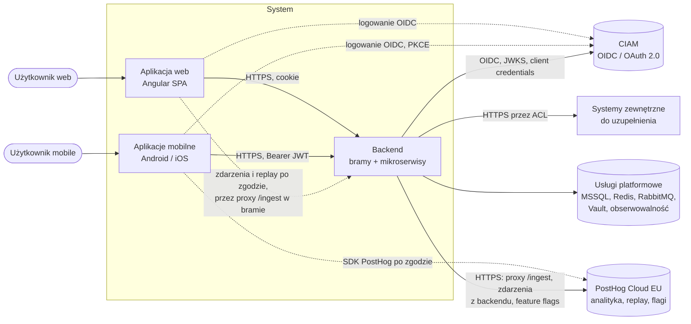

PostHog dostaje wyłącznie pseudonim użytkownika (`u_` + 32 znaki hex, HMAC-SHA256 z `sub`) i właściwości z listy dozwolonych;
nigdy `sub`, e-maila, nazwy ani danych z dziennika snu (ADR-0036).

Diagram powyżej pokazuje system tak, jak działa lokalnie (brama z `SuperApp.Gateway`). W super appce (ADR-0037–0041) system jest jedną
experience; na środowiskach organizacji miejsce `SuperApp.Gateway` zajmuje wspólna brama brzegowa:

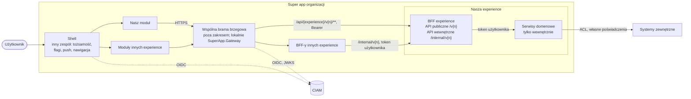

- Moduł woła **wyłącznie API publiczne** BFF swojej experience przez wspólną bramę (ADR-0039).
- BFF-y innych experience wołają **API wewnętrzne** naszego BFF, nigdy nasze serwisy domenowe; gwarancją jest NetworkPolicy
  (ADR-0041).
- Token użytkownika przechodzi bez zmian przez BFF do serwisów i nie opuszcza granicy zaufania; systemy zewnętrzne wołamy własnymi
  poświadczeniami przez ACL (ADR-0040).

W repozytorium przepływ jest kompletny: lokalna brama kieruje `/api/example/v{n}/**` do BFF `example-bff` (z usunięciem prefiksu
`/api/example`), a BFF woła Knowledge i SleepDiary z tokenem użytkownika. Ścieżki `/internal/...` nie są routowane przez bramę
(ADR-0038, ADR-0039).

### 3.2 Interfejsy zewnętrzne

| Partner | Kierunek | Protokół | Cel |
|---|---|---|---|
| Przeglądarka (SPA) | do systemu | HTTPS, ciasteczko sesyjne `HttpOnly` | Interfejs użytkownika web |
| Aplikacje mobilne | do systemu | HTTPS, `Authorization: Bearer` | Interfejs użytkownika mobile |
| CIAM | z systemu | OIDC (Authorization Code + PKCE), JWKS, client credentials, Back-Channel Logout | Uwierzytelnienie, tokeny |
| Systemy zewnętrzne | z systemu | HTTPS (Refit, za ACL) | Zewnętrzne API partnerów biznesowych i dostawców (konfigurowane per integracja) |
| Wspólna brama brzegowa (dev, test, prod; lokalnie `SuperApp.Gateway`) | do systemu | HTTP w klastrze, `Authorization: Bearer` z tokenem użytkownika | Ruch modułu do API publicznego BFF experience (`/api/{experience}/v{n}/**`); sesja, CSRF i unieważnianie po stronie bramy (ADR-0037) |
| BFF-y innych experience | do systemu | HTTP w klastrze, token użytkownika (wyjątkowo client credentials) | API wewnętrzne BFF `/internal/v{n}/...` (ADR-0039, ADR-0040) |
| Usługi platformowe | z systemu | TDS (MSSQL), RESP/TLS (Redis), AMQPS (RabbitMQ), OTLP | Dane, cache, zdarzenia, telemetria |
| PostHog Cloud EU (`eu.i.posthog.com`, `eu-assets.i.posthog.com`) | z systemu | HTTPS: proxy `/ingest` z bramy `bff-web` (zdarzenia i nagrania przeglądarki, biblioteka JS), API zdarzeń (forwarder), ewaluacja flag (serwisy) | Analityka produktowa, session replay, feature flags (ADR-0036) |
| PostHog Cloud EU | z aplikacji mobilnych | HTTPS, oficjalne SDK (`posthog-android`, `posthog-ios`), poza bramami | Analityka i flagi w aplikacjach mobilnych; identyfikator z `GET /analytics/id` |

### 3.3 Zakres

**W zakresie zespołu:** jedna experience: moduł klienta (web, mobile), BFF experience (`src/Bff/{Experience}.Bff`) i serwisy domenowe; obrazy
kontenerów, charty Helm, migracje bazy, kontrakty OpenAPI (API publiczne i wewnętrzne BFF, kontrakty serwisów) i zdarzeń
integracyjnych, wymagania wobec usług i wspólnej bramy, katalog zdarzeń produktowych z backendu i definicje feature flags w kodzie.
`SuperApp.Gateway` i jego chart są w repozytorium jako lokalny zamiennik wspólnej bramy, nie jako artefakt wydania (ADR-0037).

**Poza zakresem:** wspólna brama brzegowa na środowiskach dev, test i prod (ADR-0037), shell super appki i inne experience
(dashboard i pozostałe moduły są dla nas tylko konsumentami API wewnętrznego, ADR-0038), budowa i utrzymanie klastra i usług
platformowych, konfiguracja CIAM,
wykonanie migracji produkcyjnych (ADR-0016, ADR-0004), umowa powierzenia z PostHog, zakładanie
i konfiguracja projektów PostHog (m.in. odrzucanie adresów IP), polityka prywatności (ADR-0036).

---

## 4. Strategia rozwiązania

| Cel / problem | Podejście | ADR |
|---|---|---|
| Niezależna ewolucja obszarów biznesowych | Mikroserwis = bounded context; Clean DDD; zakaz współdzielenia modelu domeny | 0002 |
| Rozdzielenie obciążeń zapisu i odczytu | CQRS: `WriteDbContext` z agregatami, `ReadDbContext` z read modelami; handlery zapytań w Infrastructure | 0003, 0026 |
| Brak tokenów w przeglądarce | Wspólna brama brzegowa (wymaganie); lokalnie `SuperApp.Gateway` na YARP: ciasteczko + sesja po stronie serwera | 0006, 0011, 0013, 0037 |
| Jednostka własności zespołu | Experience: moduł + BFF experience (orkiestracja, kształt danych dla modułu) + 1..n serwisów domenowych; szablony nie zakładają liczby experience | 0038 |
| Stabilny kontrakt dla modułu i innych zespołów | API publiczne BFF (`/v{n}`, konsument: moduł) i wewnętrzne (`/internal/v{n}`, konsumenci: BFF-y innych experience); serwisy domenowe tylko wewnętrznie | 0039 |
| Kontrola dostępu do danych w wywołaniach synchronicznych | Przekazywanie tokenu użytkownika bez zmian (`AddUserTokenForwarding`), reguły zasobu w odbiorcy; client credentials tylko dla wywołań systemowych (`{serwis}.system.*`, `{experience}.internal.system.*`); token exchange jako otwarta furtka (`IDownstreamTokenProvider`) | 0040, 0042 |
| Zero trust | Każdy serwis (i BFF) waliduje JWT z `ClockSkew` 30 s; NetworkPolicy per experience jako gwarancja izolacji; scope-based authorization | 0007, 0012, 0041 |
| Luźne powiązanie kontekstów | Zdarzenia integracyjne przez RabbitMQ; outbox/inbox; sagi | 0005 |
| Atomowość zmian i publikacji | Dispatch zdarzeń domenowych w Unit of Work + EF outbox w jednej transakcji; praca wymagająca zatwierdzonej zmiany (unieważnienie cache) po commicie | 0005, 0020, 0027 |
| Jawna obsługa błędów biznesowych | `Result`/`Error` w całym systemie, także dla wyścigów na unikalnych indeksach; mapowanie na `ProblemDetails` | 0015 |
| Silny model domeny | Ręcznie pisane silne ID i value objects, wspólna infrastruktura konwersji | 0023, 0024 |
| Zgodność klientów z kontraktami | OpenAPI 3.0 commitowane w repo, ze stabilnym `operationId`, `securitySchemes` Bearer i `x-abstract`; klienci generowani (Refitter w BFF, generatory mobile/web z kontraktu publicznego BFF) | 0009, 0014, 0019, 0039 |
| Odporność na awarie zależności | Resilience HTTP, cache L1/L2 z fail-safe, sondy bez zależności w readiness | 0014, 0018, 0020 |
| Bezpieczne zmiany schematu | Jeden Migrator (dev/test), skrypty DBA (prod), expand/contract | 0004, 0021 |
| Zmiana tras bez wdrażania bramy | Konfiguracja YARP w MSSQL, zmieniana migracjami, walidowana i cache'owana | 0022 |
| Egzekwowanie zasad | Analizatory Roslyn (`SuperApp.Analyzers`, IDE0130), testy architektury | 0015, 0023, 0025, 0027, 0032, 0033 |
| Zrozumiały kod dla nowych osób | Jeden typ na plik, katalogi według odpowiedzialności, kompletna dokumentacja XML po angielsku | 0032, 0033 |
| Pełny zestaw do pracy lokalnej | docker compose: infrastruktura + cała aplikacja, te same obrazy co na środowiskach | 0031, 0034 |
| Niezależność od licencji komercyjnych | MediatR 12.5 i MassTransit 8.5 (Apache-2.0), porty ograniczające koszt wymiany | 0035 |
| Analityka produktowa bez wpływu na serwisy domenowe | PostHog Cloud EU; zdarzenia z backendu przez osobny forwarder subskrybujący istniejące zdarzenia integracyjne; pseudonim zamiast tożsamości | 0036 |
| Stopniowe udostępnianie funkcji | Port `IFeatureFlags` z flagami deklarowanymi w kodzie i bezpieczną wartością domyślną; implementacja na PostHog | 0036 |

---

## 5. Widok struktury

### 5.1 Kontenery

Diagram pokazuje kontenery, które istnieją w repozytorium. Bramy `bff-web` i `gateway-mobile` to lokalny zamiennik wspólnej bramy
brzegowej (ADR-0037); ich jedyna trasa experience prowadzi do BFF (`{experience}-bff`, 5.2), a dopiero BFF woła serwisy domenowe.

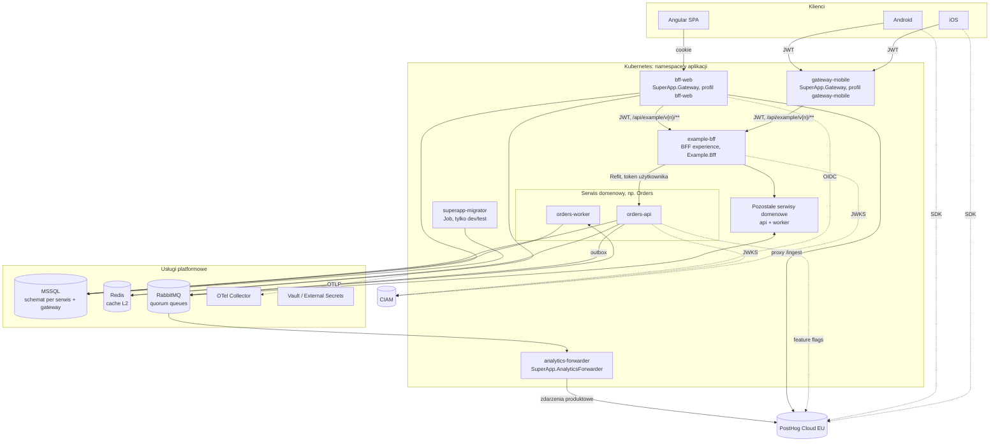

| Kontener | Odpowiedzialność | Technologia |
|---|---|---|
| **Angular SPA** | Interfejs web; komunikacja wyłącznie z `bff-web`; nagłówek `X-CSRF: 1` | Angular, SCSS, klient generowany z OpenAPI |
| **Aplikacje mobilne** | Interfejs mobile; logowanie przez systemową przeglądarkę (PKCE) | Kotlin + AppAuth-Android; Swift + AppAuth-iOS; klienci z OpenAPI |
| **bff-web** | Lokalny zamiennik wspólnej bramy (profil web, nazwa historyczna, to nie BFF experience): logowanie OIDC, sesja po stronie serwera, CSRF, zamiana ciasteczka na token, routing; proxy analityki `/ingest` | YARP, ASP.NET Core |
| **gateway-mobile** | Lokalny zamiennik wspólnej bramy (profil mobile): walidacja JWT (`ClockSkew` 30 s), autoryzacja per trasa, routing; pseudonim analityczny `GET /analytics/id` | YARP, ASP.NET Core |
| **{experience}-bff** | BFF experience (5.2): API publiczne `/v{n}` dla modułu i wewnętrzne `/internal/v{n}` dla BFF-ów innych experience; woła serwisy domenowe swojej experience z tokenem użytkownika; bez bazy | ASP.NET Core MVC, Refit + Refitter, `Microsoft.Extensions.Http.Resilience` |
| **{serwis}-api** | Komendy i zapytania przez HTTP (REST, MVC); feature flags przez `IFeatureFlags` | ASP.NET Core MVC, MediatR, EF Core |
| **{serwis}-worker** | Konsumenci zdarzeń integracyjnych, sagi, dostarczanie outboxa | MassTransit, MediatR, EF Core |
| **analytics-forwarder** | Subskrybuje zdarzenia integracyjne serwisów i wysyła do PostHog zdarzenia produktowe z katalogu `ProductEventNames`; bez bazy, domeny i inboxu | ASP.NET Core, MassTransit, SDK `PostHog` |
| **superapp-migrator** | Migracje wszystkich schematów (dev/test) | EF Core |

Diagram pokazuje przykładowy serwis; obecnie wdrażane serwisy to `knowledge` i `sleepdiary` (po `{serwis}-api` i `{serwis}-worker`),
a BFF to `example-bff` przykładowej experience `example`.
Serwisy domenowe nie wysyłają zdarzeń analitycznych i nie zależą od PostHog: flagi czytają przez port, a zdarzenia produktowe
powstają w forwarderze z ich istniejących zdarzeń integracyjnych (ADR-0036).

### 5.2 Experience i BFF experience

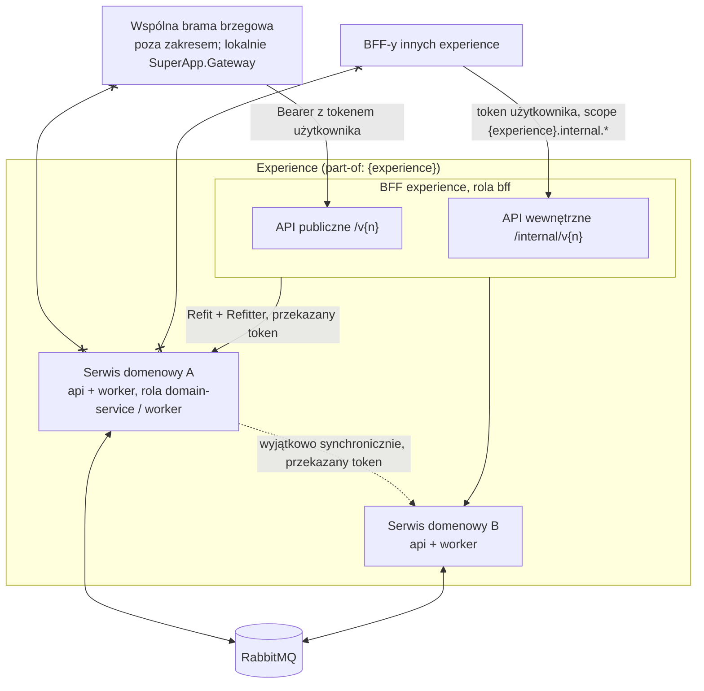

| Element | Odpowiedzialność | Stan |
|---|---|---|
| **Moduł klienta** | Interfejs experience w shellu super appki; woła wyłącznie API publiczne swojego BFF przez wspólną bramę | web i mobile w repozytorium; kontrakt z shellem: ADR-0045 (proponowany) |
| **BFF experience** | Bezstanowy host ASP.NET Core MVC bez bazy, modelu domeny i migracji; orkiestruje wywołania serwisów **swojej** experience (klienci Refit + Refitter), kształtuje dane dla modułu, może cache'ować odczyty (`HybridCache`); waliduje JWT jak każdy serwis; sprawdza uprawnienia wcześniej (UX), ale nie jest jedyną linią obrony; nie zmienia stanu kilku domen w jednym żądaniu (procesy między domenami przez zdarzenia i sagi); woła inne BFF-y tylko przez ich API wewnętrzne | `src/Bff/Example.Bff` (experience `example`), szablon `src/Tools/SuperApp.Cli/Templates/superapp-bff` (`dotnet new superapp-bff -n {Experience} -o src/Bff`), chart `deploy/helm/superapp-bff`, reguły architektury 12–14 (ADR-0038) |
| **API publiczne BFF** | `/v{n}/...`, konsument: wyłącznie moduł experience; dostępne przez bramę pod `/api/{experience}/v{n}/**`; zmiana łamiąca = nowe `/v{n+1}` | fasada Knowledge (`/v1/knowledge/...`) i SleepDiary (`/v1/sleepdiary/...`), 30 operacji odpowiadających `/v1/...` serwisów; endpoint komponowany `GET /v1/me/summary`; kontrakt `openapi/Example.Bff_public.json` (ADR-0039) |
| **API wewnętrzne BFF** | `/internal/v{n}/...`, konsumenci: BFF-y innych experience; tylko w klastrze, nigdy przez bramę; zmiany wyłącznie wstecznie zgodne; operacje projektowane pod konsumenta (np. widget); scope `{experience}.internal.*` | `GET /internal/v1/widgets/sleep-summary`, polityka scope `example.internal.read`; kontrakt `openapi/Example.Bff_internal.json` (ADR-0039, ADR-0040) |
| **Serwisy domenowe** | Bounded contexts (5.3); API `/v{n}/...` tylko wewnętrzne experience: przyjmują ruch wyłącznie od BFF i serwisów tej samej experience | Knowledge, SleepDiary; lokalna brama nie ma do nich tras |

Reguły wspólne dla wielu experience:

- Experience w repozytorium to jeden projekt BFF i 1..n serwisów domenowych. Kolejna experience (nasza albo innego zespołu) powstaje
  z tych samych szablonów; nic nie zakłada, że experience jest tylko jedna.
- Logika biznesowa zostaje w serwisach domenowych; BFF tylko orkiestruje. Wywołania równoległe w BFF mają timeout per wywołanie
  i obsługę częściowej niedostępności.
- Brama ma jedną trasę na experience (do jej BFF); nowy serwis domenowy nie dostaje trasy, tylko klienta w BFF swojej experience.

Budowa BFF (`src/Bff/{Experience}.Bff`, wzorzec `Example.Bff`):

| Element | Zawartość |
|---|---|
| `Program.cs` | `AddAppServiceDefaults("{experience}-bff")` (wariant bez bazy), `AddAppApi` (walidacja JWT, audience `{experience}-bff`), dwa dokumenty OpenAPI, polityka scope API wewnętrznego (`RequireScope`) z `ScopeAuthorizationResultHandler` (odmowa jako `403 auth.missing_scope`), `AddDownstreamApi<I{Serwis}Api>(configuration, "{Serwis}").AddUserTokenForwarding()` dla każdego serwisu |
| `Clients/{Serwis}/` | Plik `{serwis}.refitter` wskazujący commitowany kontrakt serwisu i wygenerowany kod w `Generated/` (Refitter 2.3.0, narzędzie w `.config/dotnet-tools.json`); typy **public**, bo są częścią kontraktu BFF |
| `Controllers/{Serwis}/` | Akcje przekazujące: `this.ToActionResult(await client.XAsync(...))`; ścieżka BFF `/v1/{serwis}/...` odpowiada `/v1/...` serwisu |
| `Controllers/Experience/` | Endpointy komponowane z wielu serwisów; `GET /v1/me/summary` ładuje części odpowiedzi równolegle przez `PartialResponseFetcher` (`SuperApp.Framework.Infrastructure.Http.Downstream`) (limit 2 s na część odpowiedzi, status części odpowiedzi `Ok`, `Forbidden`, `Unavailable`, `Timeout`), odpowiedź zawsze 200 |
| `Controllers/Internal/` | API wewnętrzne `/internal/v{n}/...` z `[Authorize(Policy = ...)]` na scope `{experience}.internal.*` |
| `Hosting/BffOpenApiDocuments.cs` | Podział na dokumenty `public` i `internal` po ścieżce (`internal/`), prefiks nazwy serwisu w nazwach schematów typów z klientów |
| `Security/{Experience}BffScopes.cs` | Stałe scope sprawdzanych przez sam BFF (np. `example.internal.read`) |
| `openapi/` | Commitowane kontrakty `{Experience}.Bff_public.json` i `{Experience}.Bff_internal.json`, generowane przy buildzie |

- BFF **nie waliduje** treści żądań (`ModelValidatorProviders.Clear()`, bez domyślnego `[Required]` dla typów nienullowalnych; wejście niemożliwe do powiązania, np. nieznana wartość enuma w query, daje `400 request.malformed` z BFF, z kluczami `errors` z nazwami parametrów):
  walidacja i kody błędów należą do serwisów, a ich `400` z `code` przechodzi do modułu bez zmian.
- Odpowiedź serwisu (status, ciało `application/problem+json` z `code` i `traceId`) jest przekazywana bez zmian
  (`DownstreamResponseExtensions`). Niedostępność serwisu po wyczerpaniu odporności daje `503 downstream.unavailable`, przekroczenie
  czasu `504 downstream.timeout` (`DownstreamUnavailableExceptionHandler`, EventId 220).
- Każde wejście do API wewnętrznego (po autoryzacji) zostawia wpis audytu z szablonem trasy i klientem wołającym z claimu `azp`
  (`InternalApiCallAudit`, globalny filtr MVC, EventId 230). Część odpowiedzi komponowanej o statusie innym niż `Ok` loguje
  ostrzeżenie (EventId 6001 w `ExperienceSummaryController`; zakres `Example.Bff` 6000–6999).
- Publiczne API BFF nie wymaga własnego scope: brama sprawdza gruboziarniście dowolny scope experience, a serwis dokładny scope
  operacji i reguły zasobu.

### 5.3 Struktura serwisu domenowego

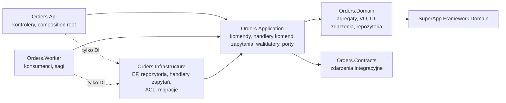

| Projekt | Zawartość | Zależy od |
|---|---|---|
| `{Serwis}.Domain` | Katalog per agregat: agregat, silne ID, błędy (`{Agregat}Errors`), interfejs repozytorium, `Events/` (zdarzenia domenowe); `Common/` dla pojęć współdzielonych w kontekście | `SuperApp.Framework.Domain` |
| `{Serwis}.Application` | `Features/{Agregat}/{PrzypadekUzycia}/`: komenda lub zapytanie, handler komendy, walidator, DTO (każdy w osobnym pliku); `IntegrationEvents/` (tłumaczenie zdarzeń domenowych na integracyjne); porty | Domain, Contracts, `SuperApp.Framework.Application` |
| `{Serwis}.Infrastructure` | `Features/{Agregat}/` (**handlery zapytań**), `Caching/` (klucze, tagi, unieważnianie po commicie), `Persistence/Write/{Configurations, Repositories}`, `Persistence/Read/{Models, Configurations}`, ACL (Refit), `Migrations/` | Application, `SuperApp.Framework.Infrastructure` |
| `{Serwis}.Api` | Cienkie kontrolery MVC: HTTP ↔ `ISender.Send`, mapowanie `Result` → odpowiedź / `ProblemDetails`, metadane odpowiedzi dla kontraktu OpenAPI | Application (+ Infrastructure w composition root) |
| `{Serwis}.Worker` | Cienkie konsumenty MassTransit delegujące do komend, sagi | Application (+ Infrastructure w composition root) |
| `{Serwis}.Contracts` | Zdarzenia integracyjne (published language), wyłącznie typy prymitywne, wersjonowany pakiet | brak |

Reguły zależności są wymuszane referencjami projektów, analizatorami i testami architektury
(ADR-0002, ADR-0025).

### 5.4 Wewnętrzny framework `SuperApp.Framework`

Kod techniczny wspólny dla wszystkich serwisów, **bez pojęć biznesowych**.

| Projekt | Przestrzenie nazw i zawartość |
|---|---|
| `SuperApp.Framework.Domain` | `Aggregates` (`AggregateRoot` z `Raise`, `Entity`, `IAggregateRoot`) · `Events` (`IDomainEvent`) · `Results` (`Result` z `Error?`, `Result<T>` z `TryGetValue`, bez `Value`; `Error`, `ErrorType`) · `ValueObjects` (`ISingleValueObject<TSelf,TValue>`, `IStronglyTypedId<TSelf,TValue>`) |
| `SuperApp.Framework.Application` | `Messaging` (`ICommand`, `IQuery`, handlery) · `Behaviors` (logowanie, autoryzacja, walidacja, transakcja) · `Events` (`IDomainEventHandler<T>`, `IDomainEventDispatcher`, `IIntegrationEventPublisher`) · `Persistence` (`IUnitOfWork` z `OnCommitted`) · `Security` (`ICurrentUser`, `RequiresScope`, `AuthorizationErrors`) · `FeatureFlags` (`FeatureFlag(Key, DefaultValue)`, port `IFeatureFlags.IsEnabledAsync`) · `Pagination` · `Time` (`IClock`) · `Telemetry` |
| `SuperApp.Framework.Infrastructure` | `Persistence` (`WriteDbContextBase`: Unit of Work, dispatch zdarzeń, mapowanie naruszeń unikalnych indeksów na `Conflict`, interceptor akcji po commicie; `ReadDbContextBase`; `Conventions` dla ID i VO) · `Events` (dispatcher) · `Messaging` (MassTransit, outbox/inbox; `AddAppEventSubscriber` dla subskrybenta bez bazy) · `Caching` (`FailSafeCache`) · `Analytics` (`AnalyticsOptions`, `AnalyticsIdentity`, `HybridCacheFeatureFlags`, `ConfigurationFeatureFlags`, `AddAppAnalytics`, `AddAppFeatureFlags`) · `Hosting` (także `AddAppServiceDefaults` bez bazy), `HealthChecks`, `Telemetry` · `Api` (`Result` → HTTP; `ProblemDetailsConventions`: `code` i `traceId` w każdej odpowiedzi błędu, ADR-0044) · `OpenApi` (OpenAPI 3.0, schematy ID/VO, `code`/`traceId` w `ProblemDetails`) · `Http/Downstream` (`AddDownstreamApi<T>`: klient Refit z adresem `Downstream:{nazwa}:BaseAddress`, standardowa odporność z ponowieniami tylko metod bezpiecznych (GET, HEAD, OPTIONS), daty ISO 8601 w ścieżce i zapytaniu) · `Http/UserContext` (`AddUserTokenForwarding`, port `IDownstreamTokenProvider` jako furtka token exchange, ADR-0040) · `Http/ClientCredentials` (`AddClientCredentialsToken` dla wywołań systemowych) · `Api` także `DownstreamResponseExtensions.ToActionResult` i `DownstreamUnavailableExceptionHandler` (`503`/`504`) · `Security` (`ScopePolicyExtensions.RequireScope` dla hostów bez MediatR, `ScopeAuthorizationResultHandler`: odmowa polityki jako `403 auth.missing_scope`; `InternalApiCallAudit`: audyt wejść do API wewnętrznego BFF, EventId 230) · `Json` (`PolymorphicDiscriminatorProperty`) · `OpenApi` także `operationId` = `{Controller}_{Action}`, `securitySchemes` Bearer, `x-abstract` · `Time` · `ValueObjects` (JSON) |
| `SuperApp.Framework.Testing` | `ResultAssert` (`Success`, `Failure`) i `ResultAssertionException`: rozpakowanie wyniku w testach; referowany wyłącznie przez projekty testów (ADR-0047, reguła architektury 15) |

Każdy publiczny typ Frameworku ma pełną dokumentację XML z częścią odpowiedzi `remarks` i przykładami z repozytorium; służy jako wzorzec
dokumentacji całego kodu (ADR-0033).

Analityka we Frameworku (ADR-0036):

- `AddAppAnalytics` rejestruje opcje sekcji `Analytics` z walidacją przy starcie, `AnalyticsIdentity` i (przy włączonej analityce)
  klienta PostHog; używają go brama i forwarder.
- `AddAppFeatureFlags` woła `AddAppAnalytics` i rejestruje `IFeatureFlags`; każdy serwis (i szablon) wywołuje ją w `Add{Serwis}Core`.
  Implementacja wymaga `ICurrentUser`, bo flagi są liczone dla pseudonimu bieżącego użytkownika.
- `AnalyticsIdentity.ForSubject(sub)` zwraca `u_` + 32 znaki hex z HMAC-SHA256(`Analytics:IdKey`, `sub`) albo `null`, gdy analityka
  jest wyłączona lub nie ma użytkownika; zdarzenia i flagi bez użytkownika używają identyfikatora `system`.
- `HybridCacheFeatureFlags` (zakres DI) czyta ewaluacje z `HybridCache` (L1 pamięć procesu + L2 Redis, ADR-0020); przy braku
  wpisu w cache odpytuje wewnętrzny serwis `analytics-forwarder` (`/internal/flags`). `AnalyticsForwarder` cyklicznie odświeża snapshot
  flag w tle z PostHog Cloud EU (EventId 9005/9006). Serwisy domenowe nie wykonują żadnego bezpośredniego ruchu wychodzącego (egress)
  do PostHog. Przy braku odpowiedzi lub nieznanej fladze zwraca wartość domyślną z kodu (EventId 400–401,
  metryka `superapp.feature_flags.fallbacks`). Bez analityki działa `ConfigurationFeatureFlags` (`FeatureFlags:{klucz}`).

Typy w każdym projekcie leżą w katalogach według tego, czego dotyczą (np. `SuperApp.Framework.Domain.Results`,
`SuperApp.Framework.Application.Messaging`, `{Serwis}.Infrastructure.Persistence.Write.Configurations`); przestrzeń nazw odpowiada
ścieżce katalogu, a jeden plik zawiera jeden typ (ADR-0032).

### 5.5 Bramy `SuperApp.Gateway`

**`SuperApp.Gateway` jest lokalnym zamiennikiem wspólnej bramy brzegowej** (ADR-0037). Działa w docker compose, w testach E2E i przy pracy
z IDE i pozwala uruchomić pełny przepływ bez infrastruktury organizacji. Na dev, test i prod ruch do experience przychodzi ze wspólnej
bramy; chart `superapp-gateway` i migracje schematu `gateway` są wzorcem i narzędziem lokalnym, nie częścią wydania experience. Nazwy
profili (`bff-web`, `gateway-mobile`) są historyczne: `bff-web` to profil bramy (token handler), a nie BFF experience (5.2).

Zachowanie lokalnej bramy jest **specyfikacją wymagań** wobec wspólnej bramy: brak tokenów w przeglądarce, sesja po stronie serwera
i ciasteczko `__Host-` (HttpOnly, Secure, SameSite=Strict), CSRF, wylogowanie z kontrolą `sid` i back-channel logout, usuwanie
`Cookie` i `X-User-*`, dołączanie `Authorization: Bearer` z tokenem użytkownika, walidacja JWT z `ClockSkew` 30 s, kierowanie ruchu
modułu wyłącznie do API publicznego BFF (`/api/{experience}/v{n}/**`), unieważnianie tokenów po wylogowaniu, limit żądań z partycją po
rzeczywistym kliencie oraz opcjonalnie proxy `/ingest`. Zmiany w lokalnej bramie są dopuszczalne tylko wtedy, gdy odwzorowują wspólną
bramę albo wymaganie wobec niej; logika experience należy do BFF (ADR-0037, ADR-0038).

Jeden projekt, dwa profile i dwa wdrożenia (ADR-0006):

| Element | bff-web | gateway-mobile |
|---|---|---|
| Uwierzytelnienie klienta | Ciasteczko + OIDC (Authorization Code + PKCE, confidential client) | JWT Bearer (walidacja przez JWKS CIAM) |
| Sesja | Po stronie serwera (`ITicketStore` w MSSQL) | brak |
| Token do serwisów | Access token z sesji, odświeżany przed wygaśnięciem pod blokadą sesji w MSSQL (bezpieczne między replikami) | Ten sam token klienta |
| CSRF | Wymagany `X-CSRF: 1` na `/api/*` | nie dotyczy |
| Endpointy własne | `/bff/login`, `GET /bff/logout?sid=…` (nawigacja przeglądarki, `sid` jako ochrona CSRF), `/bff/user` (zwraca `logoutUrl` i `analyticsId`) | `GET /analytics/id` (pseudonim analityczny, wymaga tokenu) |
| Proxy analityki (ADR-0036) | `/ingest/{**path}` → `Analytics:Host`, `/ingest/static/{**path}` → `Analytics:AssetsHost`; anonimowe, limit `per-user`, tylko przy włączonej analityce | brak (SDK mobilne łączą się z PostHog bezpośrednio) |
| Wspólne | Autoryzacja per trasa (scope), usuwanie `X-User-*`, rate limiting, konfiguracja tras z bazy z walidacją adresów (tylko `http://{serwis}.{namespace}.svc.cluster.local:{port}`, ADR-0022), metryki per trasa |

Dane bramy (sesje, klucze Data Protection, konfiguracja tras) leżą w schemacie `gateway`
(ADR-0013, ADR-0022).

Proxy `/ingest` jest **zdefiniowane w kodzie bramy** (`SuperApp.Gateway/Analytics/AnalyticsEndpoints.cs`, YARP `MapForwarder`), a nie w
konfiguracji tras w bazie: trasy z bazy prowadzą wyłącznie do Service'ów w klastrze i zawsze dostają token użytkownika, więc
ADR-0022 i ograniczenie `CK_Destinations_ClusterAddress` pozostają bez zmian. Proxy usuwa z żądania `Cookie`, `Authorization`,
`X-User-*`, `X-CSRF`, `X-Forwarded-*` i `Forwarded`, a z odpowiedzi `Set-Cookie`. Przy wyłączonej analityce ścieżka nie istnieje
i domyślna polityka bramy odpowiada 401 (ADR-0036).

Proxy `/ingest`, `analyticsId` w `/bff/user` i `GET /analytics/id` istnieją dziś w lokalnej bramie. Zgodnie z ADR-0037 są
**wymaganiem wobec wspólnej bramy** albo, jeśli wspólna brama ich nie zapewni, przyszłymi endpointami BFF experience (np.
`GET /v1/analytics/id`), a `/ingest` przejdzie do konfiguracji modułu. Decyzja należy do uzgodnienia z właścicielem wspólnej bramy.

Trasy: konfiguracja tras w bazie (`ProxyConfigurationSeed`) ma w obu profilach jedną trasę na experience, dziś
`/api/example/v{version:int}/{**rest}` do klastra `example` (`http://example-bff.example.svc.cluster.local:8080`), z polityką
`GatewayPolicies.Example` (dowolny scope `knowledge.*` lub `sleepdiary.*`), transformem `PathRemovePrefix /api/example`, limitem
`per-user` i limitem czasu 30 s. Wcześniejsze trasy `/api/knowledge/**` i `/api/sleepdiary/**` usunęła migracja
`RouteExperienceThroughBff` (tylko dane, bez zmiany schematu). Ścieżki `/internal/...` nie pasują do żadnej trasy, a test bramy
sprawdza, że żadna trasa nie zawiera `internal` (ADR-0039).

### 5.6 Narzędzia i projekty pomocnicze

| Projekt | Rola | ADR |
|---|---|---|
| `SuperApp.Migrator` | Uruchamia migracje `WriteDbContext` wszystkich serwisów i bramy (dev/test); źródło skryptów idempotentnych dla DBA | 0004 |
| `SuperApp.Analyzers` | Analizatory Roslyn: **APP001** zignorowany `Result`, **APP002** `default`/`new()` dla ID i VO, **APP003** zakazane API (`INotification`, `IPublisher`, `IMediator`, synchroniczne `SaveChanges`), **APP004** jeden typ na plik, **APP005** nazwa pliku = nazwa typu, **APP006** kompletna dokumentacja XML publicznego API | 0015, 0023, 0024, 0027, 0032, 0033 |
| `SuperApp.ArchitectureTests` | Reguły architektury dla całego rozwiązania (ArchUnitNET), w tym reguły 10 (forwarder zależy od serwisów wyłącznie przez `Contracts`), 11 (SDK PostHog tylko we Frameworku i forwarderze), 12 (BFF nie referuje serwisów, także `Contracts`, ani innych BFF), 13 (BFF bez `DbContext`) i 14 (serwisy nie referują BFF) | 0025, 0036, 0038 |
| `Example.Bff.Tests` | Podział kontraktów public/internal, `operationId` i `security` w każdej operacji, przekazywanie odpowiedzi serwisu bez zmian, przekazywanie tokenu użytkownika, częściowe renderowanie (`PartialResponseFetcher`), klienci z `AddDownstreamApi` (daty ISO, polimorficzne bloki treści), odmowa polityki scope jako `403 auth.missing_scope` (`ScopeAuthorizationResultHandler`) | 0038, 0039, 0040 |
| `SuperApp.AnalyticsForwarder.Tests` | Pseudonim, walidacja opcji `Analytics`, flagi z konfiguracji, rejestracja bez `ICurrentUser`, mapowanie konsumentów na zdarzenia produktowe (test harness MassTransit) | 0036 |
| `SuperApp.Analyzers.Tests`, `SuperApp.Gateway.Tests` | Testy reguł APP001–APP006; testy bramy na MSSQL (konfiguracja i walidacja tras, sesje bramy `bff-web`, odświeżanie tokenów między replikami, wylogowanie) | 0011, 0013, 0015, 0022 |
| `Directory.Build.targets` | Opisy DTO z projektów Application w kontrakcie OpenAPI; etykieta wersji kontraktu `3.0.3` | 0019, 0033 |
| `deploy/local` | Lokalne środowisko docker compose, realm Keycloak, bootstrap bazy | 0031, 0034 |
| `src/Tools/SuperApp.Cli/Templates/superapp-service` | Szablon `dotnet new superapp-service` nowego serwisu | 0030 |
| `src/Tools/SuperApp.Cli/Templates/superapp-bff` | Szablon `dotnet new superapp-bff -n {Experience} -o src/Bff`: host BFF bez bazy, dwa dokumenty OpenAPI (publiczny i wewnętrzny), polityka scope `{experience}.internal.read`, projekt testów z testem podziału kontraktów; klientów serwisów dodaje się po wygenerowaniu | 0038, 0039 |

### 5.7 Forwarder analityki `SuperApp.AnalyticsForwarder`

Osobny proces (ADR-0036), który tłumaczy zdarzenia integracyjne serwisów na zdarzenia produktowe PostHog.

| Element | Opis |
|---|---|
| Zależności | Wyłącznie `{Serwis}.Contracts` serwisów i `SuperApp.Framework.Infrastructure` (reguła architektury 10); bez bazy, domeny, komend i inboxu |
| Host | `AddAppServiceDefaults("analytics-forwarder")` (wariant bez bazy), `AddAppWorker`, `AddAppAnalytics`, `AddProductEventSink`, `AddAppEventSubscriber(…, "analytics", …)`: MassTransit bez outboxu i inboxu, retry 100/500/1000/5000 ms, quorum queues |
| Konsumenci (`Consumers/`) | `MaterialPublishedConsumer` → `knowledge_material_published` {`material_id`, `material_type`}; `MaterialArchivedConsumer` → `knowledge_material_archived` {`material_id`}; `CollectionArchivedConsumer` → `knowledge_collection_archived` {`collection_id`}; `SleepEntryRecordedConsumer` → `sleepdiary_entry_recorded` bez właściwości (podmiot: użytkownik) |
| Kolejki | `analytics-material-published`, `analytics-material-archived`, `analytics-collection-archived`, `analytics-sleep-entry-recorded` |
| Wysyłka (`Events/`) | `PostHogProductEventSink`: identyfikator to pseudonim użytkownika albo `system` z `$process_person_profile = false`, właściwości `source = backend` i `message_id`, znacznik czasu = czas faktu; `LoggingProductEventSink` przy wyłączonej analityce tylko loguje nazwę zdarzenia (EventId 9001); `PostHogFlushOnShutdown` opróżnia kolejkę klienta przy zatrzymaniu |
| Nazwy zdarzeń | `{serwis}_{obiekt}_{czasownik w czasie przeszłym}` w `ProductEventNames`; nowe się dodaje, istniejących się nie zmienia |

Konsumenci forwardera są wyjątkiem od zasady „konsument deleguje do komendy MediatR”: nie zmieniają stanu, tylko mapują
zdarzenie na listę dozwolonych właściwości. Ponowne dostarczenie wiadomości może powtórzyć zdarzenie analityczne, co dla
analityki jest akceptowalne.

### 5.8 Struktura repozytorium

```
/
├─ global.json, Directory.Build.props, Directory.Packages.props
├─ docs/                       # dokument architektury, ADR
├─ src/
│  ├─ Framework/               # SuperApp.Framework.Domain / .Application / .Infrastructure
│  ├─ Bff/                     # {Experience}.Bff (+ testy): BFF experience, dziś Example.Bff (ADR-0038)
│  ├─ Gateway/                 # SuperApp.Gateway: lokalny zamiennik wspólnej bramy brzegowej (ADR-0037)
│  ├─ Analytics/               # SuperApp.AnalyticsForwarder (+ testy)
│  ├─ Migrator/                # SuperApp.Migrator
│  ├─ Services/{Serwis}/       # Domain, Application, Infrastructure, Api, Worker, Contracts, tests/
│  └─ Tools/                   # SuperApp.Analyzers (+ testy); SuperApp.Cli (narzędzie dotnet superapp + Templates/: superapp-service, superapp-bff)
├─ tests/                      # SuperApp.ArchitectureTests
├─ web/                        # Angular
├─ mobile/android, mobile/ios
└─ deploy/
   ├─ helm/                    # superapp-service, superapp-bff, superapp-analytics-forwarder (etykiety experience), superapp-migrator; superapp-gateway tylko jako wzorzec lokalny
   ├─ sql/                     # bootstrap schematów, ról i użytkowników
   └─ local/                   # docker compose, realm Keycloak, bootstrap lokalnej bazy
```

---

## 6. Widok dynamiczny

Przebiegi 6.1–6.3, 6.8, 6.10 i 6.11 pokazują lokalną bramę `SuperApp.Gateway` (zamiennik wspólnej bramy brzegowej, ADR-0037). Brama
kieruje ruch experience wyłącznie do jej BFF; to, co BFF robi dalej, pokazują 6.14 (moduł → brama → BFF → serwisy) i 6.15 (API
wewnętrzne BFF).

### 6.1 Logowanie w aplikacji web

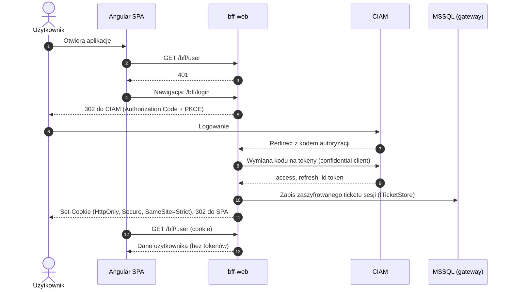

### 6.2 Wywołanie API z aplikacji web

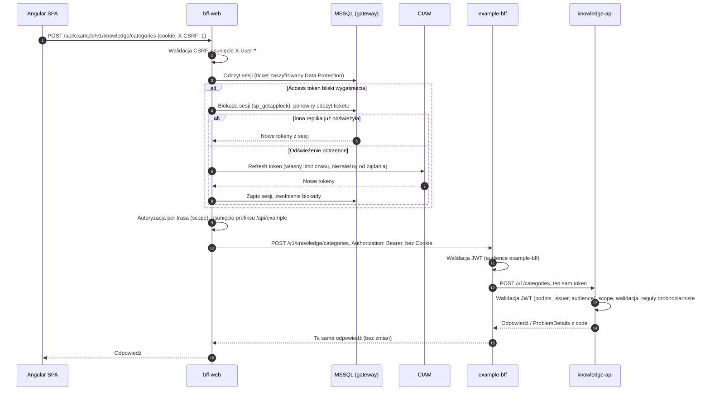

### 6.3 Wywołanie API z aplikacji mobilnej

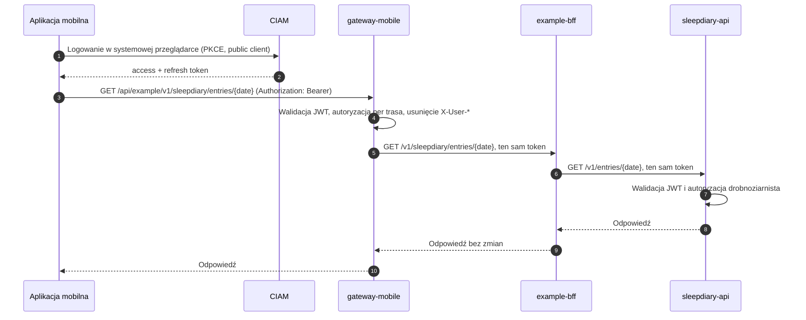

### 6.4 Przetwarzanie komendy z publikacją zdarzenia

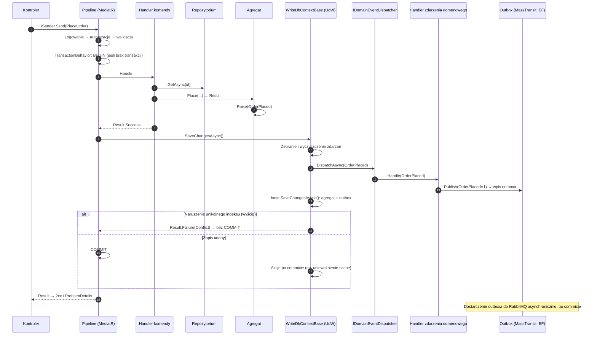

Handler komendy nie wywołuje zapisu: `categories.Add(category)` tylko rejestruje agregat w kontekście, a zapis i commit wykonuje
behavior transakcyjny po udanym wyniku. Przy błędzie (`Result.Failure`) transakcja jest wycofywana i zdarzenia nie są
publikowane. Naruszenie unikalnego indeksu przy równoległych żądaniach nie kończy się wyjątkiem (500), tylko błędem `Conflict`
z kodem kontekstu (np. `knowledge.category.slug_taken`). Akcje zarejestrowane przez `IUnitOfWork.OnCommitted` działają dopiero
po commicie i są porzucane przy wycofaniu (ADR-0015, ADR-0017, ADR-0020, ADR-0027).

### 6.5 Zapytanie z cache i fail-safe

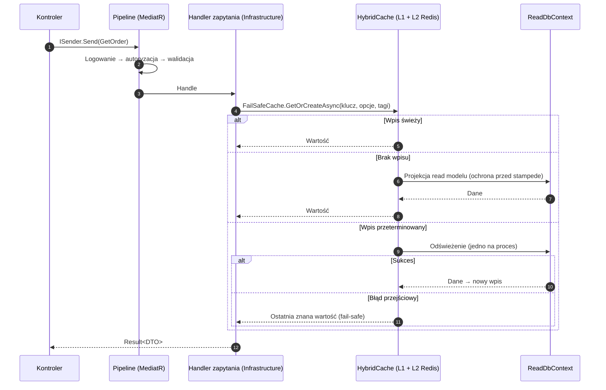

Wpisy są unieważniane tagami przez handlery zdarzeń domenowych, ale dopiero po commicie zmiany (`IUnitOfWork.OnCommitted`).
Wcześniejsze unieważnienie pozwalałoby równoległemu odczytowi zapisać w cache stare dane (ADR-0020).

### 6.6 Konsumpcja zdarzenia integracyjnego

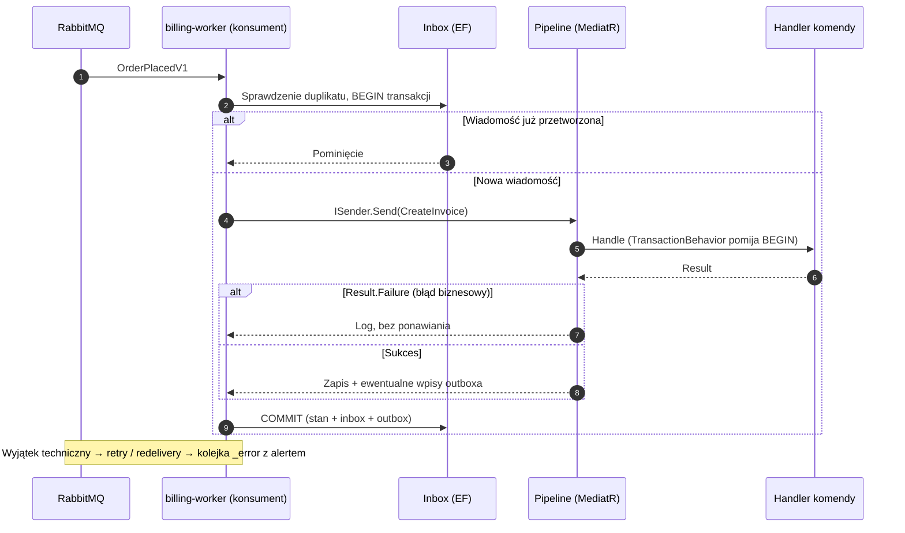

### 6.7 Wywołanie systemowe lub systemu zewnętrznego przez ACL

Przebieg dotyczy wywołań **bez kontekstu użytkownika**: wywołań systemowych (wyjątek, jawnie oznaczone operacje, scope
`{serwis}.system.*` między serwisami experience albo `{experience}.internal.system.*` dla API wewnętrznego BFF, audyt wołającego
`azp`, ADR-0040, ADR-0042) oraz systemów zewnętrznych wołanych własnymi poświadczeniami. Dziś w repozytorium nie ma żadnego takiego
wywołania; mechanizm to `AddClientCredentialsToken` z `Http/ClientCredentials`. Wywołania w
kontekście użytkownika przekazują token użytkownika (6.14, ADR-0040).

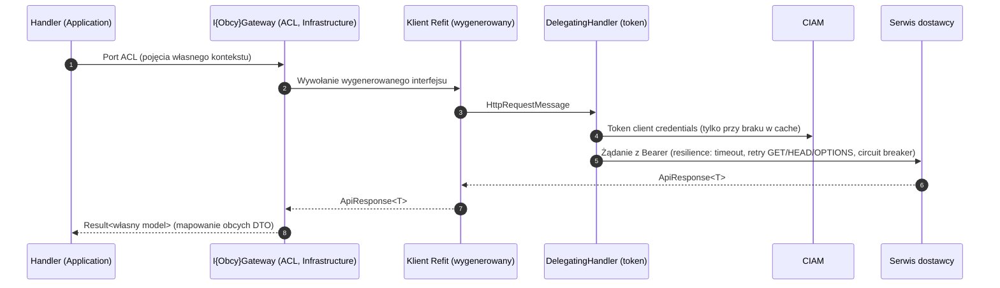

### 6.8 Zmiana konfiguracji tras bramy

```mermaid
sequenceDiagram
    autonumber
    participant DEV as Zespół
    participant REPO as Repozytorium
    participant MIG as SuperApp.Migrator / DBA
    participant DB as MSSQL (gateway)
    participant GW as Repliki bram
    participant L2 as Redis (L2)

    DEV->>REPO: Zmiana HasData + migracja, review
    REPO->>MIG: Wydanie (dev/test: Job, prod: skrypt DBA)
    MIG->>DB: Migracja: dane tras + wpis w __EFMigrationsHistory
    loop Co kilka sekund
        GW->>DB: Odczyt ostatniego MigrationId
    end
    GW->>DB: Nowy MigrationId → odczyt konfiguracji
    GW->>GW: Mapowanie i walidacja (adresy w klastrze, transformy, IConfigValidator)
    alt Konfiguracja poprawna
        GW->>GW: Podmiana konfiguracji (IChangeToken)
        GW->>L2: Zapis ostatniej poprawnej konfiguracji
    else Konfiguracja błędna
        GW->>GW: Pozostaje poprzednia; log i licznik raz na wersję migracji
    end
```

### 6.9 Wdrożenie wersji z migracją

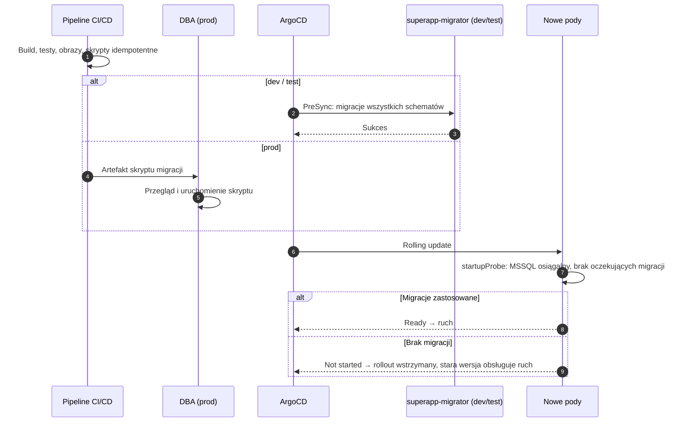

### 6.10 Wylogowanie z aplikacji web

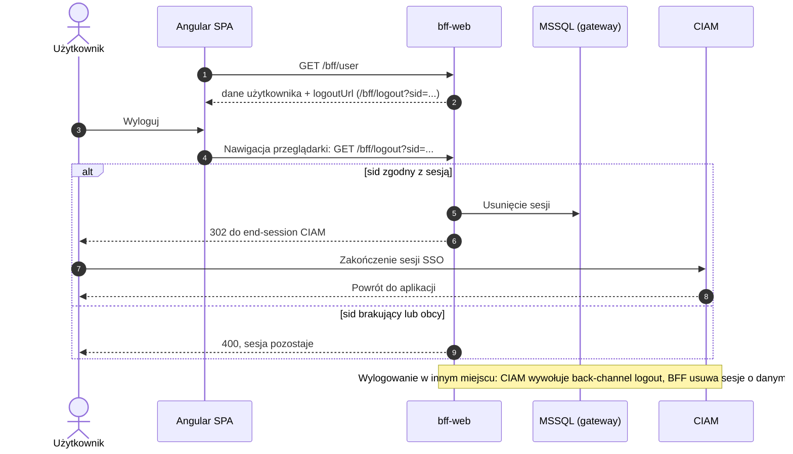

Wylogowanie jest nawigacją, a nie wywołaniem fetch: tylko nawigacja może podążyć za przekierowaniem do CIAM (inny origin).
Ochroną CSRF jest parametr `sid`, którego obca strona nie zna. Profil `bff-web` nie żąda `offline_access` (lokalny realm nie ma go
w scope opcjonalnych tego klienta), więc refresh token jest związany z sesją SSO i wylogowanie w CIAM kończy sesję w bramie (ADR-0011).

### 6.11 Analityka w aplikacji web

```mermaid
sequenceDiagram
    autonumber
    actor U as Użytkownik
    participant SPA as Angular SPA (posthog-js)
    participant BFF as bff-web
    participant PH as PostHog Cloud EU

    U->>SPA: Wyrażenie zgody na analitykę
    SPA->>SPA: Inicjalizacja posthog-js (api_host: /ingest)
    SPA->>BFF: GET /ingest/static/... (biblioteka), POST /ingest/... (zdarzenia, replay)
    BFF->>BFF: Usunięcie Cookie, Authorization, X-User-*, X-CSRF, X-Forwarded-*, Forwarded
    BFF->>PH: Przekazanie żądania (eu.i.posthog.com / eu-assets.i.posthog.com)
    PH-->>BFF: Odpowiedź
    BFF-->>SPA: Odpowiedź bez Set-Cookie
    SPA->>BFF: GET /bff/user (cookie)
    BFF-->>SPA: dane użytkownika + analyticsId (u_…) lub null
    alt analyticsId ustawiony
        SPA->>SPA: posthog.identify(analyticsId)
    else analityka wyłączona (null)
        SPA->>SPA: Brak inicjalizacji PostHog
    end
    Note over SPA: Wylogowanie: posthog.reset(); wycofanie zgody: wyłączenie zbierania i usunięcie lokalnego stanu SDK
```

Przed zgodą SDK nie zapisuje niczego w przeglądarce. Proxy jest same-origin, więc analityka nie wymaga domeny zewnętrznej w CSP
i nie jest blokowana przez blokery treści. Session replay maskuje wszystkie pola i teksty, a ekrany dziennika snu i każde miejsce
z danymi o zdrowiu są wyłączone z nagrywania. Aplikacje mobilne używają oficjalnych SDK bezpośrednio i pobierają pseudonim z
`GET /analytics/id` bramy mobilnej (ADR-0036).

### 6.12 Zdarzenie produktowe z backendu

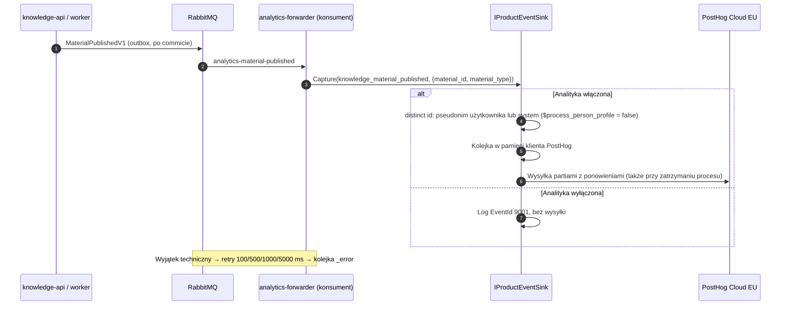

Zdarzenia z backendu opierają się wyłącznie na faktach zatwierdzonych i dostarczonych przez outbox, więc serwis domenowy nie
wie o analityce, a awaria PostHog nie wpływa na komendy. Dostarczanie do PostHog jest „best effort”: rzadka utrata lub
powtórzenie zdarzenia analitycznego jest akceptowane (ADR-0036).

### 6.13 Ewaluacja feature flag w serwisie

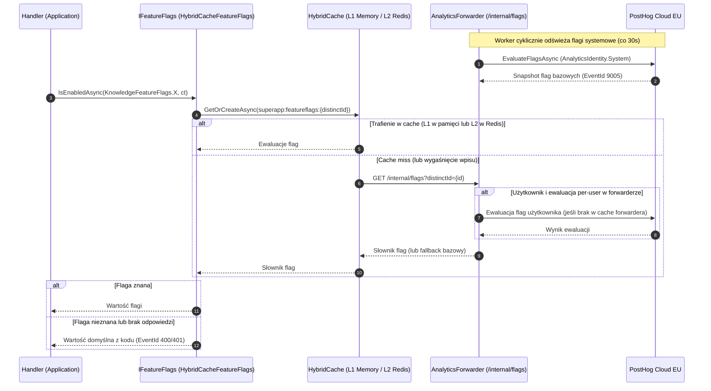

Flaga nigdy nie psuje żądania: wartość domyślna z kodu musi być bezpieczna do trwałego działania. Ewaluacja w mikroserwisach
opiera się na HybridCache (L1 in-memory + L2 Redis, ADR-0020), a zapytania wychodzące do PostHog Cloud EU wykonuje
wyłącznie `SuperApp.AnalyticsForwarder` (brak bezpośredniego egressu z serwisów domenowych). Bez analityki (lokalnie,
w testach) wartości pochodzą z konfiguracji `FeatureFlags:{klucz}`. Flaga nie jest uprawnieniem: o dostępie decydują scope i
reguły zasobu (ADR-0012, ADR-0036).

### 6.14 Moduł → brama → BFF → serwisy (endpoint komponowany)

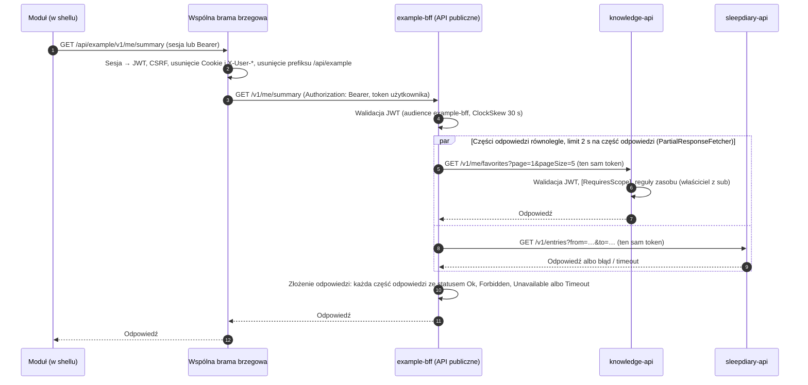

- BFF przekazuje token użytkownika **bez zmian**; każdy odbiorca sam waliduje JWT, scope i reguły zasobu i nie ufa identyfikatorowi
  użytkownika przesłanemu w payloadzie (ADR-0040). Tak samo działa wyjątkowe synchroniczne wywołanie serwis → serwis w obrębie
  experience.
- BFF nie odświeża tokenu (to rola bramy), więc długie łańcuchy wywołań projektujemy jako asynchroniczne.
- BFF nie zmienia stanu kilku domen w jednym żądaniu; procesy między domenami realizują zdarzenia i sagi (ADR-0038).
- Odpowiedź komponowana ma zawsze status 200; moduł pokazuje części odpowiedzi ze statusem `Ok`, a dla pozostałych komunikat (częściowe
  renderowanie). Anulowanie żądania przez klienta nie jest maskowane.
- Akcje fasady (np. `GET /v1/knowledge/materials/{id}`) wołają jeden serwis i przekazują jego odpowiedź bez zmian; przy braku
  połączenia z serwisem BFF odpowiada `503 downstream.unavailable`, a przy przekroczeniu czasu `504 downstream.timeout`.
- Implementacja: `AddDownstreamApi<T>(...).AddUserTokenForwarding()` (`UserTokenForwardingHandler` przepisuje nagłówek `Authorization`
  z bieżącego żądania przez `IDownstreamTokenProvider`).
- Na środowiskach organizacji rolę `E` pełni wspólna brama brzegowa; lokalnie `SuperApp.Gateway` (ADR-0037).

### 6.15 BFF innej experience → API wewnętrzne naszego BFF

```mermaid
sequenceDiagram
    autonumber
    participant O as BFF innej experience
    participant B as Nasz BFF (API wewnętrzne)
    participant S as Nasz serwis domenowy

    Note over O,B: NetworkPolicy: /internal tylko od BFF-ów innych experience; brama nie kieruje ruchu na /internal
    O->>B: GET /internal/v1/widgets/sleep-summary (token użytkownika bez zmian)
    B->>B: Walidacja JWT, polityka scope example.internal.read (brak scope = 403 auth.missing_scope)
    B->>S: GET /v1/entries?from=…&to=… (ten sam token)
    S->>S: Walidacja JWT, scope, reguły zasobu
    S-->>B: Odpowiedź
    B-->>O: Odpowiedź w kształcie uzgodnionym z konsumentem (np. widget)
    Note over O,S: BFF innej experience nie może połączyć się bezpośrednio z naszym serwisem (NetworkPolicy, ADR-0041)
```

- W repozytorium API wewnętrzne ma jedną operację (`InternalWidgetsController`); BFF innej experience jeszcze nie istnieje, więc
  przebieg sprawdzono wywołaniem bezpośrednio na BFF (lokalnie port 5120) tokenem `dev-cli` ze scope `example.internal.read`.
- API wewnętrzne to kontrakt z innymi zespołami: zmiany wyłącznie wstecznie zgodne, zmiana łamiąca = nowa wersja i uzgodniony
  termin wygaszenia starej (ADR-0039).
- Wywołanie systemowe (bez użytkownika) jest wyjątkiem: token client credentials, scope `{experience}.internal.system.*`, tylko jawnie
  oznaczone operacje (dane ogólne, zbiorcze, procesy w tle), nigdy dane konkretnej osoby wskazanej wyłącznie identyfikatorem z
  payloadu, audyt wołającego (`azp`) w logach i uzasadnienie w dokumentacji operacji w kontrakcie (ADR-0040).

---

## 7. Widok wdrożeniowy

### 7.1 Środowiska

| Środowisko | Przeznaczenie | Migracje | Uwagi |
|---|---|---|---|
| lokalne | Praca deweloperska, testy end-to-end | `SuperApp.Migrator` (kontener lub IDE) | docker compose: infrastruktura + profil `app` z całą aplikacją (w tym `example-bff` na porcie 5120), lokalny Keycloak (ADR-0031, ADR-0034) |
| dev | Integracja zmian zespołu | Job `superapp-migrator` | Dane testowe |
| test | Testy akceptacyjne, regresja | Job `superapp-migrator` | Konfiguracja zbliżona do prod |
| prod | Produkcja | Skrypt idempotentny uruchamiany przez DBA | Brak konta DDL w klastrze |

Każde środowisko ma własną bazę MSSQL, instancję Redis, vhost RabbitMQ i konfigurację CIAM
(ADR-0016) oraz osobny projekt PostHog Cloud EU (ADR-0036). Lokalnie analityka jest domyślnie wyłączona: puste
`ANALYTICS_PROJECT_TOKEN` i `ANALYTICS_ID_KEY` w `deploy/local/.env`, forwarder tylko loguje zdarzenia, a flagi pochodzą z
konfiguracji (ADR-0034).

### 7.2 Obiekty Kubernetes

| Komponent | Obiekt | Skalowanie | Sondy |
|---|---|---|---|
| bff-web | Deployment + Service + Ingress (TLS) z chartu `superapp-gateway`: wzorzec i narzędzie lokalne, nie część wydania experience (ADR-0037) | HPA (CPU/RPS) | startup: baza + konfiguracja tras; readiness: stan poda; liveness: proces |
| gateway-mobile | jak wyżej (chart `superapp-gateway`, tylko wzorzec) | HPA (CPU/RPS) | jak wyżej |
| {experience}-bff | Deployment + Service (ClusterIP, port 8080) + PodDisruptionBudget + HPA z chartu `superapp-bff` (wymagane `experience` i `secretName`; `downstream` → `Downstream__{Nazwa}__BaseAddress`; audience `{experience}-bff`); dziś `example-bff` (`values-example.yaml`); ruch z wspólnej bramy i od BFF-ów innych experience | HPA (CPU) | bez bazy i migracji; readiness: stan poda; liveness: proces (ADR-0018, ADR-0038) |
| {serwis}-api | Deployment + Service (ClusterIP) | HPA (CPU/RPS) | startup: baza + migracje; readiness; liveness |
| {serwis}-worker | Deployment | KEDA (długość kolejek) | startup: baza + migracje; liveness |
| analytics-forwarder | Deployment + PodDisruptionBudget (chart `superapp-analytics-forwarder`) | KEDA (długość czterech kolejek `analytics-*`) | startup: bez sprawdzeń bazy i migracji (forwarder nie ma bazy); readiness: stan poda; liveness: proces |
| superapp-migrator | Job (PreSync, tylko dev/test) | nie dotyczy | nie dotyczy |

Wszystkie Deploymenty: PodDisruptionBudget, graceful shutdown (readiness „not ready” po SIGTERM,
`terminationGracePeriodSeconds`), obrazy multi-stage, non-root, read-only root filesystem, runtime
`aspnet:*-chiseled-extra` (chiseled z ICU wymaganym przez `Microsoft.Data.SqlClient`) (ADR-0018).

Sekrety analityki (`Analytics__ProjectToken`, `Analytics__IdKey`, opcjonalnie `Analytics__FeatureFlagsKey`) pochodzą z Vault dla
bram, serwisów i forwardera; `Analytics__IdKey` jest ten sam we wszystkich procesach środowiska, bo od niego zależy pseudonim.
Forwarder ma `terminationGracePeriodSeconds` pozwalający opróżnić kolejkę klienta PostHog przy zatrzymaniu (ADR-0036).

### 7.3 Przepływy sieciowe

Porty są wartościami domyślnymi, do potwierdzenia z działem infrastruktury.

| Źródło | Cel | Protokół / port | Uzasadnienie |
|---|---|---|---|
| Internet / sieć użytkowników | Ingress | HTTPS 443 | Dostęp do bramy brzegowej (wspólnej; lokalnie `SuperApp.Gateway`) |
| Ingress | wspólna brama brzegowa (lokalnie bff-web, gateway-mobile) | HTTP 8080 | Ruch do bramy |
| Wspólna brama brzegowa (lokalnie bff-web, gateway-mobile) | {experience}-bff, API publiczne | HTTP 8080 | Jedyne wejście z brzegu do experience (ADR-0039, ADR-0041) |
| BFF-y innych experience | {experience}-bff, API wewnętrzne `/internal` | HTTP 8080 | API wewnętrzne dla innych experience (ADR-0039, ADR-0041) |
| {experience}-bff, serwisy tej samej experience | {serwis}-api | HTTP 8080 | Jedyne dopuszczone wejście do serwisów domenowych (NetworkPolicy, ADR-0041) |
| Bramy, serwisy, Migrator | MSSQL | TDS 1433 | Dane |
| Bramy, serwisy | Redis | TLS 6380 | Cache L2 (w tym feature flags w HybridCache) |
| Serwisy (api, worker), analytics-forwarder | RabbitMQ | AMQPS 5671 | Zdarzenia integracyjne |
| Bramy, BFF, serwisy | CIAM | HTTPS 443 | OIDC, JWKS, tokeny |
| Serwisy (api, worker) | analytics-forwarder | HTTP 8080 | Pobieranie snapshotu flag (`/internal/flags`, tylko przy cache miss) |
| bff-web | `eu.i.posthog.com`, `eu-assets.i.posthog.com` (egress z klastra) | HTTPS 443 | Proxy `/ingest` analityki web (ADR-0036) |
| analytics-forwarder | `eu.i.posthog.com` (egress z klastra) | HTTPS 443 | Zdarzenia produktowe i odświeżanie flag w PostHog Cloud EU (ADR-0036) |
| Wszystkie pody | OTel Collector | OTLP 4317 | Telemetria |

Wyjście do PostHog realizuje dział infrastruktury (NetworkPolicy egress lub proxy wychodzące, ADR-0016) wyłącznie dla `analytics-forwarder`
i `bff-web`; serwisy domenowe nie mają uprawnień egressu do PostHog (komunikują się wyłącznie wewnętrznie z `analytics-forwarder`
i Redisem). Aplikacje mobilne łączą się z PostHog bezpośrednio z urządzeń, poza klastrem.

### 7.4 Podział odpowiedzialności

| Obszar | Zespół aplikacyjny | Dział infrastruktury | Dział CIAM | DBA |
|---|---|---|---|---|
| Kod, obrazy, chart Helm | wykonuje | | | |
| Klaster, Ingress, cert-manager, ArgoCD, KEDA | wymagania | wykonuje | | |
| NetworkPolicy (reguły izolacji experience, ADR-0041) | wymagania; etykiety w chartach | wykonuje (procedura do uzgodnienia) | | |
| Wspólna brama brzegowa | wymagania (zachowanie `SuperApp.Gateway`, ADR-0037) | właściciel wspólnej bramy | | |
| MSSQL (instancja, HA, backup) | wymagania | wykonuje | | współpracuje |
| Schematy, role, użytkownicy (bootstrap) | przygotowuje skrypt | | | wykonuje |
| Migracje prod | przygotowuje skrypt | | | wykonuje |
| Redis, RabbitMQ, Vault, obserwowalność | wymagania | wykonuje | | |
| Klienci OIDC, audience, scope | wymagania | | wykonuje | |
| Egress do PostHog Cloud EU, sekrety `Analytics__*` w Vault | wymagania | wykonuje | | |

Szczegółowe wymagania wobec usług: ADR-0016. Umowę powierzenia z PostHog, projekty PostHog na środowiska i politykę prywatności
zapewnia organizacja (właściciel produktu); katalog zdarzeń, flagi w kodzie i proxy należą do zespołu aplikacyjnego (ADR-0036).
Proxy `/ingest` na dev, test i prod to wymaganie wobec wspólnej bramy albo przyszły element BFF experience (ADR-0037); dziś BFF
go nie ma.

### 7.5 NetworkPolicy i izolacja experience

Zasada „ruch do domeny experience tylko przez jej BFF” nie wynika z tokenów: token użytkownika ma audience wszystkich serwisów
(ADR-0012) i przechodzi bez zmian (ADR-0040). **Gwarancją jest konfiguracja sieci** (ADR-0041).

| Cel | Dozwolone źródła ruchu przychodzącego |
|---|---|
| API publiczne BFF | wyłącznie wspólna brama brzegowa |
| API wewnętrzne BFF (`/internal/...`) | BFF-y innych experience |
| Serwisy domenowe experience | wyłącznie pody BFF i serwisów **tej samej** experience |
| Porty sond (`/health/*`) | kubelet i monitoring (według działu infrastruktury) |

- NetworkPolicy działa na warstwie L3/L4, więc nie rozróżni API publicznego i wewnętrznego BFF po ścieżce. Do czasu decyzji działu
  infrastruktury (osobny port albo reguła w bramie) obowiązuje reguła w bramie: brama nie kieruje ruchu na `/internal`, a BFF
  egzekwuje politykę per ścieżka (scope `{experience}.internal.*`).
- **Etykiety:** charty ustawiają na podach `app.kubernetes.io/part-of: {experience}` (z wymaganej wartości `experience` chartu; pusta przerywa renderowanie) oraz
  `superapp.example/experience-role: bff | domain-service | worker`. Mają je charty `superapp-service` (role `domain-service` i `worker`),
  `superapp-analytics-forwarder` (rola `worker`) i `superapp-bff` (rola `bff`). Na tych etykietach opierają się selektory
  polityk.
- **Procedura nie jest ustalona:** reguły są wymaganiem wobec działu infrastruktury (ADR-0016), a charty zawierają tylko etykiety,
  bez manifestów `NetworkPolicy`. Gdy dział zdecyduje, że przyjmuje manifesty od zespołów, trafią do chartów jako opcja włączana
  wartością, z testem renderowanych manifestów w pipeline'ie.
- **Kontrola:** przegląd zmian polityk, test renderowanych manifestów (gdy będą w chartach), alert na odrzucone połączenia
  (wymaganie wobec monitoringu).
- **Lokalnie** docker compose nie odwzorowuje NetworkPolicy: izolacja experience nie jest tam egzekwowana (ADR-0034, ADR-0041).

---

## 8. Koncepcje przekrojowe

### 8.1 Model domeny

- **Agregaty** pilnują niezmienników; stan zmieniany wyłącznie metodami o nazwach z języka
  domeny; prywatne settery, fabryki statyczne, kolekcje jako prywatne pola + `IReadOnlyList<T>`.
- **Jedna transakcja modyfikuje jeden agregat**; spójność między agregatami przez zdarzenia.
- **Silne ID** (ADR-0023): ręcznie pisane `readonly record struct` implementujące
  `IStronglyTypedId<TSelf,TValue>`; fabryki `New()`, `Create()` (walidacja → `Result`),
  `FromTrusted()` (wyłącznie infrastruktura).
- **Value objects** (ADR-0024): niezmienne; jednowartościowe `readonly record struct`,
  wielowartościowe `sealed record`; właściwości tylko `{ get; }`; tworzenie przez `Create()`.
- **Zdarzenia domenowe** (ADR-0027): `IDomainEvent`, zgłaszane przez `Raise(...)`, obsługiwane
  przez `IDomainEventHandler<T>` w trakcie zapisu Unit of Work.
- **Repozytoria**: jedno na agregat, interfejs w Domain, bez `IQueryable`. Odczyty są asynchroniczne (I/O), a `Add`/`Remove`
  synchroniczne, bo tylko zmieniają stan change trackera; zapis wykonuje wyłącznie Unit of Work.

### 8.2 CQRS i dostęp do danych

| Aspekt | Strona zapisu | Strona odczytu |
|---|---|---|
| Kontekst EF | `WriteDbContext` (dziedziczy `WriteDbContextBase`) | `ReadDbContext` (`NoTracking`) |
| Model | Agregaty domenowe | Płaskie read modele (tabele, widoki) |
| Dostęp | Repozytoria per agregat | Handlery zapytań w Infrastructure (EF, opcjonalnie Dapper) |
| Migracje | Właściciel schematu | Brak migracji; widoki tworzone migracjami strony zapisu |
| Cache | Zakazany | `HybridCache` z fail-safe |
| Replika | Primary | `ApplicationIntent=ReadOnly`, jeśli dostępna replika do odczytu |

Mapowanie EF wyłącznie w `IEntityTypeConfiguration<T>`: backing fields, `ComplexProperty` dla
wielowartościowych VO, `OwnsMany` dla kolekcji, konwencje dla ID i jednowartościowych VO
(ADR-0003, ADR-0024, ADR-0026).

### 8.3 Obsługa błędów

| Kategoria | Mechanizm | Odpowiedź HTTP |
|---|---|---|
| Walidacja wejścia | FluentValidation → `Result` z `Error.Type = Validation` | 400 `ValidationProblemDetails` |
| Brak uprawnień | `AuthorizationBehavior` / reguły w handlerze → `Forbidden` | 403 |
| Brak zasobu | `NotFound` | 404 |
| Konflikt stanu | `Conflict`, także naruszenie unikalnego indeksu przy równoległych żądaniach (mapowanie nazw indeksów w kontekście zapisu) | 409 |
| Naruszenie reguły biznesowej | `BusinessRule` | 422 |
| Błąd techniczny | Wyjątek → globalny handler; w konsumentach retry/redelivery | 500 |

Każda odpowiedź błędu ma typ `application/problem+json` i zawiera stały kod (`code`, np. `knowledge.material.archived`),
`instance` oraz `traceId` (32 znaki hex, identyfikator śladu W3C); oba pola są opisane w kontrakcie OpenAPI (ADR-0044). Dotyczy to
także odpowiedzi tworzonych przez ASP.NET Core: konwencja `ProblemDetailsConventions` nadaje im kod ogólny według statusu
(`request.malformed` dla `400` z wiązania modelu, `auth.invalid_token` dla `401`, `auth.forbidden`,
`http.not_found`, `http.method_not_allowed`, `http.unsupported_media_type`, `http.too_many_requests`, `server.error` dla `5xx`,
w pozostałych przypadkach `http.{status}`). Kod domenowy z `Result` nigdy nie jest nadpisywany. Lokalna brama dopisuje to samo ciało do własnych pustych błędów
(401, 403, 404, 502, 504; `GatewayStatusCodePages`), z `instance` ze ścieżką bramy (`/api/{experience}/...`); odpowiedzi przekazane z
BFF zostawia bez zmian, więc po `instance` widać, kto odpowiedział. Zignorowanie `Result` jest błędem kompilacji (APP001), a wartość wyniku
odczytuje się przez `TryGetValue` (ADR-0015).

### 8.4 Bezpieczeństwo

**Uwierzytelnianie**

Uwierzytelnianie użytkownika na brzegu (sesja → JWT, CSRF, unieważnianie po wylogowaniu) na środowiskach organizacji należy do wspólnej bramy brzegowej.
Punkty o profilu `bff-web` opisują lokalny zamiennik `SuperApp.Gateway`, którego zachowanie jest specyfikacją wymagań wobec wspólnej
bramy (ADR-0037).

- Web: profil bramy `bff-web` (Authorization Code + PKCE, confidential client), ciasteczko `HttpOnly`, `Secure`,
  `SameSite=Strict`, prefiks `__Host-`; sesja po stronie serwera, ticket szyfrowany
  `IDataProtector`; brak tokenów w przeglądarce (ADR-0006, ADR-0011, ADR-0013).
- Mobile: public clients z PKCE, systemowa przeglądarka, redirect przez App Links / Universal Links.
- Wywołania w kontekście użytkownika (BFF → serwisy, BFF innej experience → API wewnętrzne naszego BFF, serwis → serwis): **token
  użytkownika przekazywany bez zmian** w nagłówku `Authorization`. Odbiorca waliduje JWT, sprawdza scope (`[RequiresScope]`) i
  reguły zasobu (właściciel z `sub`, cudze = 404) i nie ufa identyfikatorowi użytkownika z payloadu. Implementacja:
  `AddDownstreamApi<T>(...).AddUserTokenForwarding()` (`SuperApp.Framework.Infrastructure/Http/UserContext`, `UserTokenForwardingHandler`);
  bez tokenu w bieżącym żądaniu wywołanie idzie bez nagłówka `Authorization` (ADR-0040).
- Wywołania systemowe (bez użytkownika) są wyjątkiem: client credentials, tokeny cache'owane, dołączane przez `DelegatingHandler`
  (`Http/ClientCredentials`, `AddClientCredentialsToken`); tylko jawnie oznaczone operacje, scope `{serwis}.system.{akcja}` serwisu
  docelowego w obrębie experience (ADR-0042) albo `{experience}.internal.system.*` dla API wewnętrznego BFF, audyt wołającego (`azp`),
  nigdy dane konkretnej osoby wskazanej wyłącznie identyfikatorem z payloadu (ADR-0014, ADR-0040). Dziś żadne takie wywołanie nie
  istnieje.
- **Token exchange (RFC 8693) to otwarta furtka:** nie jest wdrożony. Miejscem na niego jest port `IDownstreamTokenProvider`
  (dziś `ForwardedUserTokenProvider` przekazuje token bez zmian): przejście na wymianę tokenu (audience zawężone do celu, tożsamość
  pośrednika) to inna rejestracja tego portu i konfiguracja, bez zmian w BFF, serwisach i kontraktach. Wprowadza go nowy ADR
  (ADR-0040).
- Token użytkownika nie opuszcza granicy zaufania aplikacji; systemy zewnętrzne wołamy własnymi poświadczeniami przez ACL (ADR-0012,
  ADR-0040).
- Czas życia tokenu sprawdzany z `ClockSkew` 30 s (`HostingExtensions.TokenClockSkew`, użyte w `AddAppApi` i w lokalnej bramie
  mobilnej), a nie z domyślnymi 5 min.
- Odświeżanie tokenów w bramie `bff-web` pod wyłączną blokadą sesji w MSSQL (`sp_getapplock`), bezpieczne przy rotacji refresh tokenów
  i wielu replikach; odświeżenie ma własny limit czasu, niezależny od żądania, które je rozpoczęło; tokeny w sesji nigdy się nie cofają.
- Profil `bff-web` nie żąda `offline_access` (a lokalny realm nie ma go w scope opcjonalnych klienta `bff-web`): refresh token jest
  związany z sesją SSO, więc wylogowanie w CIAM kończy sesję w bramie.
- Wylogowanie: nawigacja przeglądarki na `logoutUrl` z `/bff/user` (`GET /bff/logout?sid=…`; niezgodny `sid` = 400), unieważnienie sesji i przekierowanie do end-session CIAM; OIDC Back-Channel Logout z CIAM (ADR-0011).

**Autoryzacja** (ADR-0012)

| Poziom | Mechanizm |
|---|---|
| Brama | Polityka per trasa experience oparta o scope (np. `GatewayPolicies.Example`: dowolny scope `knowledge.*` lub `sleepdiary.*`); trasa publiczna jawnie `anonymous` (dziś żadnej); brak reguł domenowych |
| BFF experience | Walidacja JWT (audience `{experience}-bff`); API wewnętrzne wymaga scope `{experience}.internal.*` (polityka `RequireScope`, np. `example.internal.read`), wywołania systemowe `{experience}.internal.system.*`; API publiczne bez własnego scope: decyduje serwis; dopuszczalne wczesne sprawdzenie uprawnień (UX); BFF nie jest jedyną linią obrony |
| Serwis: pipeline | `AuthorizationBehavior`: scope i reguły niezależne od stanu zasobu |
| Serwis: domena | Reguły zależne od zasobu (właściciel, stan) w handlerze lub agregacie; serwis sprawdza je **zawsze**, niezależnie od tego, kto woła |

Uprawnienia do usług (np. aktywna usługa w danej domenie) to fakty domeny z właścicielem: serwis domenowy je egzekwuje, BFF może je
sprawdzić wcześniej dla UX. Nie trafiają do tokenu jako claimy, bo zmieniają się w trakcie sesji (ADR-0040).

**Zero trust** (ADR-0007)

- Każdy serwis waliduje JWT (podpis przez JWKS, issuer, audience); akceptuje wyłącznie własne audience.
- Brama usuwa nagłówki `X-User-*` i `Cookie`; serwisy nie ufają nagłówkom tożsamości.
- NetworkPolicy per experience jest gwarancją izolacji: API publiczne BFF tylko od bramy brzegowej, API wewnętrzne BFF tylko od
  BFF-ów innych experience, serwisy domenowe tylko od BFF i serwisów tej samej experience (7.5, ADR-0041). Lokalnie (compose)
  izolacja nie jest egzekwowana.

**Ochrona aplikacji web**

- CSRF: nagłówek `X-CSRF: 1` wymagany na `/api/*`, dodawany interceptorem Angulara; brak daje `401 auth.csrf_header_missing`.
- Rate limiting na trasach publicznych (per replika; limit efektywny = limit × liczba replik); przekroczenie daje `429 http.too_many_requests`.
- Endpointy health niedostępne z zewnątrz.
- Brama przyjmuje wyłącznie adresy docelowe w klastrze (`http://{serwis}.{namespace}.svc.cluster.local:{port}`);
  regułę wymusza ograniczenie `CHECK` w bazie i walidacja przed zastosowaniem konfiguracji (ADR-0022).
- Jedynym ruchem z bramy poza klaster jest proxy analityki `/ingest`, zdefiniowane w kodzie: anonimowe, z limitem żądań, bez
  ciasteczek, tokenów i nagłówków tożsamości w żądaniu oraz bez `Set-Cookie` w odpowiedzi; hosty docelowe tylko `https://*.posthog.com`
  (walidacja przy starcie) (ADR-0036).

**Sekrety i dane**

- Sekrety (connection stringi, sekrety klientów OIDC, certyfikaty) z Vault / External Secrets;
  nigdy w repozytorium ani `appsettings*.json`.
- Klucze Data Protection szyfrowane w spoczynku certyfikatem z Vault.
- Zakaz logowania tokenów, sekretów i danych osobowych; cache nie przechowuje tokenów ani sekretów.
- Izolacja danych serwisów wymuszana uprawnieniami (użytkownik per serwis, rola per schemat) (ADR-0021).
- Do PostHog trafia wyłącznie pseudonim użytkownika i właściwości z listy dozwolonych; szczegóły w [8.14](#814-analityka-produktowa-i-feature-flags) (ADR-0036).

### 8.5 Integracja i messaging

| Aspekt | Rozwiązanie |
|---|---|
| Styl domyślny | Zdarzenia integracyjne publish/subscribe przez RabbitMQ (quorum queues), MassTransit 8.5 (ADR-0035) |
| Kontrakty zdarzeń | `{Serwis}.Contracts`, wyłącznie prymitywy, wersjonowane (`MaterialArchivedV1`); znaczniki czasu z agregatu; zmiana łamiąca = nowy typ |
| Publikacja | `IIntegrationEventPublisher` → EF outbox MassTransit, atomowo z danymi |
| Konsumpcja | Inbox (idempotencja), konsument cienki → komenda MediatR. Wyjątek: `SuperApp.AnalyticsForwarder` mapuje zdarzenia na zdarzenia produktowe PostHog, bez komend, bazy i inboxu (`AddAppEventSubscriber`, ADR-0036) |
| Zależność od cudzych kontraktów | Dopuszczalna wyłącznie od `{Serwis}.Contracts` (published language); od pozostałych warstw innych serwisów zabroniona (reguła architektury 1) |
| Błędy | Błąd biznesowy: log, bez ponawiania; wyjątek techniczny: retry + redelivery → `_error` + alert |
| Procesy wieloetapowe | Sagi (state machine) z persystencją w MSSQL |
| Request/response | Tylko gdy odpowiedź jest niezbędna |
| Wywołania synchroniczne | BFF → serwisy swojej experience (podstawowa rola BFF); poza tym wyjątkowo, przez klienta Refit (ADR-0014) rejestrowanego `AddDownstreamApi`: w kontekście użytkownika z przekazanym tokenem; między experience wyłącznie przez API wewnętrzne BFF; systemy zewnętrzne i wywołania systemowe przez ACL z własnymi poświadczeniami (ADR-0040, ADR-0042) |
| Nazewnictwo | Konwencja MassTransit (kebab-case), prefiks kontekstu |

### 8.6 Kontrakty API i wersjonowanie

- Jeden kontrakt OpenAPI 3.0 per serwis, generowany przy buildzie, commitowany do repozytorium
  (ADR-0009, ADR-0019). Kontrakty serwisów domenowych są wewnętrzne experience (konsument: jej BFF); mogą ewoluować razem z BFF w
  jednym wydaniu, ale expand/contract nadal obowiązuje (ADR-0039).
- **API publiczne i wewnętrzne na poziomie BFF** (ADR-0039):

  | API | Ścieżka | Konsument | Dostępność | Kontrakt |
  |---|---|---|---|---|
  | Publiczne BFF | `/v{n}/...` | wyłącznie moduł experience | przez bramę brzegową (`/api/{experience}/v{n}/**`) | `openapi/{Experience}.Bff_public.json`, klient modułu |
  | Wewnętrzne BFF | `/internal/v{n}/...` | BFF-y innych experience | tylko w klastrze, nigdy przez bramę | `openapi/{Experience}.Bff_internal.json`, klient Refitter u konsumenta |
  | Serwisu domenowego | `/v{n}/...` | BFF i serwisy tej samej experience | tylko w klastrze, nigdy przez bramę | `openapi/{Serwis}.Api.json`, klient Refitter w BFF (`Clients/{Serwis}/{serwis}.refitter`) |

  Zmiana łamiąca API publicznego = nowe `/v{n+1}` (wersje modułu w sklepie żyją długo). API wewnętrzne zmienia się wyłącznie wstecznie
  zgodnie, a zmiana łamiąca oznacza nową wersję i uzgodniony termin wygaszenia starej. Oba dokumenty BFF są generowane przy buildzie
  z podziałem po ścieżce (`BffOpenApiDocuments`); test `ContractSplitTests` pilnuje, że kontrakt publiczny ma tylko ścieżki `/v…`, a
  wewnętrzny tylko `/internal/v…`. Krok CI wykrywający zmiany łamiące jest nadal do zrobienia.
- Fasada BFF używa typów wygenerowanych z kontraktu serwisu, więc zmiana kontraktu serwisu wymaga regeneracji klienta
  (`dotnet refitter --settings-file src/Bff/{Experience}.Bff/Clients/{Serwis}/{serwis}.refitter`) i przeglądu diffu kontraktu
  publicznego BFF. Schematy typów z klientów mają w kontrakcie BFF prefiks serwisu (`KnowledgeCategoryDto`), żeby nazwy różnych
  serwisów się nie zderzały.
- Każda operacja kontraktów serwisów i BFF ma `operationId` = `{Controller}_{Action}` (`OpenApiOperationIdTransformer`, nazwy metod
  w generowanych klientach), wymaganie `Bearer` (`OpenApiBearerSecurityTransformer`, operacje `[AllowAnonymous]` bez wymagania), a
  abstrakcyjne typy polimorficzne rozszerzenie `x-abstract: true` (`OpenApiAbstractTypeSchemaTransformer`). Zmiana nazwy kontrolera
  lub akcji zmienia `operationId`, czyli kontrakt.
- Wersjonowanie w ścieżce (`/v1/...`) lub Asp.Versioning.
- CI dostawcy wykrywa zmiany łamiące względem poprzedniej wersji kontraktu i blokuje merge (wymaga pipeline'u, którego w
  repozytorium jeszcze nie ma).
- Klienci generowani: Angular (`ng-openapi-gen` / `openapi-generator`), Android (`openapi-generator`),
  iOS (`swift-openapi-generator`), .NET (Refitter → Refit).
- ID i jednowartościowe VO w kontrakcie jako typy proste (np. `string`/`uuid`).
- Kontrakt jest kompletny: każda operacja ma właściwy status sukcesu ze schematem (200 / 201 `CreatedResponse` / 204) oraz
  odpowiedzi błędów `application/problem+json` (`ProblemDetails`, `ValidationProblemDetails` z `code` i `traceId`), opisane
  metadanymi kontrolerów i komentarzami XML; schematy DTO mają opisy z projektów Application (ADR-0033).
- Enumy w JSON wyłącznie jako nazwy; wartości liczbowe są odrzucane (400).
- Commitowany kontrakt ma etykietę `3.0.3`: `Microsoft.OpenApi` zapisuje `3.0.4`, którego część narzędzi (np. Rider) nie
  rozpoznaje, a obie wersje opisują ten sam dokument (ADR-0019).

### 8.7 Cache

| Aspekt | Rozwiązanie (ADR-0020) |
|---|---|
| Mechanizm | `HybridCache`: L1 pamięć procesu, L2 Redis |
| Stampede | Wbudowana ochrona `GetOrCreateAsync` |
| Fail-safe | Własna implementacja w `SuperApp.Framework`: koperta `{Value, FreshUntil}`, zwrot ostatniej wartości przy błędzie przejściowym, maksymalny wiek per typ danych |
| Zakres | Handlery zapytań, ACL, dane pomocnicze bram; **nigdy strona zapisu** |
| Klucze | `{serwis}:{typ}:v{n}:{id}` |
| Unieważnianie | Tagi po zdarzeniach, wykonywane po commicie (`IUnitOfWork.OnCommitted`); TTL jako zabezpieczenie; krótki TTL L1 |
| Awaria Redis | Krótki timeout L2, praca na L1 i źródle |

### 8.8 Odporność

| Zagrożenie | Mechanizm |
|---|---|
| Wolna / niedostępna zależność HTTP | `AddDownstreamApi` → `AddStandardResilienceHandler()`: timeouty, retry (tylko GET, HEAD, OPTIONS), circuit breaker; po wyczerpaniu `503 downstream.unavailable` / `504 downstream.timeout` |
| Wolny lub niedostępny serwis w endpointcie komponowanym BFF | Limit 2 s na część odpowiedzi, status części odpowiedzi zamiast błędu całej odpowiedzi (częściowe renderowanie, `PartialResponseFetcher`) |
| Niedostępność bazy przy odczytach | Fail-safe cache |
| Niedostępność bazy w bramie | Konfiguracja tras w pamięci; start z ostatniej poprawnej konfiguracji z L2 |
| Utrata wiadomości | Outbox (publikacja), inbox (idempotencja), quorum queues |
| Awaria wspólnej zależności | Readiness bez zależności: brak masowego wyjęcia podów z ruchu; alert z `/health/dependencies` |
| Wdrożenie przed migracją | startupProbe sprawdza oczekujące migracje; rollout wstrzymany |
| Przerwanie poda | Graceful shutdown, PodDisruptionBudget |
| Niedostępność PostHog | Flagi: wartość domyślna z kodu po `Analytics:FeatureFlagsTimeout`; zdarzenia: kolejka klienta w pamięci z ponowieniami, komendy serwisów nie zależą od analityki (ADR-0036) |

### 8.9 Obserwowalność

- **Logi**: wyłącznie `[LoggerMessage]` ze stałymi `EventId` i zakresami per serwis; bez
  interpolacji, bez danych osobowych i tokenów (ADR-0008).
- **Tracing**: OpenTelemetry, propagacja `traceparent` od bramy przez serwisy i RabbitMQ do
  konsumentów; spany dla zdarzeń domenowych.
- **Metryki**: ASP.NET Core, HttpClient (YARP, Refit), SqlClient (EF Core), MassTransit, runtime; metryki per
  trasa w bramach; cache (trafienia L1/L2, fail-safe); wersja konfiguracji tras per replika.
- **Eksport**: OTLP do OTel Collector → Tempo / Loki / Prometheus, wizualizacja w Grafanie.
- **Health**: startup / readiness / liveness zgodnie z ADR-0018; `/health/dependencies` dla monitoringu.
- **Analityka produktowa to nie telemetria**: zdarzenia produktowe idą do PostHog (ADR-0036), logi, ślady i metryki do OTel.
  Metryka `superapp.feature_flags.fallbacks` (tag `reason`) liczy użycia wartości domyślnych flag; EventId 400–499 (feature flags we
  Frameworku) i 9000–9999 (forwarder) w [rejestrze EventId](logowanie-eventid.md).
- **Wywołania z BFF**: instrumentacja HttpClient obejmuje klientów Refit, więc ślad biegnie od bramy przez BFF do serwisów; nieudane
  wywołanie serwisu (`503`/`504`) loguje EventId 220 (`DownstreamUnavailableExceptionHandler`), wejście do API wewnętrznego
  EventId 230 (`InternalApiCallAudit`, klient z `azp`), część odpowiedzi komponowanej inna niż `Ok` EventId 6001.
- **Korelacja błędów**: `traceId` w każdej odpowiedzi `problem+json` to identyfikator śladu W3C (32 znaki hex), ten sam w Tempo i
  Loki (ADR-0044).
- **Alerty** (minimum): kolejki `_error`, nieudane przeładowanie konfiguracji tras, stan
  zależności, użycie fail-safe powyżej progu **[progi do ustalenia]**.

### 8.10 Dane i migracje

- Jedna baza MSSQL na środowisko, schemat per serwis oraz `gateway`; zakaz odwołań między
  schematami (ADR-0021).
- Historia migracji w schemacie serwisu (`MigrationsHistoryTable("__EFMigrationsHistory", "{serwis}")`).
- Migracje przy serwisie (`{Serwis}.Infrastructure/Migrations`), uruchamiane przez `SuperApp.Migrator`
  (dev/test) lub DBA (prod) (ADR-0004).
- Styl expand/contract; operacje destrukcyjne tylko w fazie „contract”; review każdej migracji. Przykład: przejście na
  MassTransit 8 dodaje indeksy outboxa, a kolumnę `OutboxState.BusName` z wersji 9 pozostawia do osobnej migracji „contract”.
- Użytkownicy bazy: `superapp_migrator` (tylko dev/test) oraz `{serwis}_app` per serwis i bramę,
  uprawnienia przez role per schemat; tworzone skryptem bootstrap.

### 8.11 Konfiguracja

- Konfiguracja nie-sekretna w `appsettings.json` i zmiennych środowiskowych z chartu Helm.
- Sekrety wyłącznie z Vault / External Secrets.
- Konfiguracja tras bram w bazie, zmieniana migracjami (ADR-0022).
- Adresy serwisów wołanych przez BFF: `Downstream:{Nazwa}:BaseAddress` (w klastrze adres Service, w chartcie wartość `downstream`;
  lokalnie z IDE `http://localhost:5101` i `5102`); brak lub adres względny zatrzymuje proces przy starcie.
- Wspólne ustawienia (OpenAPI 3.0, telemetria, cache, resilience) w `SuperApp.Framework`.
- Lokalnie: zmienne środowiskowe w `deploy/local/docker-compose.yml`, opcjonalne hasła w `deploy/local/.env` (poza repozytorium) (ADR-0034).
- Sekcja `Analytics` (ADR-0036): `ProjectToken` (włącza analitykę, ustawiany per środowisko), `IdKey` (sekret, min. 32 znaki),
  `FeatureFlagsKey` (sekret, opcjonalny), `Host` i `AssetsHost` (tylko `https://*.posthog.com`), `FeatureFlagsTimeout` (domyślnie 1 s).
  Przy włączonej analityce brak `IdKey` lub host spoza `posthog.com` zatrzymuje proces przy starcie; bez `ProjectToken` analityka
  jest wyłączona. Wartości flag bez analityki: `FeatureFlags:{klucz}`.

### 8.12 Jakość i testy

| Poziom | Zakres | Narzędzia |
|---|---|---|
| Kompilacja | Nullable, warnings as errors, analizatory .NET i `SuperApp.Analyzers` (APP001–APP006, testowane w `SuperApp.Analyzers.Tests`), CS1591 dla publicznego API, IDE0130 (przestrzeń nazw = katalog), NuGet audit | Roslyn |
| Testy domeny | Agregaty, VO, ID, fabryki; bez mocków | xUnit |
| Testy Application | Handlery komend i zdarzeń domenowych z fake'ami portów | xUnit |
| Testy integracyjne | Migracje i schemat, repozytoria, handlery zapytań, zdarzenia do outboxa (publikacja przez fake), ograniczenia CHECK, mapowanie konfliktów unikalności, unieważnianie cache po commicie, widoczność dla czytelnika, brama (konfiguracja tras, sesje, odświeżanie tokenów, wylogowanie) | xUnit, Testcontainers (MSSQL) |
| Testy forwardera | Pseudonim, walidacja opcji `Analytics`, flagi z konfiguracji, mapowanie zdarzeń integracyjnych na zdarzenia produktowe i listę dozwolonych właściwości | xUnit, test harness MassTransit (ADR-0036) |
| Testy BFF | Podział kontraktów, przekazywanie odpowiedzi i tokenu, częściowe renderowanie, klienci downstream (`Example.Bff.Tests`, bez kontenerów) | xUnit |
| Testy end-to-end | Logowanie, CSRF, odświeżanie i wylogowanie przez lokalną bramę (`bff-web`); przepływ biznesowy przez bramę (`/api/example/v1/...`), BFF, serwisy, outbox, RabbitMQ i Workera; brak trasy do `/internal` i do starych `/api/{serwis}/...`; API wewnętrzne BFF z tokenem `dev-cli` (200 ze scope `example.internal.read`, 403 bez); `analyticsId` z `/bff/user` i `/analytics/id`, proxy `/ingest` bez `Set-Cookie`, zdarzenia forwardera | Lokalne środowisko docker compose (ADR-0034) |
| Dokumentacja | Kompletność wymuszana przy kompilacji (CS1591, APP006); jakość treści w code review | ADR-0033 |
| Testy architektury | Granice serwisów (z dopuszczeniem cudzych `Contracts`), zależności warstw, reguły ADR, forwarder tylko przez `Contracts`, SDK PostHog tylko we Frameworku i forwarderze; reguły BFF 12–14 (BFF nie referuje serwisów, także `Contracts`, ani innych BFF; bez `DbContext`; serwisy nie referują BFF, ADR-0038) | ArchUnitNET (ADR-0025, do ponownej oceny; ADR-0036) |
| Testy kontraktów | Wykrywanie zmian łamiących OpenAPI | CI dostawcy |

### 8.13 Zależności i licencje

- MediatR 12.5 i MassTransit 8.5: ostatnie wersje na licencji Apache-2.0, bez kluczy licencyjnych; aktualizacja do wersji komercyjnych wymaga nowego ADR (ADR-0035).
- Klienci HTTP: Refit 16.3.0 z `Refit.HttpClientFactory` i `Refit.Reflection` (wymagany przez Refit 16 dla `AddRefitClient`),
  `Microsoft.Extensions.Http.Resilience`; narzędzie `refitter` 2.3.0 w `.config/dotnet-tools.json` (ADR-0014).
- Pozostałe biblioteki: pakiety Microsoft lub open source (FluentValidation,
  ArchUnitNET, Testcontainers, `PostHog` 2.15.7 na licencji MIT).
- Licencje usług platformowych po stronie działów dostarczających (ADR-0016).
- PostHog Cloud EU jest usługą SaaS; umowę i DPA zawiera organizacja. Pakiety klientów (`posthog-js`, `posthog-android`,
  `posthog-ios`) dodaje się razem z kodem klientów (ADR-0036).
- Wersje pakietów zarządzane centralnie; nowy pakiet wymaga uzasadnienia.

### 8.14 Analityka produktowa i feature flags

| Aspekt | Rozwiązanie (ADR-0036) |
|---|---|
| Dostawca | PostHog Cloud EU, osobny projekt na środowisko; odrzucanie adresów IP klienta włączone w projekcie |
| Tożsamość | Pseudonim `u_` + 32 znaki hex = HMAC-SHA256(`Analytics:IdKey`, `sub`) (`AnalyticsIdentity`); nigdy `sub`, e-mail ani nazwa; klucza nie rotuje się bez decyzji właściciela produktu (zmiana dzieli historię użytkowników) |
| Zgoda | Klienci web i mobile inicjalizują PostHog dopiero po zgodzie; przed nią SDK nic nie zapisuje; wycofanie zgody wyłącza zbieranie i usuwa lokalny stan SDK |
| Session replay | Maskowanie wszystkich pól i tekstów domyślnie; ekrany dziennika snu i miejsca z danymi o zdrowiu wyłączone z nagrywania w całości |
| Właściwości zdarzeń | Lista dozwolonych: nazwy, identyfikatory obiektów katalogu, kategorie; nigdy treść wpisana przez użytkownika ani dane z dziennika snu (`sleepdiary_entry_recorded` bez daty, czasu snu i oceny); każda nowa właściwość przechodzi przegląd prywatności |
| Zdarzenia web | `posthog-js` z `api_host: '/ingest'` przez proxy w bramie (lokalnie `bff-web`; na środowiskach wymaganie wobec wspólnej bramy albo konfiguracja modułu, ADR-0037); `posthog.identify(analyticsId)` po zalogowaniu, `posthog.reset()` przy wylogowaniu |
| Zdarzenia mobile | `posthog-android`, `posthog-ios`; identyfikator z `GET /analytics/id` |
| Zdarzenia z backendu | Wyłącznie `SuperApp.AnalyticsForwarder` z istniejących zdarzeń integracyjnych; nazwy `{serwis}_{obiekt}_{czasownik}` (snake case), zdarzenia systemowe z identyfikatorem `system` i `$process_person_profile = false`; dostarczanie „best effort” |
| Feature flags | `FeatureFlag(Key, DefaultValue)` w `{Serwis}FeatureFlags` obok `{Serwis}Scopes`, klucz z prefiksem serwisu (np. `knowledge_material_ratings`); port `IFeatureFlags` w handlerach; wartości spójne w zakresie DI; timeout, brak odpowiedzi lub nieznana flaga = wartość domyślna z kodu |
| Flaga a uprawnienie | Flaga nie jest uprawnieniem; o dostępie decydują scope i reguły zasobu (ADR-0012); zachowanie serwera zależne od flagi sprawdza backend, flaga w UI służy tylko wyglądowi |
| Analityka wyłączona | Bez `Analytics:ProjectToken` nic nie jest wysyłane, `/bff/user` i `/analytics/id` zwracają `analyticsId: null`, proxy `/ingest` nie istnieje, flagi z konfiguracji |
| Egzekwowanie | SDK PostHog tylko w `SuperApp.Framework.Infrastructure` i `SuperApp.AnalyticsForwarder` (reguła architektury 11); forwarder zależy od serwisów wyłącznie przez `Contracts` (reguła 10); walidacja opcji przy starcie |

---

## 9. Decyzje architektoniczne

Pełna lista i uzasadnienia: [`docs/adr/README.md`](adr/README.md).

| Obszar | ADR |
|---|---|
| Proces | 0001 Rejestrowanie decyzji · 0043 Dopiski o doprecyzowaniu w nagłówkach ADR |
| Kod i dokumentacja | 0032 Jeden typ na plik, katalogi według odpowiedzialności · 0033 Dokumentacja w kodzie po angielsku |
| Architektura serwisów | 0002 Clean DDD i CQRS · 0015 `Result` · 0047 Odczyt `Result` bez wyjątków · 0017 Kolejność behaviors · 0044 Jednolite odpowiedzi błędów (`code`, `traceId`) · 0023 Silne ID · 0024 Value objects · 0026 Handlery zapytań w Infrastructure · 0027 Zdarzenia domenowe w UoW |
| Dane | 0003 Write/Read DbContext · 0004 Migrator i migracje · 0021 Schemat per serwis |
| Integracja | 0005 Outbox/inbox · 0009 Kontrakty OpenAPI · 0014 Refit + Refitter · 0019 OpenAPI 3.0 |
| Bramy i bezpieczeństwo | 0006 Bramy YARP · 0007 Zero trust · 0011 Własny BFF (profil bramy `bff-web`) · 0012 Audience i scope · 0013 Sesje i Data Protection · 0022 Konfiguracja tras w bazie · 0037 `SuperApp.Gateway` jako lokalny zamiennik wspólnej bramy brzegowej · 0040 Dostęp do API wewnętrznego i serwisów domenowych, przekazywanie tokenu użytkownika · 0041 NetworkPolicy jako gwarancja izolacji experience · 0042 Scope wywołań systemowych między serwisami |
| Model experience | 0038 Experience: moduł, BFF i serwisy domenowe · 0039 API publiczne i wewnętrzne na poziomie BFF · 0045 Moduł w super appce: kontrakt z shellem (proponowany) |
| Operacje | 0008 Logowanie i telemetria · 0016 Infrastruktura i CIAM zewnętrzne · 0018 Sondy · 0020 Cache |
| Środowisko lokalne | 0031 Lokalny CIAM (Keycloak) · 0034 docker compose |
| Analityka produktowa | 0036 Analityka produktowa, session replay i feature flags w PostHog Cloud EU |
| Licencje | 0035 MediatR i MassTransit w wersjach open source (zastępuje 0010) |
| Serwisy domenowe | 0028 Knowledge (treść blokowa) · 0029 SleepDiary · 0030 Szablon serwisu |
| Jakość | 0025 Testy architektury · 0046 Narzędzie deweloperskie `dotnet superapp` (spójność repozytorium) |

---

## 10. Wymagania jakościowe

### 10.1 Drzewo jakości

```mermaid
flowchart LR
    Q[Jakość]
    Q --> S[Bezpieczeństwo]
    Q --> M[Utrzymywalność]
    Q --> R[Niezawodność]
    Q --> P[Wydajność i skalowalność]
    Q --> O[Obserwowalność]
    S --> S1[Brak tokenów w przeglądarce]
    S --> S2[Zero trust]
    S --> S3[Audytowalność zmian]
    M --> M1[Granice kontekstów]
    M --> M2[Reguły wymuszane automatycznie]
    R --> R1[Brak utraty zdarzeń]
    R --> R2[Degradacja przy awariach]
    P --> P1[Skalowanie per serwis]
    O --> O1[Śledzenie end-to-end]
```

### 10.2 Scenariusze jakościowe

| ID | Atrybut | Scenariusz (bodziec → reakcja) | Miara |
|---|---|---|---|
| QS-01 | Bezpieczeństwo | Atakujący wykonuje skrypt w przeglądarce (XSS) → nie uzyskuje tokenu dostępu | Brak tokenów dostępnych dla JavaScript |
| QS-02 | Bezpieczeństwo | Żądanie z podrobionym nagłówkiem `X-User-Id` → nagłówek usunięty, tożsamość wyłącznie z JWT | 100% żądań |
| QS-03 | Bezpieczeństwo | Przechwycony token użyty bezpośrednio wobec serwisu domenowego z poda spoza experience (np. z BFF innej experience) → połączenie odrzucone | NetworkPolicy (ADR-0041) |
| QS-04 | Niezawodność | Awaria procesu po commicie komendy → zdarzenie integracyjne dostarczone po restarcie | 0 utraconych zdarzeń |
| QS-05 | Niezawodność | Ponowne dostarczenie tej samej wiadomości → brak podwójnego efektu | Inbox |
| QS-06 | Niezawodność | Krótka niedostępność MSSQL → odczyty z cache działają, pody pozostają w ruchu | Czas degradacji **[do ustalenia]** |
| QS-07 | Utrzymywalność | Programista dodaje referencję między serwisami → build / testy kończą się błędem | Test architektury |
| QS-08 | Utrzymywalność | Zmiana łamiąca kontrakt API bez nowej wersji → merge zablokowany | CI dostawcy |
| QS-09 | Utrzymywalność | Zmiana kontraktu dostawcy → błędy kompilacji u konsumenta po regeneracji klienta | Refitter |
| QS-10 | Wdrażalność | Wdrożenie wersji na prod przed skryptem DBA → nowe pody nie przyjmują ruchu | startupProbe |
| QS-11 | Wdrażalność | Zmiana trasy w bramie → aktywna na wszystkich replikach bez restartu | ≤ interwał odpytywania **[do ustalenia]** |
| QS-12 | Wydajność | Obciążenie API **[RPS do ustalenia]** → czas odpowiedzi p95 **[do ustalenia]** | Metryki per trasa |
| QS-13 | Skalowalność | Wzrost długości kolejki → zwiększenie liczby workerów | KEDA, próg **[do ustalenia]** |
| QS-14 | Obserwowalność | Błąd w konsumencie → pełny ślad od żądania w bramie do konsumenta | Tempo, `traceparent` |
| QS-15 | Niezawodność | Dwa równoległe żądania tworzą ten sam zasób (slug, dzień dziennika) → jedno 201, drugie 409 z kodem kontekstu | 0 odpowiedzi 500 |
| QS-16 | Spójność | Zmiana danych w trakcie równoległego odczytu → cache nie zachowuje starej wartości po commicie | Unieważnienie po commicie |
| QS-17 | Bezpieczeństwo | Wylogowanie użytkownika w CIAM → sesja w bramie unieważniona (back-channel logout) | Następne żądanie: 401 |
| QS-18 | Utrzymywalność | Nowa osoba w zespole czyta typ Frameworku → zna jego rolę, użycie i ograniczenia bez czytania implementacji | Dokumentacja XML, code review |
| QS-19 | Niezawodność | PostHog niedostępny → komendy działają, flagi zwracają wartość domyślną z kodu | Opóźnienie ≤ `Analytics:FeatureFlagsTimeout` (domyślnie 1 s), 0 błędów żądań z powodu flag |
| QS-20 | Prywatność | Zapis wpisu w dzienniku snu → do PostHog trafia tylko `sleepdiary_entry_recorded` z pseudonimem, bez daty, czasu snu i oceny | Test mapowania konsumenta, przegląd prywatności |
| QS-21 | Bezpieczeństwo | Żądanie przeglądarki do `/ingest` → do PostHog nie trafia ciasteczko sesji, token ani nagłówki tożsamości; odpowiedź bez `Set-Cookie` | 100% żądań |
| QS-22 | Bezpieczeństwo | BFF innej experience pyta API wewnętrzne o zasób innego użytkownika, podając jego identyfikator w payloadzie → odpowiedź 404 | Reguły zasobu z `sub` w odbiorcy (ADR-0040) |
| QS-23 | Bezpieczeństwo | Żądanie z brzegu na ścieżkę `internal` albo do serwisu domenowego → brak trasy | Test tras lokalnego zamiennika (żadna trasa nie zawiera `internal`), E2E, wymaganie wobec wspólnej bramy (ADR-0039) |
| QS-24 | Utrzymywalność | Zmiana kontraktu serwisu domenowego → aplikacja w sklepie działa bez aktualizacji | Klient modułu zależy tylko od API publicznego BFF (ADR-0039) |
| QS-25 | Niezawodność | Jeden z serwisów endpointu komponowanego BFF nie odpowiada → moduł dostaje pozostałe części odpowiedzi | Odpowiedź 200 po najwyżej 2 s, część odpowiedzi ze statusem `Unavailable` lub `Timeout` |
| QS-26 | Spójność błędów | Serwis zwraca błąd (np. `404 knowledge.material.not_found`) → moduł dostaje ten sam status i `code` | `DownstreamResponseExtensions`, test `DownstreamResponseTests` |

### 10.3 Wymagania niefunkcjonalne do ustalenia

| Wymaganie | Wartość |
|---|---|
| Dostępność (SLA) aplikacji | [do ustalenia] |
| RPO / RTO | [do ustalenia z działem infrastruktury] |
| Czas odpowiedzi p95 / p99 per kategoria operacji | [do ustalenia] |
| Szczytowe obciążenie (RPS, liczba użytkowników) | [do ustalenia] |
| Retencja logów, śladów, metryk | [do ustalenia z działem infrastruktury] |
| Czas życia access tokenu i sesji | [do ustalenia z działem CIAM] |
| Wymagania RODO (retencja, prawo do usunięcia) | [do ustalenia] |
| Retencja zdarzeń i nagrań w PostHog, obsługa żądań usunięcia danych użytkownika w PostHog | [do ustalenia z właścicielem produktu i inspektorem ochrony danych] |

---

## 11. Ryzyka i dług techniczny

| ID | Ryzyko | Wpływ | Mitygacja |
|---|---|---|---|
| R-01 | Wspólna baza: serwis obciążający bazę spowalnia pozostałe | Wydajność wszystkich serwisów | Monitoring per użytkownik bazy; zakaz odwołań między schematami umożliwia wyodrębnienie serwisu do osobnej bazy (ADR-0021) |
| R-02 | Backup/restore obejmuje całą bazę | Odtworzenie jednego serwisu cofa wszystkie | Procedura selektywnego odtworzenia z DBA |
| R-03 | Jeden Migrator wiąże wydania serwisów | Błąd migracji jednego schematu wstrzymuje całe wydanie | Expand/contract, testy migracji w CI, review |
| R-04 | Własne implementacje (profil bramy `bff-web`, fail-safe cache, analizatory, konwersje ID) | Koszt utrzymania, ryzyko błędów bezpieczeństwa w bramie | Przegląd bezpieczeństwa, testy integracyjne, ograniczony zakres |
| R-05 | Zależność od działów zewnętrznych | Opóźnienia zmian w CIAM, sieci, usługach | Wymagania z wyprzedzeniem (ADR-0016), uzgodnione ścieżki zgłoszeń |
| R-06 | Eventual consistency między kontekstami | Chwilowo niespójne dane w UI | Uwzględnienie w UX, idempotencja, sagi z kompensacją |
| R-07 | Token z listą audience wielu serwisów, przekazywany bez zmian przez BFF i serwisy | Szerszy zasięg przechwyconego tokenu | NetworkPolicy, krótki czas życia tokenu i `ClockSkew` 30 s, zakaz logowania tokenów, furtka token exchange (ADR-0012, ADR-0040) |
| R-08 | Nieaktualne dane w L1 między replikami | Krótkotrwałe rozbieżności odczytów | Krótki TTL L1, wyłączenie L1 dla danych wymagających spójności (ADR-0020) |
| R-09 | Błędna konfiguracja tras w bazie | Niedostępność tras | Ograniczenia bazy, walidacja YARP, pozostawienie poprzedniej konfiguracji, review migracji (ADR-0022) |
| R-10 | MediatR 12.x i MassTransit 8.x bez dalszego rozwoju; wsparcie bezpieczeństwa MassTransit 8 ograniczone w czasie | Brak poprawek bezpieczeństwa | NuGet audit w buildzie, decyzja o dalszej drodze przed końcem 2026, porty ograniczające koszt wymiany (ADR-0035) |
| R-11 | Testy architektury mogą zostać wycofane | Mniejsza automatyczna ochrona granic | Sprawdzenie referencji w `Directory.Build.props` jako rozwiązanie zastępcze (ADR-0025) |
| R-12 | Rate limiting per replika | Faktyczny limit zależny od liczby replik | Uwzględnienie w konfiguracji lub limitowanie na Ingress |
| R-13 | Otwarte migracje „contract” i migracje przebudowujące kolumny | Pozostałości schematu (`OutboxState.BusName`), dłuższe wdrożenie (`FixOwnedPositionKeys` przebudowuje kolumny `Position`) | Przegląd DBA przed prod; migracja „contract” po zakończeniu wdrożenia (ADR-0035) |
| R-14 | Odświeżanie tokenów w bramie `bff-web` zależy od blokad aplikacyjnych w MSSQL | Opóźnienia odświeżania przy przeciążonej bazie | Krótki limit czasu blokady i odświeżenia; brak blokady nie kończy sesji (ADR-0011, ADR-0013) |
| R-15 | Jakość dokumentacji w kodzie sprawdzana tylko częściowo automatycznie | Opisy formalnie kompletne, ale płytkie | Wzorzec w `SuperApp.Framework`, code review (ADR-0033) |
| R-16 | Zależność od zewnętrznego SaaS (PostHog Cloud EU) i transfer danych pseudonimowych poza organizację | Zgodność z RODO, dostępność analityki i flag | DPA, region EU, pseudonim zamiast tożsamości, zgoda użytkownika, bezpieczne wartości domyślne flag (ADR-0036) |
| R-17 | Dane o zdrowiu (SleepDiary) w analityce lub nagraniach sesji | Naruszenie art. 9 RODO | Lista dozwolonych właściwości z przeglądem prywatności, testy mapowania forwardera, pełne maskowanie i wyłączenie ekranów dziennika z session replay przed włączeniem (ADR-0036) |
| R-18 | Zdarzenia z backendu dostarczane „best effort” (bez inboxu, kolejka w pamięci) | Utrata lub powtórzenie pojedynczych zdarzeń analitycznych | Opróżnianie kolejki przy zatrzymaniu, `message_id` w zdarzeniu; analizy nie zastępują danych biznesowych z serwisów (ADR-0036) |
| R-19 | Zmiana lub wyciek `Analytics:IdKey` | Podział historii użytkowników w PostHog; możliwość powiązania pseudonimu z `sub` | Klucz w Vault, ten sam dla środowiska, rotacja tylko decyzją właściciela produktu (ADR-0036) |
| R-20 | Nowy proces (forwarder) i nowe sekrety | Koszt utrzymania, konfiguracja per środowisko | Chart `superapp-analytics-forwarder`, walidacja opcji przy starcie, testy forwardera (ADR-0036) |
| R-21 | Rozjazd zachowania lokalnej bramy (`SuperApp.Gateway`) i wspólnej bramy brzegowej (nagłówki, CSRF, czasy, unieważnianie) | Błędy widoczne dopiero na dev/test; testy E2E lokalnie zielone mimo różnic | Lista wymagań uzgodniona z właścicielem wspólnej bramy, potwierdzana testami E2E lokalnego zamiennika; różnice opisane w przewodniku (rozdział 13) (ADR-0037) |
| R-22 | Ryzyko rezydualne NetworkPolicy (zaakceptowane): błąd konfiguracji sieci albo przejęty pod w dopuszczonym miejscu | Dostęp do API serwisu z dowolnym ważnym tokenem użytkownika | Walidacja JWT i reguły zasobu w serwisie, przegląd zmian polityk, test renderowanych manifestów, alert na odrzucone połączenia; przy wyższych wymaganiach token exchange (ADR-0040, ADR-0041) |
| R-23 | Procedura NetworkPolicy z działem infrastruktury nieustalona | Izolacja experience zależy od innego działu; do czasu wdrożenia polityk zasada „tylko przez BFF” nie jest egzekwowana siecią | Reguły przekazane jako wymaganie, etykiety w chartach, gotowość do dodania manifestów (ADR-0016, ADR-0041) |
| R-24 | Zamknięte w wersji 0.5: trasy `/api/{serwis}/**` do serwisów domenowych usunięte migracją `RouteExperienceThroughBff`; ruch idzie przez BFF experience | — | — |
| R-25 | Token wygasający w trakcie łańcucha wywołań | Błąd 401 w środku orkiestracji | BFF nie odświeża tokenu; długie łańcuchy projektowane jako asynchroniczne (ADR-0040) |
| R-26 | `/ingest` i `analyticsId` istnieją tylko w lokalnej bramie | Brak analityki web na środowiskach, jeśli wspólna brama ich nie zapewni | Wymaganie wobec wspólnej bramy albo przeniesienie do BFF (`GET /v1/analytics/id`) i konfiguracji modułu (ADR-0037) |
| R-27 | Fasada BFF powtarza kontrakt serwisu, a klient Refitter nie zostanie zregenerowany po zmianie kontraktu serwisu | Rozjazd typów i operacji między BFF a serwisem; błąd deserializacji nowego wariantu typu polimorficznego | Regeneracja klienta w tej samej zmianie co kontrakt serwisu, review diffu kontraktu publicznego BFF, testy `Example.Bff.Tests`; krok CI porównujący kontrakty (do zrobienia) (ADR-0014, ADR-0039) |
| R-28 | Fasada BFF dopisywana ręcznie (generator nie jest częścią repozytorium) | Pominięta operacja albo ścieżka niezgodna z konwencją `/v{n}/{serwis}/...` | Wzorzec istniejących kontrolerów, test podziału kontraktów, review diffu kontraktu publicznego (ADR-0038) |

---

## 12. Słownik

| Termin | Znaczenie |
|---|---|
| ACL (anti-corruption layer) | Warstwa w Infrastructure tłumacząca model obcego systemu na pojęcia własnego kontekstu |
| Akcja po commicie | Praca rejestrowana przez `IUnitOfWork.OnCommitted`, wykonywana po zatwierdzeniu transakcji (np. unieważnienie cache) |
| Agregat | Klaster obiektów domenowych z korzeniem pilnującym niezmienników; jednostka spójności transakcyjnej |
| API publiczne BFF | API BFF experience pod `/v{n}`, jedyny konsument: moduł experience; dostępne przez bramę brzegową (ADR-0039) |
| API wewnętrzne BFF | API BFF experience pod `/internal/v{n}`, konsumenci: BFF-y innych experience; tylko w klastrze, zmiany wyłącznie wstecznie zgodne, scope `{experience}.internal.*` (ADR-0039) |
| BFF (BFF experience) | Komponent experience pod wspólną bramą: bezstanowy, bez bazy i domeny, orkiestruje wywołania serwisów swojej experience i kształtuje dane dla modułu; **nie** brama brzegowa (ADR-0038). W repozytorium `src/Bff/Example.Bff` |
| `bff-web` | Historyczna nazwa profilu lokalnej bramy `SuperApp.Gateway` (token handler: logowanie OIDC, sesja, CSRF); nie jest BFF experience (ADR-0037) |
| Brama brzegowa | Wspólna brama super appki (edge gateway): sesja → JWT, walidacja JWT, CSRF, unieważnianie po wylogowaniu; poza zakresem experience, lokalnie zastępowana przez `SuperApp.Gateway` (ADR-0037) |
| Bounded context | Granica modelu domenowego z własnym językiem; u nas = mikroserwis |
| CIAM | Customer Identity and Access Management: zewnętrzny dostawca tożsamości (OIDC / OAuth 2.0) |
| CQRS | Rozdzielenie modelu zapisu (komendy) i odczytu (zapytania) |
| Endpoint komponowany | Endpoint BFF składający odpowiedź z kilku serwisów, z częściowym renderowaniem (status części odpowiedzi), np. `GET /v1/me/summary` |
| Experience | Jedna funkcjonalność i jednostka własności zespołu: moduł klienta + BFF experience + 1..n serwisów domenowych (ADR-0038) |
| Expand/contract | Sposób zmiany schematu umożliwiający równoczesne działanie starej i nowej wersji aplikacji |
| Fail-safe | Zwrot ostatniej znanej wartości z cache przy błędzie odświeżenia |
| Feature flag | Przełącznik funkcji zadeklarowany w kodzie (`FeatureFlag(Key, DefaultValue)`), sterowany w PostHog; nie jest uprawnieniem |
| Forwarder analityki | `SuperApp.AnalyticsForwarder`: proces tłumaczący zdarzenia integracyjne na zdarzenia produktowe PostHog |
| Pseudonim analityczny | Identyfikator użytkownika w PostHog (`u_…`), HMAC-SHA256 z `sub`; nie pozwala odtworzyć `sub` bez klucza |
| Moduł | Klient experience (web lub mobile) działający w shellu super appki; woła wyłącznie API publiczne swojego BFF |
| NetworkPolicy | Reguły ruchu sieciowego w Kubernetes; gwarancja izolacji experience, oparta na etykietach `app.kubernetes.io/part-of` i `superapp.example/experience-role` (ADR-0041) |
| Inbox | Rejestr przetworzonych wiadomości zapewniający idempotencję konsumenta |
| Outbox | Tabela wiadomości zapisywana w transakcji z danymi, dostarczana do brokera po commicie |
| Przekazywanie tokenu użytkownika | Przesłanie tokenu z bieżącego żądania bez zmian w nagłówku `Authorization` do odbiorcy, który sam go waliduje; domyślny sposób wywołań w kontekście użytkownika (ADR-0040) |
| Published language | Publiczny, wersjonowany kontrakt zdarzeń integracyjnych (`Contracts`) |
| Read model | Płaska struktura danych pod odczyt, niezależna od modelu domeny |
| `Result` | Typ wyniku operacji z jawnym błędem (`Error`) zamiast wyjątku |
| Shell | Natywna aplikacja-host super appki innego zespołu: tożsamość, feature flags, push, nawigacja (ADR-0038) |
| Super app | Całe rozwiązanie organizacji: shell i moduły wielu zespołów (ADR-0038) |
| Saga | Proces wieloetapowy między kontekstami, sterowany zdarzeniami, z persystencją stanu |
| Scope | Uprawnienie w tokenie (co wolno zrobić), konwencja `{serwis}.{zasób}.{akcja}` |
| Session replay | Nagranie sesji użytkownika w aplikacji (z maskowaniem) do analizy używalności |
| Zdarzenie produktowe | Zdarzenie analityczne w PostHog (`knowledge_material_published`); z backendu wyłącznie przez forwarder |
| Token exchange | Wymiana tokenu (RFC 8693) na token z audience zawężonym do celu i tożsamością pośrednika; otwarta furtka, nie jest wdrożona (ADR-0040) |
| Wywołanie systemowe | Wywołanie bez kontekstu użytkownika z tokenem client credentials; wyjątek, scope `{serwis}.system.*` (między serwisami experience) albo `{experience}.internal.system.*` (API wewnętrzne BFF), audyt (ADR-0040, ADR-0042) |
| `sid` | Identyfikator sesji SSO w CIAM; wiąże sesję bramy (`bff-web`) z sesją SSO (back-channel logout) i chroni wylogowanie przed CSRF |
| Audience | Odbiorca tokenu (do jakiego API jest przeznaczony) |
| Unit of Work | Jednostka zapisu zmian; u nas `WriteDbContextBase.SaveChangesAsync()` z dispatchem zdarzeń |
| Value object | Niezmienny obiekt bez tożsamości, porównywany po wartościach |
| Zdarzenie domenowe | Wewnętrzny fakt w kontekście, obsługiwany w procesie w trakcie zapisu |
| Zdarzenie integracyjne | Publiczny fakt publikowany do innych kontekstów przez RabbitMQ |
