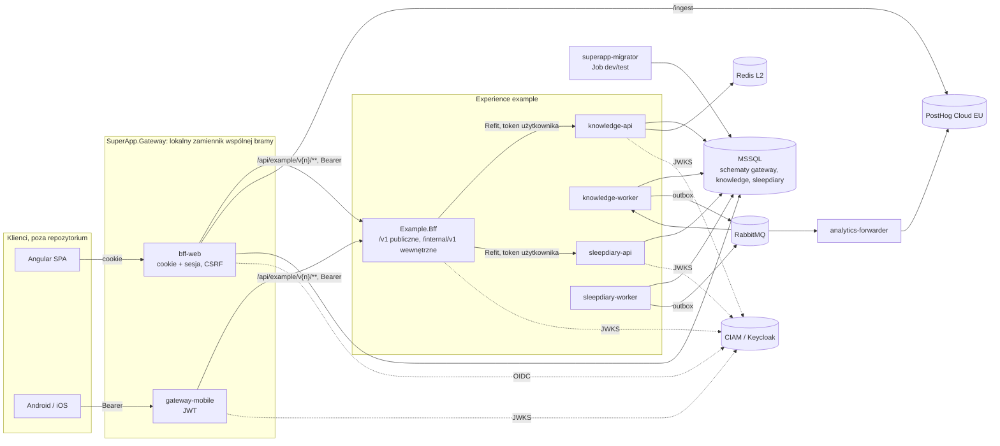
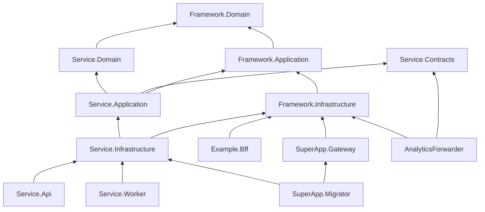

# Dokumentacja rozwiązania SuperApp

| | |
|---|---|
| **Wersja** | 1.0 |
| **Data** | 2026-10-02 |
| **Status** | Projekt, do przeglądu |
| **Właściciel** | [do uzupełnienia] |
| **Zakres** | Całe repozytorium: projekty solucji, interfejsy, konfiguracja, wdrożenie, narzędzia |
| **Powiązane** | [Dokument architektury](architektura.md) (arc42), [ADR](adr/README.md), [Przewodnik programisty](przewodnik/README.md) |

### Jak czytać ten dokument

Dokument opisuje rozwiązanie **element po elemencie**: każdy projekt solucji, jego publiczne interfejsy, konfigurację, zachowanie
i pułapki. Uzupełnia dokument architektury, nie zastępuje go:

| Dokument | Odpowiada na pytanie | Poziom |
|---|---|---|
| [`architektura.md`](architektura.md) | dlaczego system jest zbudowany tak, a nie inaczej; widoki, przebiegi, wdrożenie, jakość, ryzyka | rozwiązanie |
| [`adr/`](adr/README.md) | jaką decyzję podjęto, jakie były opcje i konsekwencje | pojedyncza decyzja |
| **ten dokument** | co dokładnie jest w repozytorium, jak działa każdy element, jakie ma interfejsy, klucze konfiguracji, kody błędów i ograniczenia | projekt, typ, endpoint |
| [`przewodnik/`](przewodnik/README.md) | jak wykonać typowe zadanie krok po kroku | zadanie |

Źródłem prawdy jest kod i jego dokumentacja XML. Przy rozbieżności między kodem a tym dokumentem obowiązuje kod, a dokument
wymaga poprawki w tej samej zmianie. Uzasadnień decyzji dokument nie powtarza: odsyła do ADR w postaci `ADR-NNNN`.
Nazwy typów, plików i kluczy konfiguracji podane są tak, jak występują w kodzie.

---

## Spis treści

1. [Rozwiązanie w skrócie](#1-rozwiązanie-w-skrócie)
2. [Założenia](#2-założenia)
3. [Repozytorium, solucja i budowanie](#3-repozytorium-solucja-i-budowanie)
4. [Wewnętrzny framework `SuperApp.Framework`](#4-wewnętrzny-framework-superappframework)
5. [Serwisy domenowe](#5-serwisy-domenowe)
6. [BFF experience `Example.Bff`](#6-bff-experience-examplebff)
7. [Brama `SuperApp.Gateway`](#7-brama-superappgateway)
8. [Forwarder analityki `SuperApp.AnalyticsForwarder`](#8-forwarder-analityki-superappanalyticsforwarder)
9. [Migrator `SuperApp.Migrator`](#9-migrator-superappmigrator)
10. [Narzędzia deweloperskie](#10-narzędzia-deweloperskie)
11. [Testy](#11-testy)
12. [Wdrożenie](#12-wdrożenie)
13. [Środowisko lokalne](#13-środowisko-lokalne)
14. [Katalog interfejsów](#14-katalog-interfejsów)
15. [Nietypowe rozwiązania](#15-nietypowe-rozwiązania)
16. [Ograniczenia, znane problemy i dług techniczny](#16-ograniczenia-znane-problemy-i-dług-techniczny)
17. [Indeks ADR](#17-indeks-adr)

---

## 1. Rozwiązanie w skrócie

### 1.1 Cel i model

SuperApp to backend jednej **experience** (funkcjonalności) w super appce organizacji (ADR-0038):

- **Super app** to całe rozwiązanie organizacji. Natywny **shell** innego zespołu dostarcza tożsamość, feature flags, push
  i nawigację.
- **Experience** to jednostka własności zespołu: moduł klienta + **BFF experience** + 1..n **serwisów domenowych**.
- **Wspólna brama brzegowa** należy do innego właściciela (ADR-0037). W repozytorium jej lokalnym zamiennikiem
  i specyfikacją wymagań jest `SuperApp.Gateway`.
- Nic w kodzie i szablonach nie zakłada, że experience jest jedna: kolejne powstają poleceniem `dotnet superapp add bff`.

Repozytorium zawiera przykładową experience `example`:

- BFF `Example.Bff` (fasada dwóch serwisów i endpoint komponowany);
- serwis **Knowledge**: materiały edukacyjne z treścią blokową, kolekcje, kategorie, ulubione, oznaczanie ukończonych (ADR-0028);
- serwis **SleepDiary**: dziennik snu, jeden wpis na dzień i statystyki okresu (ADR-0029);
- forwarder zdarzeń produktowych do PostHog (ADR-0036);
- wspólny Migrator, analizatory Roslyn i narzędzie `dotnet superapp`.

### 1.2 Co jest w repozytorium, a czego nie ma

| Jest | Nie ma (poza zakresem albo jeszcze nie powstało) |
|---|---|
| Backend .NET 10: framework, 2 serwisy domenowe, BFF, brama, forwarder, Migrator | Kod klientów web (Angular) i mobile (Android, iOS); klienci powstają z kontraktu publicznego BFF |
| Charty Helm aplikacji, skrypty SQL bootstrapu | Manifesty NetworkPolicy (dostarcza dział infrastruktury, ADR-0041), konfiguracja klastra, Vault, ArgoCD |
| Lokalne środowisko docker compose z Keycloakiem jako lokalnym CIAM | Realm CIAM środowisk organizacji (dostarcza dział CIAM, ADR-0016) |
| Lokalny zamiennik bramy (`SuperApp.Gateway`) | Wspólna brama brzegowa dev/test/prod (ADR-0037) |
| Workflow `copilot-setup-steps.yml` | Pipeline CI/CD (build, testy, publikacja obrazów, `contracts diff` w PR) |
| Kontrakt modułu z shellem jako propozycja (ADR-0045, Proponowany) | Implementacja kontraktu z shellem |

### 1.3 Mapa komponentów

### 1.4 Rozwiązanie w liczbach (stan na datę dokumentu)

| Element | Liczba |
|---|---|
| Projekty w `SuperApp.slnx` | 34 (19 produkcyjnych, 12 testowych, 2 narzędziowe, 1 pomocniczy dla testów) |
| Testy (`dotnet test --solution SuperApp.slnx`) | 314 |
| Kontrakty OpenAPI w repozytorium | 4: Knowledge, SleepDiary, BFF public, BFF internal |
| Operacje API: Knowledge / SleepDiary / BFF public / BFF internal | 25 / 5 / 31 / 1 |
| Zdarzenia integracyjne | 4: `MaterialPublishedV1`, `MaterialArchivedV1`, `CollectionArchivedV1`, `SleepEntryRecordedV1` |
| Reguły testów architektury | 15 numerowanych, 2 strażniki, test zgodności `.slnx`/`.sln` |
| Analizatory Roslyn | 6 (APP001–APP006) |
| Reguły `dotnet superapp doctor` | 8 |
| ADR | 47 (45 zaakceptowanych, 1 zastąpiony, 1 proponowany) |

---

## 2. Założenia

Założenia to warunki, które rozwiązanie przyjmuje za prawdziwe. Gdy któreś przestanie obowiązywać, trzeba wrócić do wskazanej decyzji.

### 2.1 Organizacyjne

| # | Założenie | Konsekwencja w rozwiązaniu | ADR |
|---|---|---|---|
| Z1 | Klaster, Ingress, MSSQL, Redis, RabbitMQ, Vault, ArgoCD, KEDA, NetworkPolicy i obserwowalność dostarcza i konfiguruje dział infrastruktury | Repozytorium zawiera tylko obrazy, charty i wymagania; brak IaC | 0016 |
| Z2 | CIAM dostarcza i konfiguruje osobny dział; zakładany jest Keycloak zgodny z OIDC | Klienci, audience i scope to wymagania; lokalnie wzorzec w `deploy/local/keycloak/realm-superapp.json` | 0016, 0031 |
| Z3 | Wspólna brama brzegowa ma innego właściciela | `SuperApp.Gateway` nie jest artefaktem wydania; jego zachowanie jest specyfikacją wymagań | 0037 |
| Z4 | Moduł działa w shellu innego zespołu | Tożsamość, flagi i zgoda analityczna docelowo z shella (propozycja ADR-0045); do tego czasu klienci działają samodzielnie | 0038, 0045 |
| Z5 | Migracje produkcyjne wykonuje DBA | Na prod brak Joba migratora i konta z DDL; pipeline generuje skrypt idempotentny | 0004 |
| Z6 | Jedna aplikacja wydawana wspólnie | Jeden Migrator, jeden obraz migratora, wspólny cykl wydań | 0004 |
| Z7 | PostHog Cloud EU jest zewnętrznym procesorem danych z umową powierzenia | Do PostHog trafia tylko pseudonim i właściwości z listy dozwolonych | 0036 |

### 2.2 Techniczne

| # | Założenie | Konsekwencja | ADR |
|---|---|---|---|
| T1 | .NET w aktualnej wersji LTS (10), SDK 10.0.301 (`global.json`, `rollForward: latestFeature`) | `net10.0` w `Directory.Build.props` | 0002 |
| T2 | Jedna baza MSSQL na środowisko, schemat per serwis, osobny login per serwis | Izolacja przez uprawnienia, nie przez osobne bazy; zakaz odwołań do cudzych schematów | 0021 |
| T3 | Repliki są bezstanowe; stan współdzielony tylko w MSSQL i Redis | Sesje bramy i klucze Data Protection w MSSQL; locki w `sp_getapplock` | 0013 |
| T4 | Redis jest wyłącznie cache L2 i może zniknąć | Cache degraduje się do L1; Redis tylko w `/health/dependencies` | 0020, 0018 |
| T5 | RabbitMQ dostarcza wiadomości co najmniej raz, bez gwarancji kolejności | Outbox po stronie wydawcy, inbox i idempotencja po stronie konsumenta | 0005 |
| T6 | Kubernetes robi load balancing między podami | Jedna destynacja (Service) na klaster YARP | 0022 |
| T7 | TLS kończy się na Ingress | Ruch w klastrze po HTTP; adresy destynacji tylko `http://*.svc.cluster.local:port` | 0022 |
| T8 | MediatR 12.5 i MassTransit 8.5 zostają na ostatnich wersjach Apache-2.0 | Bez aktualizacji do MediatR 13+ i MassTransit 9+ | 0035 |
| T9 | Kontrakty w OpenAPI 3.0 | Etykieta `3.0.3` wymuszana przy buildzie | 0019 |
| T10 | Obrazy uruchomieniowe `aspnet:10.0-noble-chiseled-extra` | Chiseled z ICU i tzdata, bo `Microsoft.Data.SqlClient` nie działa w trybie invariant globalization | [Architektura 2.1](architektura.md#21-ograniczenia-techniczne) |

### 2.3 Bezpieczeństwa

| # | Założenie | Konsekwencja | ADR |
|---|---|---|---|
| B1 | Za bramą krąży wyłącznie access token wystawiony przez CIAM | Brama nie wystawia tokenów; wszyscy ufają jednemu `Authentication:Authority` | 0007, 0012 |
| B2 | Sieci w klastrze nie ufamy | Każdy serwis i BFF sam waliduje JWT (podpis, issuer, audience, `ClockSkew` 30 s) | 0007 |
| B3 | Kto może wołać kogo, rozstrzyga NetworkPolicy | Token użytkownika jest przekazywany bez zmian; izolację experience gwarantuje sieć, nie token | 0040, 0041 |
| B4 | Przeglądarka nie przechowuje tokenów | Ciasteczko `__Host-bff` zawiera tylko losowy klucz sesji | 0011, 0013 |
| B5 | Dane z dziennika snu to dane o zdrowiu (art. 9 RODO) | Nigdy nie trafiają do analityki ani logów | 0036 |
| B6 | Sekrety pochodzą z Vault / External Secrets | Żadnych sekretów w `appsettings*.json` i repozytorium; lokalne wartości tylko w compose i user-secrets | 0016 |

### 2.4 Konwencje kodu wymuszane przy kompilacji

| Konwencja | Mechanizm |
|---|---|
| Jeden typ najwyższego poziomu na plik, nazwa pliku = nazwa typu | APP004, APP005 (ADR-0032) |
| Przestrzeń nazw = ścieżka katalogu, file-scoped namespace | IDE0130, IDE0161 jako błąd (`EnforceCodeStyleInBuild`) |
| Kompletna dokumentacja XML publicznego API po angielsku | CS1591, APP006; w `src/Framework` także `<remarks>` (ADR-0033) |
| Wynik `Result` nie może być zignorowany | APP001 (ADR-0015) |
| Błąd i wartość `Result` odczytywane dopiero po sprawdzeniu wyniku | nullable reference types (`Result.Error` jako `Error?`, brak `Result<T>.Value`) + `TreatWarningsAsErrors` (ADR-0047) |
| ID i value object tylko przez `Create`/`New`/`FromTrusted` | APP002 (ADR-0023, ADR-0024) |
| Brak `INotification`, `IPublisher`, `IMediator` i synchronicznego `SaveChanges` | APP003 (ADR-0027) |
| Każde ostrzeżenie łamie build | `TreatWarningsAsErrors` |
| Podatności pakietów (także tranzytywnych) łamią build | `NuGetAudit` w trybie `all` |
| Logi tylko przez `[LoggerMessage]` ze stałym EventId z rejestru | przegląd + reguła `event-ids` w `doctor` (ADR-0008) |

---

## 3. Repozytorium, solucja i budowanie

### 3.1 Katalogi najwyższego poziomu

| Ścieżka | Zawartość |
|---|---|
| `SuperApp.slnx` | Solucja w formacie XML; źródło prawdy dla listy projektów i folderów |
| `SuperApp.sln` | Ta sama zawartość dla IDE bez pełnej obsługi `.slnx` (Rider); generowana przez `dotnet superapp doctor --fix`, zgodność pilnowana testem `SolutionFilesTests` |
| `global.json` | SDK 10.0.301, runner testów `Microsoft.Testing.Platform` |
| `Directory.Build.props`, `Directory.Build.targets` | Wspólne ustawienia kompilacji i cele OpenAPI (3.4) |
| `Directory.Packages.props` | Central Package Management: wersje wszystkich pakietów (3.5) |
| `nuget.config` | Źródła `nuget.org` i `tools/packages`; package source mapping |
| `.config/dotnet-tools.json` | Narzędzia lokalne: `dotnet-ef` 10.0.12, `refitter` 2.3.0, `superapp.cli` 0.6.3 |
| `.config/superapp-doctor.json` | Wyjątki reguły `doc-paths` (przykładowe ścieżki z przepisów) |
| `.editorconfig` | Styl kodu; `app_documentation_require_remarks` dla `src/Framework` |
| `src/` | Kod: `Framework`, `Services`, `Bff`, `Gateway`, `Analytics`, `Migrator`, `Tools` |
| `tests/` | `SuperApp.ArchitectureTests` |
| `deploy/` | `helm/` (charty), `sql/` (bootstrap), `local/` (compose, Keycloak, certyfikat deweloperski) |
| `tools/` | `bootstrap.ps1`/`.sh` (instalacja narzędzia), `packages/` (lokalne źródło NuGet z paczką narzędzia) |
| `docs/` | Dokument architektury, ADR, przewodnik, rejestr EventId, ten dokument |
| `.github/` | Instrukcje Copilota, instrukcje per warstwa, prompty, workflow `copilot-setup-steps.yml` |
| `artifacts/` | Wyniki poleceń narzędzia (skrypt migracji, kopia kontraktów); ignorowany przez git |

### 3.2 Projekty solucji

Foldery solucji odpowiadają katalogom. Kolumna „Wdrażany jako” podaje Deployment/Job Kubernetes albo „—” dla bibliotek i testów.

| Projekt | Typ | Rola | Zależy od | Wdrażany jako |
|---|---|---|---|---|
| `SuperApp.Framework.Domain` | biblioteka | Klasy bazowe agregatów, zdarzenia domenowe, `Result`, kontrakty value objectów i ID | — (tylko BCL) | — |
| `SuperApp.Framework.Application` | biblioteka | CQRS na MediatR, behaviors, porty (UoW, publisher, flagi, użytkownik, zegar), stronicowanie | Framework.Domain | — |
| `SuperApp.Framework.Infrastructure` | biblioteka | Hosting, EF (UoW, konwencje), MassTransit, cache, OpenAPI, klienci downstream, analityka, bezpieczeństwo, telemetria | Framework.Application | — |
| `SuperApp.Framework.Testing` | biblioteka dla testów | `ResultAssert`: rozpakowanie `Result` w testach (4.5) | Framework.Domain | — (tylko projekty testów; reguła architektury 15) |
| `Knowledge.Domain` | biblioteka | Model domeny Knowledge | Framework.Domain | — |
| `Knowledge.Application` | biblioteka | Komendy, zapytania, walidatory, translatory zdarzeń | Knowledge.Domain, Knowledge.Contracts, Framework.Application | — |
| `Knowledge.Infrastructure` | biblioteka | Konteksty EF, repozytoria, handlery zapytań, cache, migracje | Knowledge.Application, Framework.Infrastructure | — |
| `Knowledge.Contracts` | biblioteka (pakiet NuGet) | Zdarzenia integracyjne (published language) | — | — |
| `Knowledge.Api` | host ASP.NET Core | API HTTP serwisu | Knowledge.Infrastructure (composition root) | `knowledge-api` |
| `Knowledge.Worker` | host | Konsumenci zdarzeń, dostarczanie outboxa | Knowledge.Infrastructure | `knowledge-worker` |
| `SleepDiary.Domain`, `.Application`, `.Infrastructure`, `.Contracts`, `.Api`, `.Worker` | jak Knowledge | Serwis SleepDiary | jak Knowledge | `sleepdiary-api`, `sleepdiary-worker` |
| `Example.Bff` | host ASP.NET Core | BFF experience `example` | Framework.Infrastructure (bez serwisów, nawet `Contracts`) | `example-bff` |
| `SuperApp.Gateway` | host ASP.NET Core (YARP) | Lokalny zamiennik wspólnej bramy, profile `bff-web` i `gateway-mobile` | Framework.Infrastructure | `bff-web`, `gateway-mobile` (tylko lokalnie i w E2E) |
| `SuperApp.AnalyticsForwarder` | host | Zdarzenia integracyjne → zdarzenia produktowe PostHog | Framework.Infrastructure, `*.Contracts` | `analytics-forwarder` |
| `SuperApp.Migrator` | konsola | Migracje wszystkich kontekstów zapisu i bramy | Gateway, `*.Infrastructure` | Job `superapp-migrator` (dev/test) |
| `SuperApp.Analyzers` | analizator Roslyn (`netstandard2.0`) | APP001–APP006 | Microsoft.CodeAnalysis | — (podpięty do każdego projektu) |
| `SuperApp.Cli` | narzędzie .NET (`dotnet superapp`) | Spójność repozytorium, scaffolding, środowisko lokalne, kontrakty | System.CommandLine | — (narzędzie lokalne) |
| `Knowledge.Domain.Tests`, `.Application.Tests`, `.IntegrationTests` | testy | Domena bez mocków, handlery z fake'ami, integracja z MSSQL (Testcontainers) | odpowiednie projekty | — |
| `SleepDiary.*.Tests` | testy | jak Knowledge | | — |
| `Example.Bff.Tests` | testy | Elementy BFF i podział kontraktów | Example.Bff | — |
| `SuperApp.Gateway.Tests` | testy | Mapper tras, sesje, odświeżanie tokenów, Data Protection (MSSQL w Testcontainers) | SuperApp.Gateway | — |
| `SuperApp.AnalyticsForwarder.Tests` | testy | Pseudonimizacja, walidacja konfiguracji, mapowanie konsumentów | SuperApp.AnalyticsForwarder | — |
| `SuperApp.Analyzers.Tests` | testy | Reguły APP001–APP006 | SuperApp.Analyzers | — |
| `SuperApp.Cli.Tests` | testy | Edytory, plany, reguły doctor, diff kontraktów, doctor na tym repozytorium | SuperApp.Cli | — |
| `SuperApp.ArchitectureTests` | testy | 14 reguł architektury (ArchUnitNET) i zgodność `.slnx`/`.sln` | hosty wszystkich serwisów, BFF, bramy, forwardera, Migratora | — |

### 3.3 Graf zależności

Reguła zależności (ADR-0002) jest egzekwowana testami architektury (11.2). `Service.Api` i `Service.Worker` referują
`Service.Infrastructure` wyłącznie jako composition root: reguła 6 zabrania ich typom zależności od typów Infrastructure,
a `Program.cs` z top-level statements leży poza jej zasięgiem.

### 3.4 Ustawienia budowania

**`Directory.Build.props`** (wszystkie projekty):

| Ustawienie | Wartość | Po co |
|---|---|---|
| `TargetFramework` | `net10.0` | LTS |
| `LangVersion`, `AnalysisLevel` | `latest` | |
| `Nullable`, `ImplicitUsings` | `enable` | |
| `TreatWarningsAsErrors` | `true` | każde ostrzeżenie łamie build |
| `EnforceCodeStyleInBuild` | `true` | IDE0130 (namespace = folder) i IDE0161 (file-scoped namespace) w buildzie |
| `GenerateDocumentationFile` | `true` | CS1591 i APP006 (ADR-0033) |
| `ManagePackageVersionsCentrally` | `true` | Central Package Management |
| `NuGetAudit`, `NuGetAuditMode` | `true`, `all` | podatności bezpośrednie i tranzytywne łamią build |
| `InterceptorsNamespaces` | `+= Microsoft.AspNetCore.OpenApi.Generated` | komentarze XML kontrolerów trafiają do OpenAPI |
| `IsTestProject` | `true` dla nazw kończących się na `Tests` | |
| testy: `NoWarn` | `+= CS1591;APP006` | testy nie są publicznym API |
| testy: `TestingPlatformCommandLineArguments` | `--results-directory "<projekt>/bin/TestResults"` | wyniki testów w `bin/` projektu, nie w katalogu głównym |
| `ProjectReference` do `SuperApp.Analyzers` | `OutputItemType=Analyzer`, `ReferenceOutputAssembly=false` | APP001–APP006 we wszystkich projektach poza samymi analizatorami |

**`Directory.Build.targets`**:

- `AddReferencedXmlDocsForOpenApi` (gdy `OpenApiGenerateDocuments=true`): dodaje pliki XML dokumentacji referencjonowanych projektów
  (bez `*.Infrastructure`) jako `AdditionalFiles`, żeby opisy komend, DTO, `PagedResult` i enumów trafiły do kontraktu (ADR-0019,
  ADR-0033).
- `SetOpenApiContractVersionLabel` (po `GenerateOpenApiDocuments`): zamienia `"openapi": "3.0.x"` na `"3.0.3"` w każdym
  wygenerowanym kontrakcie. Microsoft.OpenApi 2.x zapisuje `3.0.4`, którego Rider i starsze generatory nie rozpoznają.

**`nuget.config`**: źródła `nuget.org` i `superapp-tools` (`tools/packages`). Package source mapping kieruje `SuperApp.Cli`
wyłącznie do źródła lokalnego, a wszystko inne do nuget.org (ochrona przed dependency confusion).

**`.editorconfig`**: pliki migracji (`**/Migrations/*.cs`) są `generated_code`; `src/Framework/**` wymaga `<remarks>` na typach
publicznych (`app_documentation_require_remarks = true`).

**Generowanie kontraktów OpenAPI w buildzie.** Projekty Api i BFF mają `OpenApiGenerateDocuments=true` i zapisują kontrakt do
katalogu `openapi/` projektu (`--openapi-version OpenApi3_0`). Generator uruchamia aplikację w trybie `GetDocument.Insider`;
`BuildTimeDocumentGeneration.IsActive` pozwala wtedy pominąć MassTransit, klienta PostHog i prawdziwe adresy downstream (4.3.11).
Obrazy Docker publikują z `OpenApiGenerateDocuments=false`.

### 3.5 Pakiety

Wersje w `Directory.Packages.props` (CPM, bez przypinania tranzytywnego). Nowy pakiet wymaga uzasadnienia ([Architektura 2.3](architektura.md#23-konwencje)).

| Obszar | Pakiety i wersje | Używa | ADR |
|---|---|---|---|
| EF Core | `Microsoft.EntityFrameworkCore.SqlServer`, `.Design` 10.0.12; `Microsoft.Extensions.Diagnostics.HealthChecks.EntityFrameworkCore` 10.0.12 | Framework.Infrastructure, `*.Infrastructure`, Gateway | 0003 |
| ASP.NET Core | `Microsoft.AspNetCore.OpenApi`, `Microsoft.Extensions.ApiDescription.Server`, `Microsoft.AspNetCore.Authentication.JwtBearer`, `.OpenIdConnect`, `Microsoft.AspNetCore.DataProtection.EntityFrameworkCore` 10.0.12 | Framework, Api, BFF, Gateway | 0006, 0019 |
| Cache | `Microsoft.Extensions.Caching.Hybrid` 10.10.0, `Microsoft.Extensions.Caching.StackExchangeRedis` 10.0.12 | Framework.Infrastructure | 0020 |
| Klienci HTTP | `Refit`, `Refit.HttpClientFactory`, `Refit.Reflection` 16.3.0; `Microsoft.Extensions.Http.Resilience` 10.10.0 | Framework.Infrastructure | 0014 |
| Brama | `Yarp.ReverseProxy` 2.3.0 | Gateway | 0006 |
| Mediator, walidacja | `MediatR` 12.5.0, `FluentValidation` + `.DependencyInjectionExtensions` 12.1.1, `Microsoft.Extensions.Logging.Abstractions` 10.0.12 | Framework.Application | 0035 |
| Messaging | `MassTransit`, `MassTransit.RabbitMQ`, `MassTransit.EntityFrameworkCore` 8.5.11 | Framework.Infrastructure | 0005, 0035 |
| Telemetria | `OpenTelemetry.Extensions.Hosting`, `.Exporter.OpenTelemetryProtocol` 1.19.1; `OpenTelemetry.Instrumentation.AspNetCore`, `.Http`, `.Runtime`, `.SqlClient` 1.19.0 | Framework.Infrastructure | 0008 |
| Analityka | `PostHog` 2.15.7 | tylko Framework.Infrastructure i AnalyticsForwarder (reguła architektury 11) | 0036 |
| Narzędzie | `System.CommandLine` 2.0.12 | SuperApp.Cli | 0046 |
| Analizatory | `Microsoft.CodeAnalysis.CSharp`, `.Analyzers`, `.CSharp.Workspaces` 4.14.0; `Microsoft.CodeAnalysis.CSharp.Analyzer.Testing` 1.1.4 | SuperApp.Analyzers(+Tests) | 0015 |
| Testy | `xunit.v3` 4.0.1, `xunit.runner.visualstudio` 4.0.0, `Microsoft.NET.Test.Sdk` 18.10.1, `Testcontainers.MsSql` 4.15.0, `TngTech.ArchUnitNET.xUnitV3` 0.13.4 | projekty testowe | 0025 |

`Refit.Reflection` jest potrzebny, bo Refit 16 wymaga jawnego włączenia reflection request buildera dla `AddRefitClient`
z interfejsami z Refittera. `Microsoft.Extensions.Logging.Abstractions` jest referowany jawnie, bo MediatR 12 nie dostarcza go już
tranzytywnie, a `[LoggerMessage]` go potrzebuje.

---

## 4. Wewnętrzny framework `SuperApp.Framework`

Trzy biblioteki techniczne współdzielone przez wszystkie serwisy, BFF-y, bramę i forwarder. **Bez pojęć biznesowych** (ADR-0002).
Dokumentacja XML typów frameworka jest wzorcem dla reszty kodu (ADR-0033). Framework nie ma `InternalsVisibleTo`.

### 4.1 `SuperApp.Framework.Domain`

Czysty BCL, bez pakietów.

**Agregaty** (`Aggregates`):

| Typ | Opis |
|---|---|
| `Entity<TId>` | Encja z tożsamością `TId : struct, IEquatable<TId>`; prywatny setter `Id` tylko dla EF. Celowo **nie** nadpisuje `Equals` (EF śledzi encje po referencji); porównuje się jawnie `Id`. Bezpośrednio dziedziczą z niej tylko encje wewnątrz agregatu. |
| `AggregateRoot<TId>` | Korzeń agregatu zbierający zdarzenia domenowe: `DomainEvents`, `ClearDomainEvents()`, `protected Raise(IDomainEvent)`. `Raise` wołamy po zmianie stanu i po sprawdzeniu niezmienników, żeby nieudana operacja nie zostawiła zdarzenia. |
| `IAggregateRoot` | Niegeneryczny widok agregatu dla infrastruktury; przez niego `WriteDbContextBase` znajduje zdarzenia do rozesłania. |

Konwencja agregatu: `public sealed class X : AggregateRoot<XId>`, prywatne settery, kolekcje jako prywatne pola wystawione przez
`IReadOnlyList<T>`, fabryka `Create(...)` zwracająca `Result<X>`, prywatny konstruktor (używany też przez EF), jedno repozytorium
na agregat z interfejsem w Domain.

**Zdarzenia domenowe** (`Events`): `IDomainEvent` to pusty interfejs markerowy. Zdarzenia to `sealed record` w czasie przeszłym obok
agregatu, niosące czas zmiany. `INotification` MediatR jest zabroniony (APP003). Cykl życia opisuje 4.2 i 15.4.

**Wyniki** (`Results`, ADR-0015):

| Typ | Opis |
|---|---|
| `ErrorType` | `Validation` (400), `Forbidden` (403), `NotFound` (404), `Conflict` (409), `BusinessRule` (422) |
| `Error` | `sealed record` z prywatnym konstruktorem: `Code`, `Message`, `Type`, `Details` (słownik `pole → komunikaty`, wypełnia tylko `ValidationBehavior`). Fabryki: `Validation`, `Forbidden`, `NotFound`, `Conflict`, `BusinessRule`. |
| `Result` | `IsSuccess`, `IsFailure`, `Error` (typ `Error?`: `null` przy sukcesie), `Success()`, `Failure(Error)`, niejawna konwersja z `Error`. Atrybuty `[MemberNotNullWhen]` na `IsFailure`/`IsSuccess` mówią kompilatorowi, kiedy `Error` nie jest `null`; użycie bez sprawdzenia to CS8602/CS8604, czyli błąd kompilacji (ADR-0047). Nic nie rzuca. |
| `Result<T>` | **`TryGetValue(out T value, out Error? error)`** (jedyny odczyt wartości), `Map`, niejawne konwersje z `T` i `Error`. **Nie ma `Value`**: dla wartości będących strukturami (ID, value objects, `Guid`) nullowalna właściwość dawałaby po cichu `default`, a rzucająca przenosiłaby sprawdzenie do runtime (ADR-0047). |
| `IResultFactory<TSelf>` | `static abstract TSelf FromError(Error)`: pozwala behaviorom zwrócić błąd bez refleksji. Ograniczenie `TResponse : IResultFactory<TResponse>` na komendach i zapytaniach sprawia, że **żądanie zwracające cokolwiek innego niż `Result`/`Result<T>` nie skompiluje się**. |

Kody błędów: `{serwis}.{pojęcie}.{problem}` w snake_case; kody frameworka mają prefiks techniczny (`auth.*`, `validation.failed`,
`persistence.*`). Kod jest częścią kontraktu API: nie zmienia się go ani nie używa ponownie. Komunikat trafia do `title`
w ProblemDetails, może się zmieniać i nie zawiera danych osobowych. Błędy wielokrotnego użytku leżą w `{Agregat}Errors`.

**Value objects i ID** (`ValueObjects`, ADR-0023, ADR-0024):

| Typ | Opis |
|---|---|
| `ISingleValueObject<TSelf, TValue>` | `Value`, `static abstract Result<TSelf> Create(TValue)` (walidacja, jedyna droga dla Domain i Application), `static abstract TSelf FromTrusted(TValue)` (bez walidacji, tylko infrastruktura i testy). Implementacja: `readonly record struct` z prywatnym konstruktorem. |
| `IStronglyTypedId<TSelf, TValue>` | Dodaje `static abstract TSelf New()`; implementacje używają `Guid.CreateVersion7()` (uporządkowany w czasie, nie fragmentuje indeksu klastrowego). `Create` odrzuca `Guid.Empty` błędem `{serwis}.{agregat}.invalid_id`. |

`default` i `new()` dla tych typów są błędem kompilacji (APP002). Mapowanie EF, JSON i OpenAPI jest automatyczne (4.3.3, 4.3.13,
4.3.11); `FromTrusted` może wołać tylko Infrastructure (reguła architektury 5). W `Contracts` i read modelach są wyłącznie prymitywy.

### 4.2 `SuperApp.Framework.Application`

Pakiety: MediatR 12.5, FluentValidation 12.1, `Microsoft.Extensions.Logging.Abstractions`.

**Rejestracja:** `AddAppApplication(params Assembly[])` rejestruje handlery MediatR, walidatory (także `internal`), każdy
`IDomainEventHandler<>` jako scoped oraz behaviors w kolejności (ADR-0017, pilnowanej regułą architektury 9):

| # | Behavior | Działanie |
|---|---|---|
| 1 | `LoggingBehavior` | Span `ActivitySource "SuperApp.Application"` nazwany typem żądania; log 100 (sukces) albo 101 (porażka z kodem błędu). Payload żądania nie jest logowany. Wyjątki przelatują bez logów 100/101. |
| 2 | `AuthorizationBehavior` | `[AllowAnonymousRequest]` przepuszcza; niezalogowany → `auth.unauthenticated`; brak scope z `[RequiresScope]` → `auth.missing_scope`. Atrybuty cache'owane per typ. Reguły zasobu (właściciel, szkice) należą do handlera i agregatu. |
| 3 | `ValidationBehavior` | Uruchamia wszystkie walidatory FluentValidation i zwraca `validation.failed` z `Details`; nic nie rzuca. |
| 4 | `TransactionBehavior` | Tylko komendy (ograniczenie `TRequest : ICommand<TResponse>`). Gdy transakcja już istnieje (konsument MassTransit z outboxem): sukces → `SaveChangesAsync` bez commitu, porażka → `DiscardChanges()`. W przeciwnym razie własna transakcja: sukces → zapis i commit, porażka → rollback. |

Autoryzacja jest przed walidacją, żeby nieuprawniony klient nie sondował reguł walidacji.

**Komunikaty CQRS** (`Messaging`):

| Typ | Konwencja |
|---|---|
| `ICommand<TResponse>`, `ICommand` (= `ICommand<Result>`) | `public sealed record` w `Application/Features/{Agregat}/{PrzypadekUżycia}/` bez sufiksu „Command”; prymitywy na wejściu; jedna komenda zmienia jeden agregat; `[RequiresScope]` albo `[AllowAnonymousRequest]`. |
| `ICommandHandler<TCommand, TResponse>` | `internal sealed`, w Application; tylko orkiestruje: konwersja prymitywów przez `Create(...).TryGetValue`, załadowanie agregatu, jedna metoda agregatu, `Add` przy tworzeniu. Bez `SaveChanges`, transakcji, publikacji i rzucania dla oczekiwanych błędów. |
| `IQuery<TResponse>`, `IQueryHandler<TQuery, TResponse>` | Zapytanie w Application, **handler w Infrastructure** (ADR-0026, reguła architektury 8), projekcja z `ReadDbContext`, opcjonalnie `FailSafeCache`. Brak transakcji. |

**Zdarzenia** (`Events`):

| Typ | Opis |
|---|---|
| `IDomainEventDispatcher` | Port wołany przez `WriteDbContextBase`; własny dispatcher zamiast notyfikacji MediatR (ADR-0027). |
| `IDomainEventHandler<TEvent>` | `HandleAsync(TEvent, ct)`; działa **przed zapisem, w tej samej transakcji**; wyjątek cofa komendę. Zastosowania: tłumaczenie na zdarzenie integracyjne, inwalidacja cache przez `OnCommitted`. Zakazy: modyfikacja innych agregatów, `SaveChangesAsync`, wywołania zewnętrzne, poleganie na kolejności handlerów. |
| `IIntegrationEventPublisher` | `PublishAsync<TEvent>(TEvent, ct)` dodaje wiadomość do outboxa bieżącego unit of work; wysyłka po commicie, przez Workera. Publikuje się wyłącznie z handlera zdarzenia domenowego. |

**Persystencja** (`Persistence`): `IUnitOfWork` (implementuje go `WriteDbContextBase`):

| Składowa | Działanie |
|---|---|
| `HasActiveTransaction` | `true` w konsumencie, którego inbox/outbox otworzył transakcję |
| `BeginTransactionAsync` | zwraca `IUnitOfWorkTransaction` (`CommitAsync`; dispose bez commitu = rollback) |
| `SaveChangesAsync` | dispatch zdarzeń domenowych, potem zapis; naruszenie unikalnego indeksu → `Result` z `Conflict`; konflikt `rowversion` → `persistence.concurrency_conflict` tylko we własnej transakcji (w cudzej wyjątek idzie dalej, żeby wiadomość została ponowiona) |
| `DiscardChanges` | odłącza zmienione encje (poza `InboxState` MassTransit) i czyści akcje po commicie |
| `OnCommitted(Func<CancellationToken, Task>)` | praca po commicie (np. inwalidacja cache); odrzucana przy rollbacku; błąd jest logowany (210) i nie zmienia wyniku komendy |

**Bezpieczeństwo** (`Security`): `ICurrentUser` (`IsAuthenticated`, `Subject` = claim `sub`, `HasScope`), atrybuty
`RequiresScopeAttribute` i `AllowAnonymousRequestAttribute`, `AuthorizationErrors` (`auth.unauthenticated`,
`auth.missing_scope`, oba 403).

**Feature flags** (`FeatureFlags`, ADR-0036): `FeatureFlag(Key, DefaultValue)` deklarowana jako `static readonly`
w `{Serwis}FeatureFlags`; klucz `{serwis}_{nazwa}` jest też kluczem konfiguracji `FeatureFlags:{klucz}`. `IFeatureFlags.IsEnabledAsync`
nigdy nie wywraca żądania: przy problemie zwraca wartość domyślną. Wartość domyślna ma być bezpieczna na stałe (`false` dla nowej
funkcji, `true` dla wyłącznika awaryjnego). Flaga nie jest uprawnieniem.

**Pozostałe:** `PagedResult<T>(Items, Page, PageSize, TotalCount)` i `Paging` (`MaxPageSize = 100`, `Skip`; strona < 1 to pierwsza);
`IClock.UtcNow` (handlery nie czytają `DateTimeOffset.UtcNow`, czas trafia do agregatu parametrem); `ApplicationTelemetry`
(`ActivitySource "SuperApp.Application"`).

### 4.3 `SuperApp.Framework.Infrastructure`

#### 4.3.1 Hosting (`HostingExtensions`)

| Metoda | Co rejestruje |
|---|---|
| `AddAppServiceDefaults(serviceName)` | OpenTelemetry, `TimeProvider.System`, `IClock`, `AddProblemDetails` z `ProblemDetailsConventions.Apply`, health check `shutdown` (ready), `redis` (dependencies) gdy jest `ConnectionStrings:Redis`. Wersja bez bazy: BFF, forwarder. |
| `AddAppServiceDefaults<TWriteDbContext>(serviceName)` | Powyższe + `migrations` (startup: brak oczekujących migracji) i `mssql` (dependencies). Wolno wywołać **dokładnie jedną** z dwóch wersji (unikalne nazwy health checków). |
| `AddAppApi()` | Kontrolery i JSON (`ConfigureJson`, identyczne dla MVC i Minimal API, bo generator OpenAPI czyta opcje Minimal API), `ICurrentUser` z JWT, `AddJwtBearer` z sekcji `Authentication` (`MapInboundClaims=false`, walidacja issuer i audience, `ClockSkew` = `TokenClockSkew` = 30 s), fallback policy „zalogowany użytkownik”. **Nie** rejestruje OpenAPI (patrz niżej). |
| `ConfigureOpenApi(OpenApiOptions)` | OpenAPI 3.0 i transformery: single-value object, ProblemDetails, typ abstrakcyjny, `operationId`, schemat Bearer. Wołane w projekcie Api/BFF: `AddOpenApi(HostingExtensions.ConfigureOpenApi)`, bo generator komentarzy XML działa tylko w projekcie, który dokumentuje. |
| `ConfigureJson(JsonSerializerOptions)` | Konwerter value objectów, enumy wyłącznie jako nazwy (`allowIntegerValues: false`), `NumberHandling.Strict` (liczba w cudzysłowie → 400), usuwanie zdublowanego dyskryminatora (4.3.13). |
| `AddAppWorker()` | `ICurrentUser` = tożsamość systemowa (`IsAuthenticated = true`, `Subject = null`, wszystkie scope). `TryAdd`: wcześniej zarejestrowany fake wygrywa. |
| `MapAppDefaultEndpoints()` | `/health/startup`, `/health/ready`, `/health/live`, `/health/dependencies`, wszystkie anonimowe. |

Telemetria: tracing (ASP.NET Core, HttpClient, SqlClient, źródła `MassTransit`, `SuperApp.Application`, `SuperApp.Infrastructure`),
metryki (ASP.NET Core, HttpClient, runtime, `MassTransit`, `SuperApp.Infrastructure`), logi. Eksport OTLP **tylko** gdy ustawiono
`OTEL_EXPORTER_OTLP_ENDPOINT`, więc lokalnie i w testach collector nie jest potrzebny.

#### 4.3.2 Health checki (ADR-0018)

| Endpoint | Tag | Checki | Sonda Kubernetes |
|---|---|---|---|
| `/health/startup` | `superapp-startup` | `migrations` (serwisy, brama), `proxy-config` (brama) | startupProbe |
| `/health/ready` | `superapp-ready` | `shutdown`: unhealthy od `ApplicationStopping` (SIGTERM) | readinessProbe |
| `/health/live` | — | żadnych | livenessProbe |
| `/health/dependencies` | `superapp-dependencies`, `masstransit` | `mssql`, `redis`, MassTransit | tylko monitoring |

Readiness nie zależy od bazy ani brokera: awaria zależności nie może zdjąć wszystkich podów naraz. Startup pilnuje, żeby nowy kod nie
dostał ruchu na starym schemacie. Proces nigdy nie stosuje migracji, tylko je sprawdza.

#### 4.3.3 Persystencja

`AddAppPersistence<TWrite, TRead>(configuration, schema)`: `WriteDbContext` z `ConnectionStrings:Write`, historią migracji
w `{schema}.__EFMigrationsHistory`, strategią ponawiania `AppSqlExecutionStrategy` i `AfterCommitInterceptor`; `ReadDbContext` z `ConnectionStrings:Read`,
`EnableRetryOnFailure` i `NoTracking`; `IUnitOfWork` = kontekst zapisu; `IDomainEventDispatcher`.

| Typ | Opis |
|---|---|
| `WriteDbContextBase` | Abstrakcyjne `Schema`, `DomainAssembly`. `SaveChangesAsync`: zbiera zdarzenia z agregatów, czyści je, rozsyła sekwencyjnie, potem `base.SaveChangesAsync` (jednoprzebiegowo: zdarzenia podniesione przez handlery nie są rozsyłane). Synchroniczne `SaveChanges` rzuca `NotSupportedException`. `UniqueConstraintErrors`: mapa nazwa indeksu → błąd kontekstu; niezmapowany indeks → `persistence.duplicate`. Stosuje tylko konfiguracje EF z własnej przestrzeni nazw (`Persistence/Write/...`), dodaje encje inbox/outbox MassTransit, rejestruje konwersje value objectów z `DomainAssembly`. |
| `ReadDbContextBase` | `NoTracking`; każdy zapis rzuca `NotSupportedException`; konfiguracje z `Persistence/Read/...`; nie generuje migracji. |
| `AfterCommitInterceptor` | Uruchamia akcje `OnCommitted` po commicie **każdej** transakcji EF kontekstu (także otwartej przez outbox MassTransit), z `CancellationToken.None`; odrzuca je przy rollbacku. Akcje nie są czyszczone przy starcie transakcji, bo rejestruje się je w dispatchu, który może poprzedzać niejawną transakcję EF. |
| `TransientSqlError` | Lista numerów błędów SQL uznawanych za przejściowe (jak w `SqlServerRetryingExecutionStrategy`); używana przez `FailSafeCache`. |
| `UniqueConstraintViolation` | Wyciąga nazwę indeksu z błędów SQL 2601 i 2627. |
| `SingleValueObjectConventions` | `AddSingleValueObjectConversions(assemblies)`: każdy value object i ID mapowany konwencją (zapis `Value`, odczyt `FromTrusted`); konfiguracje encji nie potrzebują `HasConversion`. |

#### 4.3.4 Zdarzenia domenowe

`DomainEventDispatcher` (scoped) wywołuje handlery sekwencyjnie z tego samego scope DI co kontekst zapisu (publikacje trafiają do
outboxa tego samego zapisu); span `domain-event {nazwa}`, log 200 (Debug). `DesignTimeDomainEventDispatcher` rzuca przy każdym
użyciu: służy fabrykom design-time (`dotnet ef`) i Migratorowi.

#### 4.3.5 Messaging (ADR-0005, ADR-0035)

| Metoda | Zastosowanie |
|---|---|
| `AddAppMessaging<TWrite>(configuration, servicePrefix, OutboxDelivery, configureConsumers?)` | Serwisy. `IIntegrationEventPublisher` nad `IPublishEndpoint`; MassTransit na RabbitMQ (`ConnectionStrings:RabbitMq`); kolejki kebab-case z prefiksem serwisu (`knowledge-material-archived`), quorum; EF outbox (`UseBusOutbox`) i inbox na każdym endpoincie; retry 100 ms, 500 ms, 1 s, 5 s, potem kolejka `_error`. `OutboxDelivery.Disabled` (Api: zapisuje do outboxa, nie wysyła) albo `Enabled` (Worker: uruchamia delivery service), żeby skalowanie API nie mnożyło wysyłki. |
| `AddAppEventSubscriber(configuration, subscriberPrefix, configureConsumers)` | Proces bez bazy (forwarder). Bez outboxa i inboxa: wiadomość dostarczona ponownie zostanie przetworzona drugi raz, więc tylko dla efektów, które można powtórzyć; proces nie publikuje. |

#### 4.3.6 Cache (ADR-0020)

`AddAppCaching(configuration, instancePrefix)`: Redis jako L2, gdy jest `ConnectionStrings:Redis` (prefiks kluczy = schemat serwisu),
`HybridCache` (domyślnie `Expiration` 5 min, `LocalCacheExpiration` 30 s), `FailSafeCache`. Bez Redisa działa samo L1.

`FailSafeCache.GetOrCreateAsync(key, factory, FailSafeOptions(Fresh, MaxStale, LocalExpiration?), tags, ct)`:

1. Wpis żyje `Fresh + MaxStale`; wewnątrz koperty `CacheEnvelope<T>` jest znacznik świeżości.
2. Ochronę przed stampede daje `HybridCache`. Błąd pierwszego ładowania nie jest ukrywany.
3. Wpis stary: odświeża go tylko jedno żądanie na replikę (semafor per klucz), pozostałe od razu dostają starą wartość.
4. Odświeżenie kończy się **błędem przejściowym** → zwrócona stara wartość, metryka `superapp.cache.fail_safe.activations`, log 300.
   **Błąd trwały** (np. brak kolumny) jest rzucany, żeby problem był widoczny.

`RemoveByTagAsync` czyści L1 i L2; wołać przez `IUnitOfWork.OnCommitted` z handlera zdarzenia domenowego. Klucz zawiera segment
wersji (`knowledge:material:v1:{id}`) podbijany przy zmianie kształtu DTO. Cache tylko po stronie odczytu (handlery zapytań, ACL).

#### 4.3.7 Analityka i feature flags (ADR-0036)

| Typ | Opis |
|---|---|
| `AnalyticsOptions` (sekcja `Analytics`) | `ProjectToken` (włącza analitykę), `Host` (`https://eu.i.posthog.com`), `AssetsHost` (`https://eu-assets.i.posthog.com`), `FeatureFlagsKey` (sekret, lokalna ewaluacja flag), `IdKey` (sekret HMAC, min. 32 znaki), `FeatureFlagsTimeout` (1 s). Walidacja przy starcie: hosty HTTPS w domenie `*.posthog.com` bez ścieżki, query i userinfo, żeby błąd konfiguracji nie zrobił z proxy bramy na dowolną stronę. |
| `AnalyticsIdentity` | `ForSubject(sub)` = `u_` + 32 znaki hex z HMAC-SHA256(`IdKey`, `sub`); `null` gdy analityka wyłączona. Ten sam pseudonim w `/bff/user`, `/analytics/id`, flagach i forwarderze. Zmiana `IdKey` dzieli historię użytkowników. |
| `AddAppAnalytics` | Opcje z walidacją, `AnalyticsIdentity`, klient PostHog (tylko gdy włączona i poza buildem). |
| `AddAppFeatureFlags` | `PostHogFeatureFlags` (włączona analityka) albo `ConfigurationFeatureFlags` (`FeatureFlags:{klucz}`, czytane przy każdym wywołaniu). |
| `PostHogFeatureFlags` | Jedna ewaluacja na scope DI (spójność w żądaniu), z limitem `FeatureFlagsTimeout`, bez GeoIP. Błąd całej ewaluacji → wartości domyślne dla wszystkich flag scope'u (log 401); nieznana flaga → wartość domyślna (log 400); metryka `superapp.feature_flags.fallbacks`. |

#### 4.3.8 API i błędy (ADR-0015, ADR-0044)

| Typ | Opis |
|---|---|
| `ResultHttpExtensions` | `this.ToActionResult(Result)` → 204; `ToActionResult(Result<T>, onSuccess?)` → 200 albo wynik `onSuccess`; błąd → `ProblemDetails` (albo `ValidationProblemDetails` z `errors`) z `code`, `traceId`, `instance`, status z `ErrorType`. Kontrolery nie wybierają statusów same. |
| `ProblemDetailsConventions` | Podpięte w `AddProblemDetails`; uzupełnia problemy tworzone przez ASP.NET Core (wiązanie modelu, 401, 404 trasy, 415, 500): zawsze `traceId` (32 znaki hex W3C zamiast `00-…-01`), `code` ze statusu, gdy go brak, `instance`. Tabela kodów: 14.3. |
| `DownstreamResponseExtensions` | Dla BFF: `this.ToActionResult(IApiResponse)` przekazuje sukces ze statusem serwisu, a błąd **bez zmian** (status, treść, Content-Type). Brak statusu (awaria transportu) → wyjątek obsługiwany przez `DownstreamUnavailableExceptionHandler`. |
| `DownstreamUnavailableExceptionHandler` | `IExceptionHandler`: `TimeoutRejectedException` → `504 downstream.timeout`; `BrokenCircuitException` / `HttpRequestException` → `503 downstream.unavailable`; log 220. |

#### 4.3.9 Klienci downstream (`Http/Downstream`, ADR-0014, ADR-0038)

`AddDownstreamApi<TClient>(configuration, name)` zwraca `IHttpClientBuilder`:

- adres z `Downstream:{name}:BaseAddress` (brak albo adres względny zatrzymuje start; w buildzie dokumentów `http://localhost/`);
- Refit z System.Text.Json (Web defaults, enumy jako stringi, usuwanie zdublowanego dyskryminatora);
- `DownstreamUrlParameterFormatter`: daty w URL w ISO niezależnie od kultury (`DateOnly` → `yyyy-MM-dd`, `TimeOnly` → `HH:mm:ss`,
  `DateTime` → `yyyy-MM-ddTHH:mm:ss`, `DateTimeOffset` → `O`); domyślny formatter Refita dałby np. `01.10.2026`;
- `AddStandardResilienceHandler` z retry **tylko dla metod bezpiecznych** (GET, HEAD, OPTIONS), plus timeout i circuit breaker.

Builder trzeba domknąć **dokładnie jednym** sposobem uwierzytelnienia:

| Metoda | Kiedy | Działanie |
|---|---|---|
| `AddUserTokenForwarding()` | domyślnie: wywołanie w kontekście użytkownika (ADR-0040) | `UserTokenForwardingHandler` ustawia `Authorization` na Bearer bieżącego żądania z `IDownstreamTokenProvider` (domyślnie `ForwardedUserTokenProvider`); zawsze nadpisuje nagłówek, przy braku tokenu go usuwa |
| `AddClientCredentialsToken(clientName)` | wyjątek: wywołanie systemowe (ADR-0040, ADR-0042) | `ClientCredentialsTokenProvider` pobiera token z `ClientCredentials:{clientName}` (`TokenEndpoint`, `ClientId`, `ClientSecret` z Vaulta, `Scope`), cache'uje go do 60 s przed wygaśnięciem, jedno pobranie naraz na klienta |

`IDownstreamTokenProvider` to furtka na token exchange (RFC 8693): inna implementacja podmieni token bez zmian w BFF i serwisach.

`PartialResponseFetcher.FetchAsync(call, map, [timeLimit], ct)` dla endpointów komponowanych: limit czasu na część (domyślnie 2 s),
wynik `ResponsePart<T>(Status, Data)` ze statusem `Ok`, `Forbidden` (401/403), `Unavailable` (inny błąd, sukces bez treści, błąd
połączenia, circuit breaker) albo `Timeout`. Anulowanie przez klienta nie jest ukrywane.

#### 4.3.10 Bezpieczeństwo (`Security`)

| Typ | Opis |
|---|---|
| `HttpCurrentUser` | `Subject` z claimu `sub`, `HasScope` z claimów `scope`/`scp` (wartości rozdzielone spacją, porównanie ordinal) |
| `SystemCurrentUser` | Tożsamość Workera: uwierzytelniona, bez `Subject`, ma każdy scope |
| `ScopePolicyExtensions.RequireScope` | Polityka ASP.NET Core dla hostów bez MediatR (API wewnętrzne BFF) |
| `ScopeAuthorizationResultHandler` | Odmowa polityki → `403` ProblemDetails z `code=auth.missing_scope` i `traceId` (domyślne 403 nie ma treści); rejestrowany ręcznie |
| `InternalApiCallAudit` | Globalny filtr MVC BFF: wywołanie ścieżki `/internal/...` po autoryzacji → log 230 z szablonem trasy i claimem `azp` wołającego; bez danych użytkownika |

#### 4.3.11 OpenAPI (ADR-0009, ADR-0019, ADR-0039)

| Transformer | Efekt w kontrakcie |
|---|---|
| `OpenApiSingleValueObjectSchemaTransformer` | Value object i ID jako prymityw (`Guid` → `string/uuid`, `int` → `integer/int32`, `long` → `int64`, `decimal` → `number/double`, reszta → `string`) |
| `OpenApiProblemDetailsSchemaTransformer` | `ProblemDetails` i pochodne mają właściwości `code` i `traceId`; bez tego wygenerowani klienci nie odczytają `code` |
| `OpenApiAbstractTypeSchemaTransformer` | `x-abstract: true` dla klas abstrakcyjnych (czyta go NJsonSchema/Refitter), żeby warianty polimorficzne i dyskryminator były opisane; nowy wariant to zmiana kontraktu |
| `OpenApiOperationIdTransformer` | `operationId = {Kontroler}_{Akcja}`; zmiana nazwy akcji zmienia nazwę metody w klientach |
| `OpenApiBearerSecurityTransformer` | Schemat `Bearer` (JWT) i wymaganie bezpieczeństwa na każdej operacji bez `[AllowAnonymous]` |

`BuildTimeDocumentGeneration.IsActive` (`true` w procesie `GetDocument.Insider`) wyłącza w rejestracjach MassTransit, PostHog
i prawdziwe adresy downstream.

#### 4.3.12 JSON

`PolymorphicDiscriminatorProperty.RemoveDuplicate` usuwa z kontraktu serializacji właściwość o nazwie dyskryminatora, jeśli typ
bazowy ma `[JsonPolymorphic]`. Refitter generuje jednocześnie atrybut i właściwość `Type`, a System.Text.Json rzuca wtedy wyjątek.
Dzięki temu wygenerowany kod zostaje nietknięty i można go regenerować w każdej chwili.

#### 4.3.13 Value objects w JSON

`SingleValueObjectJsonConverterFactory`: zapis jako prymityw, odczyt przez `Create` (błąd walidacji → `JsonException` → 400).
`SingleValueObjectTypes` odkrywa typy refleksyjnie, wspólnie dla EF, JSON i OpenAPI. `SingleValueObjectFactory` istnieje, bo drzewa
wyrażeń EF nie mogą wołać statycznych składowych abstrakcyjnych.

#### 4.3.14 Telemetria i metryki frameworka

`InfrastructureTelemetry` (`SuperApp.Infrastructure`): `superapp.cache.requests` (tag `result`: `fresh`/`stale`/`miss`),
`superapp.cache.fail_safe.activations`, `superapp.feature_flags.fallbacks` (tag `reason`).

### 4.4 Klucze konfiguracji czytane przez framework

| Klucz | Czyta | Uwagi |
|---|---|---|
| `Authentication:Authority`, `Audience`, `RequireHttpsMetadata` | `AddAppApi` | issuer i audience zawsze walidowane |
| `ConnectionStrings:Write`, `Read` | `AddAppPersistence` | ten sam login serwisu; `Read` może wskazywać replikę `ApplicationIntent=ReadOnly` |
| `ConnectionStrings:Redis` | `AddAppCaching`, `AddAppServiceDefaults` | opcjonalny |
| `ConnectionStrings:RabbitMq` | `AddAppMessaging`, `AddAppEventSubscriber` | wymagany poza buildem dokumentów |
| `OTEL_EXPORTER_OTLP_ENDPOINT` | telemetria | brak = brak eksportu |
| `Analytics:*` | `AddAppAnalytics` | 4.3.7 |
| `FeatureFlags:{klucz}` | `ConfigurationFeatureFlags` | gdy analityka wyłączona |
| `Downstream:{nazwa}:BaseAddress` | `AddDownstreamApi` | wymagany, absolutny |
| `ClientCredentials:{klient}:TokenEndpoint`, `ClientId`, `ClientSecret`, `Scope` | `AddClientCredentialsToken` | walidacja przy starcie |

### 4.5 `SuperApp.Framework.Testing`

Biblioteka pomocnicza referowana wyłącznie przez projekty testów (serwisy i szablon `superapp-service`); kod produkcyjny nie może
jej referować (reguła architektury 15), bo jej metody rzucają zamiast obsłużyć porażkę (ADR-0047).

| Typ | Opis |
|---|---|
| `ResultAssert.Success(Result<T>)` | zwraca wartość wyniku; przy porażce rzuca `ResultAssertionException` z kodem, typem i komunikatem błędu |
| `ResultAssert.Success(Result)` | sprawdza sukces wyniku bez wartości |
| `ResultAssert.Failure(Result)` | zwraca `Error` wyniku; przy sukcesie rzuca `ResultAssertionException` |
| `ResultAssertionException` | wyjątek kończący test; bez zależności od xUnit (każdy wyjątek w teście jest jego porażką) |

---

## 5. Serwisy domenowe

### 5.1 Wzorzec serwisu

Każdy serwis to jeden bounded context (ADR-0002) z sześcioma projektami i trzema projektami testów, tworzony szablonem
`superapp-service` przez `dotnet superapp add service` (ADR-0030, ADR-0046):

| Projekt | Zawartość | Reguły |
|---|---|---|
| `{Serwis}.Domain` | agregaty, encje, value objects, ID, zdarzenia domenowe, `{Agregat}Errors`, interfejsy repozytoriów, marker `{Serwis}Domain.Assembly` | zależy tylko od `SuperApp.Framework.Domain` (reguła 2) |
| `{Serwis}.Application` | `Features/{Agregat}/{PrzypadekUżycia}/` (komenda/zapytanie, walidator, DTO, handler komendy), `IntegrationEvents/` (translatory), `{Serwis}Scopes`, `{Serwis}FeatureFlags` | bez Infrastructure, EF i MassTransit (reguła 3) |
| `{Serwis}.Infrastructure` | `{Serwis}WriteDbContext`, `{Serwis}ReadDbContext`, `Persistence/Write/{Configurations,Repositories}`, `Persistence/Read/{Models,Configurations}`, `Features/` (handlery zapytań), `Caching/`, `Migrations/`, `InfrastructureServiceCollectionExtensions` | jedyne miejsce EF i MassTransit serwisu |
| `{Serwis}.Contracts` | zdarzenia integracyjne `…V1` (pakiet NuGet, `IsPackable`) | tylko prymitywy (reguła 4) |
| `{Serwis}.Api` | `Program.cs`, cienkie kontrolery, `openapi/{Serwis}.Api.json`, Dockerfile | Infrastructure tylko w composition root (reguła 6) |
| `{Serwis}.Worker` | `Program.cs`, `Consumers/` (cienkie, deleguje do komendy) | jak Api |

**Kompozycja.** `Add{Serwis}Core(configuration)` rejestruje `AddAppApplication` (assembly Application i Infrastructure),
`AddAppPersistence`, `AddAppCaching`, `AddAppFeatureFlags` i repozytoria. `Add{Serwis}Infrastructure(configuration, OutboxDelivery,
configureConsumers?)` dodaje `AddAppMessaging`. Testy integracyjne używają samego `Core` z fake'ami portów.

**`Program.cs` Api:** `AddAppServiceDefaults<{Serwis}WriteDbContext>("{serwis}-api")` → `AddAppApi()` →
`AddOpenApi(HostingExtensions.ConfigureOpenApi)` → `Add{Serwis}Infrastructure(..., OutboxDelivery.Disabled)` →
`UseExceptionHandler` → `UseStatusCodePages` → `UseAuthentication` → `UseAuthorization` → `MapControllers` →
`MapOpenApi().AllowAnonymous()` → `MapAppDefaultEndpoints()`. Worker: `AddAppWorker()` zamiast `AddAppApi()`,
`OutboxDelivery.Enabled` i `bus.AddConsumers(typeof(Program).Assembly)`; wystawia tylko health.

**Konsument** (`{Serwis}.Worker/Consumers`): zdarzenie → komenda MediatR. Idempotencję daje inbox EF (powtórzony `MessageId`
pomijany). Błąd biznesowy (`Result`) jest logowany jako Warning i wiadomość jest potwierdzana; wyjątek techniczny uruchamia retry,
potem `_error`.

**Migracje:** `{Serwis}.Infrastructure/Migrations`, generowane z `WriteDbContext` (`dotnet superapp migration add`), historia
w `{schemat}.__EFMigrationsHistory`. `DesignTimeWriteDbContextFactory` używa zastępczego connection stringa i
`DesignTimeDomainEventDispatcher`.

### 5.2 Knowledge

Materiały edukacyjne z treścią blokową, kolekcje, kategorie i biblioteka użytkownika (ADR-0028). Schemat `knowledge`, login
`knowledge_app`, porty lokalne: Api 5101, Worker 5111.

#### Domena

| Agregat | Stan i reguły | Zdarzenia |
|---|---|---|
| `Category` | `Name` (≤100 po trimie), `Slug` (≤100, `^[a-z0-9]+(-[a-z0-9]+)*$`, niezmienny, bez trimowania i zmiany wielkości liter). Płaska, bez hierarchii, nieusuwalna. `Rename` z tą samą nazwą nic nie robi. | `CategoryChanged` (tylko inwalidacja cache) |
| `Collection` | `Title` (≤200), `Description` (≤2000), `Status`, uporządkowane `Items` (≤200, bez duplikatów, przenumerowane 0..n-1), `Categories` (≤20, duplikaty usuwane). Opublikowana kolekcja nie może mieć pustej listy. Statusu materiałów nie sprawdza: widoczność rozstrzyga strona odczytu. | `CollectionArchived` |
| `Material` | `Type` (Article, Video, Podcast; ustalany raz), `Title`, `Description`, `MainMediaUrl` (`WebUrl`, HTTPS; zabroniony dla Article, wymagany do publikacji Video i Podcast), `MainMediaDurationSeconds`, `Status`, `Blocks` (treść), `ContentPlainText`, `ReadingTimeMinutes`, `Categories` (≤20). Publikacja wymaga treści. `ReplaceContent` zastępuje całą treść. | `MaterialChanged` (najwyżej raz na jednostkę pracy, `Touch`), `MaterialPublished` (tylko pierwsza publikacja), `MaterialArchived` |
| `Favorite` | `UserId`, `ItemType` (Material, Collection), `ItemId`, `AddedAt`; jeden na użytkownika i element | — |
| `MaterialCompletion` | `UserId`, `MaterialId`, `CompletedAt`; **nie** jest usuwany przy archiwizacji materiału | — |

Cykl publikacji (`PublicationStatus`): `Draft` → `Published` → `Archived`; Draft można zarchiwizować od razu; nie ma cofnięcia
publikacji ani powrotu z Archived; ponowne `Publish`/`Archive` to no-op bez zdarzenia.

ID: `CategoryId`, `CollectionId`, `MaterialId`, `MaterialCompletionId`, `FavoriteId`, `BlockId`. **`BlockId` nie jest stabilny**:
każde `ReplaceContent` nadaje nowe, więc klient nie może używać go jako kotwicy. Value objects: `UserId` (claim `sub`, ≤200, bez
założeń o formacie; jedyna przechowywana dana użytkownika), `WebUrl` (absolutny HTTPS, ≤2048).

**Treść blokowa** (`ContentBuilder`, czysta funkcja): wejście `BlockSpec` (drzewo), wyjście płaska lista `ContentBlock` (jedna tabela
dla wszystkich typów, rodzic + pozycja), `PlainText` i czas czytania (200 słów na minutę). Limity: 500 bloków, lista do głębokości 3,
toggle do głębokości 2, 200 spanów na blok, 5000 znaków na span, 20 000 znaków kodu. 19 typów najwyższego poziomu (heading, paragraph,
quote, list, checklist, callout, toggle, keyTakeaways, divider, image, gallery, video, audio, embed, linkCard, code, table, timestamp,
transcript) i typy podrzędne (ListItem, ChecklistItem, TakeawayItem, TableRow, TableCell, TranscriptSegment). Formatowanie tekstu:
`TextMarks` jako flagi (Bold, Italic, Underline, Strikethrough, Code, Highlight). Embed tylko z YouTube, Vimeo i Spotify. Linki tylko
HTTPS albo `mailto:`. Pierwsze naruszenie daje `knowledge.content.invalid_block` ze ścieżką w komunikacie, np. `blocks[2].children[0]`.

#### Przypadki użycia

| Przypadek | Rodzaj | Scope | Uwagi |
|---|---|---|---|
| `CreateCategory`, `RenameCategory` | komenda | `knowledge.catalog.write` | slug unikalny: sprawdzenie w handlerze + unikalny indeks |
| `ListCategories` | zapytanie | `knowledge.catalog.read` | bez stronicowania, posortowane po nazwie, cache |
| `CreateCollection`, `UpdateCollectionDetails`, `SetCollectionItems`, `SetCollectionCategories`, `PublishCollection`, `ArchiveCollection` | komendy | `knowledge.catalog.write` | `SetCollectionItems` przekazuje duplikaty do agregatu, żeby dać `duplicate_items`, a nie `unknown_materials` |
| `GetCollection`, `ListCollections` | zapytania | `knowledge.catalog.read` | czytelnik widzi tylko opublikowane; edytor (ze scope zapisu) widzi wszystko |
| `CreateMaterial`, `UpdateMaterialDetails`, `ReplaceMaterialContent`, `SetMaterialCategories`, `PublishMaterial`, `ArchiveMaterial` | komendy | `knowledge.catalog.write` | `UpdateMaterialDetails` zastępuje wszystkie 4 pola (to nie PATCH) |
| `GetMaterial`, `ListMaterials` | zapytania | `knowledge.catalog.read` | `GetMaterial` czytelnika z cache; edytora zawsze z bazy |
| `AddFavorite`, `RemoveFavorite`, `MarkMaterialCompleted`, `UnmarkMaterialCompleted` | komendy | `knowledge.library.write` | idempotentne; element musi być opublikowany; użytkownik zawsze z tokenu |
| `ListMyFavorites`, `ListMyCompletedMaterials` | zapytania | `knowledge.library.read` | tylko opublikowane elementy |
| `RemoveFavoritesOfItem` | komenda wewnętrzna | `knowledge.catalog.write` | bez endpointu, wysyłana przez konsumentów Workera |

Edytor potrzebuje obu scope katalogu (`catalog.read` i `catalog.write`), bo zapytania deklarują tylko odczyt.
Brak elementu i element nieopublikowany dają w bibliotece ten sam błąd `knowledge.library.item_not_available`, żeby nie dało się
wykryć szkiców.

#### Infrastruktura

- **Tabele** (`knowledge`): `Categories`, `Materials`, `MaterialCategories`, `ContentBlocks`, `ContentTextSpans`, `Collections`,
  `CollectionItems`, `CollectionCategories`, `Favorites`, `MaterialCompletions` + tabele MassTransit (`InboxState`, `OutboxState`,
  `OutboxMessage`).
- **Współbieżność:** `rowversion` w `Categories`, `Materials`, `Collections` → `persistence.concurrency_conflict` (409).
- **Unikalne indeksy → błędy** (`UniqueConstraintErrors`): `IX_Categories_Slug` → `knowledge.category.slug_taken`;
  `IX_Favorites_UserId_ItemType_ItemId` → `knowledge.library.favorite_added_concurrently`;
  `IX_MaterialCompletions_UserId_MaterialId` → `knowledge.library.completion_recorded_concurrently`; inne → `persistence.duplicate`.
- **`ContentBlocks`:** 13 ograniczeń `CHECK` (pozycja, rodzic dla bloków podrzędnych, pola wymagane per typ, HTTPS), każde z jawnym
  `IS NOT NULL`, bo w SQL Server `CHECK` z wynikiem UNKNOWN przechodzi. Self-FK `ParentBlockId` z `NO ACTION` (SQL Server nie dopuszcza
  drugiej ścieżki kaskady).
- **Owned collections z pozycją** (`CollectionItems`, `ContentTextSpans`): część klucza `Position` ma `ValueGeneratedNever()`;
  bez tego EF tworzy kolumnę IDENTITY i zapis wielu elementów się nie udawał (migracja `FixOwnedPositionKeys`).
- **Odczyt:** `KnowledgeReadDbContext` z płaskimi modelami `*Row` (enumy jako stringi); `MaterialRepository.GetAsync` używa
  `AsSplitQuery`. `ContentTreeReader` składa drzewo treści z dwóch zapytań.
- **Cache** (`KnowledgeCache`): `knowledge:categories:v1` (świeże 5 min, stare do 1 h, tag `knowledge:categories`),
  `knowledge:material:v1:{id}` (2 min / 30 min, tag `knowledge:material:{id}`; cache'owany także wynik „nieopublikowany”).
  Inwalidacja: `CategoryCacheInvalidation` i `MaterialCacheInvalidation` przez `OnCommitted`. Kolekcje nie są cache'owane.
- **`RemoveAllForItemAsync`** usuwa ulubione wielu użytkowników jednym `ExecuteDeleteAsync` w transakcji komendy: świadomy wyjątek
  od zasady „jedna transakcja, jeden agregat” (ADR-0028). Lista ulubionych ukrywa zarchiwizowane elementy, zanim Worker je usunie.
- **Migracje:** `Initial`, `FixOwnedPositionKeys` (IDENTITY → zwykłe kolumny z przenumerowaniem; domyślne wartości 0 jako krok
  expand), `MassTransit8OutboxModel` (krok expand: indeksy outboxa; kolumna `BusName` z MassTransit 9 zostaje do migracji contract).
- **ACL:** brak klientów innych systemów.

#### Worker i zdarzenia

| Konsument | Zdarzenie | Komenda | Log |
|---|---|---|---|
| `MaterialArchivedConsumer` | `MaterialArchivedV1` | `RemoveFavoritesOfItem(Material, id)` | 2001 przy odrzuceniu |
| `CollectionArchivedConsumer` | `CollectionArchivedV1` | `RemoveFavoritesOfItem(Collection, id)` | 2002 przy odrzuceniu |

Publikowane zdarzenia: `MaterialPublishedV1` (tylko przy pierwszej publikacji), `MaterialArchivedV1` (także dla szkicu, którego
konsument nigdy nie widział), `CollectionArchivedV1` (nie ma zdarzenia publikacji kolekcji). Szczegóły pól: 14.4.

### 5.3 SleepDiary

Dziennik snu: jeden wpis na użytkownika i dzień (ADR-0029). Schemat `sleepdiary`, login `sleepdiary_app`, porty lokalne: Api 5102,
Worker 5112. Dane są danymi o zdrowiu (art. 9 RODO) i nie trafiają do analityki ani logów.

#### Domena

Agregat `SleepEntry`:

- `Date` to **dzień wstania** (noc z poniedziałku na wtorek to wpis wtorkowy); `UserId` i `Date` są niezmienne.
- `BedTime` i `WakeTime` to `DateTime` w czasie lokalnym użytkownika, bez strefy, nigdy nie konwertowane.
- Pochodne: `TimeInBedMinutes` (obcięte do minut), `SleepMinutes` = czas w łóżku − latencja (przebudzenia tylko liczone).
- `Record(userId, date, details, latestAllowedDate, now)` odrzuca datę z przyszłości i podnosi `SleepEntryRecorded`.
  `Update` zastępuje wszystkie dane, bez zdarzenia.
- Kolejność reguł: `wake_before_bed` → `wake_date_mismatch` (dzień wstania ≠ `Date`) → `too_long` (>1440 min) → `invalid_latency`
  → `invalid_awakenings` (0..50) → `invalid_quality` (1..5) → `notes_too_long` (>2000 po trimie).

#### Przypadki użycia

| Przypadek | Scope | Uwagi |
|---|---|---|
| `RecordSleepEntry` | `sleepdiary.entry.write` | Duplikat dnia → `sleepdiary.entry.already_exists` (409), także przy wyścigu (unikalny indeks). Najpóźniejsza dopuszczalna data: dziś w UTC + 1 dzień (tolerancja stref czasowych). |
| `UpdateSleepEntry`, `DeleteSleepEntry` | `sleepdiary.entry.write` | Bez zdarzeń: inne konteksty nie dowiadują się o zmianie ani usunięciu. |
| `GetSleepEntry` | `sleepdiary.entry.read` | Wpis innego użytkownika wygląda jak brak wpisu (404). |
| `ListSleepEntries(From, To)` | `sleepdiary.entry.read` | Oba parametry wymagane, `To >= From`, zakres ≤366 dni. Średnie liczone w serwisie (sen z 1 miejscem po przecinku, jakość z 2; `null` dla pustego zakresu). |

Walidatory odrzucają czasy z `Z` lub offsetem (`WallClockTime`: wymagany `DateTimeKind.Unspecified`), bo System.Text.Json
przesunąłby czas zegarowy. Brak parametru query `from`/`to` wiąże się jako `0001-01-01`, które walidator traktuje jak „brak”.

#### Infrastruktura

Tabela `sleepdiary.SleepEntries`: `BedTime`/`WakeTime` jako `datetime2(0)`, `rowversion`, unikalny indeks
`IX_SleepEntries_UserId_Date` o jawnej nazwie (stała `UserDateIndexName`, żeby mapowanie na `already_exists` nie rozjechało się po
cichu), `CHECK` dla kolejności czasów, jakości, przebudzeń i latencji. Cache jest zarejestrowany, ale nieużywany. Migracje: `Initial`,
`MassTransit8OutboxModel`. **Worker nie ma konsumentów**: dostarcza tylko outbox. Serwis nie ma własnych logów `[LoggerMessage]`.

Publikowane zdarzenie: `SleepEntryRecordedV1` (raz na nowy wpis; nie przy zmianie ani usunięciu).

---

## 6. BFF experience `Example.Bff`

BFF przykładowej experience `example` (ADR-0038–0040). Bez bazy, domeny i migracji (reguły architektury 12–14). Port lokalny 5120,
w klastrze `http://example-bff.example.svc.cluster.local:8080`.

### 6.1 Kompozycja

`Program.cs`:

1. `AddAppServiceDefaults("example-bff")` (wersja bez bazy) i `AddAppApi()` (JWT, audience `example-bff`).
2. Dwa dokumenty OpenAPI: `public` i `internal` (`BffOpenApiDocuments`).
3. MVC: `SuppressImplicitRequiredAttributeForNonNullableReferenceTypes`, **`ModelValidatorProviders.Clear()`**, globalny filtr
   `InternalApiCallAudit`.
4. `ScopeAuthorizationResultHandler` i polityka `example.internal.read` (`RequireScope`).
5. Klienci: `AddDownstreamApi<IKnowledgeApi>(configuration, "Knowledge").AddUserTokenForwarding()` i to samo dla `ISleepDiaryApi`.
6. Pipeline: `UseExceptionHandler` → `UseStatusCodePages` → `UseAuthentication` → `UseAuthorization` → `MapControllers` →
   `MapOpenApi().AllowAnonymous()` → `MapAppDefaultEndpoints()`.

**BFF nie waliduje treści żądań.** Atrybuty walidacji wygenerowane z kontraktu odrzucałyby poprawne dane, np. pola nullable, zanim
zobaczy je serwis. Walidacja i kody błędów należą do serwisów, a BFF przekazuje ich odpowiedź 400 bez zmian. Wejście, którego nie da się
powiązać (nieznany enum w query, zepsuty JSON), BFF odrzuca sam: `400 request.malformed`.

### 6.2 API publiczne (`/v1`, konsument: moduł)

Akcje fasady mają jedną linię: `this.ToActionResult(await client.XAsync(...))`. Odpowiedź serwisu, także błąd z `code`, idzie do
modułu bez zmian. Autoryzację sprawdza serwis; BFF wymaga tylko zalogowanego użytkownika. Ścieżki są przepisane: serwis `/v1/categories`
→ BFF `/v1/knowledge/categories`, serwis `/v1/entries` → BFF `/v1/sleepdiary/entries`.

| Kontroler | Ścieżki | Serwis |
|---|---|---|
| `KnowledgeCategoriesController` | `GET`, `POST /v1/knowledge/categories`; `PUT /v1/knowledge/categories/{categoryId}/name` | Knowledge |
| `KnowledgeCollectionsController` | `GET`, `POST /v1/knowledge/collections`; `GET`, `PUT /v1/knowledge/collections/{collectionId}`; `PUT …/items`, `PUT …/categories`; `POST …/publish`, `POST …/archive` | Knowledge |
| `KnowledgeMaterialsController` | `GET`, `POST /v1/knowledge/materials`; `GET`, `PUT /v1/knowledge/materials/{materialId}`; `PUT …/content`, `PUT …/categories`; `POST …/publish`, `POST …/archive` | Knowledge |
| `KnowledgeLibraryController` | `GET /v1/knowledge/me/favorites`; `PUT`, `DELETE /v1/knowledge/me/favorites/{itemType}/{itemId}`; `GET /v1/knowledge/me/completions`; `PUT`, `DELETE /v1/knowledge/me/completions/{materialId}` | Knowledge |
| `SleepDiarySleepEntriesController` | `GET /v1/sleepdiary/entries?from&to`; `GET`, `POST`, `PUT`, `DELETE /v1/sleepdiary/entries/{date}` | SleepDiary |
| `ExperienceSummaryController` | `GET /v1/me/summary` | oba (endpoint komponowany) |

**Endpoint komponowany `GET /v1/me/summary`** pobiera równolegle przez `PartialResponseFetcher`:

- `favorites`: 5 ostatnich ulubionych i ich liczba (`FavoritesSummaryDto`);
- `sleepWeek`: ostatnie 7 dni w UTC (dziś i 6 poprzednich), liczba wpisów i średnie policzone przez SleepDiary (`SleepWeekDto`).

Zawsze odpowiada 200 (albo 401). Każda część ma własny `status` (`Ok`, `Forbidden`, `Unavailable`, `Timeout`) i `data` tylko przy
`Ok`, więc moduł renderuje częściowo. Część inna niż `Ok` jest logowana (6001).

### 6.3 API wewnętrzne (`/internal/v1`, konsumenci: BFF-y innych experience)

| Operacja | Wymagania | Odpowiedzi |
|---|---|---|
| `GET /internal/v1/widgets/sleep-summary` (`InternalWidgets_SleepSummary`) | scope `example.internal.read` w tokenie użytkownika przekazanym przez BFF wołający, plus `sleepdiary.entry.read` dla serwisu | 200 `SleepWeekDto`, 401, 403 `auth.missing_scope` |

Zasady (ADR-0039, ADR-0040): ścieżki `/internal` nigdy nie są routowane przez bramę; dostęp z klastra ogranicza NetworkPolicy;
wołający dostaje dane wyłącznie użytkownika, którego token przekazał; każde wywołanie jest audytowane (log 230 z `azp` wołającego);
zmiany tylko wstecznie zgodne, zmiana łamiąca to nowe `/internal/v{n+1}` z uzgodnionym terminem wygaszenia starej wersji.

### 6.4 Klienci serwisów

`Clients/Knowledge/knowledge.refitter` i `Clients/SleepDiary/sleepdiary.refitter` generują do `Clients/{Serwis}/Generated` interfejsy
`IKnowledgeApi` i `ISleepDiaryApi` oraz DTO z commitowanych kontraktów serwisów (`dotnet superapp contracts`). Ustawienia:
`returnIApiResponse` (pełna odpowiedź z kodem i treścią błędu), typy `Public` (są częścią kontraktu BFF), `operationId` jako nazwa
metody (`{operationName}Async`), polimorficzna serializacja bloków treści, `DateOnly`/`TimeOnly`. Różnica: Knowledge używa
`DateTimeOffset`, SleepDiary `DateTime` (czas zegarowy bez strefy). Kodu w `Generated/` nie edytuje się ręcznie.

### 6.5 Dwa kontrakty

`BffOpenApiDocuments` dzieli operacje po ścieżce: `internal/…` → `openapi/Example.Bff_internal.json`, reszta →
`openapi/Example.Bff_public.json`. Typy z `Example.Bff.Clients.*` dostają w schematach prefiks nazwy serwisu
(`KnowledgeCategoryDto`, `SleepDiaryCreatedResponse`), żeby np. dwa `CreatedResponse` nie kolidowały; warianty polimorficzne dostają
nazwę bazy z sufiksem wariantu (`KnowledgeContentBlockDtoHeadingBlockDto`). Z kontraktu publicznego powstają klienci modułu (web,
mobile), z wewnętrznego klienci BFF-ów innych experience.

---

## 7. Brama `SuperApp.Gateway`

> `SuperApp.Gateway` to **lokalny zamiennik wspólnej bramy brzegowej** (compose, E2E, IDE) i **specyfikacja wymagań** wobec niej
> (ADR-0037). Nie jest artefaktem wydania experience i nie zawiera logiki experience. Nazwa profilu `bff-web` jest historyczna:
> to profil bramy, nie BFF experience.

### 7.1 Profile i kompozycja

Jeden projekt i jeden obraz, dwa profile wybierane kluczem `Gateway:Profile` (zmienna `Gateway__Profile`); nieznany profil zatrzymuje
start, a w Helm przerywa render.

| Profil | Klient | Uwierzytelnienie | Endpointy własne | Port lokalny |
|---|---|---|---|---|
| `bff-web` | SPA w przeglądarce | ciasteczko `__Host-bff` + sesja po stronie serwera (OIDC Authorization Code + PKCE) | `/bff/login`, `/bff/logout`, `/bff/user`, `/bff/backchannel-logout`, `/ingest/**` | https 5001, http 5000 |
| `gateway-mobile` | aplikacje mobilne | `Authorization: Bearer` (JWT z CIAM) | `/analytics/id` | https 5002 |

Rejestracje (kolejność z `Program.cs`): `AddAppServiceDefaults<GatewayDbContext>(profil)`, `GatewayDbContext`
(`ConnectionStrings:Gateway`), `AddAppCaching(…, "gateway")`, `AddAppAnalytics`, `DatabaseProxyConfigProvider` (jako provider YARP,
hosted service i źródło health checku `proxy-config`), YARP z `SecurityTransforms`, `IdempotentRetryForwarderHttpClientFactory`,
meter `SuperApp.Gateway`, polityki `GatewayPolicies`, rate limiter, request timeouts, potem `AddBffWeb` albo `AddGatewayMobile`.

Kolejność middleware: `UseExceptionHandler` → `UseStatusCodePages(GatewayStatusCodePages.WriteAsync)` → (`bff-web`)
`CsrfHeaderMiddleware` → `UseRouting` → `UseRequestTimeouts` → `UseAuthentication` → `UseAuthorization` → `UseRateLimiter` →
(`bff-web`) `/bff/*` → `/ingest` lub `/analytics/id` → `MapReverseProxy` → health.

### 7.2 Profil `bff-web`

**Uwierzytelnienie** (ADR-0011, ADR-0013):

- `AddCookie`: nazwa `__Host-bff`, `HttpOnly`, `Secure` zawsze, `SameSite=Strict`, ścieżka `/`, czas życia `Gateway:SessionLifetime`
  (domyślnie 8 h, przesuwny). Brak sesji daje **401, nie 302** (`DefaultChallengeScheme = Cookies`): XHR nie podąży za
  przekierowaniem do CIAM, więc logowanie odbywa się wyłącznie nawigacją do `/bff/login`.
- `AddOpenIdConnect` z sekcji `Authentication`: `code` + PKCE, confidential client `bff-web`, `SaveTokens`, `MapInboundClaims=false`,
  claimy z userinfo, scope z `Authentication:Scopes`. **Bez `offline_access`**: refresh token jest związany z sesją SSO, więc
  back-channel logout kończy też sesję bramy. Scope z odpowiedzi token endpointu jest kopiowany do claimu `scope`, żeby polityki
  działały jak w profilu mobile.

**Sesja po stronie serwera** (`DbTicketStore`, `ITicketStore`):

- Ciasteczko zawiera tylko losowy klucz (64 znaki hex). Bilet z claimami i tokenami (access, refresh, id) leży zaszyfrowany Data
  Protection w `gateway.Sessions`; tokeny nigdy nie trafiają do przeglądarki.
- Zapis i odświeżenie biletu odbywają się pod `sp_getapplock` (zasób: hash klucza sesji, żeby klucz nie wyciekł przez
  `sys.dm_tran_locks`; limit 15 s). Jeśli zapisany bilet ma nowsze tokeny niż zapisywany, nowsze zostają: żądanie, które załadowało
  bilet przed odświeżeniem, nie cofnie zrotowanego refresh tokenu.
- `SessionCleanupService` co 10 minut usuwa wygasłe sesje; sprząta najwyżej jedna replika naraz (lock bez czekania).

**Odświeżanie tokenów** (`TokenRefresher`, ADR-0011): w `OnValidatePrincipal`, gdy do wygaśnięcia access tokenu zostało ≤60 s.
Dokładnie raz na sesję we wszystkich replikach: single-flight w procesie plus `sp_getapplock` w bazie; replika, która dostanie lock
po innej, przejmuje już odświeżone tokeny bez wołania CIAM. Własny limit 10 s, niezależny od żądania. Odrzucenie przez CIAM kończy
sesję; brak locka albo timeout zostawiają sesję i próbują przy następnym żądaniu. Powód: przy rotacji refresh tokenów drugie użycie
tego samego tokenu CIAM traktuje jak kradzież i kończy sesję SSO.

**Data Protection** (`GatewayDataProtection`): klucze w `gateway.DataProtectionKeys`, `ApplicationName = superapp-gateway-bff-web`.
Poza Development klucze muszą być szyfrowane certyfikatem (`DataProtection:CertificatePath`, `CertificatePassword`; poprzednie
certyfikaty w `PreviousCertificatePaths` do czasu wygaśnięcia kluczy), inaczej brama nie wystartuje. Zmiana `ApplicationName` albo
utrata kluczy unieważnia wszystkie sesje.

**Endpointy `/bff`:**

| Endpoint | Zachowanie |
|---|---|
| `GET /bff/login?returnUrl=` | anonimowy; challenge OIDC; `returnUrl` tylko lokalny (zaczyna się od `/`, nie od `//` ani `/\`), inaczej `/` |
| `GET /bff/logout?sid=` | nawigacja przeglądarki, nie XHR (musi podążyć za 302 do CIAM); `sid` porównywany w stałym czasie z claimem `sid` sesji, niezgodny → 400 i sesja zostaje; zgodny → usunięcie sesji i przekierowanie do end-session CIAM; bez sesji → `/` |
| `GET /bff/user` | `{ sub, name, scopes, logoutUrl, analyticsId }`; `logoutUrl` gotowy z `sid`; nigdy tokenów |
| `POST /bff/backchannel-logout` | `logout_token` walidowany (issuer, audience = client id, podpis, czas, brak `nonce`, zdarzenie back-channel logout); usuwa sesje po `sid` albo wszystkie sesje `sub`; log 3202 |

**CSRF:** `/api/*` bez nagłówka `X-CSRF: 1` → `401 auth.csrf_header_missing` (każda metoda, także GET; nie dotyczy `/bff/*`).
Zwykły formularz nie doda nagłówka, a skrypt z innej domeny potrzebowałby preflightu CORS, którego brama nie przepuszcza. Osobny kod
pozwala SPA odróżnić brak interceptora od wygasłej sesji (`auth.invalid_token`).

**Proxy analityki `/ingest/**`** (ADR-0036): tylko przy włączonej analityce; `/ingest/static/**` → `Analytics:AssetsHost`, reszta →
`Analytics:Host`. Anonimowe, z limitem `per-user`, bez `Cookie`, `Authorization`, `X-User-*`, `X-Forwarded-*`, `Forwarded` i `X-CSRF`,
bez `Set-Cookie` w odpowiedzi; brama nie dodaje `X-Forwarded-*` (prywatność IP). Zdefiniowane w kodzie, nie w trasach z bazy, bo cel
jest zewnętrzny i nie może dostać tokenu. Przy wyłączonej analityce `/ingest` nie istnieje (401 z polityki domyślnej).

### 7.3 Profil `gateway-mobile`

`AddJwtBearer` z sekcji `Authentication` (`Authority`, `Audience = gateway-mobile`, `ClockSkew` 30 s). Token klienta przechodzi do BFF
bez zmian. Brak sesji, CSRF i Data Protection. `GET /analytics/id` (zalogowany, z limitem) zwraca `{ analyticsId }`, `null` przy
wyłączonej analityce.

### 7.4 Routing z bazy (ADR-0022)

Trasy i klastry YARP leżą w tabelach schematu `gateway`, osobno dla każdego profilu. Zmienia się je **wyłącznie migracjami**
kontekstu bramy (`HasData` w `ProxyConfigurationSeed`); użytkownik bramy ma tylko `SELECT` na tabelach tras
(`deploy/sql/02-gateway-config-permissions.sql`).

| Tabela | Klucz | Najważniejsze kolumny i ograniczenia |
|---|---|---|
| `Clusters` | (`Profile`, `ClusterId`) | `LoadBalancingPolicy` (lista dozwolonych), `ActivityTimeoutSeconds` > 0, `HttpVersion` (`1.1`, `2`), aktywny health check |
| `Destinations` | (`Profile`, `ClusterId`, `DestinationId`) | `Address`: tylko `http://{usługa}.{namespace}.svc.cluster.local:{port}` (sprawdzane `CHECK` w SQL i wyrażeniem regularnym w kodzie) |
| `Routes` | (`Profile`, `RouteId`) | `Path` (zaczyna się od `/`), `Order`, **`AuthorizationPolicy` NOT NULL** (trasa publiczna musi jawnie podać `anonymous`), `RateLimiterPolicy`, `TimeoutSeconds`, `MaxRequestBodySize`; FK do klastra `NO ACTION` |
| `RouteMethods`, `RouteHosts` | | dopasowanie po metodzie i hoście; brak wierszy = każda metoda / każdy host |
| `RouteTransforms` | (`Profile`, `RouteId`, `Order`) | `Kind`: `PathRemovePrefix`, `PathPrefix`, `PathPattern`, `RequestHeaderSet`, `RequestHeaderRemove`, `ResponseHeaderSet`, `ResponseHeaderRemove` |
| `Sessions`, `DataProtectionKeys` | | sesje i klucze profilu `bff-web` |

Tabele tras są temporalne (`…History`), więc każda zmiana jest widoczna w historii. `CHECK` profilu (`bff-web`, `gateway-mobile`)
oznacza, że zmiana nazwy profilu wymaga migracji.

**Zawartość** (`ProxyConfigurationSeed`): dla każdego profilu i każdej experience z listy `Experiences` (dziś `example`):
klaster `{exp}` (RoundRobin, 30 s, HTTP/1.1), destynacja `http://{exp}-bff.{exp}.svc.cluster.local:8080`, trasa
`/api/{exp}/v{version:int}/{**rest}` (polityka experience, limit `per-user`, timeout 30 s), transformacja `PathRemovePrefix /api/{exp}`.
Ścieżki `/internal/...` nigdy nie pasują do trasy, a serwisy domenowe nie mają tras (ADR-0039).

**Ładowanie** (`DatabaseProxyConfigProvider`):

1. Co `Gateway:ConfigPollInterval` (domyślnie 5 s) sprawdza ostatnią migrację w `gateway.__EFMigrationsHistory`; **identyfikator
   migracji jest wersją konfiguracji**.
2. Nowa wersja → odczyt tabel profilu → `ProxyConfigMapper` (zbiera błędy, nigdy nie stosuje konfiguracji częściowo) → walidator YARP
   (m.in. czy polityki autoryzacji i limitów istnieją w kodzie) → atomowa podmiana konfiguracji i zapis do cache
   (`gateway:yarp-config:v1:{profil}`, 30 dni) jako ostatniej poprawnej.
3. Wersja odrzucona przez walidację zostaje zalogowana raz (3002) i pomijana do czasu nowszej migracji; brama działa na poprzedniej.
4. Baza niedostępna przy starcie → konfiguracja z cache (3004). Bez bazy i bez cache pod nie przejdzie startupProbe.

Zmiana trafia do wszystkich replik w ciągu jednego interwału, bez restartu. Metryki: `superapp.gateway.proxy_config.loaded` (tagi
`profile`, `migration_id`: porównanie między replikami pokazuje, czy zmiana dotarła wszędzie) i
`superapp.gateway.proxy_config.reload_failures` (zalecany alert).

### 7.5 Polityki, transformacje i odporność

| Element | Działanie |
|---|---|
| `GatewayPolicies` | Polityka na experience (`example`): zalogowany użytkownik z co najmniej jednym scope zaczynającym się od prefiksu serwisu tej experience (`ServiceScopePrefixes`: `example` → `knowledge.`, `sleepdiary.`). Autoryzacja gruboziarnista; drobnoziarnistą robią serwisy. Experience bez serwisów odrzuca każdego. Nazwa `anonymous` jest zarezerwowana przez YARP. |
| `GatewayRateLimits` | Polityka `per-user`: okno stałe 1 min, partycja po `sub` (albo IP), limit `Gateway:RateLimit:PermitPerMinute` (600), bez kolejki, `429 http.too_many_requests`. Liczniki w pamięci repliki, więc efektywny limit rośnie z liczbą replik. |
| `SecurityTransforms` | Każda trasa, w kodzie: usuwa `Cookie` i wszystkie `X-User-*`. `bff-web`: ustawia `Authorization: Bearer` z access tokenu sesji (bez sesji bez nagłówka). `gateway-mobile`: zostawia `Authorization` klienta. |
| `IdempotentRetryHandler` | Ponawia tylko GET i HEAD bez treści, po błędzie połączenia albo 502/503/504; `Gateway:Retry:MaxRetries` (2), `Gateway:Retry:BaseDelay` (100 ms, wykładniczo). 500 i 4xx nie są ponawiane. Logi 3401, 3402. |
| Timeouty | Trasa: `TimeoutSeconds` → 504; klaster: `ActivityTimeoutSeconds`. |
| `GatewayStatusCodePages` | Własne puste błędy bramy (401, 403, 404, 502 po nieudanym przekazaniu, 504) dostają ProblemDetails z `code` i `traceId`. Odpowiedzi przekazane z BFF **nie są zmieniane**. Klient bez `Accept: application/json` dostaje pustą odpowiedź. |

### 7.6 Migracje bramy

| Migracja | Zawartość |
|---|---|
| `Initial` | Schemat `gateway`, tabele tras (temporalne), sesje, klucze; trasy do serwisów (stan historyczny) |
| `StrictDestinationAddress` | Ścisłe `CHECK` adresu destynacji |
| `RouteExperienceThroughBff` | Tylko dane: trasy do serwisów zastąpione trasą experience `example` do BFF. **Nie jest expand/contract**: stara replika bramy odrzuci tę konfigurację (nie zna polityki `example`) i zostanie na poprzedniej; BFF trzeba wdrożyć przed zastosowaniem migracji. |

Kolejne migracje tras tworzy `dotnet superapp add|remove bff` (`Route{Nazwa}Experience`, `Remove{Nazwa}ExperienceRoute`).

---

## 8. Forwarder analityki `SuperApp.AnalyticsForwarder`

Proces bez bazy i bez domeny, który zamienia zdarzenia integracyjne serwisów na zdarzenia produktowe PostHog (ADR-0036). Serwisy nigdy
nie rozmawiają z PostHog, więc awaria PostHog nie wpływa na ich działanie. Referuje wyłącznie `*.Contracts` serwisów (reguła 10).
Port lokalny 5180.

`Program.cs`: `AddAppServiceDefaults("analytics-forwarder")`, `AddAppWorker()`, `AddAppAnalytics`, `AddProductEventSink`,
`AddAppEventSubscriber(…, "analytics", konsumenci)` (bez inboxa i outboxa; kolejki `analytics-*`), health.

| Konsument | Zdarzenie wejściowe | Zdarzenie produktowe | Podmiot | Właściwości |
|---|---|---|---|---|
| `MaterialPublishedConsumer` | `MaterialPublishedV1` | `knowledge_material_published` | system | `material_id`, `material_type` (tytuł świadomie pominięty) |
| `MaterialArchivedConsumer` | `MaterialArchivedV1` | `knowledge_material_archived` | system | `material_id` |
| `CollectionArchivedConsumer` | `CollectionArchivedV1` | `knowledge_collection_archived` | system | `collection_id` |
| `SleepEntryRecordedConsumer` | `SleepEntryRecordedV1` | `sleepdiary_entry_recorded` | użytkownik (`UserId` → pseudonim) | **brak**: data, długość i jakość snu to dane o zdrowiu |

Reguły:

- Nazwy w `ProductEventNames`: `{serwis}_{obiekt}_{czasownik w czasie przeszłym}`; są kontraktem z PostHog i nigdy się ich nie zmienia
  (nowe znaczenie = nowa nazwa).
- Właściwości tylko z listy dozwolonych (identyfikatory, kategorie); nigdy wolny tekst, dane osobowe ani dane o zdrowiu.
- `PostHogProductEventSink` dodaje `source = backend` i `message_id`; `distinctId` to pseudonim albo `system` (wtedy bez profilu osoby);
  czas zdarzenia to czas faktu biznesowego z wiadomości. Dostarczenie „best effort”: pełna kolejka klienta → log 9002.
- Bez `Analytics:ProjectToken` działa `LoggingProductEventSink`: loguje tylko nazwę zdarzenia i nazwy właściwości (9001).
- `PostHogFlushOnShutdown` opróżnia kolejkę klienta przy zamykaniu (po zatrzymaniu MassTransit), w granicy czasu zamknięcia hosta.
- Brak inboxa: wiadomość dostarczona ponownie wyśle zdarzenie drugi raz (`message_id` pozwala deduplikować po stronie analizy).

Nowe zdarzenie produktowe: `dotnet superapp add product-event <Kontrakt>`.

---

## 9. Migrator `SuperApp.Migrator`

Konsola uruchamiająca migracje wszystkich kontekstów zapisu i bramy (ADR-0004). Nic go nie referuje (reguła 7).

- Connection string `ConnectionStrings:Migrator` (konto `superapp_migrator` z `db_ddladmin`); brak → wyjątek.
- Konteksty w stałej kolejności: `GatewayDbContext`, `KnowledgeWriteDbContext`, `SleepDiaryWriteDbContext`. Kolejność wpływa tylko na
  logi i miejsce zatrzymania, bo schematy są niezależne (ADR-0021).
- Dla każdego kontekstu: lista oczekujących migracji (4001), `MigrateAsync`, sukces (4002) albo błąd (4003) i kod wyjścia 1
  (rollout nie może ruszyć). Ponowne uruchomienie jest bezpieczne.
- Konteksty serwisów konfiguruje `MigrationOptions.Configure`: ta sama tabela historii co w runtime serwisu (inaczej sprawdzenie
  migracji przy starcie czytałoby inną tabelę) i limit polecenia 10 min (migracje danych, budowanie indeksów).
- `DesignTimeDomainEventDispatcher`: migracje nie zapisują agregatów.
- Brak argumentów i trybów: skrypt dla DBA tworzy `dotnet superapp migration script` (jeden idempotentny plik wszystkich kontekstów
  w kolejności Migratora).
- Dodanie serwisu (robi to `dotnet superapp add service`): referencja do `{Serwis}.Infrastructure`, `AddDbContext` i wpis w tablicy
  `contexts`.

| Środowisko | Kto migruje | Jak |
|---|---|---|
| lokalnie | kontener `migrator` w compose | przed startem aplikacji (`service_completed_successfully`) |
| dev, test | Job `superapp-migrator` | hook ArgoCD `PreSync`; rollout serwisów dopiero po sukcesie |
| prod | DBA | skrypt idempotentny z pipeline'u, przed wdrożeniem; Job i konto `superapp_migrator` nie istnieją |

---

## 10. Narzędzia deweloperskie

### 10.1 Analizatory Roslyn `SuperApp.Analyzers`

Projekt `netstandard2.0` podpięty jako analizator do każdego projektu (`Directory.Build.props`). Wszystkie reguły mają poziom
**Error**, pomijają kod generowany i nie mają code fixów. Typy frameworka rozpoznają po nazwie i przestrzeni nazw (analizator nie
może referować frameworka).

| ID | Zgłasza | Nie zgłasza | ADR |
|---|---|---|---|
| APP001 | Wywołanie metody zwracającej `Result`/`Result<T>` jako samodzielna instrukcja (także po `await`) | przypisanie, `return`, przekazanie dalej, `_ = …` | 0015 |
| APP002 | `default`, `default(T)` i `new T()` dla value objectu lub ID | `Nullable<T>` (`MaterialId?`) | 0023, 0024 |
| APP003 | Użycie `MediatR.INotification`, `INotificationHandler<>`, `IPublisher`, `IMediator` oraz wywołanie synchronicznego `DbContext.SaveChanges` | deklaracja override `SaveChanges`, `SaveChangesAsync` | 0027 |
| APP004 | Każdy typ najwyższego poziomu po pierwszym w pliku | typy zagnieżdżone, pliki bez typów | 0032 |
| APP005 | Nazwa pliku (do pierwszej `.` lub `{`) inna niż nazwa typu | `Result{T}.cs`, `Order.Log.cs` | 0032 |
| APP006 | Brak `<param>`, `<typeparam>`, `<returns>` w dokumentacji symbolu widocznego publicznie; w `src/Framework` także brak `<remarks>` na typie | `<inheritdoc/>`; brak dokumentacji w ogóle zgłasza CS1591 | 0033 |

### 10.2 Narzędzie `dotnet superapp` (`SuperApp.Cli`, ADR-0046)

Narzędzie lokalne .NET (wersja 0.6.3) instalowane z `tools/packages` przez `tools/bootstrap.ps1` albo `tools/bootstrap.sh` (pack,
wyczyszczenie cache NuGet i cache resolvera narzędzi, `dotnet tool restore`). Wersja w projekcie i w `.config/dotnet-tools.json`
musi być równa (reguła `tool-version`); zmiana narzędzia podnosi wersję. Pełny opis: [rozdział 22 przewodnika](przewodnik/22-narzedzie-superapp.md).

**Opcje wspólne:** `--root <katalog>` (korzeń = najbliższy katalog z `SuperApp.slnx`), `--json` (jeden dokument JSON na wyjściu).
**Kody wyjścia:** 0 sukces, 1 błędne argumenty, 2 znaleziska (błędy `doctor`, nieaktualne kontrakty, zmiana łamiąca, niedziałający
komponent, nieudane sprawdzenie e2e), 3 nie znaleziono (repozytorium, nazwa, baseline), 4 niepowodzenie (warunek planu, zewnętrzne
polecenie, docker).

| Polecenie | Działanie |
|---|---|
| `doctor [--fix] [--rule …]` | 8 reguł spójności: `solution-files` (projekty w `.slnx`, `.sln` zgodny; `--fix` generuje `.sln`), `service-registration` i `bff-registration` (rejestracje w Migratorze, SQL, compose, Helm, realmie, bramie, testach architektury, rejestrze EventId, klientach BFF), `ports` (konflikty portów), `event-ids` (duplikaty, ID poza zakresem; ostrzeżenia dla rozjazdu z rejestrem), `tool-version`, `doc-links` (linki i kotwice w dokumentacji), `doc-paths` (ścieżki w dokumentacji istnieją). Każde znalezisko ma plik i naprawę. |
| `list services\|bffs\|experiences\|scopes\|ports\|eventids` | Przegląd; `eventids` pokazuje następne wolne ID w zakresie komponentu |
| `info <nazwa>` | Serwis: experience, porty, schemat, login, zakresy EventId, scope, zdarzenia, konsumenci, BFF-y; BFF: trasa, port, klienci, scope |
| `add\|remove service <Nazwa> --experience <exp> [--scope …]` | Szablon z wolnymi portami i wszystkie rejestracje (11 kroków: solucje, Migrator, bootstrap SQL, scope, realm, compose, Helm, prefiks w polityce bramy, testy architektury, zakres EventId). `remove` nie zmienia bazy ani CIAM i wypisuje kroki dla DBA i działu CIAM. |
| `add\|remove bff <Nazwa> [--skip-migration]` | Szablon BFF, solucje, compose, Helm, polityka i trasa bramy z migracją, client scope `{exp}-bff-audience` i `{exp}.internal.read` w realmie, testy architektury, EventId |
| `add\|remove client --bff <exp> --service <Nazwa>` | Plik `.refitter`, wygenerowany klient, rejestracja `AddDownstreamApi(...).AddUserTokenForwarding()`, adresy w appsettings, compose i Helm; tylko serwis tej samej experience |
| `add\|remove usecase <Serwis> <Feature> <Nazwa> --scope … [--query] [--dto …]` | Wycinek pionowy (komenda albo zapytanie, walidator, DTO, handler we właściwej warstwie) i akcja kontrolera; szkielet kompiluje się, miejsca do uzupełnienia mają `TODO` |
| `add\|remove aggregate\|event\|consumer\|scope\|flag\|product-event` | Elementy domeny i przekrojowe; `remove` odmawia, gdy element jest używany (`UsageGuard`) |
| `migration add\|list\|script` | Migracja z właściwym projektem i kontekstem (plik `{Nazwa}.cs`); lista z plików bez bazy; jeden idempotentny skrypt dla DBA (`artifacts/migrations/migrations.sql`) |
| `contracts [--check]` | Build (kontrakty), Refitter dla każdego `*.refitter`, ponowny build; `--check` przywraca pliki i zwraca 2 przy nieaktualnych |
| `contracts snapshot` / `contracts diff [--baseline \| --git <rewizja>] [--all]` | Wersja bazowa kontraktów i klasyfikacja zmian: Breaking, Warning, Compatible (14.6); kod 2 przy zmianie łamiącej |
| `env up\|down\|status\|token` | Lokalne środowisko docker compose; `token` wydaje token użytkownika lokalnego realmu (klient `dev-cli`) |
| `e2e` | Scenariusz end-to-end na działającym środowisku (13.4) |

Wszystkie polecenia `add`/`remove` są idempotentne: plan sprawdza warunki przed pierwszą zmianą, `add --dry-run` i `remove` bez `--yes`
tylko pokazują plan. Edycje plików opierają się na kotwicach w kodzie i zachowują końce linii; brak kotwicy przerywa krok z prośbą
o zmianę ręczną. Konwencje, na których narzędzie polega (katalogi serwisów i BFF-ów, profile uruchomieniowe, wartości Helm, rejestr
EventId), są wymienione w ADR-0046; ich zmiana wymaga zmiany narzędzia w tej samej zmianie.

**Przydział zasobów:** porty serwisów z zakresu 5101–5179 (Worker = Api + 10), BFF-ów z 5120–5129, forwarder 5180–5189; zakresy
EventId po 1000 z puli 7000–8999 w `docs/logowanie-eventid.md` (zwalniane przez `remove`).

### 10.3 Szablony `dotnet new`

Leżą w `src/Tools/SuperApp.Cli/Templates` (wyłączone z kompilacji i pakowania narzędzia); używa ich `add service` i `add bff`.

| Szablon | Parametry | Generuje |
|---|---|---|
| `superapp-service` (`sourceName ServiceName`) | `--apiPort` (5190), `--workerPort` (5191) | 6 projektów serwisu + 3 projekty testów z fake'ami portów, `ServiceFixture` (Testcontainers) i testami schematu, Dockerfile, appsettings z audience `{serwis}-api` |
| `superapp-bff` (`sourceName ExperienceName`) | `--port` (5192) | `{Experience}.Bff` z dwoma dokumentami OpenAPI, polityką `{experience}.internal.read`, audytem i `ModelValidatorProviders.Clear()`, oraz `{Experience}.Bff.Tests` |

### 10.4 Instrukcje dla asystentów (`.github`)

`copilot-instructions.md` (zasady ogólne, konwencje, gdzie co leży, definition of done), instrukcje per warstwa
w `.github/instructions/*.instructions.md` (api, application, bff, docs, domain, framework-gateway, infrastructure, migrations, tests,
worker-contracts; dopasowanie przez `applyTo`), prompty w `.github/prompts/` (nowy endpoint komendy i zapytania, agregat, experience,
zdarzenie produktowe, przegląd zgodności z zasadami) oraz workflow `.github/workflows/copilot-setup-steps.yml` (instaluje narzędzie
i uruchamia `doctor` dla agenta kodującego). Zmiana zasad (nowy lub zmieniony ADR) wymaga aktualizacji tych plików i przewodnika w tej samej
zmianie.

---

## 11. Testy

### 11.1 Poziomy testów

| Poziom | Projekty | Co testuje | Zależności |
|---|---|---|---|
| Domena | `{Serwis}.Domain.Tests` | niezmienniki i zdarzenia agregatów, `ContentBuilder`, zależności Domain | bez mocków; wyniki rozpakowuje `ResultAssert` (4.5) |
| Aplikacja | `{Serwis}.Application.Tests` | handlery komend, kolejność i skutki behaviors, walidatory, translatory zdarzeń | fake'i portów (`FakeClock`, `FakeCurrentUser`, `Fake…Repository`, `FakeUnitOfWork`, `FakeIntegrationEventPublisher`) |
| Integracja | `{Serwis}.IntegrationTests` | handlery zapytań, migracje, unikalne indeksy, współbieżność, cache po commicie, przepływy end-to-end w procesie | MSSQL 2022 w Testcontainers (wymaga Dockera) |
| BFF | `Example.Bff.Tests` | przekazywanie odpowiedzi, `PartialResponseFetcher`, przekazywanie tokenu, formatowanie dat w URL, polimorfizm, `ProblemDetailsConventions`, audyt, podział kontraktów | bez sieci |
| Brama | `SuperApp.Gateway.Tests` | mapper tras, odrzucanie złych migracji tras, `CHECK` adresów, jednokrotne odświeżanie tokenów między replikami, szyfrowanie sesji i kluczy, wylogowanie, limity, retry, błędy własne bramy | MSSQL w Testcontainers |
| Forwarder | `SuperApp.AnalyticsForwarder.Tests` | pseudonim, walidacja konfiguracji analityki, mapowanie konsumentów (MassTransit test harness) | bez sieci |
| Narzędzia | `SuperApp.Analyzers.Tests`, `SuperApp.Cli.Tests` | reguły APP001–APP006; edytory (dodanie, ponowne dodanie, usunięcie do oryginału), plany, reguły doctor, diff kontraktów, `doctor` bez błędów na tym repozytorium | |
| Architektura | `SuperApp.ArchitectureTests` | 11.2 | |
| End-to-end | `dotnet superapp e2e` | 13.4 | działające środowisko lokalne |

Uruchomienie: `dotnet test --solution SuperApp.slnx` (Microsoft.Testing.Platform, xUnit v3). Wyniki trafiają do `bin/TestResults`
projektów.

### 11.2 Reguły architektury (ADR-0025)

| # | Reguła |
|---|---|
| 1 | Serwis nie zależy od innego serwisu; wyjątek: jego `Contracts` |
| 2 | Domain zależy tylko od BCL i `SuperApp.Framework.Domain` |
| 3 | Application nie zależy od Infrastructure, `SuperApp.Framework.Infrastructure`, EF Core ani MassTransit |
| 4 | `Contracts` nie zależą od Domain i mają wyłącznie właściwości prymitywne (także kolekcje prymitywów) |
| 5 | `FromTrusted` wołane tylko w Infrastructure (nie w Application, Api, Worker) |
| 6 | Api i Worker nie używają typów Infrastructure poza composition root |
| 7 | Nic nie referuje `SuperApp.Migrator` |
| 8 | Handlery są `internal sealed`; handlery komend w Application, zapytań w Infrastructure, zdarzeń domenowych w Application albo Infrastructure |
| 9 | Behaviors zarejestrowane w kolejności Logging → Authorization → Validation → Transaction |
| 10 | Forwarder referuje tylko `*.Contracts` serwisów |
| 11 | Pakiet `PostHog` tylko we frameworku i forwarderze |
| 12 | BFF nie referuje serwisu (nawet `Contracts`) ani innego BFF |
| 13 | BFF nie ma `DbContext` |
| 14 | Serwisy nie referują BFF-ów |
| 15 | Kod produkcyjny nie referuje `SuperApp.Framework.Testing` (ADR-0047) |

Dodatkowo: strażniki (lista serwisów nie jest pusta; reguła 5 znajduje istniejące wywołania) i `SolutionFilesTests` (`.slnx` i `.sln`
mają te same projekty w tych samych folderach). Serwis, którego Api i Worker nie są referowane w projekcie testów architektury, jest
pomijany po cichu; pilnuje tego reguła `service-registration` w `doctor`.

---

## 12. Wdrożenie

### 12.1 Obrazy

Każdy host ma Dockerfile budowany z katalogu głównego repozytorium: etap `sdk:10.0` (`dotnet publish` z
`OpenApiGenerateDocuments=false`), runtime `mcr.microsoft.com/dotnet/aspnet:10.0-noble-chiseled-extra`, użytkownik `$APP_UID`
(non-root), port 8080. Obrazy działają z read-only root filesystem (zapisywalny tylko `/tmp`).

### 12.2 Charty Helm (`deploy/helm`)

Wspólne we wszystkich chartach: etykiety `app.kubernetes.io/part-of: {experience}` (wymagana wartość `experience`; pusta przerywa
render, żeby żaden pod nie trafił poza polityki sieci, ADR-0041) i `superapp.example/experience-role` (`bff`, `domain-service`,
`worker`); `runAsNonRoot`, `seccompProfile: RuntimeDefault`, `readOnlyRootFilesystem`, `drop: [ALL]`, `allowPrivilegeEscalation: false`,
`automountServiceAccountToken: false`; sondy startup `/health/startup` (5 s × 60), readiness `/health/ready` (5 s), liveness
`/health/live` (10 s); `preStop` 5 s; sekrety przez `envFrom` z Secretu (External Secrets); `OTEL_EXPORTER_OTLP_ENDPOINT`. Charty nie
zawierają NetworkPolicy: tworzy je dział infrastruktury na podstawie etykiet.

| Chart | Zasoby | Najważniejsze wartości | Pliki wartości w repozytorium |
|---|---|---|---|
| `superapp-service` | Deployment `{serwis}-api` + Service + PDB (`minAvailable: 1`) + HPA (CPU 70%, 2–10); Deployment `{serwis}-worker` + PDB (`maxUnavailable: 1`) + KEDA `ScaledObject` (długość kolejek RabbitMQ) | `experience`, `service`, `secretName` (`ConnectionStrings__Write`, `__Read`, `__RabbitMq`, `__Redis`, opcjonalnie `Analytics__*`), `authentication.authority`; audience = `{serwis}-api` | `values-knowledge.yaml` (KEDA na `knowledge-material-archived`, `knowledge-collection-archived`), `values-sleepdiary.yaml` (KEDA wyłączona: brak konsumentów) |
| `superapp-bff` | Deployment `{experience}-bff` + Service + PDB + HPA | `experience`, `secretName`, `authentication.authority`, `downstream` (mapa nazwa → adres, renderowana jako `Downstream__{Nazwa}__BaseAddress`); audience = `{experience}-bff` | `values-example.yaml` |
| `superapp-analytics-forwarder` | Deployment `analytics-forwarder` + PDB + KEDA (kolejki `analytics-*`) | `experience`, `secretName` (`ConnectionStrings__RabbitMq`, `Analytics__ProjectToken`, `Analytics__IdKey`) | — |
| `superapp-migrator` | Job `superapp-migrator`, hook ArgoCD `PreSync`, `BeforeHookCreation` | `enabled` (na prod `false`), `secretName` (`ConnectionStrings__Migrator`), `backoffLimit: 1`, `activeDeadlineSeconds: 1800` | — |
| `superapp-gateway` | Deployment + Service + Ingress (TLS) + PDB + HPA, nazwa = profil | `profile`, `authentication.*`, `dataProtection.certificateSecretName` (bff-web), `ingress.host`, `ingress.tlsSecretName` | `values-bff-web.yaml`, `values-gateway-mobile.yaml`; **tylko lokalny zamiennik, nie część wydania** (ADR-0037) |

Nazwy kolejek KEDA muszą odpowiadać konwencji MassTransit (`{serwis}-{zdarzenie}`); chart tego nie sprawdza.

### 12.3 Baza danych (`deploy/sql`)

- `01-bootstrap.sql` (idempotentny, ADR-0021): lista `@Services` (`gateway`, `knowledge`, `sleepdiary`); dla każdej pozycji schemat,
  rola `{schemat}_role` z `SELECT, INSERT, UPDATE, DELETE, EXECUTE` na schemacie i użytkownik `{schemat}_app` (gdy istnieje login).
  Z `IncludeMigrator=1` (dev/test) także `superapp_migrator` z `db_ddladmin`, `db_datareader`, `db_datawriter`. Loginy zakłada
  dział infrastruktury (lokalnie `deploy/local/db/bootstrap.sh`).
- `02-gateway-config-permissions.sql` (po migracjach, ADR-0022): `DENY INSERT, UPDATE, DELETE` dla `gateway_role` na tabelach tras.

### 12.4 Przepływ wdrożenia

1. Pipeline: build, testy, obrazy; na prod dodatkowo skrypt migracji (`dotnet superapp migration script`) do przeglądu przez DBA.
2. dev/test: ArgoCD uruchamia Job `superapp-migrator` (PreSync); po sukcesie rollout Deploymentów. Pody przechodzą startupProbe dopiero,
   gdy w bazie nie ma oczekujących migracji ich kontekstu.
3. prod: DBA uruchamia skrypt, potem ArgoCD wdraża aplikację (bez Joba).
4. Migracje w stylu expand/contract: stara i nowa wersja działają na tym samym schemacie podczas rolling update.

---

## 13. Środowisko lokalne

### 13.1 Docker compose (`deploy/local/docker-compose.yml`, ADR-0034)

Projekt compose `superapp-local`. Infrastruktura startuje zawsze, aplikacja z profilem `app` (`dotnet superapp env up` uruchamia oba).

| Usługa | Port hosta | Rola |
|---|---|---|
| `keycloak` | 8081 | lokalny CIAM (realm `superapp`, admin/admin) |
| `mssql` | 1433 | SQL Server 2022, baza `SuperApp` |
| `db-bootstrap` | — | jednorazowo: baza, loginy, `01-bootstrap.sql` |
| `redis` | 6380 | cache L2 |
| `rabbitmq` | 5672, 15672 (panel) | broker (guest/guest) |
| `migrator` | — | jednorazowo: migracje (profil `app`) |
| `db-gateway-permissions` | — | jednorazowo: `02-gateway-config-permissions.sql` po migracjach |
| `knowledge-api`, `knowledge-worker` | 5101, — | serwis Knowledge |
| `sleepdiary-api`, `sleepdiary-worker` | 5102, — | serwis SleepDiary |
| `example-bff` | 5120 | BFF experience |
| `bff-web` | 5001 (https), 5000 (http, back-channel logout z Keycloaka) | brama web |
| `gateway-mobile` | 5002 (https) | brama mobile |
| `analytics-forwarder` | — | forwarder (bez tokenu PostHog tylko loguje) |

Kontenery mają aliasy sieciowe `{usługa}.{namespace}.svc.cluster.local`, więc adresy w konfiguracji są takie jak w klastrze.
Hasła i opcjonalny token PostHog pochodzą z pliku `.env` w `deploy/local` (nie jest w repozytorium; wzór `.env.example`). Bramy używają certyfikatu deweloperskiego
`devcert.pfx` (katalog `certs` w `deploy/local`, poza repozytorium) tworzonego przez `dev-cert.ps1`/`dev-cert.sh` (ciasteczko `__Host-` wymaga HTTPS).

### 13.2 Lokalny realm (`deploy/local/keycloak/realm-superapp.json`, ADR-0031)

| Element | Wartość |
|---|---|
| Użytkownicy | `reader` / `reader`; `editor` / `editor` (rola `knowledge-editor`) |
| `knowledge.catalog.write` | nadawany tylko roli `knowledge-editor` |
| Klient `bff-web` | confidential (`dev-bff-web-secret`), Code + PKCE, redirect `https://localhost:5001/signin-oidc`, back-channel logout |
| Klienci `mobile-android`, `mobile-ios` | public, Code + PKCE, audience `gateway-mobile` |
| Klient `dev-cli` | public, tylko password grant, **wyłącznie lokalnie**; używany przez `env token` i `e2e` |
| Resource servery | `gateway-mobile`, `knowledge-api`, `sleepdiary-api` |
| Klienci systemowi | `knowledge-client`, `sleepdiary-client` (client credentials) |
| Client scopes | 6 scope serwisów z audience serwisu; `example-bff-audience` (audience `example-bff`, domyślny dla klientów modułu); `example.internal.read` |
| Tokeny | access token 300 s, sesja SSO 30 min bezczynności / 8 h, rotacja refresh tokenów |

### 13.3 Uruchamianie w IDE

Każdy host ma profil w `Properties/launchSettings.json` z portem zgodnym z compose i `appsettings.Development.json` wskazującym
lokalną infrastrukturę. Można uruchomić infrastrukturę (`dotnet superapp env up --infra`), a hosty z IDE. Sekret klienta `bff-web`
lokalnie w user-secrets bramy albo w profilu uruchomieniowym.

### 13.4 Scenariusz `dotnet superapp e2e`

Sprawdza kontrakty między komponentami na działającym środowisku (26 sprawdzeń dla obecnej experience): sondy wszystkich komponentów;
tokeny z lokalnego realmu; dla każdego BFF trasę przez `gateway-mobile` (`404 http.not_found` z 32-znakowym `traceId`), `401
auth.invalid_token` bez tokenu, brak trasy do `/internal`, API wewnętrzne z i bez scope (`200` / `403 auth.missing_scope`); zapis,
odczyt i usunięcie wpisu dziennika przez bramę; pełne logowanie do `bff-web` (formularz realmu, `form_post`, flagi ciasteczka,
`/bff/user`, CSRF, wylogowanie z obcym `sid`, wylogowanie przez CIAM). Scenariusz nie zostawia danych ani sesji.

---

## 14. Katalog interfejsów

### 14.1 Interfejsy HTTP

| Interfejs | Konsument | Kontrakt | Uwierzytelnienie | Wersjonowanie |
|---|---|---|---|---|
| API publiczne BFF `/v1/**` | moduł experience (web, mobile) przez bramę `/api/example/v1/**` | `src/Bff/Example.Bff/openapi/Example.Bff_public.json` | Bearer (audience `example-bff`); w web brama zamienia ciasteczko na Bearer | ścieżka `/v{n}`, unikamy zmian łamiących |
| API wewnętrzne BFF `/internal/v1/**` | BFF-y innych experience, w klastrze | `src/Bff/Example.Bff/openapi/Example.Bff_internal.json` | Bearer użytkownika + scope `example.internal.read` | tylko zmiany wstecznie zgodne |
| API Knowledge `/v1/**` | BFF experience | `src/Services/Knowledge/Knowledge.Api/openapi/Knowledge.Api.json` | Bearer (audience `knowledge-api`) + scope `knowledge.*` | ścieżka `/v{n}` |
| API SleepDiary `/v1/**` | BFF experience | `src/Services/SleepDiary/SleepDiary.Api/openapi/SleepDiary.Api.json` | Bearer (audience `sleepdiary-api`) + scope `sleepdiary.*` | ścieżka `/v{n}` |
| Endpointy `/bff/*` bramy | SPA | kod bramy (7.2) | ciasteczko (`/bff/user`), anonimowe (`/bff/login`, `/bff/logout`), logout token (`/bff/backchannel-logout`) | wymagania wobec wspólnej bramy |
| `/ingest/**` | biblioteka PostHog w SPA | proxy do PostHog | anonimowe, limit `per-user` | — |
| `/analytics/id` | aplikacje mobilne | `{ analyticsId }` | Bearer | — |
| `/health/startup`, `/ready`, `/live`, `/dependencies` | Kubernetes, monitoring | 4.3.2 | anonimowe | — |
| `/openapi/{dokument}.json` | narzędzia, przegląd | dokument OpenAPI w runtime | anonimowe | — |

Wszystkie operacje mają stabilny `operationId` (`{Kontroler}_{Akcja}`), schemat bezpieczeństwa `Bearer` i opis błędów
`application/problem+json` z `code` i `traceId`.

**Operacje serwisu Knowledge** (BFF wystawia je pod `/v1/knowledge/...`):

| Metoda i ścieżka | Przypadek użycia | Scope | Sukces |
|---|---|---|---|
| `GET /v1/categories` | `ListCategories` | `catalog.read` | 200 |
| `POST /v1/categories` | `CreateCategory` | `catalog.write` | 201 `{ id }` |
| `PUT /v1/categories/{categoryId}/name` | `RenameCategory` | `catalog.write` | 204 |
| `GET /v1/collections?categoryId&page&pageSize` | `ListCollections` | `catalog.read` | 200 |
| `GET /v1/collections/{collectionId}` | `GetCollection` | `catalog.read` | 200 |
| `POST /v1/collections` | `CreateCollection` | `catalog.write` | 201 |
| `PUT /v1/collections/{collectionId}` | `UpdateCollectionDetails` | `catalog.write` | 204 |
| `PUT /v1/collections/{collectionId}/items` | `SetCollectionItems` | `catalog.write` | 204 |
| `PUT /v1/collections/{collectionId}/categories` | `SetCollectionCategories` | `catalog.write` | 204 |
| `POST /v1/collections/{collectionId}/publish` | `PublishCollection` | `catalog.write` | 204 |
| `POST /v1/collections/{collectionId}/archive` | `ArchiveCollection` | `catalog.write` | 204 |
| `GET /v1/materials?categoryId&type&page&pageSize` | `ListMaterials` | `catalog.read` | 200 |
| `GET /v1/materials/{materialId}` | `GetMaterial` | `catalog.read` | 200 |
| `POST /v1/materials` | `CreateMaterial` | `catalog.write` | 201 |
| `PUT /v1/materials/{materialId}` | `UpdateMaterialDetails` | `catalog.write` | 204 |
| `PUT /v1/materials/{materialId}/content` | `ReplaceMaterialContent` | `catalog.write` | 204 |
| `PUT /v1/materials/{materialId}/categories` | `SetMaterialCategories` | `catalog.write` | 204 |
| `POST /v1/materials/{materialId}/publish` | `PublishMaterial` | `catalog.write` | 204 |
| `POST /v1/materials/{materialId}/archive` | `ArchiveMaterial` | `catalog.write` | 204 |
| `GET /v1/me/favorites?page&pageSize` | `ListMyFavorites` | `library.read` | 200 |
| `PUT`, `DELETE /v1/me/favorites/{itemType}/{itemId}` | `AddFavorite`, `RemoveFavorite` | `library.write` | 204 |
| `GET /v1/me/completions?page&pageSize` | `ListMyCompletedMaterials` | `library.read` | 200 |
| `PUT`, `DELETE /v1/me/completions/{materialId}` | `MarkMaterialCompleted`, `UnmarkMaterialCompleted` | `library.write` | 204 |

Scope mają prefiks `knowledge.`. Listy są stronicowane (`PagedResult`: `items`, `page`, `pageSize`, `totalCount`; `pageSize` przycinany
do 1–100).

**Operacje serwisu SleepDiary** (BFF wystawia je pod `/v1/sleepdiary/entries`):

| Metoda i ścieżka | Przypadek użycia | Scope | Sukces |
|---|---|---|---|
| `GET /v1/entries?from&to` | `ListSleepEntries` | `sleepdiary.entry.read` | 200 `{ from, to, entries, averageSleepMinutes, averageQuality }` |
| `GET /v1/entries/{date}` | `GetSleepEntry` | `sleepdiary.entry.read` | 200 |
| `POST /v1/entries/{date}` | `RecordSleepEntry` | `sleepdiary.entry.write` | 201 `{ id }` |
| `PUT /v1/entries/{date}` | `UpdateSleepEntry` | `sleepdiary.entry.write` | 204 |
| `DELETE /v1/entries/{date}` | `DeleteSleepEntry` | `sleepdiary.entry.write` | 204 |

Formaty: data `YYYY-MM-DD`; `bedTime`/`wakeTime` bez strefy (`2026-09-29T23:15:00`), zwracane dokładnie tak, jak zostały zapisane.

### 14.2 Konwencje kontraktu JSON

- Enumy wyłącznie jako nazwy; liczba w miejscu enuma → 400.
- Liczby wyłącznie jako liczby (`NumberHandling.Strict`).
- ID i value objects jako prymitywy (GUID jako `string/uuid`).
- Typy polimorficzne z dyskryminatorem `type` (bloki treści); nowy wariant to zmiana kontraktu (klient bez regeneracji go nie odczyta).
- Daty: `DateOnly` jako `YYYY-MM-DD`, `DateTimeOffset` w ISO 8601 z offsetem (UTC), czas zegarowy SleepDiary bez offsetu.
- Pola opcjonalne są oznaczone `nullable: true`; pola nie-nullowalne są wymagane (`required`).

### 14.3 Kody błędów

Każda odpowiedź błędu to `application/problem+json` z `code` (stały, część kontraktu) i `traceId` (32 znaki hex, identyfikator
śladu W3C do wyszukania w Tempo/Loki) (ADR-0044). Klient rozgałęzia się po `code`, nigdy po `title`.

**Techniczne (framework, BFF, brama):**

| `code` | Status | Kiedy |
|---|---|---|
| `request.malformed` | 400 | żądanie nie daje się powiązać (zły JSON, zły format daty lub liczby, nieznany enum) |
| `validation.failed` | 400 | walidator FluentValidation; szczegóły w `errors` |
| `auth.invalid_token` | 401 | brak, wygasły albo niepoprawny token; brak sesji w `bff-web` |
| `auth.csrf_header_missing` | 401 | `bff-web`: `/api/*` bez `X-CSRF: 1` |
| `auth.unauthenticated` | 403 | żądanie wymaga użytkownika, a wywołujący go nie ma |
| `auth.missing_scope` | 403 | brak scope wymaganego przez komendę, zapytanie albo politykę API wewnętrznego |
| `auth.forbidden` | 403 | inna odmowa autoryzacji (polityka bramy) |
| `http.not_found` | 404 | nieznana ścieżka |
| `http.method_not_allowed` | 405 | |
| `http.unsupported_media_type` | 415 | |
| `persistence.concurrency_conflict` | 409 | zasób zmieniony w międzyczasie (`rowversion`); odśwież i ponów |
| `persistence.duplicate` | 409 | naruszenie unikalności bez dedykowanego kodu |
| `http.too_many_requests` | 429 | limit `per-user` bramy |
| `server.error` | 500, 502, 504 | błąd nieobsłużony; brama: nieudane przekazanie do BFF (502) albo przekroczony limit czasu trasy (504) |
| `downstream.unavailable` | 503 | BFF: serwis niedostępny (błąd połączenia, circuit breaker) |
| `downstream.timeout` | 504 | BFF: serwis nie odpowiedział w czasie |
| `http.{status}` | inny | status bez dedykowanego kodu |

**Knowledge:**

| `code` | Status |
|---|---|
| `knowledge.category.invalid_name`, `invalid_slug`, `invalid_id`, `unknown` | 400 |
| `knowledge.category.slug_taken` | 409 |
| `knowledge.category.not_found` | 404 |
| `knowledge.collection.invalid_title`, `invalid_description`, `too_many_items`, `duplicate_items`, `unknown_materials`, `too_many_categories`, `invalid_id` | 400 |
| `knowledge.collection.not_found` | 404 |
| `knowledge.collection.archived`, `items_required` | 422 |
| `knowledge.material.invalid_title`, `invalid_description`, `media_not_allowed`, `invalid_duration`, `too_many_categories`, `invalid_id` | 400 |
| `knowledge.material.not_found` | 404 |
| `knowledge.material.archived`, `content_required`, `main_media_required` | 422 |
| `knowledge.content.invalid_block` | 400 |
| `knowledge.url.invalid`, `knowledge.user.invalid_id` | 400 |
| `knowledge.library.item_not_available` | 404 |
| `knowledge.library.favorite_added_concurrently`, `completion_recorded_concurrently` | 409 |

**SleepDiary:**

| `code` | Status |
|---|---|
| `sleepdiary.entry.future_date`, `wake_before_bed`, `wake_date_mismatch`, `too_long`, `invalid_latency`, `invalid_awakenings`, `invalid_quality`, `notes_too_long`, `invalid_id` | 400 |
| `sleepdiary.user.invalid_id` | 400 |
| `sleepdiary.entry.not_found` | 404 |
| `sleepdiary.entry.already_exists` | 409 |

Pełne listy (z komunikatami) są w kontraktach OpenAPI w opisach odpowiedzi.

### 14.4 Zdarzenia integracyjne (published language)

Kontrakty w `{Serwis}.Contracts`, tylko prymitywy, nazwy z sufiksem wersji. Dostarczanie co najmniej raz, bez gwarancji kolejności,
z możliwym opóźnieniem (outbox). Zmiana łamiąca = nowy typ `…V2`.

| Zdarzenie | Wydawca | Pola | Kiedy | Konsumenci |
|---|---|---|---|---|
| `MaterialPublishedV1` | Knowledge | `MaterialId`, `Type` (string; konsumenci tolerują nowe wartości), `Title`, `PublishedAt` | pierwsza publikacja materiału | forwarder |
| `MaterialArchivedV1` | Knowledge | `MaterialId`, `ArchivedAt` | archiwizacja (także szkicu) | Knowledge.Worker (usuwa ulubione), forwarder |
| `CollectionArchivedV1` | Knowledge | `CollectionId`, `ArchivedAt` | archiwizacja kolekcji | Knowledge.Worker, forwarder |
| `SleepEntryRecordedV1` | SleepDiary | `EntryId` (klucz deduplikacji), `UserId` (`sub`), `Date`, `SleepMinutes`, `Quality`, `RecordedAt` | nowy wpis (nie zmiana ani usunięcie) | forwarder (bez danych o zdrowiu) |

Kolejki (konwencja MassTransit, kebab-case z prefiksem konsumenta): `knowledge-material-archived`, `knowledge-collection-archived`,
`analytics-material-published`, `analytics-material-archived`, `analytics-collection-archived`, `analytics-sleep-entry-recorded`;
kolejki błędów z sufiksem `_error`.

### 14.5 Scope i audience

| Scope | Audience | Nadawany | Wymagany przez |
|---|---|---|---|
| `knowledge.catalog.read` | `knowledge-api` | każdemu użytkownikowi | zapytania katalogu |
| `knowledge.catalog.write` | `knowledge-api` | rola `knowledge-editor` | komendy katalogu, widok szkiców |
| `knowledge.library.read`, `knowledge.library.write` | `knowledge-api` | każdemu użytkownikowi | biblioteka użytkownika |
| `sleepdiary.entry.read`, `sleepdiary.entry.write` | `sleepdiary-api` | każdemu użytkownikowi | dziennik snu |
| `example.internal.read` | `example-bff` | klientom innych experience | API wewnętrzne BFF |
| (client scope `example-bff-audience`) | `example-bff` | domyślnie klientom modułu | dostęp do BFF |

Konwencje (ADR-0012, ADR-0040, ADR-0042): `{serwis}.{zasób}.{akcja}`; API wewnętrzne `{experience}.internal.{akcja}`; wywołania systemowe
`{serwis}.system.{akcja}` albo `{experience}.internal.system.{akcja}`, tylko dla klientów technicznych. Polityka bramy dla experience
sprawdza tylko, czy token ma jakikolwiek scope serwisu tej experience.

### 14.6 Klasyfikacja zmian kontraktu (`dotnet superapp contracts diff`)

| Rodzaj | Przykłady |
|---|---|
| Breaking | usunięta operacja lub odpowiedź sukcesu; nowy wymagany parametr, ciało albo pole żądania; pole żądania, które stało się wymagane; usunięte pole odpowiedzi; zmiana typu lub formatu; usunięta wartość enuma lub wariant w żądaniu; usunięty kontrakt |
| Warning | usunięty parametr lub pole żądania; nowa wartość enuma, nowy wariant albo `nullable` w odpowiedzi |
| Compatible | nowa operacja, opcjonalne wejście, nowe pole odpowiedzi, nowy kontrakt |

### 14.7 Konfiguracja i sekrety

| Klucz | Komponenty | Źródło na środowiskach |
|---|---|---|
| `ConnectionStrings__Write`, `__Read` | serwisy (Api, Worker) | Secret (Vault) |
| `ConnectionStrings__RabbitMq` | serwisy, forwarder | Secret |
| `ConnectionStrings__Redis` | serwisy, brama (opcjonalnie BFF) | Secret |
| `ConnectionStrings__Gateway` | brama | Secret |
| `ConnectionStrings__Migrator` | Migrator | Secret (tylko dev/test) |
| `Authentication__Authority` | wszystkie hosty HTTP | wartości Helm |
| `Authentication__Audience` | serwisy, BFF, `gateway-mobile` | wyliczane w chartach (`{serwis}-api`, `{experience}-bff`) |
| `Authentication__ClientId`, `__ClientSecret`, `__Scopes__{n}` | `bff-web` | wartości Helm, sekret z Vault |
| `Downstream__{Nazwa}__BaseAddress` | BFF | wartości Helm (`downstream`) |
| `ClientCredentials__{klient}__…` | serwis z wywołaniem systemowym (dziś żaden) | Secret |
| `Gateway__Profile`, `Gateway__ConfigPollInterval`, `Gateway__SessionLifetime`, `Gateway__RateLimit__PermitPerMinute`, `Gateway__Retry__*` | brama | wartości Helm / domyślne |
| `DataProtection__CertificatePath`, `__CertificatePassword`, `__PreviousCertificatePaths__{n}` | `bff-web` | Secret z certyfikatem |
| `Analytics__ProjectToken`, `__IdKey`, `__FeatureFlagsKey` | serwisy, brama, forwarder | Secret; `IdKey` taki sam we wszystkich procesach środowiska |
| `FeatureFlags__{klucz}` | serwisy | wartości Helm, gdy analityka wyłączona |
| `OTEL_EXPORTER_OTLP_ENDPOINT` | wszystkie | wartości Helm (`otel.endpoint`) |

### 14.8 EventId (`docs/logowanie-eventid.md`)

| Zakres | Komponent | Użyte |
|---|---|---|
| 100–199 | `SuperApp.Framework.Application` | 100 żądanie obsłużone, 101 żądanie zakończone błędem |
| 200–299 | `SuperApp.Framework.Infrastructure` | 200 dispatch zdarzenia domenowego, 210 błąd akcji po commicie, 220 niedostępny serwis (BFF), 230 wywołanie API wewnętrznego |
| 300–399 | framework: cache | 300 fail-safe zwrócił starą wartość |
| 400–499 | framework: feature flags | 400 nieznana flaga, 401 ewaluacja nieudana |
| 1000–1999 | Knowledge (Api, Application, Infrastructure) | — |
| 2000–2999 | Knowledge (Worker) | 2001, 2002 odrzucenie usunięcia ulubionych |
| 3000–3999 | `SuperApp.Gateway` | 3001–3004 konfiguracja tras, 3101–3104 odświeżanie tokenów, 3201–3202 back-channel logout, 3301–3302 sprzątanie sesji, 3401–3402 ponawianie |
| 4000–4999 | `SuperApp.Migrator` | 4001 start, 4002 sukces, 4003 błąd migracji kontekstu |
| 5000–5999 | SleepDiary | — |
| 6000–6999 | `Example.Bff` | 6001 część odpowiedzi komponowanej inna niż `Ok` |
| 7000–8999 | pula dla nowych serwisów i BFF-ów (po 1000) | — |
| 9000–9999 | `SuperApp.AnalyticsForwarder` | 9001 analityka wyłączona, 9002 kolejka PostHog pełna |

### 14.9 Metryki i ślady

| Nazwa | Typ | Źródło |
|---|---|---|
| `superapp.cache.requests` (`result`) | counter | `FailSafeCache` |
| `superapp.cache.fail_safe.activations` | counter | `FailSafeCache` (zalecany alert) |
| `superapp.feature_flags.fallbacks` (`reason`) | counter | `PostHogFeatureFlags` |
| `superapp.gateway.proxy_config.loaded` (`profile`, `migration_id`) | gauge | brama |
| `superapp.gateway.proxy_config.reload_failures` | counter | brama (zalecany alert) |
| standardowe ASP.NET Core, HttpClient, runtime, MassTransit | | OpenTelemetry |

Ślady: span na żądanie HTTP, wywołanie HttpClient (także YARP i Refit), zapytanie SQL, żądanie MediatR (`SuperApp.Application`),
dispatch zdarzenia domenowego (`SuperApp.Infrastructure`), wiadomość MassTransit. `traceparent` przechodzi od bramy przez BFF i serwisy
do konsumentów, a `traceId` w odpowiedzi błędu pozwala znaleźć cały ślad.

---

## 15. Nietypowe rozwiązania

Rozwiązania, które odbiegają od domyślnego użycia bibliotek albo od typowego szablonu .NET. Każde ma powód i miejsce w kodzie.

### 15.1 `Result` wymuszony typem i analizatorem

Komendy i zapytania muszą zwracać `Result`/`Result<T>` (ograniczenie `IResultFactory<TResponse>`), a zignorowanie wyniku jest błędem
kompilacji (APP001). Wyjątki są tylko dla błędów technicznych. Odczyt wyniku też jest sprawdzany przy kompilacji: `Error` jest
nullowalny i dostępny po sprawdzeniu `IsFailure`, a wartość tylko przez `TryGetValue` (nie ma `Value`). Testy rozpakowują wyniki
przez `ResultAssert`. **Dlaczego:** błędy biznesowe są częścią kontraktu API (stały `code`) i nie mogą zniknąć po drodze, a pominięte
sprawdzenie ma być błędem kompilacji, nie wyjątkiem w runtime. ADR-0015, ADR-0047.

### 15.2 Własne silne ID i value objects bez generatora

Ręcznie pisane `readonly record struct` z interfejsami ze statycznymi składowymi abstrakcyjnymi; konwersje EF, JSON i OpenAPI odkrywane
refleksyjnie z assembly domeny; `default`/`new()` zabronione analizatorem; `FromTrusted` tylko w Infrastructure (reguła architektury).
**Dlaczego:** brak zależności od generatorów, pełna kontrola walidacji, czytelny kod. ADR-0023, ADR-0024.

### 15.3 Handlery zapytań w Infrastructure

Zapytanie i DTO leżą w Application, handler w Infrastructure i używa `ReadDbContext` bezpośrednio. **Dlaczego:** strona odczytu omija
domenę, a abstrakcja repozytorium odczytu nic by nie dawała. ADR-0026.

### 15.4 Zdarzenia domenowe przed zapisem, w tej samej transakcji

Własny `IDomainEventDispatcher` zamiast notyfikacji MediatR; dispatch w `WriteDbContextBase.SaveChangesAsync`, jednoprzebiegowy, przed
`base.SaveChangesAsync`. Translatory publikują do outboxa w tej samej transakcji, więc stan agregatu i zdarzenie integracyjne są atomowe.
Praca wymagająca zatwierdzonej zmiany idzie przez `OnCommitted`, wykonywane przez interceptor transakcji EF, a nie przez pipeline,
więc działa też w transakcji otwartej przez outbox MassTransit. **Dlaczego:** spójność bez rozproszonych transakcji; inwalidacja cache
przed commitem pozwalałaby wpisać do cache stare dane. ADR-0027, ADR-0020.

### 15.5 Dwie ścieżki transakcji w jednym behaviorze

`TransactionBehavior` rozpoznaje, czy transakcję otworzył już outbox konsumenta. W konsumencie porażka odrzuca zmiany w change trackerze
(poza `InboxState`), a konflikt współbieżności jest rzucany dalej, żeby MassTransit ponowił wiadomość ze świeżymi danymi; w HTTP ten sam
konflikt jest odpowiedzią 409. ADR-0005, ADR-0017.

### 15.6 Wyścigi na unikalnych indeksach jako `Result`

Kontekst zapisu mapuje nazwę naruszonego indeksu na błąd domenowy (`UniqueConstraintErrors`), więc wyścig daje ten sam kod co zwykły
duplikat (`slug_taken`, `already_exists`). Nazwy indeksów są jawne tam, gdzie domyślna nazwa mogłaby się zmienić. ADR-0015.

### 15.7 Fail-safe cache ukrywa tylko błędy przejściowe

Koperta ze znacznikiem świeżości w `HybridCache` pozwala serwować starą wartość, gdy odświeżenie padnie błędem przejściowym (lista
numerów błędów SQL jak w strategii ponawiania EF). Błąd trwały jest rzucany mimo istniejącej wartości, żeby problem (np. pominięta
migracja) był widoczny. ADR-0020.

### 15.8 BFF bez walidacji i z przekazywaniem odpowiedzi bez zmian

`ModelValidatorProviders.Clear()` i `this.ToActionResult(IApiResponse)`: BFF nie interpretuje treści żądań ani błędów serwisów; odpowiedź
serwisu (status, treść, Content-Type) idzie do modułu bez zmian, a własne błędy BFF to tylko `request.malformed`, `503`/`504` i
`auth.missing_scope`. **Dlaczego:** walidacja i kody błędów mają jednego właściciela (serwis); wygenerowane atrybuty walidacji
odrzucałyby poprawne dane. ADR-0038, ADR-0044.

### 15.9 Endpoint komponowany z częściowym renderowaniem

`PartialResponseFetcher` z limitem czasu na część i statusem części zamiast błędu całej odpowiedzi; endpoint zawsze odpowiada 200.
**Dlaczego:** awaria jednego serwisu nie może wyłączyć ekranu złożonego z wielu źródeł. ADR-0038.

### 15.10 Przekazywanie tokenu użytkownika zamiast tokenów usługowych

BFF woła serwisy z niezmienionym tokenem użytkownika; handler zawsze nadpisuje `Authorization`. Token exchange to wymienna
implementacja `IDownstreamTokenProvider`. **Dlaczego:** odbiorca sam sprawdza scope i reguły zasobu użytkownika; izolację experience
gwarantuje NetworkPolicy, nie token. ADR-0040, ADR-0041.

### 15.11 Konfiguracja bramy w relacyjnych tabelach, wersjonowana migracjami

Trasy YARP w znormalizowanych tabelach z `CHECK`, zmieniane wyłącznie migracjami; identyfikator ostatniej migracji jest wersją
konfiguracji wykrywaną przez repliki; walidacja w dwóch warstwach (SQL i kod + walidator YARP); ostatnia poprawna wersja w Redis na
wypadek niedostępnej bazy przy starcie; odrzucona wersja logowana raz. **Dlaczego:** zmiana tras bez wdrażania bramy, z przeglądem
w repozytorium i audytem w tabelach temporalnych. ADR-0022.

### 15.12 Sesja BFF w MSSQL z lockami aplikacyjnymi

Ciasteczko zawiera tylko klucz; bilet zaszyfrowany w `gateway.Sessions`. Odświeżanie tokenów jest single-flight w procesie i
serializowane `sp_getapplock` między replikami; zapis nie cofa nowszych tokenów. Klucze Data Protection w MSSQL, szyfrowane
certyfikatem poza Development. **Dlaczego:** rotacja refresh tokenów w CIAM traktuje ponowne użycie tokenu jak kradzież; sesję musi dać
się unieważnić (back-channel logout). ADR-0011, ADR-0013.

### 15.13 Wylogowanie przez GET z `sid`

`/bff/logout` to nawigacja przeglądarki chroniona porównaniem `sid` w stałym czasie, a nie nagłówkiem CSRF. **Dlaczego:** tylko
nawigacja najwyższego poziomu podąży za przekierowaniem do CIAM, a nawigacja nie może wysłać własnego nagłówka. ADR-0011.

### 15.14 Proxy analityki w kodzie bramy

`/ingest` jest w kodzie, nie w trasach z bazy, i usuwa wszystkie nagłówki tożsamości. **Dlaczego:** cel jest zewnętrzny i nie może
dostać tokenu; same-origin omija blokery i nie wymaga domeny PostHog w CSP. ADR-0036.

### 15.15 Pseudonim analityczny przez HMAC

`u_` + 32 znaki hex z HMAC-SHA256(`IdKey`, `sub`), wspólny dla web, mobile, flag i forwardera; do PostHog nigdy nie trafia `sub`,
e-mail ani dane o zdrowiu; zdarzenia backendowe powstają w osobnym procesie z istniejących zdarzeń integracyjnych. ADR-0036.

### 15.16 Kontrakty generowane w buildzie i commitowane

Kontrakty OpenAPI powstają w buildzie, z komentarzy XML także referencjonowanych projektów, z etykietą `3.0.3`, transformerami dla value
objectów, `ProblemDetails` (`code`, `traceId`), typów abstrakcyjnych (`x-abstract`) i `operationId`. Commitowany kontrakt jest źródłem
klientów (Refitter w BFF) i przedmiotem przeglądu; `contracts diff` klasyfikuje zmiany. W buildzie dokumentów rejestracje pomijają
MassTransit, PostHog i adresy downstream (`BuildTimeDocumentGeneration`). ADR-0009, ADR-0019.

### 15.17 Wygenerowany kod Refittera bez poprawek

Polimorficzny dyskryminator zdublowany przez Refitter jest usuwany modyfikatorem kontraktu System.Text.Json, a daty w URL formatuje
własny formatter niezależny od kultury. **Dlaczego:** kod w `Generated/` można regenerować w każdej chwili bez ręcznych zmian. ADR-0014.

### 15.18 Owned collections z pozycją w kluczu

`ValueGeneratedNever()` na części `Position` klucza (`CollectionItems`, `ContentTextSpans`), bo EF domyślnie robi z niej IDENTITY;
`CHECK` z jawnym `IS NOT NULL`, bo SQL Server przepuszcza wynik UNKNOWN. ADR-0028.

### 15.19 Readiness bez zależności

Readiness sprawdza tylko stan poda (SIGTERM), a zależności są w startup (migracje, konfiguracja tras) i w `/health/dependencies`.
**Dlaczego:** awaria bazy nie może zdjąć wszystkich podów naraz. ADR-0018.

### 15.20 Repozytorium pilnuje samo siebie

Analizatory, testy architektury, reguły `doctor` (także w `dotnet test`) i scaffolding `dotnet superapp` z planami idempotentnymi.
Rejestracja serwisu dotyka kilkunastu plików (solucje, Migrator, SQL, realm, compose, Helm, brama, testy, EventId), więc robi ją
narzędzie, a `doctor` wykrywa braki. ADR-0025, ADR-0046.

---

## 16. Ograniczenia, znane problemy i dług techniczny

| # | Obszar | Opis | Skutek / co zrobić |
|---|---|---|---|
| D1 | Klienci | Brak kodu web i mobile w repozytorium | Moduł powstaje z kontraktu publicznego BFF poza tym repozytorium |
| D2 | CI/CD | Brak pipeline'u (tylko `copilot-setup-steps.yml`) | Kontrole (`build`, `test`, `doctor`, `contracts --check`, `contracts diff --git <cel>`) uruchamiane ręcznie |
| D3 | NetworkPolicy | Charty mają tylko etykiety; procedura z działem infrastruktury nieustalona | Izolacja experience to wymaganie, nie kod (ADR-0041) |
| D4 | Kontrakt z shellem | ADR-0045 proponowany, czeka na odpowiedzi zespołu shella | Klienci działają samodzielnie (ADR-0031, ADR-0036) |
| D5 | MassTransit | Kolumna `OutboxState.BusName` i indeks z MassTransit 9 zostały w obu serwisach (krok expand) | Migracja contract, gdy nie będzie instancji MassTransit 9 |
| D6 | Knowledge | Domyślne wartości `DF_CollectionItems_Position`, `DF_ContentTextSpans_Position` (krok expand) | Migracja contract |
| D7 | Brama | Rozproszony rate limiting w Redis z fallbackiem do pamięci (`RedisFixedWindowRateLimiter`) | Rozwiązane; limit synchronizowany między replikami |
| D8 | Brama | `RouteExperienceThroughBff` nie jest expand/contract | Przy wdrażaniu: najpierw BFF, potem migracja bramy |
| D9 | Forwarder | Brak inboxa: ponownie dostarczona wiadomość wysyła zdarzenie drugi raz | Deduplikacja po `message_id` w analizie |
| D10 | SleepDiary | Cache zarejestrowany, nieużywany; brak własnych logów | Do wykorzystania przy potrzebie |
| D11 | Persystencja | Strategia ponawiania na błędy przejściowe SQL (`AppSqlExecutionStrategy` i `EnableRetryOnFailure`) | Rozwiązane; bezpieczne z transakcjami użytkownika |
| D12 | Feature flags | Mechanizm gotowy, żaden serwis nie deklaruje flag | Pierwsza flaga: `dotnet superapp add flag` |
| D13 | Wywołania systemowe | `AddClientCredentialsToken` gotowe, nieużywane | Pierwsze użycie wymaga klienta `{serwis}-client` w CIAM (ADR-0042) |
| D14 | Testy architektury | Serwis bez referencji w projekcie testów jest pomijany po cichu | Pilnuje tego `doctor` (`service-registration`) |
| D15 | `AddClientCredentialsToken` | Provider rejestrowany `AddSingleton` przy każdym kliencie | Nieszkodliwe; przy wielu klientach zamienić na `TryAdd` |
| D16 | ADR-0025 | Jeden projekt testów architektury, decyzja „do ponownej oceny” | Ocenić przy kolejnych experience |

---

## 17. Indeks ADR

| ADR | Tytuł | Status | Rozdziały |
|---|---|---|---|
| [0001](adr/0001-rejestrowanie-decyzji-architektonicznych.md) | Rejestrowanie decyzji architektonicznych | Zaakceptowany | — |
| [0002](adr/0002-mikroserwisy-clean-ddd-cqrs.md) | Mikroserwisy .NET w Clean DDD i CQRS | Zaakceptowany | 5 |
| [0003](adr/0003-rozdzielenie-write-i-read-dbcontext.md) | Rozdzielone `WriteDbContext` i `ReadDbContext` | Zaakceptowany | 4.3.3 |
| [0004](adr/0004-migracje-przez-migrator-i-job-k8s.md) | Migracje przez jeden Migrator i Job Kubernetes | Zaakceptowany | 9, 12 |
| [0005](adr/0005-komunikacja-asynchroniczna-outbox-inbox.md) | Komunikacja asynchroniczna z outbox/inbox | Zaakceptowany | 4.3.5, 14.4 |
| [0006](adr/0006-bramy-yarp-bff-web-i-gateway-mobile.md) | Bramy YARP: BFF web i gateway mobile | Zaakceptowany | 7 |
| [0007](adr/0007-zero-trust-walidacja-jwt-w-serwisach.md) | Zero trust: każdy serwis waliduje JWT | Zaakceptowany | 4.3.1 |
| [0008](adr/0008-logowanie-loggermessage-i-opentelemetry.md) | `[LoggerMessage]` i OpenTelemetry | Zaakceptowany | 14.8, 14.9 |
| [0009](adr/0009-kontrakty-openapi-i-generowani-klienci.md) | Kontrakty OpenAPI i generowani klienci | Zaakceptowany | 14.1, 15.16 |
| [0010](adr/0010-licencje-mediatr-i-masstransit.md) | Komercyjne licencje MediatR i MassTransit | Zastąpiony przez 0035 | — |
| [0011](adr/0011-wlasny-bff-na-yarp.md) | Własny BFF na YARP | Zaakceptowany | 7.2 |
| [0012](adr/0012-audience-tokenow.md) | Jeden token z listą audience, uprawnienia przez scope | Zaakceptowany | 14.5 |
| [0013](adr/0013-session-store-i-data-protection.md) | Session store BFF i Data Protection w MSSQL | Zaakceptowany | 7.2 |
| [0014](adr/0014-klienci-http-refit-refitter.md) | Klienci HTTP .NET: Refit generowany przez Refitter | Zaakceptowany | 4.3.9, 6.4 |
| [0015](adr/0015-result.md) | Naruszenia reguł przez `Result` | Zaakceptowany | 4.1, 15.1 |
| [0016](adr/0016-infrastruktura-i-ciam-dostarczane-zewnetrznie.md) | Infrastruktura i CIAM dostarczane przez inne działy | Zaakceptowany | 2.1 |
| [0017](adr/0017-kolejnosc-pipeline-behaviors.md) | Kolejność pipeline behaviors | Zaakceptowany | 4.2 |
| [0018](adr/0018-health-checki-readiness.md) | Sondy Kubernetes i health checki | Zaakceptowany | 4.3.2 |
| [0019](adr/0019-openapi-3-0.md) | Kontrakty w OpenAPI 3.0 | Zaakceptowany | 3.4, 4.3.11 |
| [0020](adr/0020-cache-l1-l2-redis.md) | Cache dwupoziomowy (L1, L2 w Redis) | Zaakceptowany | 4.3.6 |
| [0021](adr/0021-schemat-bazy-per-mikroserwis.md) | Wspólna baza MSSQL, schemat per mikroserwis | Zaakceptowany | 12.3 |
| [0022](adr/0022-konfiguracja-yarp-w-bazie.md) | Konfiguracja YARP w MSSQL z cache | Zaakceptowany | 7.4 |
| [0023](adr/0023-silne-id-pisane-recznie.md) | Silnie typowane ID pisane ręcznie | Zaakceptowany | 4.1 |
| [0024](adr/0024-value-objects.md) | Value objects | Zaakceptowany | 4.1 |
| [0025](adr/0025-testy-architektury.md) | Testy architektury w jednym projekcie | Zaakceptowany (do ponownej oceny) | 11.2 |
| [0026](adr/0026-handlery-zapytan-w-infrastructure.md) | Handlery zapytań w Infrastructure | Zaakceptowany | 4.2 |
| [0027](adr/0027-zdarzenia-domenowe-dispatch-w-uow.md) | Zdarzenia domenowe: dispatch w Unit of Work | Zaakceptowany | 4.3.3, 15.4 |
| [0028](adr/0028-knowledge-model-domeny-i-tresc-blokowa.md) | Serwis Knowledge: model domeny i treść blokowa | Zaakceptowany | 5.2 |
| [0029](adr/0029-sleepdiary-model-domeny.md) | Serwis SleepDiary: model domeny | Zaakceptowany | 5.3 |
| [0030](adr/0030-szablon-serwisu.md) | Szablon nowego serwisu | Zaakceptowany | 10.3 |
| [0031](adr/0031-lokalny-ciam-keycloak.md) | Lokalny CIAM do developmentu (Keycloak) | Zaakceptowany | 13.2 |
| [0032](adr/0032-jeden-typ-na-plik.md) | Jeden typ na plik | Zaakceptowany | 2.4 |
| [0033](adr/0033-dokumentacja-xml-publicznego-api.md) | Dokumentacja w kodzie (XML) po angielsku | Zaakceptowany | 2.4 |
| [0034](adr/0034-lokalne-srodowisko-docker-compose.md) | Lokalne środowisko w docker compose | Zaakceptowany | 13 |
| [0035](adr/0035-mediatr-i-masstransit-w-wersjach-open-source.md) | MediatR i MassTransit w wersjach open source | Zaakceptowany | 3.5 |
| [0036](adr/0036-analityka-produktowa-i-feature-flags-posthog.md) | Analityka produktowa, session replay i feature flags w PostHog | Zaakceptowany | 4.3.7, 8 |
| [0037](adr/0037-superapp-gateway-jako-lokalny-zamiennik-wspolnej-bramy.md) | `SuperApp.Gateway` jako lokalny zamiennik wspólnej bramy | Zaakceptowany | 7 |
| [0038](adr/0038-experience-modul-bff-i-serwisy-domenowe.md) | Experience: moduł, BFF i serwisy domenowe | Zaakceptowany | 1.1, 6 |
| [0039](adr/0039-api-publiczne-i-wewnetrzne-bff.md) | API publiczne i wewnętrzne BFF | Zaakceptowany | 6.2, 6.3 |
| [0040](adr/0040-dostep-do-api-wewnetrznego-i-serwisow-domenowych.md) | Przekazywanie tokenu użytkownika | Zaakceptowany | 4.3.9, 15.10 |
| [0041](adr/0041-networkpolicy-izolacja-experience.md) | NetworkPolicy jako gwarancja izolacji experience | Zaakceptowany | 12.2 |
| [0042](adr/0042-scope-wywolan-systemowych-miedzy-serwisami.md) | Scope wywołań systemowych między serwisami | Zaakceptowany | 14.5 |
| [0043](adr/0043-dopiski-o-doprecyzowaniu-w-naglowkach-adr.md) | Dopiski o doprecyzowaniu w nagłówkach ADR | Zaakceptowany | — |
| [0044](adr/0044-jednolite-odpowiedzi-bledow-code-i-traceid.md) | Jednolite odpowiedzi błędów: `code` i `traceId` | Zaakceptowany | 14.3 |
| [0045](adr/0045-modul-w-super-appce-kontrakt-z-shellem.md) | Moduł w super appce: kontrakt z shellem | Proponowany | 2.1 |
| [0046](adr/0046-narzedzie-deweloperskie-superapp.md) | Narzędzie deweloperskie `dotnet superapp` | Zaakceptowany | 10.2 |
| [0047](adr/0047-odczyt-result-bez-wyjatkow.md) | Odczyt `Result` sprawdzany przez kompilator, bez wyjątków | Zaakceptowany | 4.1, 4.5, 15.1 |
