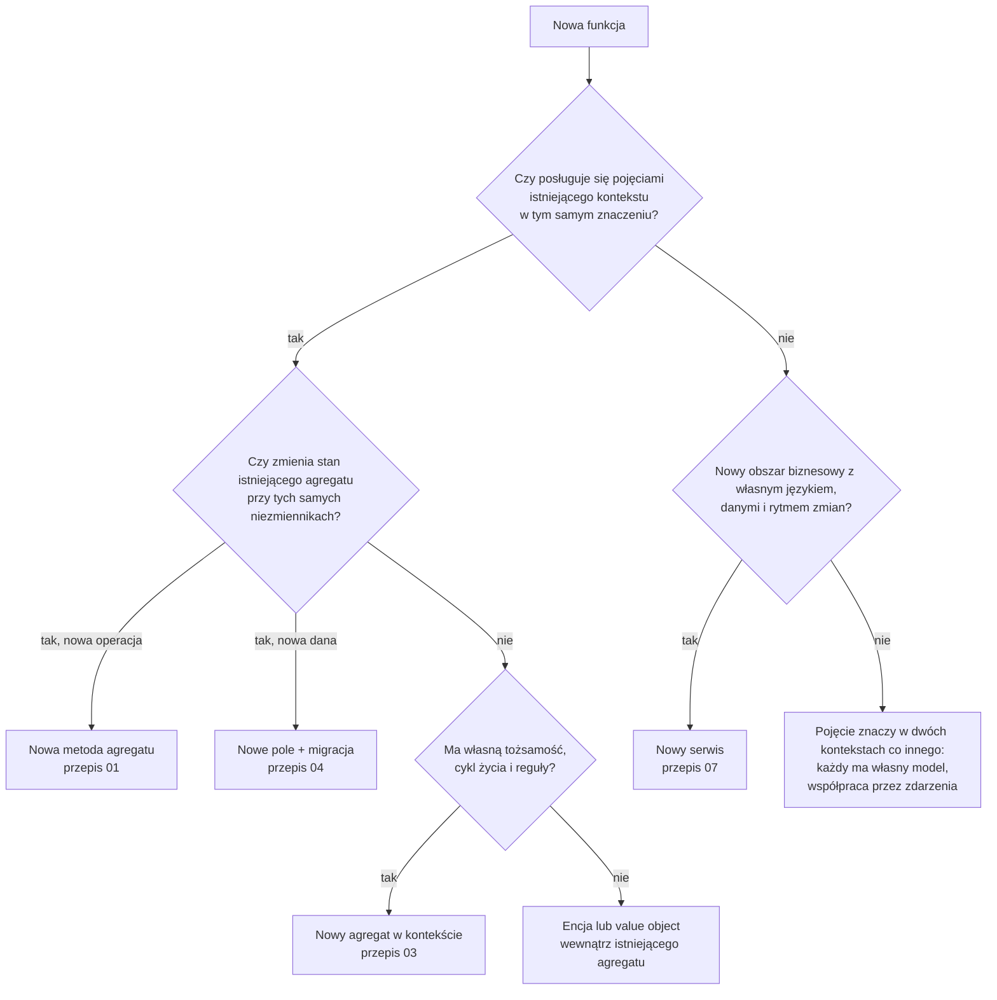
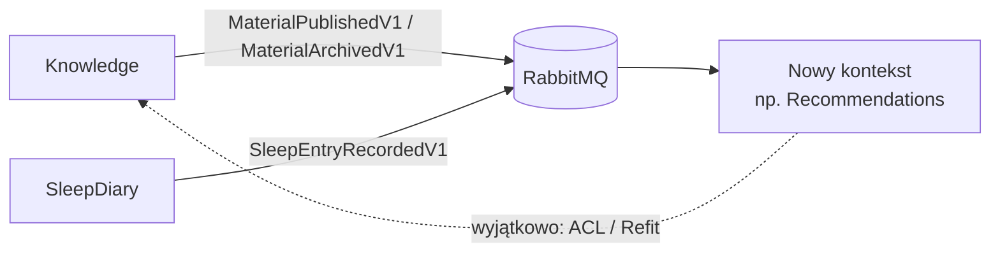

# 4. Gdzie umieścić nową funkcję: wybór kontekstu

Kryteria podziału na bounded contexty: klasyfikacja nowej funkcji (operacja, pole, agregat czy osobny mikroserwis), współpraca między kontekstami i granice modeli.
**Wymagania:** [03 Zasady](03-zasady.md).

> **W skrócie**
> - Kontekst wyznacza **język i reguły**, nie tabele ani ekrany.
> - Agregat wyznaczają **niezmienniki, które muszą być spełnione natychmiast** (w jednej transakcji).
> - Dane innego kontekstu: subskrybuj jego zdarzenia i trzymaj lokalną kopię; synchroniczne wywołanie (ACL) to wyjątek.
> - Nowy serwis tylko dla nowego obszaru z własnym językiem, danymi i rytmem zmian.
> - Experience to jednostka własności zespołu (moduł + BFF + 1..n serwisów), a nie granica modelu: wewnątrz jednej experience
>   może być kilka bounded contextów.

Decyzja o granicach jest najdroższą decyzją przy nowej funkcji: utrwala schematy baz, kontrakty zdarzeń i kod w kilku
projektach. Kilka minut z tym rozdziałem oszczędza tygodnie przenoszenia kodu.

## 4.1 Obecne konteksty

| Kontekst | Język (ubiquitous language) | Agregaty | Publikuje | Konsumuje |
|---|---|---|---|---|
| **Knowledge** (ADR-0028) | materiał (artykuł, wideo, podcast), treść blokowa, kolekcja, kategoria, publikacja, archiwizacja, ulubione, przeczytane | `Material`, `Collection`, `Category`, `Favorite`, `MaterialCompletion` | `MaterialPublishedV1`, `MaterialArchivedV1`, `CollectionArchivedV1` | własne `MaterialArchivedV1`, `CollectionArchivedV1` (usuwanie ulubionych) |
| **SleepDiary** (ADR-0029) | wpis dziennika snu, pora snu i pobudki, latencja, wybudzenia, jakość, notatki | `SleepEntry` | `SleepEntryRecordedV1` | — |

Użytkownik w obu kontekstach to tylko identyfikator `sub` z tokenu (`UserId`); żaden kontekst nie ma „profilu użytkownika”.

## 4.2 Experience a bounded context

**Experience** (ADR-0038) to jedna funkcjonalność super appki: moduł klienta, **BFF experience** i 1..n serwisów domenowych.
**Bounded context** (ADR-0002) to granica modelu i języka; jeden serwis domenowy = jeden bounded context. Pojęcia są ortogonalne:

| Pytanie | Experience | Bounded context |
|---|---|---|
| Co wyznacza granicę? | funkcjonalność widoczna dla użytkownika i własność zespołu | język, reguły i niezmienniki domeny |
| Ile ich w repozytorium? | dziś jedna, ale nic nie może zakładać, że tylko jedna | wiele (Knowledge, SleepDiary) |
| Co jest wspólne? | moduł i BFF orkiestrujący dla modułu | nic poza `SuperApp.Framework` |
| Jak wołają je inni? | BFF-y innych experience przez API wewnętrzne naszego BFF | tylko BFF i serwisy tej samej experience; między kontekstami zdarzenia |

Konsekwencje dla decyzji:

- **Ekran modułu składający dane z kilku kontekstów** to zadanie BFF experience (orkiestracja), a nie powód do nowego kontekstu ani
  do łączenia modeli. BFF nie zawiera logiki biznesowej i nie zmienia stanu kilku domen w jednym żądaniu.
- **Funkcja potrzebna innej experience** (np. widget na dashboardzie) to operacja API wewnętrznego naszego BFF projektowana pod
  konsumenta (ADR-0039), a nie dostęp do naszego serwisu domenowego.
- **Dane innej experience** czytasz przez jej API wewnętrzne (z BFF) albo ze zdarzeń integracyjnych, nigdy wołając jej serwisy domenowe.

Wzorzec w kodzie: `src/Bff/Example.Bff` składa ekran startowy modułu `GET /v1/me/summary` z Knowledge i SleepDiary, a widget dla
innej experience wystawia jako `GET /internal/v1/widgets/sleep-summary`; zob.
[02 Architektura w praktyce](02-architektura-w-praktyce.md#experience-w-repozytorium). Nowy serwis domenowy nie dostaje trasy w bramie,
tylko klienta w BFF swojej experience ([przepis 07](przepisy/07-nowy-serwis.md)).

## 4.3 Drzewo decyzyjne

## 4.4 Pytania kontrolne

1. **Język.** Czy eksperci domeny używają tych samych słów w tym samym znaczeniu? „Materiał” w Knowledge to treść
   edukacyjna z treścią blokową i publikacją. Jeśli funkcja mówi o „materiale” w innym sensie (np. materiał do wysłania
   mailem), to inny model, nawet jeśli nazwa się zgadza.
2. **Niezmienniki.** Jakie reguły muszą być spełnione **natychmiast**, w tej samej transakcji? To wyznacza agregat.
   „Opublikowany materiał ma treść” to niezmiennik `Material`. „Liczba ulubionych materiału” nie musi być natychmiastowa:
   to odczyt.
3. **Cykl życia.** Czy nowa rzecz istnieje niezależnie (tworzona, zmieniana, usuwana w innym momencie niż istniejący agregat)?
   Jeśli tak, to osobny agregat odwołujący się do innych przez ID.
4. **Dane innego kontekstu.** Czy potrzebujesz ich do decyzji (zapis) czy do wyświetlenia (odczyt)? Do odczytu wystarczy
   lokalna kopia z zdarzeń. Do decyzji: najpierw sprawdź, czy reguła nie należy do tamtego kontekstu.
5. **Właściciel i rytm zmian.** Kto decyduje o regułach? Jeśli inny zespół lub inna część biznesu, w innym rytmie, to sygnał
   osobnego kontekstu.
6. **Skala.** Czy ta funkcja będzie miała dziesiątki przypadków użycia i własne dane? Nowy serwis ma koszt (pipeline,
   deployment, CIAM, schemat), więc mała funkcja zwykle trafia do istniejącego kontekstu, jeśli język pasuje.

## 4.5 Przykład krok po kroku: „ocena materiału”

**Wymaganie:** czytelnik może ocenić opublikowany materiał w skali 1–5 i zmienić ocenę; materiał pokazuje średnią i liczbę ocen.

| Pytanie | Odpowiedź | Wniosek |
|---|---|---|
| Język | „materiał”, „opublikowany”, „czytelnik” z Knowledge | kontekst **Knowledge** |
| Czy to stan `Material`? | ocena należy do użytkownika, nie do materiału; redaktor nie zarządza ocenami | **nie** nowe pole `Material` |
| Niezmienniki | „jedna ocena na użytkownika i materiał”, „ocena 1–5” | własny agregat z unikalnością (użytkownik, materiał) |
| Cykl życia | tworzona i zmieniana przez czytelnika, niezależnie od edycji materiału | **nowy agregat `MaterialRating`** |
| Odczyt średniej | nie musi być natychmiastowy ani spójny transakcyjnie z oceną | zapytanie liczy z read modelu (opcjonalnie cache) |
| Archiwizacja materiału | oceny zarchiwizowanego materiału nie są potrzebne w widokach | odczyt filtruje po statusie; ewentualnie konsument `MaterialArchivedV1` |

Implementacja: [16 Samouczek: pełna funkcja](16-samouczek-pelna-funkcja.md) i [przepis 03](przepisy/03-nowy-zbior-danych.md).

**Dlaczego nie pole w `Material`?** Każda ocena zmieniałaby agregat `Material` (konflikty współbieżności między czytelnikami
a redaktorem edytującym treść), a reguła „jedna ocena na użytkownika” wymagałaby kolekcji ocen wewnątrz materiału, czyli
ładowania tysięcy ocen przy każdej edycji.

## 4.6 Więcej przykładów decyzji

| Funkcja | Decyzja | Uzasadnienie |
|---|---|---|
| Opis kategorii | nowe pole `Category` (przepis 04) | ten sam agregat, te same reguły, ta sama transakcja |
| Kolejność materiałów w kolekcji | już jest: `Collection.SetItems` | pozycja to część stanu kolekcji (niezmiennik: brak duplikatów, limit) |
| Notatki czytelnika do materiału | nowy agregat w Knowledge (`MaterialNote`) | własny cykl życia, właściciel = czytelnik, wiele notatek |
| Tagi wolnego tekstu do materiałów | nowe pole/kolekcja w `Material` | tagi nadaje redaktor razem z edycją materiału; reguły treści materiału |
| Przypomnienie o pójściu spać | SleepDiary, jeśli wynika tylko z dziennika; nowy kontekst „Notifications”, jeśli powiadomienia obejmą wiele obszarów | powiadomienia mają własny język (kanał, harmonogram, zgoda) i obsługują zdarzenia z wielu kontekstów |
| Rekomendacje materiałów na podstawie snu | nowy kontekst „Recommendations” | potrzebuje danych z dwóch kontekstów; subskrybuje `SleepEntryRecordedV1` i `MaterialPublishedV1`, ma własny model |
| Statystyki snu za miesiąc | zapytanie w SleepDiary | odczyt istniejących danych; bez nowego agregatu |
| Widget naszej funkcji na dashboardzie innej experience | operacja w API wewnętrznym naszego BFF (`/internal/v1/...`) | inne experience nie wołają naszych serwisów domenowych (ADR-0039, ADR-0041) |
| Usunięcie konta użytkownika (RODO) | każdy kontekst usuwa własne dane po zdarzeniu z systemu tożsamości | żaden kontekst nie zarządza danymi innego |

## 4.7 Jak konteksty współpracują

- **Zdarzenia integracyjne** to opublikowany język kontekstu (`{Serwis}.Contracts`): tylko prymitywy, wersjonowane.
  Konsument tłumaczy je na własne pojęcia (komenda w swoim kontekście). [10 Zdarzenia i integracja](10-zdarzenia-i-integracja.md).
- **Lokalna kopia danych** innego kontekstu jest normalna: konsument trzyma tylko pola, których potrzebuje, i aktualizuje je
  ze zdarzeń. Spójność jest ostateczna (zwykle sekundy).
- **ACL (anti-corruption layer)** dla wywołań synchronicznych: port w Application konsumenta, implementacja w Infrastructure
  z klientem Refit; obce DTO nie wychodzą poza implementację. W kontekście użytkownika wywołanie przekazuje jego token bez zmian
  (ADR-0040). Serwis innej experience nie jest celem: tylko API wewnętrzne jej BFF. [przepis 08](przepisy/08-wywolanie-innego-serwisu.md).

## 4.8 Antywzorce

| Antywzorzec | Dlaczego szkodzi | Zamiast tego |
|---|---|---|
| Serwis „Common”/„Shared” z modelami biznesowymi | wszystkie serwisy zależą od jednego modelu; każda zmiana łamie wszystkich | wspólny tylko kod techniczny (`SuperApp.Framework`) |
| Zapytanie SQL do cudzego schematu | ukryta zależność; login i tak nie ma uprawnień | zdarzenia i lokalna kopia |
| Agregat-worek (`User` z danymi ze wszystkich obszarów) | ogromne transakcje, konflikty, brak właściciela reguł | każdy kontekst ma własny model użytkownika (`UserId`) |
| Łańcuch synchronicznych wywołań do realizacji jednej operacji | dostępność = iloczyn dostępności, opóźnienia się sumują | zdarzenia, saga dla procesów wieloetapowych |
| Nowy serwis dla jednej tabeli | koszt wdrożenia i utrzymania bez korzyści | nowy agregat w istniejącym kontekście, jeśli język pasuje |
| Granice według ekranów („serwis dla ekranu ustawień”) | ekran łączy dane wielu kontekstów | ekran składa dane BFF experience (orkiestracja), konteksty zostają rozdzielone |
| Logika biznesowa w BFF | BFF staje się drugim, niekontrolowanym modelem domeny | reguły w agregacie serwisu; BFF tylko orkiestruje i kształtuje dane |
| Wołanie serwisu domenowego innej experience | omija jej BFF i kontrakt; NetworkPolicy i tak zablokuje ruch | API wewnętrzne BFF tamtej experience albo zdarzenia |

## Typowe błędy

| Objaw | Przyczyna | Naprawa |
|---|---|---|
| Komenda musi zmienić dwa agregaty | granica agregatu źle wyznaczona albo reakcja powinna być asynchroniczna | zdarzenie domenowe → integracyjne → komenda w drugim agregacie; albo przemyśl agregat |
| Handler potrzebuje danych innego serwisu do decyzji | reguła może należeć do tamtego kontekstu | przenieś regułę albo trzymaj lokalną kopię z zdarzeń |
| Agregat ładuje tysiące elementów | kolekcja powinna być osobnym agregatem | wyodrębnij agregat odwołujący się przez ID (jak `Favorite`, `MaterialCompletion`) |

## Do zapamiętania

- Kontekst = język i reguły; agregat = niezmienniki natychmiastowe; serwis = osobny obszar biznesowy; experience = jednostka własności (moduł + BFF + serwisy).
- Dane innych kontekstów przez zdarzenia i lokalne kopie; ACL tylko wyjątkowo.
- Decyzję o nowym kontekście zapisuje się w ADR (wzór: ADR-0028, ADR-0029).
