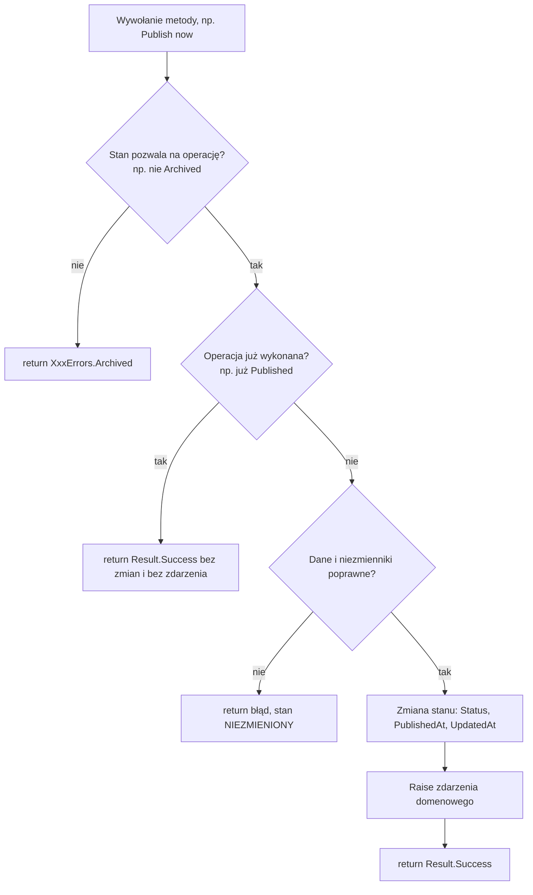
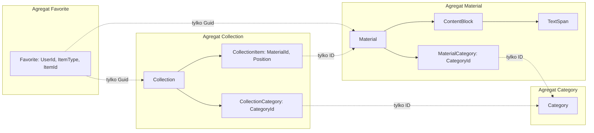
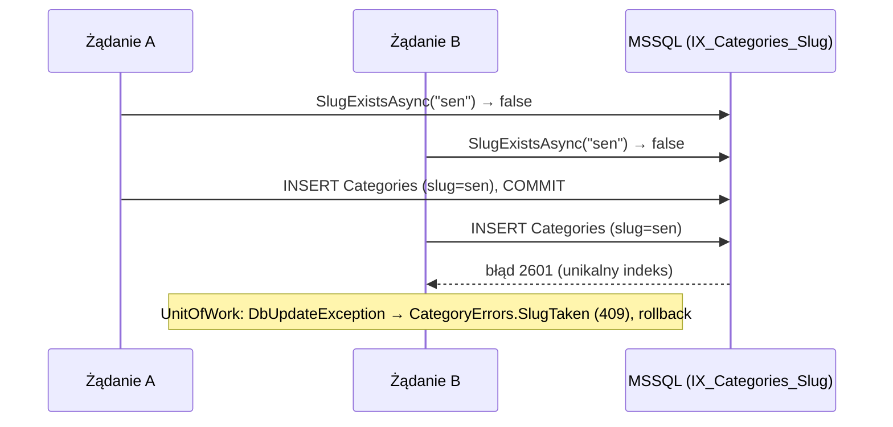
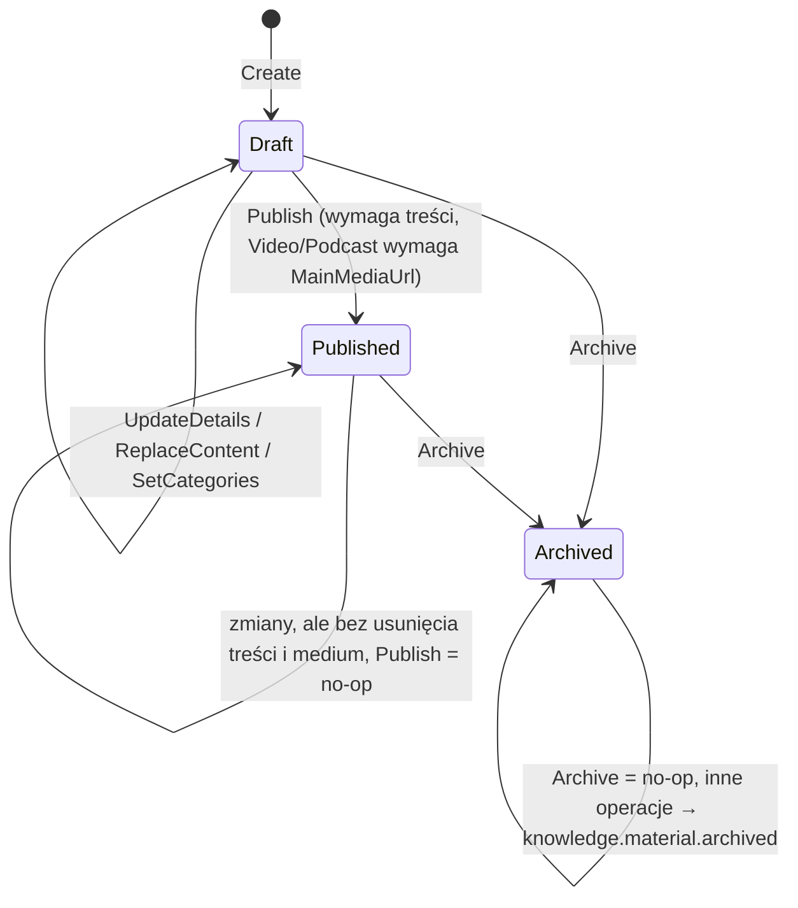
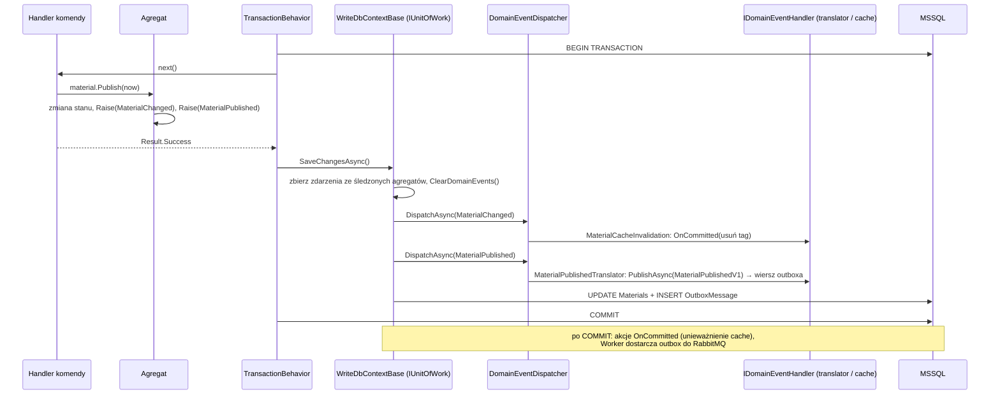

# 5. Model domeny: agregaty, identyfikatory, value objects, błędy i zdarzenia

**Czego się nauczysz:** jak w tym repozytorium projektuje się i pisze model domeny: agregaty (`AggregateRoot`, fabryki,
niezmienniki, prywatne settery, kolekcje, operacje idempotentne, czas przekazywany z zewnątrz), jak wyznaczać granice agregatów,
jak pisać silnie typowane ID i value objects, jak definiować błędy i posługiwać się `Result`, kiedy i jak zgłaszać zdarzenia
domenowe oraz czym są repozytoria. Zobaczysz od środka cztery prawdziwe agregaty: `Category`, `SleepEntry`, `Material`
(z treścią blokową) i `Collection`.
**Wymagania:** [03 Zasady](03-zasady.md), [04 Wybór kontekstu](04-wybor-kontekstu.md); pomocniczo
[02 Architektura w praktyce](02-architektura-w-praktyce.md). Po tym rozdziale czytaj [06 Warstwa aplikacji](06-warstwa-aplikacji.md).

> **W skrócie**
> - Agregat to granica spójności: wszystkie zmiany idą przez metody korzenia o nazwach z języka domeny, które sprawdzają
>   reguły i zwracają `Result`. Handler tylko je wywołuje.
> - Jedna komenda zmienia jeden agregat. Inne agregaty wskazuje się wyłącznie po ID; reakcje innych agregatów idą przez zdarzenia.
> - ID i jednowartościowe value objects to ręcznie pisane `readonly record struct` z `Create` (walidacja, `Result<T>`),
>   `FromTrusted` (tylko infrastruktura) i bez `default`/`new()` (APP002). Mapowanie EF, JSON i OpenAPI jest automatyczne.
> - Naruszenie reguły to `Error` ze stałym kodem (`knowledge.material.archived`) i typem decydującym o statusie HTTP; wyjątki
>   tylko dla błędów technicznych. `Result<T>` czytaj przez `TryGetValue`.
> - Zdarzenie domenowe (`Raise`) zgłasza się po udanej zmianie stanu; obsługują je handlery w tej samej transakcji, przy zapisie.
> - Domena nie zna czasu systemowego, bazy ani frameworków: czas dostaje parametrem `now`, unikalność sprawdza handler przez
>   repozytorium, a zapis robi Unit of Work.

Kod w blokach jest skopiowany z repozytorium. Dla czytelności pomijam w nich komentarze dokumentacji XML (`///`), zostawiając
tylko `/// <inheritdoc />`; pełną dokumentację każdego typu zobaczysz w IDE po najechaniu kursorem albo w pliku źródłowym.
Bloki oznaczone jako „Źle” albo „ilustracja wzorca” nie pochodzą z repozytorium.

---

## 5.1 Gdzie leży model domeny i od czego zależy

Każdy serwis ma projekt `{Serwis}.Domain`. Jedyną dozwoloną referencją jest `SuperApp.Framework.Domain` (klasy bazowe, `Result`,
interfejsy ID i value objects). Pilnują tego testy `DomainDependencyTests` w `{Serwis}.Domain.Tests` oraz testy architektury
(`tests/SuperApp.ArchitectureTests`, ADR-0025). W domenie nie ma EF Core, MediatR, MassTransit, ASP.NET ani `System.Net.Http`.

Katalogi odpowiadają agregatom (ADR-0032), przestrzeń nazw = ścieżka katalogu (IDE0130 jako błąd kompilacji):

```
src/Services/Knowledge/Knowledge.Domain/
  Categories/            Category, CategoryId, CategoryErrors, ICategoryRepository, Events/CategoryChanged
  Materials/             Material, MaterialId, MaterialType, MaterialCategory, MaterialErrors, IMaterialRepository,
    Content/             ContentBuilder, BlockSpec, SpanSpec, ContentBlock, TextSpan, BlockType, BlockId, ...
    Events/              MaterialChanged, MaterialPublished, MaterialArchived
  Collections/           Collection, CollectionId, CollectionItem, CollectionCategory, CollectionErrors, ...
  Library/               LibraryErrors
    Favorites/           Favorite, FavoriteId, FavoriteItemType, IFavoriteRepository
    Completions/         MaterialCompletion, MaterialCompletionId, IMaterialCompletionRepository
  Common/                pojęcia wspólne dla agregatów kontekstu: PublicationStatus, UserId, WebUrl, Text (internal)
  KnowledgeDomain.cs     znacznik assembly (konwencje EF szukają tu ID i value objects)

src/Services/SleepDiary/SleepDiary.Domain/
  Entries/               SleepEntry, SleepEntryId, SleepDetails, SleepQuality, UserId, SleepEntryErrors,
                         ISleepEntryRepository, Events/SleepEntryRecorded
  SleepDiaryDomain.cs
```

Zwróć uwagę, że `UserId` istnieje **w obu** serwisach jako osobne typy. To nie duplikacja do usunięcia: każdy kontekst ma
własny model (ADR-0002, „zakaz współdzielenia modelu domeny”), a `SuperApp.Framework` nie może zawierać pojęć biznesowych.

## 5.2 Klocki z `SuperApp.Framework.Domain`

| Typ | Przestrzeń nazw | Do czego służy |
|---|---|---|
| `AggregateRoot<TId>` | `SuperApp.Framework.Domain.Aggregates` | klasa bazowa korzenia agregatu: ID + lista zdarzeń domenowych (`Raise`, `DomainEvents`, `ClearDomainEvents`) |
| `Entity<TId>` | `SuperApp.Framework.Domain.Aggregates` | klasa bazowa encji (tożsamość przez ID); używana pośrednio przez `AggregateRoot` |
| `IAggregateRoot` | `SuperApp.Framework.Domain.Aggregates` | nie-generyczny widok zdarzeń; używa go tylko `WriteDbContextBase` |
| `IDomainEvent` | `SuperApp.Framework.Domain.Events` | znacznik zdarzenia domenowego |
| `Result`, `Result<T>` | `SuperApp.Framework.Domain.Results` | wynik operacji: sukces albo `Error` |
| `Error`, `ErrorType` | `SuperApp.Framework.Domain.Results` | opis niepowodzenia: `Code`, `Message`, `Type`, `Details` |
| `IResultFactory<TSelf>` | `SuperApp.Framework.Domain.Results` | pozwala behaviorom tworzyć nieudany wynik bez refleksji; nie implementujesz go sam |
| `ISingleValueObject<TSelf, TValue>` | `SuperApp.Framework.Domain.ValueObjects` | kontrakt value objectu z jedną wartością (`Create`, `FromTrusted`, `Value`) |
| `IStronglyTypedId<TSelf, TValue>` | `SuperApp.Framework.Domain.ValueObjects` | jak wyżej plus `New()`; dla identyfikatorów |

Klasa bazowa agregatu jest krótka; całe „zachowanie” to zbieranie zdarzeń
(`src/Framework/SuperApp.Framework.Domain/Aggregates/AggregateRoot{TId}.cs`):

```csharp
public abstract class AggregateRoot<TId>(TId id) : Entity<TId>(id), IAggregateRoot
    where TId : struct, IEquatable<TId>
{
    private readonly List<IDomainEvent> _domainEvents = [];

    /// <inheritdoc />
    public IReadOnlyList<IDomainEvent> DomainEvents => _domainEvents;

    /// <inheritdoc />
    public void ClearDomainEvents() => _domainEvents.Clear();

    protected void Raise(IDomainEvent domainEvent) => _domainEvents.Add(domainEvent);
}
```

`Entity<TId>` (`Aggregates/Entity.cs`) trzyma `Id` z prywatnym setterem (tylko dla materializacji EF) i celowo **nie**
nadpisuje `Equals`: EF śledzi encje po referencji, a gdy potrzebujesz porównać encje, porównuj jawnie ich `Id`.

```csharp
public abstract class Entity<TId>
    where TId : struct, IEquatable<TId>
{
    protected Entity(TId id) => Id = id;

    public TId Id { get; private set; }
}
```

## 5.3 Anatomia agregatu

Każdy agregat w repozytorium ma te same elementy. Traktuj tę listę jak szablon:

| Element | Jak | Dlaczego |
|---|---|---|
| Deklaracja | `public sealed class Material : AggregateRoot<MaterialId>` | `sealed` domyślnie; dziedziczenie agregatów nie jest potrzebne |
| Konstruktor | `private Material(MaterialId id) : base(id) { }` | nikt spoza klasy nie utworzy agregatu z pominięciem reguł; EF używa go przy materializacji |
| Właściwości | `public string Title { get; private set; } = string.Empty;` | stan zmieniają tylko metody agregatu |
| Limity | `public const int MaxTitleLength = 200;` | jedno źródło liczby: walidator, testy i dokumentacja używają stałej |
| Kolekcje | `private readonly List<MaterialCategory> _categories = [];` + `public IReadOnlyList<MaterialCategory> Categories => _categories;` | z zewnątrz nie da się dodać elementu z pominięciem reguł |
| Tworzenie | `public static Result<Material> Create(..., DateTimeOffset now)` | fabryka waliduje i zwraca błąd zamiast wyjątku; ID z `MaterialId.New()` |
| Operacje | `public Result Publish(DateTimeOffset now)` itd., nazwy z języka domeny | handler wywołuje jedną operację; reguły są w jednym miejscu |
| Czas | parametr `now` przekazany przez handler z `IClock` | domena deterministyczna, testy bez zegara systemowego |
| Zdarzenia | `Raise(new MaterialPublished(...))` po zmianie stanu | reakcje (outbox, cache) bez sprzęgania agregatu z ich kodem |
| Zależności | żadnych: bez EF, bez repozytoriów, bez `IClock` | agregat testujesz jednym `new`/`Create`, bez mocków |

Typowa metoda agregatu przechodzi przez te same kroki:



Najważniejsza własność: **sprawdzenia przed zmianami**. Metoda, która zwraca błąd, nie może zostawić agregatu częściowo
zmienionego, bo `TransactionBehavior` przy błędzie co prawda niczego nie zapisze, ale ten sam obiekt może zostać użyty dalej
w tym samym zakresie (np. w teście albo w handlerze, który wywołuje kilka metod tego samego agregatu).

### Operacje idempotentne

W repozytorium wiele operacji jest idempotentnych: powtórzone wywołanie kończy się sukcesem bez zmiany i bez zdarzenia.

| Operacja | Zachowanie przy powtórzeniu | Gdzie |
|---|---|---|
| `Category.Rename` z tą samą nazwą | sukces, bez `CategoryChanged` | agregat |
| `Material.Publish` / `Collection.Publish` opublikowanego | sukces, bez `MaterialPublished`, `PublishedAt` bez zmian | agregat |
| `Material.Archive` / `Collection.Archive` zarchiwizowanego | sukces, bez zdarzenia | agregat |
| `AddFavorite` dla istniejącego ulubionego | sukces, `AddedAt` bez zmian | handler (`FindAsync`) |
| `MarkMaterialCompleted` dla już oznaczonego | sukces | handler (`FindAsync`) |

Dlaczego to ważne: klient (przeglądarka, aplikacja mobilna, konsument wiadomości z redelivery) może powtórzyć żądanie po
timeoucie. Operacja idempotentna nie generuje drugiego zdarzenia integracyjnego ani niepotrzebnego unieważnienia cache.
Jeśli powtórzenie musi być błędem (np. drugi wpis dziennika na ten sam dzień), opisz to w dokumentacji metody i zwróć
`Conflict`.

### Czas przekazywany z zewnątrz

Agregat nigdy nie czyta `DateTimeOffset.UtcNow`. Każda metoda, która zapisuje czas, przyjmuje `now`:

```csharp
// Źle: domena czyta zegar systemowy; test nie ustali czasu, a zdarzenie i stan mogą dostać różne chwile
public Result Publish()
{
    Status = PublicationStatus.Published;
    PublishedAt = DateTimeOffset.UtcNow;
    Raise(new MaterialPublished(Id, Type, Title, DateTimeOffset.UtcNow));
    return Result.Success();
}

// Dobrze (Material.Publish): jedna wartość now trafia do stanu i do zdarzenia
Status = PublicationStatus.Published;
PublishedAt = now;
Touch(now);
Raise(new MaterialPublished(Id, Type, Title, now));
```

Handler bierze czas z `IClock` (`material.Publish(clock.UtcNow)`, rozdział [06](06-warstwa-aplikacji.md#69-iclock-czas-w-przypadkach-użycia)).
Tę samą zasadę stosuje `SleepEntry.Record`, który dostaje również `latestAllowedDate`: reguła „brak wpisów z przyszłości”
potrzebuje „dzisiaj”, a agregat nie wie, który jest dzień.

## 5.4 Jak wyznaczyć granice agregatu

**Reguła:** jedna transakcja (jedna komenda) modyfikuje jeden agregat (ADR-0027). Granica agregatu to zbiór
danych, którego niezmienniki muszą być spełnione **natychmiast**, w jednej transakcji. Wszystko, co może być spójne „za chwilę”,
łączy się zdarzeniami.

Pytania pomocnicze przy projektowaniu:

1. Które reguły muszą być prawdziwe po każdym zatwierdzeniu? („Opublikowany materiał ma treść” – tak; „ulubiony materiał
   jest opublikowany” – wystarczy w chwili dodania, później Worker posprząta.)
2. Kto zmienia dane i jak często równolegle? Dane zmieniane przez wielu użytkowników naraz nie powinny siedzieć w jednym
   agregacie z danymi redaktora, bo każda zmiana blokowałaby pozostałe (konflikty wersji wiersza, długie transakcje).
3. Jaki jest cykl życia? Coś, co powstaje i znika niezależnie, ma własną tożsamość i jest osobnym agregatem.
4. Ile tego może być? Agregat ładuje się w całości; kolekcja bez ograniczenia (wszystkie ulubione wszystkich użytkowników)
   nie może być jego częścią.

### Przykład z Knowledge: Material, Collection, Favorite



| Decyzja | Uzasadnienie |
|---|---|
| Bloki treści są **częścią** `Material` | reguły treści (500 bloków, „opublikowany ma treść”) muszą być spełnione razem ze stanem materiału; treść zapisuje się w całości (`ReplaceContent`) |
| `Collection` trzyma **listę `MaterialId`**, nie materiały | kolekcja porządkuje materiały, ale nie zmienia ich; gdyby trzymała `Material`, każda edycja kolekcji ładowałaby i blokowała wszystkie materiały |
| `Favorite` jest **osobnym agregatem**, nie listą w `Material` | ulubione dodają tysiące użytkowników równolegle (scope `knowledge.library.write`), materiał edytuje redaktor; ich cykle życia i niezmienniki są niezależne |
| `Category` jest **osobnym agregatem**; materiały i kolekcje mają tylko `CategoryId` | kategoria ma własną regułę (unikalny slug) i własny cykl życia; zmiana nazwy kategorii nie zmienia materiałów |
| `MaterialCompletion` osobno od `Favorite` | inne reguły: oznaczenie nie znika po archiwizacji materiału, ulubione znikają |

Konsekwencja: reguły **między** agregatami nie są niezmiennikami, tylko sprawdzeniami w chwili wykonania, wykonywanymi przez
handler przez repozytorium:

- `SetCollectionItemsHandler` sprawdza `IMaterialRepository.AllExistAsync` przed `collection.SetItems(...)` (błąd
  `knowledge.collection.unknown_materials`);
- `AddFavoriteHandler` sprawdza `IsPublishedAsync` materiału albo kolekcji (`knowledge.library.item_not_available`);
- archiwizacja materiału **nie** usuwa ulubionych w tej samej transakcji: `Material.Archive` zgłasza `MaterialArchived`,
  translator publikuje `MaterialArchivedV1` przez outbox, Worker wysyła komendę `RemoveFavoritesOfItem`.

Ten ostatni przypadek ma świadomy wyjątek opisany w ADR-0028: `IFavoriteRepository.RemoveAllForItemAsync` usuwa wiele
agregatów `Favorite` jednym poleceniem SQL, bo nie narusza to niezmienników żadnego z nich. Wyjątek dotyczy usuwania wielu
egzemplarzy **tego samego** typu agregatu, nie modyfikacji dwóch różnych agregatów.

```csharp
// Źle: jedna komenda zmienia dwa agregaty; dłuższa transakcja, blokady na Favorites przy każdej archiwizacji,
// a handler zawiera regułę „po archiwizacji usuń ulubione”, której nie widać w domenie
var material = await materials.GetAsync(materialId, cancellationToken);
material.Archive(clock.UtcNow);
await favorites.RemoveAllForItemAsync(FavoriteItemType.Material, command.MaterialId, cancellationToken);

// Dobrze (ArchiveMaterialHandler + MaterialArchived → MaterialArchivedV1 → MaterialArchivedConsumer → RemoveFavoritesOfItem)
var material = await materials.GetAsync(materialId, cancellationToken);
return material is null ? MaterialErrors.NotFound : material.Archive(clock.UtcNow);
```

```csharp
// Źle: kolekcja zawiera agregaty Material; zapis kolekcji śledzi i może zapisać zmiany materiałów
private readonly List<Material> _materials = [];

// Dobrze (Collection): tylko identyfikatory i pozycje
private readonly List<CollectionItem> _items = [];
public sealed record CollectionItem(MaterialId MaterialId, int Position);
```

Rozdział [04 Wybór kontekstu](04-wybor-kontekstu.md) pokazuje tę samą decyzję na poziomie wyżej: nowy agregat czy nowa
operacja istniejącego.

## 5.5 Przegląd agregatu: `Category` (prosty)

`src/Services/Knowledge/Knowledge.Domain/Categories/Category.cs`:

```csharp
public sealed partial class Category : AggregateRoot<CategoryId>
{
    public const int MaxNameLength = 100;

    public const int MaxSlugLength = 100;

    private Category(CategoryId id)
        : base(id)
    {
    }

    public string Name { get; private set; } = string.Empty;

    public string Slug { get; private set; } = string.Empty;

    public static Result<Category> Create(string name, string slug)
    {
        var validName = Text.Required(name, MaxNameLength, "knowledge.category.invalid_name", "name");
        if (validName.IsFailure)
        {
            return validName.Error;
        }

        if (!IsValidSlug(slug))
        {
            return CategoryErrors.InvalidSlug;
        }

        var category = new Category(CategoryId.New()) { Name = validName.Value, Slug = slug };
        category.Raise(new CategoryChanged(category.Id));
        return category;
    }

    public Result Rename(string name)
    {
        var validName = Text.Required(name, MaxNameLength, "knowledge.category.invalid_name", "name");
        if (validName.IsFailure)
        {
            return validName.Error;
        }

        if (string.Equals(Name, validName.Value, StringComparison.Ordinal))
        {
            return Result.Success();
        }

        Name = validName.Value;
        Raise(new CategoryChanged(Id));
        return Result.Success();
    }

    private static bool IsValidSlug(string? slug) => slug is { Length: > 0 and <= MaxSlugLength } && SlugPattern().IsMatch(slug);

    [GeneratedRegex("^[a-z0-9]+(-[a-z0-9]+)*$")]
    private static partial Regex SlugPattern();
}
```

Co warto zauważyć:

- **`partial`** jest tu tylko dla `[GeneratedRegex]` (generator źródeł wymaga klasy częściowej); wyrażenie jest kompilowane
  przy buildzie, bez kosztu w czasie działania.
- **`Text.Required`** (`Common/Text.cs`, `internal`) przycina białe znaki, mierzy długość **po** przycięciu i zwraca przyciętą
  wartość. Kod błędu podaje wywołujący, więc błąd jest specyficzny dla pola: `knowledge.category.invalid_name`.
  Te same zasady muszą obowiązywać w walidatorze komendy (`MaximumTrimmedLength`, rozdział
  [06](06-warstwa-aplikacji.md#66-walidatory)).
- **Slug nie jest przycinany ani zamieniany na małe litery.** `"Sleep"` albo `" sleep"` jest odrzucany, nie normalizowany:
  slug trafia do URL-i, więc lepiej, żeby klient wiedział, jaką wartość zapisano.
- **`Rename` jest idempotentne** (porównanie `Ordinal`, więc zmiana wielkości liter to prawdziwa zmiana). Brak zdarzenia przy
  braku zmiany oznacza brak niepotrzebnego unieważnienia cache listy kategorii.
- **Unikalność sluga nie jest sprawdzana w agregacie**, bo agregat nie widzi innych kategorii. Robi to handler
  (`ICategoryRepository.SlugExistsAsync` → `CategoryErrors.SlugTaken`), a ostatnią linią obrony jest unikalny indeks
  `IX_Categories_Slug`. Gdy dwa żądania równolegle przejdą sprawdzenie, drugi `INSERT` narusza indeks, a
  `IUnitOfWork.SaveChangesAsync` zamienia to na **ten sam** błąd `SlugTaken` (mapa `UniqueConstraintErrors` w
  `KnowledgeWriteDbContext`, szczegóły w [07 Dane i EF Core](07-dane-i-ef-core.md)).



Błędy kategorii (`Categories/CategoryErrors.cs`):

```csharp
public static class CategoryErrors
{
    public static readonly Error InvalidSlug =
        Error.Validation("knowledge.category.invalid_slug", "Slug może zawierać wyłącznie małe litery, cyfry i myślniki.");

    public static readonly Error SlugTaken = Error.Conflict("knowledge.category.slug_taken", "Kategoria o tym slugu już istnieje.");

    public static readonly Error NotFound = Error.NotFound("knowledge.category.not_found", "Kategoria nie istnieje.");

    public static readonly Error UnknownCategories = Error.Validation("knowledge.category.unknown", "Co najmniej jedna kategoria nie istnieje.");
}
```

`knowledge.category.invalid_name` nie ma pola w `CategoryErrors`, bo powstaje w `Text.Required` z parametrem (nazwa pola
w komunikacie). Dokumentacja klasy `CategoryErrors` wymienia takie kody w `<remarks>`, żeby katalog był kompletny.

Test domeny tej reguły (`Knowledge.Domain.Tests/CategoryTests.cs`) nie potrzebuje żadnego mocka:

```csharp
[Fact]
public void Renaming_to_the_current_name_changes_nothing_and_raises_no_event()
{
    var category = ResultAssert.Success(Category.Create("Sen", "sen"));
    category.ClearDomainEvents();

    Assert.True(category.Rename("Sen").IsSuccess);
    Assert.True(category.Rename("  Sen  ").IsSuccess);

    Assert.Equal("Sen", category.Name);
    Assert.Empty(category.DomainEvents);
}
```

## 5.6 Przegląd agregatu: `SleepEntry` (dużo walidacji)

`src/Services/SleepDiary/SleepDiary.Domain/Entries/SleepEntry.cs` to dobry przykład agregatu, którego główną pracą jest
pilnowanie reguł danych wejściowych i wyliczanie wartości pochodnych.

```csharp
public sealed class SleepEntry : AggregateRoot<SleepEntryId>
{
    public const int MaxAwakenings = 50;

    public const int MaxNotesLength = 2000;

    public const int MaxTimeInBedMinutes = 24 * 60;

    private SleepEntry(SleepEntryId id)
        : base(id)
    {
    }

    public UserId UserId { get; private set; }

    public DateOnly Date { get; private set; }

    public DateTime BedTime { get; private set; }

    public DateTime WakeTime { get; private set; }

    public int SleepLatencyMinutes { get; private set; }

    public int Awakenings { get; private set; }

    public SleepQuality Quality { get; private set; }

    public string? Notes { get; private set; }

    public int TimeInBedMinutes { get; private set; }

    public int SleepMinutes { get; private set; }

    public DateTimeOffset CreatedAt { get; private set; }

    public DateTimeOffset UpdatedAt { get; private set; }

    public static Result<SleepEntry> Record(UserId userId, DateOnly date, SleepDetails details, DateOnly latestAllowedDate, DateTimeOffset now)
    {
        if (date > latestAllowedDate)
        {
            return SleepEntryErrors.FutureDate;
        }

        var entry = new SleepEntry(SleepEntryId.New()) { UserId = userId, Date = date, CreatedAt = now };
        var applied = entry.Apply(details, now);
        if (applied.IsFailure)
        {
            return applied.Error;
        }

        entry.Raise(new SleepEntryRecorded(entry.Id, userId, date, entry.SleepMinutes, entry.Quality.Value, entry.CreatedAt));
        return entry;
    }

    public Result Update(SleepDetails details, DateTimeOffset now) => Apply(details, now);

    private Result Apply(SleepDetails details, DateTimeOffset now)
    {
        if (details.WakeTime <= details.BedTime)
        {
            return SleepEntryErrors.WakeBeforeBed;
        }

        if (DateOnly.FromDateTime(details.WakeTime) != Date)
        {
            return SleepEntryErrors.WakeDateMismatch;
        }

        var timeInBed = (int)(details.WakeTime - details.BedTime).TotalMinutes;
        if (timeInBed > MaxTimeInBedMinutes)
        {
            return SleepEntryErrors.TooLong;
        }

        if (details.SleepLatencyMinutes < 0 || details.SleepLatencyMinutes > timeInBed)
        {
            return SleepEntryErrors.InvalidLatency;
        }

        if (details.Awakenings is < 0 or > MaxAwakenings)
        {
            return SleepEntryErrors.InvalidAwakenings;
        }

        var quality = SleepQuality.Create(details.Quality);
        if (quality.IsFailure)
        {
            return quality.Error;
        }

        var notes = string.IsNullOrWhiteSpace(details.Notes) ? null : details.Notes.Trim();
        if (notes is { Length: > MaxNotesLength })
        {
            return SleepEntryErrors.NotesTooLong;
        }

        BedTime = details.BedTime;
        WakeTime = details.WakeTime;
        SleepLatencyMinutes = details.SleepLatencyMinutes;
        Awakenings = details.Awakenings;
        Quality = quality.Value;
        Notes = notes;
        TimeInBedMinutes = timeInBed;
        SleepMinutes = timeInBed - details.SleepLatencyMinutes;
        UpdatedAt = now;
        return Result.Success();
    }
}
```

Wzorce, które warto przenieść do własnego agregatu:

1. **Jedna prywatna metoda `Apply` dla tworzenia i edycji.** `Record` i `Update` stosują identyczne reguły, więc nie ma dwóch
   kopii walidacji, które z czasem się rozjadą.
2. **Wszystkie sprawdzenia przed pierwszym przypisaniem.** Nieudany `Update` zostawia wpis dokładnie takim, jaki był.
3. **Kolejność sprawdzeń jest częścią kontraktu.** Zwracany jest pierwszy naruszony warunek; dokumentacja `Update` wymienia
   kody w tej kolejności, a testy to sprawdzają.
4. **Wartości pochodne liczy agregat** (`TimeInBedMinutes`, `SleepMinutes`); klient ich nie przysyła, a read model je tylko
   kopiuje. Dzięki temu raport i API zawsze pokazują to samo.
5. **„Dzisiaj” przychodzi parametrem** (`latestAllowedDate`), bo serwis nie zna strefy czasowej użytkownika (ADR-0029). Handler
   liczy „dzisiaj w UTC plus jeden dzień”.
6. **Zdarzenie niesie migawkę danych** i czas utworzenia z agregatu (`RecordedAt = CreatedAt`), więc translator nie czyta zegara,
   a zdarzenie integracyjne i zapisany stan się zgadzają. `Update` nie zgłasza zdarzenia (ADR-0029: brak zdarzenia o edycji).
7. **`UserId` i `Date` nie zmieniają się po utworzeniu.** Przeniesienie wpisu na inny dzień to usunięcie i nowy zapis.

Reguły i ich kody:

| Reguła | Błąd | Kod | Typ / HTTP |
|---|---|---|---|
| data wpisu ≤ dzisiaj (UTC) + 1 dzień | `FutureDate` | `sleepdiary.entry.future_date` | Validation / 400 |
| wstanie później niż położenie się | `WakeBeforeBed` | `sleepdiary.entry.wake_before_bed` | Validation / 400 |
| dzień wstania = data wpisu | `WakeDateMismatch` | `sleepdiary.entry.wake_date_mismatch` | Validation / 400 |
| czas w łóżku ≤ 24 h | `TooLong` | `sleepdiary.entry.too_long` | Validation / 400 |
| 0 ≤ zasypianie ≤ czas w łóżku | `InvalidLatency` | `sleepdiary.entry.invalid_latency` | Validation / 400 |
| przebudzenia 0–50 | `InvalidAwakenings` | `sleepdiary.entry.invalid_awakenings` | Validation / 400 |
| jakość 1–5 | z `SleepQuality.Create` | `sleepdiary.entry.invalid_quality` | Validation / 400 |
| notatka ≤ 2000 znaków po przycięciu | `NotesTooLong` | `sleepdiary.entry.notes_too_long` | Validation / 400 |
| jeden wpis na dzień (handler + indeks) | `AlreadyExists` | `sleepdiary.entry.already_exists` | Conflict / 409 |

Reguły jednego pola (jakość, przebudzenia, zasypianie ≥ 0, długość notatki) **powtarza walidator komendy**
(`RecordSleepEntryValidator`), więc przez API klient zobaczy dla nich `validation.failed` z listą pól, a kody domenowe
`invalid_quality`, `invalid_awakenings`, `notes_too_long` pozostają zabezpieczeniem dla innych wywołań agregatu (testy,
przyszłe komendy). Reguły kilku pól (wstanie po położeniu się, dzień wstania, zasypianie w czasie w łóżku) sprawdza
**tylko** agregat. Podział opisuje [06 Warstwa aplikacji](06-warstwa-aplikacji.md#66-walidatory).

Tak wygląda reguła domenowa w odpowiedzi HTTP (bezpośrednio do API SleepDiary, token z `sleepdiary.entry.write`):

```http
POST http://localhost:5102/v1/entries/2026-09-30
Authorization: Bearer eyJhbGciOi...
Content-Type: application/json

{
  "bedTime": "2026-09-29T23:15:00",
  "wakeTime": "2026-10-01T07:00:00",
  "sleepLatencyMinutes": 15,
  "awakenings": 1,
  "quality": 4,
  "notes": null
}
```

```http
HTTP/1.1 400 Bad Request
Content-Type: application/problem+json

{
  "title": "Dzień wstania musi być równy dacie wpisu.",
  "status": 400,
  "instance": "/v1/entries/2026-09-30",
  "code": "sleepdiary.entry.wake_date_mismatch",
  "traceId": "4bf92f3577b34da6a3ce929d0e0e4736"
}
```

Błąd domenowy typu `Validation` nie ma pola `errors` (to `ProblemDetails`, nie `ValidationProblemDetails`): `Error.Details`
wypełnia wyłącznie `ValidationBehavior`. Klient rozgałęzia się po `code`, a `title` może wyświetlić.

`SleepDetails` to **nie** value object, tylko nośnik danych wejściowych jednej nocy (`sealed record` z publicznym
konstruktorem, bez walidacji). Jego dokumentacja mówi to wprost: walidacja jest w agregacie, bo reguły dotyczą relacji pól
z `Date` wpisu, której `SleepDetails` nie zna. Value objecty opisuje [5.10](#510-value-objects-wielowartościowe).

## 5.7 Przegląd agregatu: `Material` i treść blokowa

`Material` (`Knowledge.Domain/Materials/Material.cs`) łączy cykl życia publikacji, reguły zależne od typu i złożoną treść.

### Cykl życia i reguły



Kluczowe metody (pełny kod w pliku; poniżej `UpdateDetails`, `ReplaceContent`, `Publish`, `Touch` i `Archive`):

```csharp
public Result UpdateDetails(string title, string? description, string? mainMediaUrl, int? mainMediaDurationSeconds, DateTimeOffset now)
{
    if (Status == PublicationStatus.Archived)
    {
        return MaterialErrors.Archived;
    }

    var validTitle = Text.Required(title, MaxTitleLength, "knowledge.material.invalid_title", "title");
    if (validTitle.IsFailure)
    {
        return validTitle.Error;
    }

    var validDescription = Text.Optional(description, MaxDescriptionLength, "knowledge.material.invalid_description", "description");
    if (validDescription.IsFailure)
    {
        return validDescription.Error;
    }

    WebUrl? media = null;
    if (mainMediaUrl is not null)
    {
        if (Type == MaterialType.Article)
        {
            return MaterialErrors.MediaNotAllowedForArticle;
        }

        var url = WebUrl.Create(mainMediaUrl);
        if (url.IsFailure)
        {
            return url.Error;
        }

        media = url.Value;
    }

    if (mainMediaDurationSeconds is < 0 || (mainMediaDurationSeconds is not null && media is null))
    {
        return MaterialErrors.InvalidDuration;
    }

    if (Status == PublicationStatus.Published && Type != MaterialType.Article && media is null)
    {
        return MaterialErrors.MainMediaRequired;
    }

    Title = validTitle.Value;
    Description = validDescription.Value;
    MainMediaUrl = media;
    MainMediaDurationSeconds = mainMediaDurationSeconds;
    Touch(now);
    return Result.Success();
}

public Result ReplaceContent(IReadOnlyList<BlockSpec> blocks, DateTimeOffset now)
{
    if (Status == PublicationStatus.Archived)
    {
        return MaterialErrors.Archived;
    }

    var content = ContentBuilder.Build(blocks);
    if (content.IsFailure)
    {
        return content.Error;
    }

    if (Status == PublicationStatus.Published && content.Value.Blocks.Count == 0)
    {
        return MaterialErrors.ContentRequired;
    }

    _blocks.Clear();
    _blocks.AddRange(content.Value.Blocks);
    ContentPlainText = content.Value.PlainText;
    ReadingTimeMinutes = content.Value.ReadingTimeMinutes;
    Touch(now);
    return Result.Success();
}

public Result Publish(DateTimeOffset now)
{
    switch (Status)
    {
        case PublicationStatus.Published:
            return Result.Success();
        case PublicationStatus.Archived:
            return MaterialErrors.Archived;
    }

    if (_blocks.Count == 0)
    {
        return MaterialErrors.ContentRequired;
    }

    if (Type != MaterialType.Article && MainMediaUrl is null)
    {
        return MaterialErrors.MainMediaRequired;
    }

    Status = PublicationStatus.Published;
    PublishedAt = now;
    Touch(now);
    Raise(new MaterialPublished(Id, Type, Title, now));
    return Result.Success();
}

// Records a successful change: updates the timestamp and raises MaterialChanged unless one is already pending,
// so that one unit of work yields at most one cache invalidation per material.
private void Touch(DateTimeOffset now)
{
    UpdatedAt = now;
    if (!DomainEvents.OfType<MaterialChanged>().Any())
    {
        Raise(new MaterialChanged(Id));
    }
}

public Result Archive(DateTimeOffset now)
{
    if (Status == PublicationStatus.Archived)
    {
        return Result.Success();
    }

    Status = PublicationStatus.Archived;
    Touch(now);
    Raise(new MaterialArchived(Id, now));
    return Result.Success();
}
```

Wzorce:

- **`Create` deleguje do `UpdateDetails`** (`material.UpdateDetails(title, description, mainMediaUrl, mainMediaDurationSeconds, now)`),
  więc tworzenie i edycja mają te same reguły, tak jak `Record`/`Apply` w `SleepEntry`.
- **Typ zmiennej `WebUrl?`** w agregacie zamiast `string`: niepoprawny URL nie może zostać przypisany, a reguła `https` jest w jednym
  miejscu (`WebUrl.Create`).
- **Reguły publikacji obowiązują dalej po publikacji**: `UpdateDetails` nie pozwoli usunąć medium opublikowanego wideo, a
  `ReplaceContent` nie pozwoli wyczyścić treści opublikowanego materiału. Niezmiennik „opublikowany = kompletny” jest
  sprawdzany przy każdej operacji, nie tylko w `Publish`.
- **`Touch` deduplikuje `MaterialChanged`.** Zdarzenie służy wyłącznie do unieważnienia cache; komenda, która zmieni materiał
  kilka razy, daje jedno unieważnienie. Zdarzenia „biznesowe” (`MaterialPublished`, `MaterialArchived`) są zgłaszane osobno.

### Treść blokowa: od JSON do `ContentBlock`

Treść to drzewo bloków (ADR-0028). Droga danych:

```mermaid
flowchart LR
    J[JSON w żądaniu<br/>PUT /v1/materials/id/content] --> D[ContentBlockDto<br/>polimorficzne po polu type<br/>Knowledge.Application/Content/Blocks]
    D -- ContentMapper.ToSpecs --> S[BlockSpec / SpanSpec<br/>niezweryfikowane drzewo<br/>Knowledge.Domain/Materials/Content]
    S -- Material.ReplaceContent --> B[ContentBuilder.Build<br/>walidacja + spłaszczenie]
    B -- Result BuiltContent --> M[Material._blocks: ContentBlock + TextSpan<br/>ContentPlainText, ReadingTimeMinutes]
    M -- EF: tabele ContentBlocks, ContentTextSpans --> DB[(MSSQL)]
```



- **`ContentBlockDto`** to model wymiany HTTP w Application (`[JsonPolymorphic(TypeDiscriminatorPropertyName = "type")]`,
  typy `heading`, `paragraph`, `list` itd.). Domena go nie zna.
- **`BlockSpec`** to wejście domeny: jeden `sealed record` dla wszystkich typów bloków, większość parametrów opcjonalna.
  Nie jest walidowany przy tworzeniu; to „niezaufana” postać bloku.
- **`ContentBuilder.Build`** (`static`, czysta funkcja bez efektów ubocznych) waliduje całe drzewo i zwraca
  `Result<BuiltContent>`: spłaszczone węzły w kolejności w głąb, tekst do wyszukiwania i czas czytania.
- **`ContentBlock`** ma `internal static Create(...)`, więc spoza assembly domeny nie da się utworzyć bloku z pominięciem
  buildera. Bloki są niezmienne; `ReplaceContent` zawsze podmienia całe drzewo (nowe `BlockId`, które **nie są stabilne**).

Jak działa `Build` (`ContentBuilder.cs`): przechodzi drzewo w głąb (blok, jego dzieci, następny brat) i dla każdego bloku
sprawdza w tej kolejności: czy typ jest dozwolony w tym miejscu, głębokość list i bloków `Toggle`, łączną liczbę bloków, pola
(najpierw „czy nie ma pól obcych dla typu”, potem wymagane pola i formaty), fragmenty tekstu, liczbę dzieci. Pierwsze
naruszenie kończy przejście i zwraca **jeden** błąd `knowledge.content.invalid_block` (Validation, 400), którego komunikat
zaczyna się ścieżką do bloku:

```csharp
private static Error Invalid(string path, string reason) =>
    Error.Validation("knowledge.content.invalid_block", $"{path}: {reason}.");
```

Dozwolone dzieci są zapisane deklaratywnie w słowniku, a nie rozproszone w `if`-ach:

```csharp
private static readonly Dictionary<BlockType, BlockType[]> AllowedChildren = new()
{
    [BlockType.List] = [BlockType.ListItem],
    [BlockType.ListItem] = [BlockType.List],
    [BlockType.Checklist] = [BlockType.ChecklistItem],
    [BlockType.KeyTakeaways] = [BlockType.TakeawayItem],
    [BlockType.Gallery] = [BlockType.Image],
    [BlockType.Table] = [BlockType.TableRow],
    [BlockType.TableRow] = [BlockType.TableCell],
    [BlockType.Transcript] = [BlockType.TranscriptSegment],
    [BlockType.Callout] = [.. TopLevel.Where(type => type != BlockType.Callout)],
    [BlockType.Toggle] = TopLevel,
};
```

Najważniejsze limity (stałe w `ContentBuilder`): `MaxBlocks = 500` (łącznie z zagnieżdżonymi), `MaxListDepth = 3`,
`MaxToggleDepth = 2`, `MaxSpansPerBlock = 200`, `MaxSpanLength = 5000`, `MaxCodeLength = 20000`, galeria 2–12 obrazów,
tabela 1–20 wierszy po 1–10 komórek (wszystkie wiersze tej samej długości), `Embed` tylko z hostów `AllowedEmbedHosts`
(YouTube, Vimeo, Spotify), adresy wyłącznie `https` (linki w tekście także `mailto:`). Pełna macierz pól per typ jest w
dokumentacji `ContentBuilder` i `BlockSpec`; czytaj ją tam, bo to jedyne źródło prawdy.

Dwa szczegóły, które pokazują, jak myśleć o walidacji w domenie:

- **Pole niepasujące do typu to błąd, nie cisza.** `Paragraph` z ustawionym `Url` jest odrzucany (`pola Url nie dotyczą bloku
  Paragraph`). Gdyby builder ignorował nadmiarowe pola, klient nie dowiedziałby się, że jego dane zginęły.
- **Nazwy enumów porównywane dokładnie** (`IsDefinedName<TEnum>`), bez `Enum.TryParse`, które akceptuje też liczby (`"7"`)
  i listy z przecinkami. Taka wartość przeszłaby walidację i dopiero baza odrzuciłaby ją ograniczeniem `CHECK` (HTTP 500).

Przykład żądania i błędu (ścieżka odnosi się do drzewa bloków: `children` to dzieci bloku niezależnie od nazwy pola w JSON):

```http
PUT http://localhost:5101/v1/materials/0192a3c4-5d6e-7f80-9a1b-2c3d4e5f6a7b/content
Authorization: Bearer eyJhbGciOi...
Content-Type: application/json

{
  "blocks": [
    { "type": "heading", "level": 2, "text": "Higiena snu" },
    { "type": "paragraph", "text": [ { "text": "Przeczytaj " }, { "text": "przewodnik", "marks": ["Bold"], "link": "http://example.com" } ] }
  ]
}
```

```http
HTTP/1.1 400 Bad Request
Content-Type: application/problem+json

{
  "title": "blocks[1]: link w tekście musi być adresem https lub mailto.",
  "status": 400,
  "instance": "/v1/materials/0192a3c4-5d6e-7f80-9a1b-2c3d4e5f6a7b/content",
  "code": "knowledge.content.invalid_block",
  "traceId": "0af7651916cd43dd8448eb211c80319c"
}
```

Komunikaty powodów są po polsku i przeznaczone dla redaktora i programisty; klient decyduje wyłącznie po `code`.

## 5.8 Przegląd agregatu: `Collection`

`Collection` (`Knowledge.Domain/Collections/Collection.cs`) ma ten sam cykl życia co materiał, ale inne reguły kolekcji.
Najciekawsza jest `SetItems`:

```csharp
public Result SetItems(IReadOnlyList<MaterialId> materialIds, DateTimeOffset now)
{
    if (Status == PublicationStatus.Archived)
    {
        return CollectionErrors.Archived;
    }

    if (materialIds.Distinct().Count() != materialIds.Count)
    {
        return CollectionErrors.DuplicateItems;
    }

    if (materialIds.Count > MaxItems)
    {
        return CollectionErrors.TooManyItems;
    }

    if (Status == PublicationStatus.Published && materialIds.Count == 0)
    {
        return CollectionErrors.ItemsRequired;
    }

    _items.Clear();
    _items.AddRange(materialIds.Select((id, position) => new CollectionItem(id, position)));
    UpdatedAt = now;
    return Result.Success();
}
```

i dla porównania `SetCategories`:

```csharp
public Result SetCategories(IReadOnlyCollection<CategoryId> categoryIds, DateTimeOffset now)
{
    if (Status == PublicationStatus.Archived)
    {
        return CollectionErrors.Archived;
    }

    var distinctIds = categoryIds.Distinct().ToList();
    if (distinctIds.Count > MaxCategories)
    {
        return CollectionErrors.TooManyCategories;
    }

    _categories.Clear();
    _categories.AddRange(distinctIds.Select(id => new CollectionCategory(id)));
    UpdatedAt = now;
    return Result.Success();
}
```

Dlaczego duplikaty materiałów są **błędem**, a duplikaty kategorii są **po cichu usuwane**? Lista materiałów jest
uporządkowana i jej indeks to pozycja: duplikat zmieniłby znaczenie listy („który z dwóch wpisów jest na właściwym miejscu?”),
więc klient musi go poprawić. Kategorie to zbiór; powtórzenie identyfikatora niczego nie zmienia. Taka decyzja należy do
domeny i jest opisana w dokumentacji metody.

Inne obserwacje:

- **Zastępowanie całości** (`SetItems`, `SetCategories`, `ReplaceContent`) zamiast „dodaj/usuń jeden element”: klient zawsze
  przysyła pełny stan, a reguły (liczba, duplikaty, pozycje 0..n-1) sprawdza się na całym zbiorze w jednym miejscu.
- **Kolejność sprawdzeń** (zarchiwizowana, duplikaty, liczba, pusta lista opublikowanej) jest opisana w dokumentacji i ma
  znaczenie: limit liczy się dla unikalnych materiałów.
- **Istnienie materiałów sprawdza handler** (`SetCollectionItemsHandler`, `IMaterialRepository.AllExistAsync`) przed wywołaniem
  agregatu; agregat nie zna innych agregatów. Status materiałów nie jest sprawdzany: opublikowana kolekcja może wskazywać szkic,
  a zapytania pokazują czytelnikom tylko opublikowane materiały.
- **Zdarzenie zgłasza tylko `Archive`** (`CollectionArchived`), bo tylko archiwizacja ma skutki poza agregatem (usunięcie
  ulubionych). Kolekcje nie są cache'owane, więc nie potrzebują odpowiednika `MaterialChanged`.

## 5.9 Silnie typowane ID i value objects jednowartościowe

### Identyfikator: pełny `CategoryId`

`src/Services/Knowledge/Knowledge.Domain/Categories/CategoryId.cs`:

```csharp
public readonly record struct CategoryId : IStronglyTypedId<CategoryId, Guid>
{
    private CategoryId(Guid value) => Value = value;

    /// <inheritdoc />
    public Guid Value { get; }

    /// <inheritdoc />
    public static CategoryId New() => new(Guid.CreateVersion7());

    public static Result<CategoryId> Create(Guid value) =>
        value == Guid.Empty ? Error.Validation("knowledge.category.invalid_id", "Niepoprawny identyfikator kategorii.") : new CategoryId(value);

    /// <inheritdoc />
    public static CategoryId FromTrusted(Guid value) => new(value);

    public override string ToString() => Value.ToString();
}
```

| Element | Po co |
|---|---|
| `readonly record struct` | brak alokacji, równość po wartości, niezmienność |
| prywatny konstruktor | jedyne drogi utworzenia to trzy fabryki |
| `New()` z `Guid.CreateVersion7()` | GUID v7 jest uporządkowany w czasie, więc indeks klastrowany w SQL Server nie fragmentuje się przy wstawianiu |
| `Create(Guid)` → `Result<CategoryId>` | dla danych niezaufanych (trasa, ciało, komenda); `Guid.Empty` to błąd `Validation` z kodem kontekstu |
| `FromTrusted(Guid)` | bez walidacji, **tylko** dla infrastruktury (materializacja z bazy) i domeny; test architektury `FromTrusted_is_used_only_by_infrastructure` blokuje wywołania z Application, Api i Worker |
| `ToString()` | logi i interpolacja pokazują GUID, nie `CategoryId { Value = ... }` |

Wszystkie konwersje są automatyczne (ADR-0023): konwencja EF z `SuperApp.Framework.Infrastructure` (`AddSingleValueObjectConversions`,
wywoływana przez `WriteDbContextBase` dla `DomainAssembly`) mapuje typ na kolumnę `uniqueidentifier`, konwerter JSON
(`SingleValueObjectJsonConverterFactory`) zapisuje go jako napis GUID i przy odczycie woła `Create`, a transformer OpenAPI
opisuje go jako `string`/`uuid`. Nowe ID nie wymaga żadnej rejestracji.

Co zyskujesz: kompilator odrzuca pomyłki, które z gołym `Guid` przechodzą niezauważone:

```csharp
// Źle: dwa Guidy, łatwo zamienić kolejność; błąd ujawni się dopiero w danych
Task<bool> IsInCollectionAsync(Guid collectionId, Guid materialId, CancellationToken cancellationToken);
await repository.IsInCollectionAsync(materialId, collectionId, cancellationToken); // kompiluje się

// Dobrze: zamiana argumentów to błąd kompilacji
Task<bool> IsInCollectionAsync(CollectionId collectionId, MaterialId materialId, CancellationToken cancellationToken);
```

Granica: **komendy i API przenoszą `Guid`**, handler zamienia go na ID przez `Create`. Niepoprawne ID (pusty GUID)
handler zgłasza jako `NotFound` zasobu, bo dla klienta „nie ma takiego zasobu” jest prawdziwą odpowiedzią i nie ujawnia
niczego o regułach (szczegóły w [06](06-warstwa-aplikacji.md#67-handlery-komend)).

```csharp
// Źle: APP002 – default omija Create, daje Guid.Empty
var id = default(CategoryId);
var other = new CategoryId();

// Źle: FromTrusted w handlerze – test architektury nie przejdzie, a pusty GUID trafi do repozytorium
var categoryId = CategoryId.FromTrusted(command.CategoryId);

// Dobrze
if (!CategoryId.Create(command.CategoryId).TryGetValue(out var categoryId, out _))
{
    return CategoryErrors.NotFound;
}
```

### `SleepQuality`: zakres liczbowy

`src/Services/SleepDiary/SleepDiary.Domain/Entries/SleepQuality.cs`:

```csharp
public readonly record struct SleepQuality : ISingleValueObject<SleepQuality, int>
{
    public const int Min = 1;

    public const int Max = 5;

    private SleepQuality(int value) => Value = value;

    public int Value { get; }

    public static Result<SleepQuality> Create(int value) =>
        value is < Min or > Max
            ? Error.Validation("sleepdiary.entry.invalid_quality", $"Jakość snu musi mieć wartość {Min}–{Max}.")
            : new SleepQuality(value);

    public static SleepQuality FromTrusted(int value) => new(value);

    /// <inheritdoc />
    public override string ToString() => Value.ToString(System.Globalization.CultureInfo.InvariantCulture);
}
```

`default(SleepQuality)` miałby wartość 0, spoza skali: dlatego APP002 obejmuje wszystkie `ISingleValueObject<,>`, nie tylko ID.
Stałe `Min`/`Max` są publiczne, bo używa ich walidator (`InclusiveBetween(SleepQuality.Min, SleepQuality.Max)`) i
konfiguracja EF (ograniczenie `CHECK` `CK_SleepEntries_Quality`).

### `UserId`: nieprzezroczysty napis z tokenu

Oba serwisy mają własny `UserId : ISingleValueObject<UserId, string>` (Knowledge w `Common/UserId.cs`, SleepDiary w
`Entries/UserId.cs`). To wartość claimu `sub` z CIAM. Wersja SleepDiary (Knowledge różni się tylko kodem błędu
`knowledge.user.invalid_id`):

```csharp
public readonly record struct UserId : ISingleValueObject<UserId, string>
{
    public const int MaxLength = 200;

    private UserId(string value) => Value = value;

    public string Value { get; }

    public static Result<UserId> Create(string value) =>
        string.IsNullOrWhiteSpace(value) || value.Length > MaxLength
            ? Error.Validation("sleepdiary.user.invalid_id", "Niepoprawny identyfikator użytkownika.")
            : new UserId(value);

    public static UserId FromTrusted(string value) => new(value);

    /// <inheritdoc />
    public override string ToString() => Value;
}
```

To nie jest `IStronglyTypedId`, bo format `sub` należy do CIAM (nie musi być GUID-em) i serwis nigdy nie generuje nowych
wartości (`New()` nie miałoby sensu). Wartość jest nieprzezroczysta: nie parsuj jej, porównuj tylko na równość.
`UserId` pochodzi **wyłącznie** z tokenu (`ICurrentUser.Subject` przez `RequireUserId()`), nigdy z ciała żądania.

### `WebUrl`: reguła bezpieczeństwa w typie

`Knowledge.Domain/Common/WebUrl.cs` dopuszcza tylko bezwzględne adresy `https` do 2048 znaków:

```csharp
public static Result<WebUrl> Create(string value) =>
    IsHttps(value)
        ? new WebUrl(value)
        : Error.Validation("knowledge.url.invalid", $"Adres '{value}' musi być poprawnym adresem https.");

public static bool IsHttps(string? value) =>
    value is { Length: > 0 and <= MaxLength }
    && Uri.TryCreate(value, UriKind.Absolute, out var uri)
    && uri.Scheme == Uri.UriSchemeHttps;
```

Zwróć uwagę na publiczne `IsHttps`: treść blokowa trzyma adresy jako `string` (jedna tabela dla wszystkich bloków), ale
`ContentBuilder` sprawdza je **tą samą** regułą. Reguła ma jedno źródło, nawet gdy typ nie może być użyty wszędzie.
`http`, `javascript:` i `data:` są odrzucane, co chroni klientów przed mixed content i wstrzyknięciem skryptu.

### Kiedy tworzyć value object

| Sytuacja | Decyzja |
|---|---|
| Wartość ma regułę poprawności używaną w więcej niż jednym miejscu (URL, e-mail, zakres) | value object |
| Liczba z jednostką lub skalą, którą łatwo pomylić (jakość 1–5, minuty vs sekundy) | value object |
| Identyfikator agregatu lub encji | `IStronglyTypedId` |
| Wartość bez reguł, tylko opis (tytuł z limitem długości sprawdzanym w agregacie) | `string` + stała limitu w agregacie (`Material.MaxTitleLength`) |
| Dane wejściowe operacji, walidowane razem z innymi polami agregatu | rekord wejściowy jak `SleepDetails` albo parametry metody |

## 5.10 Value objects wielowartościowe

ADR-0024 przewiduje wielowartościowe value objects jako `sealed record` z właściwościami `{ get; }` (bez `init`, więc `with`
się nie skompiluje), prywatnym konstruktorem i fabryką `Create(...)` zwracającą `Result<T>`, mapowane w EF przez
`ComplexProperty`. **W obecnym kodzie nie ma jeszcze takiego typu** (nie ma też żadnego `ComplexProperty`): `SleepDetails` jest
nośnikiem danych wejściowych, a `CollectionItem`, `CollectionCategory` i `MaterialCategory` to rekordy elementów kolekcji
agregatu, mapowane przez `OwnsMany` i tworzone wyłącznie wewnątrz agregatu (`SetItems`, `SetCategories`).

Gdy będziesz potrzebować pierwszego takiego typu, zastosuj wzorzec z ADR-0024. Poniższy przykład jest **ilustracją wzorca,
a nie kodem z repozytorium**:

```csharp
// Ilustracja wzorca (ADR-0024); typ nie istnieje w repozytorium.
public sealed record SleepWindow
{
    private SleepWindow(TimeOnly start, TimeOnly end)
    {
        Start = start;
        End = end;
    }

    public TimeOnly Start { get; }

    public TimeOnly End { get; }

    public static Result<SleepWindow> Create(TimeOnly start, TimeOnly end) =>
        start == end
            ? Error.Validation("sleepdiary.window.empty", "Okno snu nie może być puste.")
            : new SleepWindow(start, end);
}
```

Mapowanie: `builder.ComplexProperty(entry => entry.Window)` w `IEntityTypeConfiguration<T>` w Infrastructure (rozdział
[07](07-dane-i-ef-core.md)). W `Contracts` i read modelach wielowartościowy VO zamieniasz na prymitywy; w DTO API na własny
rekord DTO.

## 5.11 Błędy: `Error`, `ErrorType`, katalogi `{Agregat}Errors`

`Error` (`SuperApp.Framework.Domain/Results/Error.cs`) to `sealed record` z czterema właściwościami i pięcioma fabrykami:

```csharp
public sealed record Error
{
    private Error(string code, string message, ErrorType type, IReadOnlyDictionary<string, string[]>? details)
    {
        Code = code;
        Message = message;
        Type = type;
        Details = details;
    }

    public string Code { get; }

    public string Message { get; }

    public ErrorType Type { get; }

    public IReadOnlyDictionary<string, string[]>? Details { get; }

    public static Error Validation(string code, string message, IReadOnlyDictionary<string, string[]>? details = null) =>
        new(code, message, ErrorType.Validation, details);

    public static Error Forbidden(string code, string message) => new(code, message, ErrorType.Forbidden, null);

    public static Error NotFound(string code, string message) => new(code, message, ErrorType.NotFound, null);

    public static Error Conflict(string code, string message) => new(code, message, ErrorType.Conflict, null);

    public static Error BusinessRule(string code, string message) => new(code, message, ErrorType.BusinessRule, null);
}
```

Jest `record`, więc dwa błędy z tym samym kodem, komunikatem i typem są równe: testy porównują
`Assert.Equal(CategoryErrors.SlugTaken, result.Error)`.

### Kody

- Format `{serwis}.{pojęcie}.{problem}` w snake_case: `knowledge.material.content_required`, `sleepdiary.entry.too_long`.
  Kody frameworku mają prefiks techniczny: `validation.failed`, `auth.missing_scope`, `auth.unauthenticated`,
  `persistence.duplicate`.
- **Kod jest częścią kontraktu API.** Klient może się po nim rozgałęziać. Nie zmieniaj i nie używaj ponownie istniejącego kodu;
  dodaj nowy. Komunikat (`Message`) może się zmieniać w każdej chwili i nie służy do decyzji.
- Komunikaty są po polsku (to literały, nie dokumentacja, ADR-0033), bez danych osobowych i sekretów: trafiają do logów
  i do pola `title` odpowiedzi.

### Typ błędu i status HTTP

Mapowanie jest w jednym miejscu (`ResultHttpExtensions.ToStatusCode`, ADR-0015). Typ wybieraj z perspektywy klienta:
„co klient ma z tym zrobić?”.

| `ErrorType` | HTTP | Kiedy | Przykłady z repozytorium |
|---|---|---|---|
| `Validation` | 400 | dane wejściowe są źle sformułowane albo poza zakresem; klient musi poprawić żądanie | `knowledge.category.invalid_slug`, `knowledge.content.invalid_block`, `sleepdiary.entry.wake_before_bed`, `validation.failed` |
| `Forbidden` | 403 | brak uwierzytelnionego użytkownika albo uprawnienia | `auth.missing_scope`, `auth.unauthenticated` |
| `NotFound` | 404 | zasób nie istnieje albo wywołujący nie może wiedzieć, że istnieje | `knowledge.material.not_found` (także szkic dla czytelnika), `knowledge.library.item_not_available` |
| `Conflict` | 409 | żądanie koliduje z istniejącymi danymi, zwykle unikalność | `knowledge.category.slug_taken`, `sleepdiary.entry.already_exists`, `knowledge.library.favorite_added_concurrently` |
| `BusinessRule` | 422 | żądanie poprawne, ale stan agregatu na nie nie pozwala | `knowledge.material.archived`, `knowledge.material.content_required`, `knowledge.collection.items_required` |

Pytania rozstrzygające:

1. Czy to samo żądanie mogłoby się udać przy innym stanie danych? Tak → `BusinessRule` (422) albo `Conflict` (409). Nie,
   dane są złe niezależnie od stanu → `Validation` (400).
2. Czy chodzi o kolizję z **innym** rekordem (unikalność)? → `Conflict`. O stan **tego** agregatu (archiwum, brak treści)? → `BusinessRule`.
3. Czy odpowiedź „istnieje, ale nie wolno” ujawniłaby coś czytelnikowi (szkic, cudzy wpis)? → `NotFound`
   (`LibraryErrors.ItemNotAvailable` łączy „nie istnieje” i „nieopublikowany” celowo).
4. `Forbidden` zwracaj ręcznie tylko dla reguł zasobu (np. „tylko właściciel”); scope sprawdza pipeline.

Przykład odpowiedzi 422 (publikacja materiału bez treści):

```http
POST http://localhost:5101/v1/materials/0192a3c4-5d6e-7f80-9a1b-2c3d4e5f6a7b/publish
Authorization: Bearer eyJhbGciOi...
```

```http
HTTP/1.1 422 Unprocessable Entity
Content-Type: application/problem+json

{
  "title": "Opublikowany materiał wymaga treści.",
  "status": 422,
  "instance": "/v1/materials/0192a3c4-5d6e-7f80-9a1b-2c3d4e5f6a7b/publish",
  "code": "knowledge.material.content_required",
  "traceId": "0af7651916cd43dd8448eb211c80319c"
}
```

### Katalog błędów agregatu

Błędy wielokrotnego użytku definiuj jako pola `static readonly` w klasie `{Agregat}Errors` obok agregatu
(`CategoryErrors`, `MaterialErrors`, `CollectionErrors`, `LibraryErrors`, `SleepEntryErrors`). Agregat, handler, testy
i dokumentacja odwołują się do jednej definicji. Każde pole ma w dokumentacji kod, typ, status HTTP i miejsca, które go
zwracają (wzór: `MaterialErrors`, rozdział [15](15-dokumentacja-w-kodzie.md)).

Błędy sparametryzowane (nazwa pola, ścieżka bloku) tworzy się w miejscu użycia (`Text.Required(..., "knowledge.material.invalid_title", "title")`,
`ContentBuilder.Invalid(...)`, `XxxId.Create`). Klasa `{Agregat}Errors` wymienia je w `<remarks>`, żeby katalog kodów był pełny.

```csharp
// Źle: wyjątek dla reguły biznesowej – globalny handler zwróci 500, klient nie dostanie kodu,
// a TransactionBehavior nie odróżni błędu biznesowego od awarii
public void Publish(DateTimeOffset now)
{
    if (_blocks.Count == 0)
    {
        throw new InvalidOperationException("Material has no content.");
    }
    ...
}

// Źle: kod błędu jako literał w handlerze – drugi handler użyje innego literału, testy nie mają do czego porównać
return Error.BusinessRule("knowledge.material.no_content", "Brak treści.");

// Dobrze
if (_blocks.Count == 0)
{
    return MaterialErrors.ContentRequired;
}
```

Wyjątki są dozwolone dla błędów technicznych i programistycznych: niedostępna baza, naruszony kontrakt kodu (np. `null` tam,
gdzie metoda go nie dopuszcza). Obsługuje je globalny handler (500) i retry konsumentów. Odczyt wyniku nie rzuca: niesprawdzony
odczyt wykrywa kompilator (ADR-0047).

## 5.12 `Result` i `Result<T>`

`Result` (sukces bez wartości albo `Error`) i `Result<T>` (wartość albo `Error`) z `SuperApp.Framework.Domain.Results`:

| Składowa | Zachowanie |
|---|---|
| `IsSuccess`, `IsFailure` | stan; atrybuty nullability mówią kompilatorowi, kiedy `Error` nie jest `null` |
| `Error` | błąd (`Error?`), `null` przy sukcesie; użycie bez sprawdzenia `IsFailure`/`IsSuccess` to ostrzeżenie CS8602/CS8604, czyli błąd kompilacji |
| `Result<T>.TryGetValue(out value, out error)` | **jedyny** sposób odczytu wartości: sprawdza i nazywa wartość jednym krokiem (`Result<T>` nie ma `Value`, ADR-0047) |
| `Result<T>.Map(f)` | przekształca wartość sukcesu, błąd przepuszcza bez zmian |
| `Result.Success()`, `Result.Success<T>(v)`, `Result.Failure(e)` | fabryki |
| konwersje niejawne | `Error` → `Result`/`Result<T>`, `T` → `Result<T>`: `return CategoryErrors.NotFound;`, `return category;` |

`TryGetValue` (z `Result{T}.cs`):

```csharp
public bool TryGetValue([MaybeNullWhen(false)] out T value, [NotNullWhen(false)] out Error? error)
{
    if (IsSuccess)
    {
        value = _value!;
        error = null;
        return true;
    }

    value = default;
    error = Error;
    return false;
}
```

Wzorce użycia:

```csharp
// Propagacja błędu fabryki (CreateCategoryHandler)
if (!Category.Create(command.Name, command.Slug).TryGetValue(out var category, out var error))
{
    return error;
}

categories.Add(category);
return category.Id.Value;

// Zastąpienie błędu własnym: out _ (RenameCategoryHandler) – pusty GUID raportujemy jako „nie znaleziono”
if (!CategoryId.Create(command.CategoryId).TryGetValue(out var categoryId, out _))
{
    return CategoryErrors.NotFound;
}

// Wynik bez wartości: IsFailure + Error (SleepEntry.Record wołające prywatne Apply); po sprawdzeniu Error nie jest null
var applied = entry.Apply(details, now);
if (applied.IsFailure)
{
    return applied.Error;
}

// Map: przekształcenie wartości bez rozpakowywania
Result<Guid> id = Category.Create(name, slug).Map(category => category.Id.Value);
```

`Result<T>` nie ma właściwości `Value` (ADR-0047): wartości, której nie ma, nie da się odczytać nawet przez pomyłkę. Dla wartości
będących strukturami (ID, value objects, `Guid`) nullowalna właściwość dawałaby po cichu `default`, a rzucająca przenosiłaby
sprawdzenie do runtime. `TryGetValue` od razu daje zmienną z agregatem, ID albo value objectem, a nie opakowujący je wynik
(ADR-0015). W testach wynik rozpakowuje `ResultAssert` ([12 Testy](12-testy.md)).

```csharp
// Źle: nie skompiluje się; Result<T> nie ma Value, a Error bez sprawdzenia jest Error? (CS8602)
var category = Category.Create(command.Name, command.Slug);
categories.Add(category.Value);
return category.Error.Code;

// Źle: APP001 – zignorowany Result; reguła agregatu „przepada” po cichu, a komenda kończy się sukcesem
material.Publish(clock.UtcNow);
return Result.Success();

// Dobrze
return material.Publish(clock.UtcNow);
```

`_ = coś()` wyłącza APP001 świadomie (np. `_ = writeContext.TakeAfterCommitActions();` w `AfterCommitInterceptor`). W domenie i
handlerach prawie nigdy nie ma ku temu powodu: jeśli ignorujesz błąd reguły, to znaczy, że nie powinna ona zwracać `Result`.

## 5.13 Zdarzenia domenowe

### Kiedy zgłaszać

Zgłaszaj zdarzenie, gdy zmiana stanu ma skutki **poza** agregatem:

| Zdarzenie | Zgłasza | Kto reaguje | Po co |
|---|---|---|---|
| `CategoryChanged(CategoryId)` | `Category.Create`, `Category.Rename` (gdy zmiana) | `CategoryCacheInvalidation` (Infrastructure) | unieważnienie cache listy kategorii po commicie |
| `MaterialChanged(MaterialId)` | każda udana zmiana `Material` (raz na zapis, `Touch`) | `MaterialCacheInvalidation` | unieważnienie cache widoku materiału |
| `MaterialPublished(MaterialId, Type, Title, PublishedAt)` | `Material.Publish` (tylko przejście z `Draft`) | `MaterialPublishedTranslator` (Application) | zdarzenie integracyjne `MaterialPublishedV1` |
| `MaterialArchived(MaterialId, ArchivedAt)` | `Material.Archive` (tylko przejście) | `MaterialArchivedTranslator` | `MaterialArchivedV1` → Worker usuwa ulubione |
| `CollectionArchived(CollectionId, ArchivedAt)` | `Collection.Archive` | `CollectionArchivedTranslator` | `CollectionArchivedV1` → Worker usuwa ulubione |
| `SleepEntryRecorded(EntryId, UserId, Date, SleepMinutes, Quality, RecordedAt)` | `SleepEntry.Record` | `SleepEntryRecordedTranslator` | `SleepEntryRecordedV1` dla innych kontekstów |

Nie zgłaszaj zdarzenia „na zapas”: `Collection.SetItems` ani `SleepEntry.Update` nie zgłaszają niczego, bo nikt na nie nie
reaguje. Gdy pojawi się odbiorca, dodanie zdarzenia to zmiana agregatu i jego testów.

### Jak je pisać

- `sealed record` w `{Agregat}/Events/`, implementuje `IDomainEvent`, nazwa **w czasie przeszłym** z języka domeny
  (`MaterialPublished`, `SleepEntryRecorded`), nie techniczna (`MaterialUpdatedEvent`, `SleepEntryInsert`).
- Niesie dane potrzebne handlerom, żeby nie musiały przeładowywać agregatu ani czytać zegara: ID agregatu, zmienione wartości,
  **czas zmiany z agregatu** (ten sam `now`, który trafił do stanu: `MaterialPublished.PublishedAt == Material.PublishedAt`).
- Może zawierać typy domenowe (`MaterialId`, `MaterialType`): jest wewnętrzne i może się swobodnie zmieniać. Translator
  zamienia je na prymitywy w kontrakcie (`domainEvent.MaterialId.Value`, `domainEvent.Type.ToString()`).
- `Raise` wywołuj **po** zmianie stanu i po wszystkich sprawdzeniach. Nieudana operacja nie może zostawić zdarzenia.
- Nie wkładaj do zdarzenia całego agregatu (`MaterialPublished(Material material)`): handler mógłby go zmienić, a dane w
  zdarzeniu przestałyby być migawką chwili zgłoszenia.

### Co się dzieje w czasie działania



Konsekwencje, które musisz znać:

- Handler zdarzenia działa **w tej samej transakcji**. Wyjątek w handlerze wycofuje całą komendę.
- Dispatch jest **jednoprzebiegowy**: zdarzenie zgłoszone podczas obsługi innych zdarzeń nie zostanie obsłużone w tym zapisie.
  To jeden z powodów zakazu modyfikowania agregatów w handlerach zdarzeń (ADR-0027).
- Zdarzenia są czyszczone **przed** dispatchem, więc ponowny zapis tego samego agregatu nie opublikuje ich drugi raz.
- MediatR nie bierze udziału w zdarzeniach domenowych; `INotification` i `IPublisher` są zabronione przez APP003.

Szczegóły handlerów zdarzeń: [06 Warstwa aplikacji](06-warstwa-aplikacji.md#611-handlery-zdarzeń-domenowych-i-translatory),
outbox i konsumenci: [10 Zdarzenia i integracja](10-zdarzenia-i-integracja.md), cache: [11 Cache](11-cache.md).

## 5.14 Repozytoria jako porty

Interfejs repozytorium leży w domenie, **po jednym na agregat** (`ICategoryRepository`, `IMaterialRepository`,
`ISleepEntryRepository`), implementacja w `{Serwis}.Infrastructure/Persistence/Write/Repositories`. Repozytorium:

- **ładuje agregat do modyfikacji** (`GetAsync`, `FindAsync`); zwrócony obiekt jest śledzony przez kontekst zapisu, więc zmiany
  zapisze Unit of Work bez dodatkowego wywołania;
- **rejestruje nowe i usuwane** (`Add`, `Remove`), nic nie zapisując;
- **odpowiada na pytania, których agregat sam nie rozstrzygnie** (`SlugExistsAsync`, `AllExistAsync`, `IsPublishedAsync`,
  `ExistsAsync`);
- **nie ma** `SaveChanges`, `Update`, generycznego `IRepository<T>` ani `IQueryable` (ADR-0002). Odczyty do wyświetlania
  idą stroną odczytu (`ReadDbContext`), nie przez repozytorium.

`src/Services/Knowledge/Knowledge.Domain/Categories/ICategoryRepository.cs` (bez dokumentacji XML):

```csharp
public interface ICategoryRepository
{
    Task<Category?> GetAsync(CategoryId id, CancellationToken cancellationToken);

    Task<bool> SlugExistsAsync(string slug, CancellationToken cancellationToken);

    Task<bool> AllExistAsync(IReadOnlyCollection<CategoryId> ids, CancellationToken cancellationToken);

    void Add(Category category);
}
```

i implementacja (`Knowledge.Infrastructure/Persistence/Write/Repositories/CategoryRepository.cs`):

```csharp
internal sealed class CategoryRepository(KnowledgeWriteDbContext context) : ICategoryRepository
{
    /// <inheritdoc />
    public Task<Category?> GetAsync(CategoryId id, CancellationToken cancellationToken) =>
        context.Set<Category>().FirstOrDefaultAsync(category => category.Id == id, cancellationToken);

    /// <inheritdoc />
    public Task<bool> SlugExistsAsync(string slug, CancellationToken cancellationToken) =>
        context.Set<Category>().AnyAsync(category => category.Slug == slug, cancellationToken);

    /// <inheritdoc />
    public async Task<bool> AllExistAsync(IReadOnlyCollection<CategoryId> ids, CancellationToken cancellationToken)
    {
        var distinctIds = ids.Distinct().ToList();
        return distinctIds.Count == 0
            || await context.Set<Category>().CountAsync(category => distinctIds.Contains(category.Id), cancellationToken) == distinctIds.Count;
    }

    /// <inheritdoc />
    public void Add(Category category) => context.Add(category);
}
```

Agregat może mieć **klucz naturalny** zamiast technicznego ID w repozytorium: `ISleepEntryRepository.FindAsync(UserId, DateOnly)`
i `ExistsAsync(UserId, DateOnly)`, bo klient zawsze mówi „mój wpis z tego dnia”. `SleepEntryId` jest wtedy tylko kluczem
głównym.

Metody wyjątkowe dokumentuj jawnie: `IFavoriteRepository.RemoveAllForItemAsync` wykonuje `DELETE` **natychmiast** (jednym
poleceniem, w transakcji komendy), a nie przy zapisie Unit of Work, i opisuje to w `<remarks>`. Nowe repozytorium trzeba
zarejestrować ręcznie w `Add{Serwis}Core` (`services.AddScoped<ICategoryRepository, CategoryRepository>();`); handlery i
walidatory rejestrują się same.

## 5.15 Analizatory i testy architektury w domenie

| Reguła | Co wykrywa w domenie | Przykład naruszenia |
|---|---|---|
| APP001 | wywołanie zwracające `Result`/`Result<T>` użyte jako instrukcja (wynik odrzucony), także po `await` | `entry.Update(details, now);` |
| APP002 | `default(T)`, `default` i bezparametrowe `new T()` dla każdego `ISingleValueObject<,>` (więc też ID) | `var quality = default(SleepQuality);` |
| APP003 | `INotification`, `INotificationHandler<T>`, `IPublisher`, `IMediator`, synchroniczne `DbContext.SaveChanges` | `public sealed record MaterialPublished(...) : INotification;` |
| APP004/APP005 | więcej niż jeden typ w pliku, nazwa pliku ≠ nazwa typu | `CategoryErrors` w pliku `Category.cs` |
| APP006 / CS1591 | publiczny typ lub składowa bez kompletnej dokumentacji | metoda agregatu bez `<returns>` |
| Testy architektury | Domain zależy tylko od `SuperApp.Framework.Domain`; `FromTrusted` nie jest wołane z Application/Api/Worker; prymitywy w `Contracts` | `using Microsoft.EntityFrameworkCore;` w agregacie |

APP002 nie zgłasza wartości domyślnej właściwości przed przypisaniem (`public UserId UserId { get; private set; }` w
prywatnym konstruktorze), bo tam nie ma wyrażenia `default`. Pilnuj więc, żeby fabryka zawsze przypisała wszystkie właściwości
będące value objectami (jak `Favorite.Add` i `SleepEntry.Record`).

## 5.16 Galeria antywzorców

### Model anemiczny

```csharp
// Źle: agregat to worek właściwości, reguły w handlerze
public sealed class Material : AggregateRoot<MaterialId>
{
    public PublicationStatus Status { get; set; }
    public DateTimeOffset? PublishedAt { get; set; }
}

// handler
if (material.Status == PublicationStatus.Archived) return MaterialErrors.Archived;
if (!material.Blocks.Any()) return MaterialErrors.ContentRequired;
material.Status = PublicationStatus.Published;
material.PublishedAt = clock.UtcNow;
```

Co się psuje: następna komenda (np. konsument w Workerze publikujący zaplanowane materiały) skopiuje te `if`-y albo je pominie.
Test domeny nie złapie błędu, bo domena nie ma reguł. Nikt nie zgłosi `MaterialPublished`, więc nie wyjdzie zdarzenie integracyjne.

```csharp
// Dobrze: handler orkiestruje, agregat decyduje
var material = await materials.GetAsync(materialId, cancellationToken);
return material is null ? MaterialErrors.NotFound : material.Publish(clock.UtcNow);
```

### Publiczne settery i modyfikowalne kolekcje

```csharp
// Źle
public string Title { get; set; } = string.Empty;
public List<CollectionItem> Items { get; } = [];

collection.Items.Add(new CollectionItem(materialId, 999)); // dziura w pozycjach, duplikat, przekroczony limit

// Dobrze (Collection)
private readonly List<CollectionItem> _items = [];
public IReadOnlyList<CollectionItem> Items => _items;
public Result SetItems(IReadOnlyList<MaterialId> materialIds, DateTimeOffset now) { ... }
```

### Zdarzenie przed walidacją

```csharp
// Źle: przy błędzie zdarzenie zostaje w agregacie i zostanie opublikowane, jeśli ten sam zakres coś zapisze
Raise(new MaterialPublished(Id, Type, Title, now));
if (_blocks.Count == 0)
{
    return MaterialErrors.ContentRequired;
}

// Dobrze: najpierw reguły, potem zmiana stanu, na końcu Raise (Material.Publish)
```

### Agregat zależny od infrastruktury

```csharp
// Źle: agregat sam sprawdza unikalność przez repozytorium (async w domenie, zależność od bazy, testy z mockami)
public static async Task<Result<Category>> Create(string name, string slug, ICategoryRepository categories) { ... }

// Dobrze: sprawdzenie w handlerze, agregat czysty, indeks jako ostatnia linia obrony
if (await categories.SlugExistsAsync(command.Slug, cancellationToken))
{
    return CategoryErrors.SlugTaken;
}
```

### Atrybuty EF w domenie

```csharp
// Źle: domena zależy od EF Core (test architektury), mapowanie rozproszone
[Table("Categories")]
public sealed partial class Category : AggregateRoot<CategoryId>
{
    [MaxLength(100)]
    public string Name { get; private set; } = string.Empty;
}

// Dobrze: mapowanie wyłącznie w IEntityTypeConfiguration<Category> w Infrastructure/Persistence/Write/Configurations
```

## Typowe błędy

| Objaw | Przyczyna | Naprawa |
|---|---|---|
| Błąd kompilacji APP002 przy `default(XxxId)` albo `new XxxId()` | ominięcie fabryki ID/VO | `XxxId.New()` dla nowego, `XxxId.Create(guid)` dla danych z zewnątrz |
| Test architektury `FromTrusted_is_used_only_by_infrastructure` czerwony | `FromTrusted` w handlerze, kontrolerze albo konsumencie | `Create` + `TryGetValue`; `FromTrusted` tylko w Infrastructure i testach |
| APP001 w handlerze | wynik metody agregatu nie jest zwrócony ani sprawdzony | `return aggregate.Operation(...)` albo `if (!...TryGetValue(...))` |
| Komenda zwraca sukces, ale stan się nie zmienił | metoda agregatu zwróciła błąd, który zignorowano przez `_ =` | obsłuż wynik; `_ =` tylko dla świadomie nieistotnych wyników |
| `InvalidOperationException: Wynik zakończony błędem nie zawiera wartości.` | `.Value` odczytane bez sprawdzenia | `TryGetValue` |
| HTTP 500 zamiast 422 przy złamaniu reguły | reguła rzuca wyjątek | zwróć `Error` z katalogu `{Agregat}Errors` |
| HTTP 500 przy duplikacie zamiast 409 | unikalny indeks bez mapowania w `UniqueConstraintErrors` i bez sprawdzenia w handlerze | sprawdzenie w handlerze + wpis w mapie kontekstu zapisu (rozdział [07](07-dane-i-ef-core.md)); bez mapy klient dostanie `persistence.duplicate` |
| Zdarzenie integracyjne wysłane, mimo że operacja się nie udała | `Raise` przed sprawdzeniami | `Raise` na końcu udanej ścieżki |
| Dwa zdarzenia integracyjne po powtórzonym żądaniu | operacja nie jest idempotentna | sprawdź „już wykonane” na początku metody i zwróć sukces bez `Raise` |
| Test domeny „losowo” nie przechodzi o północy | agregat czyta `DateTimeOffset.UtcNow` | parametr `now` / `latestAllowedDate` z handlera |
| Walidator przepuszcza wartość, agregat ją odrzuca (albo odwrotnie) | inne limity lub mierzenie bez przycinania | walidator używa stałych agregatu i `MaximumTrimmedLength` |
| Baza odrzuca zapis ograniczeniem `CHECK` (500) | reguła istnieje tylko w bazie | reguła w agregacie, `CHECK` jako siatka bezpieczeństwa |

## Do zapamiętania

- Agregat = granica spójności; zmiany tylko przez metody korzenia z nazwami z języka domeny, zwracające `Result`.
- Jedna komenda zmienia jeden agregat; inne agregaty wskazujesz po ID, a reakcje przenoszą zdarzenia.
- Sprawdzenia przed zmianami, `Raise` po zmianach, czas z parametru `now`.
- ID i jednowartościowe VO: `readonly record struct`, `Create` → `Result<T>`, `FromTrusted` tylko infrastruktura, nigdy `default`.
- Błędy: stały kod `{serwis}.{pojęcie}.{problem}`, typ wybrany z perspektywy klienta, katalog `{Agregat}Errors`.
- `Result<T>` czytaj przez `TryGetValue`; nigdy nie ignoruj `Result`.
- Zdarzenie domenowe: czas przeszły, migawka danych, obsługa w tej samej transakcji, bez modyfikacji innych agregatów.
- Repozytorium: jedno na agregat, ładuje i rejestruje, nie zapisuje, nie wystawia `IQueryable`.

## Powiązane

- Rozdziały: [03 Zasady](03-zasady.md), [04 Wybór kontekstu](04-wybor-kontekstu.md), [06 Warstwa aplikacji](06-warstwa-aplikacji.md),
  [07 Dane i EF Core](07-dane-i-ef-core.md), [10 Zdarzenia i integracja](10-zdarzenia-i-integracja.md), [11 Cache](11-cache.md),
  [12 Testy](12-testy.md), [15 Dokumentacja w kodzie](15-dokumentacja-w-kodzie.md)
- Przepisy: [01 Endpoint komendy](przepisy/01-endpoint-komendy.md), [03 Nowy zbiór danych](przepisy/03-nowy-zbior-danych.md),
  [04 Zmiana modelu i migracja](przepisy/04-zmiana-modelu-i-migracja.md)
- ADR: [0002](../adr/0002-mikroserwisy-clean-ddd-cqrs.md), [0015](../adr/0015-result.md),
  [0023](../adr/0023-silne-id-pisane-recznie.md), [0024](../adr/0024-value-objects.md),
  [0027](../adr/0027-zdarzenia-domenowe-dispatch-w-uow.md), [0028](../adr/0028-knowledge-model-domeny-i-tresc-blokowa.md),
  [0029](../adr/0029-sleepdiary-model-domeny.md), [0032](../adr/0032-jeden-typ-na-plik.md)
