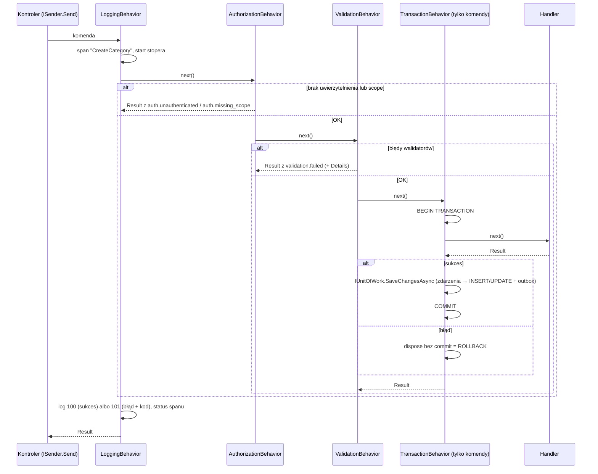

# 6. Warstwa aplikacji: komendy, zapytania, pipeline i handlery

Implementacja warstwy aplikacji: komendy, zapytania, pipeline MediatR (logowanie, autoryzacja, walidacja, transakcja), pionowe wycinki Features, walidatory FluentValidation, orkiestracja handlerów oraz porty `ICurrentUser` i `IClock` na przykładach z Knowledge i SleepDiary.
**Wymagania:** [05 Model domeny](05-model-domeny.md); pomocniczo [02 Architektura w praktyce](02-architektura-w-praktyce.md)
i [03 Zasady](03-zasady.md).

> **W skrócie**
> - Komenda (`ICommand` / `ICommand<Result<T>>`) zmienia stan jednego agregatu; zapytanie (`IQuery<Result<T>>`) tylko czyta.
>   Oba zwracają `Result`, oba przechodzą przez ten sam pipeline; transakcja dotyczy tylko komend.
> - Pipeline: `LoggingBehavior` → `AuthorizationBehavior` (`[RequiresScope]`) → `ValidationBehavior` (FluentValidation,
>   `validation.failed`) → `TransactionBehavior` (zapis, zdarzenia domenowe, outbox, commit tylko przy sukcesie).
> - Handler komendy orkiestruje: prymitywy → ID/VO (`Create` + `TryGetValue`), załadowanie agregatu, jedno wywołanie jego metody,
>   zwrot `Result`. Nie zapisuje, nie publikuje, nie czyta zegara, nie zawiera reguł biznesowych.
> - Walidator sprawdza kształt wejścia tymi samymi stałymi i tym samym przycinaniem co domena; reguły zależne od stanu są w agregacie.
> - Użytkownik pochodzi wyłącznie z tokenu (`ICurrentUser`, `RequireUserId()`), czas z `IClock`.
> - Wszystko (handlery, walidatory, handlery zdarzeń) rejestruje się skanowaniem assembly; ręcznie rejestrujesz tylko repozytoria.

Kod w blokach jest skopiowany z repozytorium; dokumentację XML (`///`) pomijam, chyba że jest tematem fragmentu, a zostawiam
`/// <inheritdoc />`. Bloki „Źle” nie pochodzą z repozytorium.

---

## 6.1 Rola warstwy Application

Projekt `{Serwis}.Application` opisuje **przypadki użycia** serwisu. Zależy od `{Serwis}.Domain`, `{Serwis}.Contracts`,
`SuperApp.Framework.Application` oraz pakietów MediatR i FluentValidation. **Nie** zależy od Infrastructure, EF Core ani MassTransit
(testy architektury, ADR-0002).

| Co tu jest | Przykład | Widoczność |
|---|---|---|
| Komendy i zapytania | `CreateCategory`, `ListMyFavorites` | `public sealed record` |
| DTO wyników zapytań | `FavoriteDto`, `SleepEntryDto` | `public sealed record` |
| Walidatory | `CreateCategoryValidator` | `internal sealed` |
| Handlery **komend** | `CreateCategoryHandler` | `internal sealed` |
| Handlery zdarzeń domenowych tłumaczące na integracyjne | `MaterialPublishedTranslator` | `internal sealed` |
| Stałe scope | `KnowledgeScopes`, `SleepDiaryScopes` | `public static` |
| Reguły walidacji wspólne dla wycinków | `TextRuleExtensions`, `SleepEntryInputRules` | `internal static` |
| Rozszerzenia portów | `CurrentUserExtensions.RequireUserId` | `internal static` |
| Modele wymiany złożonych danych | `Content/Blocks/*BlockDto`, `ContentMapper` | `public` |
| Znacznik assembly | `KnowledgeApplication.Assembly` | `public static` |

Handlery **zapytań** nie leżą w Application, tylko w Infrastructure, bo używają `ReadDbContext` i metod EF (ADR-0026).
Application definiuje dla zapytania wyłącznie rekord zapytania, DTO i ewentualny walidator.

Porty wspólne dla wszystkich serwisów są w `SuperApp.Framework.Application`:

| Port | Przestrzeń nazw | Implementacja (Infrastructure) | Kto używa |
|---|---|---|---|
| `ICurrentUser` | `SuperApp.Framework.Application.Security` | `HttpCurrentUser` (API), `SystemCurrentUser` (Worker) | handlery, `AuthorizationBehavior` |
| `IClock` | `SuperApp.Framework.Application.Time` | `SystemClock` (`TimeProvider`) | handlery |
| `IUnitOfWork` | `SuperApp.Framework.Application.Persistence` | `WriteDbContextBase` | `TransactionBehavior`, handlery cache (`OnCommitted`) |
| `IIntegrationEventPublisher` | `SuperApp.Framework.Application.Events` | publikacja przez outbox MassTransit | translatory |
| `IDomainEventHandler<T>` | `SuperApp.Framework.Application.Events` | piszesz sam | `DomainEventDispatcher` |

Porty specyficzne dla serwisu (np. `I{Obcy}Gateway` dla anti-corruption layer do innego serwisu) definiuje się w Application
serwisu, a implementuje w Infrastructure. **W obecnym kodzie nie ma jeszcze żadnego portu ACL**; wzorzec dla pierwszego
użycia opisuje [przepis 08](przepisy/08-wywolanie-innego-serwisu.md) i ADR-0014. Port nie przyjmuje identyfikatora użytkownika
jako podstawy dostępu: wywołanie w kontekście użytkownika przekazuje jego token, a odbiorca sam wyznacza właściciela z `sub` (ADR-0040).

## 6.2 Komenda czy zapytanie

| | Komenda | Zapytanie |
|---|---|---|
| Interfejs | `ICommand` (wynik `Result`) albo `ICommand<Result<T>>` | `IQuery<Result<T>>` |
| Handler | `ICommandHandler<TCommand>` / `ICommandHandler<TCommand, TResponse>` w **Application** | `IQueryHandler<TQuery, TResponse>` w **Infrastructure** |
| Zmienia stan | tak, jednego agregatu | nigdy |
| Dane | agregaty przez repozytoria (`WriteDbContext`) | read modele przez `ReadDbContext`, projekcje na DTO |
| Transakcja | tak (`TransactionBehavior`) | nie |
| Cache | zakazany | dozwolony (`FailSafeCache`) |
| Zwraca | `Result` albo `Result<T>` z prostą wartością (ID nowego zasobu) | `Result<DTO>`, `Result<IReadOnlyList<DTO>>`, `Result<PagedResult<DTO>>` |
| HTTP | `POST`/`PUT`/`DELETE`; 204 albo 201 | `GET`; 200 |
| Nazwa | czasownik z języka domeny: `PublishMaterial`, `RecordSleepEntry` | to, co zwraca: `GetMaterial`, `ListMyFavorites` |

Komenda nie zwraca stanu po zmianie. Jeśli klient go potrzebuje, wysyła zapytanie. Wyjątek: identyfikator utworzonego zasobu
(`ICommand<Result<Guid>>`), bo bez niego klient nie zbuduje adresu.

Definicje interfejsów (`SuperApp.Framework.Application/Messaging`), bez dokumentacji:

```csharp
public interface ICommand<TResponse> : IRequest<TResponse>
    where TResponse : IResultFactory<TResponse>;

public interface ICommand : ICommand<Result>;

public interface IQuery<TResponse> : IRequest<TResponse>
    where TResponse : IResultFactory<TResponse>;

public interface ICommandHandler<in TCommand, TResponse> : IRequestHandler<TCommand, TResponse>
    where TCommand : ICommand<TResponse>
    where TResponse : IResultFactory<TResponse>;

public interface ICommandHandler<in TCommand> : ICommandHandler<TCommand, Result>
    where TCommand : ICommand;

public interface IQueryHandler<in TQuery, TResponse> : IRequestHandler<TQuery, TResponse>
    where TQuery : IQuery<TResponse>
    where TResponse : IResultFactory<TResponse>;
```

Ograniczenie `where TResponse : IResultFactory<TResponse>` sprawia, że **komenda i zapytanie muszą zwracać `Result` albo
`Result<T>`**: `IQuery<MaterialDetailsDto>` się nie skompiluje. Dzięki temu behaviory mogą przerwać żądanie błędem
(`TResponse.FromError(error)`) bez znajomości konkretnego typu wyniku i bez refleksji.

## 6.3 Pionowy wycinek

Jeden przypadek użycia = jeden folder `Features/{Agregat}/{PrzypadekUżycia}/` w Application, jeden typ na plik (ADR-0032):

```
Knowledge.Application/Features/
  Categories/
    CreateCategory/        CreateCategory.cs, CreateCategoryValidator.cs, CreateCategoryHandler.cs
    RenameCategory/        RenameCategory.cs, RenameCategoryValidator.cs, RenameCategoryHandler.cs
    ListCategories/        ListCategories.cs, CategoryDto.cs                     (handler w Infrastructure)
  Materials/
    PublishMaterial/       PublishMaterial.cs, PublishMaterialValidator.cs, PublishMaterialHandler.cs
    GetMaterial/           GetMaterial.cs, MaterialDetailsDto.cs
  Library/
    AddFavorite/           AddFavorite.cs, AddFavoriteValidator.cs, AddFavoriteHandler.cs
    ListMyFavorites/       ListMyFavorites.cs, FavoriteDto.cs
    CurrentUserExtensions.cs                      (wspólne dla wycinków Library)
Knowledge.Infrastructure/Features/
  Categories/ListCategoriesHandler.cs
  Library/ListMyFavoritesHandler.cs
  Materials/GetMaterialHandler.cs

SleepDiary.Application/Features/Entries/
  RecordSleepEntry/        RecordSleepEntry.cs, RecordSleepEntryValidator.cs, RecordSleepEntryHandler.cs
  UpdateSleepEntry/        ...
  DeleteSleepEntry/        DeleteSleepEntry.cs, DeleteSleepEntryHandler.cs   (bez walidatora: nie ma czego sprawdzać)
  ListSleepEntries/        ListSleepEntries.cs, ListSleepEntriesValidator.cs, SleepDiaryDto.cs
  SleepEntryInputRules.cs                         (reguły wspólne dla Record i Update)
```

Konwencje nazw: komenda bez sufiksu `Command` (`PublishMaterial`, nie `PublishMaterialCommand`), handler `{PrzypadekUżycia}Handler`,
walidator `{PrzypadekUżycia}Validator`. Handlery zapytań w Infrastructure leżą w `Features/{Agregat}/{PrzypadekUżycia}Handler.cs`
(bez folderu przypadku użycia). Walidator jest opcjonalny: `DeleteSleepEntry` ma tylko `DateOnly`, którą sprawdza model binding.

## 6.4 Pipeline MediatR krok po kroku

### Rejestracja i kolejność

`SuperApp.Framework.Application/ApplicationServiceCollectionExtensions.cs`:

```csharp
public static IServiceCollection AddAppApplication(
    this IServiceCollection services,
    params Assembly[] assemblies)
{
    services.AddMediatR(configuration =>
    {
        configuration.RegisterServicesFromAssemblies(assemblies);
        configuration.AddOpenBehavior(typeof(LoggingBehavior<,>));
        configuration.AddOpenBehavior(typeof(AuthorizationBehavior<,>));
        configuration.AddOpenBehavior(typeof(ValidationBehavior<,>));
        configuration.AddOpenBehavior(typeof(TransactionBehavior<,>));
    });

    services.AddValidatorsFromAssemblies(assemblies, includeInternalTypes: true);

    foreach (var type in assemblies.SelectMany(assembly => assembly.GetTypes()).Where(type => type is { IsAbstract: false, IsGenericTypeDefinition: false }))
    {
        foreach (var handlerInterface in type.GetInterfaces().Where(IsDomainEventHandler))
        {
            services.AddScoped(handlerInterface, type);
        }
    }

    return services;
}
```

MediatR składa behaviory tak, że pierwszy zarejestrowany jest najbardziej zewnętrzny. Kolejność jest ustalona w ADR-0017
i sprawdzana testem architektury `Pipeline_behaviors_are_registered_in_order`.



Dlaczego taka kolejność:

1. **Logowanie najpierw**, żeby każde żądanie, także odrzucone przez autoryzację, miało span i wpis w logu z kodem błędu.
2. **Autoryzacja przed walidacją**, żeby wywołujący bez uprawnień nie poznawał reguł ani istnienia zasobów z komunikatów
   walidacji (ADR-0017). Test `PipelineTests.Authorization_runs_before_validation` wysyła niepoprawną komendę bez scope i
   oczekuje `auth.missing_scope`, nie `validation.failed`.
3. **Walidacja przed transakcją**, żeby niepoprawne dane nie otwierały transakcji ani nie dotykały bazy.
4. **Transakcja najbliżej handlera**: obejmuje odczyty handlera (sprawdzenia unikalności, załadowanie agregatu) i zapis.

### `LoggingBehavior`

```csharp
internal sealed partial class LoggingBehavior<TRequest, TResponse>(ILogger<LoggingBehavior<TRequest, TResponse>> logger)
    : IPipelineBehavior<TRequest, TResponse>
    where TRequest : notnull
    where TResponse : IResultFactory<TResponse>
{
    public async Task<TResponse> Handle(TRequest request, RequestHandlerDelegate<TResponse> next, CancellationToken cancellationToken)
    {
        var requestName = typeof(TRequest).Name;
        using var activity = ApplicationTelemetry.ActivitySource.StartActivity(requestName);
        var started = Stopwatch.GetTimestamp();

        var response = await next();

        var elapsed = Stopwatch.GetElapsedTime(started).TotalMilliseconds;
        if (response is Result { IsFailure: true } failure)
        {
            activity?.SetStatus(ActivityStatusCode.Error, failure.Error.Code);
            LogRequestFailed(logger, requestName, failure.Error.Code, elapsed);
        }
        else
        {
            LogRequestHandled(logger, requestName, elapsed);
        }

        return response;
    }

    [LoggerMessage(100, LogLevel.Information, "Request {RequestName} handled in {ElapsedMs} ms")]
    private static partial void LogRequestHandled(ILogger logger, string requestName, double elapsedMs);

    [LoggerMessage(101, LogLevel.Warning, "Request {RequestName} failed with {ErrorCode} in {ElapsedMs} ms")]
    private static partial void LogRequestFailed(ILogger logger, string requestName, string errorCode, double elapsedMs);
}
```

Efekty: span o nazwie typu żądania (źródło `SuperApp.Application`) między spanem ASP.NET Core a spanami SQL; log `EventId` 100
(Information) albo 101 (Warning z kodem błędu). **Treść żądania nie jest logowana** (może zawierać dane osobowe).
Wyjątki nie są tu łapane: przechodzą do hosta (globalny handler → 500) i są widoczne w spanie ASP.NET Core.
W MediatR 12 `RequestHandlerDelegate<T>` nie przyjmuje `CancellationToken` (ADR-0035), dlatego behaviory wołają `next()`.

### `AuthorizationBehavior`

```csharp
internal sealed class AuthorizationBehavior<TRequest, TResponse>(ICurrentUser currentUser)
    : IPipelineBehavior<TRequest, TResponse>
    where TRequest : notnull
    where TResponse : IResultFactory<TResponse>
{
    private static readonly ConcurrentDictionary<Type, (bool Anonymous, string? Scope)> Requirements = new();

    public Task<TResponse> Handle(TRequest request, RequestHandlerDelegate<TResponse> next, CancellationToken cancellationToken)
    {
        var (anonymous, scope) = Requirements.GetOrAdd(typeof(TRequest), static type => (
            type.GetCustomAttribute<AllowAnonymousRequestAttribute>() is not null,
            type.GetCustomAttribute<RequiresScopeAttribute>()?.Scope));

        if (anonymous)
        {
            return next();
        }

        if (!currentUser.IsAuthenticated)
        {
            return Task.FromResult(TResponse.FromError(AuthorizationErrors.Unauthenticated));
        }

        if (scope is not null && !currentUser.HasScope(scope))
        {
            return Task.FromResult(TResponse.FromError(AuthorizationErrors.MissingScope(scope)));
        }

        return next();
    }
}
```

| Atrybuty na typie żądania | Wynik |
|---|---|
| `[AllowAnonymousRequest]` | brak sprawdzeń (handler nie może zakładać, że `Subject` jest ustawiony) |
| brak atrybutów | wymagany tylko uwierzytelniony wywołujący |
| `[RequiresScope("knowledge.catalog.write")]` | uwierzytelniony **i** token z tym scope; inaczej `auth.missing_scope` (403) |
| nieuwierzytelniony wywołujący | `auth.unauthenticated` (403) |

Atrybuty są czytane refleksją raz na typ i cache'owane. W Workerze `ICurrentUser` to `SystemCurrentUser` (uwierzytelniony, bez
`Subject`, z każdym scope), więc `[RequiresScope]` nie blokuje komend wysyłanych przez konsumentów. To jest
autoryzacja **gruboziarnista**. Reguły zależne od zasobu (właściciel wpisu, szkic widoczny tylko dla redaktora) są w handlerze
albo agregacie, po walidacji (rozdział [09 Bezpieczeństwo](09-bezpieczenstwo.md)).

Odpowiedź przy braku scope:

```http
HTTP/1.1 403 Forbidden
Content-Type: application/problem+json

{
  "title": "Brak wymaganego uprawnienia 'knowledge.catalog.write'.",
  "status": 403,
  "instance": "/v1/categories",
  "code": "auth.missing_scope",
  "traceId": "4bf92f3577b34da6a3ce929d0e0e4736"
}
```

Żądanie bez tokenu w ogóle nie dociera do pipeline'u: polityka domyślna API (`AddAppApi`, `RequireAuthenticatedUser`) kończy
je odpowiedzią 401 bez pola `code`.

### `ValidationBehavior`

```csharp
internal sealed class ValidationBehavior<TRequest, TResponse>(IEnumerable<IValidator<TRequest>> validators)
    : IPipelineBehavior<TRequest, TResponse>
    where TRequest : notnull
    where TResponse : IResultFactory<TResponse>
{
    public async Task<TResponse> Handle(TRequest request, RequestHandlerDelegate<TResponse> next, CancellationToken cancellationToken)
    {
        var failures = new List<FluentValidation.Results.ValidationFailure>();
        foreach (var validator in validators)
        {
            var result = await validator.ValidateAsync(request, cancellationToken);
            failures.AddRange(result.Errors);
        }

        if (failures.Count == 0)
        {
            return await next();
        }

        var details = failures
            .GroupBy(failure => failure.PropertyName)
            .ToDictionary(group => group.Key, group => group.Select(failure => failure.ErrorMessage).ToArray());

        return TResponse.FromError(Error.Validation("validation.failed", "Żądanie zawiera niepoprawne dane.", details));
    }
}
```

Uruchamia **wszystkie** walidatory danego typu żądania i zbiera **wszystkie** błędy, więc klient dostaje komplet poprawek
w jednej odpowiedzi. Nie rzuca wyjątków. Błędy pogrupowane po nazwie właściwości trafiają do `Error.Details`, a stamtąd do
pola `errors` w `ValidationProblemDetails`:

```http
POST http://localhost:5102/v1/entries/2026-09-30
Authorization: Bearer eyJhbGciOi...
Content-Type: application/json

{ "bedTime": "2026-09-29T23:15:00Z", "wakeTime": "2026-09-30T07:00:00", "sleepLatencyMinutes": 15, "awakenings": 1, "quality": 4, "notes": null }
```

```http
HTTP/1.1 400 Bad Request
Content-Type: application/problem+json

{
  "title": "Żądanie zawiera niepoprawne dane.",
  "status": 400,
  "instance": "/v1/entries/2026-09-30",
  "errors": {
    "BedTime": [
      "Czas należy podać jako lokalny czas użytkownika bez strefy czasowej (bez 'Z' i przesunięcia), np. 2026-09-29T23:15:00."
    ]
  },
  "code": "validation.failed",
  "traceId": "4bf92f3577b34da6a3ce929d0e0e4736"
}
```

Klucze w `errors` to nazwy właściwości komendy (FluentValidation `PropertyName`), nie pola JSON. Gdy różnią się nazwą od pól
żądania (komenda ma inne nazwy niż ciało), opisz to w dokumentacji akcji.

### `TransactionBehavior`

```csharp
internal sealed class TransactionBehavior<TRequest, TResponse>(IUnitOfWork unitOfWork)
    : IPipelineBehavior<TRequest, TResponse>
    where TRequest : ICommand<TResponse>
    where TResponse : IResultFactory<TResponse>
{
    public async Task<TResponse> Handle(TRequest request, RequestHandlerDelegate<TResponse> next, CancellationToken cancellationToken)
    {
        if (unitOfWork.HasActiveTransaction)
        {
            var nested = await next();
            if (!IsSuccess(nested))
            {
                unitOfWork.DiscardChanges();
                return nested;
            }

            var savedNested = await unitOfWork.SaveChangesAsync(cancellationToken);
            return savedNested.IsSuccess ? nested : TResponse.FromError(savedNested.Error);
        }

        await using var transaction = await unitOfWork.BeginTransactionAsync(cancellationToken);
        var response = await next();
        if (!IsSuccess(response))
        {
            return response;
        }

        var saved = await unitOfWork.SaveChangesAsync(cancellationToken);
        if (saved.IsFailure)
        {
            return TResponse.FromError(saved.Error);
        }

        await transaction.CommitAsync(cancellationToken);
        return response;
    }

    private static bool IsSuccess(TResponse response) => response is Result { IsSuccess: true };
}
```

Krok po kroku:

1. **Tylko komendy.** Ograniczenie `where TRequest : ICommand<TResponse>` nie jest spełnione dla zapytań, więc kontener DI
   nie tworzy tego behavioru dla `IQuery<...>`. Zapytania nie otwierają transakcji.
2. **Transakcja już istnieje** (`HasActiveTransaction`): komenda wysłana przez konsumenta MassTransit działa w transakcji
   inbox/outbox konsumenta. Behavior zapisuje zmiany w niej, a commit zostawia konsumentowi (ADR-0005, ADR-0017).
3. **Zwykły przypadek**: `BEGIN TRANSACTION` **przed** handlerem, więc odczyty handlera (np. `SlugExistsAsync`) i zapis są w
   jednej transakcji (domyślny poziom izolacji SQL Server, `READ COMMITTED`).
4. **Wynik handlera to błąd** → behavior zwraca go bez zapisu; `await using` usuwa transakcję bez commita, czyli rollback.
   Zmiany śledzone w kontekście nie trafią do bazy.
5. **Sukces** → `IUnitOfWork.SaveChangesAsync` (`WriteDbContextBase`): zebranie zdarzeń domenowych ze śledzonych agregatów,
   ich wyczyszczenie, wywołanie handlerów zdarzeń (translatory dodają wiersze outboxa, handlery cache rejestrują `OnCommitted`),
   jeden `SaveChanges` stanu i outboxa.
6. **Zapis nieudany przez unikalny indeks** → `Result` z błędem `Conflict` (zmapowanym albo `persistence.duplicate`),
   bez commita. Konflikt wersji wiersza w transakcji otwartej przez behavior → `Result` z `persistence.concurrency_conflict`
   (409); w transakcji konsumenta zostaje wyjątkiem, żeby MassTransit ponowił wiadomość. Każdy inny wyjątek (np. niedostępna
   baza) przechodzi dalej jako wyjątek.
7. **Commit**, a po nim `AfterCommitInterceptor` uruchamia akcje `OnCommitted` (np. unieważnienie cache).

W SQL Profilerze komenda `PublishMaterial` wygląda mniej więcej tak:

```
BEGIN TRANSACTION
SELECT ... FROM knowledge.Materials WHERE Id = @id         -- IMaterialRepository.GetAsync (z kategoriami i blokami)
UPDATE knowledge.Materials SET Status = 'Published', PublishedAt = ..., UpdatedAt = ...
INSERT INTO knowledge.OutboxMessage (...)                  -- MaterialPublishedV1 z translatora
COMMIT
-- po commicie: FailSafeCache.RemoveByTagAsync("knowledge:material:{id}")
```

### Co widzi klient na każdym etapie

| Etap | Warunek | Kod | HTTP |
|---|---|---|---|
| ASP.NET Core (przed pipeline'em) | brak lub zły token | brak `code` | 401 |
| ASP.NET Core model binding | zły format (`page=abc`, zły JSON, nieznany `type` bloku) | `ValidationProblemDetails` **bez** `code` | 400 |
| `AuthorizationBehavior` | brak użytkownika / scope | `auth.unauthenticated` / `auth.missing_scope` | 403 |
| `ValidationBehavior` | błędy walidatorów | `validation.failed` + `errors` | 400 |
| Handler / agregat | reguła biznesowa | kod z `{Agregat}Errors` | 400/403/404/409/422 |
| `TransactionBehavior` (zapis) | naruszenie unikalnego indeksu | zmapowany kod albo `persistence.duplicate` | 409 |
| `TransactionBehavior` (zapis) | konflikt `rowversion` (agregat zmieniony w międzyczasie) | `persistence.concurrency_conflict` | 409 |
| Dowolny etap | wyjątek | brak `code` | 500 |

## 6.5 Komendy

Pełny przykład z dokumentacją, bo dokumentacja komendy jest częścią kontraktu przypadku użycia
(`Knowledge.Application/Features/Categories/CreateCategory/CreateCategory.cs`):

```csharp
/// <summary>
/// Creates a catalog category with a display name and a unique slug. Categories are flat (no hierarchy) and are used to group
/// materials and collections. Requires scope <see cref="KnowledgeScopes.CatalogWrite"/>.
/// </summary>
/// <remarks>
/// <para>
/// Input rules (<c>CreateCategoryValidator</c>): <see cref="Name"/> not blank, at most
/// <see cref="Knowledge.Domain.Categories.Category.MaxNameLength"/> characters after trimming; <see cref="Slug"/> not blank, at most
/// <see cref="Knowledge.Domain.Categories.Category.MaxSlugLength"/> characters. The slug format is checked by the aggregate.
/// </para>
/// <para>
/// The handler rejects a slug that is already used, then creates the <c>Category</c> aggregate (which trims the name and raises
/// <c>CategoryChanged</c>, invalidating the cached category list) and adds it to the repository. The transaction behavior saves it.
/// </para>
/// <para>Result: on success the identifier of the new category. Possible errors:</para>
/// <list type="bullet">
///   <item><description><c>auth.unauthenticated</c> (403): no authenticated caller; <c>auth.missing_scope</c> (403): the token lacks
///   <see cref="KnowledgeScopes.CatalogWrite"/>.</description></item>
///   <item><description><c>validation.failed</c> (400): the input rules above; field messages are in <see cref="Error.Details"/>.</description></item>
///   <item><description><see cref="Knowledge.Domain.Categories.CategoryErrors.InvalidSlug"/> (<c>knowledge.category.invalid_slug</c>, 400):
///   the slug is not made of lowercase letters, digits and single hyphens.</description></item>
///   <item><description><see cref="Knowledge.Domain.Categories.CategoryErrors.SlugTaken"/> (<c>knowledge.category.slug_taken</c>, 409):
///   another category already uses the slug. Also returned when two concurrent requests create the same slug and the unique index rejects
///   the second one.</description></item>
/// </list>
/// </remarks>
/// <example>
/// <code>
/// Result&lt;Guid&gt; result = await sender.Send(new CreateCategory("Healthy sleep", "healthy-sleep"), cancellationToken);
/// </code>
/// </example>
/// <param name="Name">Display name of the category; not blank, at most <see cref="Knowledge.Domain.Categories.Category.MaxNameLength"/> characters after trimming. Stored trimmed.</param>
/// <param name="Slug">
/// Unique identifier of the category for URLs; at most <see cref="Knowledge.Domain.Categories.Category.MaxSlugLength"/> characters,
/// only lowercase letters <c>a-z</c>, digits and single hyphens between them (for example <c>healthy-sleep</c>). Cannot be changed later.
/// </param>
[RequiresScope(KnowledgeScopes.CatalogWrite)]
public sealed record CreateCategory(string Name, string Slug) : ICommand<Result<Guid>>;
```

Reguły pisania komendy:

- `public sealed record`, parametry pozycyjne, **tylko prymitywy** (`Guid`, `string`, `int`, `DateOnly`, enumy domeny jak
  `FavoriteItemType`, DTO wymiany jak `ContentBlockDto`). ID i VO tworzy handler.
- **Zawsze** `[RequiresScope(...)]` ze stałą z `{Serwis}Scopes` (nigdy literał) albo `[AllowAnonymousRequest]` dla danych
  celowo publicznych.
- **Nigdy** identyfikatora użytkownika: właściciela bierze handler z tokenu.
- Dokumentacja: co robi, wymagany scope, reguły wejścia, co robi handler, **wynik i wszystkie kody błędów** ze statusami,
  `<param>` dla każdego parametru (APP006). Wzór pisania: [15 Dokumentacja w kodzie](15-dokumentacja-w-kodzie.md).

Stałe scope (`Knowledge.Application/KnowledgeScopes.cs`, bez dokumentacji):

```csharp
public static class KnowledgeScopes
{
    public const string CatalogRead = "knowledge.catalog.read";

    public const string CatalogWrite = "knowledge.catalog.write";

    public const string LibraryRead = "knowledge.library.read";

    public const string LibraryWrite = "knowledge.library.write";
}
```

## 6.6 Walidatory

### Co walidator sprawdza, a czego nie

| Walidator (FluentValidation, przed handlerem) | Agregat (w handlerze) |
|---|---|
| obecność pól, puste ID (`NotEmpty`) | reguły zależne od stanu (archiwum, opublikowany) |
| długości i zakresy pojedynczych pól | reguły kilku pól naraz (wstanie po położeniu się) |
| format wejścia, którego domena nie może już sprawdzić (`DateTime.Kind`) | formaty będące regułą domeny (slug, `https`) |
| zakresy dat w zapytaniach | unikalność i istnienie innych agregatów (handler przez repozytorium) |

Walidator **powtarza** część reguł agregatu, żeby klient dostał wszystkie błędy pól naraz (agregat zwraca tylko pierwszy).
Warunek: walidator i agregat muszą przyjmować **dokładnie te same** wartości. Dlatego:

- limity są **stałymi agregatu** (`Category.MaxNameLength`, `SleepEntry.MaxNotesLength`, `SleepQuality.Max`), nigdy liczbami;
- długość tekstu mierzy się **po przycięciu**, tak jak robią to agregaty.

Knowledge ma do tego regułę `MaximumTrimmedLength` (`Knowledge.Application/Validation/TextRuleExtensions.cs`):

```csharp
internal static class TextRuleExtensions
{
    public static IRuleBuilderOptions<T, string?> MaximumTrimmedLength<T>(this IRuleBuilder<T, string?> rule, int maxLength) =>
        rule.Must(value => value is null || value.Trim().Length <= maxLength)
            .WithMessage($"Pole '{{PropertyName}}' może mieć najwyżej {maxLength} znaków (bez białych znaków na początku i końcu).");
}
```

i jej użycie (`CreateCategoryValidator`):

```csharp
internal sealed class CreateCategoryValidator : AbstractValidator<CreateCategory>
{
    /// <summary>Defines the rules.</summary>
    public CreateCategoryValidator()
    {
        RuleFor(command => command.Name).NotEmpty().MaximumTrimmedLength(Category.MaxNameLength);
        RuleFor(command => command.Slug).NotEmpty().MaximumLength(Category.MaxSlugLength);
    }
}
```

Slug używa zwykłego `MaximumLength`, bo agregat go nie przycina. Format sluga sprawdza agregat
(`knowledge.category.invalid_slug`), a unikalność handler. Test `TextValidationTests` sprawdza, że walidatory przyjmują
tekst o maksymalnej długości otoczony spacjami i odrzucają o jeden znak dłuższy, razem z agregatem.

SleepDiary ma reguły wspólne dla `RecordSleepEntry` i `UpdateSleepEntry`
(`SleepDiary.Application/Features/Entries/SleepEntryInputRules.cs`):

```csharp
internal static class SleepEntryInputRules
{
    public static IRuleBuilderOptions<T, DateTime> WallClockTime<T>(this IRuleBuilder<T, DateTime> rule) =>
        rule.Must(value => value.Kind == DateTimeKind.Unspecified)
            .WithMessage("Czas należy podać jako lokalny czas użytkownika bez strefy czasowej (bez 'Z' i przesunięcia), np. 2026-09-29T23:15:00.");

    public static IRuleBuilderOptions<T, string?> NotesWithinLimit<T>(this IRuleBuilder<T, string?> rule) =>
        rule.Must(notes => notes is null || notes.Trim().Length <= SleepEntry.MaxNotesLength)
            .WithMessage($"Notatka po usunięciu białych znaków z początku i końca może mieć najwyżej {SleepEntry.MaxNotesLength} znaków.");
}
```

`WallClockTime` to przykład reguły, której **domena nie może sprawdzić**: `System.Text.Json` zamienia wartość z `Z` albo
przesunięciem na UTC lub czas lokalny serwera, zanim powstanie komenda. Agregat dostałby przesunięty czas bez śladu. Jedynym
miejscem, w którym widać, że klient wysłał strefę, jest `DateTime.Kind` w komendzie.

```csharp
internal sealed class RecordSleepEntryValidator : AbstractValidator<RecordSleepEntry>
{
    public RecordSleepEntryValidator()
    {
        RuleFor(command => command.BedTime).WallClockTime();
        RuleFor(command => command.WakeTime).WallClockTime();
        RuleFor(command => command.Quality).InclusiveBetween(SleepQuality.Min, SleepQuality.Max);
        RuleFor(command => command.Awakenings).InclusiveBetween(0, SleepEntry.MaxAwakenings);
        RuleFor(command => command.SleepLatencyMinutes).GreaterThanOrEqualTo(0);
        RuleFor(command => command.Notes).NotesWithinLimit();
    }
}
```

Walidator zapytania (`ListSleepEntriesValidator`) pokazuje pułapkę bindingu: brakujący parametr `from` typu `DateOnly` binduje
się jako `default(DateOnly)` (`0001-01-01`), więc trzeba go jawnie odrzucić, a reguły zakresu sprawdzać tylko, gdy oba końce
są podane (jeden czytelny komunikat zamiast kilku):

```csharp
internal sealed class ListSleepEntriesValidator : AbstractValidator<ListSleepEntries>
{
    public const int MaxRangeDays = 366;

    public ListSleepEntriesValidator()
    {
        RuleFor(query => query.From).NotEqual(default(DateOnly)).WithMessage("Parametr 'from' jest wymagany.");
        RuleFor(query => query.To).NotEqual(default(DateOnly)).WithMessage("Parametr 'to' jest wymagany.");

        When(query => query.From != default && query.To != default, () =>
        {
            RuleFor(query => query.To).GreaterThanOrEqualTo(query => query.From);
            RuleFor(query => query).Must(query => query.To.DayNumber - query.From.DayNumber < MaxRangeDays)
                .WithMessage($"Zakres dat może obejmować najwyżej {MaxRangeDays} dni.");
        });
    }
}
```

Zapytania Knowledge ze stronicowaniem wybrały odwrotną strategię: **łagodne** stronicowanie bez walidatora (strona < 1 to 1,
rozmiar przycięty do `1..Paging.MaxPageSize`). Obie strategie są dopuszczalne; ważne, żeby opisać wybraną w dokumentacji zapytania.

### Źle / dobrze

```csharp
// Źle: liczba zamiast stałej domeny – po zmianie limitu w agregacie walidator i domena się rozjadą
RuleFor(command => command.Name).NotEmpty().MaximumLength(100);

// Źle: mierzy nieprzyciętą wartość – "  Nazwa o długości 100  " odrzucona, choć agregat by ją przyjął
RuleFor(command => command.Name).NotEmpty().MaximumLength(Category.MaxNameLength);

// Źle: reguła biznesowa w walidatorze – zapytanie do bazy poza transakcją, błąd jako validation.failed (400) zamiast
// knowledge.category.slug_taken (409), a wyścig i tak trzeba obsłużyć indeksem
RuleFor(command => command.Slug).MustAsync(async (slug, token) => !await categories.SlugExistsAsync(slug, token));

// Dobrze
RuleFor(command => command.Name).NotEmpty().MaximumTrimmedLength(Category.MaxNameLength);
```

## 6.7 Handlery komend

### Wzorzec orkiestracji

Każdy handler komendy wykonuje te same kroki, w tej kolejności:

1. **Kto wywołuje** (gdy przypadek użycia dotyczy danych użytkownika): `currentUser.RequireUserId()`.
2. **Prymitywy → typy domenowe**: `XxxId.Create(...)`, `SomeValue.Create(...)` z `TryGetValue`.
3. **Załadowanie agregatu** przez repozytorium albo **sprawdzenia warunków wstępnych** (unikalność, istnienie innych agregatów).
4. **Jedno wywołanie** metody agregatu albo jego fabryki; przy tworzeniu `repository.Add(...)`.
5. **Zwrot `Result`** (najczęściej wprost wynik metody agregatu).

I nic więcej. Handler nie zapisuje, nie otwiera transakcji, nie publikuje zdarzeń, nie loguje sukcesu (robi to
`LoggingBehavior`), nie łapie wyjątków.

### `RenameCategory`: niepoprawne ID to „nie znaleziono”

```csharp
internal sealed class RenameCategoryHandler(ICategoryRepository categories) : ICommandHandler<RenameCategory>
{
    /// <inheritdoc />
    public async Task<Result> Handle(RenameCategory command, CancellationToken cancellationToken)
    {
        if (!CategoryId.Create(command.CategoryId).TryGetValue(out var categoryId, out _))
        {
            return CategoryErrors.NotFound;
        }

        var category = await categories.GetAsync(categoryId, cancellationToken);
        return category is null ? CategoryErrors.NotFound : category.Rename(command.Name);
    }
}
```

Dlaczego pusty GUID kończy się `NotFound`, a nie błędem `knowledge.category.invalid_id`? Dla klienta odpowiedź „nie ma
kategorii o takim identyfikatorze” jest prawdziwa i spójna z przypadkiem nieistniejącego GUID-a; nie ma powodu tworzyć dla
niego osobnego kodu. W praktyce walidator (`NotEmpty`) zatrzyma pusty GUID wcześniej z `validation.failed`, a sprawdzenie w
handlerze chroni wywołania spoza HTTP (konsumenci, testy). `out _` odrzuca błąd fabryki, bo handler zastępuje go własnym.

### `CreateCategory`: tworzenie i zwrot ID

```csharp
internal sealed class CreateCategoryHandler(ICategoryRepository categories) : ICommandHandler<CreateCategory, Result<Guid>>
{
    /// <inheritdoc />
    public async Task<Result<Guid>> Handle(CreateCategory command, CancellationToken cancellationToken)
    {
        if (await categories.SlugExistsAsync(command.Slug, cancellationToken))
        {
            return CategoryErrors.SlugTaken;
        }

        if (!Category.Create(command.Name, command.Slug).TryGetValue(out var category, out var error))
        {
            return error;
        }

        categories.Add(category);
        return category.Id.Value;
    }
}
```

`categories.Add` tylko rejestruje agregat w kontekście; `INSERT` wykona `TransactionBehavior` po zwróceniu sukcesu.
`return category.Id.Value;` działa dzięki niejawnej konwersji `Guid` → `Result<Guid>`. Wyścig dwóch identycznych slugów
obsługuje mapa `UniqueConstraintErrors` (rozdział [05](05-model-domeny.md#55-przegląd-agregatu-category-prosty)).

Kontroler zamienia sukces na 201:

```csharp
[HttpPost]
[ProducesResponseType<CreatedResponse>(StatusCodes.Status201Created, MediaTypeNames.Application.Json)]
[ProducesResponseType<ValidationProblemDetails>(StatusCodes.Status400BadRequest, MediaTypeNames.Application.ProblemJson)]
[ProducesResponseType<ProblemDetails>(StatusCodes.Status409Conflict, MediaTypeNames.Application.ProblemJson)]
public async Task<IActionResult> Create(CreateCategory command, CancellationToken cancellationToken) =>
    this.ToActionResult(await sender.Send(command, cancellationToken), id => StatusCode(StatusCodes.Status201Created, new CreatedResponse(id)));
```

```http
POST http://localhost:5101/v1/categories
Authorization: Bearer eyJhbGciOi...
Content-Type: application/json

{ "name": "Higiena snu", "slug": "higiena-snu" }
```

```http
HTTP/1.1 201 Created
Content-Type: application/json; charset=utf-8

{ "id": "0192a3c4-5d6e-7f80-9a1b-2c3d4e5f6a7b" }
```

Ponowienie z tym samym slugiem:

```http
HTTP/1.1 409 Conflict
Content-Type: application/problem+json

{
  "title": "Kategoria o tym slugu już istnieje.",
  "status": 409,
  "instance": "/v1/categories",
  "code": "knowledge.category.slug_taken",
  "traceId": "0af7651916cd43dd8448eb211c80319c"
}
```

### `PublishMaterial`: czas z `IClock`

```csharp
internal sealed class PublishMaterialHandler(IMaterialRepository materials, IClock clock) : ICommandHandler<PublishMaterial>
{
    /// <inheritdoc />
    public async Task<Result> Handle(PublishMaterial command, CancellationToken cancellationToken)
    {
        if (!MaterialId.Create(command.MaterialId).TryGetValue(out var materialId, out _))
        {
            return MaterialErrors.NotFound;
        }

        var material = await materials.GetAsync(materialId, cancellationToken);
        return material is null ? MaterialErrors.NotFound : material.Publish(clock.UtcNow);
    }
}
```

Cała logika publikacji (stan, treść, medium, zdarzenia) jest w `Material.Publish`. Handler nie wie, że istnieje
`MaterialPublishedV1`: zdarzenie integracyjne powstaje w translatorze ([6.11](#611-handlery-zdarzeń-domenowych-i-translatory)).

### `AddFavorite`: użytkownik z tokenu, sprawdzenie innego agregatu, idempotencja

```csharp
internal sealed class AddFavoriteHandler(
    IFavoriteRepository favorites,
    IMaterialRepository materials,
    ICollectionRepository collections,
    ICurrentUser currentUser,
    IClock clock) : ICommandHandler<AddFavorite>
{
    /// <inheritdoc />
    public async Task<Result> Handle(AddFavorite command, CancellationToken cancellationToken)
    {
        if (!currentUser.RequireUserId().TryGetValue(out var userId, out var userError))
        {
            return userError;
        }

        var available = command.ItemType switch
        {
            FavoriteItemType.Material => MaterialId.Create(command.ItemId).TryGetValue(out var materialId, out _)
                && await materials.IsPublishedAsync(materialId, cancellationToken),
            _ => CollectionId.Create(command.ItemId).TryGetValue(out var collectionId, out _)
                && await collections.IsPublishedAsync(collectionId, cancellationToken),
        };
        if (!available)
        {
            return LibraryErrors.ItemNotAvailable;
        }

        if (await favorites.FindAsync(userId, command.ItemType, command.ItemId, cancellationToken) is null)
        {
            favorites.Add(Favorite.Add(userId, command.ItemType, command.ItemId, clock.UtcNow));
        }

        return Result.Success();
    }
}
```

Na co zwrócić uwagę:

- Materiał albo kolekcja **nie są ładowane ani zmieniane**: handler pyta tylko o status (`IsPublishedAsync`). Komenda zmienia
  jeden agregat: `Favorite`.
- „Nie istnieje” i „nieopublikowany” dają ten sam błąd `knowledge.library.item_not_available` (404), żeby czytelnik nie odkrył
  szkiców.
- Idempotencja jest w handlerze (`FindAsync`), bo agregat `Favorite` nie widzi innych ulubionych. Wyścig dwóch identycznych
  żądań kończy się na unikalnym indeksie i błędem `knowledge.library.favorite_added_concurrently` (409): sukcesu nie da się już
  zwrócić, bo zapis nie powiódł się po zakończeniu handlera.
- Gałąź `_` obejmuje `Collection`; inne wartości enuma odrzuca wcześniej walidator (`IsInEnum()`).

### `SetCollectionItems`: istnienie innych agregatów w chwili wykonania

```csharp
internal sealed class SetCollectionItemsHandler(ICollectionRepository collections, IMaterialRepository materials, IClock clock)
    : ICommandHandler<SetCollectionItems>
{
    /// <inheritdoc />
    public async Task<Result> Handle(SetCollectionItems command, CancellationToken cancellationToken)
    {
        if (!CollectionId.Create(command.CollectionId).TryGetValue(out var collectionId, out _))
        {
            return CollectionErrors.NotFound;
        }

        var collection = await collections.GetAsync(collectionId, cancellationToken);
        if (collection is null)
        {
            return CollectionErrors.NotFound;
        }

        var materialIds = new List<MaterialId>();
        foreach (var rawId in command.MaterialIds)
        {
            if (!MaterialId.Create(rawId).TryGetValue(out var materialId, out _))
            {
                return CollectionErrors.UnknownMaterials;
            }

            materialIds.Add(materialId);
        }

        if (!await materials.AllExistAsync(materialIds.Distinct().ToList(), cancellationToken))
        {
            return CollectionErrors.UnknownMaterials;
        }

        return collection.SetItems(materialIds, clock.UtcNow);
    }
}
```

Duplikaty **zostają** w liście przekazanej agregatowi (`materialIds`), żeby to on zgłosił `knowledge.collection.duplicate_items`;
tylko sprawdzenie istnienia używa unikalnych ID. Istnienie materiałów to sprawdzenie w chwili wykonania, nie klucz obcy:
materiał może zostać zarchiwizowany później, a strona odczytu ukryje go przed czytelnikiem.

### `RecordSleepEntry`: pełny przypadek SleepDiary

```csharp
internal sealed class RecordSleepEntryHandler(ISleepEntryRepository entries, ICurrentUser currentUser, IClock clock)
    : ICommandHandler<RecordSleepEntry, Result<Guid>>
{
    /// <inheritdoc />
    public async Task<Result<Guid>> Handle(RecordSleepEntry command, CancellationToken cancellationToken)
    {
        if (!currentUser.RequireUserId().TryGetValue(out var userId, out var userError))
        {
            return userError;
        }

        if (await entries.ExistsAsync(userId, command.Date, cancellationToken))
        {
            return SleepEntryErrors.AlreadyExists;
        }

        // One day of tolerance for time zones: the service does not know the user's time zone (ADR-0029).
        var latestAllowedDate = DateOnly.FromDateTime(clock.UtcNow.UtcDateTime).AddDays(1);
        var details = new SleepDetails(command.BedTime, command.WakeTime, command.SleepLatencyMinutes, command.Awakenings, command.Quality, command.Notes);
        if (!SleepEntry.Record(userId, command.Date, details, latestAllowedDate, clock.UtcNow).TryGetValue(out var entry, out var error))
        {
            return error;
        }

        entries.Add(entry);
        return entry.Id.Value;
    }
}
```

Kolejność błędów, jaką zobaczy klient, wynika z kolejności w pipeline'ie i w handlerze: 403 (scope/użytkownik) → 400
`validation.failed` (walidator) → 409 `already_exists` → 400 `future_date` → 400 pozostałe reguły agregatu. Ta kolejność jest
opisana w dokumentacji komendy `RecordSleepEntry`. `latestAllowedDate` to jedyna „decyzja” handlera: polityka tolerancji stref
czasowych należy do przypadku użycia, a reguła „data nie późniejsza niż X” do agregatu.

Edycja i usunięcie w SleepDiary są jeszcze prostsze:

```csharp
// UpdateSleepEntryHandler
var entry = await entries.FindAsync(userId, command.Date, cancellationToken);
if (entry is null)
{
    return SleepEntryErrors.NotFound;
}

var details = new SleepDetails(command.BedTime, command.WakeTime, command.SleepLatencyMinutes, command.Awakenings, command.Quality, command.Notes);
return entry.Update(details, clock.UtcNow);

// DeleteSleepEntryHandler
var entry = await entries.FindAsync(userId, command.Date, cancellationToken);
if (entry is null)
{
    return SleepEntryErrors.NotFound;
}

entries.Remove(entry);
return Result.Success();
```

Wpis innego użytkownika jest nieodróżnialny od braku wpisu, bo `FindAsync` zawsze filtruje po `userId` z tokenu.

### Czego nigdy nie ma w handlerze

| Nie rób | Dlaczego | Zamiast tego |
|---|---|---|
| `await unitOfWork.SaveChangesAsync(...)` / `context.SaveChanges()` | zapis przed commitem rozbija atomowość; drugi zapis w behaviorze; synchroniczny zapis to APP003 | nic; zapis robi `TransactionBehavior` |
| `if (material.Status == ...)` i inne reguły | logika rozproszona, nietestowalna w domenie | metoda agregatu |
| `DateTimeOffset.UtcNow`, `DateTime.Now` | niedeterministyczne testy, różne chwile w stanie i zdarzeniu | `IClock` → parametr `now` |
| `publisher.PublishAsync(new MaterialPublishedV1(...))` | zdarzenie bez źródła w domenie; łatwo wysłać przy błędzie | `Raise` w agregacie + translator |
| ładowanie i zmiana drugiego agregatu | dwie granice spójności w jednej transakcji | zdarzenie integracyjne + konsument + komenda |
| `throw new ...` dla reguł | 500 zamiast kodu błędu | `return XxxErrors.Y;` |
| `UserId` / `OwnerId` z komendy | podszywanie się pod innego użytkownika | `currentUser.RequireUserId()` |
| `try/catch` wokół wywołań | maskuje błędy techniczne, psuje rollback | pozwól wyjątkom przejść do hosta |
| `IMediator` / `ISender.Send` innej komendy | ukryty łańcuch transakcji i pipeline'ów (APP003 dla `IMediator`) | jedna komenda = jeden przypadek użycia; reszta przez zdarzenia |
| `KnowledgeWriteDbContext` / `ReadDbContext` | Application nie zna EF Core (test architektury) | repozytorium (zapis) albo zapytanie (odczyt) |

## 6.8 `ICurrentUser` i `RequireUserId`

```csharp
public interface ICurrentUser
{
    bool IsAuthenticated { get; }

    string? Subject { get; }

    bool HasScope(string scope);
}
```

| Implementacja | Gdzie | `IsAuthenticated` | `Subject` | `HasScope` |
|---|---|---|---|---|
| `HttpCurrentUser` | API (`AddAppApi`) | token zwalidowany przez serwis | claim `sub` | claimy `scope`/`scp` rozdzielone spacją, porównanie `Ordinal` |
| `SystemCurrentUser` | Worker (`AddAppWorker`) | zawsze `true` | `null` | zawsze `true` |
| `FakeCurrentUser` / `TestCurrentUser` | testy | ustawiane w teście | ustawiane w teście | ustawiane w teście |

Oba serwisy mają własne rozszerzenie `RequireUserId` (Knowledge: `Features/Library/CurrentUserExtensions.cs`,
SleepDiary: `CurrentUserExtensions.cs`), bo `UserId` jest typem domeny każdego serwisu:

```csharp
internal static class CurrentUserExtensions
{
    public static Result<UserId> RequireUserId(this ICurrentUser currentUser) =>
        currentUser.Subject is { } subject ? UserId.Create(subject) : AuthorizationErrors.Unauthenticated;
}
```

Wynik: `UserId`, albo `auth.unauthenticated` (403) gdy nie ma `sub` (np. komenda użytkownika wysłana w Workerze pod
tożsamością systemową), albo `{serwis}.user.invalid_id` (400) dla `sub` dłuższego niż 200 znaków.

```csharp
// Źle: właściciel z komendy – każdy z write scope może dodać ulubione albo wpis dziennika komuś innemu
public sealed record AddFavorite(string UserId, FavoriteItemType ItemType, Guid ItemId) : ICommand;

// Dobrze: komenda bez użytkownika, handler bierze go z tokenu
public sealed record AddFavorite(FavoriteItemType ItemType, Guid ItemId) : ICommand;
if (!currentUser.RequireUserId().TryGetValue(out var userId, out var userError))
{
    return userError;
}
```

`HasScope` w handlerze jest potrzebny tylko dla reguł typu „redaktor widzi więcej” (np. `GetMaterialHandler` sprawdza
`KnowledgeScopes.CatalogWrite`, żeby pokazać szkice). Sam wymagany scope sprawdził już `AuthorizationBehavior`.

## 6.9 `IClock`: czas w przypadkach użycia

```csharp
public interface IClock
{
    DateTimeOffset UtcNow { get; }
}
```

Implementacja `SystemClock` (rejestrowana przez `AddAppServiceDefaults`) używa `TimeProvider.GetUtcNow()`. W testach
jednostkowych handlerów przekazujesz `FakeClock` z ustaloną chwilą (`new FakeClock(new DateTimeOffset(2026, 9, 30, 8, 0, 0, TimeSpan.Zero))`
w `RecordSleepEntryTests`), więc test reguły „nie później niż jutro” jest deterministyczny.

```csharp
// Źle: dwa odczyty zegara mogą dać różne chwile w stanie i w zdarzeniu; test nie ustali „dzisiaj”
var latestAllowedDate = DateOnly.FromDateTime(DateTime.UtcNow).AddDays(1);
SleepEntry.Record(userId, command.Date, details, latestAllowedDate, DateTimeOffset.UtcNow);

// Dobrze (RecordSleepEntryHandler): jeden port, czas przekazany do domeny
var latestAllowedDate = DateOnly.FromDateTime(clock.UtcNow.UtcDateTime).AddDays(1);
```

## 6.10 Porty i `IUnitOfWork`

Handler komendy **nie** wstrzykuje `IUnitOfWork`. Port jest używany przez:

- `TransactionBehavior` (`HasActiveTransaction`, `BeginTransactionAsync`, `SaveChangesAsync`),
- handlery zdarzeń w Infrastructure, które rejestrują pracę po commicie (`OnCommitted`), np. unieważnienie cache:

```csharp
internal sealed class CategoryCacheInvalidation(IUnitOfWork unitOfWork, FailSafeCache cache) : IDomainEventHandler<CategoryChanged>
{
    /// <inheritdoc />
    public Task HandleAsync(CategoryChanged domainEvent, CancellationToken cancellationToken)
    {
        unitOfWork.OnCommitted(token => cache.RemoveByTagAsync(KnowledgeCache.CategoriesTag, token).AsTask());
        return Task.CompletedTask;
    }
}
```

Akcje `OnCommitted` uruchamia `AfterCommitInterceptor` po commicie (także commicie transakcji konsumenta), a przy rollbacku są
odrzucane. Nieudana akcja jest logowana (`EventId` 210) i nie psuje zatwierdzonej komendy. Szczegóły w [11 Cache](11-cache.md).

Nowy port (np. do zewnętrznego systemu) definiujesz jako interfejs w Application serwisu, implementujesz w Infrastructure,
rejestrujesz w `Add{Serwis}Core`. W testach handlera podstawiasz fake.

## 6.11 Handlery zdarzeń domenowych i translatory

Handler zdarzenia domenowego implementuje `IDomainEventHandler<TEvent>`:

```csharp
public interface IDomainEventHandler<in TEvent>
    where TEvent : IDomainEvent
{
    Task HandleAsync(TEvent domainEvent, CancellationToken cancellationToken);
}
```

Są dwa rodzaje:

| Rodzaj | Gdzie | Przykład | Co robi |
|---|---|---|---|
| Translator | `{Serwis}.Application/IntegrationEvents` | `MaterialPublishedTranslator`, `SleepEntryRecordedTranslator` | tłumaczy zdarzenie domenowe na integracyjne z `Contracts` i przekazuje do outboxa |
| Techniczny | `{Serwis}.Infrastructure` (np. `Caching/`) | `CategoryCacheInvalidation`, `MaterialCacheInvalidation` | rejestruje unieważnienie cache po commicie |

Translator Knowledge:

```csharp
internal sealed class MaterialPublishedTranslator(IIntegrationEventPublisher publisher) : IDomainEventHandler<MaterialPublished>
{
    /// <inheritdoc />
    public Task HandleAsync(MaterialPublished domainEvent, CancellationToken cancellationToken) =>
        publisher.PublishAsync(
            new MaterialPublishedV1(domainEvent.MaterialId.Value, domainEvent.Type.ToString(), domainEvent.Title, domainEvent.PublishedAt),
            cancellationToken);
}
```

Translator SleepDiary:

```csharp
internal sealed class SleepEntryRecordedTranslator(IIntegrationEventPublisher publisher) : IDomainEventHandler<SleepEntryRecorded>
{
    /// <inheritdoc />
    public Task HandleAsync(SleepEntryRecorded domainEvent, CancellationToken cancellationToken) =>
        publisher.PublishAsync(
            new SleepEntryRecordedV1(
                domainEvent.EntryId.Value, domainEvent.UserId.Value, domainEvent.Date, domainEvent.SleepMinutes, domainEvent.Quality, domainEvent.RecordedAt),
            cancellationToken);
}
```

Zasady (ADR-0027):

- Działa **wewnątrz** `IUnitOfWork.SaveChangesAsync`, w transakcji komendy, **przed** zapisem. `PublishAsync` tylko dodaje
  wiersz outboxa; wiadomość wyjdzie do RabbitMQ po commicie (Worker), a przy rollbacku zniknie.
- Zamienia typy domenowe na prymitywy (`.Value`, `.ToString()`); kontrakt zawiera tylko prymitywy (test architektury).
- Czas bierze ze zdarzenia (`PublishedAt`, `RecordedAt`), **nigdy z zegara**: wiadomość i stan zawsze się zgadzają.
- Nie modyfikuje agregatów, nie wywołuje `SaveChangesAsync`, nie wykonuje wywołań HTTP ani e-maili (trzyma transakcję otwartą).
- Nie zakłada kolejności względem innych handlerów tego samego zdarzenia.
- `internal sealed` (test `Handlers_are_internal_sealed_and_in_the_right_layer`), rejestracja automatyczna.

Test translatora z fake'iem publishera (`Knowledge.Application.Tests/IntegrationEventTranslatorTests.cs`,
`SleepDiary.Application.Tests/SleepEntryRecordedTranslatorTests.cs`) sprawdza mapowanie pól; pełny przepływ agregat → outbox
testuje się integracyjnie. Więcej: [10 Zdarzenia i integracja](10-zdarzenia-i-integracja.md).

## 6.12 Rejestracja przez skanowanie assembly

Composition root serwisu (`Knowledge.Infrastructure/InfrastructureServiceCollectionExtensions.cs`):

```csharp
public static IServiceCollection AddKnowledgeCore(this IServiceCollection services, IConfiguration configuration)
{
    services.AddAppApplication(KnowledgeApplication.Assembly, typeof(InfrastructureServiceCollectionExtensions).Assembly);

    services.AddAppPersistence<KnowledgeWriteDbContext, KnowledgeReadDbContext>(configuration, KnowledgeWriteDbContext.SchemaName);
    services.AddAppCaching(configuration, KnowledgeWriteDbContext.SchemaName);
    services.AddAppFeatureFlags(configuration);

    services.AddScoped<ICategoryRepository, CategoryRepository>();
    services.AddScoped<IMaterialRepository, MaterialRepository>();
    services.AddScoped<ICollectionRepository, CollectionRepository>();
    services.AddScoped<IFavoriteRepository, FavoriteRepository>();
    services.AddScoped<IMaterialCompletionRepository, MaterialCompletionRepository>();

    return services;
}
```

| Co | Rejestracja |
|---|---|
| handlery komend (Application) i zapytań (Infrastructure) | automatyczna: `RegisterServicesFromAssemblies` MediatR |
| walidatory (także `internal`) | automatyczna: `AddValidatorsFromAssemblies(..., includeInternalTypes: true)` |
| handlery zdarzeń domenowych (oba assembly) | automatyczna: pętla w `AddAppApplication`, `Scoped` |
| behaviory | automatyczna, w ustalonej kolejności |
| repozytoria, porty specyficzne dla serwisu | **ręczna** w `Add{Serwis}Core` |

Api i Worker wołają `Add{Serwis}Infrastructure` (to plus MassTransit), testy integracyjne `Add{Serwis}Core` z fake'ami
`IIntegrationEventPublisher`, `IClock` i `ICurrentUser`. Test `PipelineRegistrationTests.Every_command_has_a_registered_handler`
sprawdza, że każda komenda z Application ma handler.

## 6.13 Komendy z konsumentów (Worker)

Konsument w `{Serwis}.Worker` jest cienki i deleguje do komendy, która przechodzi przez ten sam pipeline
(`Knowledge.Worker/Consumers/MaterialArchivedConsumer.cs`):

```csharp
public sealed partial class MaterialArchivedConsumer(ISender sender, ILogger<MaterialArchivedConsumer> logger) : IConsumer<MaterialArchivedV1>
{
    public async Task Consume(ConsumeContext<MaterialArchivedV1> context)
    {
        var result = await sender.Send(new RemoveFavoritesOfItem(FavoriteItemType.Material, context.Message.MaterialId), context.CancellationToken);
        if (result.IsFailure)
        {
            LogRejected(logger, context.Message.MaterialId, result.Error.Code);
        }
    }

    // Source-generated log method (the only allowed way of logging, see architecture rules §11).
    [LoggerMessage(2001, LogLevel.Warning, "Removing favorites of archived material {MaterialId} rejected: {ErrorCode}")]
    private static partial void LogRejected(ILogger logger, Guid materialId, string errorCode);
}
```

Nieudany `Result` nie jest wyjątkiem (błąd biznesowy nie jest ponawiany, ADR-0015), tylko wpisem w logu. W Workerze transakcję
otwiera inbox/outbox konsumenta, więc `TransactionBehavior` idzie ścieżką `HasActiveTransaction`. Szczegóły:
[10 Zdarzenia i integracja](10-zdarzenia-i-integracja.md).

## Typowe błędy

| Objaw | Przyczyna | Naprawa |
|---|---|---|
| wyjątek MediatR o braku zarejestrowanego `IRequestHandler<...>` dla żądania | handler w assembly, które nie jest skanowane, albo zła sygnatura interfejsu | handler komendy w Application, zapytania w Infrastructure; `ICommandHandler<TCommand>` dla `ICommand`, `ICommandHandler<TCommand, Result<T>>` dla `ICommand<Result<T>>` |
| CS0311 „There is no implicit reference conversion from 'XDto' to 'IResultFactory<XDto>'” | zapytanie/komenda zwraca DTO zamiast `Result<DTO>` | `IQuery<Result<MaterialDetailsDto>>` |
| Zmiany nie trafiają do bazy, brak błędu | handler zwrócił błąd (rollback) albo żądanie jest zapytaniem (brak transakcji) | sprawdź `Result` w teście; zmiana stanu tylko w komendzie |
| Dane zapisane mimo błędu | handler sam wywołał zapis | usuń zapis z handlera |
| Klient dostaje 403 zamiast spodziewanego 400 | brak scope w tokenie; autoryzacja jest przed walidacją | dodaj scope do tokenu/klienta (lokalnie: realm `app`) |
| `auth.unauthenticated` w teście integracyjnym lub w Workerze | brak `Subject` (tożsamość systemowa) w przypadku użycia użytkownika | ustaw `CurrentUser.Subject` w teście; nie wysyłaj komend „moich danych” z konsumenta |
| `validation.failed` dla wartości, którą agregat przyjąłby | walidator liczy długość bez przycinania albo ma inną stałą | `MaximumTrimmedLength(Aggregate.MaxX)` |
| Walidator nie działa | nie jest `AbstractValidator<TRequest>` dokładnie dla typu żądania albo leży w innym assembly | `internal sealed class XValidator : AbstractValidator<X>` w tym samym projekcie co komenda |
| Test architektury: handler nie jest `internal sealed` / w złej warstwie | publiczny handler, handler zapytania w Application | `internal sealed`, przenieś do właściwego projektu |
| Zdarzenie integracyjne nie wyszło | translator nie zarejestrowany (inne assembly) albo agregat nie zgłosił zdarzenia | translator w Application serwisu; test domeny na `DomainEvents` |
| Cache pokazuje stare dane po zmianie | unieważnienie wykonane przed commitem albo brak zdarzenia | `IUnitOfWork.OnCommitted` w handlerze zdarzenia; agregat zgłasza zdarzenie |

## Do zapamiętania

- Komenda zmienia jeden agregat i zwraca `Result`/`Result<T>`; zapytanie tylko czyta i zwraca `Result<DTO>`.
- Pipeline: logowanie → autoryzacja → walidacja → transakcja; zapis, zdarzenia domenowe, outbox i commit robi `TransactionBehavior`.
- Handler: użytkownik z tokenu, `Create` + `TryGetValue`, repozytorium, jedno wywołanie agregatu, zwrot wyniku. Bez zapisu,
  bez reguł, bez zegara, bez publikacji.
- Walidator = kształt wejścia, stałe i przycinanie jak w domenie; stan i relacje między agregatami poza walidatorem.
- Translatory zamieniają zdarzenia domenowe na kontrakty; czas ze zdarzenia, prymitywy w kontrakcie.
- Rejestracja jest automatyczna poza repozytoriami i portami serwisu.

## Powiązane

- Rozdziały: [05 Model domeny](05-model-domeny.md), [07 Dane i EF Core](07-dane-i-ef-core.md),
  [08 API i kontrakty](08-api-i-kontrakty.md), [09 Bezpieczeństwo](09-bezpieczenstwo.md),
  [10 Zdarzenia i integracja](10-zdarzenia-i-integracja.md), [11 Cache](11-cache.md), [12 Testy](12-testy.md),
  [14 Logowanie i obserwowalność](14-logowanie-i-obserwowalnosc.md), [15 Dokumentacja w kodzie](15-dokumentacja-w-kodzie.md)
- Przepisy: [01 Endpoint komendy](przepisy/01-endpoint-komendy.md), [02 Endpoint zapytania](przepisy/02-endpoint-zapytania.md),
  [06 Uprawnienia](przepisy/06-uprawnienia.md), [08 Wywołanie innego serwisu](przepisy/08-wywolanie-innego-serwisu.md)
- ADR: [0005](../adr/0005-komunikacja-asynchroniczna-outbox-inbox.md), [0012](../adr/0012-audience-tokenow.md),
  [0015](../adr/0015-result.md), [0017](../adr/0017-kolejnosc-pipeline-behaviors.md),
  [0026](../adr/0026-handlery-zapytan-w-infrastructure.md), [0027](../adr/0027-zdarzenia-domenowe-dispatch-w-uow.md),
  [0035](../adr/0035-mediatr-i-masstransit-w-wersjach-open-source.md)
