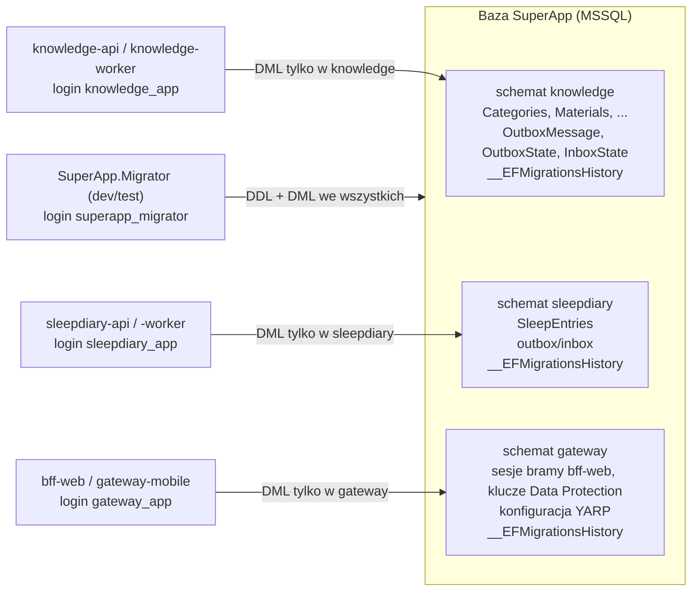
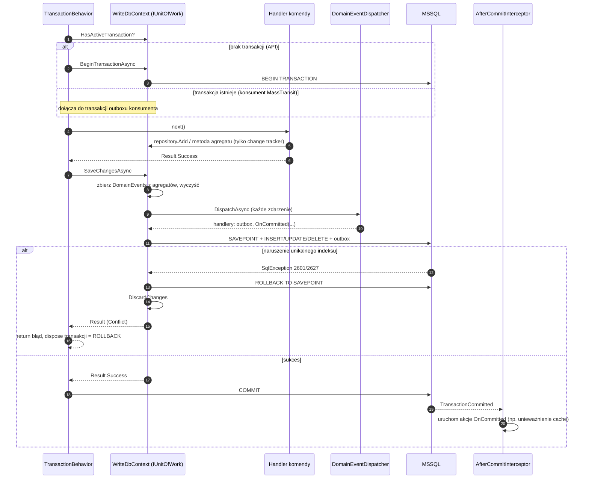
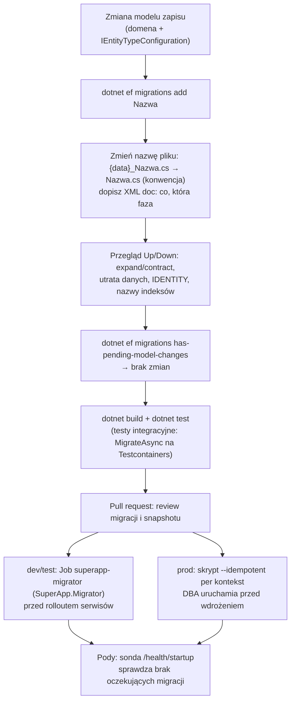

# 7. Dane i EF Core

**Czego się nauczysz:** jak serwis przechowuje dane: jedna baza i schemat per serwis, dwa konteksty EF Core (zapis i odczyt)
i co dokładnie robią ich klasy bazowe w `SuperApp.Framework`, jak pisać konfiguracje encji i repozytoria, jak działa Unit of Work
i zamiana naruszeń unikalnych indeksów na błędy `Result`, czym jest i czego nie załatwia `rowversion`, jak budować zapytania
na read modelach, jak tworzyć, przeglądać i wdrażać migracje (expand/contract, Migrator, skrypty dla DBA, sonda startowa).

**Wymagania:** [01 Start](01-start.md) (lokalne środowisko), [05 Model domeny](05-model-domeny.md) (agregaty, silne ID,
value objects), [06 Warstwa aplikacji](06-warstwa-aplikacji.md) (komendy, zapytania, `TransactionBehavior`).

> **W skrócie**
> - Jedna baza `SuperApp`, każdy serwis ma **własny schemat** (`knowledge`, `sleepdiary`, `gateway`) i własny login z uprawnieniami
>   DML tylko do niego. Nie ma zapytań, joinów ani kluczy obcych między schematami (ADR-0021).
> - **Zapis:** `{Serwis}WriteDbContext : WriteDbContextBase`: agregaty, outbox/inbox, Unit of Work, jedyny właściciel migracji.
>   **Odczyt:** `{Serwis}ReadDbContext : ReadDbContextBase`: płaskie klasy `*Row`, bez śledzenia zmian, bez zapisu, bez migracji (ADR-0003).
> - Konfiguracja EF wyłącznie w `IEntityTypeConfiguration<T>` w przestrzeni nazw kontekstu; silne ID i jednowartościowe value
>   objects mapuje konwencja, bez `HasConversion`.
> - Repozytorium: jedno na agregat, `Add`/`Remove` synchroniczne, odczyty asynchroniczne, **nigdy nie zapisuje**.
>   Zapisuje `TransactionBehavior` przez `IUnitOfWork.SaveChangesAsync`, które zwraca `Result`.
> - Wyścig na unikalnym indeksie = błąd `Conflict` (409) z mapy `UniqueConstraintErrors`, nie wyjątek.
> - Migracja: `dotnet ef migrations add` → zmiana nazwy pliku (konwencja ADR-0032) → przegląd `Up`/`Down` → `has-pending-model-changes`
>   → testy. Dev/test stosuje `SuperApp.Migrator`, prod: DBA ze skryptu idempotentnego. Serwis tylko sprawdza (sonda startowa).

W blokach kodu z repozytorium pomijamy komentarze dokumentacji XML (`///`), żeby skrócić listingi; reszta jest skopiowana
z plików bez zmian. Ścieżka pliku jest zawsze podana nad blokiem.

---

## 7.1 Jedna baza, schemat per serwis

### Jak to wygląda



Każdy serwis jest osobnym bounded contextem, więc ma własne dane. Wspólna baza jest decyzją operacyjną (jeden serwer, jeden
backup, jeden zespół DBA), a nie zaproszeniem do współdzielenia tabel. Izolację wymuszają **uprawnienia**, nie tylko
konwencja (ADR-0021).

### Bootstrap: schematy, role, użytkownicy

Schematy, role i użytkowników bazodanowych zakłada skrypt `deploy/sql/01-bootstrap.sql`, uruchamiany przez DBA przed pierwszą
migracją (lokalnie robi to kontener `db-bootstrap` z `deploy/local/db/bootstrap.sh`). Kluczowy fragment:

`deploy/sql/01-bootstrap.sql`
```sql
DECLARE @Services TABLE ([Schema] sysname PRIMARY KEY);
INSERT INTO @Services ([Schema]) VALUES
    (N'gateway'),
    (N'knowledge'),
    (N'sleepdiary');

-- ... pętla po @Services:
    IF SCHEMA_ID(@schema) IS NULL
    BEGIN
        SET @sql = N'CREATE SCHEMA ' + QUOTENAME(@schema) + N' AUTHORIZATION dbo;';
        EXEC (@sql);
    END

    IF DATABASE_PRINCIPAL_ID(@role) IS NULL
    BEGIN
        SET @sql = N'CREATE ROLE ' + QUOTENAME(@role) + N';';
        EXEC (@sql);
    END

    -- DML wyłącznie na własnym schemacie; brak dostępu do innych schematów (ADR-0021).
    SET @sql = N'GRANT SELECT, INSERT, UPDATE, DELETE, EXECUTE ON SCHEMA::' + QUOTENAME(@schema) + N' TO ' + QUOTENAME(@role) + N';';
    EXEC (@sql);
```

Wynik dla każdego wpisu z listy:

| Obiekt | Nazwa (przykład Knowledge) | Uprawnienia |
|---|---|---|
| Schemat | `knowledge` | właściciel `dbo` |
| Rola | `knowledge_role` | `SELECT, INSERT, UPDATE, DELETE, EXECUTE` na `SCHEMA::knowledge` |
| Użytkownik | `knowledge_app` (z loginu o tej samej nazwie) | członek `knowledge_role`, domyślny schemat `knowledge` |
| Użytkownik Migratora | `superapp_migrator` (tylko gdy `-v IncludeMigrator=1`, czyli dev/test) | `db_ddladmin`, `db_datareader`, `db_datawriter` |

Wnioski praktyczne:

- **Serwis nie ma uprawnień DDL.** Nawet gdyby ktoś wywołał `Database.MigrateAsync()` w API, `CREATE TABLE` się nie powiedzie.
  Migracje stosuje tylko Migrator (dev/test) albo DBA (prod), zobacz [7.10](#710-migracje).
- **Serwis nie widzi cudzych schematów.** Zapytanie `knowledge_app` do `sleepdiary.SleepEntries` kończy się błędem
  `The SELECT permission was denied on the object 'SleepEntries', database 'SuperApp', schema 'sleepdiary'.`
- Loginy serwerowe tworzy DBA (lokalnie `bootstrap.sh`); skrypt tylko wiąże je z bazą. Brak loginu skrypt zgłasza komunikatem
  `Brak loginu ...: utwórz login i uruchom skrypt ponownie.` i można go uruchomić jeszcze raz (jest idempotentny).
- Nowy serwis = jeden wiersz w `@Services` (i login u DBA). Szablon serwisu przypomina o tym ([przepis 07](przepisy/07-nowy-serwis.md)).

Drugi skrypt, `deploy/sql/02-gateway-config-permissions.sql`, odbiera roli `gateway_role` prawo zapisu do tabel konfiguracji
tras (`DENY INSERT, UPDATE, DELETE`): konfigurację YARP zmieniają wyłącznie migracje (ADR-0022).

### Granice wewnątrz schematu: bez kluczy obcych między agregatami

Zakaz kluczy obcych obowiązuje między schematami, ale w praktyce także **między agregatami w jednym schemacie**. Tabela
`knowledge.Favorites` ma kolumnę `ItemId` bez FK (wskazuje materiał albo kolekcję), `MaterialCompletions.MaterialId` też.
Klucze obce są tylko wewnątrz agregatu: `MaterialCategories → Materials`, `ContentBlocks → Materials`, `CollectionItems → Collections`.

Dlaczego: agregaty zmieniają się w osobnych transakcjach, a spójność między nimi zapewniają zdarzenia (np. archiwizacja materiału
usuwa ulubione przez zdarzenie integracyjne i komendę `RemoveFavoritesOfItem`). FK między agregatami wymuszałby kolejność
zapisów i blokowałby usunięcie jednego agregatu, dopóki nie zniknie drugi, czyli przenosiłby regułę biznesową do bazy.

| Odwołanie | Jak w bazie | Przykład |
|---|---|---|
| Część tego samego agregatu (encja, kolekcja VO) | FK z kaskadą, ładowane razem z agregatem | `MaterialCategories.MaterialId → Materials.Id` |
| Inny agregat w tym samym serwisie | sama kolumna ID (+ indeks, jeśli filtrujesz) | `CollectionItems.MaterialId`, `Favorites.ItemId` |
| Dane innego serwisu | brak: lokalna kopia z zdarzeń albo ACL | (wzorzec, [10 Zdarzenia](10-zdarzenia-i-integracja.md)) |

---

## 7.2 Dwa konteksty: zapis i odczyt

| | `WriteDbContextBase` | `ReadDbContextBase` |
|---|---|---|
| Plik | `src/Framework/SuperApp.Framework.Infrastructure/Persistence/WriteDbContextBase.cs` | `.../Persistence/ReadDbContextBase.cs` |
| Implementacja w serwisie | `KnowledgeWriteDbContext`, `SleepDiaryWriteDbContext` (`public sealed`) | `KnowledgeReadDbContext`, `SleepDiaryReadDbContext` (`public sealed`) |
| Mapuje | agregaty domenowe + encje MassTransit (inbox, outbox) | własne klasy `*Row` (płaskie, prymitywne typy) |
| Śledzenie zmian | tak (repozytoria ładują agregaty do modyfikacji) | `NoTracking` dla każdego zapytania |
| Zapis | wyłącznie `IUnitOfWork.SaveChangesAsync`; synchroniczne `SaveChanges` rzuca `NotSupportedException` | każde `SaveChanges*` rzuca `NotSupportedException` |
| Migracje | jedyny właściciel schematu i migracji | brak |
| Connection string | `ConnectionStrings:Write` | `ConnectionStrings:Read` (może wskazywać replikę z `ApplicationIntent=ReadOnly`) |
| Kto używa | repozytoria (handlery komend), handlery zdarzeń domenowych, MassTransit outbox | handlery zapytań w `Infrastructure/Features/...` |
| Konfiguracje encji | z przestrzeni nazw kontekstu: `...Persistence.Write` i podrzędnych | z `...Persistence.Read` i podrzędnych |

### Rejestracja: `AddAppPersistence`

`src/Framework/SuperApp.Framework.Infrastructure/Persistence/PersistenceServiceCollectionExtensions.cs`
```csharp
public static IServiceCollection AddAppPersistence<TWrite, TRead>(
    this IServiceCollection services,
    IConfiguration configuration,
    string schema)
    where TWrite : WriteDbContextBase
    where TRead : ReadDbContextBase
{
    services.AddScoped<IDomainEventDispatcher, DomainEventDispatcher>();

    services.AddSingleton<AfterCommitInterceptor>();
    services.AddDbContext<TWrite>((provider, options) => options
        .UseSqlServer(
            configuration.GetConnectionString("Write"),
            sql => sql.MigrationsHistoryTable("__EFMigrationsHistory", schema))
        .AddInterceptors(provider.GetRequiredService<AfterCommitInterceptor>()));

    services.AddDbContext<TRead>(options => options
        .UseSqlServer(configuration.GetConnectionString("Read"))
        .UseQueryTrackingBehavior(QueryTrackingBehavior.NoTracking));

    services.AddScoped<IUnitOfWork>(provider => provider.GetRequiredService<TWrite>());
    return services;
}
```

Co z tego wynika w czasie działania:

- Oba konteksty są **scoped**: jedna instancja na żądanie HTTP albo na wiadomość w konsumencie. `IUnitOfWork` to ta sama
  instancja co `KnowledgeWriteDbContext` w danym scope, więc repozytoria, handlery zdarzeń domenowych i MassTransit outbox
  pracują na jednym change trackerze i jednej transakcji.
- Historia migracji jest w schemacie serwisu (`knowledge.__EFMigrationsHistory`). Bez `MigrationsHistoryTable(..., schema)`
  wszystkie serwisy dzieliłyby `dbo.__EFMigrationsHistory` (ADR-0021). Ta sama opcja jest w fabryce design-time, w Migratorze
  (`MigrationOptions`) i w testach; gdyby się różniła, sonda startowa czytałaby inną tabelę historii niż Migrator.
- Kontekst odczytu ma **osobne połączenie**. Zapytanie wykonane w trakcie komendy (czego handlery nie robią) nie zobaczyłoby
  niezatwierdzonych zmian tej komendy.
- Lokalnie oba connection stringi wskazują ten sam serwer i login `knowledge_app`
  (`src/Services/Knowledge/Knowledge.Api/appsettings.Development.json`). Jeśli środowisko dostarczy replikę do odczytu,
  zmienia się tylko `ConnectionStrings:Read`; wtedy tracisz gwarancję read-your-writes (opóźnienie replikacji, ADR-0003).

Serwis woła to w swoim composition root:

`src/Services/Knowledge/Knowledge.Infrastructure/InfrastructureServiceCollectionExtensions.cs`
```csharp
public static IServiceCollection AddKnowledgeCore(this IServiceCollection services, IConfiguration configuration)
{
    services.AddAppApplication(KnowledgeApplication.Assembly, typeof(InfrastructureServiceCollectionExtensions).Assembly);

    services.AddAppPersistence<KnowledgeWriteDbContext, KnowledgeReadDbContext>(configuration, KnowledgeWriteDbContext.SchemaName);
    services.AddAppCaching(configuration, KnowledgeWriteDbContext.SchemaName);
    services.AddAppFeatureFlags(configuration);

    services.AddScoped<ICategoryRepository, CategoryRepository>();
    services.AddScoped<IMaterialRepository, MaterialRepository>();
    services.AddScoped<ICollectionRepository, CollectionRepository>();
    services.AddScoped<IFavoriteRepository, FavoriteRepository>();
    services.AddScoped<IMaterialCompletionRepository, MaterialCompletionRepository>();

    return services;
}
```

### Kontekst zapisu serwisu

`src/Services/Knowledge/Knowledge.Infrastructure/Persistence/Write/KnowledgeWriteDbContext.cs`
```csharp
public sealed class KnowledgeWriteDbContext(DbContextOptions<KnowledgeWriteDbContext> options, IDomainEventDispatcher dispatcher)
    : WriteDbContextBase(options, dispatcher)
{
    public const string SchemaName = "knowledge";

    protected override string Schema => SchemaName;

    protected override Assembly DomainAssembly => KnowledgeDomain.Assembly;

    protected override IReadOnlyDictionary<string, Error> UniqueConstraintErrors { get; } = new Dictionary<string, Error>
    {
        ["IX_Categories_Slug"] = CategoryErrors.SlugTaken,
        ["IX_Favorites_UserId_ItemType_ItemId"] = LibraryErrors.FavoriteAddedConcurrently,
        ["IX_MaterialCompletions_UserId_MaterialId"] = LibraryErrors.CompletionRecordedConcurrently,
    };
}
```

Kontekst serwisu deklaruje tylko trzy rzeczy: schemat, assembly domeny (dla konwencji ID i VO) i mapę unikalnych indeksów na
błędy. Nie ma tu `DbSet`-ów: repozytoria używają `context.Set<T>()`, a konfiguracje są wyszukiwane automatycznie.
`SchemaName` służy też jako prefiks kluczy cache i nazw kolejek (`AddAppCaching`, `AddAppMessaging`).

Co robi klasa bazowa przy budowaniu modelu:

`src/Framework/SuperApp.Framework.Infrastructure/Persistence/WriteDbContextBase.cs`
```csharp
protected override void OnModelCreating(ModelBuilder modelBuilder)
{
    modelBuilder.HasDefaultSchema(Schema);
    modelBuilder.ApplyConfigurationsFromAssembly(GetType().Assembly, IsInContextNamespace);
    modelBuilder.AddInboxStateEntity();
    modelBuilder.AddOutboxMessageEntity();
    modelBuilder.AddOutboxStateEntity();
}

protected override void ConfigureConventions(ModelConfigurationBuilder configurationBuilder) =>
    configurationBuilder.AddSingleValueObjectConversions(DomainAssembly);

private bool IsInContextNamespace(Type configurationType) =>
    configurationType.Namespace is { } ns
    && (ns == GetType().Namespace || ns.StartsWith(GetType().Namespace + ".", StringComparison.Ordinal));
```

1. `HasDefaultSchema(Schema)`: każda tabela bez jawnego schematu trafia do `knowledge`. Dlatego w konfiguracjach piszesz
   `ToTable("Categories")`, nigdy `ToTable("Categories", "knowledge")`.
2. `ApplyConfigurationsFromAssembly(..., IsInContextNamespace)`: stosuje każdą klasę `IEntityTypeConfiguration<T>` z assembly
   Infrastructure, **której przestrzeń nazw to przestrzeń kontekstu albo podrzędna**. Kontekst zapisu jest w
   `Knowledge.Infrastructure.Persistence.Write`, więc łapie `...Write.Configurations.*`; kontekst odczytu łapie
   `...Read.Configurations.*`. Bez filtra oba konteksty dostałyby wszystkie konfiguracje z assembly i kontekst odczytu
   zmapowałby agregaty (albo odwrotnie).
3. `AddInboxStateEntity` / `AddOutboxMessageEntity` / `AddOutboxStateEntity`: encje MassTransit trafiają do tego samego modelu,
   więc tabele outbox/inbox powstają w schemacie serwisu tą samą migracją co tabele domeny ([7.11](#711-outbox-i-inbox-w-schemacie-serwisu)).
4. `ConfigureConventions`: konwersje silnych ID i value objectów (niżej).

### Kontekst odczytu serwisu

`src/Services/Knowledge/Knowledge.Infrastructure/Persistence/Read/KnowledgeReadDbContext.cs`
```csharp
public sealed class KnowledgeReadDbContext(DbContextOptions<KnowledgeReadDbContext> options) : ReadDbContextBase(options)
{
    internal IQueryable<CategoryRow> Categories => Set<CategoryRow>();

    internal IQueryable<MaterialRow> Materials => Set<MaterialRow>();

    internal IQueryable<MaterialCategoryRow> MaterialCategories => Set<MaterialCategoryRow>();

    internal IQueryable<ContentBlockRow> ContentBlocks => Set<ContentBlockRow>();

    internal IQueryable<ContentTextSpanRow> ContentTextSpans => Set<ContentTextSpanRow>();

    internal IQueryable<CollectionRow> Collections => Set<CollectionRow>();

    internal IQueryable<CollectionItemRow> CollectionItems => Set<CollectionItemRow>();

    internal IQueryable<CollectionCategoryRow> CollectionCategories => Set<CollectionCategoryRow>();

    internal IQueryable<FavoriteRow> Favorites => Set<FavoriteRow>();

    internal IQueryable<MaterialCompletionRow> MaterialCompletions => Set<MaterialCompletionRow>();

    protected override string Schema => KnowledgeWriteDbContext.SchemaName;

    protected override Assembly DomainAssembly => KnowledgeDomain.Assembly;
}
```

- Właściwości są `internal IQueryable<T>`, nie `DbSet<T>`: nie da się przez nie nic dodać, a widzą je tylko handlery zapytań
  w tym samym assembly.
- `Schema` bierze stałą z kontekstu zapisu: oba konteksty pracują na tych samych tabelach.

Klasa bazowa wyłącza śledzenie dwa razy (w opcjach z `AddAppPersistence` i w konstruktorze), więc działa to też, gdy kontekst
tworzysz ręcznie, np. w teście:

`src/Framework/SuperApp.Framework.Infrastructure/Persistence/ReadDbContextBase.cs`
```csharp
protected ReadDbContextBase(DbContextOptions options)
    : base(options) => ChangeTracker.QueryTrackingBehavior = QueryTrackingBehavior.NoTracking;

public override int SaveChanges() => throw ReadOnly();

public override int SaveChanges(bool acceptAllChangesOnSuccess) => throw ReadOnly();

public override Task<int> SaveChangesAsync(bool acceptAllChangesOnSuccess, CancellationToken cancellationToken = default) =>
    throw ReadOnly();

protected override void OnModelCreating(ModelBuilder modelBuilder)
{
    modelBuilder.HasDefaultSchema(Schema);
    modelBuilder.ApplyConfigurationsFromAssembly(GetType().Assembly, IsInContextNamespace);
}

private static NotSupportedException ReadOnly() => new("ReadDbContext służy wyłącznie do odczytu (ADR-0003).");
```

Dlaczego `NoTracking`: zapytanie zwraca dane do serializacji, nikt ich nie modyfikuje. Bez śledzenia EF nie tworzy migawek
encji ani nie rozwiązuje tożsamości, co przy listach oznacza mniej pamięci i CPU.

### Konwencja silnych ID i value objectów

`src/Framework/SuperApp.Framework.Infrastructure/Persistence/Conventions/SingleValueObjectConventions.cs`
```csharp
public static class SingleValueObjectConventions
{
    public static void AddSingleValueObjectConversions(this ModelConfigurationBuilder builder, params Assembly[] assemblies)
    {
        foreach (var (type, valueType) in SingleValueObjectTypes.Find(assemblies))
        {
            var converter = typeof(SingleValueObjectValueConverter<,>).MakeGenericType(type, valueType);
            builder.Properties(type).HaveConversion(converter);
        }
    }
}
```

`src/Framework/SuperApp.Framework.Infrastructure/Persistence/Conventions/SingleValueObjectValueConverter{TSelf,TValue}.cs`
```csharp
internal sealed class SingleValueObjectValueConverter<TSelf, TValue>()
    : ValueConverter<TSelf, TValue>(
        valueObject => valueObject.Value,
        value => SingleValueObjectFactory<TSelf, TValue>.FromTrusted(value))
    where TSelf : struct, ISingleValueObject<TSelf, TValue>
    where TValue : notnull;
```

`SingleValueObjectTypes.Find` przegląda assembly domeny i wybiera każdy **struct** implementujący
`ISingleValueObject<TSelf, TValue>` (silne ID implementują go przez `IStronglyTypedId<TSelf, TValue>`). Skutek:

| Typ w domenie | Kolumna | Odczyt z bazy |
|---|---|---|
| `CategoryId` (`Guid`) | `uniqueidentifier` | `CategoryId.FromTrusted(guid)` |
| `UserId` (`string`) | `nvarchar(...)`: długość **musisz** podać `HasMaxLength(UserId.MaxLength)` | `UserId.FromTrusted(value)` |
| `SleepQuality` (`int`) | `int` | `SleepQuality.FromTrusted(value)` |

- Odczyt używa `FromTrusted`, bo wartość w bazie była zwalidowana przy zapisie. Test architektury pilnuje, że `FromTrusted`
  wołają tylko Infrastructure i sama domena; Application, Api i Worker muszą używać `Create`.
- Porównania w LINQ działają na typach domenowych: `completion.UserId == userId` tłumaczy się na `WHERE [UserId] = @p`.
- Konwencja obejmuje tylko assembly domeny serwisu. Wielowartościowe value objects (`sealed record`) mapuje się jawnie
  przez `ComplexProperty` (ADR-0024); w obecnym kodzie nie ma jeszcze takiego przypadku, więc pierwszy będzie wzorcem.

**Źle:** ręczna konwersja (dubluje konwencję i przy każdej zmianie value objectu trzeba pamiętać o drugim miejscu):

```csharp
builder.Property(entry => entry.Quality).HasConversion(quality => quality.Value, value => SleepQuality.FromTrusted(value));
```

**Dobrze:** nic nie piszesz; konfigurujesz tylko to, czego konwencja nie wie (długość, typ kolumny, indeks):

```csharp
builder.Property(entry => entry.UserId).HasMaxLength(UserId.MaxLength);
```

### Fabryka design-time

Narzędzie `dotnet ef` musi utworzyć kontekst bez uruchamiania API. Robi to fabryka w Infrastructure:

`src/Services/Knowledge/Knowledge.Infrastructure/Persistence/Write/DesignTimeWriteDbContextFactory.cs`
```csharp
internal sealed class DesignTimeWriteDbContextFactory : IDesignTimeDbContextFactory<KnowledgeWriteDbContext>
{
    public KnowledgeWriteDbContext CreateDbContext(string[] args)
    {
        var options = new DbContextOptionsBuilder<KnowledgeWriteDbContext>()
            .UseSqlServer(
                "Server=design-time;Database=SuperApp;Integrated Security=true",
                sql => sql.MigrationsHistoryTable("__EFMigrationsHistory", KnowledgeWriteDbContext.SchemaName))
            .Options;

        return new KnowledgeWriteDbContext(options, DesignTimeDomainEventDispatcher.Instance);
    }
}
```

Connection string jest fikcyjny celowo: `migrations add` potrzebuje tylko modelu. Polecenia, które łączą się z bazą
(`migrations list`, `database update`), dostają połączenie jawnie (`--connection`), a `database update` na wspólnych
środowiskach nie jest używane w ogóle. `DesignTimeDomainEventDispatcher` rzuca wyjątek przy próbie dispatchu: w czasie
projektowania nic nie powinno zapisywać agregatów. Dlatego projekt Infrastructure referuje `Microsoft.EntityFrameworkCore.Design`
(`PrivateAssets="all"`), a `-p` i `-s` w poleceniach wskazują ten sam projekt.

---

## 7.3 Konfiguracja strony zapisu

### Reguły

- Jedna klasa `internal sealed class {Encja}Configuration : IEntityTypeConfiguration<{Encja}>` na agregat, w
  `{Serwis}.Infrastructure/Persistence/Write/Configurations/`. Encje i kolekcje należące do agregatu konfigurujesz w tej samej
  klasie (`OwnsMany`) albo w osobnej, jeśli są pełnymi encjami (`ContentBlockConfiguration`).
- **Żadnych atrybutów EF w Domain** (`[Key]`, `[MaxLength]`, `[Table]`): domena nie zna EF (test architektury, ADR-0002).
- Długości i zakresy biorą się ze **stałych domeny** (`Category.MaxNameLength`, `SleepQuality.Max`), nie z liczb wpisanych ręcznie.
  Zmiana limitu w domenie wtedy automatycznie zmienia model i `has-pending-model-changes` wymusi migrację.
- `Id` z `ValueGeneratedNever()`: ID tworzy domena (`CategoryId.New()` = `Guid.CreateVersion7()`), baza go nie generuje.
- `builder.Ignore(x => x.DomainEvents)`: zdarzenia nie są kolumną.
- Agregat modyfikowany po utworzeniu dostaje `rowversion` (`Property<byte[]>("Version").IsRowVersion()`), chyba że brak jest
  świadomie uzasadniony w dokumentacji konfiguracji (przykład: `MaterialRatingConfiguration` z [samouczka](16-samouczek-pelna-funkcja.md)), zobacz [7.7](#77-współbieżność-optymistyczna-rowversion).
- Reguły domeny, które da się wyrazić w SQL, powtarzasz jako `CHECK` (ostatnia linia obrony przed ręcznym SQL i błędem w kodzie).

### Najprostszy przypadek: `CategoryConfiguration`

`src/Services/Knowledge/Knowledge.Infrastructure/Persistence/Write/Configurations/CategoryConfiguration.cs`
```csharp
internal sealed class CategoryConfiguration : IEntityTypeConfiguration<Category>
{
    public void Configure(EntityTypeBuilder<Category> builder)
    {
        builder.ToTable("Categories");
        builder.HasKey(category => category.Id);
        builder.Property(category => category.Id).ValueGeneratedNever();
        builder.Property(category => category.Name).HasMaxLength(Category.MaxNameLength);
        builder.Property(category => category.Slug).HasMaxLength(Category.MaxSlugLength);
        builder.HasIndex(category => category.Slug).IsUnique();
        builder.Property<byte[]>("Version").IsRowVersion();
        builder.Ignore(category => category.DomainEvents);
    }
}
```

Wynikowa tabela (z migracji `Initial`): `Id uniqueidentifier`, `Name nvarchar(100)`, `Slug nvarchar(100)`,
`Version rowversion`, `PK_Categories`, unikalny `IX_Categories_Slug`. `Version` to **shadow property**: nie ma jej w klasie
`Category`, istnieje tylko w modelu EF. Domena nie wie o mechanizmie współbieżności.

EF materializuje agregat przez **prywatny konstruktor** `private Category(CategoryId id)` i prywatne settery (`{ get; private set; }`).
Nie dodawaj publicznego konstruktora bezparametrowego „dla EF”.

### Agregat z kolekcjami: `MaterialConfiguration`

`src/Services/Knowledge/Knowledge.Infrastructure/Persistence/Write/Configurations/MaterialConfiguration.cs`
```csharp
internal sealed class MaterialConfiguration : IEntityTypeConfiguration<Material>
{
    public void Configure(EntityTypeBuilder<Material> builder)
    {
        builder.ToTable("Materials", table =>
        {
            table.HasCheckConstraint("CK_Materials_MainMediaUrl", "[MainMediaUrl] IS NULL OR [MainMediaUrl] LIKE 'https://%'");
            table.HasCheckConstraint("CK_Materials_ReadingTime", "[ReadingTimeMinutes] >= 0");
        });
        builder.HasKey(material => material.Id);
        builder.Property(material => material.Id).ValueGeneratedNever();
        builder.Property(material => material.Type).HasConversion<string>().HasMaxLength(20);
        builder.Property(material => material.Status).HasConversion<string>().HasMaxLength(20);
        builder.Property(material => material.Title).HasMaxLength(Material.MaxTitleLength);
        builder.Property(material => material.Description).HasMaxLength(Material.MaxDescriptionLength);
        builder.Property(material => material.MainMediaUrl).HasMaxLength(WebUrl.MaxLength);
        builder.Property<byte[]>("Version").IsRowVersion();
        builder.HasIndex(material => new { material.Status, material.PublishedAt });
        builder.Ignore(material => material.DomainEvents);

        builder.OwnsMany(material => material.Categories, categories =>
        {
            categories.ToTable("MaterialCategories");
            categories.WithOwner().HasForeignKey("MaterialId");
            categories.HasKey("MaterialId", nameof(MaterialCategory.CategoryId));
            categories.HasIndex(category => category.CategoryId);
        });

        builder.HasMany(material => material.Blocks)
            .WithOne()
            .HasForeignKey("MaterialId")
            .OnDelete(DeleteBehavior.Cascade);
    }
}
```

Na co zwrócić uwagę:

- **Enumy jako tekst** (`HasConversion<string>().HasMaxLength(20)`): w bazie jest `Published`, nie `1`. Czytelne w SQL, odporne
  na zmianę kolejności wartości enuma. Konsekwencja: zmiana nazwy wartości enuma to migracja danych (`UPDATE ... SET Status = ...`).
  Read modele porównują tekst: `material.Status == nameof(PublicationStatus.Published)`.
- **`OwnsMany`** dla kolekcji value objectów (`MaterialCategory` to tylko `CategoryId`): osobna tabela, klucz złożony
  (właściciel + wartość), FK z kaskadą do właściciela, ładowanie zawsze razem z agregatem (owned types są dołączane
  automatycznie, bez `Include`). Agregat trzyma je w prywatnym polu `_categories` i wystawia `IReadOnlyList<T>`; EF zapisuje
  i odczytuje pole przez backing field.
- **`HasMany(...).WithOne()`** dla encji agregatu z własną tożsamością (`ContentBlock` ma `BlockId`, drzewo rodzic-dziecko).
  Klucz obcy `MaterialId` jest shadow property: `ContentBlock` w domenie go nie ma.
- **Brak FK do `Categories`**: `MaterialCategories.CategoryId` wskazuje inny agregat, ma tylko indeks (filtrowanie listy po kategorii).
- **Indeks `(Status, PublishedAt)`** istnieje, bo lista dla czytelników filtruje po statusie i sortuje po dacie publikacji.

### Pozycje w kolekcjach: `ValueGeneratedNever` i historia jednego błędu

`src/Services/Knowledge/Knowledge.Infrastructure/Persistence/Write/Configurations/CollectionConfiguration.cs`
```csharp
internal sealed class CollectionConfiguration : IEntityTypeConfiguration<Collection>
{
    public void Configure(EntityTypeBuilder<Collection> builder)
    {
        builder.ToTable("Collections");
        builder.HasKey(collection => collection.Id);
        builder.Property(collection => collection.Id).ValueGeneratedNever();
        builder.Property(collection => collection.Status).HasConversion<string>().HasMaxLength(20);
        builder.Property(collection => collection.Title).HasMaxLength(Collection.MaxTitleLength);
        builder.Property(collection => collection.Description).HasMaxLength(Collection.MaxDescriptionLength);
        builder.Property<byte[]>("Version").IsRowVersion();
        builder.HasIndex(collection => new { collection.Status, collection.PublishedAt });
        builder.Ignore(collection => collection.DomainEvents);

        builder.OwnsMany(collection => collection.Items, items =>
        {
            items.ToTable("CollectionItems", table => table.HasCheckConstraint("CK_CollectionItems_Position", "[Position] >= 0"));
            items.WithOwner().HasForeignKey("CollectionId");
            items.HasKey("CollectionId", nameof(CollectionItem.Position));

            // The position is assigned by the aggregate (0..n-1). Without this, EF Core treats the int part of an owned collection key as
            // store generated (an IDENTITY column): a new item at position 0 got a temporary key and every other new item was taken for an
            // existing row and updated, which failed with a concurrency exception.
            items.Property(item => item.Position).ValueGeneratedNever();
            items.HasIndex(item => item.MaterialId);
        });

        builder.OwnsMany(collection => collection.Categories, categories =>
        {
            categories.ToTable("CollectionCategories");
            categories.WithOwner().HasForeignKey("CollectionId");
            categories.HasKey("CollectionId", nameof(CollectionCategory.CategoryId));
            categories.HasIndex(category => category.CategoryId);
        });
    }
}
```

Komentarz w kodzie opisuje prawdziwy błąd z pierwszej wersji. Konwencja EF Core: **część klucza typu `int` w kolekcji owned
jest generowana przez bazę** (`IDENTITY`). Pozycje 0..n-1 nadaje jednak agregat. Skutek: pierwszy element (pozycja 0 = wartość
domyślna `int`) dostawał klucz tymczasowy i był wstawiany, każdy następny wyglądał dla EF jak istniejący wiersz i szedł jako
`UPDATE`, który nie trafiał w żaden wiersz, więc kończył się `DbUpdateConcurrencyException`. Kolekcja z jednym elementem
działała, z dwoma już nie. To samo dotyczyło `ContentTextSpans.Position` w `ContentBlockConfiguration`.

Naprawa ma dwie części: `ValueGeneratedNever()` w konfiguracji i migrację `FixOwnedPositionKeys`, która przebudowała kolumny
(opis w [7.10](#expandcontract-na-prawdziwych-przykładach)). Regułę zapamiętaj tak:

**Źle** (klucz z pozycją bez jawnego ustawienia):

```csharp
items.HasKey("CollectionId", nameof(CollectionItem.Position));
```

**Dobrze:**

```csharp
items.HasKey("CollectionId", nameof(CollectionItem.Position));
items.Property(item => item.Position).ValueGeneratedNever();
```

Kontrola: w wygenerowanej migracji kolumna klucza z wartościami z domeny **nie może** mieć `.Annotation("SqlServer:Identity", "1, 1")`.

### Ograniczenia `CHECK` i typy kolumn: `SleepEntryConfiguration`

`src/Services/SleepDiary/SleepDiary.Infrastructure/Persistence/Write/Configurations/SleepEntryConfiguration.cs`
```csharp
internal sealed class SleepEntryConfiguration : IEntityTypeConfiguration<SleepEntry>
{
    internal const string UserDateIndexName = "IX_SleepEntries_UserId_Date";

    public void Configure(EntityTypeBuilder<SleepEntry> builder)
    {
        builder.ToTable("SleepEntries", table =>
        {
            table.HasCheckConstraint("CK_SleepEntries_WakeAfterBed", "[WakeTime] > [BedTime]");
            table.HasCheckConstraint("CK_SleepEntries_Quality", $"[Quality] BETWEEN {SleepQuality.Min} AND {SleepQuality.Max}");
            table.HasCheckConstraint("CK_SleepEntries_Awakenings", $"[Awakenings] BETWEEN 0 AND {SleepEntry.MaxAwakenings}");
            table.HasCheckConstraint("CK_SleepEntries_Latency", "[SleepLatencyMinutes] >= 0 AND [SleepLatencyMinutes] <= [TimeInBedMinutes]");
        });
        builder.HasKey(entry => entry.Id);
        builder.Property(entry => entry.Id).ValueGeneratedNever();
        builder.Property(entry => entry.UserId).HasMaxLength(UserId.MaxLength);
        builder.Property(entry => entry.BedTime).HasColumnType("datetime2(0)");
        builder.Property(entry => entry.WakeTime).HasColumnType("datetime2(0)");
        builder.Property(entry => entry.Notes).HasMaxLength(SleepEntry.MaxNotesLength);
        builder.Property<byte[]>("Version").IsRowVersion();
        builder.HasIndex(entry => new { entry.UserId, entry.Date }).IsUnique().HasDatabaseName(UserDateIndexName);
        builder.Ignore(entry => entry.DomainEvents);
    }
}
```

- `CHECK` z interpolacją stałych domeny (`SleepQuality.Min`, `SleepEntry.MaxAwakenings`): w migracji ląduje już wyliczony
  tekst (`[Quality] BETWEEN 1 AND 5`). Zmiana stałej zmienia tekst ograniczenia, czyli wymaga migracji (drop + add constraint).
- Nazwy ograniczeń `CK_{Tabela}_{Reguła}`: nazwa trafia do komunikatu błędu SQL, więc ma mówić, co zostało złamane.
- Kolumny nullable w `CHECK`: porównanie z `NULL` daje „unknown”, a `CHECK` przepuszcza „unknown”. Dlatego
  `ContentBlockConfiguration` pisze warunki z jawnym `IS NOT NULL`, np. `"[Type] <> 'Heading' OR ([Level] IS NOT NULL AND [Level] BETWEEN 1 AND 4 AND [PlainText] IS NOT NULL)"`.
- `datetime2(0)`: czas lokalny użytkownika bez strefy, z dokładnością do sekundy (ADR-0029). Domyślnie EF dałby `datetime2(7)`.
- **Jawna nazwa unikalnego indeksu** przez stałą: ta sama stała jest kluczem w `UniqueConstraintErrors`, więc nazwa nie może
  się rozjechać bez błędu kompilacji ([7.6](#76-unikalność-i-wyścigi)).

### Decyzje przy mapowaniu

| Sytuacja | Wybór | Przykład |
|---|---|---|
| Jednowartościowy VO / silne ID | nic (konwencja); ewentualnie `HasMaxLength`, `HasColumnType` | `UserId`, `SleepQuality` |
| Wielowartościowy VO pojedynczy | `ComplexProperty` (kolumny w tabeli właściciela) | brak w kodzie, wzorzec z ADR-0024 |
| Kolekcja VO | `OwnsMany` + osobna tabela + klucz złożony | `MaterialCategories`, `CollectionItems` |
| Encja agregatu z własnym ID | `HasMany().WithOne().HasForeignKey("...")` z kaskadą | `ContentBlocks` |
| Odwołanie do innego agregatu | sama kolumna ID, bez nawigacji i FK, indeks jeśli filtrujesz | `Favorites.ItemId` |
| Enum | `HasConversion<string>().HasMaxLength(n)` | `Material.Status` |
| Flagi (`[Flags]`) | `int` (domyślnie) | `ContentTextSpans.Marks` |
| Reguła wyrażalna w SQL | `HasCheckConstraint("CK_...")` | `CK_SleepEntries_Quality` |
| Unikalność (reguła biznesowa) | `HasIndex(...).IsUnique()` + wpis w `UniqueConstraintErrors` | `IX_Categories_Slug` |

---

## 7.4 Repozytoria

### Reguły

- **Jedno repozytorium na agregat**, interfejs w Domain (`ICategoryRepository`), implementacja `internal sealed` w
  `{Serwis}.Infrastructure/Persistence/Write/Repositories/`, rejestracja `AddScoped` w `Add{Serwis}Core`.
- Bez generycznego `IRepository<T>` i bez `IQueryable` na zewnątrz: interfejs mówi językiem domeny, co komendy potrzebują
  (`SlugExistsAsync`, `IsPublishedAsync`), i nic więcej.
- **`Add` i `Remove` są synchroniczne** (`void`): tylko zmieniają stan w change trackerze, nie wykonują I/O. `AddAsync` w EF
  istnieje dla generatorów wartości wymagających bazy (HiLo), których tu nie ma; jego użycie tylko sugerowałoby zapis.
- **Odczyty są asynchroniczne** z `CancellationToken`.
- Repozytorium **nigdy nie zapisuje**. Zapisuje `TransactionBehavior` ([7.5](#75-unit-of-work-savechangesasync-zwraca-result)).
- Agregat ładuj w całości (z kolekcjami), bo metoda agregatu może potrzebować każdej jego części do sprawdzenia niezmienników.
  Sprawdzenia istnienia (`AnyAsync`, `CountAsync`) nie ładują agregatów.

### `CategoryRepository`: odczyt, istnienie, deduplikacja

`src/Services/Knowledge/Knowledge.Infrastructure/Persistence/Write/Repositories/CategoryRepository.cs`
```csharp
internal sealed class CategoryRepository(KnowledgeWriteDbContext context) : ICategoryRepository
{
    public Task<Category?> GetAsync(CategoryId id, CancellationToken cancellationToken) =>
        context.Set<Category>().FirstOrDefaultAsync(category => category.Id == id, cancellationToken);

    public Task<bool> SlugExistsAsync(string slug, CancellationToken cancellationToken) =>
        context.Set<Category>().AnyAsync(category => category.Slug == slug, cancellationToken);

    public async Task<bool> AllExistAsync(IReadOnlyCollection<CategoryId> ids, CancellationToken cancellationToken)
    {
        var distinctIds = ids.Distinct().ToList();
        return distinctIds.Count == 0
            || await context.Set<Category>().CountAsync(category => distinctIds.Contains(category.Id), cancellationToken) == distinctIds.Count;
    }

    public void Add(Category category) => context.Add(category);
}
```

`AllExistAsync` porównuje liczbę znalezionych wierszy z liczbą **różnych** identyfikatorów. Bez `Distinct()` żądanie
`[A, A]` z istniejącą kategorią A dałoby `COUNT = 1` przy `ids.Count = 2`, czyli fałszywe „nie wszystkie istnieją”. Test
`ExistenceCheckTests` w `Knowledge.IntegrationTests` sprawdza dokładnie ten przypadek. Ta sama logika jest w
`MaterialRepository.AllExistAsync`.

### `MaterialRepository`: pełny agregat i `AsSplitQuery`

`src/Services/Knowledge/Knowledge.Infrastructure/Persistence/Write/Repositories/MaterialRepository.cs`
```csharp
internal sealed class MaterialRepository(KnowledgeWriteDbContext context) : IMaterialRepository
{
    public Task<Material?> GetAsync(MaterialId id, CancellationToken cancellationToken) =>
        context.Set<Material>()
            .Include(material => material.Blocks)
            .AsSplitQuery()
            .FirstOrDefaultAsync(material => material.Id == id, cancellationToken);

    public async Task<bool> AllExistAsync(IReadOnlyCollection<MaterialId> ids, CancellationToken cancellationToken)
    {
        var distinctIds = ids.Distinct().ToList();
        return distinctIds.Count == 0
            || await context.Set<Material>().CountAsync(material => distinctIds.Contains(material.Id), cancellationToken) == distinctIds.Count;
    }

    public Task<bool> IsPublishedAsync(MaterialId id, CancellationToken cancellationToken) =>
        context.Set<Material>().AnyAsync(material => material.Id == id && material.Status == PublicationStatus.Published, cancellationToken);

    public void Add(Material material) => context.Add(material);
}
```

Materiał ma kategorie (owned, dołączane automatycznie), bloki (`Include`) i spany bloków (owned bloków). Jedno zapytanie z
`JOIN`-ami zwróciłoby iloczyn kartezjański: materiał × kategorie × bloki × spany. `AsSplitQuery()` wysyła osobne zapytanie
na każdą kolekcję i składa wynik w pamięci. Jest potrzebne, bo `ReplaceContent` podmienia całą treść: agregat musi znać
wszystkie bloki, żeby EF mógł je usunąć. To jedyne użycie `AsSplitQuery` w repozytorium; przy agregatach bez wielu kolekcji
nie jest potrzebne.

### `FavoriteRepository`: wyjątek `ExecuteDeleteAsync`

`src/Services/Knowledge/Knowledge.Infrastructure/Persistence/Write/Repositories/FavoriteRepository.cs`
```csharp
internal sealed class FavoriteRepository(KnowledgeWriteDbContext context) : IFavoriteRepository
{
    public Task<Favorite?> FindAsync(UserId userId, FavoriteItemType itemType, Guid itemId, CancellationToken cancellationToken) =>
        context.Set<Favorite>().FirstOrDefaultAsync(
            favorite => favorite.UserId == userId && favorite.ItemType == itemType && favorite.ItemId == itemId,
            cancellationToken);

    public void Add(Favorite favorite) => context.Add(favorite);

    public void Remove(Favorite favorite) => context.Remove(favorite);

    public Task<int> RemoveAllForItemAsync(FavoriteItemType itemType, Guid itemId, CancellationToken cancellationToken) =>
        context.Set<Favorite>()
            .Where(favorite => favorite.ItemType == itemType && favorite.ItemId == itemId)
            .ExecuteDeleteAsync(cancellationToken);
}
```

`RemoveAllForItemAsync` jest świadomym wyjątkiem od reguły „repozytorium nie zapisuje”. Po archiwizacji materiału trzeba usunąć
ulubione wszystkich użytkowników; ładowanie tysięcy agregatów `Favorite` tylko po to, żeby je usunąć, byłoby kosztowne.
`ExecuteDeleteAsync` wysyła od razu jedno `DELETE ... WHERE`. Konsekwencje, które musisz znać, zanim użyjesz tego wzorca:

| Cecha | Skutek |
|---|---|
| Wykonuje się **natychmiast**, nie w `SaveChangesAsync` | działa wewnątrz transakcji otwartej przez `TransactionBehavior` (albo outbox konsumenta), więc błąd komendy dalej wycofuje usunięcie |
| Omija change tracker | encje tego typu już załadowane w scope nie wiedzą, że zniknęły; nie mieszaj z `FindAsync`/`Remove` w tej samej komendzie |
| Omija agregat | żadnej logiki domenowej i **żadnych zdarzeń domenowych**; używaj tylko dla operacji, które nie mają reguł ani reakcji |
| Omija `rowversion` | nie wykrywa współbieżnych zmian usuwanych wierszy |

Jeśli usunięcie ma regułę biznesową albo ktoś reaguje na nie zdarzeniem, ładuj agregaty i wołaj ich metody.

### Źle / Dobrze

**Źle:** repozytorium zapisuje samo.

```csharp
public async Task AddAsync(Category category, CancellationToken cancellationToken)
{
    context.Add(category);
    await context.SaveChangesAsync(cancellationToken);   // zapis poza transakcją komendy
}
```

Co się psuje: zapis dzieje się w środku handlera, przed jego końcem. Jeśli handler potem zwróci błąd, kategoria już jest
w bazie (komenda przestaje być atomowa). Zdarzenia domenowe są dispatchowane dwa razy (tu i w `TransactionBehavior`),
a naruszenie unikalnego indeksu wychodzi jako wyjątek (HTTP 500), bo omija mapowanie z `IUnitOfWork.SaveChangesAsync`.

**Dobrze:** `public void Add(Category category) => context.Add(category);`

**Źle:** repozytorium wystawia `IQueryable` albo jest generyczne.

```csharp
public interface IRepository<T> { IQueryable<T> Query(); void Add(T entity); }
```

Co się psuje: handlery komend zaczynają budować zapytania (logika odczytu w Application, która nie może znać EF), a kontrakt
repozytorium przestaje mówić, czego domena potrzebuje. Odczyty dla ekranów idą przez kontekst odczytu, nie przez repozytorium.

**Dobrze:** metody nazwane po potrzebie domeny: `Task<bool> SlugExistsAsync(string slug, CancellationToken cancellationToken)`.

---

## 7.5 Unit of Work: `SaveChangesAsync` zwraca `Result`

### Przepływ w czasie działania



### Kod: behavior i Unit of Work

`src/Framework/SuperApp.Framework.Application/Behaviors/TransactionBehavior{TRequest,TResponse}.cs`
```csharp
internal sealed class TransactionBehavior<TRequest, TResponse>(IUnitOfWork unitOfWork)
    : IPipelineBehavior<TRequest, TResponse>
    where TRequest : ICommand<TResponse>
    where TResponse : IResultFactory<TResponse>
{
    public async Task<TResponse> Handle(TRequest request, RequestHandlerDelegate<TResponse> next, CancellationToken cancellationToken)
    {
        if (unitOfWork.HasActiveTransaction)
        {
            var nested = await next();
            if (!IsSuccess(nested))
            {
                unitOfWork.DiscardChanges();
                return nested;
            }

            var savedNested = await unitOfWork.SaveChangesAsync(cancellationToken);
            return savedNested.IsSuccess ? nested : TResponse.FromError(savedNested.Error);
        }

        await using var transaction = await unitOfWork.BeginTransactionAsync(cancellationToken);
        var response = await next();
        if (!IsSuccess(response))
        {
            return response;
        }

        var saved = await unitOfWork.SaveChangesAsync(cancellationToken);
        if (saved.IsFailure)
        {
            return TResponse.FromError(saved.Error);
        }

        await transaction.CommitAsync(cancellationToken);
        return response;
    }

    private static bool IsSuccess(TResponse response) => response is Result { IsSuccess: true };
}
```

`src/Framework/SuperApp.Framework.Infrastructure/Persistence/WriteDbContextBase.cs` (fragmenty)
```csharp
async Task<Result> IUnitOfWork.SaveChangesAsync(CancellationToken cancellationToken)
{
    try
    {
        await SaveChangesAsync(cancellationToken);
        return Result.Success();
    }
    catch (DbUpdateConcurrencyException) when (_ownTransaction is not null)
    {
        DiscardChanges();
        return ConcurrencyConflict;     // persistence.concurrency_conflict, 409
    }
    catch (DbUpdateException exception) when (UniqueConstraintViolation.TryGetName(exception, out var name))
    {
        DiscardChanges();
        return UniqueConstraintErrors.TryGetValue(name, out var error)
            ? error
            : Error.Conflict("persistence.duplicate", "Zasób o podanych danych już istnieje.");
    }
}

public override async Task<int> SaveChangesAsync(bool acceptAllChangesOnSuccess, CancellationToken cancellationToken = default)
{
    var aggregates = ChangeTracker.Entries<IAggregateRoot>()
        .Select(entry => entry.Entity)
        .Where(aggregate => aggregate.DomainEvents.Count > 0)
        .ToList();

    var domainEvents = aggregates.SelectMany(aggregate => aggregate.DomainEvents).ToList();
    aggregates.ForEach(aggregate => aggregate.ClearDomainEvents());

    foreach (var domainEvent in domainEvents)
    {
        await dispatcher.DispatchAsync(domainEvent, cancellationToken);
    }

    return await base.SaveChangesAsync(acceptAllChangesOnSuccess, cancellationToken);
}

public override int SaveChanges() => throw SynchronousSaveNotSupported();

public override int SaveChanges(bool acceptAllChangesOnSuccess) => throw SynchronousSaveNotSupported();
```

Najważniejsze konsekwencje:

1. **Handler nie zapisuje.** Kończy się na `repository.Add(...)` albo na wywołaniu metody agregatu. Gdy handler zwróci błąd,
   `TransactionBehavior` w ogóle nie woła `SaveChangesAsync`, a `await using` wycofuje transakcję: błędny wynik nigdy nie
   zostawia częściowych zmian.
2. **Zdarzenia domenowe przed zapisem, w tej samej transakcji.** Handlery zdarzeń dopisują wiadomości do outboxu
   (encje MassTransit w tym samym change trackerze) albo rejestrują `OnCommitted`. Jeden `base.SaveChangesAsync` zapisuje
   agregat i outbox atomowo (ADR-0027).
3. **Jeden przebieg dispatchu.** Zdarzenia zgłoszone przez handler zdarzenia w trakcie dispatchu nie są już dispatchowane w tym
   zapisie. Handlery zdarzeń nie modyfikują innych agregatów (ADR-0027).
4. **Synchroniczne `SaveChanges` rzuca** (pominęłoby asynchroniczny dispatch); dodatkowo analizator APP003 zgłasza błąd
   kompilacji przy każdym wywołaniu `DbContext.SaveChanges`.
5. **Wyjątek techniczny** (utrata połączenia, `CHECK`) nie jest zamieniany na `Result`. Leci dalej, w API kończy się
   odpowiedzią 500 (ProblemDetails z `UseExceptionHandler`), w konsumencie uruchamia retry MassTransit. Konflikt współbieżności
   (`rowversion`) jest wyjątkiem tylko w konsumencie; w API to 409 `persistence.concurrency_conflict` ([7.7](#77-współbieżność-optymistyczna-rowversion)).

---

## 7.6 Unikalność i wyścigi

### Wzorzec: sprawdzenie w handlerze + unikalny indeks + mapowanie błędu

`src/Services/Knowledge/Knowledge.Application/Features/Categories/CreateCategory/CreateCategoryHandler.cs`
```csharp
internal sealed class CreateCategoryHandler(ICategoryRepository categories) : ICommandHandler<CreateCategory, Result<Guid>>
{
    public async Task<Result<Guid>> Handle(CreateCategory command, CancellationToken cancellationToken)
    {
        if (await categories.SlugExistsAsync(command.Slug, cancellationToken))
        {
            return CategoryErrors.SlugTaken;
        }

        if (!Category.Create(command.Name, command.Slug).TryGetValue(out var category, out var error))
        {
            return error;
        }

        categories.Add(category);
        return category.Id.Value;
    }
}
```

Sprawdzenie `SlugExistsAsync` i `INSERT` nie są atomowe. Dwa równoległe żądania z tym samym slugiem mogą oba przejść
sprawdzenie; rozstrzyga wtedy unikalny indeks `IX_Categories_Slug`. Bez mapowania przegrany dostałby `DbUpdateException`,
czyli HTTP 500, mimo że to oczekiwany wynik („slug zajęty”). Z mapowaniem dostaje dokładnie ten sam błąd co przy
sekwencyjnym duplikacie.

Rozpoznanie naruszenia:

`src/Framework/SuperApp.Framework.Infrastructure/Persistence/UniqueConstraintViolation.cs`
```csharp
internal static partial class UniqueConstraintViolation
{
    private const int DuplicateKeyInUniqueIndex = 2601;
    private const int UniqueConstraintViolated = 2627;

    public static bool TryGetName(DbUpdateException exception, [NotNullWhen(true)] out string? name)
    {
        name = null;
        if (exception.InnerException is not SqlException sql)
        {
            return false;
        }

        var match = sql.Number switch
        {
            DuplicateKeyInUniqueIndex => UniqueIndexName().Match(sql.Message),
            UniqueConstraintViolated => ConstraintName().Match(sql.Message),
            _ => null,
        };

        if (match is not { Success: true })
        {
            return false;
        }

        name = match.Groups["name"].Value;
        return true;
    }

    [GeneratedRegex(@"unique index '(?<name>[^']+)'", RegexOptions.IgnoreCase)]
    private static partial Regex UniqueIndexName();

    [GeneratedRegex(@"constraint '(?<name>[^']+)'", RegexOptions.IgnoreCase)]
    private static partial Regex ConstraintName();
}
```

SQL Server zgłasza duplikat w unikalnym indeksie błędem 2601 (`Cannot insert duplicate key row in object 'knowledge.Categories'
with unique index 'IX_Categories_Slug'...`), a duplikat klucza głównego lub `UNIQUE` constraint błędem 2627 (`Violation of
PRIMARY KEY constraint 'PK_...'`). Nazwa z komunikatu jest kluczem do mapy `UniqueConstraintErrors`; nazwy spoza mapy dają
ogólny `persistence.duplicate` (409).

### Odpowiedź HTTP

```http
POST /v1/categories HTTP/1.1
Host: localhost:5101
Authorization: Bearer eyJhbGciOi...
Content-Type: application/json

{"name":"Zdrowy sen","slug":"zdrowy-sen"}
```

Odpowiedź przy duplikacie, sekwencyjnym albo z wyścigu (ta sama):

```http
HTTP/1.1 409 Conflict
Content-Type: application/problem+json

{"title":"Kategoria o tym slugu już istnieje.","status":409,"instance":"/v1/categories",
 "code":"knowledge.category.slug_taken","traceId":"4bf92f3577b34da6a3ce929d0e0e4736"}
```

Kontrakt `src/Services/Knowledge/Knowledge.Api/openapi/Knowledge.Api.json` opisuje tę odpowiedź: „A category with this slug
already exists (`knowledge.category.slug_taken`), also when another request created it at the same moment.”

### Gdy sekwencyjny duplikat jest sukcesem

Dodanie do ulubionych jest idempotentne: drugie `PUT` z tym samym elementem zwraca 204 (`AddFavoriteHandler` sprawdza
`FindAsync` i nic nie robi). Wyścigu nie da się jednak zamienić na sukces, bo zapis już się nie powiódł. Dlatego ulubione
i ukończenia mają **osobne** błędy wyścigu: `LibraryErrors.FavoriteAddedConcurrently`
(`knowledge.library.favorite_added_concurrently`) i `LibraryErrors.CompletionRecordedConcurrently`. Dokumentacja błędu mówi
klientowi, że stan docelowy jest osiągnięty, a ponowienie zwróci 204.

| Sekwencyjny duplikat w handlerze | Błąd wyścigu w `UniqueConstraintErrors` | Przykład |
|---|---|---|
| błąd `Conflict` | **ten sam** błąd | `IX_Categories_Slug` → `CategoryErrors.SlugTaken`; `IX_SleepEntries_UserId_Date` → `SleepEntryErrors.AlreadyExists` |
| sukces (idempotencja) | osobny błąd `..._concurrently` (409), opisany jako „już zrobione, ponów” | `IX_Favorites_UserId_ItemType_ItemId`, `IX_MaterialCompletions_UserId_MaterialId` |

### Savepoint i `DiscardChanges`

Gdy `SaveChanges` wykonuje się wewnątrz istniejącej transakcji, EF Core zakłada przed zapisem punkt zapisu (savepoint),
a przy błędzie cofa bazę do niego. Transakcja zostaje otwarta i nadaje się do dalszego użycia. Change tracker jednak dalej
zawiera nieudane zmiany. Dlatego:

`src/Framework/SuperApp.Framework.Infrastructure/Persistence/WriteDbContextBase.cs`
```csharp
public void DiscardChanges()
{
    _afterCommitActions.Clear();

    foreach (var entry in ChangeTracker.Entries()
                 .Where(entry => entry.State is EntityState.Added or EntityState.Modified or EntityState.Deleted
                                 && entry.Entity is not MassTransit.EntityFrameworkCoreIntegration.InboxState)
                 .ToList())
    {
        entry.State = EntityState.Detached;
    }
}
```

Dlaczego to ważne w konsumencie: MassTransit outbox otwiera transakcję, wysyła komendę przez `ISender`, a po jej zakończeniu
sam woła `SaveChanges` i `COMMIT`, żeby zapisać `InboxState` (idempotencja odbioru). Bez odpięcia nieudanych encji ten drugi
zapis spróbowałby ponownie wstawić duplikat (i wiadomości outboxu wygenerowane przez handlery zdarzeń nieudanej komendy).
Odpinane są wszystkie zmienione encje poza `InboxState`, a akcje `OnCommitted` nieudanej komendy są kasowane.

`DiscardChanges` jest częścią portu `IUnitOfWork`, bo potrzebuje go też `TransactionBehavior`: gdy komenda w konsumencie zwróci
błąd (`Result` z błędem, bez wywołania zapisu), behavior odpina jej zmiany. Bez tego handler, który zmienił agregat i dopiero
potem zwrócił błąd, zostawiłby zmianę w change trackerze, a zapis inboxu przez MassTransit utrwaliłby ją razem z jej zdarzeniami.
W API to niepotrzebne: transakcja jest wycofywana, a zakres DI kończy się z żądaniem. Testy:
`PipelineTests.Failed_command_in_consumer_transaction_discards_its_changes`,
`ConcurrencyConflictTests.Discarded_changes_are_not_written_by_a_later_save_in_the_same_scope`.

### Nazwy indeksów

EF nadaje indeksom nazwy `IX_{Tabela}_{Kolumna1}_{Kolumna2}`. Starsze wpisy Knowledge używają nazw domyślnych jako tekstu
w mapie (`"IX_Categories_Slug"`). SleepDiary (i `MaterialRatingConfiguration` z samouczka) ustawiają nazwę jawnie stałą
(`HasDatabaseName(UserDateIndexName)`, `HasDatabaseName(UserMaterialIndexName)`) i używają tej samej stałej w mapie. Dla nowych
indeksów stosuj wariant ze stałą: zmiana nazwy tabeli lub kolumny zmieniłaby domyślną nazwę indeksu, a mapa po cichu przestałaby
działać (wyścig znów dawałby ogólny `persistence.duplicate`).

### Test

Wyścig odtwarza się deterministycznie: dwa konfliktowe agregaty dodane w jednym scope i jeden zapis.

`src/Services/Knowledge/tests/Knowledge.IntegrationTests/UniqueConstraintTests.cs` (fragment)
```csharp
[Fact]
public async Task Duplicate_category_slug_is_reported_as_slug_taken()
{
    var slug = $"race-{Guid.NewGuid():N}";

    var result = await SaveAsync(services =>
    {
        var categories = services.GetRequiredService<ICategoryRepository>();
        categories.Add(ResultAssert.Success(Category.Create("Pierwsza", slug)));
        categories.Add(ResultAssert.Success(Category.Create("Druga", slug)));
    });

    Assert.Equal(CategoryErrors.SlugTaken, result.Error);
}

private async Task<SuperApp.Framework.Domain.Results.Result> SaveAsync(Action<IServiceProvider> addConflictingEntities)
{
    await using var scope = fixture.Services.CreateAsyncScope();
    addConflictingEntities(scope.ServiceProvider);
    return await scope.ServiceProvider.GetRequiredService<IUnitOfWork>().SaveChangesAsync(TestContext.Current.CancellationToken);
}
```

Odpowiednik w SleepDiary: `src/Services/SleepDiary/tests/SleepDiary.IntegrationTests/UniqueEntryPerDayTests.cs`.

### Źle / Dobrze

**Źle:** łapanie wyjątku w handlerze albo w kontrolerze.

```csharp
try { categories.Add(category); /* ... */ }
catch (DbUpdateException) { return CategoryErrors.SlugTaken; }   // nigdy się nie wykona: zapis jest po handlerze
```

Handler nie widzi wyjątku zapisu, bo zapis dzieje się w `TransactionBehavior` po jego powrocie. Application nie może też
znać typów EF (test architektury).

**Dobrze:** sprawdzenie w handlerze dla przypadku sekwencyjnego i wpis w `UniqueConstraintErrors` dla wyścigu.

---

## 7.7 Współbieżność optymistyczna (`rowversion`)

### Co jest skonfigurowane

Shadow property `Version` (`rowversion`) mają agregaty modyfikowane po utworzeniu: `Category`, `Material`, `Collection`
(Knowledge) i `SleepEntry` (SleepDiary). `Favorite` i `MaterialCompletion` są tylko wstawiane i usuwane, więc go nie mają.
`MaterialRating` z [samouczka](16-samouczek-pelna-funkcja.md) jest modyfikowany, ale świadomie go nie ma: ocena należy do jednego użytkownika, więc przy dwóch jego
równoczesnych zmianach „ostatni zapis wygrywa” jest poprawnym wynikiem (uzasadnienie w dokumentacji `MaterialRatingConfiguration`).
Brak `rowversion` w nowym agregacie zawsze uzasadniaj w ten sposób.

SQL Server sam zmienia wartość `rowversion` przy każdej modyfikacji wiersza. EF traktuje ją jako token współbieżności:
`UPDATE` i `DELETE` mają warunek na starą wartość, a po zapisie EF odczytuje nową:

```sql
UPDATE [knowledge].[Categories] SET [Name] = @p0
OUTPUT INSERTED.[Version]
WHERE [Id] = @p1 AND [Version] = @p2;
```

Jeśli w międzyczasie inna transakcja zmieniła wiersz, warunek nie trafia w żaden wiersz i EF rzuca
`DbUpdateConcurrencyException`.

### Co to daje, a czego nie

- **Chroni okno między odczytem a zapisem w tej samej komendzie.** Komenda ładuje agregat, sprawdza niezmienniki na jego stanie
  i zapisuje. Jeśli ktoś w tym czasie zmienił agregat, zapis nie nadpisze cudzej zmiany decyzją podjętą na nieaktualnym stanie.
- **Nie chroni przed „lost update” po stronie użytkownika.** API nie przyjmuje wersji od klienta (brak `ETag`/`If-Match`):
  dwóch edytorów, którzy otworzyli formularz o 10:00 i zapisali o 10:05 i 10:06, nadpisze się nawzajem bez błędu. Jeśli funkcja
  tego wymaga, trzeba dodać wersję do kontraktu (zmiana API i ADR), bo obecny mechanizm tego nie załatwi.
- **Zmiany kolekcji owned.** Token jest na wierszu właściciela. Wszystkie metody agregatów ustawiają `UpdatedAt`
  (`Material.Touch`, `Collection.SetItems`), więc wiersz właściciela też jest aktualizowany i token jest sprawdzany. Metoda,
  która zmieniłaby tylko wiersze kolekcji bez dotknięcia właściciela, nie byłaby chroniona. Dwóch edytorów podmieniających
  jednocześnie pozycje tej samej kolekcji może też trafić na klucz główny `CollectionItems` (błąd 2627), co daje
  `persistence.duplicate` (409); opisuje to dokumentacja `KnowledgeWriteDbContext.UniqueConstraintErrors`.

### Co się dzieje przy konflikcie

`IUnitOfWork.SaveChangesAsync` rozróżnia, kto otworzył transakcję:

| Gdzie | Skutek |
|---|---|
| API (transakcję otworzył `TransactionBehavior`) | `Result` z błędem `WriteDbContextBase.ConcurrencyConflict`: HTTP 409, `code` = `persistence.concurrency_conflict`; zmiany odpięte, transakcja wycofana. Klient odświeża dane i ponawia. |
| Worker (transakcję otworzył outbox MassTransit) | `DbUpdateConcurrencyException` leci dalej → retry MassTransit (`UseMessageRetry`: 100 ms, 500 ms, 1 s, 5 s); ponowienie ładuje świeży stan i zwykle się udaje |

W konsumencie konflikt nie może być zwykłym błędem `Result`: konsument zalogowałby go jako błąd biznesowy i potwierdził
wiadomość, więc zmiana przepadłaby bez ponowienia. Zachowanie sprawdzają testy `ConcurrencyConflictTests` (Knowledge.IntegrationTests).
Handler nie robi nic specjalnego; nie łap `DbUpdateConcurrencyException` w kodzie serwisu.

---

## 7.8 Strona odczytu

### Read modele `*Row` i ich konfiguracje

Read model to płaska klasa z prymitywnymi typami, tylko z kolumnami, których potrzebują zapytania:

`src/Services/Knowledge/Knowledge.Infrastructure/Persistence/Read/Models/MaterialRow.cs`
```csharp
internal sealed class MaterialRow
{
    public Guid Id { get; init; }

    public string Type { get; init; } = string.Empty;

    public string Title { get; init; } = string.Empty;

    public string? Description { get; init; }

    public string? MainMediaUrl { get; init; }

    public int? MainMediaDurationSeconds { get; init; }

    public string Status { get; init; } = string.Empty;

    public int ReadingTimeMinutes { get; init; }

    public DateTimeOffset UpdatedAt { get; init; }

    public DateTimeOffset? PublishedAt { get; init; }
}
```

Tabela `Materials` ma więcej kolumn (`ContentPlainText`, `CreatedAt`, `Version`); read model ich nie mapuje i EF ich nie czyta.
Typy są prymitywne (`Guid`, `string`), nie domenowe (`MaterialId`, `PublicationStatus`): read model nie zależy od modelu
domeny i może się z nim rozjechać w kontrolowany sposób.

Konfiguracja to zwykle jedna linia, bo nazwy właściwości odpowiadają kolumnom:

`src/Services/Knowledge/Knowledge.Infrastructure/Persistence/Read/Configurations/MaterialRowConfiguration.cs`
```csharp
internal sealed class MaterialRowConfiguration : IEntityTypeConfiguration<MaterialRow>
{
    public void Configure(EntityTypeBuilder<MaterialRow> builder) => builder.ToTable("Materials").HasKey(row => row.Id);
}
```

Dla tabel kolekcji klucz jest złożony (`CollectionItems`: `new { row.CollectionId, row.Position }`). Shadow FK z modelu zapisu
(`ContentBlocks.MaterialId`) w read modelu jest zwykłą właściwością (`ContentBlockRow.MaterialId`), bo czytamy kolumnę, a nie relację.

Bez konfiguracji (albo z konfiguracją w złej przestrzeni nazw) `Set<MaterialRatingRow>()` (przykład z samouczka) rzuca w czasie działania
`InvalidOperationException: Cannot create a DbSet for 'MaterialRatingRow' because this type is not included in the model for the context.`
Kompilacja tego nie wykryje; wykryje test integracyjny zapytania.

### Projekcje, filtrowanie, stronicowanie

`src/Services/Knowledge/Knowledge.Infrastructure/Features/Materials/ListMaterialsHandler.cs`
```csharp
internal sealed class ListMaterialsHandler(KnowledgeReadDbContext db) : IQueryHandler<ListMaterials, Result<PagedResult<MaterialSummaryDto>>>
{
    public async Task<Result<PagedResult<MaterialSummaryDto>>> Handle(ListMaterials query, CancellationToken cancellationToken)
    {
        var pageSize = Math.Clamp(query.PageSize, 1, Paging.MaxPageSize);
        var materials = db.Materials.Where(material => material.Status == nameof(PublicationStatus.Published));

        if (query.CategoryId is { } categoryId)
        {
            materials = materials.Where(material => db.MaterialCategories.Any(link => link.MaterialId == material.Id && link.CategoryId == categoryId));
        }

        if (query.Type is { } type)
        {
            var typeName = type.ToString();
            materials = materials.Where(material => material.Type == typeName);
        }

        var total = await materials.CountAsync(cancellationToken);
        var rows = await materials
            .OrderByDescending(material => material.PublishedAt)
            .ThenBy(material => material.Id)
            .Skip(Paging.Skip(query.Page, pageSize))
            .Take(pageSize)
            .ToListAsync(cancellationToken);

        return new PagedResult<MaterialSummaryDto>(rows.Select(ToSummary).ToList(), Math.Max(query.Page, 1), pageSize, total);
    }

    internal static MaterialSummaryDto ToSummary(MaterialRow row) => new(
        row.Id,
        Enum.Parse<MaterialType>(row.Type),
        row.Title,
        row.Description,
        row.ReadingTimeMinutes,
        row.MainMediaDurationSeconds,
        row.PublishedAt);
}
```

`src/Framework/SuperApp.Framework.Application/Pagination/Paging.cs`
```csharp
public static class Paging
{
    public const int MaxPageSize = 100;

    public static int Skip(int page, int pageSize) => (Math.Max(page, 1) - 1) * pageSize;
}
```

Reguły z tego przykładu:

- **Zapytanie składasz jako `IQueryable`** i wykonujesz raz na końcu (`CountAsync`, `ToListAsync`). Filtry dodawane warunkowo
  (`if (query.CategoryId is { } ...)`) dalej tłumaczą się na SQL. Filtr po kategorii to `EXISTS` w SQL, nie join z duplikatami.
- **Stronicowanie łagodne**: strona < 1 to 1, rozmiar przycięty do `1..100`. Zapytania nie mają walidatora stronicowania.
- **Sortowanie z rozstrzygnięciem remisów** (`ThenBy(material => material.Id)`): bez niego materiały z tym samym `PublishedAt`
  mogłyby się powtarzać albo znikać między stronami, bo SQL Server nie gwarantuje kolejności wierszy o równym kluczu sortowania.
- **Dwa zapytania**: `COUNT` i strona. To świadomy koszt za `total` w `PagedResult`.
- Mapowanie `Row → DTO` po `ToListAsync` w pamięci (`Enum.Parse`), bo `Enum.Parse` nie tłumaczy się na SQL. Gdy read model ma
  dużo kolumn, a DTO mało, rób projekcję w SQL (`Select(...)` przed `ToListAsync`), jak w `ListCategoriesHandler`:

`src/Services/Knowledge/Knowledge.Infrastructure/Features/Categories/ListCategoriesHandler.cs` (fragment)
```csharp
async token => (IReadOnlyList<CategoryDto>)await db.Categories
    .OrderBy(category => category.Name)
    .Select(category => new CategoryDto(category.Id, category.Name, category.Slug))
    .ToListAsync(token),
```

Projekcja z joinem (dane dwóch read modeli w jednym SQL):

`src/Services/Knowledge/Knowledge.Infrastructure/Features/Library/ListMyCompletedMaterialsHandler.cs` (fragment)
```csharp
var completions =
    from completion in db.MaterialCompletions
    join material in db.Materials on completion.MaterialId equals material.Id
    where completion.UserId == subject && material.Status == Published
    select new { completion.MaterialId, material.Type, material.Title, completion.CompletedAt };
```

Zapytanie zawsze filtruje po `UserId == subject` (właściciel z tokenu): read model `MaterialCompletions` zawiera dane
wszystkich użytkowników. To jest autoryzacja drobnoziarnista po stronie odczytu ([09 Bezpieczeństwo](09-bezpieczenstwo.md)).

### Widoki i Dapper

- **Widok** (`ToView("...")`, `HasNoKey()` dla wyników bez klucza) jest dopuszczalny w kontekście odczytu. Widok tworzy
  **migracja kontekstu zapisu** surowym SQL (`migrationBuilder.Sql("CREATE VIEW ...")`) i podlega expand/contract (ADR-0003).
  W obecnym kodzie nie ma widoków; pierwszy będzie wzorcem.
- **Dapper** w handlerze zapytania jest dopuszczony dla ciężkich raportów (ADR-0003), ale pakietu nie ma w
  `Directory.Packages.props`. Dodanie wymaga uzasadnienia w opisie zmiany ([3 Zasady](03-zasady.md#pakiety-adr-0035)). Zanim po niego sięgniesz, sprawdź,
  czy nie wystarczy projekcja EF albo `db.Database.SqlQuery<T>(...)`.

### Źle / Dobrze

**Źle:** zapytanie przez kontekst zapisu albo przez agregat.

```csharp
internal sealed class GetCategoryHandler(KnowledgeWriteDbContext db) : IQueryHandler<GetCategory, Result<CategoryDto>>
{
    public async Task<Result<CategoryDto>> Handle(GetCategory query, CancellationToken cancellationToken)
    {
        var category = await db.Set<Category>().FirstOrDefaultAsync(c => c.Id == CategoryId.FromTrusted(query.CategoryId), cancellationToken);
        // ...
    }
}
```

Co się psuje: śledzenie zmian i materializacja agregatu (z kolekcjami) dla każdego odczytu, odczyt idzie na connection string
zapisu (repliki nie da się użyć), a kod odczytu zaczyna zależeć od kształtu agregatu (ADR-0003, ADR-0026).

**Dobrze:** `KnowledgeReadDbContext` + `*Row` + projekcja do DTO.

**Źle:** filtrowanie w pamięci.

```csharp
var all = await db.Materials.ToListAsync(cancellationToken);
var published = all.Where(m => m.Status == "Published").Skip(skip).Take(pageSize);
```

Co się psuje: cała tabela przechodzi przez sieć i pamięć przy każdym żądaniu.

**Dobrze:** `Where`/`OrderBy`/`Skip`/`Take` przed `ToListAsync`.

---

## 7.9 Wydajność: na co patrzeć

| Temat | Co robić | Gdzie w kodzie |
|---|---|---|
| Kolumny | czytaj tylko potrzebne: read model z wybranymi kolumnami albo `Select` do DTO | `MaterialRow`, `ListCategoriesHandler` |
| Iloczyn kartezjański | agregat z kilkoma kolekcjami ładuj z `AsSplitQuery()` | `MaterialRepository.GetAsync` |
| N+1 | ładuj powiązane dane jednym zapytaniem na typ, składaj w pamięci | `ContentTreeReader.ReadAsync`: dwa zapytania (bloki, spany) zamiast zapytania na blok |
| Indeksy | indeks dla każdego filtra i sortowania używanego przez zapytania lub sprawdzenia | `(Status, PublishedAt)`, `CategoryId`, `(ItemType, ItemId)` |
| Istnienie | `AnyAsync`/`CountAsync` zamiast ładowania encji | `IsPublishedAsync`, `AllExistAsync` |
| Masowe usuwanie | `ExecuteDeleteAsync` tylko bez reguł i zdarzeń | `FavoriteRepository.RemoveAllForItemAsync` |
| Cache | `FailSafeCache` tylko w handlerach zapytań i ACL, nigdy po stronie zapisu | [11 Cache](11-cache.md) |

Podgląd SQL lokalnie: w `appsettings.Development.json` serwisu (albo zmienną środowiskową) ustaw poziom kategorii poleceń EF:

```json
"Logging": { "LogLevel": { "Microsoft.EntityFrameworkCore.Database.Command": "Information" } }
```

albo `Logging__LogLevel__Microsoft.EntityFrameworkCore.Database.Command=Information`. Domyślnie `appsettings.json` ma
`"Microsoft.EntityFrameworkCore": "Warning"`. Każde zapytanie jest też spanem SqlClient w śladzie (Tempo), z czasem wykonania
([14 Logowanie i obserwowalność](14-logowanie-i-obserwowalnosc.md)). Nie commituj podwyższonego poziomu: parametry zapytań
mogą zawierać dane osobowe.

---

## 7.10 Migracje

### Cykl życia migracji



### Pliki migracji

| Plik | Zawartość | Edytujesz? |
|---|---|---|
| `Migrations/Nazwa.cs` (po zmianie nazwy) | `partial class Nazwa : Migration` z `Up` i `Down` | tak: przegląd, dokumentacja XML, czasem ręczne poprawki (SQL, kolejność, pominięcie destrukcyjnej operacji) |
| `Migrations/{yyyyMMddHHmmss}_Nazwa.Designer.cs` | `// <auto-generated />`, atrybuty `[DbContext(typeof(...))]` i `[Migration("20260930195024_FixOwnedPositionKeys")]`, `BuildTargetModel`: pełny model po tej migracji | nie |
| `Migrations/{Kontekst}ModelSnapshot.cs` | aktualny model (stan po ostatniej migracji); z nim `migrations add` porównuje bieżący model | nie, nigdy ręcznie |

Identyfikator migracji (`20260930195024_FixOwnedPositionKeys`) pochodzi z atrybutu `[Migration]`, nie z nazwy pliku. Dlatego
zmiana nazwy pliku `.cs` jest bezpieczna, a kolejność migracji wyznacza znacznik czasu w identyfikatorze.

Stan repozytorium:

| Kontekst | Folder | Migracje |
|---|---|---|
| `KnowledgeWriteDbContext` | `src/Services/Knowledge/Knowledge.Infrastructure/Migrations` | `Initial`, `FixOwnedPositionKeys`, `MassTransit8OutboxModel` |
| `SleepDiaryWriteDbContext` | `src/Services/SleepDiary/SleepDiary.Infrastructure/Migrations` | `Initial`, `MassTransit8OutboxModel` |
| `GatewayDbContext` | `src/Gateway/SuperApp.Gateway/Persistence/Migrations` | `Initial`, `StrictDestinationAddress`, `RouteExperienceThroughBff` |

### Polecenia

Najpierw `dotnet tool restore` (narzędzie `dotnet-ef` w wersji z `.config/dotnet-tools.json`, 10.0.12) i `dotnet build SuperApp.slnx`.
Wszystkie polecenia uruchamiaj z katalogu głównego repozytorium.

```bash
# Nowa migracja (Knowledge; nazwa z samouczka)
dotnet ef migrations add AddMaterialRatings \
  -p src/Services/Knowledge/Knowledge.Infrastructure -s src/Services/Knowledge/Knowledge.Infrastructure \
  --context KnowledgeWriteDbContext -o Migrations

# SleepDiary
dotnet ef migrations add AddSleepEntryMood \
  -p src/Services/SleepDiary/SleepDiary.Infrastructure -s src/Services/SleepDiary/SleepDiary.Infrastructure \
  --context SleepDiaryWriteDbContext -o Migrations

# Brama
dotnet ef migrations add AddRouteX -p src/Gateway/SuperApp.Gateway -s src/Gateway/SuperApp.Gateway \
  --context GatewayDbContext -o Persistence/Migrations

# Czy model i snapshot są zgodne (po dodaniu migracji MUSI zwrócić „brak zmian”)
dotnet ef migrations has-pending-model-changes \
  -p src/Services/Knowledge/Knowledge.Infrastructure -s src/Services/Knowledge/Knowledge.Infrastructure \
  --context KnowledgeWriteDbContext
# No changes have been made to the model since the last migration.

# Lista migracji ze stanem w lokalnej bazie (fabryka design-time ma fikcyjny serwer, więc podaj połączenie)
dotnet ef migrations list \
  -p src/Services/Knowledge/Knowledge.Infrastructure -s src/Services/Knowledge/Knowledge.Infrastructure \
  --context KnowledgeWriteDbContext \
  --connection "Server=localhost,1433;Database=SuperApp;User Id=sa;Password=Dev!Passw0rd1;TrustServerCertificate=True"

# Podgląd SQL jednej migracji (od poprzedniej do tej)
dotnet ef migrations script FixOwnedPositionKeys MassTransit8OutboxModel \
  -p src/Services/Knowledge/Knowledge.Infrastructure -s src/Services/Knowledge/Knowledge.Infrastructure \
  --context KnowledgeWriteDbContext

# Skrypt idempotentny (to, co dostaje DBA na prod)
dotnet ef migrations script --idempotent \
  -p src/Services/Knowledge/Knowledge.Infrastructure -s src/Services/Knowledge/Knowledge.Infrastructure \
  --context KnowledgeWriteDbContext -o artifacts/sql/knowledge.sql
```

Wycofanie **ostatniej** migracji, która nie trafiła jeszcze nigdzie poza Twoją maszyną: `dotnet ef migrations remove` z tymi
samymi `-p -s --context` i `--force`. Bez `--force` narzędzie najpierw sprawdza w bazie, czy migracja jest zastosowana, a fabryka
design-time wskazuje nieistniejący serwer; z `--force` przy braku połączenia cofa tylko pliki (migrację i snapshot). Równie
dobre: usuń dwa pliki migracji i przywróć snapshot z gita. Jeśli migracja była już zastosowana na Twojej lokalnej bazie,
pamiętaj, że Migrator działa tylko „do przodu”: cofnij ją przed usunięciem plików poleceniem
`dotnet ef database update {PoprzedniaMigracja} ... --connection "Server=localhost,1433;..."` (**wyłącznie lokalna baza**)
albo po prostu odtwórz lokalną bazę od zera (usuń kontener `mssql` z wolumenem i uruchom compose ponownie).

**Nigdy nie edytuj migracji zastosowanej gdziekolwiek poza Twoją maszyną** (dev, test, prod, baza kolegi). Tamte bazy mają ją
w `__EFMigrationsHistory` i nie wykonają jej ponownie: Twoja zmiana dotarłaby tylko do nowych baz. Zawsze dodawaj nową migrację.

### Zmiana nazwy pliku i dokumentacja

`dotnet ef migrations add` tworzy `20261001120000_AddMaterialRatings.cs`. Konwencja ADR-0032 (plik nazywa się jak typ) obowiązuje
także migracje, choć APP005 ich nie sprawdza (`.editorconfig` oznacza `**/Migrations/*.cs` jako kod generowany), więc pilnuje
jej review. Zmień nazwę na `AddMaterialRatings.cs`. Plik `.Designer.cs` zostaw z datą: zaczyna się od `// <auto-generated />`, więc analizatory go pomijają,
a data w nazwie trzyma pliki migracji w kolejności w eksploratorze.

Klasa migracji jest publiczna, więc wymaga dokumentacji XML (CS1591 kompilatora; APP006 pomija katalog `Migrations`, oznaczony jako kod generowany). EF generuje `/// <inheritdoc />`; dla każdej
nowej migracji zastąp go na klasie opisem: co zmienia, która to faza (expand/contract), co zostaje na później. Wzorce:
`FixOwnedPositionKeys` i `MassTransit8OutboxModel` w Knowledge.

### Przegląd wygenerowanej migracji

Czytaj `Up` i `Down` linia po linii. Lista kontrolna:

| Sprawdź | Dlaczego |
|---|---|
| EF wypisał „An operation was scaffolded that may result in the loss of data” | w fazie expand to błąd: drop kolumny, zmiana typu, skrócenie długości |
| Zmiana nazwy właściwości daje `DropColumn` + `AddColumn` | EF nie zgaduje zmian nazw; to utrata danych. Zobacz „zmiana nazwy kolumny” niżej |
| `nullable: false` na istniejącej tabeli bez `defaultValue` | `ALTER TABLE ADD ... NOT NULL` nie przejdzie na tabeli z danymi; stara wersja aplikacji nie poda wartości |
| `.Annotation("SqlServer:Identity", "1, 1")` na kolumnie, którą ustawia domena | brakuje `ValueGeneratedNever()` (historia `FixOwnedPositionKeys`) |
| `nvarchar(max)` | brakuje `HasMaxLength`; kolumny `max` nie mogą być kluczem indeksu |
| Nazwy indeksów i ograniczeń | zgodne z `UniqueConstraintErrors` i z konwencją `CK_{Tabela}_{Reguła}` |
| Schemat w każdej operacji | `schema: "knowledge"`; żadnych odwołań do cudzego schematu w `migrationBuilder.Sql(...)` |
| Surowy SQL odwołujący się do kolumn tworzonych/usuwanych w tej samej migracji | w skrypcie idempotentnym musi być w `EXEC(...)` (niżej) |
| `Down` | odwraca `Up`; dla migracji danych może być stratny, wtedy opisz to w dokumentacji |
| Zmiany w snapshot i Designer | tylko wygenerowane; ręczna zmiana snapshotu psuje następną migrację |

### Expand/contract

Podczas rolling update stare i nowe pody działają jednocześnie na **tym samym schemacie**, a na prod skrypt DBA jest
stosowany **przed** wdrożeniem nowej wersji (czyli stara wersja pracuje na nowym schemacie, ADR-0004). Każda migracja musi
więc być zgodna z poprzednią wersją aplikacji.

| Faza | Wydanie | Dozwolone operacje |
|---|---|---|
| **expand** | razem z nową wersją kodu | nowa tabela, nowa kolumna nullable lub z wartością domyślną, nowy indeks, nowy `CHECK` spełniany przez istniejące dane, nowy widok |
| **migracja danych** | w expand albo osobno | `UPDATE` uzupełniający dane (w `migrationBuilder.Sql`), idempotentny |
| **contract** | osobne, późniejsze wydanie, gdy żadna stara wersja już nie działa | drop kolumny/tabeli/indeksu, `NOT NULL` na kolumnie wypełnionej w expand, zmiana typu, usunięcie wartości domyślnej |

Przykład zmiany nazwy kolumny `Categories.Name` na `Title` (trzy wydania):

| Wydanie | Migracja | Kod aplikacji |
|---|---|---|
| N | expand: `AddColumn Title nvarchar(100) NULL` + `UPDATE ... SET Title = Name` | pisze **obie** kolumny, czyta `Name` |
| N+1 | migracja danych: `UPDATE ... SET Title = Name WHERE Title IS NULL` (wiersze zapisane przez wersję N-1 w trakcie rolloutu N) | czyta `Title`, pisze obie |
| N+2 | contract: `DropColumn Name`, `AlterColumn Title NOT NULL` | tylko `Title` |

Pisanie do dwóch kolumn wymaga mapowania dodatkowej kolumny (np. shadow property ustawianej w konfiguracji), więc taka zmiana
to zawsze świadoma decyzja, a nie „rename w IDE”. Jeśli nazwa nie przeszkadza, często lepiej zostawić kolumnę i zmienić tylko
nazwę właściwości z `HasColumnName("Name")`: zero migracji.

### Expand/contract na prawdziwych przykładach

**`FixOwnedPositionKeys` (Knowledge): przebudowa kolumny bez utraty danych.** SQL Server nie usuwa właściwości `IDENTITY`
z kolumny, więc migracja przebudowuje kolumnę `Position`. Wygenerowana przez EF wersja byłaby błędna (EF chciałby po prostu
zmienić kolumnę), dlatego `Up` jest napisany ręcznie:

`src/Services/Knowledge/Knowledge.Infrastructure/Migrations/FixOwnedPositionKeys.cs` (fragmenty)
```csharp
protected override void Up(MigrationBuilder migrationBuilder)
{
    migrationBuilder.DropCheckConstraint(name: "CK_CollectionItems_Position", schema: "knowledge", table: "CollectionItems");
    RebuildWithoutIdentity(migrationBuilder, table: "CollectionItems", owner: "CollectionId");
    migrationBuilder.AddCheckConstraint(
        name: "CK_CollectionItems_Position",
        schema: "knowledge",
        table: "CollectionItems",
        sql: "[Position] >= 0");

    RebuildWithoutIdentity(migrationBuilder, table: "ContentTextSpans", owner: "BlockId");
}

// Replaces the IDENTITY column Position of the table by a plain int column holding the positions renumbered 0..n-1 per owner.
private static void RebuildWithoutIdentity(MigrationBuilder migrationBuilder, string table, string owner)
{
    migrationBuilder.DropPrimaryKey(name: $"PK_{table}", schema: "knowledge", table: table);
    migrationBuilder.AddColumn<int>(name: "PositionNew", schema: "knowledge", table: table, type: "int", nullable: true);
    // EXEC defers compilation, so the idempotent script (prod, run by the DBA) does not fail on the column name when this
    // migration has already been applied and PositionNew no longer exists.
    migrationBuilder.Sql(
        $"""
        EXEC(N'WITH [Numbered] AS (
            SELECT [PositionNew], ROW_NUMBER() OVER (PARTITION BY [{owner}] ORDER BY [Position]) - 1 AS [NewPosition]
            FROM [knowledge].[{table}])
        UPDATE [Numbered] SET [PositionNew] = [NewPosition];');
        """);
    migrationBuilder.DropColumn(name: "Position", schema: "knowledge", table: table);
    migrationBuilder.RenameColumn(name: "PositionNew", schema: "knowledge", table: table, newName: "Position");
    migrationBuilder.AlterColumn<int>(
        name: "Position",
        schema: "knowledge",
        table: table,
        type: "int",
        nullable: false,
        oldClrType: typeof(int),
        oldType: "int",
        oldNullable: true);
    migrationBuilder.Sql($"ALTER TABLE [knowledge].[{table}] ADD CONSTRAINT [DF_{table}_Position] DEFAULT 0 FOR [Position];");
    migrationBuilder.AddPrimaryKey(name: $"PK_{table}", schema: "knowledge", table: table, columns: [owner, "Position"]);
}
```

Czego uczy ten przykład:

1. **Migracja danych w środku migracji schematu:** nowa kolumna nullable → wypełnienie (`ROW_NUMBER()` po właścicielu, w dotychczasowej
   kolejności) → usunięcie starej → zmiana nazwy → `NOT NULL` → odtworzenie klucza. Żaden wiersz nie ginie.
2. **`EXEC(N'...')` w surowym SQL.** Skrypt `--idempotent` opakowuje każdą migrację w
   `IF NOT EXISTS (SELECT * FROM [knowledge].[__EFMigrationsHistory] WHERE [MigrationId] = N'...') BEGIN ... END`, ale SQL Server
   kompiluje cały wsad przed wykonaniem. Na bazie, na której migracja już jest zastosowana, kolumny `PositionNew` nie ma i
   kompilacja `UPDATE` by się nie powiodła, mimo że warunek `IF` i tak by go pominął. `EXEC` odkłada kompilację do wykonania.
   Reguła: **surowy SQL odwołujący się do kolumn, które ta migracja tworzy lub usuwa, zawsze w `EXEC`**.
3. **Zgodność wstecz przez wartość domyślną:** `DF_..._Position DEFAULT 0` pozwala replikom poprzedniej wersji (które nie
   podawały pozycji) dalej wstawiać pierwszy element w trakcie rolloutu. Usunięcie tych domyślnych to przyszły krok contract.
4. **Test migracji danych:** `OwnedPositionTests.Migration_keeps_existing_items_and_renumbers_their_positions` tworzy osobną bazę,
   migruje do `20260929233807_Initial` (`IMigrator.MigrateAsync("...")`), wstawia stare dane surowym SQL, migruje do końca
   i sprawdza pozycje. Każda nietrywialna migracja danych zasługuje na taki test.

**`MassTransit8OutboxModel` (oba serwisy): expand z celowo pominiętym drop.** Po przejściu z MassTransit 9 na 8 (ADR-0035)
model MassTransit nie ma już kolumny `OutboxState.BusName` ani indeksu `IX_OutboxState_BusName_Created`. Wygenerowana
migracja zawierała ich usunięcie; zostało ręcznie wycięte, bo w trakcie rolling update instancje z MassTransit 9 dalej je
zapisują. Zostały tylko nowe indeksy:

`src/Services/Knowledge/Knowledge.Infrastructure/Migrations/MassTransit8OutboxModel.cs` (fragment)
```csharp
/// <summary>
/// Expand step of the move to MassTransit 8 (ADR-0035): adds the outbox indexes MassTransit 8 queries by
/// (<c>OutboxState.Created</c>, <c>OutboxMessage.EnqueueTime</c>, <c>OutboxMessage.ExpirationTime</c>).
/// </summary>
/// <remarks>
/// MassTransit 9 added the nullable column <c>OutboxState.BusName</c> with the index <c>IX_OutboxState_BusName_Created</c>.
/// MassTransit 8 does not map them, but they stay in the database on purpose: during a rolling update, instances still running
/// MassTransit 9 keep writing them, and MassTransit 8 can insert rows because the column is nullable. Drop both in a later,
/// hand-written contract migration once no MassTransit 9 instance is left (the model snapshot no longer contains them).
/// </remarks>
public partial class MassTransit8OutboxModel : Migration
{
    protected override void Up(MigrationBuilder migrationBuilder)
    {
        migrationBuilder.CreateIndex(
            name: "IX_OutboxState_Created",
            schema: "knowledge",
            table: "OutboxState",
            column: "Created");
        // ... IX_OutboxMessage_EnqueueTime, IX_OutboxMessage_ExpirationTime
    }
}
```

Ważna subtelność: snapshot już **nie zawiera** `BusName`. Następne `migrations add` nie zaproponuje więc jego usunięcia
(porównuje model ze snapshotem, nie z bazą). Krok contract trzeba napisać ręcznie. Wzorzec na pierwsze użycie: wygeneruj pustą
migrację (`dotnet ef migrations add DropOutboxStateBusName ...` przy niezmienionym modelu daje puste `Up`/`Down`) i wpisz:

```csharp
/// <summary>
/// Contract step of the move to MassTransit 8 (ADR-0035): drops <c>OutboxState.BusName</c> and its index, left in place by
/// <c>MassTransit8OutboxModel</c> for instances still running MassTransit 9. Apply only when no such instance exists.
/// </summary>
public partial class DropOutboxStateBusName : Migration
{
    /// <inheritdoc />
    protected override void Up(MigrationBuilder migrationBuilder)
    {
        migrationBuilder.DropIndex(name: "IX_OutboxState_BusName_Created", schema: "knowledge", table: "OutboxState");
        migrationBuilder.DropColumn(name: "BusName", schema: "knowledge", table: "OutboxState");
    }

    /// <inheritdoc />
    protected override void Down(MigrationBuilder migrationBuilder)
    {
        migrationBuilder.AddColumn<string>(
            name: "BusName", schema: "knowledge", table: "OutboxState", type: "nvarchar(256)", maxLength: 256, nullable: true);
        migrationBuilder.CreateIndex(
            name: "IX_OutboxState_BusName_Created", schema: "knowledge", table: "OutboxState", columns: ["BusName", "Created"]);
    }
}
```

(Typ i długość kolumny pochodzą z migracji `Initial`: `nvarchar(256)`, indeks na `BusName, Created`.) Taka sama migracja jest
potrzebna w SleepDiary ze schematem `sleepdiary`.

### `SuperApp.Migrator`

`src/Migrator/SuperApp.Migrator/Program.cs` (bez komentarza nagłówkowego)
```csharp
var builder = Host.CreateApplicationBuilder(args);
var connectionString = builder.Configuration.GetConnectionString("Migrator")
    ?? throw new InvalidOperationException("Brak connection stringu Migrator.");

// Service write contexts require an IDomainEventDispatcher in their constructor. Migrations never save aggregates,
// so the design-time dispatcher (it throws if it is ever called) satisfies the dependency.
builder.Services.AddSingleton<IDomainEventDispatcher>(DesignTimeDomainEventDispatcher.Instance);
builder.Services.AddDbContext<GatewayDbContext>(options => GatewayDbContextOptions.Configure(options, connectionString));
builder.Services.AddDbContext<KnowledgeWriteDbContext>(options => MigrationOptions.Configure(options, connectionString, KnowledgeWriteDbContext.SchemaName));
builder.Services.AddDbContext<SleepDiaryWriteDbContext>(options => MigrationOptions.Configure(options, connectionString, SleepDiaryWriteDbContext.SchemaName));

using var host = builder.Build();
var logger = host.Services.GetRequiredService<ILoggerFactory>().CreateLogger("SuperApp.Migrator");

// Order matters only for readability of the logs and for where the Job stops on failure; schemas are independent (ADR-0021).
Type[] contexts = [typeof(GatewayDbContext), typeof(KnowledgeWriteDbContext), typeof(SleepDiaryWriteDbContext)];
foreach (var contextType in contexts)
{
    await using var scope = host.Services.CreateAsyncScope();
    var context = (DbContext)scope.ServiceProvider.GetRequiredService(contextType);
    var pending = (await context.Database.GetPendingMigrationsAsync()).ToList();

    Log.Migrating(logger, contextType.Name, pending.Count);
    try
    {
        await context.Database.MigrateAsync();
    }
    catch (Exception exception)
    {
        Log.Failed(logger, contextType.Name, exception);
        return 1;
    }

    Log.Migrated(logger, contextType.Name);
}

return 0;
```

- Jeden obraz, jeden Job `superapp-migrator` dla całej aplikacji (dev/test), uruchamiany przez ArgoCD przed rolloutem serwisów.
  Pierwszy błąd kończy proces kodem 1 i zatrzymuje rollout. Ponowne uruchomienie jest bezpieczne: zastosowane migracje są pomijane.
- `MigrationOptions` ustawia tabelę historii w schemacie serwisu i **timeout poleceń 10 minut** (migracje danych i budowa indeksów).
- `MigrateAsync` w EF Core 9+ (projekt używa 10) rzuca wyjątek, gdy model kontekstu ma zmiany nieujęte w migracji
  (ostrzeżenie `PendingModelChangesWarning` traktowane jak błąd). Zapomniana migracja kończy się więc błędem Migratora i testów
  integracyjnych, a nie cichą rozbieżnością.
- Nowy serwis: referencja do jego Infrastructure w `SuperApp.Migrator.csproj`, rejestracja kontekstu i wpis w tablicy `contexts`
  (komentarz w `Program.cs`, [przepis 07](przepisy/07-nowy-serwis.md)). Test architektury pilnuje, że nikt nie referuje Migratora.

Lokalnie:

```bash
# tryb hybrydowy: infrastruktura w kontenerach, Migrator z IDE/CLI (profil local łączy się jako sa)
dotnet run --project src/Migrator/SuperApp.Migrator --launch-profile local

# cała aplikacja w kontenerach: Migrator jest usługą compose (login superapp_migrator), serwisy czekają na jego sukces
docker compose -f deploy/local/docker-compose.yml --profile app up -d --build
docker compose -f deploy/local/docker-compose.yml --profile app run --rm migrator   # ponowne uruchomienie po nowej migracji
```

### Prod: skrypt idempotentny dla DBA

Na prod nie ma Joba ani loginu `superapp_migrator` (ADR-0004). Pipeline wydania generuje dla każdego kontekstu
`dotnet ef migrations script --idempotent` (polecenia jak wyżej, dla Knowledge, SleepDiary i `GatewayDbContext`) i łączy je w jeden
artefakt wydania. DBA przegląda go i uruchamia przed wdrożeniem aplikacji. Skrypt sprawdza `__EFMigrationsHistory` każdego
schematu, więc wykonuje tylko brakujące migracje i można go uruchomić ponownie. W repozytorium nie ma jeszcze definicji
pipeline'u CI (`.github/workflows` zawiera tylko środowisko agenta Copilota, `copilot-setup-steps.yml`); polecenia powyżej są tym, co pipeline ma wywołać.

Dlatego każda migracja musi działać jako **czysty SQL**: kod C# w `Up` wykonuje się tylko przy generowaniu skryptu, nie na
bazie DBA. Logika „przeczytaj dane, policz w C#, zapisz” nie przejdzie; wszystko musi być wyrażone w `migrationBuilder.*`
albo `migrationBuilder.Sql(...)`.

### Sonda startowa: serwis tylko sprawdza

`src/Framework/SuperApp.Framework.Infrastructure/HealthChecks/MigrationsAppliedHealthCheck{TContext}.cs`
```csharp
public sealed class MigrationsAppliedHealthCheck<TContext>(TContext context) : IHealthCheck
    where TContext : DbContext
{
    public async Task<HealthCheckResult> CheckHealthAsync(HealthCheckContext healthCheckContext, CancellationToken cancellationToken = default)
    {
        var pending = (await context.Database.GetPendingMigrationsAsync(cancellationToken)).ToList();
        return pending.Count == 0
            ? HealthCheckResult.Healthy()
            : HealthCheckResult.Unhealthy($"Oczekujące migracje: {string.Join(", ", pending)}");
    }
}
```

Rejestruje ją `AddAppServiceDefaults<TWriteDbContext>` z tagiem startup; endpoint `/health/startup` (`MapAppDefaultEndpoints`).
Pod nowej wersji z migracją, której baza jeszcze nie ma, nie przejdzie startupProbe, więc Kubernetes nie skieruje do niego ruchu,
a stara wersja dalej działa (ADR-0018). Lokalnie:

```bash
curl -i http://localhost:5101/health/startup
# HTTP/1.1 503 Service Unavailable
# Unhealthy
```

Treść odpowiedzi to tylko status; lista oczekujących migracji jest w opisie wyniku health checka, widocznym w logach procesu.
Naprawa: uruchom Migrator.

---

## 7.11 Outbox i inbox w schemacie serwisu

`WriteDbContextBase.OnModelCreating` dodaje do modelu trzy encje MassTransit, więc ich tabele powstają w schemacie serwisu
tą samą migracją co tabele domeny:

| Tabela | Rola |
|---|---|
| `OutboxMessage` | wiadomości do wysłania (zdarzenia integracyjne), zapisywane w tej samej transakcji co agregat |
| `OutboxState` | stan dostarczania outboxu (blokada, ostatnio dostarczona sekwencja) |
| `InboxState` | wiadomości odebrane przez konsumentów (idempotencja: drugi odbiór tej samej wiadomości jest pomijany) |

Rejestracja (`AddAppMessaging<TWriteDbContext>` w `MessagingServiceCollectionExtensions.cs`) używa
`AddEntityFrameworkOutbox<TWriteDbContext>` z `UseSqlServer()` i `UseBusOutbox`; w API dostarczanie jest wyłączone
(`OutboxDelivery.Disabled`), wiadomości z outboxu wysyła Worker. Szczegóły: [10 Zdarzenia i integracja](10-zdarzenia-i-integracja.md).

Konsekwencje dla danych:

- Zmiana wersji MassTransit może zmienić model tych encji, czyli wymaga migracji (przykład `MassTransit8OutboxModel`) i
  podlega expand/contract jak każda inna.
- Test `SchemaTests.Migrations_create_tables_in_service_schema` (oba serwisy) sprawdza, że `__EFMigrationsHistory`,
  `OutboxMessage` i `InboxState` są w schemacie serwisu.

---

## 7.12 Schemat `gateway`

Brama ma własny `GatewayDbContext` (`src/Gateway/SuperApp.Gateway/Persistence/GatewayDbContext.cs`). Nie dziedziczy po
`WriteDbContextBase`: nie ma agregatów, zdarzeń ani outboxu. Przechowuje sesje profilu `bff-web` (`ITicketStore`, ADR-0013), klucze
Data Protection (`IDataProtectionKeyContext`) i konfigurację tras YARP (ADR-0022), którą wypełnia `HasData` z
`ProxyConfigurationSeed`. Synchroniczne `SaveChanges` zostaje tu dostępne, bo zapisuje tak repozytorium kluczy Data Protection
z pakietu ASP.NET Core; własny kod bramy zapisuje asynchronicznie (APP003). Migracje bramy są w
`src/Gateway/SuperApp.Gateway/Persistence/Migrations`, stosuje je ten sam Migrator (jako pierwsze), a zmiana tras to zawsze migracja.
Szczegóły: [09 Bezpieczeństwo](09-bezpieczenstwo.md) i ADR-0022. BFF experience (`src/Bff/*`) nie ma bazy ani
`DbContext` (reguła 13 testów architektury, ADR-0038).

---

## 7.13 SQL do inspekcji

Lokalnie: `sqlcmd -S localhost,1433 -U sa -P "Dev!Passw0rd1" -d SuperApp -C` albo dowolny klient SQL (`localhost,1433`, baza `SuperApp`).

```sql
-- Tabele schematu serwisu
SELECT TABLE_NAME FROM INFORMATION_SCHEMA.TABLES WHERE TABLE_SCHEMA = 'knowledge' ORDER BY TABLE_NAME;

-- Historia migracji serwisu
SELECT MigrationId, ProductVersion FROM knowledge.__EFMigrationsHistory ORDER BY MigrationId;

-- Indeksy tabeli (z unikalnością)
SELECT i.name, i.is_unique, c.name AS column_name, ic.key_ordinal
FROM sys.indexes i
JOIN sys.index_columns ic ON ic.object_id = i.object_id AND ic.index_id = i.index_id
JOIN sys.columns c ON c.object_id = ic.object_id AND c.column_id = ic.column_id
WHERE i.object_id = OBJECT_ID('knowledge.Categories')
ORDER BY i.name, ic.key_ordinal;

-- Ograniczenia CHECK schematu
SELECT OBJECT_NAME(parent_object_id) AS table_name, name, definition
FROM sys.check_constraints WHERE SCHEMA_NAME(schema_id) = 'sleepdiary';

-- Czy kolumna jest IDENTITY (np. po FixOwnedPositionKeys: 0)
SELECT COLUMNPROPERTY(OBJECT_ID('knowledge.CollectionItems'), 'Position', 'IsIdentity') AS is_identity;

-- Outbox: wiadomości czekające na wysłanie
SELECT COUNT(*) AS pending, MIN(SentTime) AS oldest FROM knowledge.OutboxMessage;

-- Uprawnienia użytkownika serwisu (izolacja schematów)
EXECUTE AS USER = 'knowledge_app';
SELECT * FROM fn_my_permissions('knowledge', 'SCHEMA');
SELECT TOP 1 * FROM sleepdiary.SleepEntries;   -- oczekiwany błąd: The SELECT permission was denied ...
REVERT;
```

---

## Typowe błędy

| Objaw | Przyczyna | Naprawa |
|---|---|---|
| Review: plik migracji `{data}_AddX.cs` | nie zmieniono nazwy wygenerowanego pliku (build tego nie zgłasza) | zmień na `AddX.cs`; `.Designer.cs` zostaw |
| Build: CS1591 na klasie migracji | usunięty `<inheritdoc />` bez dokumentacji | dopisz `<summary>` (co, która faza) |
| `has-pending-model-changes`: „Changes have been made to the model since the last migration” | zmiana modelu bez migracji albo ręczna zmiana snapshotu | dodaj migrację; snapshot tylko z narzędzia |
| Testy integracyjne / Migrator: wyjątek o oczekujących zmianach modelu przy `MigrateAsync` | jw. (EF 9+ traktuje to jako błąd) | dodaj migrację |
| `/health/startup` → 503 `Unhealthy` | migracje nie zastosowane w tej bazie | uruchom Migrator (`--launch-profile local` albo usługa `migrator`) |
| HTTP 500 zamiast 409 przy równoległych żądaniach | unikalny indeks bez wpisu w `UniqueConstraintErrors` albo zmieniona nazwa indeksu | dodaj/uzgodnij wpis; nazwę indeksu ustaw stałą (`HasDatabaseName`) |
| 409 `persistence.duplicate` zamiast błędu kontekstu | indeks nie jest w mapie | dodaj mapowanie na błąd kontekstu |
| `DbUpdateConcurrencyException` przy zapisie kolekcji z kilkoma elementami | int w kluczu owned bez `ValueGeneratedNever()` (IDENTITY) | `ValueGeneratedNever()` + migracja przebudowująca kolumnę |
| 409 `persistence.concurrency_conflict` przy edycji (w Workerze `DbUpdateConcurrencyException` i retry) | równoległa zmiana tego samego agregatu (`rowversion`) | oczekiwane; klient odświeża i ponawia, Worker ponawia sam |
| `Cannot create a DbSet for 'XRow' because this type is not included in the model` | brak konfiguracji read modelu albo zła przestrzeń nazw | `XRowConfiguration` w `Persistence/Read/Configurations` |
| Nowa tabela ma `nvarchar(max)` / indeks się nie tworzy | brak `HasMaxLength` (często przy `UserId`) | `HasMaxLength(UserId.MaxLength)`; nowa migracja |
| Konfiguracja „nie działa” (domyślne długości, brak indeksu) | klasa poza przestrzenią nazw `...Persistence.Write` | przenieś do `Persistence/Write/Configurations` i zgódź `namespace` |
| `NotSupportedException: Zapis wyłącznie przez IUnitOfWork.SaveChangesAsync` | wywołanie synchronicznego `SaveChanges` | nic nie zapisuj ręcznie; zapis robi `TransactionBehavior` |
| `NotSupportedException: ReadDbContext służy wyłącznie do odczytu` | próba zapisu przez kontekst odczytu | zapis tylko komendą przez agregat i repozytorium |
| `The SELECT permission was denied on the object ..., schema 'inny'` | zapytanie do cudzego schematu | dane innego kontekstu tylko przez zdarzenia lub ACL |
| Skrypt idempotentny DBA pada na `Invalid column name` | surowy SQL w migracji odwołuje się do kolumny tworzonej/usuwanej w tej migracji | opakuj w `EXEC(N'...')` jak w `FixOwnedPositionKeys` |
| Po zmianie nazwy właściwości dane zniknęły | EF wygenerował `DropColumn` + `AddColumn` | expand/contract (trzy wydania) albo `HasColumnName` ze starą nazwą |
| Strony listy powtarzają lub gubią elementy | sortowanie bez unikalnego rozstrzygnięcia | dodaj `ThenBy(x => x.Id)` |

## Do zapamiętania

- Schemat per serwis, login z DML tylko do własnego schematu, brak FK między agregatami i schematami.
- Kontekst zapisu: agregaty, outbox/inbox, Unit of Work, migracje. Kontekst odczytu: `*Row`, `NoTracking`, bez zapisu, bez migracji.
- Konfiguracje tylko w `IEntityTypeConfiguration<T>` w przestrzeni nazw kontekstu; limity ze stałych domeny; ID i VO mapuje konwencja.
- Repozytorium: jedno na agregat, `Add`/`Remove` bez I/O, nigdy nie zapisuje; `ExecuteDeleteAsync` tylko bez reguł i zdarzeń.
- `IUnitOfWork.SaveChangesAsync` dispatchuje zdarzenia, zapisuje wszystko atomowo i zamienia naruszenie unikalnego indeksu na `Result`.
- Każdy unikalny indeks, który użytkownik może trafić wyścigiem, ma wpis w `UniqueConstraintErrors` i jawną nazwę.
- `rowversion` chroni okno odczyt–zapis jednej komendy, nie edycję „przez formularz”; konflikt w API to 409 `persistence.concurrency_conflict`, w Workerze retry.
- Migracja: add → rename pliku → XML doc → przegląd → `has-pending-model-changes` → testy. Nigdy nie edytuj zastosowanej migracji.
- Expand/contract: stara wersja musi działać na nowym schemacie; destrukcyjne operacje w osobnym, późniejszym wydaniu.
- Migracja to czysty SQL (skrypt DBA); surowy SQL zależny od zmienianych kolumn w `EXEC`.

## Powiązane

- Rozdziały: [05 Model domeny](05-model-domeny.md), [06 Warstwa aplikacji](06-warstwa-aplikacji.md),
  [10 Zdarzenia i integracja](10-zdarzenia-i-integracja.md), [11 Cache](11-cache.md), [12 Testy](12-testy.md),
  [16 Samouczek: pełna funkcja](16-samouczek-pelna-funkcja.md), [17 Rozwiązywanie problemów](17-rozwiazywanie-problemow.md).
- Przepisy: [03 Nowy zbiór danych](przepisy/03-nowy-zbior-danych.md), [04 Zmiana modelu i migracja](przepisy/04-zmiana-modelu-i-migracja.md).
- ADR: ADR-0003 (Write/Read DbContext), ADR-0004 (Migrator i Job), ADR-0018 (sondy), ADR-0021 (schemat per serwis),
  ADR-0022 (konfiguracja YARP w bazie), ADR-0023/0024 (ID i value objects), ADR-0026 (handlery zapytań), ADR-0027 (zdarzenia w UoW),
  ADR-0032 (jeden typ na plik), ADR-0035 (MassTransit 8).
