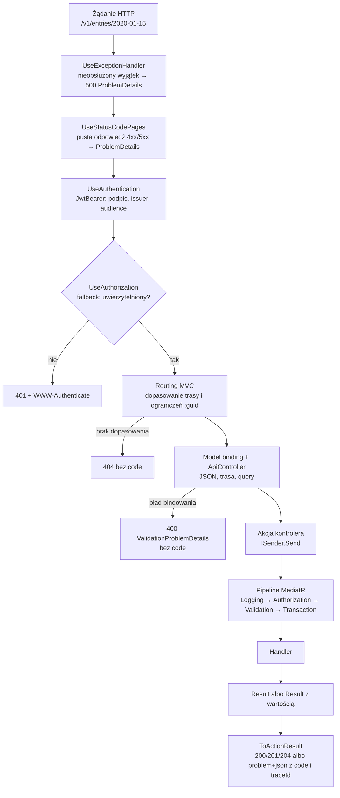
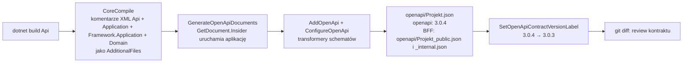

# 8. API HTTP i kontrakty OpenAPI

**Czego się nauczysz:** jak żądanie HTTP przechodzi przez API serwisu, jak pisać cienkie kontrolery, jak opisać odpowiedzi,
żeby kontrakt OpenAPI był kompletny, jak wyglądają błędy (`ProblemDetails` z `code` i `traceId`), jakie reguły ma kontrakt
JSON, jak kontrakt powstaje przy buildzie i jak go przeglądać, czego nie wolno zmieniać w działającym API, z czego generuje
się klientów, jak BFF experience wystawia API serwisów modułowi oraz jak samodzielnie wywołać API lokalnie (przez bramę, bezpośrednio
do BFF i bezpośrednio do serwisu).

**Wymagania wstępne:** [1 Start](01-start.md) (uruchomione środowisko lokalne), [3 Zasady](03-zasady.md),
[6 Warstwa aplikacji](06-warstwa-aplikacji.md) (komendy, zapytania, `Result`, pipeline behaviors). Bezpieczeństwo bram i tokenów
opisuje [9 Bezpieczeństwo](09-bezpieczenstwo.md); tu korzystamy z niego tylko w zakresie potrzebnym do wywołania API.

> **W skrócie**
> - Kontroler mapuje HTTP na komendę lub zapytanie, wywołuje `ISender.Send` i zwraca `this.ToActionResult(result)`. Nic więcej:
>   żadnych reguł, `try/catch`, wyboru statusu ani budowania błędów.
> - Sukces: 200 z wartością, 204 bez wartości, 201 z `CreatedResponse` przy tworzeniu. Błąd: `application/problem+json`
>   ze statusem z `ErrorType` (400/403/404/409/422) i rozszerzeniami `code` (stały kod, po którym klient podejmuje decyzje) oraz `traceId`.
> - Każdy status każdej akcji jest zadeklarowany `[ProducesResponseType]` i opisany `<response>`; 401 i 403 raz na kontrolerze.
>   `[ProducesErrorResponseType(typeof(void))]` na kontrolerze, nigdy `[Produces]`.
> - JSON: camelCase, ID i value objecty jako prymitywy, enumy tylko jako nazwy, liczby tylko jako liczby JSON.
> - Kontrakt `openapi/{Projekt}.json` (OpenAPI 3.0, etykieta `3.0.3`) generuje się przy `dotnet build` i jest commitowany.
>   Jego diff przeglądasz jak kod; zmiana łamiąca wymaga nowej wersji (`/v2`).
> - Podział publiczne/wewnętrzne przebiega na poziomie **BFF experience** (ADR-0039): API publiczne `/v{n}` dla modułu (kontrakt
>   `Example.Bff_public.json`), API wewnętrzne `/internal/v{n}` dla BFF-ów innych experience (`Example.Bff_internal.json`). API
>   serwisów domenowych jest wewnętrzne experience; jego konsumentem jest BFF z klientem wygenerowanym Refitterem.
> - BFF przekazuje odpowiedź serwisu bez zmian (także błąd z `code`) i nie waliduje treści żądań; sam odpowiada tylko
>   `503 downstream.unavailable` / `504 downstream.timeout`, gdy serwis jest nieosiągalny.
> - Lokalnie: przez bramę (`/api/example/v1/...`; profil `bff-web` z ciasteczkiem `__Host-bff` i `X-CSRF: 1` albo gateway mobile
>   z tokenem), a do debugowania bezpośrednio do BFF (5120) albo do serwisu (5101/5102) z tokenem z klienta `dev-cli`.

Kod w blokach jest skopiowany z repozytorium; komentarze XML pomijam dla zwięzłości tam, gdzie nie są tematem (w kontrolerach są
tematem, bo trafiają do kontraktu, więc tam je pokazuję).

---

## 8.0 Kto konsumuje które API (model experience)

| API | Ścieżka | Konsument | Dostępność | Kontrakt OpenAPI |
|---|---|---|---|---|
| publiczne BFF | `/v{n}/...` | wyłącznie moduł naszej experience | przez bramę brzegową (`/api/{experience}/v{n}/**`) | `{Experience}.Bff_public.json`, generowany klient modułu |
| wewnętrzne BFF | `/internal/v{n}/...` | BFF-y innych experience | tylko w klastrze, nigdy przez bramę | `{Experience}.Bff_internal.json`, klient Refitter u konsumenta |
| serwisu domenowego | `/v{n}/...` | BFF i serwisy **naszej** experience | tylko w klastrze, nigdy przez bramę | `{Serwis}.Api.json`, klient Refitter w BFF |

- **API publiczne** ma jednego konsumenta, nasz moduł, ale wersje modułu w sklepie żyją długo: zmian łamiących unikamy, a zmiana
  łamiąca to nowe `/v{n+1}`.
- **API wewnętrzne** to kontrakt z innymi zespołami: zmiany wyłącznie wstecznie zgodne, operacje projektowane pod konsumenta (np.
  „widget postępu”), a nie ogólny dostęp do domeny. Wymaga scope `{experience}.internal.*`; wywołania systemowe
  `{experience}.internal.system.*` ([9.8](09-bezpieczenstwo.md), ADR-0040).
- **Kontrakty serwisów domenowych** zostają (ADR-0019), ale są wewnętrzne experience: mogą ewoluować razem z BFF w jednym wydaniu,
  przy zachowaniu expand/contract podczas rolling update. Reguły zgodności z 8.11 nadal obowiązują.

Rozdziały 8.1–8.11 opisują API serwisu domenowego; zasady metadanych odpowiedzi, kontraktu JSON i zgodności obowiązują tak samo
w BFF. Czym różni się kontroler BFF, opisuje [8.14](#814-bff-experience-fasada-i-dwa-kontrakty).

## 8.1 Droga żądania przez API serwisu

Klient nigdy nie woła serwisu bezpośrednio: żądanie przechodzi przez bramę (lokalnie `SuperApp.Gateway`, profil `bff-web` albo
`gateway-mobile`), która usuwa prefiks `/api/example` i dokleja token, a potem przez BFF experience, który woła serwis klientem
Refit z tym samym tokenem. `/api/example/v1/sleepdiary/entries/2020-01-15` w przeglądarce to `/v1/sleepdiary/entries/2020-01-15`
w BFF (transform `PathRemovePrefix` z konfiguracji tras bramy, ADR-0022) i `/v1/entries/2020-01-15` w SleepDiary API (akcja
`SleepDiarySleepEntriesController.Get` BFF woła `ISleepDiaryApi`). Poniżej droga żądania przez sam serwis.



Co z tego wynika dla Ciebie:

- **Dwa źródła błędów 400.** Błąd bindowania (zły format daty, liczba w cudzysłowie, brak wymaganego pola, nieznana wartość
  enuma) zatrzymuje żądanie **przed** akcją; odpowiedź generuje ASP.NET Core (`[ApiController]`) i **nie ma** `code`. Dopiero
  poprawnie zbindowane żądanie trafia do pipeline'u, gdzie walidator FluentValidation zwraca `validation.failed`, a domena
  swoje kody. Przykłady w [8.7](#87-błędy-problemdetails-z-code-i-traceid).
- **Autoryzacja HTTP jest tylko „czy token jest poprawny”.** `AddAppApi` ustawia politykę domyślną (fallback) „uwierzytelniony
  użytkownik” dla każdego endpointu. Scope sprawdza `AuthorizationBehavior` w pipeline (ADR-0012, ADR-0017), więc brak scope
  to 403 z `code` `auth.missing_scope`, a nie gołe 403 z ASP.NET Core. Szczegóły: [9 Bezpieczeństwo](09-bezpieczenstwo.md).
- **Autoryzacja przed walidacją.** Wywołujący bez scope dostaje 403 nawet dla niepoprawnego ciała (test
  `PipelineTests.Authorization_runs_before_validation`), więc z odpowiedzi 400 nie da się wywnioskować reguł walidacji bez uprawnień.

### Program.cs API

Każde API składa się z tych samych klocków z `SuperApp.Framework.Infrastructure.Hosting.HostingExtensions`.
`src/Services/SleepDiary/SleepDiary.Api/Program.cs`:

```csharp
var builder = WebApplication.CreateBuilder(args);

builder.AddAppServiceDefaults<SleepDiaryWriteDbContext>("sleepdiary-api");
builder.AddAppApi();
builder.Services.AddOpenApi(options => HostingExtensions.ConfigureOpenApi(options));
builder.Services.AddSleepDiaryInfrastructure(builder.Configuration, OutboxDelivery.Disabled);

var app = builder.Build();

app.UseExceptionHandler();
app.UseStatusCodePages();
app.UseAuthentication();
app.UseAuthorization();

app.MapControllers();
app.MapOpenApi().AllowAnonymous();
app.MapAppDefaultEndpoints();

await app.RunAsync();

public partial class Program;
```

| Wywołanie | Co rejestruje |
|---|---|
| `AddAppServiceDefaults<TWriteDbContext>("sleepdiary-api")` | OpenTelemetry (`service.name`), `IClock`, `AddProblemDetails()`, health checki (migracje, shutdown, MSSQL, Redis) |
| `AddAppApi()` | kontrolery MVC, kontrakt JSON (`ConfigureJson`) dla MVC **i** dla generatora OpenAPI, `ICurrentUser` z tokenu, `AddJwtBearer` z wymuszoną walidacją issuer i audience, polityka fallback |
| `AddOpenApi(... ConfigureOpenApi)` | dokument OpenAPI 3.0 i transformery schematów; **musi** być wywołane w projekcie Api (8.9) |
| `UseExceptionHandler()` + `UseStatusCodePages()` | wyjątek → 500 `ProblemDetails`; puste odpowiedzi błędów (401, 404 trasy, 415) → `ProblemDetails` z kodem ogólnym (ADR-0044) |
| `MapOpenApi().AllowAnonymous()` | `/openapi/v1.json` działającej aplikacji (pomocniczo; źródłem prawdy jest plik w repo) |
| `MapAppDefaultEndpoints()` | `/health/startup`, `/health/ready`, `/health/live`, `/health/dependencies` |

`public partial class Program;` jest jawne, bo testy integracyjne mogą uruchomić API przez `WebApplicationFactory<Program>`.

---

## 8.2 Kontroler: cienki adapter HTTP

Kontroler robi dokładnie trzy rzeczy: bierze dane z HTTP (trasa, query, ciało), buduje komendę lub zapytanie, wysyła je przez
`ISender` i zamienia `Result` na odpowiedź. Wszystko inne ma swoje miejsce: reguły w agregacie, kształt wejścia w walidatorze,
uprawnienia w atrybucie na komendzie, zapis w `TransactionBehavior`, mapowanie błędów w `ResultHttpExtensions`.

Pełny kontroler z repozytorium, `src/Services/Knowledge/Knowledge.Api/Controllers/CategoriesController.cs`
(komentarze XML zostawione, bo są treścią kontraktu):

```csharp
[ApiController]
[Route("v1/categories")]
[ProducesErrorResponseType(typeof(void))]
[ProducesResponseType(StatusCodes.Status401Unauthorized)]
[ProducesResponseType<ProblemDetails>(StatusCodes.Status403Forbidden, MediaTypeNames.Application.ProblemJson)]
public sealed class CategoriesController(ISender sender) : ControllerBase
{
    /// <summary>Returns all categories of the catalog, ordered by name.</summary>
    /// <remarks>
    /// Required scope: <c>knowledge.catalog.read</c>. The list is not paged (the catalog is expected to have few categories) and is
    /// served from a cache that is refreshed immediately after a category is created or renamed.
    /// </remarks>
    /// <param name="cancellationToken">Cancellation of the HTTP request.</param>
    /// <returns>All categories, each with its identifier, display name and slug.</returns>
    /// <response code="200">The list of categories (possibly empty).</response>
    /// <response code="401">Missing, expired or invalid access token.</response>
    /// <response code="403">The token lacks the scope <c>knowledge.catalog.read</c> (<c>auth.missing_scope</c>).</response>
    [HttpGet]
    [ProducesResponseType<IReadOnlyList<CategoryDto>>(StatusCodes.Status200OK, MediaTypeNames.Application.Json)]
    public async Task<IActionResult> List(CancellationToken cancellationToken) =>
        this.ToActionResult(await sender.Send(new ListCategories(), cancellationToken));

    /// <summary>Creates a new category.</summary>
    /// <remarks>
    /// Required scope: <c>knowledge.catalog.write</c> (editor). Name: required, at most 100 characters (leading and trailing whitespace is
    /// trimmed). Slug: required, at most 100 characters, only lowercase letters, digits and single hyphens between them
    /// (e.g. <c>healthy-sleep</c>), unique across all categories. The slug cannot be changed later.
    /// </remarks>
    /// <param name="cancellationToken">Cancellation of the HTTP request.</param>
    /// <param name="command">Name and slug of the new category.</param>
    /// <returns>The identifier of the created category.</returns>
    /// <response code="201">The category was created; the body contains its identifier.</response>
    /// <response code="400">
    /// Invalid name or slug (<c>validation.failed</c>, <c>knowledge.category.invalid_name</c>, <c>knowledge.category.invalid_slug</c>).
    /// </response>
    /// <response code="401">Missing, expired or invalid access token.</response>
    /// <response code="403">The token lacks the scope <c>knowledge.catalog.write</c> (<c>auth.missing_scope</c>).</response>
    /// <response code="409">
    /// A category with this slug already exists (<c>knowledge.category.slug_taken</c>), also when another request created it at the same moment.
    /// </response>
    [HttpPost]
    [ProducesResponseType<CreatedResponse>(StatusCodes.Status201Created, MediaTypeNames.Application.Json)]
    [ProducesResponseType<ValidationProblemDetails>(StatusCodes.Status400BadRequest, MediaTypeNames.Application.ProblemJson)]
    [ProducesResponseType<ProblemDetails>(StatusCodes.Status409Conflict, MediaTypeNames.Application.ProblemJson)]
    public async Task<IActionResult> Create(CreateCategory command, CancellationToken cancellationToken) =>
        this.ToActionResult(await sender.Send(command, cancellationToken), id => StatusCode(StatusCodes.Status201Created, new CreatedResponse(id)));

    // Rename: PUT v1/categories/{categoryId:guid}/name z ciałem RenameCategoryRequest (niżej, „Ciało żądania”)
}
```

Elementy, które powtarzasz w każdym kontrolerze:

| Element | Po co |
|---|---|
| `[ApiController]` | automatyczne 400 przy błędzie bindowania, wnioskowanie źródeł parametrów (`[FromBody]` dla typów złożonych) |
| `[Route("v1/...")]` | wersja w ścieżce (8.4) |
| `sealed`, `ControllerBase`, primary constructor z `ISender` | bez widoków MVC; jedyna zależność to `ISender` (MediatR) |
| `Task<IActionResult>` + `this.ToActionResult(...)` | jedna konwersja `Result` → HTTP dla całego systemu |
| `CancellationToken cancellationToken` | przerwanie żądania przerywa zapytania do bazy |
| atrybuty `[ProducesResponseType]` i komentarze `<response>` | treść kontraktu OpenAPI (8.6) |

### Źle i dobrze

**Źle: logika i statusy w kontrolerze**

```csharp
[HttpPost("{materialId:guid}/publish")]
public async Task<IActionResult> Publish(Guid materialId, CancellationToken cancellationToken)
{
    var material = await db.Materials.FindAsync(materialId);          // kontroler zna EF
    if (material is null) return NotFound();                          // 404 z ogólnym http.not_found zamiast kodu domenowego
    if (material.Content.Count == 0) return BadRequest("No content");  // reguła domeny poza agregatem, zły status
    material.Status = "Published";                                     // stan zmieniany z zewnątrz
    await db.SaveChangesAsync();                                       // brak outboxa, zdarzeń, transakcji
    return Ok();
}
```

Co się psuje: reguła „publikacja wymaga treści” istnieje w dwóch miejscach i się rozjedzie; klient dostaje 400 zamiast 422
i zwykły tekst zamiast `problem+json` z `code`, więc nie może rozpoznać przyczyny; zdarzenie `MaterialPublishedV1` nie zostanie opublikowane; cache czytelników
nie zostanie unieważniony; testy architektury nie przejdą (Api nie może używać `DbContext`).

**Dobrze: kontroler tylko tłumaczy HTTP** (`MaterialsController.Publish`):

```csharp
[HttpPost("{materialId:guid}/publish")]
[ProducesResponseType(StatusCodes.Status204NoContent)]
[ProducesResponseType<ValidationProblemDetails>(StatusCodes.Status400BadRequest, MediaTypeNames.Application.ProblemJson)]
[ProducesResponseType<ProblemDetails>(StatusCodes.Status404NotFound, MediaTypeNames.Application.ProblemJson)]
[ProducesResponseType<ProblemDetails>(StatusCodes.Status422UnprocessableEntity, MediaTypeNames.Application.ProblemJson)]
public async Task<IActionResult> Publish(Guid materialId, CancellationToken cancellationToken) =>
    this.ToActionResult(await sender.Send(new PublishMaterial(materialId), cancellationToken));
```

**Źle: `try/catch` wokół `Send`.** Błędy oczekiwane przychodzą jako `Result`, nie wyjątki (ADR-0015). Wyjątek oznacza błąd
techniczny i ma dojść do `UseExceptionHandler` (500, log, ślad). Łapanie go w kontrolerze ukrywa awarie i daje klientowi
nieprawdziwy status.

**Źle: zwracanie encji domenowej albo read modelu (`*Row`).** Odpowiedź to zawsze DTO z Application (`CategoryDto`,
`SleepEntryDto`); encje mają prywatne pola, silne typy i zmieniają się razem z domeną, więc ich serializacja zmieniałaby kontrakt
przy każdej refaktoryzacji.

### Ciało żądania: komenda wprost czy osobny `*Request`

| Sytuacja | Wzorzec | Przykład |
|---|---|---|
| Wszystkie dane komendy pochodzą z ciała | komenda jako parametr akcji | `Create(CreateCategory command, ...)` |
| Część danych z trasy (ID, data), reszta z ciała | osobny rekord `*Request` w `Api/Controllers`, komenda budowana w akcji | `Rename(Guid categoryId, RenameCategoryRequest request, ...)` |
| Brak ciała | komenda budowana z trasy/query | `Publish(Guid materialId, ...)` |

`*Request` istnieje po to, żeby identyfikator nie występował dwa razy (w trasie i w ciele). Gdyby ciało było komendą
`RenameCategory(Guid CategoryId, string Name)`, klient mógłby wysłać `PUT /v1/categories/A/name` z `"categoryId": "B"` i nie
byłoby jasne, którą kategorię zmienić.

`src/Services/Knowledge/Knowledge.Api/Controllers/RenameCategoryRequest.cs`:

```csharp
/// <summary>Request body of <c>PUT /v1/categories/{categoryId}/name</c>: the new name of a category.</summary>
/// <param name="Name">The new name: required, at most 100 characters (trimmed). The slug of the category does not change.</param>
public sealed record RenameCategoryRequest(string Name);
```

### `201 Created` i `CreatedResponse`

Komenda tworząca zwraca `Result<Guid>`, a akcja buduje 201 przez parametr `onSuccess`:

```csharp
this.ToActionResult(await sender.Send(command, cancellationToken), id => StatusCode(StatusCodes.Status201Created, new CreatedResponse(id)));
```

`CreatedResponse` jest zdefiniowany w każdym Api osobno (`Knowledge.Api.Controllers.CreatedResponse`,
`SleepDiary.Api.Controllers.CreatedResponse`), bo jest częścią kontraktu konkretnego serwisu i ma własny opis:

```csharp
/// <summary>Body of the <c>201 Created</c> response returned when a category, material or collection is created.</summary>
/// <remarks>The response has no <c>Location</c> header; build the URL of the new resource from <paramref name="Id"/>.</remarks>
/// <param name="Id">Identifier of the created resource, used in subsequent calls (e.g. <c>/v1/materials/{id}</c>).</param>
public sealed record CreatedResponse(Guid Id);
```

Odpowiedź **nie ma** nagłówka `Location` (świadomie: ścieżka widziana przez serwis różni się od ścieżki klienta za bramą, więc
`Location` wygenerowany w serwisie byłby błędny). Klient buduje adres z `id`.

---

## 8.3 Konwersja `Result` na HTTP: `ResultHttpExtensions`

`src/Framework/SuperApp.Framework.Infrastructure/Api/ResultHttpExtensions.cs` (bez komentarzy XML):

```csharp
public static class ResultHttpExtensions
{
    public static IActionResult ToActionResult(this ControllerBase controller, Result result) =>
        result.IsSuccess ? controller.NoContent() : Problem(controller, result.Error);

    public static IActionResult ToActionResult<T>(this ControllerBase controller, Result<T> result, Func<T, IActionResult>? onSuccess = null) =>
        result.TryGetValue(out var value, out var error) ? onSuccess?.Invoke(value) ?? controller.Ok(value) : Problem(controller, error);

    public static int ToStatusCode(this ErrorType type) => type switch
    {
        ErrorType.Validation => StatusCodes.Status400BadRequest,
        ErrorType.Forbidden => StatusCodes.Status403Forbidden,
        ErrorType.NotFound => StatusCodes.Status404NotFound,
        ErrorType.Conflict => StatusCodes.Status409Conflict,
        ErrorType.BusinessRule => StatusCodes.Status422UnprocessableEntity,
        _ => StatusCodes.Status500InternalServerError,
    };

    private static ObjectResult Problem(ControllerBase controller, Error error)
    {
        var status = error.Type.ToStatusCode();
        ProblemDetails problem = error.Details is { Count: > 0 } details
            ? new ValidationProblemDetails(details.ToDictionary(pair => pair.Key, pair => pair.Value))
            : new ProblemDetails();

        problem.Status = status;
        problem.Title = error.Message;
        problem.Instance = controller.HttpContext.Request.Path;
        problem.Extensions["code"] = error.Code;
        problem.Extensions["traceId"] = ProblemDetailsConventions.TraceId(controller.HttpContext);

        return new ObjectResult(problem) { StatusCode = status, ContentTypes = { "application/problem+json" } };
    }
}
```

| Wynik | Odpowiedź |
|---|---|
| `Result` sukces | `204 No Content`, puste ciało |
| `Result<T>` sukces, bez `onSuccess` | `200 OK`, ciało = wartość jako JSON |
| `Result<T>` sukces, z `onSuccess` | to, co zbuduje lambda (w praktyce `201` + `CreatedResponse`) |
| błąd bez `Details` | `ProblemDetails`: `title` = `Error.Message`, `status`, `instance` = ścieżka w serwisie, `code`, `traceId` |
| błąd z `Details` (tylko `validation.failed`) | `ValidationProblemDetails`: to samo + `errors` (pole → komunikaty) |

Kategorię błędu wybierasz z punktu widzenia klienta („co ma zrobić?”), nie implementacji:

| `ErrorType` | Status | Klient powinien | Przykład kodu |
|---|---|---|---|
| `Validation` | 400 | poprawić dane wejściowe | `validation.failed`, `knowledge.category.invalid_slug`, `sleepdiary.entry.wake_before_bed` |
| `Forbidden` | 403 | nie ponawiać; poprosić o uprawnienie | `auth.missing_scope`, `auth.unauthenticated` |
| `NotFound` | 404 | uznać zasób za nieistniejący (także gdy jest niewidoczny) | `knowledge.material.not_found`, `sleepdiary.entry.not_found` |
| `Conflict` | 409 | odświeżyć stan, wybrać inną wartość | `knowledge.category.slug_taken`, `sleepdiary.entry.already_exists` |
| `BusinessRule` | 422 | pokazać regułę użytkownikowi; dane są poprawne, ale stan nie pozwala | `knowledge.material.archived`, `knowledge.material.content_required` |

Uwaga na konwencję serwisów: SleepDiary zgłasza naruszenia reguł wpisu (`wake_before_bed`, `too_long`, `invalid_latency`,
`future_date`) jako `Validation` (400), bo dla klienta są to błędy danych jednego formularza; Knowledge używa 422 dla reguł
zależnych od stanu (archiwum, brak treści). Kontrakt każdej akcji mówi, który kod przy jakim statusie występuje.

**Kod błędu jest kontraktem.** `Error.Code` (`{serwis}.{pojęcie}.{problem}`, snake_case) nigdy się nie zmienia i nie jest
używany ponownie w innym znaczeniu. `title` (komunikat, obecnie po polsku) może się zmieniać w każdej chwili; klient go nie parsuje.

---

## 8.4 Routing i wersjonowanie

### Trasy

- Prefiks wersji jest częścią szablonu kontrolera: `[Route("v1/categories")]`, `[Route("v1/entries")]`, `[Route("v1/me/...")]`.
- Identyfikatory w trasie mają ograniczenie typu: `[HttpPut("{categoryId:guid}/name")]`. Wartość, która nie jest GUID-em, **nie
  dopasowuje trasy**, więc odpowiedź to `404 http.not_found` (z `UseStatusCodePages`), a nie 400. Jest to zamierzone: nieistniejąca
  ścieżka.
- Daty w trasie (`{date}` w SleepDiary) nie mają ograniczenia; parametr `DateOnly` jest bindowany i zły format daje 400
  z `[ApiController]` (`request.malformed`, klucz w `errors` to nazwa parametru).
- Akcje nazywa się czasownikiem z języka przypadku użycia (`Publish`, `Archive`, `Rename`), a operacje domenowe niebędące CRUD-em
  mają własny segment z czasownikiem: `POST /v1/materials/{id}/publish`, `POST /v1/materials/{id}/archive`.
- Zasoby bieżącego użytkownika są pod `v1/me/...` (`/v1/me/favorites`, `/v1/me/completions`); ID użytkownika nigdy nie jest
  w trasie (bierze się z tokenu, zobacz [9.6](09-bezpieczenstwo.md#96-autoryzacja-trzy-poziomy)).

Lokalna brama nie wymaga zmian dla nowej akcji: jedyna trasa experience `/api/example/v{version:int}/{**rest}` obejmuje całe API
publiczne BFF (seed `ProxyConfigurationSeed`, ADR-0022), a serwisy domenowe nie mają tras na brzegu (ADR-0039). Nowa akcja serwisu
staje się dostępna dla modułu dopiero po dodaniu akcji w BFF (8.14, [przepis 01](przepisy/01-endpoint-komendy.md)).

`instance` w `ProblemDetails` zawiera ścieżkę **widzianą przez serwis** (`/v1/categories`), nie ścieżkę modułu
(`/api/example/v1/knowledge/categories`): BFF przekazuje błąd serwisu bez zmian. Do korelacji używaj `traceId`, nie `instance`.

### Wersjonowanie

Wersja jest w ścieżce (ADR-0009). Pakiet `Asp.Versioning` nie jest używany (nie ma go w `Directory.Packages.props`); jeśli
będzie potrzebny, wymaga uzasadnienia i zgody.

| Zmiana | Co robisz |
|---|---|
| Nowa operacja, nowe opcjonalne pole wejściowe, nowe pole w odpowiedzi | w `v1`, bez nowej wersji |
| Zmiana łamiąca jednej operacji (8.11) | nowa akcja w nowym kontrolerze `[Route("v2/...")]`, `v1` działa dalej do czasu migracji klientów |
| Zmiana łamiąca wielu operacji | nowy kontroler `v2` dla zasobu; komendy/zapytania i DTO z sufiksem lub w osobnym folderze wycinka |
| Wycofanie `v1` | dopiero gdy żaden klient (web, mobile w sklepach, inne serwisy przez Refit) jej nie używa; uzgodnij z właścicielami klientów |

Aplikacje mobilne zostają u użytkowników miesiącami, więc stara wersja API musi żyć dłużej niż w przypadku web.

---

## 8.5 Model binding: pułapki

Wszystkie przykłady poniżej to prawdziwe odpowiedzi lokalnego środowiska (SleepDiary API `http://localhost:5102`,
Knowledge API `http://localhost:5101`).

| Wejście | Wynik | Dlaczego |
|---|---|---|
| ciało bez `Content-Type: application/json` | `415 http.unsupported_media_type` | MVC nie wie, jak czytać ciało |
| brak pola, które w rekordzie jest nie-nullowalnym typem referencyjnym (`string Slug`) | `400 request.malformed`, `errors: {"Slug": ["The Slug field is required."]}` | `[ApiController]` traktuje nie-nullowalne referencje jako wymagane, zanim zadziała walidator |
| liczba w cudzysłowie `"quality":"4"` | `400 request.malformed`, `errors: {"$.quality": [...], "request": ["The request field is required."]}` | `JsonNumberHandling.Strict` (8.8); obiekt nie powstał, więc MVC zgłasza też brak całego parametru |
| enum jako liczba w JSON `"type":0` | `400 request.malformed`, `errors: {"$.type": [...]}` | `JsonStringEnumConverter(allowIntegerValues: false)` |
| enum jako liczba w **query** `?type=0` | `200` (potraktowane jak `Article`) | query string bindują konwertery MVC, nie System.Text.Json; liczba zdefiniowanej wartości przechodzi, `?type=7` daje 400 |
| enum w innej wielkości liter `"article"`, `?type=article` | akceptowane | oba mechanizmy porównują nazwy bez rozróżniania wielkości liter |
| data w trasie `15-01-2020` | `400 request.malformed`, `errors: {"date": ["The value '15-01-2020' is not valid."]}` | `DateOnly` wymaga `YYYY-MM-DD` |
| `"bedTime":"2020-01-14T23:15:00Z"` (SleepDiary) | `400 validation.failed` | `Z` daje `DateTimeKind.Utc`; walidator `WallClockTime()` przyjmuje tylko czas bez strefy |
| `GET /v1/materials/abc` | `404 http.not_found` | trasa `{materialId:guid}` nie pasuje |
| `GET /v1/materials/00000000-0000-0000-0000-000000000000` | `404 knowledge.material.not_found` | trasa pasuje; puste ID to po prostu nieistniejący materiał |

Wnioski praktyczne:

1. **Klient odróżnia błąd formatu od błędu danych po `code`** (ADR-0044): `request.malformed` to żądanie niezgodne z kontraktem
   (błąd klienta, nie użytkownika; klucze `errors` to `$.pole` albo nazwa parametru), `validation.failed` to dane łamiące reguły
   walidatora (klucze to nazwy właściwości C#, `Title`, `Quality`). Nie buduj na kluczach `errors` logiki, która zakłada jedną konwencję.
2. **Pole opcjonalne deklaruj jako nullable** (`string? Notes`, `Guid? CategoryId`), wymagane jako nie-nullowalne. To decyduje
   zarówno o bindowaniu, jak i o `required`/`nullable` w kontrakcie.
3. **Nie przyjmuj enumów w query, jeśli liczby mają być odrzucane**; jeśli przyjmujesz (filtr `type` w `GET /v1/materials`),
   pamiętaj, że liczba zdefiniowanej wartości przejdzie.
4. **Parametry query i trasy deklaruj typowane** (`DateOnly`, `Guid`, `int`), a nie `string` z ręcznym parsowaniem w kontrolerze:
   błąd formatu ma być 400 z frameworka, a reguły w walidatorze.

---

## 8.6 Metadane odpowiedzi: `ProducesResponseType`

Generator OpenAPI (`Microsoft.AspNetCore.OpenApi`) bierze statusy i schematy odpowiedzi **wyłącznie** z metadanych. Akcja zwraca
`IActionResult`, więc bez atrybutów kontrakt nie wiedziałby nic o odpowiedziach. Reguły (stosowane w obu serwisach):

1. **Każdy status, który akcja może zwrócić, ma `[ProducesResponseType]`** z typem ciała i content type:
   - sukces z ciałem: `[ProducesResponseType<CategoryDto>(StatusCodes.Status200OK, MediaTypeNames.Application.Json)]`,
   - sukces bez ciała: `[ProducesResponseType(StatusCodes.Status204NoContent)]`,
   - 400: `[ProducesResponseType<ValidationProblemDetails>(StatusCodes.Status400BadRequest, MediaTypeNames.Application.ProblemJson)]`,
   - 404/409/422: `[ProducesResponseType<ProblemDetails>(..., MediaTypeNames.Application.ProblemJson)]`.
2. **401 i 403 raz na kontrolerze**, bo dotyczą każdej akcji: 401 bez schematu (`[ProducesResponseType(StatusCodes.Status401Unauthorized)]`),
   403 jako `ProblemDetails` (`auth.missing_scope`). Jeśli każda akcja kontrolera może zwrócić 400 (SleepDiary: każda ma parametr
   `DateOnly`), także 400 deklaruje się na kontrolerze.
3. **`[ProducesErrorResponseType(typeof(void))]` na kontrolerze.** `[ApiController]` domyślnie przypisuje typ `ProblemDetails`
   każdemu statusowi błędu bez jawnego typu. 401 opisujemy bez schematu, bo klient reaguje na sam status (ponowne logowanie
   albo odświeżenie tokenu), a ciało zależy od tego, kto odrzucił żądanie: brama, BFF albo serwis. Każdy z nich zwraca
   `ProblemDetails` z `auth.invalid_token` (ADR-0044), ale nawigacja przeglądarki bez akceptacji JSON dostaje puste ciało.
   Z atrybutem schemat mają tylko statusy jawnie opisane typem.
4. **Nigdy `[Produces("application/json")]`** na kontrolerze ani akcji. Nadpisuje content type wszystkich odpowiedzi, także
   błędów, więc kontrakt twierdziłby, że błędy są `application/json`, a klienci generowani z kontraktu nie rozpoznaliby
   `application/problem+json`.
5. **Każdy status ma `<response code="...">`** z opisem i listą kodów błędów, które mogą wystąpić (`knowledge.category.slug_taken`).
   To jedyna dokumentacja kodów dla autorów klientów.
6. `<param name="cancellationToken">` umieszczaj **przed** parametrem ciała: generator komentarzy bierze opis `requestBody`
   z ostatniego `<param>` (ADR-0033).

Efekt w kontrakcie (fragment `openapi/SleepDiary.Api.json`, `GET /v1/entries/{date}`):

```json
"responses": {
  "400": {
    "description": "The date is not in the `YYYY-MM-DD` format.",
    "content": { "application/problem+json": { "schema": { "$ref": "#/components/schemas/ValidationProblemDetails" } } }
  },
  "401": { "description": "Missing, expired or invalid access token." },
  "403": {
    "description": "The token lacks the scope `sleepdiary.entry.read` (`auth.missing_scope`) or does not identify a user (`auth.unauthenticated`).",
    "content": { "application/problem+json": { "schema": { "$ref": "#/components/schemas/ProblemDetails" } } }
  },
  "200": {
    "description": "The entry for the day.",
    "content": { "application/json": { "schema": { "$ref": "#/components/schemas/SleepEntryDto" } } }
  },
  "404": {
    "description": "The caller has no entry for this day (`sleepdiary.entry.not_found`).",
    "content": { "application/problem+json": { "schema": { "$ref": "#/components/schemas/ProblemDetails" } } }
  }
}
```

**Źle:**

```csharp
[ApiController]
[Route("v1/entries")]
[Produces("application/json")]                       // błędy w kontrakcie jako application/json
public sealed class SleepEntriesController(ISender sender) : ControllerBase
{
    [HttpGet("{date}")]                              // brak 200 ze schematem, brak 404: klient nie zna typu odpowiedzi
    public async Task<IActionResult> Get(DateOnly date, CancellationToken cancellationToken) =>
        this.ToActionResult(await sender.Send(new GetSleepEntry(date), cancellationToken));
}
```

**Dobrze:** jak w `SleepEntriesController` (pełny plik w `src/Services/SleepDiary/SleepDiary.Api/Controllers/SleepEntriesController.cs`):

```csharp
[ApiController]
[Route("v1/entries")]
[ProducesErrorResponseType(typeof(void))]
[ProducesResponseType<ValidationProblemDetails>(StatusCodes.Status400BadRequest, MediaTypeNames.Application.ProblemJson)]
[ProducesResponseType(StatusCodes.Status401Unauthorized)]
[ProducesResponseType<ProblemDetails>(StatusCodes.Status403Forbidden, MediaTypeNames.Application.ProblemJson)]
public sealed class SleepEntriesController(ISender sender) : ControllerBase
{
    [HttpGet("{date}")]
    [ProducesResponseType<SleepEntryDto>(StatusCodes.Status200OK, MediaTypeNames.Application.Json)]
    [ProducesResponseType<ProblemDetails>(StatusCodes.Status404NotFound, MediaTypeNames.Application.ProblemJson)]
    public async Task<IActionResult> Get(DateOnly date, CancellationToken cancellationToken) =>
        this.ToActionResult(await sender.Send(new GetSleepEntry(date), cancellationToken));
}
```

---

## 8.7 Błędy: `ProblemDetails` z `code` i `traceId`

### Kształt odpowiedzi

Błąd z pipeline'u lub domeny (prawdziwa odpowiedź, `POST /v1/entries/2020-01-15` drugi raz):

```http
HTTP/1.1 409 Conflict
Content-Type: application/problem+json; charset=utf-8

{
  "title": "Wpis dla tego dnia już istnieje.",
  "status": 409,
  "instance": "/v1/entries/2020-01-15",
  "code": "sleepdiary.entry.already_exists",
  "traceId": "567093098dfd4c0f2c00ae85febd6d27"
}
```

Błąd walidatora (`ValidationProblemDetails`, `PUT /v1/entries/2020-01-15` z `bedTime` ze strefą, `quality: 9`,
`sleepLatencyMinutes: -5`):

```http
HTTP/1.1 400 Bad Request
Content-Type: application/problem+json; charset=utf-8

{
  "title": "Żądanie zawiera niepoprawne dane.",
  "status": 400,
  "instance": "/v1/entries/2020-01-15",
  "errors": {
    "BedTime": ["Czas należy podać jako lokalny czas użytkownika bez strefy czasowej (bez 'Z' i przesunięcia), np. 2026-09-29T23:15:00."],
    "Quality": ["'Quality' must be between 1 and 5. You entered 9."],
    "SleepLatencyMinutes": ["'Sleep Latency Minutes' must be greater than or equal to '0'."]
  },
  "code": "validation.failed",
  "traceId": "1b2d50c2b0accc55ce3736dcdd285669"
}
```

Błąd frameworka (bindowanie; tu: zły format daty w trasie). ASP.NET Core tworzy odpowiedź sam, a konwencja
`ProblemDetailsConventions` (ADR-0044) dokłada `code`, `instance` i `traceId` w tym samym formacie:

```http
HTTP/1.1 400 Bad Request
Content-Type: application/problem+json; charset=utf-8

{
  "type": "https://tools.ietf.org/html/rfc9110#section-15.5.1",
  "title": "One or more validation errors occurred.",
  "status": 400,
  "errors": { "date": ["The value '15-01-2020' is not valid."] },
  "traceId": "7f8ec27f934350b67ad58be02f46e591",
  "code": "request.malformed",
  "instance": "/v1/entries/15-01-2020"
}
```

Różnice, które klient musi znać:

| | Błąd z `Result` (pipeline, domena) | Błąd frameworka (bindowanie, 401 serwisu, 404 trasy, 415, 500) |
|---|---|---|
| `code` | kod domenowy (`knowledge.category.slug_taken`) albo `validation.failed` | kod ogólny według statusu: `request.malformed` (400), `auth.invalid_token` (401), `auth.forbidden`, `http.not_found`, `http.method_not_allowed`, `http.unsupported_media_type`, `http.too_many_requests`, `server.error` (5xx), w pozostałych przypadkach `http.{status}` |
| `type` | brak | link do RFC 9110 |
| `instance` | ścieżka w serwisie | ścieżka w serwisie |
| `errors` (400) | klucze to nazwy właściwości C# (`Title`, `Quality`) | klucze to ścieżki JSON (`$.quality`) albo nazwy parametrów (`date`) |
| `traceId` | 32 znaki hex (identyfikator śladu W3C) | 32 znaki hex (identyfikator śladu W3C) |

`traceId` to identyfikator śladu, który wyszukasz w Tempo/Loki ([14 Logowanie i obserwowalność](14-logowanie-i-obserwowalnosc.md)).
Ślad zaczyna się w bramie (propagacja `traceparent`), więc obejmuje też BFF.

### Jak klient ma obsługiwać błędy

```text
if (status == 401)                       → brak/wygasła sesja lub token: web → /bff/login, mobile → odśwież token / zaloguj
else if (code jest kodem domenowym)      → decyzja po code (np. "knowledge.category.slug_taken" → podświetl pole slug)
else if (code == "validation.failed")    → błędy pól z errors: pokaż przy polach formularza
else if (code == "request.malformed")    → żądanie niezgodne z kontraktem (bug klienta): zaloguj z traceId, komunikat ogólny
else                                     → komunikat ogólny + traceId do zgłoszenia
```

Nigdy nie porównuj `title` ani tekstów w `errors`: są dla ludzi i mogą się zmienić.

### Schemat w kontrakcie

`code` i `traceId` są rozszerzeniami słownikowymi `ProblemDetails`, niewidocznymi dla generatora schematów. Dodaje je
`OpenApiProblemDetailsSchemaTransformer` (`SuperApp.Framework.Infrastructure.OpenApi`):

```csharp
internal sealed class OpenApiProblemDetailsSchemaTransformer : IOpenApiSchemaTransformer
{
    public Task TransformAsync(OpenApiSchema schema, OpenApiSchemaTransformerContext context, CancellationToken cancellationToken)
    {
        if (!typeof(ProblemDetails).IsAssignableFrom(context.JsonTypeInfo.Type))
        {
            return Task.CompletedTask;
        }

        schema.Properties ??= new Dictionary<string, IOpenApiSchema>();
        schema.Properties["code"] = new OpenApiSchema
        {
            Type = JsonSchemaType.String,
            Description = "Stable, machine-readable error code, e.g. knowledge.material.archived; clients branch on it (ADR-0015).",
        };
        schema.Properties["traceId"] = new OpenApiSchema
        {
            Type = JsonSchemaType.String,
            Description = "Trace identifier of the request, used to find its traces and logs.",
        };
        return Task.CompletedTask;
    }
}
```

W kontrakcie `ProblemDetails` ma więc `type`, `title`, `status`, `detail`, `instance`, `code`, `traceId`, a `ValidationProblemDetails`
dodatkowo `errors` (`object` z `additionalProperties: array of string`).

---

## 8.8 Kontrakt JSON

Jedna konfiguracja dla MVC i dla generatora OpenAPI (`HostingExtensions.ConfigureJson`):

```csharp
public static void ConfigureJson(System.Text.Json.JsonSerializerOptions options)
{
    options.Converters.Add(new SingleValueObjectJsonConverterFactory());
    options.Converters.Add(new JsonStringEnumConverter(allowIntegerValues: false));
    options.NumberHandling = JsonNumberHandling.Strict;
    options.TypeInfoResolver = (options.TypeInfoResolver ?? new DefaultJsonTypeInfoResolver())
        .WithAddedModifier(PolymorphicDiscriminatorProperty.RemoveDuplicate);
}
```

`PolymorphicDiscriminatorProperty.RemoveDuplicate` (`SuperApp.Framework.Infrastructure.Json`) usuwa z kontraktu typu pochodnego właściwość
dublującą dyskryminator bazowego typu polimorficznego (np. `Type` w klasach wygenerowanych przez Refitter); bez niego
System.Text.Json odrzuca taki typ wyjątkiem.

`AddAppApi` wywołuje ją dwa razy: dla `AddControllers().AddJsonOptions(...)` i dla `ConfigureHttpJsonOptions(...)`, bo generator
OpenAPI czyta opcje JSON Minimal API. Gdyby się różniły, kontrakt opisywałby inny JSON niż ten, który API naprawdę wysyła.

| Reguła | Skąd | Przykład |
|---|---|---|
| nazwy właściwości w camelCase | domyślne ustawienia web ASP.NET Core | `sleepLatencyMinutes`, `timeInBedMinutes` |
| silne ID i jednowartościowe VO jako prymityw | `SingleValueObjectJsonConverterFactory` (czyta przez `Create`, niepoprawna wartość = 400) i `OpenApiSingleValueObjectSchemaTransformer` (w kontrakcie `string`/`uuid`, `integer`) | `"id": "01a0f63b-eab8-7a5b-bdcc-1de44df2a180"` |
| enumy wyłącznie jako nazwy | `JsonStringEnumConverter(allowIntegerValues: false)` | `"type": "Article"`, `"status": "Draft"`; `"type": 0` → 400 |
| liczby tylko jako liczby JSON | `JsonNumberHandling.Strict` | `"quality": 4`; `"quality": "4"` → 400 |
| `null` jest zapisywany | brak `DefaultIgnoreCondition` | `"description": null` |
| `DateOnly` | System.Text.Json | `"date": "2020-01-15"` |
| `DateTime` bez strefy (SleepDiary) | `DateTime` z `Kind=Unspecified`, walidowany | `"bedTime": "2020-01-14T23:15:00"` |
| `DateTimeOffset` z przesunięciem | System.Text.Json | `"updatedAt": "2026-10-01T06:52:16.5136784+00:00"` |
| polimorficzne bloki treści | `[JsonPolymorphic(TypeDiscriminatorPropertyName = "type")]` na `ContentBlockDto` | `{"type": "paragraph", ...}`; `type` musi być pierwszą właściwością obiektu |
| stronicowanie | `PagedResult<T>(Items, Page, PageSize, TotalCount)` | `{"items": [], "page": 1, "pageSize": 20, "totalCount": 0}` |

W praktyce komendy, zapytania i DTO używają prymitywów (`Guid`, `string`, `int`), a silne typy powstają dopiero w handlerze
(`CategoryId.Create(...)`). Konwerter VO jest zabezpieczeniem na wypadek, gdyby silny typ trafił do typu publicznego API.

**Źle:** ręczne `JsonSerializerOptions` w teście albo w kliencie Refit bez `ConfigureJson`. Serializacja enumów jako liczb
i ID jako obiektów `{ "value": ... }` da 400 albo inny JSON niż w kontrakcie. **Dobrze:** gdy serializujesz te same typy poza
MVC, wywołaj `HostingExtensions.ConfigureJson(options)`.

---

## 8.9 Generowanie kontraktu OpenAPI przy buildzie



### Konfiguracja projektu

`src/Services/Knowledge/Knowledge.Api/Knowledge.Api.csproj`:

```xml
<!-- OpenAPI 3.0 contract generated at build time and committed (ADR-0009, ADR-0019). -->
<PropertyGroup>
  <OpenApiGenerateDocuments>true</OpenApiGenerateDocuments>
  <OpenApiDocumentsDirectory>$(MSBuildProjectDirectory)/openapi</OpenApiDocumentsDirectory>
  <OpenApiGenerateDocumentsOptions>--openapi-version OpenApi3_0</OpenApiGenerateDocumentsOptions>
</PropertyGroup>

<ItemGroup>
  <PackageReference Include="Microsoft.Extensions.ApiDescription.Server" PrivateAssets="all" />
</ItemGroup>
```

`Microsoft.Extensions.ApiDescription.Server` dodaje do builda cel, który uruchamia aplikację narzędziem `GetDocument.Insider`
i zapisuje dokument do `openapi/Knowledge.Api.json`. Aplikacja startuje naprawdę (wykonuje się `Program.cs`), ale bez brokera
i sekretów. Dlatego rejestracje, które łączyłyby się z infrastrukturą (MassTransit/RabbitMQ), sprawdzają
`BuildTimeDocumentGeneration.IsActive` (`SuperApp.Framework.Infrastructure.OpenApi`):

```csharp
public static bool IsActive { get; } = Assembly.GetEntryAssembly()?.GetName().Name == "GetDocument.Insider";
```

Używaj tej flagi wyłącznie do pomijania takich rejestracji, nigdy w obsłudze żądań.

### Dlaczego `AddOpenApi` jest w `Program.cs` każdego Api

`Microsoft.AspNetCore.OpenApi` ma generator źródeł, który zamienia komentarze XML na opisy w dokumencie. Działa przez
interceptory: przechwytuje wywołanie `AddOpenApi` **w projekcie, który kompiluje**, i tylko tam wstrzykuje transformer z opisami.
Gdyby `AddOpenApi` było wywołane wewnątrz `AddAppApi` (projekt `SuperApp.Framework.Infrastructure`), opisy kontrolerów nie trafiłyby
do kontraktu. Stąd w `HostingExtensions` jest tylko `ConfigureOpenApi`, a samo wywołanie w Api (ADR-0033):

```csharp
builder.Services.AddOpenApi(options => HostingExtensions.ConfigureOpenApi(options));
```

Interceptory wymagają przestrzeni nazw w `Directory.Build.props`:

```xml
<InterceptorsNamespaces>$(InterceptorsNamespaces);Microsoft.AspNetCore.OpenApi.Generated</InterceptorsNamespaces>
```

### Komentarze XML z projektów referencjonowanych

Komendy, zapytania i DTO leżą w `Application` (a `PagedResult<T>` w `SuperApp.Framework.Application`, enumy w `Domain`). Generator czyta
tylko plik XML kompilowanego projektu i pliki XML przekazane jako `AdditionalFiles`. Cel `AddReferencedXmlDocsForOpenApi`
w `Directory.Build.targets` dodaje pliki XML wszystkich referencjonowanych projektów poza `*.Infrastructure`:

```xml
<Target Name="AddReferencedXmlDocsForOpenApi"
        AfterTargets="ResolveReferences"
        BeforeTargets="CoreCompile"
        Condition="'$(OpenApiGenerateDocuments)' == 'true'">
  <ItemGroup>
    <_OpenApiReferencedXmlDoc Include="@(ReferencePath->'%(RootDir)%(Directory)%(Filename).xml')"
                              Condition="'%(ReferencePath.ReferenceSourceTarget)' == 'ProjectReference' AND !$([System.String]::Copy('%(ReferencePath.Filename)').EndsWith('.Infrastructure'))" />
    <AdditionalFiles Include="@(_OpenApiReferencedXmlDoc)" Condition="Exists('%(_OpenApiReferencedXmlDoc.Identity)')" />
  </ItemGroup>
</Target>
```

Dzięki temu `<summary>` rekordu `SleepEntryRequest` i jego `<param>` stają się opisem schematu i jego właściwości w kontrakcie.
Pisz je dla autora klienta: format, zakres, co oznacza `null` (zobacz [15 Dokumentacja w kodzie](15-dokumentacja-w-kodzie.md)).

### `ConfigureOpenApi`: wersja i transformery

```csharp
public static void ConfigureOpenApi(OpenApiOptions options)
{
    options.OpenApiVersion = OpenApiSpecVersion.OpenApi3_0;
    options.AddSchemaTransformer<OpenApiSingleValueObjectSchemaTransformer>();
    options.AddSchemaTransformer<OpenApiProblemDetailsSchemaTransformer>();
    options.AddSchemaTransformer<OpenApiAbstractTypeSchemaTransformer>();
    options.AddOperationTransformer<OpenApiOperationIdTransformer>();
    options.AddDocumentTransformer<OpenApiBearerSecurityTransformer>();
    options.AddOperationTransformer<OpenApiBearerSecurityTransformer>();
}
```

- `OpenApi3_0`: wszystkie generatory klientów (Angular, Android, iOS, Refitter) obsługują 3.0 stabilnie (ADR-0019). Typy
  nullowalne są opisane jako `nullable: true`.
- `OpenApiSingleValueObjectSchemaTransformer`: silne ID i VO jako prymitywy (`Guid` → `string`/`uuid`, `int` → `integer`/`int32`).
- `OpenApiProblemDetailsSchemaTransformer`: `code` i `traceId` w schematach błędów (8.7).
- `OpenApiAbstractTypeSchemaTransformer`: schemat typu abstrakcyjnego (np. `ContentBlockDto` z dyskryminatorem `type`) dostaje
  rozszerzenie `x-abstract: true`, więc Refitter (NJsonSchema) generuje klasę abstrakcyjną. Dzięki temu BFF, który wystawia
  wygenerowane typy we własnym kontrakcie, opisuje warianty i dyskryminator, a nie pusty obiekt. Nowy wariant to zmiana kontraktu:
  klient bez regeneracji nie zdeserializuje odpowiedzi z nieznanym wariantem.
- `OpenApiOperationIdTransformer`: każda operacja ma stabilne `operationId` = `{Controller}_{Action}` (np. `Categories_Create`,
  w BFF `KnowledgeCategories_Create`), chyba że ustawiono je jawnie (`[EndpointName]`). Generatory nazywają metody klienta według
  `operationId` (Refitter: `CategoriesCreateAsync`), więc zmiana nazwy kontrolera albo akcji zmienia klienta: przejrzyj diff.
- `OpenApiBearerSecurityTransformer`: schemat `Bearer` w `components.securitySchemes` i wymaganie `security` na każdej operacji bez
  `[AllowAnonymous]`.

### Etykieta `3.0.3`

`Microsoft.OpenApi` 2.x zapisuje dla OpenAPI 3.0 najnowszą łatkę `3.0.4`. Ta łatka tylko doprecyzowuje tekst specyfikacji, ale
część narzędzi (obsługa OpenAPI w JetBrains Rider, starsze generatory) rozpoznaje 3.0.x po liście 3.0.0–3.0.3 i odrzuca `3.0.4`.
Cel `SetOpenApiContractVersionLabel` w `Directory.Build.targets` uruchamia się po `GenerateOpenApiDocuments` i zmienia wyłącznie pole
`"openapi"` na `3.0.3`; treść dokumentu jest identyczna (ADR-0019). Endpoint `/openapi/v1.json` działającej aplikacji nadal podaje
`3.0.4` i ma sekcję `servers`; nie służy do generowania klientów.

```bash
curl -s http://localhost:5101/openapi/v1.json | head -c 40     # {"openapi": "3.0.4", ...   (endpoint aplikacji)
head -c 40 src/Services/Knowledge/Knowledge.Api/openapi/Knowledge.Api.json   # {"openapi": "3.0.3", ...   (kontrakt w repo)
```

### Czego kontrakt nie zawiera

- **Sposobu zdobycia tokenu**: `securitySchemes` mówi tylko, że API wymaga `Authorization: Bearer`. Przeglądarka wysyła
  ciasteczko do bramy (profil `bff-web` dokleja token), aplikacje mobilne dokładają token same (AppAuth), BFF przekazuje token
  użytkownika (`AddUserTokenForwarding`), a wywołania systemowe używają client credentials.
- **Sekcji `servers`**: adres zależy od drogi (brama `/api/example`, bezpośrednio BFF, Service w klastrze). Klient konfiguruje bazowy
  URL sam.

---

## 8.10 Przegląd diffu kontraktu

Po każdej zmianie w Api, Application (komendy, zapytania, DTO, komentarze XML) albo w Domain (enumy) uruchom build i obejrzyj diff:

```bash
dotnet build SuperApp.slnx
git diff -- src/Services/*/*.Api/openapi/ src/Bff/*/openapi/
```

Brak zmian w kontrakcie przy zmianie API oznacza zwykle, że build nie przegenerował dokumentu (błąd builda) albo zmiana nie ma
metadanych. Lista kontrolna przeglądu:

| Sprawdź | Na co patrzysz w diffie |
|---|---|
| nowa operacja | jest `summary`, `description` ze scope, każdy status z `<response>`, schemat sukcesu |
| statusy | 401 bez `content`, 403 i błędy z `application/problem+json`, sukces z `application/json` |
| schematy | `required` zgodne z intencją (nie-nullowalne pola są wymagane), `nullable: true` tylko gdzie trzeba |
| enumy | lista wartości (`enum: [...]`), brak usuniętych wartości |
| typy | ID jako `string`/`uuid`, nie obiekt; daty `format: date`/`date-time` |
| opisy | zrozumiałe bez kodu: format, zakresy, kody błędów |
| zmiany łamiące | 8.11; jeśli jest, PR musi zawierać nową wersję albo uzasadnienie |

Kontrakt w repozytorium ma końce linii `\r\n` w opisach wielolinijkowych, jeśli został wygenerowany na Windows; generowanie na
innym systemie może dać diff tylko w tych znakach. Nie traktuj takiego diffu jako zmiany kontraktu.

Zmiany łamiące wykrywa `dotnet superapp contracts diff` ([22.5](22-narzedzie-superapp.md#225-praca-codzienna-add-usecase-migration-contracts)):
bez git względem kopii zapisanej przed zmianą przez `contracts snapshot`, z git względem rewizji (`--git origin/main`). Kod wyjścia
`2` oznacza zmianę łamiącą. Przegląd diffu nadal jest potrzebny: narzędzie nie oceni opisów ani intencji.

---

## 8.11 Zgodność wsteczna

Kontrakt `v1` jest używany przez klientów, których nie wdrażasz razem z serwisem (aplikacje mobilne u użytkowników, BFF-y innych
experience z klientem Refit wygenerowanym z kopii API wewnętrznego, inne serwisy). Zasada: **stary klient musi działać z nowym
serwisem**. Dla API wewnętrznego BFF obowiązuje bezwzględnie: zmiana łamiąca to nowa wersja i uzgodniony termin wygaszenia starej
(ADR-0039). Zmiany łamiące według tej tabeli wykrywa `dotnet superapp contracts diff`.

| Zmiana | Zgodna? | Uwagi |
|---|---|---|
| nowa operacja, nowy kontroler | tak | |
| nowe pole w odpowiedzi | tak | klienci muszą ignorować nieznane pola (generatory to robią) |
| nowe **opcjonalne** pole w żądaniu (nullable, z sensownym zachowaniem przy `null`) | tak | |
| nowy kod błędu dla nowej sytuacji | tak | opisz go w `<response>` |
| nowa wartość enuma w **żądaniu** | tak | |
| nowa wartość enuma w **odpowiedzi** | ryzykowna | klient z wygenerowanym enumem może nie zdeserializować odpowiedzi; uzgodnij z klientami albo dodaj w `v2` |
| zmiana nazwy pola, usunięcie pola | **nie** | |
| pole żądania z opcjonalnego na wymagane, nowe wymagane pole | **nie** | stary klient dostanie 400 |
| zmiana typu lub formatu pola (`int` → `string`, `date` → `date-time`) | **nie** | |
| zmiana statusu sukcesu (200 → 201, 204 → 200) | **nie** | |
| zmiana `code` istniejącego błędu albo jego `ErrorType` (status) | **nie** | klienci podejmują decyzje po `code` |
| usunięcie wartości enuma, zmiana trasy, usunięcie operacji | **nie** | |
| zaostrzenie walidacji (krótszy limit) | **nie** dla danych już akceptowanych | rozważ nowe dane tylko w nowej wersji |
| zmiana `title`, opisów, kolejności właściwości | tak | |

**Źle:** zmiana nazwy w rekordzie żądania, bo „tak jest ładniej”:

```csharp
public sealed record SleepEntryRequest(DateTime BedTime, DateTime WakeTime, int FallAsleepMinutes, ...);  // było SleepLatencyMinutes
```

Stary klient wysyła `sleepLatencyMinutes`, nowe API go nie zna; pole `fallAsleepMinutes` nie przychodzi, a `int` dostaje 0.
Żądanie przechodzi bez błędu i zapisuje **złe dane**. Zmiana nazwy pola żądania jest więc gorsza niż błąd 400.

**Dobrze:** nowa nazwa tylko w `v2`, `v1` bez zmian; albo zostaw nazwę i popraw tylko opis w komentarzu XML.

Zmiana kontraktu zdarzeń integracyjnych (`Contracts`) ma osobne reguły (nowy typ `V2`), opisane w
[10 Zdarzenia i integracja](10-zdarzenia-i-integracja.md).

---

## 8.12 Generowanie klientów

Źródłem dla wszystkich generatorów jest **commitowany** kontrakt (`openapi/{Projekt}.json` serwisu, `openapi/{Experience}.Bff_public.json`
i `_internal.json` BFF), nie endpoint `/openapi/...` działającej aplikacji. Kto z czego generuje:

| Klient | Narzędzie (ADR-0009, ADR-0014, ADR-0019) | Z jakiego kontraktu | Stan w repozytorium |
|---|---|---|---|
| moduł web (`web/`) | `ng-openapi-gen` albo `openapi-generator` (`typescript-angular`) | publiczny BFF | **planowany**: katalogu `web/` jeszcze nie ma |
| moduł Android (`mobile/android`) | `openapi-generator` (Kotlin, Ktor lub Retrofit) | publiczny BFF | **planowany**: katalogu `mobile/` jeszcze nie ma |
| moduł iOS (`mobile/ios`) | `swift-openapi-generator` | publiczny BFF | **planowany** |
| .NET: BFF → serwisy swojej experience | Refit + Refitter, plik `.refitter` w `src/Bff/{Experience}.Bff/Clients/{Serwis}/` | kontrakt serwisu | **istnieje**: `Example.Bff` (Knowledge, SleepDiary) |
| .NET: BFF innej experience → nasze API wewnętrzne | Refit + Refitter u konsumenta | wewnętrzny BFF | brak konsumenta w repozytorium |
| .NET: serwis → serwis tej samej experience | Refit + Refitter w `{Serwis}.Infrastructure` konsumenta, typy `internal` | kontrakt serwisu | brak wywołania w repozytorium ([przepis 08](przepisy/08-wywolanie-innego-serwisu.md)) |

Konfiguracje Angulara i aplikacji mobilnych poniżej są **wzorcem do pierwszego użycia**; nazwy opcji sprawdź w dokumentacji wybranej
wersji narzędzia.

### Angular

Moduł generuje klienta wyłącznie z kontraktu publicznego BFF experience (ADR-0039), do osobnego katalogu, bez edycji wygenerowanego
kodu. Bazowy URL to ścieżka experience na bramie (`/api/example`), a nagłówek `X-CSRF: 1` dodaje interceptor HTTP aplikacji, nie
wygenerowany klient:

```bash
npx ng-openapi-gen --input ../src/Bff/Example.Bff/openapi/Example.Bff_public.json \
                   --output src/app/api/example
```

```typescript
// interceptor: każde żądanie do /api/* niesie X-CSRF: 1; ciasteczko __Host-bff dodaje przeglądarka
export const csrfInterceptor: HttpInterceptorFn = (req, next) =>
  next(req.url.startsWith('/api/') ? req.clone({ setHeaders: { 'X-CSRF': '1' } }) : req);
```

Obsługa 401 w aplikacji: pełne przejście `window.location.href = '/bff/login?returnUrl=' + encodeURIComponent(location.pathname)`.

### Android i iOS

Klient generowany z kontraktu publicznego BFF, token dokłada warstwa HTTP aplikacji (AppAuth zarządza tokenami), bazowy URL to
brama mobile z prefiksem experience (`https://{gateway-mobile}/api/example`). Dla iOS `swift-openapi-generator` działa jako plugin builda
pakietu Swift z plikiem konfiguracyjnym wskazującym kopię kontraktu.

### .NET (Refitter)

Narzędzie `refitter` (2.3.0) jest w `.config/dotnet-tools.json`, a pakiety `Refit`, `Refit.HttpClientFactory`, `Refit.Reflection`
(wymagany przez Refit 16 dla `AddRefitClient`) i `Microsoft.Extensions.Http.Resilience` w `Directory.Packages.props`. Wygenerowany
kod jest commitowany i nigdy edytowany ręcznie.

**W BFF** (`src/Bff/Example.Bff/Clients/Knowledge/knowledge.refitter`):

```json
{
  "openApiPath": "../../../../Services/Knowledge/Knowledge.Api/openapi/Knowledge.Api.json",
  "namespace": "Example.Bff.Clients.Knowledge",
  "naming": { "useOpenApiTitle": false, "interfaceName": "KnowledgeApi" },
  "outputFolder": "./Generated",
  "outputFilename": "KnowledgeApi.cs",
  "useCancellationTokens": true,
  "returnIApiResponse": true,
  "typeAccessibility": "Public",
  "usePolymorphicSerialization": true,
  "generateOperationHeaders": false,
  "operationNameTemplate": "{operationName}Async",
  "operationNameGenerator": "SingleClientFromOperationId",
  "codeGeneratorSettings": { "dateType": "System.DateOnly", "dateTimeType": "System.DateTimeOffset", "timeType": "System.TimeOnly" }
}
```

```bash
dotnet tool restore
dotnet refitter --settings-file src/Bff/Example.Bff/Clients/Knowledge/knowledge.refitter
```

Ścieżki w pliku są względne do pliku ustawień. Wynik to jeden interfejs `IKnowledgeApi` z metodą na operację
(`operationId` `Categories_Create` → `CategoriesCreateAsync`) zwracającą `IApiResponse<T>`. Typy są **public**, bo w fasadzie BFF
są częścią jego kontraktu publicznego; `BffOpenApiDocuments` poprzedza ich schematy nazwą serwisu (`KnowledgeCategoryDto`,
`SleepDiaryCreatedResponse`), żeby te same nazwy z dwóch serwisów nie kolidowały w jednym dokumencie. Rejestracja:
`AddDownstreamApi<IKnowledgeApi>(builder.Configuration, "Knowledge").AddUserTokenForwarding()` (8.14).

**W serwisie konsumenta** (wywołanie serwis → serwis, ADR-0014) plik `.refitter` leży obok projektu Infrastructure, typy są
`internal`, generujesz tylko używane operacje, a odpowiedzi `IApiResponse<T>` mapujesz w ACL na `Result`:

```json
{
  "openApiPath": "../../Knowledge/Knowledge.Api/openapi/Knowledge.Api.json",
  "namespace": "SleepDiary.Infrastructure.Integrations.Knowledge.Generated",
  "outputFolder": "./Integrations/Knowledge/Generated",
  "typeAccessibility": "Internal",
  "useCancellationTokens": true,
  "returnIApiResponse": true,
  "includePathMatches": ["^/v1/materials/\\{materialId\\}$"]
}
```

Rejestruj klienta przez `AddDownstreamApi<T>(configuration, name)`: ustawia JSON zgodny z kontraktami systemu (enumy jako nazwy,
usunięcie zdublowanego dyskryminatora `PolymorphicDiscriminatorProperty`), daty ISO 8601 w ścieżce i query, adres
`Downstream:{name}:BaseAddress` i odporność z ponowieniami tylko metod bezpiecznych (GET, HEAD, OPTIONS). Token: w kontekście użytkownika
`AddUserTokenForwarding()`, client credentials tylko dla wywołań systemowych (ADR-0040): [9.8](09-bezpieczenstwo.md).

### Po zmianie kontraktu

Zmiana kontraktu dostawcy = regeneracja klientów, które z niego korzystają, w tym samym PR albo zaraz po nim. Błąd kompilacji
po regeneracji to zamierzony sygnał niezgodności (ADR-0014). Dla serwisu experience oznacza to: build serwisu (nowy
`openapi/{Serwis}.Api.json`) → `dotnet refitter --settings-file` w BFF → akcja w kontrolerze BFF → build BFF (nowy
`Example.Bff_public.json`) → regeneracja klienta modułu.

---

## 8.13 Wywoływanie API lokalnie

Cztery drogi, ta sama odpowiedź serwisu (BFF przekazuje ją bez zmian):

| Droga | Adres | Uwierzytelnienie | Kiedy |
|---|---|---|---|
| Brama web (`bff-web`) | `https://localhost:5001/api/example/v1/...` | ciasteczko `__Host-bff` + `X-CSRF: 1` | test pełnej ścieżki modułu web, sesji, odświeżania, CSRF |
| Gateway mobile | `https://localhost:5002/api/example/v1/...` | `Authorization: Bearer` (token z audience `gateway-mobile`) | test ścieżki mobilnej, polityk bramy |
| Bezpośrednio do BFF | `http://localhost:5120/v1/...`, API wewnętrzne `http://localhost:5120/internal/v1/...` | `Authorization: Bearer` (audience `example-bff`) | praca nad BFF, API wewnętrzne (przez bramę niedostępne) |
| Bezpośrednio do serwisu | `http://localhost:5101/...` (Knowledge), `http://localhost:5102/...` (SleepDiary) | `Authorization: Bearer` | tylko debug: praca nad serwisem z IDE; w klastrze serwis nie jest osiągalny spoza experience |

Bramy w kontenerach używają certyfikatu deweloperskiego (`deploy/local/certs/devcert.pfx`); jeśli nie jest zaufany w systemie,
dodaj do `curl` opcję `-k`. Przykłady poniżej używają `python3` do wyciągania pól z JSON; możesz użyć `jq -r .access_token`.

### Token z klienta `dev-cli`

`dev-cli` to publiczny klient z grantem hasłem, **wyłącznie w lokalnym realmie** (ADR-0031). Token dostaje audience z każdego
scope, o który poprosisz, oraz `gateway-mobile` i `example-bff` (domyślny client scope `example-bff-audience`):

```bash
TOKEN=$(curl -s http://localhost:8081/realms/superapp/protocol/openid-connect/token \
  -d grant_type=password -d client_id=dev-cli -d username=reader -d password=reader \
  -d "scope=openid sleepdiary.entry.read sleepdiary.entry.write knowledge.catalog.read knowledge.catalog.write" \
  | python3 -c "import json,sys; print(json.load(sys.stdin)['access_token'])")
```

Odpowiedź endpointu tokenów (bez tokenów) dla użytkownika `reader`:

```json
{ "expires_in": 300, "refresh_expires_in": 1800, "scope": "openid knowledge.catalog.read sleepdiary.entry.write profile email sleepdiary.entry.read" }
```

`knowledge.catalog.write` nie został nadany, choć o niego proszono: realm wydaje go tylko użytkownikom z rolą `knowledge-editor`
(`editor` / `editor`). Token żyje 5 minut; po wygaśnięciu pobierz nowy.

### Bezpośrednio do serwisu: każdy rodzaj odpowiedzi

```bash
B=http://localhost:5102
```

**201 Created** (utworzenie wpisu):

```bash
curl -s -i -X POST $B/v1/entries/2020-01-15 -H "Authorization: Bearer $TOKEN" -H 'Content-Type: application/json' \
  -d '{"bedTime":"2020-01-14T23:15:00","wakeTime":"2020-01-15T06:45:00","sleepLatencyMinutes":20,"awakenings":1,"quality":4,"notes":"Spokojna noc"}'
```

```http
HTTP/1.1 201 Created
Content-Type: application/json; charset=utf-8

{"id":"01a0f63b-eab8-7a5b-bdcc-1de44df2a180"}
```

**200 OK** (odczyt):

```bash
curl -s -i $B/v1/entries/2020-01-15 -H "Authorization: Bearer $TOKEN"
```

```http
HTTP/1.1 200 OK
Content-Type: application/json; charset=utf-8

{"id":"01a0f63b-eab8-7a5b-bdcc-1de44df2a180","date":"2020-01-15","bedTime":"2020-01-14T23:15:00","wakeTime":"2020-01-15T06:45:00",
 "sleepLatencyMinutes":20,"awakenings":1,"quality":4,"notes":"Spokojna noc","timeInBedMinutes":450,"sleepMinutes":430}
```

**204 No Content** (usunięcie): `curl -s -i -X DELETE $B/v1/entries/2020-01-15 -H "Authorization: Bearer $TOKEN"` → `HTTP/1.1 204 No Content`.

**400 `validation.failed`** z walidatora i **400 `request.malformed`** z wiązania modelu: przykłady w [8.7](#87-błędy-problemdetails-z-code-i-traceid).

**400 z kodem reguły** (SleepDiary zgłasza reguły wpisu jako `Validation`):

```http
HTTP/1.1 400 Bad Request
Content-Type: application/problem+json; charset=utf-8

{"title":"Godzina wstania musi być późniejsza niż godzina położenia się.","status":400,"instance":"/v1/entries/2020-01-15",
 "code":"sleepdiary.entry.wake_before_bed","traceId":"b6bce4b9bd359b687d003cd7241552cb"}
```

**401** (brak tokenu; ciało dodaje `UseStatusCodePages`, nagłówek `WWW-Authenticate` mówi, co jest nie tak):

```http
HTTP/1.1 401 Unauthorized
Content-Type: application/problem+json
WWW-Authenticate: Bearer

{"type":"https://tools.ietf.org/html/rfc9110#section-15.5.2","title":"Unauthorized","status":401,"traceId":"5ca9b5b03c24a8345b4c4c8bd88fd4b2",
 "code":"auth.invalid_token","instance":"/v1/entries"}
```

Z tokenem bez audience serwisu (np. poproszono tylko o `sleepdiary.*`, a wołasz Knowledge):
`WWW-Authenticate: Bearer error="invalid_token", error_description="The audience '(null)' is invalid"`. Z uszkodzonym podpisem:
`error_description="The signature is invalid"`.

**403 `auth.missing_scope`** (token tylko z `sleepdiary.entry.read`, `DELETE`):

```http
HTTP/1.1 403 Forbidden
Content-Type: application/problem+json; charset=utf-8

{"title":"Brak wymaganego uprawnienia 'sleepdiary.entry.write'.","status":403,"instance":"/v1/entries/2020-01-15",
 "code":"auth.missing_scope","traceId":"cfb2b09e1c7b22ac0d9b6b1c3168941c"}
```

**404**:

```http
HTTP/1.1 404 Not Found
Content-Type: application/problem+json; charset=utf-8

{"title":"Brak wpisu dla tego dnia.","status":404,"instance":"/v1/entries/2020-01-16","code":"sleepdiary.entry.not_found","traceId":"4b48af21c71c31a6b54ed3be2d5b2eb3"}
```

**409**: przykład w [8.7](#87-błędy-problemdetails-z-code-i-traceid).

**422** (Knowledge, redaktor publikuje materiał bez treści):

```bash
TE=$(curl -s http://localhost:8081/realms/superapp/protocol/openid-connect/token -d grant_type=password -d client_id=dev-cli \
  -d username=editor -d password=editor -d "scope=openid knowledge.catalog.read knowledge.catalog.write" \
  | python3 -c "import json,sys; print(json.load(sys.stdin)['access_token'])")
ID=$(curl -s -X POST http://localhost:5101/v1/materials -H "Authorization: Bearer $TE" -H 'Content-Type: application/json' \
  -d '{"type":"Article","title":"Higiena snu","description":null,"mainMediaUrl":null,"mainMediaDurationSeconds":null}' \
  | python3 -c "import json,sys; print(json.load(sys.stdin)['id'])")
curl -s -i -X POST http://localhost:5101/v1/materials/$ID/publish -H "Authorization: Bearer $TE"
```

```http
HTTP/1.1 422 Unprocessable Entity
Content-Type: application/problem+json; charset=utf-8

{"title":"Opublikowany materiał wymaga treści.","status":422,"instance":"/v1/materials/01a0f63c-3701-79b6-86c0-f8d6548b04d7/publish",
 "code":"knowledge.material.content_required","traceId":"d9221759c1c2d8d4d40b1c9a37545bb3"}
```

Ten sam materiał pobrany przez czytelnika daje `404 knowledge.material.not_found` (szkic jest niewidoczny), a przez redaktora
`200` ze `"status":"Draft"` (reguła zasobu w `GetMaterialHandler`, [9.6](09-bezpieczenstwo.md#96-autoryzacja-trzy-poziomy)).

### Bezpośrednio do BFF

Ten sam token (ma audience `example-bff`), ścieżka API publicznego BFF bez prefiksu bramy:

```bash
X=http://localhost:5120
curl -s -i $X/v1/sleepdiary/entries/2020-01-15 -H "Authorization: Bearer $TOKEN"     # 200, ciało jak wyżej (z serwisu)
curl -s $X/v1/me/summary -H "Authorization: Bearer $TOKEN"                           # 200, części favorites i sleepWeek ze statusem
curl -s -i $X/v1/knowledge/materials/00000000-0000-0000-0000-000000000001 \
  -H "Authorization: Bearer $TOKEN"                                                  # 404 knowledge.material.not_found (z serwisu, bez zmian)
```

API wewnętrzne wymaga scope `example.internal.read` (w realmie opcjonalny dla `dev-cli`):

```bash
TI=$(curl -s http://localhost:8081/realms/superapp/protocol/openid-connect/token \
  -d grant_type=password -d client_id=dev-cli -d username=reader -d password=reader \
  -d "scope=openid sleepdiary.entry.read example.internal.read" \
  | python3 -c "import json,sys; print(json.load(sys.stdin)['access_token'])")
curl -s -i $X/internal/v1/widgets/sleep-summary -H "Authorization: Bearer $TI"       # 200
curl -s -i $X/internal/v1/widgets/sleep-summary -H "Authorization: Bearer $TOKEN"    # 403 auth.missing_scope: token bez example.internal.read
```

Gdy serwis jest zatrzymany (`docker compose ... stop sleepdiary-api`), wywołanie fasady daje `503` z `code`
`downstream.unavailable` (albo `504 downstream.timeout` przy przekroczeniu czasu), a `/v1/me/summary` nadal `200` z częścią odpowiedzi
`sleepWeek` w statusie `Unavailable`.

### Przez gateway mobile

Ten sam token (`dev-cli` dodaje audience `gateway-mobile`), ścieżka z prefiksem experience:

```bash
curl -sk -i https://localhost:5002/api/example/v1/sleepdiary/entries/2020-01-15 -H "Authorization: Bearer $TOKEN"   # 200, ciało jak wyżej
curl -sk -i https://localhost:5002/api/example/v1/sleepdiary/entries/2020-01-15                                       # 401 auth.invalid_token (brama)
curl -sk -i https://localhost:5002/api/example/internal/v1/widgets/sleep-summary -H "Authorization: Bearer $TI"       # 404: /internal nie jest routowany
```

Token bez żadnego scope `knowledge.*` ani `sleepdiary.*` zatrzymuje się na bramie: `403 auth.forbidden` (polityka
`GatewayPolicies.Example`). Token z samym `knowledge.catalog.read` przejdzie przez bramę także na ścieżki SleepDiary; wtedy `403`
z `code` `auth.missing_scope` zwraca serwis, a BFF przekazuje go bez zmian. Własne błędy bramy (401, 403, 404, 429, 502, 504)
mają `ProblemDetails` z kodem ogólnym i `instance` ze ścieżką bramy (`/api/example/...`); błędy z BFF i serwisu mają `instance`
ze ścieżką bez tego prefiksu (`/v1/entries/...`) i przechodzą przez bramę bez zmian (ADR-0044).

### Przez bramę web (ciasteczko i `X-CSRF`)

W przeglądarce wystarczy otworzyć `https://localhost:5001/bff/login`. Z linii poleceń logowanie wymaga przejścia formularza
Keycloaka; poniższy skrypt robi to samo co przeglądarka (ciasteczka w `jar.txt`). Odpowiedź z Keycloaka do bramy jest wysyłana
formularzem POST (`response_mode=form_post`), więc skrypt odczytuje pola z HTML i wysyła je do `/signin-oidc`:

```bash
rm -f jar.txt
LOC=$(curl -sk -c jar.txt -b jar.txt -o /dev/null -w '%{redirect_url}' 'https://localhost:5001/bff/login?returnUrl=/')
PAGE=$(curl -sk -L -c jar.txt -b jar.txt "$LOC")
ACTION=$(echo "$PAGE" | grep -o 'action="[^"]*"' | head -1 | sed 's/action="//;s/"$//;s/&amp;/\&/g')
FORM=$(curl -sk -c jar.txt -b jar.txt -X POST "$ACTION" --data-urlencode username=reader --data-urlencode password=reader)
field() { echo "$FORM" | grep -o "NAME=\"$1\" VALUE=\"[^\"]*\"" | sed 's/.*VALUE="//;s/"$//'; }
curl -sk -c jar.txt -b jar.txt -o /dev/null -X POST https://localhost:5001/signin-oidc \
  --data-urlencode "code=$(field code)" --data-urlencode "state=$(field state)" --data-urlencode "iss=$(field iss)"
```

Ostatnie żądanie zwraca `302 Location: /` i ustawia ciasteczko sesji:

```http
Set-Cookie: __Host-bff=CfDJ8Lgol...; path=/; secure; samesite=strict; httponly
```

Dane sesji (żadnych tokenów):

```bash
curl -sk -b jar.txt https://localhost:5001/bff/user
```

```json
{"sub":"accd5527-f904-4c13-b747-5cfe51a437e0","name":"Czytelnik Testowy",
 "scopes":["openid","knowledge.catalog.read","knowledge.library.write","sleepdiary.entry.write","profile","knowledge.library.read","email","sleepdiary.entry.read"],
 "logoutUrl":"/bff/logout?sid=20YGMKpLdb-xJo3pDwDT8LOA","analyticsId":null}
```

Wywołania API:

```bash
curl -sk -i -b jar.txt -H 'X-CSRF: 1' https://localhost:5001/api/example/v1/sleepdiary/entries/2020-01-15             # 200, ciało jak wyżej
curl -sk -i -b jar.txt https://localhost:5001/api/example/v1/sleepdiary/entries/2020-01-15                             # 401 auth.csrf_header_missing
curl -sk -i -H 'X-CSRF: 1' https://localhost:5001/api/example/v1/sleepdiary/entries/2020-01-15                        # 401 auth.invalid_token: brak sesji
curl -sk -i -b jar.txt -H 'X-CSRF: 1' -H 'Content-Type: application/json' \
  -X POST https://localhost:5001/api/example/v1/knowledge/categories -d '{"name":"Test","slug":"test"}'                # 403 auth.missing_scope (reader)
```

Ostatnie żądanie przeszło przez bramę (reader ma scope `knowledge.*`, więc polityka `GatewayPolicies.Example` je przepuściła) i przez
BFF (który nie sprawdza scope serwisu), a 403 zwrócił serwis, bo komenda `CreateCategory` wymaga `knowledge.catalog.write`; BFF
przekazał odpowiedź bez zmian:

```json
{"title":"Brak wymaganego uprawnienia 'knowledge.catalog.write'.","status":403,"instance":"/v1/categories","code":"auth.missing_scope","traceId":"27c2059c0545eafeb8a3060195a096f9"}
```

Wylogowanie: `GET` na `logoutUrl` (z błędnym albo brakującym `sid` → `400` bez wylogowania; z poprawnym → `302` do endpointu
end-session Keycloaka i usunięcie ciasteczka). Szczegóły: [9.3](09-bezpieczenstwo.md#93-bff-web).

### Pliki `.http` w IDE

Rider i Visual Studio wykonują pliki `.http`. Wygodny wzorzec do własnego użytku (nie commituj tokenów):

```http
@sleepdiary = http://localhost:5102
@token = <wklej access_token>

### Wpis dnia
GET {{sleepdiary}}/v1/entries/2020-01-15
Authorization: Bearer {{token}}

### Nowy wpis
POST {{sleepdiary}}/v1/entries/2020-01-16
Authorization: Bearer {{token}}
Content-Type: application/json

{"bedTime":"2020-01-15T23:00:00","wakeTime":"2020-01-16T07:00:00","sleepLatencyMinutes":15,"awakenings":0,"quality":5,"notes":null}
```

---

## 8.14 BFF experience: fasada i dwa kontrakty

BFF (`src/Bff/Example.Bff`) wystawia modułowi API serwisów swojej experience i endpointy, których nie ma żaden serwis. Kontroler BFF
różni się od kontrolera serwisu: nie ma komend ani `ISender`, tylko klientów Refit wygenerowanych z kontraktów serwisów.

### Fasada: akcja przekazująca

Ścieżka akcji to ścieżka serwisu z segmentem serwisu: `v1/knowledge/...` dla Knowledge, `v1/sleepdiary/...` dla SleepDiary.
Kontroler `{Serwis}{Kontroler serwisu}Controller` (np. `KnowledgeCategoriesController`), atrybuty `[ProducesResponseType]`
i komentarze XML przepisane z akcji serwisu, ciało jednym wyrażeniem:

```csharp
/// <summary>Creates a new category.</summary>
/// ...
[HttpPost("v1/knowledge/categories")]
[ProducesResponseType<CreatedResponse>(StatusCodes.Status201Created, MediaTypeNames.Application.Json)]
[ProducesResponseType<Microsoft.AspNetCore.Mvc.ValidationProblemDetails>(StatusCodes.Status400BadRequest, MediaTypeNames.Application.ProblemJson)]
[ProducesResponseType(StatusCodes.Status401Unauthorized)]
[ProducesResponseType<Microsoft.AspNetCore.Mvc.ProblemDetails>(StatusCodes.Status403Forbidden, MediaTypeNames.Application.ProblemJson)]
[ProducesResponseType<Microsoft.AspNetCore.Mvc.ProblemDetails>(StatusCodes.Status409Conflict, MediaTypeNames.Application.ProblemJson)]
public async Task<IActionResult> Create([FromBody] CreateCategory body, CancellationToken cancellationToken) =>
    this.ToActionResult(await knowledge.CategoriesCreateAsync(body, cancellationToken));
```

| Reguła | Dlaczego |
|---|---|
| `this.ToActionResult(...)` (`DownstreamResponseExtensions`) przekazuje status i ciało serwisu bez zmian, także `problem+json` z `code` i `traceId` | moduł podejmuje decyzje po `code` serwisu; BFF nie tłumaczy błędów |
| BFF nie waliduje treści żądań (`ModelValidatorProviders.Clear()`, `SuppressImplicitRequiredAttributeForNonNullableReferenceTypes`; błędy wiązania, np. nieznany enum w query, nadal dają `400`) | walidacja i kody błędów należą do serwisu; atrybuty z wygenerowanych typów odrzucałyby poprawne dane, zanim serwis zwróci swój kod |
| BFF nie sprawdza scope serwisu na API publicznym | serwis sprawdza zawsze (`[RequiresScope]`); BFF może sprawdzić wcześniej tylko dla UX |
| Transport zawodzi → `503 downstream.unavailable` / `504 downstream.timeout` (`DownstreamUnavailableExceptionHandler`, log 220) | niedostępność serwisu to jedyny błąd, który powstaje w BFF |
| Własny kształt odpowiedzi: `this.ToActionResult(response, body => Ok(...))` | błąd serwisu nadal przechodzi bez zmian, a sukces mapujesz sam |

Fasadę 30 operacji Knowledge i SleepDiary wygenerowano jednorazowo z kontraktów serwisów; skryptu nie ma w repozytorium, więc nową
akcję dodajesz ręcznie wzorem istniejących ([przepis 01](przepisy/01-endpoint-komendy.md), [przepis 02](przepisy/02-endpoint-zapytania.md)).

### Endpointy komponowane i API wewnętrzne

- `GET /v1/me/summary` (`Controllers/Experience/ExperienceSummaryController.cs`) to ekran startowy modułu z dwóch serwisów.
  `SuperApp.Framework.Infrastructure/Http/Downstream/PartialResponseFetcher.cs` uruchamia części odpowiedzi równolegle z limitem 2 s; każda część odpowiedzi ma `status` (`Ok`, `Forbidden`, `Unavailable`,
  `Timeout`) i `data` tylko przy `Ok`. Odpowiedź to zawsze `200`; anulowanie żądania przez klienta nie jest ukrywane.
  Część o statusie innym niż `Ok` kontroler loguje jako ostrzeżenie (EventId 6001, zakres `Example.Bff` 6000–6999 w
  [rejestrze EventId](../logowanie-eventid.md)).
- `GET /internal/v1/widgets/sleep-summary` (`Controllers/Internal/InternalWidgetsController.cs`) to API wewnętrzne dla BFF-ów innych
  experience: `[Authorize(Policy = ExampleBffScopes.InternalRead)]`, polityka zbudowana przez `RequireScope` z
  `SuperApp.Framework.Infrastructure.Security.ScopePolicyExtensions`. Zmiany tylko wstecznie zgodne (8.11).
- Każde wejście do API wewnętrznego (po autoryzacji) zapisuje wpis audytu z szablonem trasy i klientem wołającym z claimu `azp`:
  globalny filtr MVC `InternalApiCallAudit` (`SuperApp.Framework.Infrastructure.Security`, EventId 230), rejestrowany w `Program.cs` BFF
  (`options.Filters.Add<InternalApiCallAudit>()`; szablon `superapp-bff` robi to sam). Dane użytkownika nie trafiają do logu.

### Dwa dokumenty OpenAPI

`Program.cs` rejestruje dwa dokumenty, a `Hosting/BffOpenApiDocuments.cs` dzieli operacje po ścieżce (wszystko pod `internal/` do
dokumentu wewnętrznego, reszta do publicznego):

```csharp
builder.Services.AddOpenApi(BffOpenApiDocuments.Public, options => BffOpenApiDocuments.Configure(options, internalApi: false));
builder.Services.AddOpenApi(BffOpenApiDocuments.Internal, options => BffOpenApiDocuments.Configure(options, internalApi: true));
```

Build zapisuje je do `src/Bff/Example.Bff/openapi/Example.Bff_public.json` i `Example.Bff_internal.json` (commitowane, review jak
w 8.10); działająca aplikacja wystawia je pod `/openapi/public.json` i `/openapi/internal.json`. `Configure` wywołuje
`HostingExtensions.ConfigureOpenApi` (te same transformery co w serwisie: `operationId`, `Bearer`, `x-abstract`) i poprzedza schematy
typów wygenerowanych z kontraktu serwisu nazwą serwisu. Test `ContractSplitTests` (`src/Bff/Example.Bff.Tests`) pilnuje, że kontrakt
publiczny ma tylko ścieżki `/v...`, wewnętrzny tylko `/internal/v...`, a każda operacja ma `operationId` i `security`.

---

## Typowe błędy

| Objaw | Przyczyna | Naprawa |
|---|---|---|
| Nowa akcja nie ma w kontrakcie statusów błędów ani schematu odpowiedzi | brak `[ProducesResponseType]` | dodaj atrybut dla każdego statusu (8.6) |
| W kontrakcie błędy mają `application/json` | `[Produces("application/json")]` na kontrolerze/akcji | usuń atrybut |
| 401 w kontrakcie ma schemat `ProblemDetails` | brak `[ProducesErrorResponseType(typeof(void))]` | dodaj na kontrolerze |
| Opisy operacji są w kontrakcie, a schematów DTO nie | DTO w projekcie bez `GenerateDocumentationFile` albo w `*.Infrastructure` | DTO w Application; dokumentacja XML jest generowana wszędzie przez `Directory.Build.props` |
| Brak jakichkolwiek opisów z komentarzy XML | `AddOpenApi` wywołane poza projektem Api | wywołaj w `Program.cs` Api z `ConfigureOpenApi` |
| Opis ciała żądania jest opisem `cancellationToken` | `<param name="cancellationToken">` po parametrze ciała | przenieś przed parametr ciała |
| Build wisi lub pada przy generowaniu dokumentu | rejestracja łączy się z brokerem/bazą przy starcie | pomiń ją przy `BuildTimeDocumentGeneration.IsActive` |
| Klient dostaje `400 request.malformed` (klucze `$.pole` lub nazwa parametru) | błąd bindowania (format, brak pola, enum jako liczba, liczba w cudzysłowie) | popraw żądanie; zobacz `errors` (8.5) |
| `415 Unsupported Media Type` | brak `Content-Type: application/json` | dodaj nagłówek |
| `404 http.not_found` dla istniejącego zasobu | ID w trasie nie jest GUID-em albo brak prefiksu `/v1` | popraw ścieżkę |
| Przez bramę web zawsze 401 | `auth.csrf_header_missing`: brak `X-CSRF: 1`; `auth.invalid_token`: brak lub wygasła sesja | dodaj nagłówek; zaloguj się przez `/bff/login` |
| `404` z bramy na `/api/knowledge/...` albo `/api/example/internal/...` | serwisy domenowe i API wewnętrzne BFF nie mają tras w bramie | ścieżka modułu: `/api/example/v1/knowledge/...`; API wewnętrzne tylko w klastrze (lokalnie port 5120) |
| Nowa akcja serwisu nie jest dostępna dla modułu | brak akcji w BFF | regeneruj klienta Refitter i dodaj akcję w kontrolerze BFF (8.14) |
| BFF: `503 downstream.unavailable` / `504 downstream.timeout` | serwis nie działa, zły `Downstream:{Serwis}:BaseAddress` albo przekroczony czas | uruchom serwis, sprawdź konfigurację; log 220 w BFF |
| BFF: `401` przy poprawnym tokenie dla serwisu | token bez audience `example-bff` | poproś o client scope `example-bff-audience` (w realmie domyślny dla `bff-web`, `mobile-*`, `dev-cli`) |
| Kontrakt BFF ma pusty obiekt zamiast wariantów (`oneOf`) | typ bazowy w kontrakcie serwisu bez `x-abstract` | przebuduj serwis i zregeneruj klienta Refitter |
| Bezpośrednio do serwisu 401 z `invalid audience` | token bez scope tego serwisu | poproś o scope serwisu (audience pochodzi ze scope) |
| `403 auth.forbidden` z `instance` `/api/example/...` | odmowa na bramie (brak jakiegokolwiek scope experience) | poproś o scope; 403 z `code` `auth.missing_scope` pochodzi z serwisu albo z API wewnętrznego BFF (brak `example.internal.read`, `ScopeAuthorizationResultHandler`) |
| Diff kontraktu po zmianie tylko komentarza | opisy są częścią kontraktu | zamierzone; przejrzyj i commituj |
| Nowe pole w odpowiedzi psuje aplikację mobilną | klient nie ignoruje nieznanych pól albo nowa wartość enuma | konfiguracja klienta; wartości enuma w odpowiedzi tylko po uzgodnieniu (8.11) |

## Do zapamiętania

- Kontroler: `ISender.Send` + `this.ToActionResult(...)`; nic więcej.
- `Result` → 204/200/201 albo `problem+json` z `code` i `traceId`; status wynika z `ErrorType`, nie z kontrolera.
- Klient decyduje po `code`; każdy błąd ma `code` i `traceId` (ADR-0044), a błąd formatu żądania rozpoznaje po kluczach `errors`.
- Każdy status ma `[ProducesResponseType]` i `<response>`; 401/403 na kontrolerze; `ProducesErrorResponseType(typeof(void))`; bez `[Produces]`.
- JSON: camelCase, prymitywy, enumy jako nazwy, liczby jako liczby; jedna konfiguracja `ConfigureJson`.
- Kontrakt powstaje przy buildzie, ma etykietę `3.0.3`, jest commitowany; jego diff to część review.
- Zmiana łamiąca = `v2`; zmiana nazwy pola żądania jest najgroźniejsza, bo nie daje błędu.
- Klienci są generowani z pliku w repo; jedyni klienci w repozytorium to klienci Refitter serwisów w `Example.Bff`.
- Moduł zna tylko API publiczne BFF, inne experience tylko API wewnętrzne BFF, a API serwisów domenowych jest wewnętrzne experience.
- Akcja BFF to `this.ToActionResult(await client.XAsync(...))`: odpowiedź serwisu bez zmian, bez własnej walidacji.

## Powiązane

- ADR: [0009](../adr/0009-kontrakty-openapi-i-generowani-klienci.md), [0012](../adr/0012-audience-tokenow.md),
  [0014](../adr/0014-klienci-http-refit-refitter.md), [0015](../adr/0015-result.md), [0017](../adr/0017-kolejnosc-pipeline-behaviors.md),
  [0019](../adr/0019-openapi-3-0.md), [0022](../adr/0022-konfiguracja-yarp-w-bazie.md), [0023](../adr/0023-silne-id-pisane-recznie.md),
  [0033](../adr/0033-dokumentacja-xml-publicznego-api.md), [0038](../adr/0038-experience-modul-bff-i-serwisy-domenowe.md),
  [0039](../adr/0039-api-publiczne-i-wewnetrzne-bff.md), [0040](../adr/0040-dostep-do-api-wewnetrznego-i-serwisow-domenowych.md)
- Rozdziały: [2 Architektura w praktyce](02-architektura-w-praktyce.md), [6 Warstwa aplikacji](06-warstwa-aplikacji.md), [9 Bezpieczeństwo](09-bezpieczenstwo.md),
  [13 Lokalne środowisko](13-lokalne-srodowisko-i-debugowanie.md), [14 Logowanie i obserwowalność](14-logowanie-i-obserwowalnosc.md),
  [15 Dokumentacja w kodzie](15-dokumentacja-w-kodzie.md), [17 Rozwiązywanie problemów](17-rozwiazywanie-problemow.md)
- Przepisy: [01 Endpoint komendy](przepisy/01-endpoint-komendy.md), [02 Endpoint zapytania](przepisy/02-endpoint-zapytania.md),
  [08 Wywołanie innego serwisu](przepisy/08-wywolanie-innego-serwisu.md)
