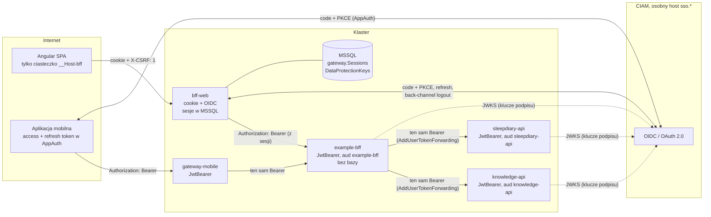
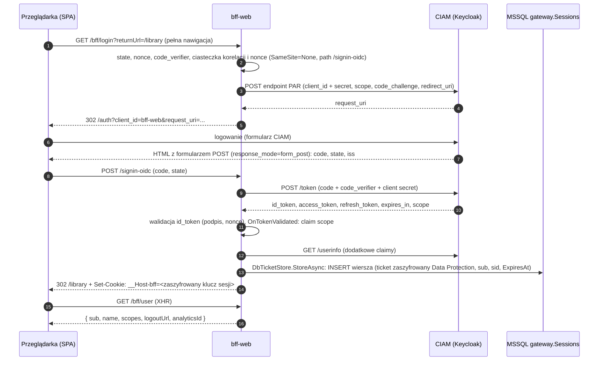
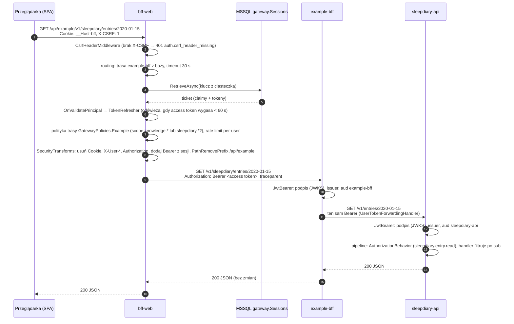
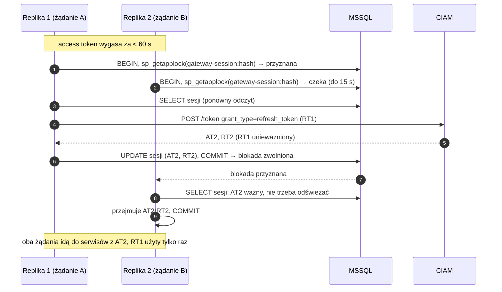
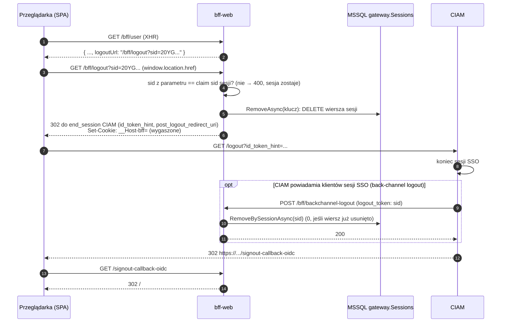

# 9. Bezpieczeństwo: uwierzytelnienie, sesje, autoryzacja, sekrety

**Czego się nauczysz:** jak w tym systemie działa logowanie OIDC, sesja BFF po stronie serwera, odświeżanie tokenów przy wielu
replikach, ochrona CSRF, wylogowanie (zwykłe i back-channel), gateway mobile, walidacja tokenów w każdym serwisie (zero trust),
trzy poziomy autoryzacji, scope i ich dodawanie, NetworkPolicy jako gwarancja izolacji experience, wywołania synchroniczne
(przekazany token użytkownika albo client credentials), obsługa sekretów, czego nigdy nie logować i przed jakimi zagrożeniami chroni
każdy mechanizm.

**Wymagania wstępne:** [1 Start](01-start.md) (lokalne środowisko z Keycloakiem), [2 Architektura w praktyce](02-architektura-w-praktyce.md),
[6 Warstwa aplikacji](06-warstwa-aplikacji.md) (pipeline behaviors), [8 API i kontrakty](08-api-i-kontrakty.md) (odpowiedzi błędów,
wywoływanie API lokalnie). Podstawowa znajomość OAuth 2.0 pomaga, ale najważniejsze pojęcia są wyjaśnione w 9.2.

> **W skrócie**
> - Brama brzegowa (profile `bff-web` i `gateway-mobile`) jest **wspólna dla całej super appki** i leży poza zakresem
>   experience. `SuperApp.Gateway` to jej lokalny zamiennik, a jego zachowanie opisane w 9.3 i 9.4 jest **specyfikacją wymagań** wobec
>   wspólnej bramy (ADR-0037).
> - Przeglądarka nie ma żadnego tokenu. Ma tylko ciasteczko `__Host-bff` (`HttpOnly`, `Secure`, `SameSite=Strict`) z zaszyfrowanym
>   kluczem sesji; sesja (claimy i tokeny) leży zaszyfrowana Data Protection w `gateway.Sessions` w MSSQL.
> - Logowanie: Authorization Code + PKCE (+ PAR, gdy CIAM go oferuje), klient poufny `bff-web`, bez `offline_access`.
>   Odświeżanie tokenu: raz na sesję w całym klastrze, pod blokadą `sp_getapplock`.
> - `/api/*` w BFF wymaga `X-CSRF: 1`; wylogowanie to nawigacja `GET /bff/logout?sid=...`; CIAM może zakończyć sesję
>   back-channel logoutem.
> - Za bramą krąży wyłącznie **access token wystawiony przez CIAM** (JWT, zakładany Keycloak), przekazywany bez zmian; brama nie
>   wystawia własnych tokenów, a BFF i serwisy ufają jednemu wystawcy.
> - BFF experience i każdy serwis same walidują JWT (podpis, issuer, **własne** audience: `example-bff`, `knowledge-api`,
>   `sleepdiary-api`). Brama usuwa `Cookie` i `X-User-*`; tożsamość tylko z tokenu.
> - Autoryzacja: brama „czy ma jakikolwiek scope experience” → `[RequiresScope]` na komendzie/zapytaniu w serwisie („czy może ten
>   rodzaj operacji”) → handler/agregat („czy może ten konkretny zasób”). Cudzy lub niewidoczny zasób = 404. API wewnętrzne BFF
>   wymaga dodatkowo scope `example.internal.read`.
> - Sekrety tylko z Vault / External Secrets jako zmienne środowiskowe; nigdy w repo ani `appsettings*.json`. Nigdy nie loguj tokenów,
>   sekretów, ciasteczek ani danych osobowych.
> - Wywołania synchroniczne w kontekście użytkownika przekazują **token użytkownika bez zmian** (`AddUserTokenForwarding`, tak woła
>   BFF); client credentials tylko dla wywołań systemowych (ADR-0040). Ruch do serwisów domenowych experience tylko od jej BFF i jej serwisów: gwarancją jest NetworkPolicy (ADR-0041).

Kod w blokach jest skopiowany z repozytorium; komentarze XML pominięto dla zwięzłości.

---

## 9.1 Obraz całości i granice zaufania



> **Brama a BFF experience (ADR-0037, ADR-0038).** Moduł (osadzony w shellu super appki) woła przez **wspólną bramę brzegową**
> wyłącznie API publiczne **BFF experience** (lokalnie: `SuperApp.Gateway` → `example-bff`, trasa `/api/example/v{n}/**`), a dopiero BFF woła
> serwisy domenowe swojej experience. Serwisy domenowe nie mają tras w bramie. „BFF” w nazwie 9.3 to historyczna nazwa profilu bramy
> `bff-web`, a nie BFF experience.

Zasady, które z tego wynikają (ADR-0006, ADR-0007, ADR-0012, ADR-0037–ADR-0041):

- Klienci nigdy nie wołają serwisów bezpośrednio. Moduł woła tylko API publiczne BFF swojej experience przez bramę brzegową.
- Ruch do domeny experience tylko przez jej BFF: serwisy domenowe przyjmują HTTP wyłącznie od BFF i serwisów tej samej experience,
  a BFF-y innych experience wołają tylko API wewnętrzne naszego BFF. Gwarancją jest NetworkPolicy
  ([9.5](#networkpolicy-ruch-do-domeny-tylko-przez-bff-experience)).
- Brama jest **pierwszą**, ale nie jedyną linią obrony: każdy serwis waliduje token tak, jakby bramy nie było.
- Przekierowania OIDC idą do CIAM pod osobnym hostem, nie przez bramę.
- CIAM i infrastrukturę (Ingress, NetworkPolicy, Vault, MSSQL) dostarczają inne działy (ADR-0016); zespół dostarcza kod, chart
  Helm i **wymagania**. Lokalnie CIAM-em jest Keycloak z realmem `deploy/local/keycloak/realm-superapp.json` (ADR-0031), który jest
  jednocześnie wzorcem wymagań dla działu CIAM.

---

## 9.2 OIDC i OAuth 2.0 w tym systemie

| Pojęcie | Znaczenie tutaj |
|---|---|
| CIAM | dostawca tożsamości (OIDC / OAuth 2.0); lokalnie Keycloak, realm `app`, issuer `http://localhost:8081/realms/superapp` |
| klient | aplikacja zarejestrowana w CIAM: `bff-web`, `mobile-android`, `mobile-ios`, `{serwis}-client`, lokalnie `dev-cli` |
| resource server | API, które przyjmuje tokeny: `example-bff`, `knowledge-api`, `sleepdiary-api`, `gateway-mobile`; definiuje **audience** |
| access token | JWT podpisany przez CIAM, ważny 5 minut (lokalnie `accessTokenLifespan: 300`); niesie `sub`, `scope`, `aud`, `sid` |
| ID token | JWT dla klienta (BFF) z informacją o zalogowaniu; nie służy do wywoływania API |
| refresh token | do uzyskania nowego access tokenu; związany z sesją SSO; rotowany (lokalnie `revokeRefreshToken: true`, `refreshTokenMaxReuse: 0`) |
| scope | co wolno zrobić; konwencja `{serwis}.{zasób}.{akcja}` (`knowledge.catalog.write`) |
| audience (`aud`) | do jakiego API jest token; jeden token ma listę audience wszystkich serwisów, o których scope poproszono (ADR-0012) |
| `sub` | stały identyfikator użytkownika; klucz właściciela danych (ulubione, wpisy dziennika) |
| `sid` | identyfikator sesji SSO w CIAM; łączy sesję BFF z back-channel logoutem i chroni `/bff/logout` |
| PKCE | `code_verifier`/`code_challenge` (S256): kod autoryzacyjny jest bezużyteczny bez sekretu znanego tylko inicjatorowi logowania |
| PAR | Pushed Authorization Request: parametry logowania wysyłane do CIAM kanałem serwer–serwer, przeglądarka dostaje tylko `request_uri` |
| back-channel logout | CIAM wywołuje serwer–serwer `POST /bff/backchannel-logout` z podpisanym `logout_token`, gdy kończy się sesja SSO |

Prawdziwy access token z lokalnego realmu (klient `dev-cli`, użytkownik `reader`, wybrane claimy):

```json
{
  "iss": "http://localhost:8081/realms/superapp",
  "aud": ["gateway-mobile", "example-bff", "sleepdiary-api", "knowledge-api", "account"],
  "sub": "accd5527-f904-4c13-b747-5cfe51a437e0",
  "azp": "dev-cli",
  "sid": "SDgFYfkO59aqfT1__IrxTVfL",
  "exp": 1790837806,
  "scope": "openid knowledge.catalog.read sleepdiary.entry.write profile email sleepdiary.entry.read",
  "name": "Czytelnik Testowy",
  "preferred_username": "reader"
}
```

Skąd się biorą elementy:

- **`aud`** dodają mappery audience przypięte do scope w realmie: każdy scope `knowledge.*` ma mapper `audience knowledge-api`,
  każdy `sleepdiary.*` mapper `audience sleepdiary-api`. Nie prosisz o audience, prosisz o scope. Token bez scope serwisu nie ma
  jego audience i serwis go odrzuci (401). `gateway-mobile` dodaje mapper klientów mobilnych i `dev-cli`, a `example-bff` client
  scope `example-bff-audience`, domyślny dla `bff-web`, `mobile-android`, `mobile-ios` i `dev-cli` (ADR-0040).
- **`example.internal.read`** (scope API wewnętrznego BFF, ADR-0039) jest w realmie opcjonalnym scope tylko klienta `dev-cli`;
  w docelowym CIAM dostają go klienci innych experience, które pokazują dane Example.
- **`scope`** zawiera tylko to, o co klient poprosił **i** co mu wolno. `reader` poprosił o `knowledge.catalog.write`, ale go nie
  dostał: scope ma w realmie mapowanie na rolę `knowledge-editor` (`scopeMappings`), więc Keycloak wydaje go tylko użytkownikom
  z tą rolą.

Klienci w lokalnym realmie (wzorzec wymagań dla CIAM, ADR-0016, ADR-0031):

| Klient | Typ | Przepływ | Istotne ustawienia |
|---|---|---|---|
| `bff-web` | poufny (sekret) | Authorization Code + PKCE S256 | redirect `https://localhost:5001/signin-oidc`, post-logout `https://localhost:5001/signout-callback-oidc`, back-channel logout `http://host.docker.internal:5000/bff/backchannel-logout` z wymaganym `sid`, scope serwisów jako opcjonalne |
| `mobile-android`, `mobile-ios` | publiczny | Authorization Code + PKCE S256 | redirect `com.example.app:/oauth2redirect`, audience `gateway-mobile` i `example-bff` |
| `knowledge-api`, `sleepdiary-api`, `gateway-mobile` | resource server | brak | tylko nazwy audience; audience `example-bff` pochodzi z client scope `example-bff-audience`, bez osobnego klienta |
| `knowledge-client`, `sleepdiary-client` | poufny | client credentials | serwis ↔ serwis (9.8) |
| `dev-cli` | publiczny | grant hasłem | **wyłącznie lokalnie**, do pobierania tokenów w testach; audience `gateway-mobile` i `example-bff`, opcjonalnie scope `example.internal.read` |

---

## 9.3 BFF web

### Dlaczego BFF, a nie tokeny w przeglądarce

Token w przeglądarce (pamięć JS, `localStorage`) jest dostępny dla każdego skryptu na stronie: jedna podatność XSS albo złośliwa
zależność npm i token wycieka, a z nim dostęp do API do czasu wygaśnięcia (refresh token: na długo). W modelu BFF przeglądarka ma
tylko ciasteczko `HttpOnly`, którego JavaScript nie przeczyta; tokeny są na serwerze, a BFF dokłada access token do żądań
przekazywanych do serwisów (ADR-0006, ADR-0011). XSS nadal pozwala wykonywać żądania w imieniu użytkownika, dopóki karta jest
otwarta, ale nie pozwala wynieść poświadczeń.

### Konfiguracja

`src/Gateway/SuperApp.Gateway/Program.cs`, metoda `AddBffWeb`:

```csharp
static void AddBffWeb(WebApplicationBuilder builder)
{
    builder.Services.AddGatewayDataProtection(builder.Configuration, builder.Environment);

    builder.Services.AddHttpClient(TokenRefresher.HttpClientName);
    builder.Services.AddSingleton<TokenRefresher>();
    builder.Services.AddSingleton<DbTicketStore>();
    builder.Services.AddSingleton<IPostConfigureOptions<CookieAuthenticationOptions>, TicketStoreCookieSetup>();
    builder.Services.AddHostedService<SessionCleanupService>();

    builder.Services
        .AddAuthentication(options =>
        {
            // No session on /api/* or /bff/user means 401 for the SPA (never a 302 to the CIAM, which an XHR cannot follow);
            // the redirect to the CIAM login page happens only through /bff/login.
            options.DefaultScheme = CookieAuthenticationDefaults.AuthenticationScheme;
            options.DefaultChallengeScheme = CookieAuthenticationDefaults.AuthenticationScheme;
            options.DefaultSignOutScheme = OpenIdConnectDefaults.AuthenticationScheme;
        })
        .AddCookie(options =>
        {
            options.Cookie.Name = "__Host-bff";
            options.Cookie.HttpOnly = true;
            options.Cookie.SecurePolicy = CookieSecurePolicy.Always;
            options.Cookie.SameSite = SameSiteMode.Strict;
            options.Cookie.Path = "/";
            options.ExpireTimeSpan = builder.Configuration.GetValue("Gateway:SessionLifetime", TimeSpan.FromHours(8));
            options.SlidingExpiration = true;
            options.Events.OnValidatePrincipal = context =>
                context.HttpContext.RequestServices.GetRequiredService<TokenRefresher>().ValidatePrincipalAsync(context);
            options.Events.OnRedirectToLogin = context => Reject(context.Response, StatusCodes.Status401Unauthorized);
            options.Events.OnRedirectToAccessDenied = context => Reject(context.Response, StatusCodes.Status403Forbidden);
        })
        .AddOpenIdConnect(options =>
        {
            builder.Configuration.GetSection("Authentication").Bind(options);
            options.ResponseType = "code";
            options.UsePkce = true;
            options.SaveTokens = true;
            options.MapInboundClaims = false;
            options.GetClaimsFromUserInfoEndpoint = true;
            options.TokenValidationParameters.NameClaimType = "name";
            // No offline_access: the refresh token stays bound to the CIAM SSO session, so logging out in the CIAM
            // (back-channel logout) also ends the BFF session. An offline token would survive the logout (ADR-0011).
            foreach (var scope in builder.Configuration.GetSection("Authentication:Scopes").Get<string[]>() ?? [])
            {
                options.Scope.Add(scope);
            }

            // The granted scope from the token response is stored as a "scope" claim in the session, so the per-route policies
            // (GatewayPolicies) evaluate the same claim as in gateway-mobile, where it comes from the JWT.
            options.Events.OnTokenValidated = context =>
            {
                if (context.TokenEndpointResponse?.Scope is { Length: > 0 } scope && context.Principal?.Identity is ClaimsIdentity identity)
                {
                    identity.AddClaim(new Claim("scope", scope));
                }

                return Task.CompletedTask;
            };
        });
}
```

Ustawienia ciasteczka i dlaczego takie:

| Ustawienie | Chroni przed |
|---|---|
| nazwa z prefiksem `__Host-` | przeglądarka przyjmie je tylko z `Secure`, `Path=/` i **bez** `Domain`: subdomena nie może go nadpisać ani podrzucić (cookie tossing) |
| `HttpOnly` | odczytem przez JavaScript (XSS nie wyniesie identyfikatora sesji) |
| `Secure` (`CookieSecurePolicy.Always`) | wysłaniem przez HTTP; dlatego lokalnie BFF działa na `https://localhost:5001` |
| `SameSite=Strict` | wysłaniem przy żądaniu zainicjowanym z innej witryny (CSRF, część ochrony) |
| sesja po stronie serwera | dużym ciasteczkiem z tokenami; sesję da się unieważnić usunięciem wiersza |
| `ExpireTimeSpan` 8 h + sliding | sesja żyje do 8 h od ostatniej aktywności, ale i tak nie dłużej niż sesja SSO w CIAM (odświeżenie przestaje działać) |
| `OnRedirectToLogin` → 401 | XHR nie potrafi pójść za 302 do CIAM; SPA dostaje 401 i sama robi pełne przejście na `/bff/login` |

Konfiguracja OIDC pochodzi z sekcji `Authentication` (`Authority`, `ClientId`, `ClientSecret`, `Scopes`). Lokalnie: Authority
w `appsettings.Development.json`, reszta w `Properties/launchSettings.json` (profil `bff-web`) albo w zmiennych usługi `bff-web`
w `deploy/local/docker-compose.yml`; na klastrze z chartu `deploy/helm/superapp-gateway` (lista scope w `values-bff-web.yaml`,
sekret klienta w Secrecie z External Secrets).

### Logowanie



Szczegóły, które warto znać:

- **Wejście tylko przez `/bff/login`.** `returnUrl` musi być ścieżką lokalną (`/…`, nie `//…` ani `/\…`); inaczej BFF przekierowuje
  na `/` (ochrona przed open redirect, `BffEndpoints.IsLocalUrl`).
- **PKCE** jest włączone jawnie (`UsePkce = true`); w realmie `bff-web` wymaga metody `S256`.
- **PAR** nie jest ustawiany w kodzie: handler OIDC w .NET używa go domyślnie, gdy dokument discovery CIAM ogłasza endpoint PAR
  (Keycloak to robi). Widać to w odpowiedzi `/bff/login`: `Location` zawiera tylko `client_id` i `request_uri`, bez scope i
  `code_challenge`. Jeśli dział CIAM udostępnia PAR, działa automatycznie; jeśli nie, logowanie przechodzi klasycznym przekierowaniem.
- **`form_post`**: CIAM odsyła kod formularzem POST, a nie w URL (kod nie trafia do historii przeglądarki ani logów proxy). Dlatego
  ciasteczka korelacji i nonce mają `SameSite=None`: POST przychodzi z innej witryny (CIAM). Ciasteczko sesji ma `SameSite=Strict`,
  więc pierwsza nawigacja po przekierowaniu z CIAM może przyjść bez niego; SPA sprawdza sesję przez `/bff/user` (XHR z tej samej
  witryny), co działa poprawnie.
- **`SaveTokens = true`** zapisuje `access_token`, `refresh_token`, `id_token`, `expires_at` w `AuthenticationProperties` ticketu,
  czyli w sesji w bazie, nie w ciasteczku.
- **Claim `scope`**: dla przeglądarki nie ma JWT, więc polityki bramy nie miałyby czego sprawdzić. `OnTokenValidated` kopiuje
  przyznane scope z odpowiedzi tokenów do claimu `scope` sesji; `GatewayPolicies` czyta ten sam claim co w gateway mobile.
- **`MapInboundClaims = false`**: claimy mają nazwy z tokenu (`sub`, `name`, `sid`), nie długie URI z `ClaimTypes`.

Odpowiedź `/bff/user` (prawdziwa, użytkownik `reader`):

```json
{"sub":"accd5527-f904-4c13-b747-5cfe51a437e0","name":"Czytelnik Testowy",
 "scopes":["openid","knowledge.catalog.read","knowledge.library.write","sleepdiary.entry.write","profile","knowledge.library.read","email","sleepdiary.entry.read"],
 "logoutUrl":"/bff/logout?sid=20YGMKpLdb-xJo3pDwDT8LOA","analyticsId":null}
```

`scopes` służy SPA wyłącznie do ukrywania niedostępnych elementów interfejsu. Decyzję o dostępie zawsze podejmuje serwis.

### Sesja po stronie serwera: `DbTicketStore`

Z `SessionStore` ustawionym przez `TicketStoreCookieSetup` handler ciasteczek zapisuje w ciasteczku tylko klucz sesji (zaszyfrowany
Data Protection), a cały ticket oddaje do `ITicketStore`:

```csharp
internal sealed class TicketStoreCookieSetup(DbTicketStore ticketStore) : Microsoft.Extensions.Options.IPostConfigureOptions<CookieAuthenticationOptions>
{
    public void PostConfigure(string? name, CookieAuthenticationOptions options) => options.SessionStore = ticketStore;
}
```

Wiersz `gateway.Sessions` (`SuperApp.Gateway.Persistence.Entities.Session`): `Id` (64 znaki hex, 32 losowe bajty), `Value` (zaszyfrowany
ticket: claimy i tokeny), `ExpiresAt`, `Subject` (`sub`), `SessionId` (`sid`), `UpdatedAt`. `Subject` i `SessionId` są jawnymi
kopiami claimów z indeksami, żeby back-channel logout znalazł sesje bez odszyfrowywania.

Odczyt przy **każdym** żądaniu z ciasteczkiem (`src/Gateway/SuperApp.Gateway/Bff/Sessions/DbTicketStore.cs`):

```csharp
public async Task<AuthenticationTicket?> RetrieveAsync(string key)
{
    await using var scope = scopeFactory.CreateAsyncScope();
    var db = scope.ServiceProvider.GetRequiredService<GatewayDbContext>();

    var session = await db.Sessions.AsNoTracking().FirstOrDefaultAsync(row => row.Id == key);
    if (session is null || session.ExpiresAt <= timeProvider.GetUtcNow())
    {
        return null;
    }

    var ticket = Unprotect(session);
    if (ticket is not null)
    {
        ticket.Properties.Items[SessionKeyItem] = key;
    }

    return ticket;
}
```

`null` oznacza „brak sesji” (usunięta, wygasła albo nie da się jej odszyfrować) i żądanie jest anonimowe, więc SPA dostaje 401.
Usunięcie wiersza natychmiast kończy sesję na wszystkich replikach: nie ma cache ticketu.

Zapis istniejącej sesji (odnowienie przy sliding expiration) idzie pod blokadą i **nigdy nie cofa tokenów**:

```csharp
public async Task RenewAsync(string key, AuthenticationTicket ticket)
{
    await using var scope = scopeFactory.CreateAsyncScope();
    var db = scope.ServiceProvider.GetRequiredService<GatewayDbContext>();
    await using var transaction = await db.Database.BeginTransactionAsync();
    if (!await TryLockSessionAsync(db, key, CancellationToken.None))
    {
        throw new TimeoutException($"Nie uzyskano blokady sesji BFF w czasie {LockTimeout}.");
    }

    var session = await db.Sessions.FindAsync(key);
    if (session is null)
    {
        session = new Session { Id = key };
        db.Sessions.Add(session);
    }
    else if (Unprotect(session) is { } stored && ExpiresAt(stored) > ExpiresAt(ticket))
    {
        ticket.Properties.StoreTokens(stored.Properties.GetTokens());
    }

    Write(session, ticket);
    await db.SaveChangesAsync();
    await transaction.CommitAsync();
}

private static async Task<bool> TryLockSessionAsync(GatewayDbContext db, string key, CancellationToken cancellationToken)
{
    var resource = "gateway-session:" + Convert.ToHexString(SHA256.HashData(Encoding.ASCII.GetBytes(key)), 0, 16);
    var lockResult = new SqlParameter("@result", SqlDbType.Int) { Direction = ParameterDirection.Output };
    await db.Database.ExecuteSqlRawAsync(
        "EXEC @result = sp_getapplock @Resource = @resource, @LockMode = 'Exclusive', @LockOwner = 'Transaction', @LockTimeout = @timeout",
        [lockResult, new SqlParameter("@resource", resource), new SqlParameter("@timeout", (int)LockTimeout.TotalMilliseconds)],
        cancellationToken);
    return (int)lockResult.Value >= 0;
}
```

Po co ta ostrożność: żądanie A wczytało ticket, potem replika B odświeżyła tokeny (nowy refresh token, stary unieważniony
przez rotację). Gdyby A zapisało swój ticket przy odnowieniu, przywróciłoby **stary** refresh token, a następne odświeżenie
skończyłoby się odrzuceniem przez CIAM i wylogowaniem. Dlatego pod blokadą wiersz jest czytany ponownie i zostają tokeny
o późniejszym `expires_at`. Nazwa zasobu blokady zawiera skrót klucza, nie klucz, więc identyfikator sesji nie pojawia się
w diagnostyce SQL Servera (`sys.dm_tran_locks`).

Wygasłe wiersze usuwa `SessionCleanupService` co 10 minut; uruchamiają go wszystkie repliki, ale pracuje ta, która zdobędzie blokadę
`gateway-session-cleanup` (`sp_getapplock` bez czekania).

### Data Protection: wspólne klucze replik

Data Protection szyfruje ciasteczko sesji, ciasteczka korelacji/nonce OIDC i tickety w `gateway.Sessions`. Wszystkie repliki
muszą mieć te same klucze, inaczej żądanie trafiające do innego poda nie odczyta ciasteczka i użytkownik zostanie wylogowany.
`src/Gateway/SuperApp.Gateway/Bff/DataProtection/GatewayDataProtection.cs`:

```csharp
public static IDataProtectionBuilder AddGatewayDataProtection(this IServiceCollection services, IConfiguration configuration, IHostEnvironment environment)
{
    var builder = services.AddDataProtection()
        .SetApplicationName(ApplicationName)
        .PersistKeysToDbContext<GatewayDbContext>();

    var certificatePath = configuration["DataProtection:CertificatePath"];
    if (string.IsNullOrWhiteSpace(certificatePath))
    {
        return environment.IsDevelopment()
            ? builder
            : throw new InvalidOperationException(
                "Klucze Data Protection muszą być szyfrowane certyfikatem: ustaw DataProtection:CertificatePath (ADR-0013).");
    }

    var password = configuration["DataProtection:CertificatePassword"];
    builder.ProtectKeysWithCertificate(X509CertificateLoader.LoadPkcs12FromFile(certificatePath, password));

    var previous = configuration.GetSection("DataProtection:PreviousCertificatePaths").Get<string[]>() ?? [];
    if (previous.Length > 0)
    {
        builder.UnprotectKeysWithAnyCertificate([.. previous.Select(path => X509CertificateLoader.LoadPkcs12FromFile(path, password))]);
    }

    return builder;
}
```

- `ApplicationName = "superapp-gateway-bff-web"`: zmiana nazwy unieważnia wszystkie sesje.
- Klucze są w tabeli bramy w MSSQL; poza środowiskiem Development **muszą** być zaszyfrowane certyfikatem (bez
  `DataProtection:CertificatePath` aplikacja nie wystartuje). Chart montuje certyfikat z Secretu `dataProtection.certificateSecretName`
  pod `/var/run/secrets/data-protection/certificate.pfx`, hasło przychodzi z Secretu aplikacji.
- Rotacja certyfikatu: nowy w `CertificatePath`, stare w `PreviousCertificatePaths`, dopóki istnieją klucze nimi zaszyfrowane.
- Utrata kluczy (np. wyczyszczona tabela) = wszystkie sesje nieczytelne = wszyscy wylogowani. Nie jest to luka, ale awaria.

### Wywołanie API przez bramę `bff-web`



**CSRF.** `src/Gateway/SuperApp.Gateway/Bff/Security/CsrfHeaderMiddleware.cs`:

```csharp
internal sealed class CsrfHeaderMiddleware(RequestDelegate next)
{
    public Task InvokeAsync(HttpContext context)
    {
        if (context.Request.Path.StartsWithSegments("/api", StringComparison.OrdinalIgnoreCase) && context.Request.Headers["X-CSRF"] != "1")
        {
            context.Response.StatusCode = StatusCodes.Status401Unauthorized;
            return Task.CompletedTask;
        }

        return next(context);
    }
}
```

Ciasteczko przeglądarka dołącza sama, więc BFF musi wiedzieć, że żądanie pochodzi z naszej SPA. Własnego nagłówka nie doda formularz
HTML ani link z innej strony, a skrypt z innego originu potrzebowałby preflightu CORS, na który brama nie zezwala (nie ma konfiguracji
CORS). Razem z `SameSite=Strict` blokuje to CSRF. Sprawdzenie obejmuje **każdą** metodę na `/api/*`, także `GET` (odczyt też może
mieć skutki, np. oznaczenie jako przeczytane). Middleware działa przed routingiem i uwierzytelnieniem, więc żądanie bez nagłówka nie
kosztuje nawet odczytu sesji z bazy.

**Transformy bezpieczeństwa.** `src/Gateway/SuperApp.Gateway/Proxy/Transforms/SecurityTransforms.cs` (stosowane do każdej trasy obu
profili; nie da się ich wyłączyć konfiguracją w bazie):

```csharp
public static void Apply(TransformBuilderContext context, string profile)
{
    context.AddRequestHeaderRemove("Cookie");
    context.AddRequestTransform(transform =>
    {
        var identityHeaders = transform.ProxyRequest.Headers
            .Select(header => header.Key)
            .Where(name => name.StartsWith("X-User-", StringComparison.OrdinalIgnoreCase))
            .ToList();
        identityHeaders.ForEach(name => transform.ProxyRequest.Headers.Remove(name));
        return ValueTask.CompletedTask;
    });

    if (profile == GatewayProfiles.BffWeb)
    {
        // The browser holds no tokens; the BFF attaches the access token from the server-side session.
        context.AddRequestTransform(async transform =>
        {
            transform.ProxyRequest.Headers.Authorization = null;
            var accessToken = await transform.HttpContext.GetTokenAsync("access_token");
            if (accessToken is not null)
            {
                transform.ProxyRequest.Headers.Authorization = new AuthenticationHeaderValue("Bearer", accessToken);
            }
        });
    }
}
```

- `Cookie` nie trafia do serwisów: identyfikator sesji BFF zostaje w BFF.
- `X-User-*` jest usuwany, żeby nikt nie podrobił nagłówka tożsamości, nawet gdyby jakiś serwis błędnie go czytał.
- W `bff-web` nagłówek `Authorization` z przeglądarki jest **zastępowany** tokenem z sesji: przeglądarka nie może podsunąć własnego tokenu.

### Odświeżanie tokenu

Access token żyje 5 minut, sesja do 8 godzin. `TokenRefresher` jest podpięty pod `OnValidatePrincipal`, więc działa przy każdym
żądaniu z sesją, ale wywołuje CIAM tylko wtedy, gdy do wygaśnięcia zostało mniej niż 60 sekund.
`src/Gateway/SuperApp.Gateway/Bff/Tokens/TokenRefresher.cs`:

```csharp
public async Task ValidatePrincipalAsync(CookieValidatePrincipalContext context)
{
    if (!NeedsRefresh(context.Properties)
        || !context.Properties.Items.TryGetValue(DbTicketStore.SessionKeyItem, out var sessionKey)
        || sessionKey is null)
    {
        return;
    }

    var refresh = _inFlight.GetOrAdd(sessionKey, key => new Lazy<Task<RefreshOutcome>>(() => RefreshSessionAsync(key)));
    RefreshOutcome outcome;
    try
    {
        outcome = await refresh.Value;
    }
    finally
    {
        _inFlight.TryRemove(new KeyValuePair<string, Lazy<Task<RefreshOutcome>>>(sessionKey, refresh));
    }

    if (outcome.Tokens is { } tokens)
    {
        context.Properties.StoreTokens(tokens);
    }
    else if (outcome.SignOut)
    {
        context.RejectPrincipal();
        await context.HttpContext.SignOutAsync(CookieAuthenticationDefaults.AuthenticationScheme);
    }
}

private async Task<RefreshOutcome> RefreshSessionAsync(string sessionKey)
{
    using var timeout = new CancellationTokenSource(RefreshTimeout, timeProvider);
    IReadOnlyList<AuthenticationToken>? tokens = null;
    try
    {
        var locked = await ticketStore.UpdateExclusiveAsync(
            sessionKey,
            async (stored, cancellationToken) =>
            {
                if (stored is null)
                {
                    return null;
                }

                if (!NeedsRefresh(stored.Properties))
                {
                    // Another replica (or an earlier request) has already refreshed the session: take over its tokens.
                    tokens = stored.Properties.GetTokens().ToList();
                    return null;
                }

                var refreshed = await RequestTokensAsync(stored.Properties.GetTokenValue("refresh_token")!, cancellationToken);
                if (refreshed is null)
                {
                    return null;
                }

                stored.Properties.UpdateTokenValue("access_token", refreshed.AccessToken);
                stored.Properties.UpdateTokenValue("expires_at", refreshed.ExpiresAt.ToString("o", CultureInfo.InvariantCulture));
                if (refreshed.RefreshToken is not null)
                {
                    stored.Properties.UpdateTokenValue("refresh_token", refreshed.RefreshToken);
                }

                tokens = stored.Properties.GetTokens().ToList();
                return stored;
            },
            timeout.Token);

        if (!locked)
        {
            LogSessionLocked(logger, DbTicketStore.LockTimeout);
            return new RefreshOutcome(null, SignOut: false);
        }
    }
    catch (OperationCanceledException) when (timeout.IsCancellationRequested)
    {
        LogRefreshTimedOut(logger, RefreshTimeout);
        return new RefreshOutcome(null, SignOut: false);
    }

    return new RefreshOutcome(tokens, SignOut: tokens is null);
}
```

Dlaczego tak skomplikowanie: CIAM rotuje refresh tokeny i drugie użycie tego samego refresh tokenu traktuje jak kradzież (kończy
sesję). SPA wysyła kilka żądań naraz, a load balancer rozrzuca je po replikach. Bez koordynacji dwie repliki odświeżyłyby tym samym
tokenem i użytkownik zostałby wylogowany w losowym momencie. Dwa poziomy ochrony (ADR-0011, ADR-0013):

1. **W replice:** `_inFlight` (single-flight per klucz sesji): równoległe żądania jednej sesji czekają na jedno odświeżenie.
2. **Między replikami:** `UpdateExclusiveAsync` trzyma blokadę `sp_getapplock` sesji, czyta zapisany ticket **ponownie** i woła CIAM
   tylko, jeśli token nadal wymaga odświeżenia; jeśli inna replika już to zrobiła, przejmuje jej tokeny. Nowe tokeny są zapisywane
   przed zwolnieniem blokady.



Zachowanie przy błędach:

| Sytuacja | Skutek | Log |
|---|---|---|
| CIAM odrzucił odświeżenie (np. sesja SSO wygasła po 30 min bezczynności lub zakończona w CIAM) | sesja wylogowana, SPA dostaje 401 i przechodzi na `/bff/login` | 3101 `BFF token refresh rejected by CIAM with status {StatusCode}` |
| odpowiedź nieczytelna, błąd HTTP | sesja wylogowana | 3102 |
| blokada nieprzyznana w 15 s | sesja zostaje, żądanie idzie z obecnym tokenem, kolejne spróbuje ponownie | 3103 |
| odświeżenie trwa > 10 s | jak wyżej | 3104 |
| sesja bez refresh tokenu | nigdy nie jest odświeżana; po wygaśnięciu access tokenu serwisy zwracają 401 | brak |

Wspólne odświeżenie ma własny limit czasu (`RefreshTimeout` 10 s, krótszy niż `LockTimeout` 15 s) i nie zależy od żądania,
które je rozpoczęło: przerwanie tego żądania nie psuje pozostałych (test
`GatewayDatabaseTests.Aborting_the_request_that_started_a_refresh_does_not_fail_the_others`).

### Dlaczego bez `offline_access`

`offline_access` daje refresh token offline: CIAM tworzy dla niego osobną sesję offline, niezależną od sesji SSO. Wylogowanie
w CIAM (albo przez administratora) jej nie kończy, back-channel logout nie dotyczy BFF, a BFF mógłby odświeżać tokeny jeszcze przez
tygodnie (lokalnie `offlineSessionIdleTimeout` to 30 dni). Bez `offline_access` refresh token jest związany z sesją SSO, więc koniec
sesji SSO kończy też możliwość odświeżenia, a tym samym sesję BFF. Sesja BFF i tak nie powinna żyć dłużej niż SSO (ADR-0011).
Lokalny realm nie ma `offline_access` na liście scope opcjonalnych klienta `bff-web`, więc CIAM nie wyda go nawet na żądanie; nie dodawaj
go ani do `Authentication:Scopes`, ani z powrotem do realmu. To samo jest wymaganiem wobec wspólnej bramy i działu CIAM (ADR-0037).
Klienci mobilni nadal mają go w scope opcjonalnych; o tym, czy moduł w shellu super appki dostaje refresh token offline, decyduje
shell.

### Wylogowanie i back-channel logout

`GET /bff/logout?sid={sid}` jest **nawigacją** przeglądarki (`window.location.href = logoutUrl`), nie XHR: tylko nawigacja może
pójść za przekierowaniem 302 do endpointu end-session CIAM (inny origin). Nawigacja nie wyśle `X-CSRF`, więc ochroną przed CSRF
(wylogowaniem użytkownika przez obcą stronę) jest parametr `sid`, który musi być równy claimowi `sid` sesji. Obca strona go nie zna.
`src/Gateway/SuperApp.Gateway/Bff/BffEndpoints.cs`:

```csharp
internal static IResult Logout(HttpContext context, string? sid)
{
    if (context.User.Identity?.IsAuthenticated != true)
    {
        return Results.Redirect("/");
    }

    var sessionSid = context.User.FindFirst("sid")?.Value;
    if (sid is null || sessionSid is null
        || !CryptographicOperations.FixedTimeEquals(Encoding.UTF8.GetBytes(sid), Encoding.UTF8.GetBytes(sessionSid)))
    {
        return Results.BadRequest();
    }

    return Results.SignOut(
        new AuthenticationProperties { RedirectUri = "/" },
        [CookieAuthenticationDefaults.AuthenticationScheme, OpenIdConnectDefaults.AuthenticationScheme]);
}
```

Porównanie w czasie stałym (`FixedTimeEquals`) nie zdradza przez czas odpowiedzi, ile znaków `sid` się zgadza. Wariantu `POST`
nie ma. Sesja bez claimu `sid` (CIAM go nie wydał) nie ma `logoutUrl` i nie da się jej wylogować przez BFF, dlatego wydawanie `sid`
w ID tokenie jest wymaganiem wobec CIAM (ADR-0011, ADR-0016).

Back-channel logout: CIAM, kończąc sesję SSO (wylogowanie z innej aplikacji, przez administratora, wygaśnięcie), wysyła
`POST /bff/backchannel-logout` z `logout_token`. Endpoint jest anonimowy i bez CSRF, a zaufanie bierze się z walidacji tokenu:

```csharp
var options = oidcOptions.Get(OpenIdConnectDefaults.AuthenticationScheme);
var configuration = await options.ConfigurationManager!.GetConfigurationAsync(context.RequestAborted);
var validation = await new JsonWebTokenHandler().ValidateTokenAsync(logoutToken, new TokenValidationParameters
{
    ValidIssuer = configuration.Issuer,
    ValidAudience = options.ClientId,
    IssuerSigningKeys = configuration.SigningKeys,
    ValidateLifetime = true,
});

if (!validation.IsValid
    || validation.ClaimsIdentity.FindFirst("nonce") is not null
    || validation.ClaimsIdentity.FindFirst("events")?.Value.Contains(BackchannelLogoutEvent, StringComparison.Ordinal) != true)
{
    LogInvalidLogoutToken(logger);
    return Results.BadRequest();
}

var sessionId = validation.ClaimsIdentity.FindFirst("sid")?.Value;
var subject = validation.ClaimsIdentity.FindFirst("sub")?.Value;
if (sessionId is null && subject is null)
{
    return Results.BadRequest();
}

var removed = await ticketStore.RemoveBySessionAsync(sessionId, subject, context.RequestAborted);
LogSessionsRevoked(logger, removed);
return Results.Ok();
```

Walidacja zgodna z OIDC Back-Channel Logout 1.0: podpis kluczami CIAM, issuer, audience = `bff-web`, ważność, brak `nonce` (odróżnia
logout token od ID tokenu) i zdarzenie back-channel logout w `events`. Usuwane są sesje danego `sid`; tylko gdy CIAM przyśle samo
`sub`, wszystkie sesje użytkownika.



Lokalnie Keycloak wysyła back-channel logout na `http://host.docker.internal:5000/bff/backchannel-logout`: port 5000 to HTTP bramy
z IDE (`launchSettings.json`) albo z kontenera (`5000:8080` w compose), więc działa w obu trybach, ale nie jednocześnie.

### Endpointy `/bff/*`

| Endpoint | Dostęp | Zachowanie |
|---|---|---|
| `GET /bff/login?returnUrl=/ścieżka` | anonimowy | 302 do CIAM; po zalogowaniu sesja i 302 na `returnUrl` (tylko ścieżki lokalne) |
| `GET /bff/user` | sesja | `{ sub, name, scopes, logoutUrl, analyticsId }` albo 401; nigdy tokeny; `analyticsId` to pseudonim dla PostHog albo `null` ([21.3](21-analityka-i-feature-flags.md#213-pseudonim-analityczny)) |
| `GET /bff/logout?sid=...` | anonimowy (sprawdza sesję sam) | bez sesji 302 `/`; zły/brak `sid` 400; poprawny: wylogowanie i 302 do CIAM |
| `POST /bff/backchannel-logout` | anonimowy, bez antiforgery i CSRF | walidacja `logout_token`, usunięcie sesji; 200 albo 400 |

---

## 9.4 Gateway mobile

Aplikacje mobilne to klienci publiczni (`mobile-android`, `mobile-ios`): nie mogą przechować sekretu, więc logują się Authorization
Code + PKCE w **systemowej przeglądarce** (AppAuth-Android, AppAuth-iOS), a przekierowanie wraca przez custom scheme / App Links /
Universal Links. Tokeny przechowuje aplikacja (bezpieczny magazyn systemu); odświeża je sama. Aplikacji mobilnych nie ma jeszcze
w repozytorium (`mobile/`), realm zawiera już ich klientów.

Brama w profilu `gateway-mobile` tylko waliduje token i przekazuje go dalej **bez zmian** (`Program.cs`):

```csharp
static void AddGatewayMobile(WebApplicationBuilder builder) =>
    builder.Services
        .AddAuthentication(JwtBearerDefaults.AuthenticationScheme)
        .AddJwtBearer(options =>
        {
            builder.Configuration.GetSection("Authentication").Bind(options);
            options.MapInboundClaims = false;
            options.TokenValidationParameters.ClockSkew = HostingExtensions.TokenClockSkew;
        });
```

- Audience bramy to `gateway-mobile` (`Authentication__Audience` w `launchSettings.json`, compose i `values-gateway-mobile.yaml`).
  Klienci mobilni mają w realmie mapper dodający `gateway-mobile` do `aud`. Token wydany dla `bff-web` nie ma tego audience
  i gateway mobile go odrzuci.
- Polityki tras są te same co w profilu `bff-web` (`GatewayPolicies.Example`), na claimie `scope` z JWT.
- CSRF nie dotyczy: przeglądarka nigdy sama nie dołącza nagłówka `Authorization`.
- Ten sam token idzie do BFF experience, a od niego do serwisu; każdy waliduje go ponownie (własne audience).

---

## 9.5 Zero trust: każdy serwis waliduje token

`AddAppApi` (`src/Framework/SuperApp.Framework.Infrastructure/Hosting/HostingExtensions.cs`):

```csharp
builder.Services.AddHttpContextAccessor();
builder.Services.TryAddScoped<ICurrentUser, HttpCurrentUser>();

builder.Services
    .AddAuthentication(JwtBearerDefaults.AuthenticationScheme)
    .AddJwtBearer(options =>
    {
        builder.Configuration.GetSection("Authentication").Bind(options);
        options.MapInboundClaims = false;
        options.TokenValidationParameters.ValidateAudience = true;
        options.TokenValidationParameters.ValidateIssuer = true;
        options.TokenValidationParameters.ClockSkew = TokenClockSkew;
    });

builder.Services.AddAuthorizationBuilder()
    .SetFallbackPolicy(new Microsoft.AspNetCore.Authorization.AuthorizationPolicyBuilder().RequireAuthenticatedUser().Build());
```

| Sprawdzenie | Skąd | Lokalnie |
|---|---|---|
| podpis | klucze JWKS z dokumentu discovery `Authentication:Authority`; odświeżane automatycznie przy rotacji kluczy CIAM | `http://localhost:8081/realms/superapp` (z kontenera `http://keycloak:8080/realms/superapp`, issuer ten sam dzięki `KC_HOSTNAME`) |
| issuer | z discovery, wymuszone `ValidateIssuer = true` | `http://localhost:8081/realms/superapp` |
| audience | `Authentication:Audience` = własne `{serwis}-api` albo `{experience}-bff`, wymuszone `ValidateAudience = true` | `knowledge-api`, `sleepdiary-api`, `example-bff` (`appsettings.json`; na klastrze z chartu: `Authentication__Audience` = nazwa Deploymentu, w `superapp-bff` `{experience}-bff`) |
| ważność | `exp`/`nbf` z tolerancją `ClockSkew` 30 s (`HostingExtensions.TokenClockSkew`) zamiast domyślnych 5 min; ta sama wartość w lokalnej bramie mobilnej i jako wymaganie wobec wspólnej bramy | |
| HTTPS metadanych | `RequireHttpsMetadata: true` w `appsettings.json`; `false` tylko w `appsettings.Development.json` i compose | |

Serwis akceptuje token z listą audience, jeśli jest na niej **jego** audience. Token dla samego SleepDiary nie otworzy Knowledge:

```http
HTTP/1.1 401 Unauthorized
WWW-Authenticate: Bearer error="invalid_token", error_description="The audience '(null)' is invalid"
```

(Biblioteka ukrywa wartości z tokenu w komunikatach, stąd `(null)`.)

Dlaczego każdy serwis, skoro brama już sprawdziła: ruch wewnątrz klastra nie jest z definicji zaufany (błędna NetworkPolicy, przejęty
pod, port-forward administratora). Serwis, który ufa bramie, przyjmie wszystko, co do niego dotrze. Dodatkowe zabezpieczenia:

- **Brak zaufania do nagłówków tożsamości.** Tożsamość tylko z tokenu (`ICurrentUser`); brama i tak usuwa `X-User-*`.
- **NetworkPolicy** (niżej): HTTP do serwisów domenowych tylko od BFF i serwisów tej samej experience; egress serwisów do JWKS CIAM.
  Przechwycony token nie pozwoli wywołać serwisu z zewnątrz klastra ani z innej experience (ADR-0012, ADR-0041).
- **Krótki access token** (5 min) i `ClockSkew` 30 s ograniczają czas użycia wykradzionego tokenu, także po wylogowaniu.
- **Polityka fallback** wymaga uwierzytelnienia na każdym endpoincie; publiczny endpoint wymaga jawnego `[AllowAnonymous]`
  (jedyny przypadek: dokumenty OpenAPI, np. `/openapi/v1.json`, w BFF `/openapi/public.json` i `/openapi/internal.json`, i health checki).

**Źle:**

```csharp
var userId = Request.Headers["X-User-Id"];          // nagłówek może ustawić każdy, kto dotrze do serwisu
```

**Dobrze:**

```csharp
var subject = currentUser.Subject;                  // sub z tokenu zwalidowanego przez ten serwis
```

`HttpCurrentUser` (`SuperApp.Framework.Infrastructure.Security`):

```csharp
internal sealed class HttpCurrentUser(IHttpContextAccessor httpContextAccessor) : ICurrentUser
{
    private ClaimsPrincipal? Principal => httpContextAccessor.HttpContext?.User;

    public bool IsAuthenticated => Principal?.Identity?.IsAuthenticated == true;

    public string? Subject => Principal?.FindFirst("sub")?.Value;

    public bool HasScope(string scope) =>
        Principal?.Claims
            .Where(claim => claim.Type is "scope" or "scp")
            .SelectMany(claim => claim.Value.Split(' ', StringSplitOptions.RemoveEmptyEntries))
            .Contains(scope, StringComparer.Ordinal) == true;
}
```

Scope porównywany jest dokładnie (wielkość liter ma znaczenie), z claimu `scope` albo `scp` rozdzielonego spacjami.

### NetworkPolicy: ruch do domeny tylko przez BFF experience

Token nie rozstrzyga, **kto może się połączyć**: token użytkownika ma audience wszystkich naszych serwisów (ADR-0012) i jest
przekazywany bez zmian (9.8), więc po stronie tokenów BFF innej experience mógłby zawołać nasz serwis domenowy. Zasadę „ruch do domeny
experience tylko przez jej BFF” gwarantuje konfiguracja sieci (ADR-0041). Wymagane reguły ruchu przychodzącego dla każdej experience:

| Cel | Dozwolone źródła |
|---|---|
| API publiczne BFF | wyłącznie wspólna brama brzegowa |
| API wewnętrzne BFF (`/internal/...`) | BFF-y innych experience |
| serwisy domenowe experience | wyłącznie pody BFF i serwisów **tej samej** experience |
| porty sond (`/health/*`) | kubelet i monitoring (według działu infrastruktury) |

- **Identyfikacja podów:** charty dodają etykiety `app.kubernetes.io/part-of: {experience}` (z wartości `experience` w `values.yaml`)
  i `superapp.example/experience-role: bff | domain-service | worker`. Mają je `superapp-service` (API: `domain-service`, Worker: `worker`),
  `superapp-bff` (`bff`) i `superapp-analytics-forwarder` (`worker`). Wartość `experience` jest **wymagana**: pusta przerywa
  renderowanie chartu (`experience jest wymagane (ADR-0041)`), żeby żaden pod nie trafił poza polityki sieci.
- **Kto tworzy manifesty:** procedura z działem infrastruktury nie jest jeszcze ustalona. Do tego czasu reguły z tabeli są
  **wymaganiem** wobec działu (ADR-0016), a charty zawierają tylko etykiety, bez manifestów `NetworkPolicy`.
- **API publiczne i wewnętrzne BFF** dzielą ten sam port, a NetworkPolicy (L3/L4) nie rozróżnia ścieżek. Do decyzji działu
  infrastruktury (osobny port albo reguła w bramie) obowiązuje: brama nie kieruje ruchu na `/internal` (trasa
  `/api/example/v{version:int}/{**rest}` go nie dopasowuje, test w `SuperApp.Gateway.Tests`), a BFF wymaga na tych ścieżkach scope
  `{experience}.internal.*` (`[Authorize(Policy = ExampleBffScopes.InternalRead)]`).
- **Kontrola:** przegląd zmian polityk, test renderowanych manifestów w pipeline'ie (gdy manifesty trafią do chartów), alert na
  odrzucone połączenia.
- **Ryzyko rezydualne (zaakceptowane):** błąd konfiguracji sieci albo przejęty pod w dopuszczonym miejscu daje dostęp do API serwisu
  z dowolnym ważnym tokenem użytkownika. Dane chronią wtedy nadal walidacja JWT i reguły zasobu w serwisie, dlatego żadnej z nich nie
  wolno pominąć „bo i tak chroni sieć”. Przy wyższych wymaganiach wchodzi token exchange (9.8).
- **Lokalnie** docker compose nie odwzorowuje NetworkPolicy: każdy kontener widzi każdy inny
  ([13](13-lokalne-srodowisko-i-debugowanie.md)). To, że wywołanie działa lokalnie, nie znaczy, że przejdzie na klastrze.

---

## 9.6 Autoryzacja: trzy poziomy

| Poziom | Pytanie | Mechanizm | Odmowa |
|---|---|---|---|
| 1. Brama | „czy klient może w ogóle rozmawiać z experience X?” | polityka trasy `GatewayPolicies.{Experience}`: dowolny scope z prefiksem jednego z serwisów experience | `403 auth.forbidden` (`instance` ze ścieżką bramy, ADR-0044) |
| 1a. BFF, API wewnętrzne | „czy wołający może używać API wewnętrznego?” | polityka `RequireScope({experience}.internal.*)` na kontrolerze `/internal` | `403` `auth.missing_scope` (`ScopeAuthorizationResultHandler`) |
| 2. Serwis, pipeline | „czy może wykonać ten rodzaj operacji?” | `[RequiresScope]` na komendzie/zapytaniu, `AuthorizationBehavior` | `403` `auth.missing_scope` / `auth.unauthenticated` |
| 3. Serwis, zasób | „czy może ten konkretny zasób?” (właściciel, status, reguła biznesowa) | handler lub agregat z `ICurrentUser` | zwykle `404` (nie ujawniaj istnienia), czasem `403` |

Brama nie zna reguł domenowych (ADR-0012). BFF na API publicznym nie sprawdza scope serwisów: przekazuje wywołanie, a serwis
sprawdza zawsze, bo nie ufa ani bramie, ani BFF (9.5). Odmowę serwisu (`403 auth.missing_scope`, `404`) BFF przekazuje bez zmian.

### Poziom 1: polityki bramy

`src/Gateway/SuperApp.Gateway/Security/GatewayPolicies.cs`:

```csharp
public static class GatewayPolicies
{
    public const string Anonymous = "anonymous";
    public const string Example = "example";

    public static void Register(AuthorizationBuilder authorization)
    {
        authorization.AddPolicy(Example, policy => policy.RequireAuthenticatedUser()
            .RequireAssertion(context => HasScopeOf(context.User, "knowledge.") || HasScopeOf(context.User, "sleepdiary.")));
    }

    private static bool HasScopeOf(ClaimsPrincipal user, string servicePrefix) =>
        user.Claims
            .Where(claim => claim.Type is "scope" or "scp")
            .SelectMany(claim => claim.Value.Split(' ', StringSplitOptions.RemoveEmptyEntries))
            .Any(scope => scope.StartsWith(servicePrefix, StringComparison.Ordinal));
}
```

Trasa w bazie wskazuje politykę po nazwie (`ProxyRoute.AuthorizationPolicy`, kolumna NOT NULL, ADR-0022). Trasa publiczna musi
jawnie podać `anonymous` (nazwa zarezerwowana przez YARP); trasa z nazwą niezarejestrowanej polityki jest odrzucana przy walidacji
konfiguracji i zostaje poprzednia. Endpointy bramy bez wskazanej polityki wymagają uwierzytelnienia przez politykę fallback
(`/bff/user` ma jawne `RequireAuthorization()`, `/bff/login`, `/bff/logout` i `/bff/backchannel-logout` jawne `AllowAnonymous()`).

### Poziom 1a: API wewnętrzne BFF

API publiczne BFF nie ma własnych polityk scope. API wewnętrzne, przeznaczone tylko dla BFF-ów innych experience, chroni polityka
z `SuperApp.Framework.Infrastructure.Security.ScopePolicyExtensions` (`src/Bff/Example.Bff/Program.cs`):

```csharp
builder.Services.AddAuthorizationBuilder()
    .AddPolicy(ExampleBffScopes.InternalRead, policy => policy.RequireScope(ExampleBffScopes.InternalRead));
```

`RequireScope` wymaga uwierzytelnionego użytkownika i scope w claimie `scope`/`scp` (porównanie dokładne). Kontroler
`InternalWidgetsController` ma `[Authorize(Policy = ExampleBffScopes.InternalRead)]`, a `ExampleBffScopes.InternalRead` =
`example.internal.read`. Wywołujący BFF przekazuje token użytkownika, więc serwis domenowy pod spodem nadal stosuje swoje reguły
zasobu: wołający dostaje tylko dane użytkownika, którego token przekazał (ADR-0040). Sprawdzone lokalnie bezpośrednio na porcie 5120:
token `dev-cli` ze scope `example.internal.read` → `200`, bez niego → `403 auth.missing_scope`; przez bramę (`/api/example/internal/...`) ścieżka
nie istnieje.

### Poziom 2: `[RequiresScope]` i `AuthorizationBehavior`

Stałe scope w Application serwisu (`Knowledge.Application.KnowledgeScopes`, `SleepDiary.Application.SleepDiaryScopes`):

```csharp
public static class SleepDiaryScopes
{
    public const string EntryRead = "sleepdiary.entry.read";
    public const string EntryWrite = "sleepdiary.entry.write";
}
```

Atrybut na komendzie lub zapytaniu:

```csharp
[RequiresScope(SleepDiaryScopes.EntryWrite)]
public sealed record UpdateSleepEntry(
    DateOnly Date,
    DateTime BedTime,
    DateTime WakeTime,
    int SleepLatencyMinutes,
    int Awakenings,
    int Quality,
    string? Notes) : ICommand;
```

Behavior (`src/Framework/SuperApp.Framework.Application/Behaviors/AuthorizationBehavior{TRequest,TResponse}.cs`):

```csharp
internal sealed class AuthorizationBehavior<TRequest, TResponse>(ICurrentUser currentUser)
    : IPipelineBehavior<TRequest, TResponse>
    where TRequest : notnull
    where TResponse : IResultFactory<TResponse>
{
    private static readonly ConcurrentDictionary<Type, (bool Anonymous, string? Scope)> Requirements = new();

    public Task<TResponse> Handle(TRequest request, RequestHandlerDelegate<TResponse> next, CancellationToken cancellationToken)
    {
        var (anonymous, scope) = Requirements.GetOrAdd(typeof(TRequest), static type => (
            type.GetCustomAttribute<AllowAnonymousRequestAttribute>() is not null,
            type.GetCustomAttribute<RequiresScopeAttribute>()?.Scope));

        if (anonymous)
        {
            return next();
        }

        if (!currentUser.IsAuthenticated)
        {
            return Task.FromResult(TResponse.FromError(AuthorizationErrors.Unauthenticated));
        }

        if (scope is not null && !currentUser.HasScope(scope))
        {
            return Task.FromResult(TResponse.FromError(AuthorizationErrors.MissingScope(scope)));
        }

        return next();
    }
}
```

- Kolejność behaviors: logowanie → **autoryzacja** → walidacja → transakcja (ADR-0017). Bez scope nie dowiesz się nawet, czy dane są
  poprawne.
- Atrybut działa tylko na typie żądania (nie na kontrolerze); jeden scope na żądanie. Żądanie bez atrybutu wymaga tylko
  uwierzytelnienia. Każde żądanie w repozytorium ma atrybut; tak ma zostać.
- **Worker:** komendy wysyłane przez konsumentów działają jako `SystemCurrentUser` (uwierzytelniony, **każdy** scope, `Subject = null`).
  Autoryzacja zdarzeń jest na granicy brokera. Komenda wywoływana z Workera nie może więc zależeć od `Subject`, a handler, który go
  wymaga, zwróci `auth.unauthenticated`.

### Poziom 3: reguły zasobu

**Widoczność zależna od uprawnień** (`src/Services/Knowledge/Knowledge.Infrastructure/Features/Materials/GetMaterialHandler.cs`):

```csharp
public async Task<Result<MaterialDetailsDto>> Handle(GetMaterial query, CancellationToken cancellationToken)
{
    if (currentUser.HasScope(KnowledgeScopes.CatalogWrite))
    {
        var any = await LoadAsync(query.MaterialId, publishedOnly: false, cancellationToken);
        return any is null ? MaterialErrors.NotFound : any;
    }

    var published = await cache.GetOrCreateAsync(
        KnowledgeCache.MaterialKey(query.MaterialId),
        token => new ValueTask<MaterialDetailsDto?>(LoadAsync(query.MaterialId, publishedOnly: true, token)),
        KnowledgeCache.PublishedMaterial,
        [KnowledgeCache.MaterialTag(query.MaterialId)],
        cancellationToken);

    return published is null ? MaterialErrors.NotFound : published;
}
```

`GetMaterial` wymaga `knowledge.catalog.read`. Redaktor (ma też `knowledge.catalog.write`) widzi materiał w każdym statusie, zawsze
z bazy; czytelnik tylko opublikowany, z cache. Szkic dla czytelnika to `404 knowledge.material.not_found`, nie 403: czytelnik nie
dowiaduje się, że szkic istnieje. Zwróć uwagę, że cache trzyma tylko wersję dla czytelników; wynik zależny od uprawnień nigdy nie
trafia do wspólnego klucza cache.

**Właściciel danych** (SleepDiary; każdy przypadek użycia działa tylko na wpisach wywołującego,
`src/Services/SleepDiary/SleepDiary.Application/CurrentUserExtensions.cs`):

```csharp
internal static class CurrentUserExtensions
{
    public static Result<UserId> RequireUserId(this ICurrentUser currentUser) =>
        currentUser.Subject is { } subject ? UserId.Create(subject) : AuthorizationErrors.Unauthenticated;
}
```

Handler komendy (`UpdateSleepEntryHandler`):

```csharp
public async Task<Result> Handle(UpdateSleepEntry command, CancellationToken cancellationToken)
{
    if (!currentUser.RequireUserId().TryGetValue(out var userId, out var userError))
    {
        return userError;
    }

    var entry = await entries.FindAsync(userId, command.Date, cancellationToken);
    if (entry is null)
    {
        return SleepEntryErrors.NotFound;
    }

    var details = new SleepDetails(command.BedTime, command.WakeTime, command.SleepLatencyMinutes, command.Awakenings, command.Quality, command.Notes);
    return entry.Update(details, clock.UtcNow);
}
```

Handler zapytania (`GetSleepEntryHandler`, Infrastructure) stosuje tę samą regułę bezpośrednio na read modelu:

```csharp
if (currentUser.Subject is not { } subject)
{
    return AuthorizationErrors.Unauthenticated;
}

var row = await db.Entries.FirstOrDefaultAsync(entry => entry.UserId == subject && entry.Date == query.Date, cancellationToken);
return row is null ? SleepEntryErrors.NotFound : EntryMapping.ToDto(row);
```

Komenda **nie ma** pola z identyfikatorem użytkownika: właściciel zawsze pochodzi z tokenu. Wpis innego użytkownika jest dla
wywołującego nieistniejący (404). Tak samo działa biblioteka Knowledge (`/v1/me/favorites`, `/v1/me/completions`,
`Knowledge.Application.Features.Library.CurrentUserExtensions`).

**Źle:**

```csharp
public sealed record UpdateSleepEntry(string UserId, DateOnly Date, ...) : ICommand;   // klient wybiera, czyj wpis zmienia (IDOR)

if (!UserId.Create(command.UserId).TryGetValue(out var owner, out var error)) return error;
var entry = await entries.FindAsync(owner, command.Date, cancellationToken);
```

**Dobrze:** jak wyżej: `currentUser.RequireUserId()` w handlerze, filtr po właścicielu w każdym zapytaniu.

**Źle: autoryzacja w kontrolerze.**

```csharp
[Authorize(Policy = "editors")]                  // druga, niezależna definicja uprawnień; Worker i testy pipeline jej nie widzą
[HttpPost("{materialId:guid}/publish")]
public async Task<IActionResult> Publish(...)
```

**Dobrze:** `[RequiresScope(KnowledgeScopes.CatalogWrite)]` na `PublishMaterial`; jedno miejsce, sprawdzane w pipeline niezależnie od
tego, kto wysyła komendę.

### 404 czy 403?

| Sytuacja | Odpowiedź | Dlaczego |
|---|---|---|
| brak scope na rodzaj operacji | 403 `auth.missing_scope` | klient wie, o jakie uprawnienie poprosić; nie ujawnia danych |
| zasób cudzy (dane użytkownika) | 404 | nie ujawnia, że zasób istnieje (np. że inny użytkownik ma wpis z tego dnia) |
| zasób niewidoczny w tym statusie (szkic dla czytelnika) | 404 | jak wyżej |
| zasób widoczny, ale operacja zabroniona dla tego użytkownika (np. edycja cudzego komentarza, który wszyscy widzą) | 403 z własnym kodem (`Error.Forbidden("{serwis}.{pojęcie}.not_owner", ...)`) | istnienie i tak jest znane; 404 byłoby mylące |
| brak `sub` w tokenie (system, client credentials bez użytkownika) | 403 `auth.unauthenticated` | operacja wymaga użytkownika |

---

## 9.7 Scope: konwencja i dodawanie

Konwencja `{serwis}.{zasób}.{akcja}` (ADR-0012): `serwis` = prefiks, po którym brama rozpoznaje serwis; `zasób` = obszar uprawnień
(nie musi być agregatem: `catalog` obejmuje materiały, kolekcje i kategorie, `library` dane użytkownika); `akcja` zwykle `read` albo
`write`. Obecne scope:

| Scope | Kto dostaje lokalnie | Do czego |
|---|---|---|
| `knowledge.catalog.read` | wszyscy | odczyt opublikowanego katalogu |
| `knowledge.catalog.write` | tylko rola `knowledge-editor` (`scopeMappings`) | edycja katalogu, widok szkiców |
| `knowledge.library.read` / `.write` | wszyscy | własne ulubione i ukończone materiały |
| `sleepdiary.entry.read` / `.write` | wszyscy | własny dziennik snu |

Zanim dodasz scope, zdecyduj, czy w ogóle jest potrzebny:

| Potrzeba | Rozwiązanie |
|---|---|
| nowa operacja w istniejącym obszarze (np. kolejna operacja redaktora) | istniejący scope (`knowledge.catalog.write`) |
| nowa grupa uprawnień, nadawana innym osobom lub klientom | **nowy scope** |
| „tylko własne dane” | reguła zasobu (`Subject`), nie scope |
| „redaktor widzi więcej” | reguła zasobu oparta o istniejący scope (`HasScope(CatalogWrite)`) |
| nowy serwis w experience | nowy prefiks scope, dopisany do polityki experience w `GatewayPolicies`; bez nowej trasy w bramie, serwis wystawia BFF ([przepis 07](przepisy/07-nowy-serwis.md)) |
| nowa operacja API wewnętrznego BFF | scope `{experience}.internal.{akcja}`, stała w `{Experience}BffScopes`, polityka `RequireScope` |

Dodanie scope dotyka kodu, lokalnego realmu, konfiguracji BFF w trzech miejscach i wymaga zgłoszenia do działu CIAM. Pełna lista
kroków z przykładami: [przepis 06 Uprawnienia](przepisy/06-uprawnienia.md).

Ważne skutki uboczne:

- **Scope jest w tokenie od zalogowania.** BFF prosi o listę scope przy logowaniu, a odświeżenie zachowuje ich zestaw. Po dodaniu scope
  zalogowani użytkownicy go nie mają, dopóki nie zalogują się ponownie. Wdrażaj tak, żeby nowa funkcja nie była wymagana od pierwszej
  sekundy, albo zaplanuj wymuszenie ponownego logowania.
- **BFF prosi o wszystkie scope**, także redaktorskie; CIAM wydaje tylko te, które użytkownikowi wolno (komentarz w `values-bff-web.yaml`).
  Nie twórz osobnych konfiguracji BFF dla ról.
- **Scope API wewnętrznego BFF experience** (ADR-0039, ADR-0040) mają postać `{experience}.internal.*` dla wywołań w kontekście
  użytkownika i `{experience}.internal.system.*` dla wywołań systemowych. Dziś istnieje jeden: `example.internal.read` (client scope
  w realmie z mapperem audience `example-bff`, opcjonalny dla `dev-cli`). Scope systemowych nie ma.
- **Audience BFF** `example-bff` nie jest scope do proszenia: daje go domyślny client scope `example-bff-audience` klientów `bff-web`,
  `mobile-*` i `dev-cli`. W docelowym CIAM to wymaganie wobec działu CIAM (ADR-0016).

---

## 9.8 Wywołania synchroniczne: token użytkownika albo client credentials

Domyślnie domeny komunikują się zdarzeniami. Wywołanie synchroniczne to wyjątek, zawsze przez ACL w Infrastructure, klientem Refit
wygenerowanym przez Refitter (ADR-0014). ADR-0040 rozróżnia dwa rodzaje takich wywołań i to rozróżnienie decyduje, jakim tokenem
wołasz:

| Rodzaj | Przykłady | Token | Wymagany scope | Stan w repozytorium |
|---|---|---|---|---|
| **w kontekście użytkownika** (domyślny) | BFF experience → nasze serwisy domenowe; BFF innej experience → API wewnętrzne naszego BFF; nasz serwis → nasz serwis | token użytkownika **przekazany bez zmian** w `Authorization` | scope operacji (`[RequiresScope]`); API wewnętrzne BFF: `{experience}.internal.*` | gotowe: `AddDownstreamApi<T>(...).AddUserTokenForwarding()`; używa go `Example.Bff` |
| **systemowe** (wyjątek) | dane ogólne lub zbiorcze, procesy w tle bez użytkownika | własny token wołającego (client credentials) | API wewnętrzne BFF: `{experience}.internal.system.*`; serwis → serwis w experience: `{serwis}.system.{akcja}` (ADR-0042) | gotowe: `SuperApp.Framework.Infrastructure.Http.ClientCredentials` |

W repozytorium wywołania synchroniczne wykonuje `Example.Bff` (do Knowledge i SleepDiary, w kontekście użytkownika). Wywołań
serwis → serwis ani systemowych jeszcze nie ma; reguły poniżej stosujesz przy pierwszym takim wywołaniu.

To zmienia wcześniejszą zasadę „serwis ↔ serwis zawsze client credentials, nigdy token użytkownika”. Powód: komponent z tokenem client
credentials i identyfikatorem użytkownika w payloadzie może zapytać o dane **dowolnej** osoby, a dla danych o zdrowiu to niedopuszczalne.
Z przekazanym tokenem serwis docelowy stosuje te same reguły zasobu co dla własnego modułu, niezależnie od tego, kto woła.

### Wywołanie w kontekście użytkownika: przekazany token

- Token użytkownika idzie **bez zmian**. Ma audience naszego BFF i naszych serwisów (ADR-0012), więc odbiorca przyjmie go jak token
  z bramy.
- **Odbiorca** waliduje JWT jak każdy serwis (9.5), sprawdza scope (`[RequiresScope]`) i reguły zasobu: właściciel tylko z
  `ICurrentUser.Subject`, cudzy zasób = 404 (9.6). **Nie ufa identyfikatorowi użytkownika przesłanemu w payloadzie.**
- **Granice:**
  - w obrębie naszej experience: BFF → serwisy, serwis → serwis;
  - do innej experience **wyłącznie** przez jej API wewnętrzne BFF (`/internal/v{n}`), nigdy bezpośrednio do jej serwisów domenowych.
    Gwarancją jest NetworkPolicy ([9.5](#networkpolicy-ruch-do-domeny-tylko-przez-bff-experience)), nie token;
  - token użytkownika **nie opuszcza granicy zaufania** aplikacji (ADR-0012): systemy zewnętrzne, np. dostawcę, wołasz własnymi
    poświadczeniami przez ACL.
- **Implementacja (`SuperApp.Framework.Infrastructure/Http/UserContext`):** klienta rejestrujesz raz, a handler dokleja token do każdego
  wywołania:

  ```csharp
  builder.Services.AddDownstreamApi<IKnowledgeApi>(builder.Configuration, "Knowledge").AddUserTokenForwarding();
  ```

  `AddDownstreamApi` (`Http/Downstream`) rejestruje klienta Refit z adresem `Downstream:{nazwa}:BaseAddress` i odpornością (ponowienia
  tylko metod idempotentnych). `AddUserTokenForwarding` dodaje `UserTokenForwardingHandler`, który przy każdym wywołaniu pyta
  `IDownstreamTokenProvider` o token i ustawia `Authorization: Bearer`, **zastępując** nagłówek ustawiony przez wołającego. Domyślna
  implementacja `ForwardedUserTokenProvider` bierze token z nagłówka `Authorization` bieżącego żądania; bez tokenu (żądanie anonimowe,
  wywołanie poza żądaniem HTTP) wywołanie idzie bez nagłówka i odbiorca je odrzuci. Testy: `UserTokenForwardingTests`
  w `src/Bff/Example.Bff.Tests`.
- **Brak użytkownika = brak tokenu do przekazania.** Konsument w Workerze, zadanie w tle i health check nie mają tokenu użytkownika.
  Takie wywołanie jest systemowe (niżej) albo w ogóle niepotrzebne, bo potrzebne dane niesie zdarzenie.
- **Token może wygasnąć w trakcie łańcucha.** Access token żyje 5 minut, a serwisy sprawdzają czas z tolerancją `ClockSkew` 30 s
  (`HostingExtensions.TokenClockSkew`). BFF nie odświeża tokenu (to rola bramy), więc długie, wieloetapowe łańcuchy projektuj
  asynchronicznie (zdarzenia, sagi).
- **Uprawnienia do usług** (np. aktywna usługa w danej domenie) to fakty domeny z właścicielem, a nie claimy w tokenie, bo zmieniają się
  w trakcie sesji. Serwis domenowy je egzekwuje; BFF może sprawdzić je wcześniej, żeby nie pokazywać niedostępnej funkcji.
- **Otwarta furtka: token exchange (RFC 8693).** Furtką jest interfejs `IDownstreamTokenProvider`: `AddUserTokenForwarding` rejestruje
  domyślną implementację przez `TryAdd`, więc implementacja wymieniająca token (audience zawężone do celu, tożsamość pośrednika) może ją
  zastąpić bez zmian w BFF, serwisach i kontraktach. Wprowadza ją dopiero nowy ADR, gdy wymagania bezpieczeństwa wzrosną albo sieć
  okaże się niewystarczająca.

**Źle:** komponent pobiera dane konkretnej osoby tokenem client credentials, wskazując ją identyfikatorem z payloadu:

```http
GET /v1/entries?userId=7f3c... HTTP/1.1
Authorization: Bearer <token client credentials>
```

Każdy, kto ma ten token, może zapytać o dowolnego użytkownika, a serwis nie ma czego sprawdzić.

**Dobrze:** operacja w kontekście użytkownika, jak `GET /v1/entries` w SleepDiary. Serwis docelowy bierze właściciela z `sub`
przekazanego tokenu, więc parametru z identyfikatorem użytkownika w ogóle nie ma:

```http
GET /v1/entries HTTP/1.1
Authorization: Bearer <token użytkownika przekazany bez zmian>
```

### Wywołanie systemowe: client credentials (wyjątek)

Gdy wywołania nie wykonuje żaden użytkownik (dane ogólne, zbiorcze, procesy w tle), wołający używa **własnego** tokenu client
credentials (ADR-0011, ADR-0014). Warunki z ADR-0040:

- tylko do **jawnie oznaczonych** operacji systemowych; w API wewnętrznym BFF wymagają scope `{experience}.internal.system.*`;
- **nigdy** z danymi konkretnej osoby wskazanej wyłącznie identyfikatorem z payloadu;
- operacja zapisuje w logach wołającego (claim `azp`, przez `[LoggerMessage]`);
- uzasadnienie wywołania systemowego jest w dokumentacji operacji w kontrakcie OpenAPI.

Mechanizm tokenów jest gotowy w `SuperApp.Framework.Infrastructure.Http.ClientCredentials`, a klienci `knowledge-client` i `sleepdiary-client`
istnieją w lokalnym realmie (bez przypisanych scope serwisów, które dodasz przy pierwszym użyciu).

Rejestracja: ten sam `AddDownstreamApi` co dla wywołań w kontekście użytkownika, zakończony `AddClientCredentialsToken` zamiast
`AddUserTokenForwarding` (dokumentacja `AddDownstreamApi` wymaga dokładnie jednego z nich):

```csharp
services.AddDownstreamApi<IKnowledgeApi>(configuration, "Knowledge")
    .AddClientCredentialsToken("knowledge-client");
```

Implementacja (`ClientCredentialsHttpClientBuilderExtensions.AddClientCredentialsToken`):

```csharp
public static IHttpClientBuilder AddClientCredentialsToken(this IHttpClientBuilder builder, string clientName)
{
    builder.Services.AddHttpClient(ClientCredentialsTokenProvider.TokenHttpClientName);
    builder.Services.AddSingleton<ClientCredentialsTokenProvider>();
    builder.Services.AddOptions<ClientCredentialsOptions>(clientName)
        .BindConfiguration($"ClientCredentials:{clientName}")
        .Validate(
            options => options.TokenEndpoint is { IsAbsoluteUri: true }
                && !string.IsNullOrWhiteSpace(options.ClientId)
                && !string.IsNullOrWhiteSpace(options.ClientSecret),
            $"ClientCredentials:{clientName} wymaga TokenEndpoint (absolutny URI), ClientId i ClientSecret.")
        .ValidateOnStart();
    return builder.AddHttpMessageHandler(provider =>
        new ClientCredentialsTokenHandler(provider.GetRequiredService<ClientCredentialsTokenProvider>(), clientName));
}
```

- Konfiguracja `ClientCredentials:{nazwa}`: `TokenEndpoint`, `ClientId` (`{wołający-serwis}-client`), `Scope` (tylko potrzebne; dla serwisu
  docelowego w experience `{serwis}.system.{akcja}`, np. `knowledge.system.read`, ADR-0042) w appsettings; `ClientSecret` wyłącznie z Vault jako `ClientCredentials__{nazwa}__ClientSecret`.
- `ValidateOnStart`: brak endpointu, ID albo sekretu zatrzymuje host przy starcie z czytelnym komunikatem, zamiast błędu przy
  pierwszym wywołaniu.
- `ClientCredentialsTokenProvider` cache'uje token per klient w pamięci do 60 s przed wygaśnięciem; równoległe żądania czekają na jedno
  pobranie (`SemaphoreSlim` per klient). `ClientCredentialsTokenHandler` zastępuje nagłówek `Authorization` każdego żądania.
- Token client credentials musi mieć audience serwisu docelowego (w realmie: przez scope z mapperem audience przypisany klientowi
  `{serwis}-client`) i scope wymagany przez wywoływaną operację.

Pułapka: token client credentials z Keycloaka ma `sub` konta serwisowego klienta. Operacje „na danych bieżącego użytkownika” (np. `/v1/entries`
w SleepDiary) potraktowałyby go jak użytkownika. Wywołanie systemowe kieruj wyłącznie do operacji, które nie opierają się na `Subject`.

---

## 9.9 Sekrety

| Sekret | Skąd na klastrze | Lokalnie |
|---|---|---|
| connection stringi MSSQL (`ConnectionStrings__Write/Read/Gateway`) | Secret z External Secrets (Vault), `envFrom.secretRef` w chartach | `appsettings.Development.json` (`sa`) albo compose (`{serwis}_app`) |
| `ConnectionStrings__RabbitMq`, `ConnectionStrings__Redis` | jak wyżej | compose |
| `Authentication__ClientSecret` (`bff-web`) | Secret bramy (`secretName` w `values-bff-web.yaml`) | `dev-bff-web-secret` w `launchSettings.json` i compose; tylko lokalny realm |
| `ClientCredentials__{nazwa}__ClientSecret` | Secret serwisu | `dev-{serwis}-client-secret` w realmie |
| certyfikat Data Protection + hasło | Secret `dataProtection.certificateSecretName` (plik) + `DataProtection__CertificatePassword` | brak (Development działa bez certyfikatu) |
| certyfikat TLS Ingressu | cert-manager / Secret `ingress.tlsSecretName` | `deploy/local/certs/devcert.pfx` |

Zasady:

- Sekrety **nigdy** w repozytorium ani w `appsettings*.json` (także `appsettings.Development.json` w repo zawiera wyłącznie lokalne,
  publicznie znane hasła deweloperskie). Wartości z prefiksem `dev-` i hasło `Dev!Passw0rd1` istnieją tylko w lokalnym środowisku
  i nie mogą trafić do konfiguracji żadnego innego środowiska (ADR-0031).
- Konfiguracja nie-sekretna (Authority, Audience, lista scope) przychodzi z chartu jako zwykłe zmienne; sekrety tylko przez `secretRef`.
- Klient `dev-cli` (grant hasłem) istnieje wyłącznie lokalnie.
- Własne lokalne hasła: `deploy/local/.env` (kopia `.env.example`, w `.gitignore`).

**Źle:**

```json
// appsettings.json
"ClientCredentials": { "knowledge-client": { "ClientSecret": "s3cr3t" } }
```

**Dobrze:** w appsettings tylko `TokenEndpoint`, `ClientId`, `Scope`; sekret jako zmienna środowiskowa z Secretu
(`ClientCredentials__knowledge-client__ClientSecret`).

---

## 9.10 Czego nigdy nie logować

Logi trafiają do Loki i są dostępne dla wielu osób, dłużej niż żyje sesja. Zakazane (ADR-0008):

- tokeny (access, refresh, ID, logout token), nagłówek `Authorization`, wartości ciasteczek (`__Host-bff`), klucze sesji, kody autoryzacyjne;
- sekrety, hasła, connection stringi;
- dane osobowe: imię i nazwisko, e-mail, treść notatek z dziennika snu, dane zdrowotne; `sub` jest identyfikatorem technicznym,
  ale nie loguj go bez potrzeby;
- całe ciała żądań i odpowiedzi.

Jak to wygląda w kodzie:

- Logi tylko przez `[LoggerMessage]` ze stałym `EventId` (zakresy w [rejestrze](../logowanie-eventid.md)) i parametrami bez danych
  wrażliwych, np. `[LoggerMessage(3101, LogLevel.Warning, "BFF token refresh rejected by CIAM with status {StatusCode}")]` (status,
  nie odpowiedź CIAM) albo `[LoggerMessage(3202, LogLevel.Information, "Back-channel logout revoked {Count} session(s)")]` (liczba, nie `sid`).
- `LoggingBehavior` loguje nazwę żądania, kod błędu i czas, nigdy treść komendy.
- `Error.Message` trafia do logów i do klienta, więc nie może zawierać danych osobowych ani sekretów.
- Nazwa blokady sesji w SQL Serverze zawiera skrót klucza sesji, nie klucz.
- Biblioteki tokenów ukrywają wartości (`The audience '(null)' is invalid`); nie włączaj logowania PII w IdentityModel.

**Źle:** `logger.LogInformation($"Refreshing token {refreshToken} for {user.Email}")` (interpolacja, token i e-mail w logu; zablokowane
też przez regułę „logi tylko przez `[LoggerMessage]`”).

---

## 9.11 Zagrożenia i zabezpieczenia

| Zagrożenie | Zabezpieczenie | Gdzie |
|---|---|---|
| kradzież tokenu przez XSS | brak tokenów w przeglądarce; ciasteczko `HttpOnly` | BFF, `DbTicketStore` |
| CSRF na `/api/*` | `X-CSRF: 1` + `SameSite=Strict` + brak CORS | `CsrfHeaderMiddleware`, ciasteczko |
| CSRF na wylogowaniu | parametr `sid` porównywany w czasie stałym | `BffEndpoints.Logout` |
| open redirect po logowaniu | `returnUrl` tylko jako ścieżka lokalna | `BffEndpoints.IsLocalUrl` |
| przechwycenie kodu autoryzacyjnego | PKCE S256, `form_post`, PAR | handler OIDC, realm |
| podrzucenie/nadpisanie ciasteczka z subdomeny | prefiks `__Host-` | ciasteczko |
| wyciek bazy sesji | tickety szyfrowane Data Protection, klucze szyfrowane certyfikatem z Vault | `DbTicketStore`, `GatewayDataProtection` |
| reuse refresh tokenu, losowe wylogowania | rotacja w CIAM + jedno odświeżenie na sesję pod `sp_getapplock` | `TokenRefresher`, `DbTicketStore` |
| sesja żyjąca po wylogowaniu w CIAM | brak `offline_access`, back-channel logout, usuwanie wiersza | BFF, realm |
| podrobione nagłówki tożsamości | usuwanie `X-User-*`, tożsamość tylko z tokenu | `SecurityTransforms`, `HttpCurrentUser` |
| ruch omijający bramę | walidacja JWT w BFF i w każdym serwisie, NetworkPolicy | `AddAppApi`, infrastruktura |
| API wewnętrzne BFF wywołane z brzegu | brama routuje tylko `/api/{experience}/v{n}/**`; scope `{experience}.internal.*` w BFF | `ProxyConfigurationSeed`, `ScopePolicyExtensions` |
| BFF innej experience woła nasz serwis domenowy | NetworkPolicy per experience (etykiety w chartach); inne experience tylko przez API wewnętrzne BFF | wymaganie wobec infrastruktury (ADR-0041) |
| komponent pyta o dane dowolnej osoby (identyfikator w payloadzie) | przekazany token użytkownika, właściciel z `sub`; client credentials tylko dla operacji systemowych | ADR-0040, reguły zasobu |
| token używany po wylogowaniu | krótki access token, `ClockSkew` 30 s; unieważnianie na brzegu jako wymaganie wobec wspólnej bramy | `HostingExtensions.TokenClockSkew`, ADR-0037 |
| token jednego API użyty wobec innego | audience per serwis, `ValidateAudience = true` | `AddAppApi` |
| eskalacja uprawnień przez klienta | scope sprawdzany w serwisie per komenda; scope redaktora tylko dla roli | `AuthorizationBehavior`, realm |
| IDOR (cudze dane przez zmianę ID) | właściciel tylko z `sub`, filtr w każdym zapytaniu, 404 | handlery SleepDiary, biblioteka Knowledge |
| ujawnienie istnienia zasobu | 404 zamiast 403 dla niewidocznych zasobów | `GetMaterialHandler`, SleepDiary |
| fałszywy back-channel logout | walidacja podpisu, issuer, audience, `events`, brak `nonce` | `HandleBackchannelLogoutAsync` |
| nadużycie API (masowe żądania) | rate limiting per `sub` (albo IP) na trasach, 429 | `GatewayRateLimits` (licznik per replika) |
| przekierowanie bramy poza klaster | adresy docelowe tylko `*.svc.cluster.local` (CHECK w bazie + walidacja) | konfiguracja YARP (ADR-0022) |
| wyciek przez logi | `[LoggerMessage]`, zakaz tokenów i danych osobowych | cały kod |
| sekrety w repozytorium | Vault / External Secrets, `dev-*` tylko lokalnie | charty, ADR-0031 |

Testy mechanizmów bezpieczeństwa: `src/Gateway/SuperApp.Gateway.Tests` (`BffLogoutTests`: zgodność `sid`; `GatewayDatabaseTests`:
`Token_refresh_runs_once_per_session_across_replicas_and_is_never_undone`,
`Session_ticket_is_stored_encrypted_and_revoked_by_backchannel_logout`, `Data_protection_keys_are_encrypted_with_certificate`,
`Data_protection_requires_certificate_outside_development`), `Knowledge.Application.Tests/PipelineTests.Authorization_runs_before_validation`,
`Knowledge.IntegrationTests/ReaderVisibilityTests`, `Example.Bff.Tests/UserTokenForwardingTests` (token przekazany bez zmian, bez tokenu
brak nagłówka), `Example.Bff.Tests/ContractSplitTests` (każda operacja BFF wymaga `security`).

---

## Typowe błędy

| Objaw | Przyczyna | Naprawa |
|---|---|---|
| SPA dostaje 401 `auth.csrf_header_missing` na każde `/api/*`, choć jest zalogowana | brak nagłówka `X-CSRF: 1` | interceptor HTTP dla `/api/*` |
| po zalogowaniu `/bff/user` = 401 | ciasteczko nie wróciło: HTTP zamiast HTTPS, inna domena/port | BFF tylko przez `https://localhost:5001` |
| logowanie kończy się błędem korelacji na `/signin-oidc` | ciasteczka korelacji zablokowane, przeglądarka w trybie blokowania ciasteczek stron trzecich dla `localhost`, zbyt długie logowanie (15 min) | spróbuj ponownie; sprawdź ciasteczka `.AspNetCore.Correlation.*` |
| użytkownik wylogowywany co ok. 30 min bezczynności | sesja SSO w CIAM wygasła (`ssoSessionIdleTimeout` 1800 s lokalnie), odświeżenie odrzucone | zamierzone; czas sesji ustala CIAM |
| wszyscy wylogowani po wdrożeniu | zmieniony `ApplicationName` Data Protection, utracone klucze, inny certyfikat bez `PreviousCertificatePaths` | przywróć klucze/certyfikat; rotację rób przez `PreviousCertificatePaths` |
| BFF nie startuje poza Development: „Klucze Data Protection muszą być szyfrowane certyfikatem” | brak `DataProtection:CertificatePath` | skonfiguruj Secret certyfikatu w chartcie |
| `/bff/logout` zwraca 400 | `sid` z innej sesji (stary `logoutUrl`) albo brak `sid` | weź `logoutUrl` z aktualnego `/bff/user` |
| po wylogowaniu w Keycloaku sesja BFF dalej działa | back-channel logout nie dociera (zły URL, BFF z IDE i z kontenera naraz, port 5000 zajęty) | sprawdź `backchannel.logout.url` w realmie i log 3201/3202 |
| serwis zwraca 401 `invalid audience` | token bez scope serwisu (audience pochodzi ze scope) albo zły `Authentication:Audience` | poproś o scope; sprawdź konfigurację |
| serwis zwraca 401 `The signature is invalid` / `issuer` | token z innego realmu/CIAM, Authority wskazuje inny adres niż issuer | jeden issuer (`KC_HOSTNAME` lokalnie) |
| brama mobile zwraca 401 dla tokenu z BFF | token `bff-web` nie ma audience `gateway-mobile` | zamierzone; mobile używa własnych klientów |
| `403 auth.forbidden` z bramy | odmowa polityki bramy: brak jakiegokolwiek scope experience | poproś o scope serwisu |
| BFF zwraca 401, a ten sam token przechodzi w serwisie | token bez audience `example-bff` | klient musi mieć client scope `example-bff-audience` |
| API wewnętrzne BFF zwraca 403 | token bez `example.internal.read` | poproś o scope (lokalnie `dev-cli`, opcjonalny scope) |
| serwis zwraca 401 przy wywołaniu z BFF | wywołanie bez tokenu użytkownika (anonimowe żądanie do BFF, wywołanie w tle) albo klient bez `AddUserTokenForwarding` | wołaj w kontekście żądania z tokenem; zarejestruj klienta z `AddUserTokenForwarding()` |
| 403 `auth.missing_scope` mimo dodania scope w realmie | użytkownik zalogowany przed zmianą; BFF nie prosi o nowy scope | zaloguj ponownie; dodaj scope do listy BFF (przepis 06) |
| reader dostaje `knowledge.catalog.write` | brak `scopeMappings` na rolę dla scope | dodaj mapowanie roli w realmie |
| komenda z Workera zwraca `auth.unauthenticated` | handler wymaga `Subject`, a system nie ma użytkownika | nie używaj takiej komendy z konsumenta; przekaż potrzebne dane w komendzie |
| host nie startuje: „ClientCredentials:x wymaga TokenEndpoint...” | brak konfiguracji klienta lub sekretu | uzupełnij appsettings i Secret |

## Do zapamiętania

- Przeglądarka: tylko `__Host-bff`; tokeny w zaszyfrowanej sesji w MSSQL. `/api/*` wymaga `X-CSRF: 1`.
- Logowanie: `/bff/login` (Code + PKCE, PAR jeśli dostępny, `form_post`), bez `offline_access`; wylogowanie: nawigacja na `logoutUrl`.
- Odświeżanie: jedno na sesję w całym klastrze (`sp_getapplock`), tokeny w sesji nigdy się nie cofają.
- Każdy serwis waliduje JWT: podpis, issuer, własne audience. Tożsamość tylko z tokenu; `X-User-*` nie istnieje.
- Autoryzacja: brama (prefiks scope) → `[RequiresScope]` (rodzaj operacji) → handler/agregat (konkretny zasób). Cudze = 404.
- Właściciel zawsze z `ICurrentUser.Subject`, nigdy z komendy. Worker ma wszystkie scope i brak `Subject`.
- Nowy scope: kod, realm, BFF (launchSettings, compose, Helm), zgłoszenie do CIAM; zalogowani muszą zalogować się ponownie.
- Wywołanie synchroniczne w kontekście użytkownika: token użytkownika przekazany bez zmian (`AddDownstreamApi(...).AddUserTokenForwarding()`);
  client credentials tylko dla wywołań systemowych, z audytem `azp`. Inna experience tylko przez API wewnętrzne jej BFF
  (scope `{experience}.internal.*`).
- Brama brzegowa jest wspólna (poza zakresem experience); `SuperApp.Gateway` to lokalny zamiennik i specyfikacja wymagań.
- Ruch do serwisów domenowych tylko od BFF i serwisów tej samej experience (NetworkPolicy); lokalnie nieegzekwowane.
- Sekrety z Vault; nic wrażliwego w logach.

## Powiązane

- ADR: [0006](../adr/0006-bramy-yarp-bff-web-i-gateway-mobile.md), [0007](../adr/0007-zero-trust-walidacja-jwt-w-serwisach.md),
  [0011](../adr/0011-wlasny-bff-na-yarp.md), [0012](../adr/0012-audience-tokenow.md), [0013](../adr/0013-session-store-i-data-protection.md),
  [0014](../adr/0014-klienci-http-refit-refitter.md), [0016](../adr/0016-infrastruktura-i-ciam-dostarczane-zewnetrznie.md),
  [0017](../adr/0017-kolejnosc-pipeline-behaviors.md), [0021](../adr/0021-schemat-bazy-per-mikroserwis.md),
  [0022](../adr/0022-konfiguracja-yarp-w-bazie.md), [0031](../adr/0031-lokalny-ciam-keycloak.md),
  [0037](../adr/0037-superapp-gateway-jako-lokalny-zamiennik-wspolnej-bramy.md), [0038](../adr/0038-experience-modul-bff-i-serwisy-domenowe.md),
  [0039](../adr/0039-api-publiczne-i-wewnetrzne-bff.md), [0040](../adr/0040-dostep-do-api-wewnetrznego-i-serwisow-domenowych.md),
  [0041](../adr/0041-networkpolicy-izolacja-experience.md), [0042](../adr/0042-scope-wywolan-systemowych-miedzy-serwisami.md)
- Rozdziały: [2 Architektura w praktyce](02-architektura-w-praktyce.md), [6 Warstwa aplikacji](06-warstwa-aplikacji.md),
  [8 API i kontrakty](08-api-i-kontrakty.md), [13 Lokalne środowisko](13-lokalne-srodowisko-i-debugowanie.md),
  [14 Logowanie i obserwowalność](14-logowanie-i-obserwowalnosc.md), [17 Rozwiązywanie problemów](17-rozwiazywanie-problemow.md)
- Przepisy: [06 Uprawnienia](przepisy/06-uprawnienia.md), [07 Nowy serwis](przepisy/07-nowy-serwis.md),
  [08 Wywołanie innego serwisu](przepisy/08-wywolanie-innego-serwisu.md)
- Architektura: [`docs/architektura.md` §6.1, §6.2, §6.10, §8.4](../architektura.md)
