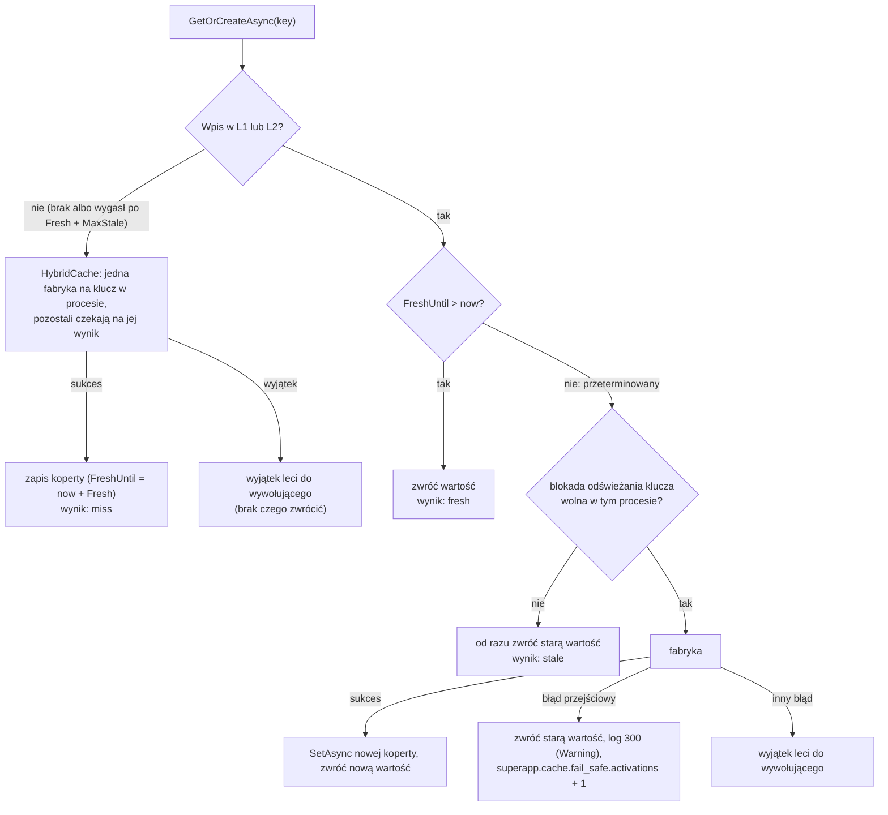
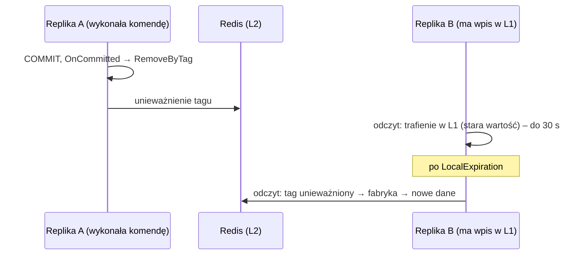

# 11. Cache

Architektura pamięci podręcznej: dwupoziomowy model `HybridCache` (L1 w pamięci procesu + L2 w Redis), nakładka `FailSafeCache` (odporność na błędy odświeżania, ochrona przed stampede), konwencje nazewnictwa kluczy i tagów, unieważnianie po commicie transakcji (`AfterCommitInterceptor`) oraz reguły stosowania w architekturze CQRS.

**Wymagania wstępne:** [06 Warstwa aplikacji](06-warstwa-aplikacji.md) (zapytania, handlery zapytań w Infrastructure),
[07 Dane i EF Core](07-dane-i-ef-core.md) (`ReadDbContext`, read modele), [10 Zdarzenia i integracja](10-zdarzenia-i-integracja.md)
(zdarzenia domenowe, dispatch w `WriteDbContextBase`).

> **W skrócie**
>
> - Cache wolno używać **tylko po stronie odczytu**: w handlerach zapytań (Infrastructure) i w klientach ACL. Nigdy
>   w komendach, agregatach, repozytoriach.
> - Używasz wyłącznie `FailSafeCache.GetOrCreateAsync(klucz, fabryka, opcje, tagi, token)`. Pod spodem `HybridCache`:
>   L1 w pamięci (domyślnie 30 s), L2 w Redis (gdy skonfigurowany), jedna fabryka na klucz w procesie (ochrona przed stampede).
> - Wpis świeży → zwracany. Przeterminowany → jeden wywołujący w procesie odświeża, reszta od razu dostaje starą wartość; gdy
>   odświeżenie padnie błędem przejściowym, stara wartość jest zwracana dalej (fail-safe). Brak wpisu → fabryka, błędy nie są
>   ukrywane.
> - Klucze, tagi i czasy życia jednego serwisu są w jednej klasie (`KnowledgeCache`). Klucz ma segment wersji (`v1`), który
>   podbijasz przy zmianie kształtu DTO.
> - Unieważnianie: handler zdarzenia domenowego rejestruje `RemoveByTagAsync` przez `IUnitOfWork.OnCommitted`; wykonuje się
>   **po commicie**, przy wycofaniu jest porzucane.
> - Unieważnienie nie czyści L1 innych replik: przez maksymalnie `LocalExpiration` (30 s) inna replika może zwrócić starą wartość.

W blokach kodu z repozytorium pominięto komentarze dokumentacji XML (`///`); reszta jest skopiowana z plików wskazanych nad
blokiem.

---

## 11.1 Po co i gdzie

Serwisy działają w wielu replikach, a część odczytów powtarza się bardzo często (lista kategorii, widok opublikowanego
materiału). Cache zdejmuje to obciążenie z MSSQL i pozwala odpowiadać, gdy baza chwilowo nie odpowiada. Kosztem jest
**świadomie nieaktualna** odpowiedź przez ograniczony czas (ADR-0020).

| Miejsce | Cache dozwolony? | Uzasadnienie |
|---|---|---|
| handler zapytania w `{Serwis}.Infrastructure/Features/...` | **tak** | strona odczytu; tu jest `ReadDbContext` i `FailSafeCache` |
| implementacja portu ACL (`I{Obcy}Gateway`) w Infrastructure | **tak** | odpowiedzi innego serwisu; fail-safe przy jego awarii |
| brama: dane pomocnicze (np. `/bff/user`) | tak (osobna implementacja bramy) | nigdy odpowiedzi proxowane z serwisów |
| BFF experience: odczyty z serwisów | dopuszczalny (ADR-0038); `Example.Bff` dziś go nie używa | dane są per użytkownik i chronione regułami serwisu, więc klucz musiałby zawierać użytkownika; serwis ma już własny cache |
| handler komendy, agregat, repozytorium, `WriteDbContext` | **nie** | decyzja zapisu na nieaktualnych danych łamie niezmienniki |
| Application (porty, handlery komend) | **nie** | cache to szczegół Infrastructure; Application go nie zna |

---

## 11.2 Rejestracja: `AddAppCaching`

```csharp
// src/Framework/SuperApp.Framework.Infrastructure/Caching/CachingServiceCollectionExtensions.cs
public static IServiceCollection AddAppCaching(this IServiceCollection services, IConfiguration configuration, string instancePrefix)
{
    var redis = configuration.GetConnectionString("Redis");
    if (!string.IsNullOrWhiteSpace(redis))
    {
        services.AddStackExchangeRedisCache(options =>
        {
            options.Configuration = redis;
            options.InstanceName = $"{instancePrefix}:";
        });
    }

    services.AddHybridCache(options =>
    {
        options.DefaultEntryOptions = new HybridCacheEntryOptions
        {
            Expiration = TimeSpan.FromMinutes(5),
            LocalCacheExpiration = TimeSpan.FromSeconds(30),
        };
    });

    services.AddScoped<FailSafeCache>();
    return services;
}
```

Wywołuje ją composition root serwisu: `AddKnowledgeCore` →
`services.AddAppCaching(configuration, KnowledgeWriteDbContext.SchemaName)`.

- **L1** (pamięć procesu) jest zawsze. **L2** (Redis) tylko, gdy `ConnectionStrings:Redis` jest niepusty. `HybridCache` sam
  wykrywa zarejestrowany `IDistributedCache` i używa go jako L2. Bez Redis (testy integracyjne, uruchomienie bez compose) działa
  tylko L1, a kod używający cache się nie zmienia.
- `InstanceName` = `knowledge:` oddziela klucze serwisów we wspólnym Redisie. Klucz `knowledge:categories:v1` leży więc
  w Redisie jako `knowledge:knowledge:categories:v1`.
- Wartości domyślne (5 min, 30 s w L1) dotyczą tylko bezpośrednich wywołań `HybridCache`; `FailSafeCache` zawsze ustawia
  własne czasy z `FailSafeOptions`.
- Z Redisem `AddAppServiceDefaults` dodaje health check `redis` z tagiem `superapp-dependencies`: awaria Redisa jest widoczna
  w `/health/dependencies`, ale **nie** wyłącza podów (ADR-0018). Cache degraduje się wtedy do L1 i źródła.
- Lokalnie Redis z compose słucha na `localhost:6380` (port hosta, żeby nie kolidować z innym lokalnym Redisem);
  `appsettings.Development.json` ma `"Redis": "localhost:6380"`.

---

## 11.3 Jak działa `FailSafeCache`

`HybridCache` nie ma wbudowanego fail-safe, więc `SuperApp.Framework.Infrastructure` dokłada go sam (ADR-0020). Trik polega na tym,
że w cache leży nie sama wartość, tylko **koperta** z momentem, do którego wartość jest świeża:

```csharp
// src/Framework/SuperApp.Framework.Infrastructure/Caching/CacheEnvelope{T}.cs
public sealed record CacheEnvelope<T>(T Value, DateTimeOffset FreshUntil);
```

Fizyczny czas życia wpisu w `HybridCache` to `Fresh + MaxStale`, a świeżość ocenia `FailSafeCache` na podstawie
`FreshUntil`. Dzięki temu wpis, który „już nie jest świeży”, nadal istnieje i można go zwrócić, gdy odświeżenie się nie uda.

```csharp
// src/Framework/SuperApp.Framework.Infrastructure/Caching/FailSafeOptions.cs
public sealed record FailSafeOptions(TimeSpan Fresh, TimeSpan MaxStale, TimeSpan? LocalExpiration = null);
```

```csharp
// src/Framework/SuperApp.Framework.Infrastructure/Caching/FailSafeCache.cs
public sealed partial class FailSafeCache(HybridCache cache, IClock clock, ILogger<FailSafeCache> logger)
{
    private static readonly TimeSpan DefaultLocalExpiration = TimeSpan.FromSeconds(30);
    private static readonly ConcurrentDictionary<string, SemaphoreSlim> RefreshLocks = new();

    public async ValueTask<T> GetOrCreateAsync<T>(
        string key,
        Func<CancellationToken, ValueTask<T>> factory,
        FailSafeOptions options,
        IReadOnlyCollection<string>? tags,
        CancellationToken cancellationToken)
    {
        var entryOptions = new HybridCacheEntryOptions
        {
            Expiration = options.Fresh + options.MaxStale,
            LocalCacheExpiration = options.LocalExpiration ?? DefaultLocalExpiration,
        };

        var loaded = new StrongBox<bool>();
        var envelope = await cache.GetOrCreateAsync(
            key,
            (factory, clock, options.Fresh, loaded),
            static async (state, token) =>
            {
                state.loaded.Value = true;
                return new CacheEnvelope<T>(await state.factory(token), state.clock.UtcNow + state.Fresh);
            },
            entryOptions,
            tags,
            cancellationToken);

        if (envelope.FreshUntil > clock.UtcNow)
        {
            Record(loaded.Value ? "miss" : "fresh");
            return envelope.Value;
        }

        Record("stale");

        var refreshLock = RefreshLocks.GetOrAdd(key, static _ => new SemaphoreSlim(1, 1));
        if (!await refreshLock.WaitAsync(TimeSpan.Zero, cancellationToken))
        {
            return envelope.Value;
        }

        try
        {
            var value = await factory(cancellationToken);
            await cache.SetAsync(key, new CacheEnvelope<T>(value, clock.UtcNow + options.Fresh), entryOptions, tags, cancellationToken);
            return value;
        }
        catch (Exception exception) when (IsTransient(exception, cancellationToken))
        {
            InfrastructureTelemetry.CacheFailSafeActivations.Add(1);
            LogFailSafeActivated(logger, key, exception);
            return envelope.Value;
        }
        finally
        {
            refreshLock.Release();
            RefreshLocks.TryRemove(new KeyValuePair<string, SemaphoreSlim>(key, refreshLock));
        }
    }

    private static void Record(string result) =>
        InfrastructureTelemetry.CacheRequests.Add(1, new KeyValuePair<string, object?>("result", result));

    public ValueTask RemoveByTagAsync(string tag, CancellationToken cancellationToken) =>
        cache.RemoveByTagAsync(tag, cancellationToken);

    private static bool IsTransient(Exception exception, CancellationToken cancellationToken) => exception switch
    {
        TimeoutException or HttpRequestException => true,
        OperationCanceledException => !cancellationToken.IsCancellationRequested,
        _ => TransientSqlError.IsTransient(exception),
    };

    [LoggerMessage(300, LogLevel.Warning, "Cache fail-safe: returning stale value for {CacheKey}")]
    private static partial void LogFailSafeActivated(ILogger logger, string cacheKey, Exception exception);
}
```

### Trzy stany wpisu



| Stan | Warunek | Zachowanie | Metryka `superapp.cache.requests{result}` |
|---|---|---|---|
| **świeży** | `FreshUntil > now` | zwraca wartość, bez dostępu do źródła | `fresh` |
| **brakujący** | brak wpisu w L1 i L2 albo minęło `Fresh + MaxStale`, albo tag unieważniony | fabryka; `HybridCache` dopuszcza **jedno** wywołanie fabryki na klucz w procesie, pozostali czekają (ochrona przed stampede); błąd fabryki leci dalej | `miss` |
| **przeterminowany** | wpis istnieje, `FreshUntil <= now` | jeden wywołujący w procesie odświeża (blokada `SemaphoreSlim` per klucz, `WaitAsync(TimeSpan.Zero)`), pozostali od razu dostają starą wartość; błąd przejściowy odświeżenia = stara wartość (fail-safe) | `stale` |

Szczegóły, które warto znać:

- Odświeżenie przeterminowanego wpisu odbywa się **w ścieżce żądania** tego wywołującego, który zdobył blokadę: on czeka na
  bazę, pozostali nie. To nie jest odświeżanie w tle.
- Blokada odświeżania jest **per proces** (statyczny słownik). Kilka replik może odświeżać ten sam klucz równocześnie; to
  akceptowalne, bo każda robi to najwyżej raz naraz.
- **Błąd przejściowy** (`IsTransient`): `TimeoutException`, `HttpRequestException`, `OperationCanceledException`, **o ile**
  nie anulował jej wywołujący (np. timeout `HttpClient`), oraz przejściowe błędy bazy rozpoznawane przez
  `TransientSqlError` (`SuperApp.Framework.Infrastructure/Persistence`): `SqlException` o numerze z listy błędów połączenia,
  timeoutu, zakleszczenia i przełączania bazy (np. `-2`, `1205`, `4060`, `10054`, `40613`), a dla innych dostawców
  `DbException.IsTransient`. Błąd trwały (`Invalid column name` po pominiętej migracji, brak uprawnień, błąd w zapytaniu) **nie**
  włącza fail-safe: leci dalej, nawet gdy jest stara wartość, żeby problem był widoczny od razu. Anulowanie żądania przez
  klienta nie włącza fail-safe, tylko kończy żądanie.
- Pierwsze ładowanie (stan „brakujący”) **nigdy** nie ukrywa błędu: nie ma czego zwrócić. Handler zapytania nie łapie tego
  wyjątku; klient dostaje 500 z `traceId`.
- `T` musi być serializowalny przez `System.Text.Json`: koperta trafia do Redisa, a `HybridCache` przechowuje w L1 typy
  niezaznaczone jako niezmienne w postaci serializowanej i deserializuje je przy odczycie. Cache'uj DTO, nigdy encje EF ani
  agregaty. Polimorficzne DTO potrzebują atrybutów `[JsonPolymorphic]`/`[JsonDerivedType]` (tak jak `ContentBlockDto`).
- Zegar to `IClock`, więc testy mogą przesuwać czas.

### Obserwowalność

| Sygnał | Gdzie | Interpretacja |
|---|---|---|
| `superapp.cache.requests` z tagiem `result` (`fresh`, `stale`, `miss`) | meter `SuperApp.Infrastructure` (Prometheus) | hit ratio = `fresh / (fresh + stale + miss)`; dużo `miss` = za krótkie `Fresh` albo zbyt częste unieważnianie |
| `superapp.cache.fail_safe.activations` | meter `SuperApp.Infrastructure` | rośnie = źródło danych pada, a użytkownicy dostają stare odpowiedzi; **alertuj** |
| log `EventId` 300, Warning, „Cache fail-safe: returning stale value for {CacheKey}” | Loki | który klucz, z jakim wyjątkiem |
| health check `redis` w `/health/dependencies` | monitoring | dostępność L2 |

---

## 11.4 Dobór `FailSafeOptions`

| Parametr | Pytanie, na które odpowiada | Przykład Knowledge |
|---|---|---|
| `Fresh` | jak długo użytkownik może widzieć nieaktualne dane, **gdyby unieważnienie nie zadziałało**? | kategorie: 5 min; widok materiału: 2 min |
| `MaxStale` | jak długo serwis ma odpowiadać starymi danymi podczas awarii bazy lub dostawcy? | kategorie: 1 h; widok materiału: 30 min |
| `LocalExpiration` | jak długo replika może trzymać kopię w pamięci, nie wiedząc o unieważnieniu na innej replice? | domyślne 30 s (`null`) |

```csharp
// src/Services/Knowledge/Knowledge.Infrastructure/Caching/KnowledgeCache.cs (fragment)
public static readonly FailSafeOptions Categories = new(Fresh: TimeSpan.FromMinutes(5), MaxStale: TimeSpan.FromHours(1));

public static readonly FailSafeOptions PublishedMaterial = new(Fresh: TimeSpan.FromMinutes(2), MaxStale: TimeSpan.FromMinutes(30));
```

Wskazówki:

- Unieważnianie tagami jest głównym mechanizmem spójności, a `Fresh` to siatka bezpieczeństwa. Nie skracaj `Fresh` do
  sekund „na wszelki wypadek”: zabijesz hit ratio, a spójności i tak pilnują tagi.
- Dane słownikowe, zmieniane rzadko i przez redaktorów: długie `Fresh` i `MaxStale`. Dane zmieniane często przez wielu
  użytkowników: krótkie `Fresh` albo brak cache.
- `MaxStale` to także okres, przez który wpis zajmuje pamięć i Redis. Bardzo długi `MaxStale` przy wielu kluczach (np. per
  materiał) to dużo danych w Redisie (polityka `allkeys-lru` usunie najstarsze).
- `LocalExpiration` trzymaj krótkie (sekundy). Dłuższe tylko dla danych, dla których kilkuminutowa niespójność między
  replikami jest akceptowalna.

---

## 11.5 Klucze, wersje i tagi

Wszystkie klucze, tagi i opcje serwisu leżą w jednej klasie:

```csharp
// src/Services/Knowledge/Knowledge.Infrastructure/Caching/KnowledgeCache.cs
internal static class KnowledgeCache
{
    public const string CategoriesKey = "knowledge:categories:v1";

    public const string CategoriesTag = "knowledge:categories";

    public static readonly FailSafeOptions Categories = new(Fresh: TimeSpan.FromMinutes(5), MaxStale: TimeSpan.FromHours(1));

    public static readonly FailSafeOptions PublishedMaterial = new(Fresh: TimeSpan.FromMinutes(2), MaxStale: TimeSpan.FromMinutes(30));

    public static string MaterialKey(Guid materialId) => $"knowledge:material:v1:{materialId}";

    public static string MaterialTag(Guid materialId) => $"knowledge:material:{materialId}";
}
```

Zasady (ADR-0020):

| Reguła | Dlaczego |
|---|---|
| klucz: `{serwis}:{typ}:v{n}[:{parametry}]` | prefiks serwisu i typu, wersja kształtu wartości, wszystkie parametry wyniku |
| **każdy** parametr, od którego zależy wynik, jest w kluczu (ID, filtr, strona, język, a dla danych użytkownika: użytkownik) | inaczej dwa różne zapytania dzielą jeden wpis |
| zmiana kształtu DTO (nowe pole, zmiana typu) = podbicie `v1` → `v2` | podczas rolling update stara i nowa wersja aplikacji czytają ten sam Redis; nowa wersja nie może zdeserializować starego JSON-a na nowo rozumiany kształt |
| tag **bez** wersji | unieważnienie usuwa wpisy wszystkich wersji naraz |
| tag tak szeroki, jak zakres zmiany | zmiana kategorii unieważnia całą listę (`knowledge:categories`); zmiana materiału tylko jego widok (`knowledge:material:{id}`) |
| klucze i tagi tylko w klasie `{Serwis}Cache` | jedno miejsce do przeglądu w review; handler i unieważnianie nie mogą się rozjechać |

### Źle / dobrze

```csharp
// ŹLE: wynik zależy od strony i filtra, a klucz nie
await cache.GetOrCreateAsync("knowledge:materials:v1", token => LoadPageAsync(query, token), options, tags, cancellationToken);

// DOBRZE: każdy parametr w kluczu
var key = $"knowledge:materials:v1:{query.CategoryId}:{query.Type}:{query.Page}:{query.PageSize}";
```

```csharp
// ŹLE: dodano pole do MaterialDetailsDto, klucz bez zmian
public static string MaterialKey(Guid materialId) => $"knowledge:material:v1:{materialId}";

// DOBRZE: nowy kształt = nowa wersja klucza; tag bez wersji nadal unieważnia oba
public static string MaterialKey(Guid materialId) => $"knowledge:material:v2:{materialId}";
```

Dlaczego: w czasie rolling update stara replika zapisuje do Redisa DTO bez nowego pola, a nowa replika je czyta i dostaje
`null`/wartość domyślną w polu, które „zawsze jest wypełnione” (albo odwrotnie). Błąd znika sam po `Fresh + MaxStale`, więc
trudno go odtworzyć.

```csharp
// ŹLE: dane konkretnego użytkownika pod kluczem bez użytkownika
var favorites = await cache.GetOrCreateAsync("knowledge:favorites:v1", ...);

// DOBRZE: najlepiej w ogóle nie cache'ować (zob. 11.8); jeśli już, to użytkownik w kluczu i tagu
var favorites = await cache.GetOrCreateAsync($"knowledge:favorites:v1:{userId}", ..., [$"knowledge:favorites:{userId}"], ...);
```

Dlaczego: pierwsza wersja pokazuje ulubione jednego użytkownika wszystkim pozostałym. To wyciek danych, nie błąd wydajności.

---

## 11.6 Prawdziwe handlery

### Lista kategorii: cała lista pod jednym kluczem

```csharp
// src/Services/Knowledge/Knowledge.Infrastructure/Features/Categories/ListCategoriesHandler.cs
internal sealed class ListCategoriesHandler(KnowledgeReadDbContext db, FailSafeCache cache)
    : IQueryHandler<ListCategories, Result<IReadOnlyList<CategoryDto>>>
{
    public async Task<Result<IReadOnlyList<CategoryDto>>> Handle(ListCategories query, CancellationToken cancellationToken)
    {
        var categories = await cache.GetOrCreateAsync(
            KnowledgeCache.CategoriesKey,
            async token => (IReadOnlyList<CategoryDto>)await db.Categories
                .OrderBy(category => category.Name)
                .Select(category => new CategoryDto(category.Id, category.Name, category.Slug))
                .ToListAsync(token),
            KnowledgeCache.Categories,
            [KnowledgeCache.CategoriesTag],
            cancellationToken);

        return Result<IReadOnlyList<CategoryDto>>.Success(categories);
    }
}
```

- Fabryka czyta read model `CategoryRow` przez `KnowledgeReadDbContext` (bez śledzenia) i projektuje go od razu na DTO.
  Cache'owany jest DTO, nie read model.
- Rzutowanie na `IReadOnlyList<CategoryDto>` ustala `T` całego wywołania; ten sam `T` musi być użyty przy każdym odczycie
  tego klucza (także w testach).
- Fabryka dostaje `token` od cache, nie `cancellationToken` żądania: `HybridCache` współdzieli jedno ładowanie między
  czekających wywołujących.

### Widok materiału: cache tylko dla czytelników

```csharp
// src/Services/Knowledge/Knowledge.Infrastructure/Features/Materials/GetMaterialHandler.cs
internal sealed class GetMaterialHandler(KnowledgeReadDbContext db, FailSafeCache cache, ICurrentUser currentUser)
    : IQueryHandler<GetMaterial, Result<MaterialDetailsDto>>
{
    private static readonly string Published = nameof(PublicationStatus.Published);

    public async Task<Result<MaterialDetailsDto>> Handle(GetMaterial query, CancellationToken cancellationToken)
    {
        if (currentUser.HasScope(KnowledgeScopes.CatalogWrite))
        {
            var any = await LoadAsync(query.MaterialId, publishedOnly: false, cancellationToken);
            return any is null ? MaterialErrors.NotFound : any;
        }

        var published = await cache.GetOrCreateAsync(
            KnowledgeCache.MaterialKey(query.MaterialId),
            token => new ValueTask<MaterialDetailsDto?>(LoadAsync(query.MaterialId, publishedOnly: true, token)),
            KnowledgeCache.PublishedMaterial,
            [KnowledgeCache.MaterialTag(query.MaterialId)],
            cancellationToken);

        return published is null ? MaterialErrors.NotFound : published;
    }

    // Loads the material row, its category links and its content tree; null when the material does not exist
    // or, with publishedOnly, is not published.
    private async Task<MaterialDetailsDto?> LoadAsync(Guid materialId, bool publishedOnly, CancellationToken cancellationToken)
    {
        var material = await db.Materials
            .Where(row => row.Id == materialId && (!publishedOnly || row.Status == Published))
            .FirstOrDefaultAsync(cancellationToken);
        if (material is null)
        {
            return null;
        }

        var categoryIds = await db.MaterialCategories
            .Where(row => row.MaterialId == materialId)
            .Select(row => row.CategoryId)
            .ToListAsync(cancellationToken);
        var content = await ContentTreeReader.ReadAsync(db, materialId, cancellationToken);

        return new MaterialDetailsDto(
            material.Id,
            Enum.Parse<MaterialType>(material.Type),
            material.Title,
            material.Description,
            material.MainMediaUrl,
            material.MainMediaDurationSeconds,
            Enum.Parse<PublicationStatus>(material.Status),
            material.ReadingTimeMinutes,
            material.UpdatedAt,
            material.PublishedAt,
            categoryIds,
            content);
    }
}
```

Dlaczego dwie ścieżki:

- **Redaktor** (scope `knowledge.catalog.write`) zawsze czyta z bazy. Widzi swoje zmiany natychmiast (nawet bez czekania na
  L1 innych replik), a **szkice nigdy nie trafiają do cache**. Gdyby szkic trafił pod klucz czytelnika, czytelnik zobaczyłby
  nieopublikowaną treść.
- **Czytelnik** dostaje wyłącznie wersję opublikowaną, z cache. Wynik „nie ma / nieopublikowany” (`null`) też jest
  cache'owany: to bezpieczne, bo publikacja zgłasza `MaterialChanged`, które usuwa wpis po commicie.
- Klucz zawiera tylko `materialId`, bo wynik ścieżki czytelnika nie zależy od użytkownika. To warunek konieczny, żeby
  w ogóle cache'ować współdzielenie między użytkownikami.

---

## 11.7 Unieważnianie po commicie

### Handlery unieważniające

```csharp
// src/Services/Knowledge/Knowledge.Infrastructure/Caching/CategoryCacheInvalidation.cs
internal sealed class CategoryCacheInvalidation(IUnitOfWork unitOfWork, FailSafeCache cache) : IDomainEventHandler<CategoryChanged>
{
    public Task HandleAsync(CategoryChanged domainEvent, CancellationToken cancellationToken)
    {
        unitOfWork.OnCommitted(token => cache.RemoveByTagAsync(KnowledgeCache.CategoriesTag, token).AsTask());
        return Task.CompletedTask;
    }
}

// src/Services/Knowledge/Knowledge.Infrastructure/Caching/MaterialCacheInvalidation.cs
internal sealed class MaterialCacheInvalidation(IUnitOfWork unitOfWork, FailSafeCache cache) : IDomainEventHandler<MaterialChanged>
{
    public Task HandleAsync(MaterialChanged domainEvent, CancellationToken cancellationToken)
    {
        var tag = KnowledgeCache.MaterialTag(domainEvent.MaterialId.Value);
        unitOfWork.OnCommitted(token => cache.RemoveByTagAsync(tag, token).AsTask());
        return Task.CompletedTask;
    }
}
```

Źródłem są zdarzenia domenowe: `Category` zgłasza `CategoryChanged` przy utworzeniu i zmianie nazwy (nie przy zmianie na tę
samą nazwę), `Material` zgłasza `MaterialChanged` przy każdej udanej zmianie, ale najwyżej raz na zapis (`Touch` sprawdza, czy
takie zdarzenie już czeka). Handlery leżą w Infrastructure, bo znają `FailSafeCache` i `KnowledgeCache`; `AddAppApplication`
skanuje także assembly Infrastructure, więc rejestracja jest automatyczna.

### Wyścig, któremu zapobiega `OnCommitted`

Handler zdarzenia domenowego działa **wewnątrz** `SaveChangesAsync`, przed commitem ([10.2](10-zdarzenia-i-integracja.md#102-cykl-życia-zdarzenia-domenowego-krok-po-kroku)).
Odczyt idzie przez `ReadDbContext`, osobnym połączeniem, i widzi tylko dane zatwierdzone. Gdyby handler usuwał wpis od razu:

```mermaid
sequenceDiagram
    participant W as Komenda RenameCategory
    participant DB as MSSQL
    participant C as Cache
    participant R as Równoległy odczyt ListCategories

    W->>DB: UPDATE Categories (niezatwierdzone)
    W->>C: RemoveByTag("knowledge:categories")  ← ŹLE: przed commitem
    R->>C: GetOrCreate → brak wpisu
    R->>DB: SELECT (widzi stan zatwierdzony = STARA nazwa)
    W->>DB: COMMIT
    R->>C: zapis STAREJ listy jako świeżej na 5 minut
    Note over C: unieważnienie już się odbyło; stara lista zostaje do upływu Fresh
```

Z `OnCommitted` usunięcie następuje **po** `COMMIT`, więc każdy odczyt rozpoczęty po unieważnieniu widzi nowe dane.
Zostaje tylko wąskie okno: odczyt, który wczytał dane przed commitem, a zapisał je po unieważnieniu. Ten przypadek ogranicza
`Fresh`; to dlatego TTL jest „siatką bezpieczeństwa”, a nie jedynie formalnością.

```csharp
// ŹLE: unieważnienie przed commitem (i await w handlerze zdarzenia)
public async Task HandleAsync(CategoryChanged domainEvent, CancellationToken cancellationToken) =>
    await cache.RemoveByTagAsync(KnowledgeCache.CategoriesTag, cancellationToken);

// DOBRZE: rejestracja akcji po commicie
public Task HandleAsync(CategoryChanged domainEvent, CancellationToken cancellationToken)
{
    unitOfWork.OnCommitted(token => cache.RemoveByTagAsync(KnowledgeCache.CategoriesTag, token).AsTask());
    return Task.CompletedTask;
}
```

Wersja „źle” ma drugi problem: gdy transakcja się wycofa, cache jest już wyczyszczony bez powodu (mniejsze zło), a gdy Redis
nie odpowiada, wyjątek z handlera wycofuje **poprawną** komendę.

### Jak to działa w środku

`IUnitOfWork.OnCommitted` dopisuje akcję do listy w `WriteDbContextBase`:

```csharp
// src/Framework/SuperApp.Framework.Infrastructure/Persistence/WriteDbContextBase.cs (fragmenty)
private readonly List<Func<CancellationToken, Task>> _afterCommitActions = [];

public void OnCommitted(Func<CancellationToken, Task> action) => _afterCommitActions.Add(action);

internal IReadOnlyList<Func<CancellationToken, Task>> TakeAfterCommitActions()
{
    var actions = _afterCommitActions.ToArray();
    _afterCommitActions.Clear();
    return actions;
}
```

Akcje uruchamia interceptor transakcji EF Core, dodany do kontekstu zapisu przez `AddAppPersistence`:

```csharp
// src/Framework/SuperApp.Framework.Infrastructure/Persistence/AfterCommitInterceptor.cs
internal sealed partial class AfterCommitInterceptor(ILogger<AfterCommitInterceptor> logger) : DbTransactionInterceptor
{
    public override async Task TransactionCommittedAsync(DbTransaction transaction, TransactionEndEventData eventData, CancellationToken cancellationToken = default)
    {
        if (eventData.Context is WriteDbContextBase context)
        {
            // The commit has happened: run the actions even if the request is being cancelled right now.
            await RunAsync(context, CancellationToken.None);
        }
    }

    public override void TransactionCommitted(DbTransaction transaction, TransactionEndEventData eventData)
    {
        if (eventData.Context is WriteDbContextBase context)
        {
            RunAsync(context, CancellationToken.None).GetAwaiter().GetResult();
        }
    }

    public override Task TransactionRolledBackAsync(DbTransaction transaction, TransactionEndEventData eventData, CancellationToken cancellationToken = default)
    {
        Discard(eventData.Context);
        return Task.CompletedTask;
    }

    public override void TransactionRolledBack(DbTransaction transaction, TransactionEndEventData eventData) => Discard(eventData.Context);

    private static void Discard(Microsoft.EntityFrameworkCore.DbContext? context)
    {
        if (context is WriteDbContextBase writeContext)
        {
            _ = writeContext.TakeAfterCommitActions();
        }
    }

    private async Task RunAsync(WriteDbContextBase context, CancellationToken cancellationToken)
    {
        foreach (var action in context.TakeAfterCommitActions())
        {
            try
            {
                await action(cancellationToken);
            }
            catch (Exception exception)
            {
                LogAfterCommitActionFailed(logger, context.GetType().Name, exception);
            }
        }
    }

    [LoggerMessage(210, LogLevel.Warning, "After-commit action of {Context} failed")]
    private static partial void LogAfterCommitActionFailed(ILogger logger, string context, Exception exception);
}
```

| Co się dzieje z transakcją | Los zarejestrowanych akcji |
|---|---|
| commit transakcji otwartej przez `TransactionBehavior` (komenda z API) | wykonane po kolei, z `CancellationToken.None` (żądanie mogło zostać właśnie anulowane, ale commit już nastąpił) |
| commit transakcji otwartej przez outbox MassTransit (komenda z konsumenta w Workerze) | wykonane tak samo: interceptor obserwuje **każdą** transakcję kontekstu, niezależnie od tego, kto ją otworzył |
| rollback | porzucone |
| `SaveChangesAsync` zwrócił konflikt (unikalny indeks albo `rowversion`) lub komenda w konsumencie zwróciła błąd (`DiscardChanges`) | porzucone |
| transakcja z `BeginTransactionAsync` zwolniona bez commitu (`await using` przy błędnym wyniku) | porzucone (`EfUnitOfWorkTransaction.DisposeAsync`) |
| akcja rzuca wyjątek | log Warning `EventId` 210, wyjątek połknięty; pozostałe akcje wykonują się dalej; komenda pozostaje udana |

Akcje są rejestrowane podczas dispatchu, który może nastąpić **przed** otwarciem niejawnej transakcji przez EF, dlatego
rozpoczęcie transakcji ich nie czyści. Akcja ma być krótka, idempotentna i „best effort”: jeśli nie wykona się (awaria Redisa),
wpis wygaśnie po `Fresh`.

### Unieważnienie a repliki (L1)

`RemoveByTagAsync` unieważnia wpisy w L1 **tej** repliki i w L2 (Redis). Inne repliki mogą jeszcze przez `LocalExpiration`
(domyślnie 30 s) zwracać kopię ze swojej pamięci; po tym czasie sięgną do L2 i zobaczą unieważnienie.



Konsekwencje:

- Użytkownik, który właśnie zmienił dane i trafia przez load balancer na inną replikę, może przez kilkanaście sekund zobaczyć
  stan sprzed zmiany. Dla redaktorów materiałów rozwiązuje to obejście cache w `GetMaterialHandler`.
- Dane wymagające natychmiastowej spójności między replikami nie powinny trafiać do L1 (ADR-0020 wskazuje
  `HybridCacheEntryFlags.DisableLocalCache`). `FailSafeOptions` nie ma dziś takiej opcji; jeśli jej potrzebujesz, to zmiana
  frameworku do uzgodnienia, a do tego czasu takich danych nie cache'uj.

---

## 11.8 Czego nigdy nie cache'ujemy

| Nie cache'uj | Dlaczego | Zamiast tego |
|---|---|---|
| niczego po stronie zapisu (agregaty, repozytoria, dane do walidacji komendy) | decyzja na podstawie nieaktualnych danych łamie niezmienniki, np. „slug wolny” | `WriteDbContext` przez repozytorium; konflikty łapie unikalny indeks |
| danych zależnych od użytkownika pod kluczem bez użytkownika | wyciek danych między użytkownikami | użytkownik w kluczu i tagu albo brak cache |
| danych zależnych od uprawnień (szkice, widok redaktora) we wspólnym kluczu | czytelnik zobaczy to, co widzi redaktor | osobna ścieżka bez cache (`GetMaterialHandler`) |
| tokenów, sekretów, haseł | Redis to dane odtwarzalne, nie sejf (ADR-0020); tokeny client credentials cache'uje w pamięci `ClientCredentialsTokenProvider` | nic; tokeny tylko w dedykowanych mechanizmach |
| danych osobowych bez potrzeby | RODO: TTL musi być zgodny z polityką | nie cache'uj; jeśli trzeba, krótkie `Fresh + MaxStale` |
| encji EF i agregatów | nie są projektowane pod JSON; po deserializacji to „martwe” obiekty bez śledzenia | DTO |
| list stronicowanych z wieloma kombinacjami filtrów | niski hit ratio, dużo kluczy, trudne unieważnianie | zoptymalizuj zapytanie (indeks, projekcja) |

Zasada praktyczna: cache'uj to, co **wielu** użytkowników czyta **często**, a zmienia się **rzadko** i **w znany sposób**
(jest zdarzenie domenowe, po którym wiesz, który tag usunąć).

---

## 11.9 Na żywo: HTTP i Redis

Uruchom środowisko i zdobądź token (jak w [01 Start](01-start.md)):

```bash
TOKEN=$(curl -s http://localhost:8081/realms/superapp/protocol/openid-connect/token \
  -d grant_type=password -d client_id=dev-cli -d username=editor -d password=editor \
  -d "scope=openid knowledge.catalog.read knowledge.catalog.write" | jq -r .access_token)

# 1. pierwszy odczyt: miss, lista trafia do cache
curl -s http://localhost:5101/v1/categories -H "Authorization: Bearer $TOKEN"
# [{"id":"01a0f4...","name":"Zdrowy sen","slug":"zdrowy-sen"}]

# 2. zmiana nazwy: komenda, CategoryChanged, OnCommitted → RemoveByTag("knowledge:categories")
curl -s -i -X PUT http://localhost:5101/v1/categories/01a0f4.../name \
  -H "Authorization: Bearer $TOKEN" -H "Content-Type: application/json" -d '{"name":"Higiena snu"}'
# HTTP/1.1 204 No Content

# 3. kolejny odczyt na tej samej replice: nowa nazwa od razu
curl -s http://localhost:5101/v1/categories -H "Authorization: Bearer $TOKEN"
# [{"id":"01a0f4...","name":"Higiena snu","slug":"zdrowy-sen"}]
```

Podgląd Redisa (lokalnie port hosta 6380):

```bash
docker compose -f deploy/local/docker-compose.yml exec redis redis-cli --scan --pattern 'knowledge:*'
# knowledge:knowledge:categories:v1
# knowledge:knowledge:material:v1:3f2c8a51-...
# (oraz wpisy pomocnicze HybridCache dotyczące unieważnionych tagów)

docker compose -f deploy/local/docker-compose.yml exec redis redis-cli HGETALL knowledge:knowledge:categories:v1
```

Wpis jest hashem `IDistributedCache` (`data`, `absexp`, ...); `data` to format `HybridCache` (nagłówek binarny + JSON koperty),
więc nie czytaj go „na oko” jako kontraktu. Do ręcznego wyczyszczenia cache w środowisku lokalnym wystarczy
`redis-cli FLUSHDB` i restart serwisu (czyści L1).

---

## 11.10 Testy

```csharp
// src/Services/Knowledge/tests/Knowledge.IntegrationTests/CacheInvalidationTests.cs (fragmenty)
[Fact]
public async Task Category_list_is_invalidated_after_commit_and_read_returns_fresh_data()
{
    var categoryId = await CreateCategoryAndCacheListAsync("Przed zmianą");

    await using (var scope = fixture.Services.CreateAsyncScope())
    {
        var unitOfWork = scope.ServiceProvider.GetRequiredService<IUnitOfWork>();
        await using var transaction = await unitOfWork.BeginTransactionAsync(TestContext.Current.CancellationToken);
        await RenameAsync(scope.ServiceProvider, categoryId, "Po zmianie");
        Assert.True((await unitOfWork.SaveChangesAsync(TestContext.Current.CancellationToken)).IsSuccess);

        // Saved but not committed: the cached list must still be there, otherwise a concurrent read could cache the old list again.
        Assert.False(await CategoryListIsMissingAsync());

        await transaction.CommitAsync(TestContext.Current.CancellationToken);
    }

    var categories = await fixture.SendAsync(new ListCategories());
    Assert.Contains(categories.Value, category => category.Id == categoryId && category.Name == "Po zmianie");
}

[Fact]
public async Task Rolled_back_change_does_not_invalidate_category_list()
{
    var categoryId = await CreateCategoryAndCacheListAsync("Bez zmian");

    await using (var scope = fixture.Services.CreateAsyncScope())
    {
        var unitOfWork = scope.ServiceProvider.GetRequiredService<IUnitOfWork>();
        await using var transaction = await unitOfWork.BeginTransactionAsync(TestContext.Current.CancellationToken);
        await RenameAsync(scope.ServiceProvider, categoryId, "Wycofana zmiana");
        Assert.True((await unitOfWork.SaveChangesAsync(TestContext.Current.CancellationToken)).IsSuccess);

        // Disposed without commit: the transaction rolls back.
    }

    Assert.False(await CategoryListIsMissingAsync());
    var categories = await fixture.SendAsync(new ListCategories());
    Assert.Contains(categories.Value, category => category.Id == categoryId && category.Name == "Bez zmian");
}
```

Co tu jest ważne:

- Test steruje transakcją ręcznie (`BeginTransactionAsync` / `SaveChangesAsync` / `CommitAsync`), żeby sprawdzić stan cache
  **pomiędzy** zapisem a commitem. Przez `fixture.SendAsync` nie dałoby się zajrzeć w ten moment.
- `CategoryListIsMissingAsync` czyta klucz przez `FailSafeCache` z fabryką, która tylko zaznacza brak wpisu i nie dotyka bazy;
  po teście usuwa ewentualny „zaślepkowy” wpis.
- Trzeci test (`Cached_material_view_is_fresh_after_update`) sprawdza scenariusz czytelnik → redaktor zmienia → czytelnik od
  razu widzi zmianę.
- `ServiceFixture` nie ustawia `ConnectionStrings:Redis`, więc testy integracyjne działają na samym L1 (w jednym procesie
  to wystarcza do sprawdzenia unieważniania). Serializacja i tak jest wykonywana, bo `HybridCache` trzyma koperty w L1
  w postaci zserializowanej.
- Testy pipeline'u w Application.Tests (`PipelineTests`) używają `FakeUnitOfWork`, który wykonuje akcje `OnCommitted` przy
  `CommitAsync` i czyści je przy `DisposeAsync`, naśladując prawdziwy interceptor.

Stan testów względem ADR-0020: ADR wymaga testów samego fail-safe (równoległe odczyty przeterminowanego wpisu, błąd fabryki,
przekroczenie `MaxStale`, awaria Redisa) i testów integracyjnych z Redisem w Testcontainers. **Takich testów w repozytorium
jeszcze nie ma**; dodając logikę do `FailSafeCache`, zacznij od nich (zegar `IClock` pozwala przesuwać czas).

```bash
dotnet test --project src/Services/Knowledge/tests/Knowledge.IntegrationTests   # wymaga Dockera
```

---

## Typowe błędy

| Objaw | Przyczyna | Naprawa |
|---|---|---|
| Po zmianie dane w odpowiedzi są stare przez ~`Fresh` minut | brak handlera unieważniającego dla zdarzenia, agregat nie zgłasza zdarzenia przy tej zmianie albo tag w handlerze inny niż w zapytaniu | sprawdź `Raise` w metodzie agregatu, handler `IDomainEventHandler<...>` i użycie tej samej stałej/metody z `{Serwis}Cache` w obu miejscach |
| Po zmianie stare dane przez ~30 s, losowo | inna replika ma wpis w L1 | oczekiwane (11.7); jeśli nieakceptowalne, nie cache'uj tych danych albo omiń cache dla autora zmiany |
| Po wdrożeniu błędy deserializacji albo puste pola tylko przez pewien czas | zmieniony kształt DTO bez podbicia wersji w kluczu | podbij `v{n}` w kluczu |
| Użytkownik widzi dane innego użytkownika | brak użytkownika w kluczu | użytkownik w kluczu i tagu albo brak cache |
| Czytelnik widzi szkic | odpowiedź zależna od uprawnień zapisana we wspólnym kluczu | ścieżka uprzywilejowana bez cache, jak w `GetMaterialHandler` |
| Komenda zwraca 500, gdy Redis nie działa | `RemoveByTagAsync` wywołane bezpośrednio w handlerze zdarzenia | rejestruj przez `OnCommitted` (błąd po commicie jest tylko logowany, `EventId` 210) |
| Log 300 „Cache fail-safe: returning stale value” i rosnące `superapp.cache.fail_safe.activations` | źródło danych (baza, inny serwis) pada | napraw źródło; cache tylko kupuje czas do upływu `MaxStale` |
| Pierwsze żądanie po starcie kończy się 500 przy niedostępnej bazie | brak wpisu do zwrócenia; fail-safe działa tylko dla przeterminowanych wpisów | oczekiwane; sprawdź bazę |
| Log 300 przy błędzie, który nie mija | błąd ma numer z listy `TransientSqlError`, ale przyczyna jest trwała (np. baza wyłączona na stałe) | napraw źródło; po upływie `MaxStale` błąd wyjdzie do klienta |
| `InvalidCastException`/błąd deserializacji przy odczycie klucza | ten sam klucz czytany z różnym `T` | jeden typ na klucz; rzutuj fabrykę na typ deklarowany (`(IReadOnlyList<CategoryDto>)`) |
| Wpisy jednego serwisu „widoczne” w innym | ten sam `instancePrefix` | `AddAppCaching(configuration, {Serwis}WriteDbContext.SchemaName)` |

## Do zapamiętania

- Cache tylko po stronie odczytu i w ACL; nigdy w komendach.
- `FailSafeCache.GetOrCreateAsync` z kluczem, opcjami i tagami z klasy `{Serwis}Cache`.
- Świeży → wartość; brakujący → fabryka z ochroną przed stampede, błąd leci dalej; przeterminowany → jedno odświeżenie na
  proces, reszta dostaje starą wartość, błąd przejściowy = stara wartość.
- Klucz zawiera wszystkie parametry wyniku i wersję kształtu; tag nie zawiera wersji.
- Unieważnienie zawsze przez `IUnitOfWork.OnCommitted` z handlera zdarzenia domenowego; po commicie, porzucane przy wycofaniu,
  błąd tylko logowany.
- L1 innych replik może być nieaktualne do `LocalExpiration` (30 s).
- Dane użytkownika, zależne od uprawnień, tokeny i sekrety: nie do wspólnego cache.
- Obserwuj `superapp.cache.requests` i alertuj na `superapp.cache.fail_safe.activations`.

## Powiązane

- Rozdziały: [06 Warstwa aplikacji](06-warstwa-aplikacji.md), [07 Dane i EF Core](07-dane-i-ef-core.md),
  [10 Zdarzenia i integracja](10-zdarzenia-i-integracja.md), [12 Testy](12-testy.md),
  [14 Logowanie i obserwowalność](14-logowanie-i-obserwowalnosc.md), [17 Rozwiązywanie problemów](17-rozwiazywanie-problemow.md).
- Przepisy: [02 Endpoint zapytania](przepisy/02-endpoint-zapytania.md), [05 Zdarzenia i cache](przepisy/05-zdarzenia-i-cache.md).
- ADR: [0020](../adr/0020-cache-l1-l2-redis.md) (cache L1/L2, fail-safe, unieważnianie po commicie),
  [0026](../adr/0026-handlery-zapytan-w-infrastructure.md) (handlery zapytań w Infrastructure),
  [0027](../adr/0027-zdarzenia-domenowe-dispatch-w-uow.md) (zdarzenia domenowe), [0018](../adr/0018-health-checki-readiness.md)
  (Redis tylko w `/health/dependencies`), [0003](../adr/0003-rozdzielenie-write-i-read-dbcontext.md) (Write/Read).
