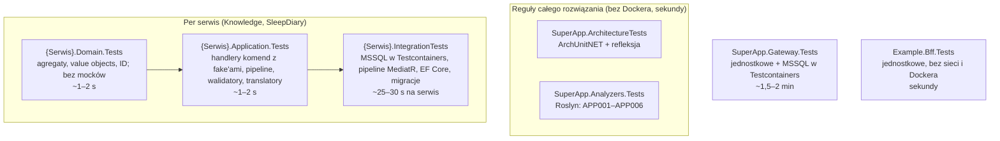
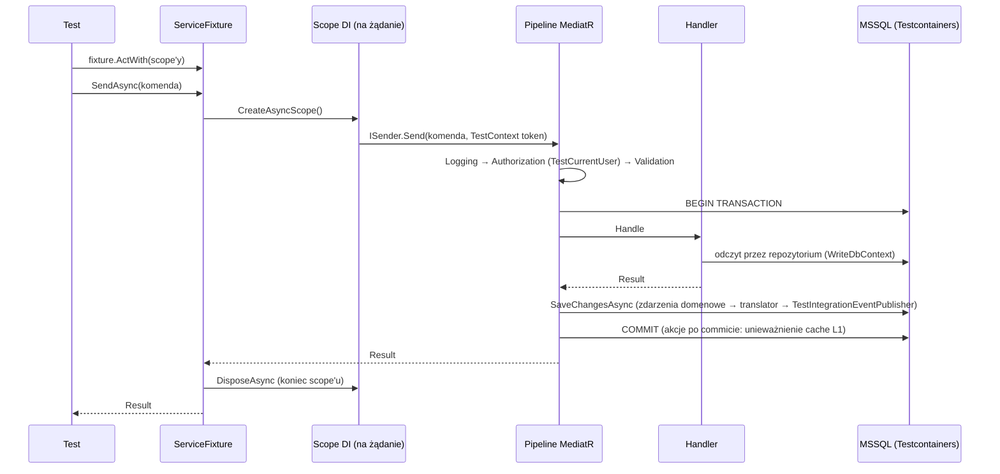

# 12. Testy

Strategia testowania i piramida testów: struktura projektów testowych, runner xUnit v3 na Microsoft.Testing.Platform (MTP), testy jednostkowe domeny bez mocków, testy warstwy aplikacji z fake'ami portów, testy integracyjne z Testcontainers (MSSQL), testy architektury NetArchTest oraz testy analizatorów Roslyn.

**Wymagania wstępne:** [1 Start](01-start.md) (build, Docker), [3 Zasady](03-zasady.md), [5 Model domeny](05-model-domeny.md)
(agregaty, `Result`, zdarzenia), [6 Warstwa aplikacji](06-warstwa-aplikacji.md) (komendy, zapytania, pipeline behaviors),
[7 Dane i EF Core](07-dane-i-ef-core.md) (Unit of Work, unikalne indeksy, migracje). Cache w testach: [11 Cache](11-cache.md).

> **W skrócie**
>
> - Piramida: dużo szybkich testów domeny (bez mocków), mniej testów handlerów z fake'ami portów, testy integracyjne na
>   prawdziwym MSSQL (Testcontainers) dla wszystkiego, co dotyka EF Core i SQL, oraz testy architektury i analizatorów, które
>   pilnują reguł całego rozwiązania.
> - Runner: xUnit v3 na Microsoft.Testing.Platform (`global.json` → `"test": { "runner": "Microsoft.Testing.Platform" }`).
>   Projekt testów jest aplikacją (`OutputType=Exe`). Uruchamiasz `dotnet test --solution SuperApp.slnx` albo
>   `dotnet test --project <ścieżka>`; filtry to `--filter-class`, `--filter-method` itd.
> - Reguły kompilatora obowiązują także w testach: ostrzeżenia są błędami, `APP001` (zignorowany `Result`) i `xUnit1051`
>   (brak `TestContext.Current.CancellationToken`) zatrzymują build.
> - Testy integracyjne serwisu dzielą **jeden** kontener MSSQL i jeden `ServiceFixture` (`AssemblyFixture`). Klasy, które
>   wysyłają żądania przez pipeline, mają `[Collection(PipelineCollection.Name)]`, bo zmieniają wspólnego `CurrentUser`
>   i czytają wspólny cache. Dane w testach są unikalne (`Guid.NewGuid()`), bo baza nie jest czyszczona między testami.
> - Zdarzenia integracyjne w testach trafiają do fake'a publikatora; RabbitMQ, Redis, warstwę HTTP i JWT sprawdzasz lokalnie
>   w docker compose ([13](13-lokalne-srodowisko-i-debugowanie.md)).
> - Test architektury, który nie przechodzi, oznacza złamanie ADR: poprawiasz kod, nie test.

Kod w blokach jest skopiowany z plików wskazanych nad blokiem. Pliki testów prawie nie mają komentarzy XML, więc pokazuję je
w całości; w kodzie produkcyjnym pomijam komentarze `///`, gdy nie są tematem.

---

## 12.1 Piramida testów tego repozytorium



Czasy pochodzą z pełnego przebiegu `dotnet test --solution SuperApp.slnx` na maszynie deweloperskiej (wszystkie projekty biegną
równolegle; całość trwa około 1 min 40 s i jest zdominowana przez `SuperApp.Gateway.Tests`).

| Projekt | Co testuje | Zależności | Docker |
|---|---|---|---|
| `{Serwis}.Domain.Tests` | reguły agregatów, value objectów i silnych ID; zdarzenia domenowe; to, że assembly `Domain` nie referuje niczego poza `SuperApp.Framework.Domain` | tylko `{Serwis}.Domain` | nie |
| `{Serwis}.Application.Tests` | handlery komend z fake'ami portów, walidatory, translatory zdarzeń integracyjnych, prawdziwy pipeline MediatR (kolejność behaviors, transakcja), rejestrację handlerów | `{Serwis}.Application` + `Microsoft.AspNetCore.App` (DI, logging) | nie |
| `{Serwis}.IntegrationTests` | handlery zapytań, repozytoria, konfigurację EF, migracje, ograniczenia bazy (`CHECK`, unikalne indeksy), unieważnianie cache, przepływy end-to-end przez pipeline | `{Serwis}.Infrastructure` + `Testcontainers.MsSql` | **tak** |
| `SuperApp.Gateway.Tests` | wylogowanie z sesji bramy (`/bff/logout`), retry idempotentnych GET, mapowanie konfiguracji YARP, schemat `gateway` (trasy z bazy: tylko trasa do BFF experience, sesje, odświeżanie tokenów, klucze Data Protection) | `SuperApp.Gateway` + `Testcontainers.MsSql` | **tak** (część testów) |
| `Example.Bff.Tests` | BFF experience: przekazywanie odpowiedzi serwisu bez zmian, przekazywanie tokenu użytkownika, klienci Refit z `AddDownstreamApi`, częściowe renderowanie (`PartialResponseFetcher`), odpowiedź 403 polityki scope, podział kontraktów publiczny/wewnętrzny | `Example.Bff` + `Microsoft.AspNetCore.App` | nie |
| `SuperApp.ArchitectureTests` | reguły 1–14 (ADR-0025, ADR-0036, ADR-0038): granice serwisów i warstw, `FromTrusted`, handlery `internal sealed` we właściwej warstwie, kolejność behaviors, forwarder analityki, granice BFF | Api i Worker każdego serwisu, BFF, brama, Migrator | nie |
| `SuperApp.Analyzers.Tests` | reguły analizatorów `APP001`–`APP006` | `SuperApp.Analyzers` + `Microsoft.CodeAnalysis.*.Testing` | nie |

Czego **nie ma** i co trzeba sprawdzić inaczej:

| Obszar | Dlaczego nie ma testu automatycznego | Jak sprawdzić |
|---|---|---|
| Kontrolery, wiązanie modelu, mapowanie `Result` → `ProblemDetails`, walidacja JWT | nie ma projektu testów HTTP. `Program` jest `public partial`, a `Knowledge.Api` ma `InternalsVisibleTo` dla `Knowledge.IntegrationTests`, ale żaden test nie startuje API przez `WebApplicationFactory<Program>`. To wzorzec do pierwszego użycia, nie istniejący kod | `curl` na lokalnym środowisku ([8](08-api-i-kontrakty.md), [13](13-lokalne-srodowisko-i-debugowanie.md)); diff kontraktu `openapi/*.json` w review |
| Dostarczanie outboxa do RabbitMQ, konsumenci Workera | testy integracyjne rejestrują `AddKnowledgeCore` bez MassTransit i fake publikatora | docker compose, konsola RabbitMQ ([10](10-zdarzenia-i-integracja.md)) |
| Redis (L2) | testy działają bez connection stringu `Redis`, więc tylko L1 w pamięci | lokalne środowisko ([11](11-cache.md)) |
| Uprawnienia loginów `{serwis}_app` do schematów | kontener Testcontainers używa `sa` | lokalne środowisko z bootstrapem ([7.1](07-dane-i-ef-core.md)) |

---

## 12.2 Gdzie napisać test: tabela decyzji

| Co zmieniasz | Gdzie test | Styl | Przykład |
|---|---|---|---|
| Regułę agregatu (np. „opublikowany materiał musi mieć treść”) | `{Serwis}.Domain.Tests` | wywołanie metody agregatu, asercja na `Result`/`Error` i zdarzeniach | `MaterialTests.Publishing_requires_content` |
| Value object, silne ID (granice zakresu, normalizacja) | `{Serwis}.Domain.Tests` | `[Theory]` z wartościami granicznymi | `ContentBuilderTests.Rejects_non_https_urls`, `CategoryTests.Name_that_fits_after_trimming_is_accepted` |
| Handler komendy (orkiestracja: użytkownik, istnienie, wywołanie agregatu) | `{Serwis}.Application.Tests` | handler tworzony ręcznie z fake'ami | `LibraryHandlerTests`, `RecordSleepEntryTests` |
| Walidator (długości, wymagane pola) | `{Serwis}.Application.Tests` | `new XValidator().Validate(...)` | `TextValidationTests`, `SleepEntryInputValidationTests` |
| Translator zdarzenia domenowego na integracyjne | `{Serwis}.Application.Tests` | handler zdarzenia z fake'iem publikatora | `IntegrationEventTranslatorTests` |
| Zachowanie pipeline (autoryzacja przed walidacją, brak commitu po błędzie) | `{Serwis}.Application.Tests` | prawdziwy MediatR + `FakeUnitOfWork` | `PipelineTests` |
| Handler zapytania, projekcja, stronicowanie, widoczność | `{Serwis}.IntegrationTests` | `fixture.SendAsync(query)` | `ReaderVisibilityTests` |
| Repozytorium, konfiguracja EF, migracja, `CHECK`, unikalny indeks | `{Serwis}.IntegrationTests` | scope DI + `IUnitOfWork`, czasem surowy SQL | `UniqueConstraintTests`, `SchemaTests`, `OwnedPositionTests` |
| Unieważnianie cache po commicie | `{Serwis}.IntegrationTests` | ręczna transakcja przez `IUnitOfWork` | `CacheInvalidationTests` |
| Przepływ obejmujący kilka komend i zapytań | `{Serwis}.IntegrationTests` | scenariusz przez `fixture.SendAsync` | `KnowledgeFlowTests`, `SleepDiaryFlowTests` |
| Akcja BFF z własną logiką (endpoint komponowany, zmiana kształtu danych, API wewnętrzne) | `{Experience}.Bff.Tests` | odpowiedzi Refit zbudowane w teście (`Responses`) albo klient z nagrywającym `HttpMessageHandler` | `PartialResponseFetcherTests`, `DownstreamClientTests` |
| Nowa operacja w kontrakcie BFF | `{Experience}.Bff.Tests` (istniejące testy kontraktu) | testy czytają commitowane `Example.Bff_public.json` i `Example.Bff_internal.json` | `ContractSplitTests` |
| Nowa reguła granic warstw lub serwisów (nowy ADR) | `SuperApp.ArchitectureTests` | ArchUnitNET albo refleksja | `ArchitectureRules` |
| Nowa reguła analizatora | `SuperApp.Analyzers.Tests` | źródło z markerami `{|APP00x:...|}` | `AnalyzerTests` |

Zasada wyboru: testuj na **najniższym** poziomie, który w ogóle może wykryć błąd. Reguła agregatu sprawdzona w teście
integracyjnym jest wolna i myli przyczyny (porażka może pochodzić z SQL). Z kolei handler zapytania sprawdzony z fake'iem
`DbContext` niczego nie dowodzi, bo błędy zapytań powstają przy tłumaczeniu LINQ na SQL; dlatego handlery zapytań testuje się
wyłącznie na MSSQL.

---

## 12.3 xUnit v3 na Microsoft.Testing.Platform

### Konfiguracja

`global.json` wybiera runner dla `dotnet test`:

```json
{
  "sdk": {
    "version": "10.0.301",
    "rollForward": "latestFeature"
  },
  "test": {
    "runner": "Microsoft.Testing.Platform"
  }
}
```

Każdy projekt testów wygląda tak samo (`src/Services/Knowledge/tests/Knowledge.IntegrationTests/Knowledge.IntegrationTests.csproj`):

```xml
<Project Sdk="Microsoft.NET.Sdk">

  <!-- Integration tests against MSSQL in Testcontainers: migrations, repositories, query handlers (architecture rules §15). -->
  <PropertyGroup>
    <OutputType>Exe</OutputType>
  </PropertyGroup>

  <ItemGroup>
    <PackageReference Include="xunit.v3" />
    <PackageReference Include="xunit.runner.visualstudio" PrivateAssets="all" />
    <PackageReference Include="Microsoft.NET.Test.Sdk" />
    <PackageReference Include="Testcontainers.MsSql" />
  </ItemGroup>

  <ItemGroup>
    <ProjectReference Include="..\..\Knowledge.Infrastructure\Knowledge.Infrastructure.csproj" />
  </ItemGroup>

</Project>
```

- `OutputType=Exe`: w xUnit v3 projekt testów jest aplikacją konsolową, która sama uruchamia swoje testy. `dotnet test`
  uruchamia ją w trybie MTP; bezpośrednie uruchomienie pliku `.exe` startuje natywny runner xUnit (inna składnia opcji, 12.10).
- `xunit.runner.visualstudio` i `Microsoft.NET.Test.Sdk` są potrzebne do wykrywania testów w IDE (Test Explorer w Visual Studio
  i Riderze).
- Wersje pakietów są w `Directory.Packages.props` (grupa „Testy”): `xunit.v3` 4.0.1, `Testcontainers.MsSql` 4.15.0,
  `TngTech.ArchUnitNET.xUnitV3` 0.13.4. Nie dodawaj bibliotek do mocków ani asercji (Moq, NSubstitute, FluentAssertions):
  repozytorium ich nie używa, a nowy pakiet wymaga uzasadnienia ([3 Zasady](03-zasady.md)).

`Directory.Build.props` traktuje jako projekt testów każdy projekt, którego nazwa kończy się na `Tests`:

```xml
<IsTestProject Condition="$(MSBuildProjectName.EndsWith('Tests'))">true</IsTestProject>
...
<ItemGroup Condition="'$(IsTestProject)' == 'true'">
  <Using Include="Xunit" />
</ItemGroup>

<!-- Testy nie są API: bez wymogu dokumentacji XML (ADR-0033). -->
<PropertyGroup Condition="'$(IsTestProject)' == 'true'">
  <NoWarn>$(NoWarn);CS1591;APP006</NoWarn>
</PropertyGroup>
```

Skutki: w testach nie piszesz `using Xunit;`, nie musisz dokumentować publicznych klas testów, a projekt **musi** mieć nazwę
z końcówką `Tests` (inaczej dostaniesz błędy CS1591 za brak dokumentacji XML).

### Reguły kompilatora w testach

Testy są kompilowane z tymi samymi regułami co kod produkcyjny (`TreatWarningsAsErrors`, analizatory `SuperApp.Analyzers`). Dwie
reguły spotkasz najczęściej:

**xUnit1051.** Analizator xUnit wymaga przekazywania `TestContext.Current.CancellationToken` do metod, które przyjmują
`CancellationToken`. Przy ostrzeżeniach jako błędach to błąd kompilacji:

```
error xUnit1051: Calls to methods which accept CancellationToken should use TestContext.Current.CancellationToken to allow test cancellation to be more responsive.
```

Źle:

```csharp
var result = await handler.Handle(command, CancellationToken.None);
```

Dobrze (`LibraryHandlerTests`):

```csharp
var result = await Handler("user-1").Handle(new AddFavorite(FavoriteItemType.Material, material.Id.Value), TestContext.Current.CancellationToken);
```

Token z `TestContext` jest anulowany, gdy runner przerywa przebieg (Ctrl+C, `--stop-on-fail`, timeout), więc wiszące zapytanie
do bazy nie blokuje zakończenia. `ServiceFixture.SendAsync` przekazuje go za Ciebie.

**APP001.** Zignorowany `Result` jest błędem także w teście, również po `await`:

```
error APP001: The result of type 'Result' is ignored; handle the error or discard it explicitly (ADR-0015)
```

Źle (krok przygotowania, który po cichu nie zadziałał, zamienia test w fałszywie zielony):

```csharp
category.Rename("Inna");
await fixture.SendAsync(new PublishMaterial(materialId));
```

Dobrze: każdy krok przygotowania kończy się asercją sukcesu (`ServiceFixtureExtensions.CreatePublishedArticleAsync`):

```csharp
Assert.True((await fixture.SendAsync(new PublishMaterial(created))).IsSuccess);
```

Reguła 5 testów architektury (`FromTrusted` tylko w Infrastructure) dotyczy wyłącznie assembly produkcyjnych. W testach
`FromTrusted` jest dozwolone, gdy potrzebujesz wartości bez walidacji (np. `CategoryId.FromTrusted(categoryId)`
w `CacheInvalidationTests`), ale w testach domeny lepiej używać `ResultAssert.Success(X.Create(...))`, bo wtedy test przy okazji
sprawdza dane.

**Rozpakowanie wyniku w teście** (`SuperApp.Framework.Testing`, ADR-0047). `Result<T>` nie ma `Value`, a `Error` jest nullowalny,
więc testy używają `ResultAssert`:

| Metoda | Działanie |
|---|---|
| `ResultAssert.Success(result)` | zwraca wartość `Result<T>` (dla `Result` tylko sprawdza sukces); przy porażce test kończy się `ResultAssertionException` z kodem i komunikatem błędu |
| `ResultAssert.Failure(result)` | zwraca `Error`; przy sukcesie test kończy się wyjątkiem |

```csharp
var category = ResultAssert.Success(Category.Create("Sen", "sen"));
Assert.Equal(CategoryErrors.InvalidSlug, ResultAssert.Failure(Category.Create("Sen", "Sen")));
```

Projekt referują tylko projekty testów (także w szablonie serwisu); kod produkcyjny nie może go referować (reguła architektury 15).

### Cykl życia testów w xUnit v3

| Mechanizm | Ile instancji | Użycie w repozytorium |
|---|---|---|
| Konstruktor klasy testów | **nowa instancja na każdy test** | pola `_unitOfWork`, `_categories` w `PipelineTests` są świeże w każdym teście |
| `IAsyncLifetime` na klasie testów | `InitializeAsync`/`DisposeAsync` przy **każdym** teście | `GatewayDatabaseTests`: osobny kontener MSSQL dla każdego testu |
| `[assembly: AssemblyFixture(typeof(T))]` | **jedna** instancja na całe assembly, wstrzykiwana do konstruktorów | `ServiceFixture` w `Knowledge.IntegrationTests` i `SleepDiary.IntegrationTests` |
| `[Collection("nazwa")]` | klasy z tą samą nazwą kolekcji biegną **sekwencyjnie** | `PipelineCollection` w `Knowledge.IntegrationTests` |

Domyślnie xUnit uruchamia **kolekcje** równolegle, a każda klasa bez `[Collection]` jest osobną kolekcją. Testy w jednej klasie
biegną zawsze po kolei. Projekty testów (`dotnet test --solution`) też biegną równolegle, każdy w osobnym procesie.

---

## 12.4 Testy domeny

Domena nie zależy od niczego technicznego, więc jej testy to zwykłe wywołania metod: bez kontenera DI, bez bazy, bez mocków.
Sprawdzasz trzy rzeczy: **wynik** (`Result`, kod błędu), **stan** agregatu po operacji i **zdarzenia domenowe**.

`src/Services/Knowledge/tests/Knowledge.Domain.Tests/CategoryTests.cs`:

```csharp
using Knowledge.Domain.Categories;
using Knowledge.Domain.Categories.Events;

namespace Knowledge.Domain.Tests;

public sealed class CategoryTests
{
    [Fact]
    public void Renaming_to_the_current_name_changes_nothing_and_raises_no_event()
    {
        var category = ResultAssert.Success(Category.Create("Sen", "sen"));
        category.ClearDomainEvents();

        Assert.True(category.Rename("Sen").IsSuccess);
        Assert.True(category.Rename("  Sen  ").IsSuccess);

        Assert.Equal("Sen", category.Name);
        Assert.Empty(category.DomainEvents);
    }

    [Fact]
    public void Renaming_to_a_different_name_raises_event()
    {
        var category = ResultAssert.Success(Category.Create("Sen", "sen"));
        category.ClearDomainEvents();

        Assert.True(category.Rename("Zdrowy sen").IsSuccess);

        Assert.Equal("Zdrowy sen", category.Name);
        Assert.Equal(category.Id, Assert.Single(category.DomainEvents.OfType<CategoryChanged>()).CategoryId);
    }

    [Fact]
    public void Changing_only_letter_case_is_a_rename()
    {
        var category = ResultAssert.Success(Category.Create("sen", "sen"));
        category.ClearDomainEvents();

        Assert.True(category.Rename("Sen").IsSuccess);

        Assert.Equal("Sen", category.Name);
        Assert.Single(category.DomainEvents.OfType<CategoryChanged>());
    }

    [Fact]
    public void Name_that_fits_after_trimming_is_accepted()
    {
        var name = new string('a', Category.MaxNameLength);

        var category = Category.Create($"  {name}  ", "sen");

        Assert.Equal(name, category.Value.Name);
    }
}
```

Na co zwrócić uwagę:

- `ClearDomainEvents()` po utworzeniu: `Create` też zgłasza zdarzenie, a test dotyczy tylko `Rename`. Bez tego
  `Assert.Empty(category.DomainEvents)` nie przejdzie z powodu, który nie jest tematem testu.
- Granice z **stałych domeny** (`Category.MaxNameLength`), nie z liczb wpisanych ręcznie: zmiana limitu nie psuje testu
  i test dalej sprawdza granicę.
- Nazwa testu jest zdaniem opisującym regułę biznesową. Gdy test padnie, nazwa w raporcie mówi, która reguła jest złamana.

Testy z czasem przekazują stały moment (`MaterialTests`):

```csharp
private static readonly DateTimeOffset Now = new(2026, 9, 30, 12, 0, 0, TimeSpan.Zero);

[Fact]
public void Publishing_requires_content()
{
    var material = ResultAssert.Success(Material.Create(MaterialType.Article, "Tytuł", null, null, null, Now));

    Assert.Equal(MaterialErrors.ContentRequired, material.Publish(Now).Error);
}
```

Agregaty przyjmują `now` jako parametr (nie czytają zegara), więc test jest powtarzalny. Ten sam wzorzec ma `SleepEntryTests`.

Każdy serwis ma też test zależności domeny (`DomainDependencyTests`), który sprawdza referencje skompilowanego assembly:

```csharp
[Fact]
public void Domain_references_only_framework_domain()
{
    var references = KnowledgeDomain.Assembly.GetReferencedAssemblies()
        .Select(reference => reference.Name!)
        .Where(name => !name.StartsWith("System", StringComparison.Ordinal) && name != "netstandard");

    Assert.All(references, name => Assert.Equal("SuperApp.Framework.Domain", name));
}
```

To szybka, lokalna wersja reguły 2 testów architektury: padnie, gdy ktoś doda do `Domain` pakiet z EF Core czy MediatR.

### Źle / Dobrze

| Źle | Dobrze | Dlaczego |
|---|---|---|
| `Assert.True(result.IsFailure)` | `Assert.Equal(MaterialErrors.ContentRequired, result.Error)` | test z `IsFailure` przejdzie przy **dowolnym** błędzie, także przy błędzie z innej reguły; porównanie `Error` (rekord: kod, typ, komunikat) sprawdza dokładnie tę regułę |
| `Assert.Throws<InvalidOperationException>(() => material.Publish(now))` | asercja na `Result` | naruszenie reguły to `Result`, nie wyjątek (ADR-0015); wyjątek w domenie to błąd techniczny |
| `Assert.Contains("treści", result.Error.Message)` | porównanie `Error` albo `Error.Code` | komunikaty mogą się zmieniać, kody są kontraktem |
| `DateTimeOffset.UtcNow` w teście | stała `Now` | test zależny od zegara bywa niestabilny (północ, strefy, porównania czasu) |
| refleksja do prywatnych pól agregatu | asercja na publicznym stanie i zdarzeniach | test opisuje zachowanie, nie implementację; refaktoryzacja nie psuje testów |
| mock repozytorium w teście domeny | brak: domena nie zna repozytoriów | jeśli reguła wymaga repozytorium, to nie jest reguła agregatu, tylko handlera (12.5) |

---

## 12.5 Testy warstwy aplikacji

### Handler komendy z fake'ami portów

Handler komendy zależy od portów (repozytoria, `ICurrentUser`, `IClock`, `IUnitOfWork`). W testach zastępujesz je prostymi
klasami w pamięci z katalogu `Fakes/`. Handler tworzysz ręcznie, bez kontenera DI, i wywołujesz `Handle` bezpośrednio:
pipeline (autoryzacja, walidacja, transakcja) **nie** działa, więc testujesz wyłącznie orkiestrację w handlerze.

`src/Services/Knowledge/tests/Knowledge.Application.Tests/LibraryHandlerTests.cs`:

```csharp
using SuperApp.Framework.Domain.Results;
using Knowledge.Application.Tests.Fakes;
using Knowledge.Domain.Library.Favorites;
using Knowledge.Application.Features.Library.AddFavorite;
using Knowledge.Domain.Library;
using Knowledge.Domain.Materials;
using Knowledge.Domain.Materials.Content;

namespace Knowledge.Application.Tests;

public sealed class LibraryHandlerTests
{
    private readonly FakeClock _clock = new();
    private readonly FakeMaterialRepository _materials = new();
    private readonly FakeFavoriteRepository _favorites = new();

    [Fact]
    public async Task Adding_unpublished_material_to_favorites_is_rejected()
    {
        var material = ResultAssert.Success(Material.Create(MaterialType.Article, "Szkic", null, null, null, _clock.UtcNow));
        _materials.Add(material);

        var result = await Handler("user-1").Handle(new AddFavorite(FavoriteItemType.Material, material.Id.Value), TestContext.Current.CancellationToken);

        Assert.Equal(LibraryErrors.ItemNotAvailable, result.Error);
        Assert.Empty(_favorites.Items);
    }

    [Fact]
    public async Task Adding_favorite_is_idempotent()
    {
        var material = PublishedMaterial();
        var command = new AddFavorite(FavoriteItemType.Material, material.Id.Value);

        Assert.True((await Handler("user-1").Handle(command, TestContext.Current.CancellationToken)).IsSuccess);
        Assert.True((await Handler("user-1").Handle(command, TestContext.Current.CancellationToken)).IsSuccess);

        Assert.Single(_favorites.Items);
    }

    [Fact]
    public async Task Anonymous_user_cannot_add_favorites()
    {
        var material = PublishedMaterial();

        var result = await Handler(null).Handle(new AddFavorite(FavoriteItemType.Material, material.Id.Value), TestContext.Current.CancellationToken);

        Assert.Equal(ErrorType.Forbidden, result.Error.Type);
    }

    private AddFavoriteHandler Handler(string? subject) =>
        new(_favorites, _materials, new FakeCollectionRepository(), new FakeCurrentUser(subject), _clock);

    private Material PublishedMaterial()
    {
        var material = ResultAssert.Success(Material.Create(MaterialType.Article, "Artykuł", null, null, null, _clock.UtcNow));
        Assert.True(material.ReplaceContent([new BlockSpec(BlockType.Paragraph, Text: [new SpanSpec("Treść")])], _clock.UtcNow).IsSuccess);
        Assert.True(material.Publish(_clock.UtcNow).IsSuccess);
        _materials.Add(material);
        return material;
    }
}
```

- Handler jest `internal`; testy go widzą dzięki `<InternalsVisibleTo Include="Knowledge.Application.Tests" />`
  w `Knowledge.Application.csproj`.
- Dane przygotowujesz **prawdziwymi agregatami** (`Material.Create`, `Publish`), a nie przez ustawianie pól. Fake repozytorium
  przechowuje gotowe agregaty, więc stan jest zawsze poprawny z punktu widzenia domeny.
- Asercja na fake'u (`_favorites.Items`) sprawdza efekt, który w produkcji zapisałby Unit of Work.

### Katalog `Fakes/`

`src/Services/Knowledge/tests/Knowledge.Application.Tests/Fakes/`:

| Fake | Port | Zachowanie |
|---|---|---|
| `FakeClock` | `IClock` | stały czas `2026-09-30 12:00 UTC`, ustawialny (`UtcNow { get; set; }`) |
| `FakeCurrentUser(subject, params scopes)` | `ICurrentUser` | `IsAuthenticated` = `subject is not null`; `HasScope` sprawdza listę z konstruktora |
| `FakeCategoryRepository`, `FakeMaterialRepository`, `FakeCollectionRepository`, `FakeFavoriteRepository` | interfejsy repozytoriów z `Domain` | lista `Items`; zapytania LINQ to Objects odpowiadające semantyce repozytorium (np. `IsPublishedAsync` sprawdza `Status`) |
| `FakeIntegrationEventPublisher` | `IIntegrationEventPublisher` | zapisuje każde zdarzenie w `Published` |
| `FakeUnitOfWork` | `IUnitOfWork` | liczy zapisy, commity i porzucenia zmian, symuluje nieudany zapis i transakcję konsumenta, wykonuje akcje po commicie |

Fake implementuje **semantykę** portu, nie tylko sygnaturę. `FakeMaterialRepository.IsPublishedAsync` zwraca `true` tylko dla
opublikowanego materiału, tak jak zapytanie SQL w `MaterialRepository`; gdyby zwracał zawsze `true`, test „nieopublikowany
materiał jest odrzucany” byłby bezwartościowy. SleepDiary trzyma swój jedyny fake repozytorium jako prywatną klasę
zagnieżdżoną w `RecordSleepEntryTests` (dozwolone przez APP004); w Knowledge fake'i są współdzielone, więc mają własne pliki.

### `FakeUnitOfWork`: zapis, commit i akcje po commicie

`src/Services/Knowledge/tests/Knowledge.Application.Tests/Fakes/FakeUnitOfWork.cs`:

```csharp
using SuperApp.Framework.Application.Persistence;
using SuperApp.Framework.Domain.Results;

namespace Knowledge.Application.Tests.Fakes;

/// <summary>
/// In-memory <see cref="IUnitOfWork"/> that counts saves, commits and discards, can simulate a failed save (e.g. a unique index conflict)
/// or a transaction opened by a consumer, and runs after-commit actions on commit, like the real write context.
/// </summary>
internal sealed class FakeUnitOfWork : IUnitOfWork
{
    private readonly List<Func<CancellationToken, Task>> _afterCommit = [];

    public int SaveCount { get; private set; }

    public int CommitCount { get; private set; }

    public int AfterCommitRuns { get; private set; }

    public Result SaveResult { get; set; } = Result.Success();

    public int DiscardCount { get; private set; }

    /// <summary>Set to <see langword="true"/> to simulate a command running inside a MassTransit consumer's transaction.</summary>
    public bool HasActiveTransaction { get; set; }

    public Task<IUnitOfWorkTransaction> BeginTransactionAsync(CancellationToken cancellationToken)
    {
        HasActiveTransaction = true;
        return Task.FromResult<IUnitOfWorkTransaction>(new Transaction(this));
    }

    public Task<Result> SaveChangesAsync(CancellationToken cancellationToken)
    {
        SaveCount++;
        return Task.FromResult(SaveResult);
    }

    public void OnCommitted(Func<CancellationToken, Task> action) => _afterCommit.Add(action);

    public void DiscardChanges()
    {
        DiscardCount++;
        _afterCommit.Clear();
    }

    private sealed class Transaction(FakeUnitOfWork owner) : IUnitOfWorkTransaction
    {
        public async Task CommitAsync(CancellationToken cancellationToken)
        {
            owner.CommitCount++;
            foreach (var action in owner._afterCommit)
            {
                await action(cancellationToken);
                owner.AfterCommitRuns++;
            }

            owner._afterCommit.Clear();
        }

        public ValueTask DisposeAsync()
        {
            owner.HasActiveTransaction = false;
            owner._afterCommit.Clear();
            return ValueTask.CompletedTask;
        }
    }
}
```

Jak odwzorowuje prawdziwy `WriteDbContextBase` ([7.5](07-dane-i-ef-core.md)):

| Prawdziwy Unit of Work | `FakeUnitOfWork` |
|---|---|
| `SaveChangesAsync` zwraca `Result`; naruszenie zamapowanego unikalnego indeksu daje błąd kontekstu, nie wyjątek | `SaveResult` ustawiasz na dowolny błąd, np. `CategoryErrors.SlugTaken`, i sprawdzasz, że pipeline go zwróci i **nie** zrobi commitu |
| `OnCommitted` rejestruje akcję; wykonuje się po `COMMIT` | akcje wykonuje `CommitAsync`; `AfterCommitRuns` mówi, ile się wykonało |
| `DisposeAsync` transakcji bez commitu wycofuje ją i porzuca akcje | `DisposeAsync` czyści listę akcji |
| `HasActiveTransaction` pozwala behaviorowi transakcyjnemu nie otwierać drugiej transakcji (konsument z inboxem) | `true` między `BeginTransactionAsync` a `DisposeAsync`; ustawiasz go ręcznie, żeby zasymulować komendę w transakcji konsumenta |
| `DiscardChanges` porzuca śledzone zmiany i akcje po commicie, gdy komenda w transakcji konsumenta zwróciła błąd | `DiscardChanges` zwiększa `DiscardCount` i czyści listę akcji |

### Prawdziwy pipeline MediatR z fake'ami

Gdy test dotyczy **pipeline** (kolejność behaviors, kiedy jest zapis i commit), budujesz mały kontener DI z
`AddAppApplication` i wysyłasz komendę przez `ISender`, tak jak robi to kontroler.

`src/Services/Knowledge/tests/Knowledge.Application.Tests/PipelineTests.cs`:

```csharp
using SuperApp.Framework.Application.Persistence;
using SuperApp.Framework.Application.Security;
using SuperApp.Framework.Domain.Results;
using Knowledge.Application.Tests.Fakes;
using SuperApp.Framework.Application;
using Knowledge.Application.Features.Categories.CreateCategory;
using Knowledge.Domain.Categories;
using MediatR;
using Microsoft.Extensions.DependencyInjection;

namespace Knowledge.Application.Tests;

/// <summary>Runs the real MediatR pipeline with fake ports to verify the behavior order (ADR-0017) and the transaction behavior (ADR-0027).</summary>
public sealed class PipelineTests
{
    private readonly FakeUnitOfWork _unitOfWork = new();
    private readonly FakeCategoryRepository _categories = new();

    [Fact]
    public async Task Authorization_runs_before_validation()
    {
        var result = await SendAsync(new CreateCategory(string.Empty, string.Empty), scopes: []);

        Assert.Equal("auth.missing_scope", result.Error.Code);
    }

    [Fact]
    public async Task Validation_errors_are_returned_as_result()
    {
        var result = await SendAsync(new CreateCategory(string.Empty, string.Empty), KnowledgeScopes.CatalogWrite);

        Assert.Equal(ErrorType.Validation, result.Error.Type);
        Assert.NotNull(result.Error.Details);
        Assert.Equal(0, _unitOfWork.CommitCount);
    }

    [Fact]
    public async Task Successful_command_is_saved_and_committed()
    {
        var result = await SendAsync(new CreateCategory("Sen", "sen"), KnowledgeScopes.CatalogWrite);

        Assert.True(result.IsSuccess);
        Assert.Equal(1, _unitOfWork.SaveCount);
        Assert.Equal(1, _unitOfWork.CommitCount);
    }

    [Fact]
    public async Task Failed_command_is_not_committed()
    {
        _categories.Add(ResultAssert.Success(Category.Create("Sen", "sen")));

        var result = await SendAsync(new CreateCategory("Sen", "sen"), KnowledgeScopes.CatalogWrite);

        Assert.Equal(CategoryErrors.SlugTaken, result.Error);
        Assert.Equal(0, _unitOfWork.SaveCount);
        Assert.Equal(0, _unitOfWork.CommitCount);
    }

    [Fact]
    public async Task Save_conflict_is_returned_as_result_and_not_committed()
    {
        _unitOfWork.SaveResult = CategoryErrors.SlugTaken;

        var result = await SendAsync(new CreateCategory("Sen", "sen"), KnowledgeScopes.CatalogWrite);

        Assert.Equal(CategoryErrors.SlugTaken, result.Error);
        Assert.Equal(1, _unitOfWork.SaveCount);
        Assert.Equal(0, _unitOfWork.CommitCount);
    }

    private async Task<Result<Guid>> SendAsync(CreateCategory command, params string[] scopes)
    {
        var services = new ServiceCollection();
        services.AddLogging();
        services.AddAppApplication(KnowledgeApplication.Assembly);
        services.AddSingleton<ICurrentUser>(new FakeCurrentUser("editor", scopes));
        services.AddSingleton<IUnitOfWork>(_unitOfWork);
        services.AddSingleton<ICategoryRepository>(_categories);

        await using var provider = services.BuildServiceProvider();
        return await provider.GetRequiredService<ISender>().Send(command, TestContext.Current.CancellationToken);
    }
}
```

Co dowodzi każdy test (przebieg pipeline opisuje [6 Warstwa aplikacji](06-warstwa-aplikacji.md)):

| Test | Co udowadnia |
|---|---|
| `Authorization_runs_before_validation` | pusta komenda bez scope'u dostaje `auth.missing_scope`, a nie `validation.failed`: `AuthorizationBehavior` działa przed `ValidationBehavior` (ADR-0017); klient bez uprawnień nie dowie się nic o regułach walidacji |
| `Validation_errors_are_returned_as_result` | walidacja zwraca `Result` z `Details` (pola i komunikaty), handler i commit się nie wykonały |
| `Successful_command_is_saved_and_committed` | po sukcesie handlera `TransactionBehavior` wywołuje `SaveChangesAsync` dokładnie raz i commituje; handler sam niczego nie zapisuje |
| `Failed_command_is_not_committed` | błąd z handlera (slug zajęty) kończy pipeline bez zapisu i bez commitu |
| `Save_conflict_is_returned_as_result_and_not_committed` | błąd zwrócony przez `SaveChangesAsync` (w produkcji: wyścig na unikalnym indeksie) trafia do klienta jako `Result`, a transakcja jest wycofana |

`AddAppApplication(KnowledgeApplication.Assembly)` rejestruje handlery komend, walidatory i handlery zdarzeń domenowych z
Application oraz cztery behaviors. Rejestrujesz tylko te porty, których użyje handler wysyłanej komendy. Brak rejestracji
objawi się wyjątkiem `InvalidOperationException: Unable to resolve service for type ...` przy `Send`.

### Rejestracja handlerów, walidatory, translatory

`PipelineRegistrationTests` (w obu serwisach) sprawdza, że każda komenda z `Application` ma zarejestrowany handler. Test
wyłapuje komendę bez handlera albo handler, który przez pomyłkę implementuje zły interfejs:

```csharp
[Fact]
public void Every_command_has_a_registered_handler()
{
    var services = new ServiceCollection();
    services.AddAppApplication(KnowledgeApplication.Assembly);

    var commands = KnowledgeApplication.Assembly.GetTypes()
        .Select(type => (Type: type, Command: type.GetInterfaces().FirstOrDefault(IsCommand)))
        .Where(candidate => candidate.Command is not null);

    Assert.All(commands, candidate =>
    {
        var handler = typeof(IRequestHandler<,>).MakeGenericType(candidate.Type, candidate.Command!.GenericTypeArguments[0]);
        Assert.Contains(services, descriptor => descriptor.ServiceType == handler);
    });
}
```

Zapytań ten test nie sprawdza, bo ich handlery są w Infrastructure (ADR-0026); zapytanie bez handlera wychodzi w teście
integracyjnym, który je wysyła.

Walidatory testujesz bezpośrednio (`TextValidationTests`). Dobry test walidatora porównuje go z domeną na tych samych
granicach, żeby walidator nie przepuścił czegoś, co domena odrzuci (i odwrotnie):

```csharp
[Fact]
public void Material_title_and_description_that_fit_after_trimming_are_accepted()
{
    var command = new CreateMaterial(MaterialType.Article, Padded(Material.MaxTitleLength), Padded(Material.MaxDescriptionLength), null, null);

    Assert.True(new CreateMaterialValidator().Validate(command).IsValid);
    Assert.True(Material.Create(command.Type, command.Title, command.Description, null, null, DateTimeOffset.UnixEpoch).IsSuccess);
}
```

Translatory zdarzeń domenowych na integracyjne (`IntegrationEventTranslatorTests`) wywołujesz z prawdziwym zdarzeniem
zebranym z agregatu i sprawdzasz zawartość opublikowanego kontraktu:

```csharp
[Fact]
public async Task Material_published_carries_the_aggregate_publication_time()
{
    var material = ResultAssert.Success(Material.Create(MaterialType.Article, "Higiena snu", null, null, null, Created));
    Assert.True(material.ReplaceContent([new BlockSpec(BlockType.Paragraph, Text: [new SpanSpec("Treść")])], Created).IsSuccess);
    Assert.True(material.Publish(Changed).IsSuccess);
    var domainEvent = material.DomainEvents.OfType<MaterialPublished>().Single();

    await new MaterialPublishedTranslator(_publisher).HandleAsync(domainEvent, TestContext.Current.CancellationToken);

    var published = Assert.IsType<MaterialPublishedV1>(Assert.Single(_publisher.Published));
    Assert.Equal(new MaterialPublishedV1(material.Id.Value, "Article", "Higiena snu", Changed), published);
    Assert.Equal(material.PublishedAt, published.PublishedAt);
}
```

Porównanie całego rekordu `MaterialPublishedV1` wyłapie każde zgubione lub zamienione pole kontraktu.

### Źle / Dobrze

| Źle | Dobrze | Dlaczego |
|---|---|---|
| test handlera sprawdza `_unitOfWork.SaveCount == 1` | sprawdzaj efekt na fake'u repozytorium; zapis sprawdza `PipelineTests` | handler nie zapisuje; zapis należy do `TransactionBehavior` |
| fake zwraca stałą wartość niezależnie od danych (`IsPublishedAsync => true`) | fake odwzorowuje semantykę portu | inaczej test przejdzie także przy błędnym handlerze |
| przygotowanie stanu przez prywatne settery/refleksję | prawdziwe metody agregatu (`Create`, `Publish`) | stan zawsze spełnia niezmienniki, a test czyta się jak scenariusz |
| test autoryzacji scope'u na handlerze wywołanym bezpośrednio | test przez pipeline (`PipelineTests`) albo integracyjny | `[RequiresScope]` sprawdza `AuthorizationBehavior`, którego przy `handler.Handle(...)` nie ma |
| jeden test sprawdzający kilka reguł naraz | jeden test na regułę, nazwa = reguła | porażka od razu wskazuje złamaną regułę |

---

## 12.6 Testy integracyjne (Testcontainers MSSQL)

### `ServiceFixture`: jeden kontener na assembly

`src/Services/Knowledge/tests/Knowledge.IntegrationTests/Infrastructure/ServiceFixture.cs`:

```csharp
using SuperApp.Framework.Application.Events;
using SuperApp.Framework.Application.Security;
using SuperApp.Framework.Application.Time;
using MediatR;
using Microsoft.EntityFrameworkCore;
using Microsoft.Extensions.Configuration;
using Microsoft.Extensions.DependencyInjection;
using Knowledge.Infrastructure;
using Knowledge.Infrastructure.Persistence.Write;
using Testcontainers.MsSql;

[assembly: AssemblyFixture(typeof(Knowledge.IntegrationTests.Infrastructure.ServiceFixture))]

namespace Knowledge.IntegrationTests.Infrastructure;

/// <summary>
/// MSSQL in a container, migrations of the write context and the MediatR pipeline without the MassTransit bus
/// (integration events are published through a fake, ADR-0005).
/// </summary>
public sealed class ServiceFixture : IAsyncLifetime
{
    private readonly MsSqlContainer _container = new MsSqlBuilder("mcr.microsoft.com/mssql/server:2022-latest").Build();

    public ServiceProvider Services { get; private set; } = null!;

    public TestCurrentUser CurrentUser { get; } = new();

    public TestIntegrationEventPublisher Publisher { get; } = new();

    public async ValueTask InitializeAsync()
    {
        await _container.StartAsync();

        var connectionString = _container.GetConnectionString();
        var configuration = new ConfigurationBuilder()
            .AddInMemoryCollection(new Dictionary<string, string?>
            {
                ["ConnectionStrings:Write"] = connectionString,
                ["ConnectionStrings:Read"] = connectionString,
            })
            .Build();

        var services = new ServiceCollection();
        services.AddLogging();
        services.AddSingleton(TimeProvider.System);
        services.AddSingleton<IClock>(new TestClock());
        services.AddSingleton<ICurrentUser>(CurrentUser);
        services.AddSingleton<IIntegrationEventPublisher>(Publisher);
        services.AddKnowledgeCore(configuration);
        Services = services.BuildServiceProvider(new ServiceProviderOptions { ValidateScopes = true });

        await using var scope = Services.CreateAsyncScope();
        var database = scope.ServiceProvider.GetRequiredService<KnowledgeWriteDbContext>().Database;
        if (!database.GetMigrations().Any())
        {
            throw new InvalidOperationException(
                "Serwis nie ma migracji. Utwórz pierwszą: dotnet ef migrations add Initial "
                + "-p src/Services/Knowledge/Knowledge.Infrastructure -s src/Services/Knowledge/Knowledge.Infrastructure --context KnowledgeWriteDbContext -o Migrations (ADR-0030).");
        }

        await database.MigrateAsync();
    }

    public async Task<TResponse> SendAsync<TResponse>(IRequest<TResponse> request)
    {
        await using var scope = Services.CreateAsyncScope();
        return await scope.ServiceProvider.GetRequiredService<ISender>().Send(request, TestContext.Current.CancellationToken);
    }

    public async ValueTask DisposeAsync()
    {
        await Services.DisposeAsync();
        await _container.DisposeAsync();
    }
}
```

Krok po kroku, co dzieje się przy starcie projektu testów:

1. `[assembly: AssemblyFixture(...)]` sprawia, że xUnit tworzy **jedną** instancję `ServiceFixture` dla całego assembly
   i wywołuje `InitializeAsync` przed pierwszym testem, który jej potrzebuje. Każda klasa testów dostaje ją przez konstruktor
   (`public sealed class KnowledgeFlowTests(ServiceFixture fixture)`).
2. `MsSqlBuilder(...).Build()` + `StartAsync()` uruchamia kontener `mcr.microsoft.com/mssql/server:2022-latest` na losowym
   porcie i czeka, aż serwer przyjmuje połączenia. `GetConnectionString()` zwraca connection string z loginem `sa`.
3. Kontener DI jest budowany tak jak w API, ale przez `AddKnowledgeCore` zamiast `AddKnowledgeInfrastructure`: Application,
   oba `DbContext`y, cache (bez Redis, więc tylko L1 w pamięci) i repozytoria, **bez** MassTransit. Porty, których normalnie
   dostarcza host, są zastąpione: `IClock` → `TestClock` (prawdziwy czas UTC), `ICurrentUser` → `TestCurrentUser`
   (ustawiany przez test), `IIntegrationEventPublisher` → `TestIntegrationEventPublisher` (lista w pamięci).
4. `ValidateScopes = true` wykrywa błędy czasu życia, np. singleton zależny od serwisu scoped (captive dependency). W API
   takie błędy wychodzą dopiero w środowisku Development, więc test integracyjny jest pierwszym miejscem, gdzie je zobaczysz.
5. Migracje `KnowledgeWriteDbContext` są stosowane do pustej bazy (`MigrateAsync`). Każdy przebieg testów sprawdza więc całą
   historię migracji od `Initial` do najnowszej; zepsuta migracja wychodzi w `dotnet test`, zanim trafi do Migratora.
6. `SendAsync` tworzy **nowy scope DI na każde żądanie**, jak ASP.NET Core na każde żądanie HTTP: świeży `DbContext`, pusty
   change tracker, osobna transakcja. Dzięki temu krok „odczyt po zapisie” naprawdę czyta z bazy, a nie ze śledzonych encji.



`SleepDiary.IntegrationTests` ma `ServiceFixture` o identycznej budowie (z `AddSleepDiaryCore`).

### Pomocnicy: `TestCurrentUser`, `ActWith`, gotowe kroki

`Infrastructure/TestCurrentUser.cs`:

```csharp
using SuperApp.Framework.Application.Security;

namespace Knowledge.IntegrationTests.Infrastructure;

public sealed class TestCurrentUser : ICurrentUser
{
    public string? Subject { get; set; } = "test-user";

    public HashSet<string> Scopes { get; } = [];

    public bool IsAuthenticated => Subject is not null;

    public bool HasScope(string scope) => Scopes.Contains(scope);
}
```

`Infrastructure/ServiceFixtureExtensions.cs`:

```csharp
using Knowledge.Application.Content;
using Knowledge.Application.Content.Blocks;
using Knowledge.Application.Features.Materials.CreateMaterial;
using Knowledge.Application.Features.Materials.PublishMaterial;
using Knowledge.Application.Features.Materials.ReplaceMaterialContent;
using Knowledge.Domain.Materials;

namespace Knowledge.IntegrationTests.Infrastructure;

/// <summary>Shortcuts for common steps of the integration scenarios.</summary>
public static class ServiceFixtureExtensions
{
    /// <summary>Replaces the scopes of the current test user.</summary>
    public static void ActWith(this ServiceFixture fixture, params string[] scopes)
    {
        fixture.CurrentUser.Scopes.Clear();
        fixture.CurrentUser.Scopes.UnionWith(scopes);
    }

    /// <summary>Creates an article with one paragraph and publishes it; the caller must hold the catalog write scope.</summary>
    public static async Task<Guid> CreatePublishedArticleAsync(this ServiceFixture fixture, string title)
    {
        var created = ResultAssert.Success(await fixture.SendAsync(new CreateMaterial(MaterialType.Article, title, null, null, null)));
        Assert.True((await fixture.SendAsync(new ReplaceMaterialContent(created, [new ParagraphBlockDto([new SpanDto("Treść")])]))).IsSuccess);
        Assert.True((await fixture.SendAsync(new PublishMaterial(created))).IsSuccess);
        return created;
    }
}
```

Każdy test zaczyna się od ustawienia uprawnień (`fixture.ActWith(...)`), bo poprzedni test w kolekcji zostawił swoje. Zmiana
użytkownika (np. dwóch czytelników) przez `fixture.CurrentUser.Subject`, zawsze z przywróceniem w `finally`
(`ReaderVisibilityTests.Completed_materials_list_contains_only_published_materials`):

```csharp
var subject = fixture.CurrentUser.Subject;
fixture.CurrentUser.Subject = $"reader-{Guid.NewGuid():N}";
try
{
    fixture.ActWith(KnowledgeScopes.LibraryWrite, KnowledgeScopes.LibraryRead);
    Assert.True((await fixture.SendAsync(new MarkMaterialCompleted(published))).IsSuccess);
    // ...
}
finally
{
    fixture.CurrentUser.Subject = subject;
}
```

`KnowledgeFlowTests` ma własną prywatną metodę `Act(...)` o tym samym działaniu co `ActWith`; nowe testy używają `ActWith`.

### `PipelineCollection`: dlaczego te testy nie biegną równolegle

`Infrastructure/PipelineCollection.cs`:

```csharp
namespace Knowledge.IntegrationTests.Infrastructure;

/// <summary>
/// Name of the test collection shared by all test classes that send requests through the pipeline. They change the shared
/// <see cref="ServiceFixture.CurrentUser"/> and read shared cache entries, so they must not run in parallel with each other.
/// </summary>
public static class PipelineCollection
{
    /// <summary>The collection name used with <c>[Collection(PipelineCollection.Name)]</c>.</summary>
    public const string Name = "Knowledge pipeline";
}
```

Klasy z `[Collection(PipelineCollection.Name)]`: `KnowledgeFlowTests`, `CacheInvalidationTests`, `ReaderVisibilityTests`,
`ExistenceCheckTests`, `OwnedPositionTests`, `UniqueConstraintTests`, `ConcurrencyConflictTests`. Powody:

1. **Wspólny użytkownik.** `TestCurrentUser` jest singletonem fixture'a. Test A ustawia `CatalogWrite`, test B w tym samym czasie
   czyści scope'y i ustawia `CatalogRead`; komenda testu A dostaje wtedy `auth.missing_scope`. Dodatkowo `HashSet<string>` nie
   jest bezpieczny dla wątków: równoczesne `Clear`/`UnionWith` i `Contains` mogą rzucić wyjątek albo dać przypadkowy wynik.
2. **Wspólny cache.** `HybridCache` jest singletonem, więc wpisy (lista kategorii, widok materiału) są wspólne dla wszystkich
   testów. `CacheInvalidationTests` sprawdza, czy wpis listy kategorii **jest** w cache; równoległe utworzenie kategorii w innym
   teście usuwa ten wpis i asercja pada losowo.
3. **Odczyty globalne.** Część zapytań zwraca dane całej bazy (lista kategorii). Test, który liczy elementy, widziałby dane
   tworzone równolegle.

Bez kolekcji takie testy przechodzą lokalnie dziewięć razy na dziesięć i padają w CI. Klasy, które nie korzystają z
`CurrentUser` ani z cache (np. `SchemaTests`), nie muszą być w kolekcji i biegną równolegle z resztą.

Źle (nowa klasa wysyła komendy przez pipeline, ale biegnie równolegle z kolekcją):

```csharp
public sealed class MaterialRatingTests(ServiceFixture fixture)
{
    [Fact]
    public async Task Summary_is_returned()
    {
        fixture.ActWith(KnowledgeScopes.CatalogWrite);
        // ...
    }
}
```

Dobrze:

```csharp
[Collection(PipelineCollection.Name)]
public sealed class MaterialRatingTests(ServiceFixture fixture)
```

`SleepDiary.IntegrationTests` nie ma kolekcji: jedyną klasą zmieniającą `CurrentUser` jest `SleepDiaryFlowTests`, a testy jednej
klasy i tak biegną po kolei. Gdy dodasz tam drugą klasę wysyłającą żądania przez pipeline, utwórz `PipelineCollection` według
wzoru z Knowledge.

### Dane unikalne w każdym teście

Baza nie jest czyszczona między testami ani między klasami: wszystkie testy jednego przebiegu piszą do tej samej bazy, a
kolejność testów nie jest gwarantowana. Dlatego:

- wartości z ograniczeniem unikalności zawierają `Guid`: `$"sen-{Guid.NewGuid():N}"` (slug kategorii), `$"race-{Guid.NewGuid():N}"`
  (użytkownik w teście wyścigu);
- asercje dotyczą **własnych** danych testu: `Assert.Contains(list.Value.Items, item => item.Id == materialId)`, nigdy
  `Assert.Single(list.Value.Items)` dla zapytania, które zwraca dane wszystkich testów;
- gdy test musi liczyć, zawęża zbiór do własnych danych: osobny użytkownik (`reader-{Guid}`), własna kategoria (filtr
  `ListCollections(category)` w `ReaderVisibilityTests`).

Źle:

```csharp
var category = await fixture.SendAsync(new CreateCategory("Sen", "sen"));
var list = await fixture.SendAsync(new ListCategories());
Assert.Single(list.Value);
```

Pierwszy przebieg przejdzie, drugi test z tym samym slugiem dostanie `knowledge.category.slug_taken`, a `Assert.Single` padnie, gdy
inny test utworzy kategorię wcześniej.

Dobrze (`KnowledgeFlowTests`):

```csharp
var category = await fixture.SendAsync(new CreateCategory("Sen", $"sen-{Guid.NewGuid():N}"));
// ...
Assert.Contains(list.Value.Items, item => item.Id == materialId);
```

### Fake publikatora zdarzeń integracyjnych

`Infrastructure/TestIntegrationEventPublisher.cs`:

```csharp
using SuperApp.Framework.Application.Events;

namespace Knowledge.IntegrationTests.Infrastructure;

public sealed class TestIntegrationEventPublisher : IIntegrationEventPublisher
{
    public List<object> Published { get; } = [];

    public Task PublishAsync<TEvent>(TEvent integrationEvent, CancellationToken cancellationToken)
        where TEvent : class
    {
        lock (Published)
        {
            Published.Add(integrationEvent);
        }

        return Task.CompletedTask;
    }
}
```

Co test z nim dowodzi: zdarzenie domenowe zostało zebrane z agregatu w `SaveChangesAsync`, właściwy translator je obsłużył
i wywołał publikację z poprawnymi danymi. Czego **nie** dowodzi: że wiadomość trafiła do tabeli outboxa i do RabbitMQ (to robi
`AddAppMessaging`, nieobecny w testach). Lista jest wspólna dla całego przebiegu, więc asercja zawsze szuka konkretnego
zdarzenia po identyfikatorze:

```csharp
Assert.Contains(fixture.Publisher.Published, message => message is MaterialPublishedV1 published && published.MaterialId == materialId);
```

### Testy z pominięciem pipeline

Nie wszystko da się wywołać przez komendę. Trzy wzorce z repozytorium:

**Wyścig na unikalnym indeksie** (`UniqueConstraintTests`). Dwie sprzeczne encje dodane w jednym scope odtwarzają
deterministycznie sytuację, w której dwa równoległe żądania przeszły sprawdzenie w handlerze:

```csharp
[Collection(PipelineCollection.Name)]
public sealed class UniqueConstraintTests(ServiceFixture fixture)
{
    [Fact]
    public async Task Duplicate_category_slug_is_reported_as_slug_taken()
    {
        var slug = $"race-{Guid.NewGuid():N}";

        var result = await SaveAsync(services =>
        {
            var categories = services.GetRequiredService<ICategoryRepository>();
            categories.Add(ResultAssert.Success(Category.Create("Pierwsza", slug)));
            categories.Add(ResultAssert.Success(Category.Create("Druga", slug)));
        });

        Assert.Equal(CategoryErrors.SlugTaken, result.Error);
    }

    // ... Duplicate_favorite_is_reported_as_added_concurrently, Duplicate_completion_is_reported_as_recorded_concurrently

    private async Task<SuperApp.Framework.Domain.Results.Result> SaveAsync(Action<IServiceProvider> addConflictingEntities)
    {
        await using var scope = fixture.Services.CreateAsyncScope();
        addConflictingEntities(scope.ServiceProvider);
        return await scope.ServiceProvider.GetRequiredService<IUnitOfWork>().SaveChangesAsync(TestContext.Current.CancellationToken);
    }
}
```

Test sprawdza mapowanie `UniqueConstraintErrors` w `KnowledgeWriteDbContext`: bez wpisu w słowniku wynik byłby ogólnym
`persistence.duplicate`, a bez mapowania w ogóle wyjątkiem (HTTP 500). Wzór dla SleepDiary (`UniqueEntryPerDayTests`) robi to
samo dwoma scope'ami, co lepiej odpowiada dwóm żądaniom i pozwala sprawdzić, że w bazie została jedna encja.

**Ograniczenie bazy z pominięciem domeny** (`KnowledgeFlowTests.Database_rejects_invalid_block_even_bypassing_domain`):
surowy `INSERT` z niepoprawną wartością i asercja na nazwie ograniczenia w `SqlException`. Dowodzi, że `CHECK` z konfiguracji EF
trafił do migracji:

```csharp
var exception = await Assert.ThrowsAsync<SqlException>(() => db.Database.ExecuteSqlRawAsync(
    "INSERT INTO [knowledge].[ContentBlocks] ([Id], [MaterialId], [Position], [Type], [Level]) VALUES ({0}, {1}, 0, 'Heading', 9)",
    [Guid.NewGuid(), materialId],
    TestContext.Current.CancellationToken));

Assert.Contains("CK_ContentBlocks_Heading", exception.Message, StringComparison.Ordinal);
```

**Ręczna transakcja** (`CacheInvalidationTests`): test sam otwiera transakcję przez `IUnitOfWork`, zapisuje, sprawdza stan
cache **przed** commitem, a potem commituje albo porzuca transakcję. Tylko tak da się udowodnić, że unieważnienie działa po
commicie, a przy wycofaniu nie działa wcale ([11 Cache](11-cache.md)):

```csharp
await using (var scope = fixture.Services.CreateAsyncScope())
{
    var unitOfWork = scope.ServiceProvider.GetRequiredService<IUnitOfWork>();
    await using var transaction = await unitOfWork.BeginTransactionAsync(TestContext.Current.CancellationToken);
    await RenameAsync(scope.ServiceProvider, categoryId, "Po zmianie");
    Assert.True((await unitOfWork.SaveChangesAsync(TestContext.Current.CancellationToken)).IsSuccess);

    // Saved but not committed: the cached list must still be there, otherwise a concurrent read could cache the old list again.
    Assert.False(await CategoryListIsMissingAsync());

    await transaction.CommitAsync(TestContext.Current.CancellationToken);
}
```

**Schemat** (`SchemaTests`) czyta `INFORMATION_SCHEMA.TABLES` i sprawdza, że migracje utworzyły tabele w schemacie serwisu, w tym
`__EFMigrationsHistory`, `OutboxMessage` i `InboxState` (ADR-0004, ADR-0021).

---

## 12.7 Testy bramy i BFF experience

### Brama (`SuperApp.Gateway.Tests`)

| Klasa | Rodzaj | Co sprawdza |
|---|---|---|
| `BffLogoutTests` | jednostkowy | `GET /bff/logout?sid=...`: zgodny `sid` wylogowuje z ciasteczka i OIDC, brak lub inny `sid` daje 400 (ochrona CSRF, ADR-0011) |
| `IdempotentRetryHandlerTests` | jednostkowy, `HttpMessageHandler` ze skryptem odpowiedzi | GET jest ponawiany po 503 i błędzie połączenia, POST nigdy, limit prób, 4xx bez ponowień |
| `ProxyConfigMapperTests` | jednostkowy | adresy tylko `*.svc.cluster.local`, nieobsługiwany transform unieważnia konfigurację zamiast rzucać |
| `GatewayDatabaseTests` | MSSQL w Testcontainers | migracja schematu `gateway`, ładowanie i walidacja tras z bazy (po migracjach jedyną trasą jest `example-bff`, żadna ścieżka nie zawiera `internal`, adresy kończą się na `.svc.cluster.local:8080`) oraz ich przeładowanie po nowej „migracji” (ADR-0022), sesje BFF szyfrowane i unieważniane back-channel logoutem, jednokrotne odświeżenie tokenu przez repliki (ADR-0011, ADR-0013), szyfrowanie kluczy Data Protection certyfikatem |

`GatewayDatabaseTests` implementuje `IAsyncLifetime` na **klasie testów**, więc każdy z jej testów uruchamia własny kontener
MSSQL i stosuje migracje od zera. To daje pełną izolację (testy zmieniają konfigurację tras i tabelę historii migracji), ale
kosztuje: ten projekt trwa około 1,5–2 minuty i dominuje czas `dotnet test`. Test asercji na logach używa
`CapturingLoggerProvider`, który zbiera `EventId` (np. `Assert.Equal(1, _logs.Count(3002))`); dlatego stałe `EventId` są częścią
zachowania, które warto testować ([14](14-logowanie-i-obserwowalnosc.md)).

Testy przeładowania konfiguracji czekają na warunek pętlą z limitem (`WaitUntilAsync`: do 100 prób co 100 ms), a nie stałym
`Task.Delay`. Jedyny stały `Task.Delay(1.5 s)` sprawdza, że coś się **nie** wydarzyło przez kilka cykli odpytywania; tego nie
da się zapisać warunkiem.

### BFF experience (`Example.Bff.Tests`)

BFF nie ma bazy ani domeny, więc jego testy są jednostkowe: nie startują serwisów, Dockera ani hosta przez
`WebApplicationFactory`. Odpowiedzi serwisów buduje pomocnik `Responses` (odpowiedzi Refit takie, jakie zwróciłby wygenerowany
klient), a ruch wychodzący przechwytuje nagrywający `HttpMessageHandler` podpięty przez `ConfigurePrimaryHttpMessageHandler`.

| Klasa | Co sprawdza |
|---|---|
| `DownstreamResponseTests` | `ToActionResult` przekazuje błąd serwisu bez zmian (status, ciało z `code`, `Content-Type`), błąd bez ciała zachowuje tylko status, sukces idzie ze statusem serwisu albo z odpowiedzią zbudowaną przez akcję |
| `UserTokenForwardingTests` | `AddUserTokenForwarding` wysyła przychodzący token `Bearer` bez zmian i nadpisuje nagłówek ustawiony przez wołającego; bez tokenu `Bearer` (brak nagłówka, `Basic`, pusty `Bearer`) nie wysyła `Authorization` wcale (ADR-0040) |
| `DownstreamClientTests` | klient zarejestrowany przez `AddDownstreamApi` + `AddUserTokenForwarding`: data w ścieżce w formacie ISO (`/v1/entries/2026-10-01`), token użytkownika w `Authorization`, bloki treści Knowledge deserializowane polimorficznie po `type` |
| `PartialResponseFetcherTests` | częściowe renderowanie: sukces → `Ok`, 401/403 → `Forbidden`, inne błędy i brak połączenia → `Unavailable`, przekroczony limit czasu → `Timeout`; anulowanie żądania przez klienta nie jest ukrywane |
| `ScopeAuthorizationResultHandlerTests` | odmowa polityki scope (API wewnętrzne) daje `403` z `ProblemDetails` i `code` `auth.missing_scope`, sukces przepuszcza żądanie dalej |
| `ContractSplitTests` | commitowany kontrakt publiczny ma tylko ścieżki `/v...`, wewnętrzny tylko `/internal/v...`; każda operacja ma `operationId` i wymaganie `security` (ADR-0039) |

Testy kontraktów czytają pliki z `src/Bff/Example.Bff/openapi/`, które generuje build BFF. Po dodaniu akcji zbuduj BFF przed
`dotnet test`, inaczej test sprawdza poprzednią wersję kontraktu. Szablon `dotnet new superapp-bff` tworzy projekt testów
z `ContractSplitTests`; pozostałe testy dopisujesz, gdy BFF dostaje własną logikę (endpoint komponowany, API wewnętrzne).
Akcje przekazujące (jedna linia `this.ToActionResult(await client.XAsync(...))`) nie potrzebują osobnych testów: ich zachowanie
pokrywają `DownstreamResponseTests`, a przebieg przez bramę sprawdzasz lokalnie
([13](13-lokalne-srodowisko-i-debugowanie.md)).

---

## 12.8 Testy architektury (`SuperApp.ArchitectureTests`)

### Co sprawdzają

Reguły są w `tests/SuperApp.ArchitectureTests/ArchitectureRules.cs`, ponumerowane jak w ADR-0025:

| Nr | Test | Reguła | ADR / zasada |
|---|---|---|---|
| 1 | `Service_does_not_depend_on_other_services` | typy `{A}.*` nie zależą od typów `{B}.*` poza `{B}.Contracts` (published language) | zasady projektu §6 ([3 Zasady](03-zasady.md)), ADR-0036 |
| 2 | `Domain_depends_only_on_framework_domain` | `{Serwis}.Domain` zależy tylko od `System.*`, `Microsoft.CodeAnalysis.*`, siebie i `SuperApp.Framework.Domain` | ADR-0002 |
| 3 | `Application_does_not_depend_on_infrastructure` | Application bez Infrastructure (swojej i frameworka), EF Core, MassTransit | ADR-0002 |
| 4 | `Contracts_contain_only_primitive_types` | `Contracts` bez Domain, właściwości tylko prymitywne (także kolekcje prymitywów) | ADR-0024 |
| 5 | `FromTrusted_is_used_only_by_infrastructure` | Application, Api, Worker nie wołają `FromTrusted` | ADR-0023, ADR-0024 |
| 6 | `Hosts_use_infrastructure_only_in_composition_root` | Api i Worker nie zależą od Infrastructure poza `Program.cs` | zasady projektu §6 ([3 Zasady](03-zasady.md)) |
| 7 | `Nothing_references_migrator` | żadne assembly nie referuje `SuperApp.Migrator` | ADR-0004 |
| 8 | `Handlers_are_internal_sealed_and_in_the_right_layer` | handlery `internal sealed`; komend w Application, zapytań w Infrastructure, zdarzeń domenowych w Application lub Infrastructure | ADR-0026, ADR-0027 |
| 9 | `Pipeline_behaviors_are_registered_in_order` | Logging → Authorization → Validation → Transaction | ADR-0017 |
| 10 | `Analytics_forwarder_depends_only_on_contracts_of_services` | `SuperApp.AnalyticsForwarder` referencjonuje z serwisów tylko `{Serwis}.Contracts` | ADR-0036 |
| 11 | `Only_framework_and_forwarder_use_posthog` | pakiet `PostHog` tylko w `SuperApp.Framework.Infrastructure` i `SuperApp.AnalyticsForwarder` | ADR-0036 |
| 12 | `Bff_references_no_service_and_no_other_bff` | BFF (`{Experience}.Bff`) nie referuje żadnego assembly serwisu (nawet `Contracts`) ani innego BFF; serwisy zna tylko przez klientów wygenerowanych z ich kontraktów | ADR-0038 |
| 13 | `Bff_has_no_database` | BFF nie ma typu dziedziczącego po `DbContext` | ADR-0038 |
| 14 | `Services_do_not_reference_bffs` | żadne assembly serwisu nie referuje BFF | ADR-0038 |

Dwa testy-strażnicy pilnują samych reguł: `Services_are_discovered` (bez wykrytych serwisów każda teoria wykonałaby się zero
razy i „przeszła”; reguła 12 z tego samego powodu wymaga co najmniej jednego BFF) oraz `FromTrusted_rule_matches_existing_methods` (dowód, że wzorzec nazwy w regule 5 nadal coś znajduje).

### Jak są ładowane assembly

`Solution.cs` ładuje wszystkie pliki `*.dll` z katalogu wyjściowego testów, odrzuca testy, analizatory i biblioteki zewnętrzne
i rozpoznaje serwisy po konwencji: assembly `{Serwis}.Domain` bez prefiksu `SuperApp.`. Reguły per serwis są teoriami
(`[MemberData(nameof(Services))]`), więc nowy serwis jest sprawdzany bez zmian w testach, **pod warunkiem**, że jego Api i Worker
są referowane z `SuperApp.ArchitectureTests.csproj`:

```xml
<ProjectReference Include="..\..\src\Services\Knowledge\Knowledge.Api\Knowledge.Api.csproj" />
<ProjectReference Include="..\..\src\Services\Knowledge\Knowledge.Worker\Knowledge.Worker.csproj" />
```

Bez tych referencji assembly nowego serwisu nie trafią do katalogu wyjściowego i reguły **po cichu** go pominą. Szablon
`dotnet new superapp-service` tych referencji nie dodaje; robisz to ręcznie według [przepisu 07](przepisy/07-nowy-serwis.md).
To samo dotyczy BFF: assembly `{Experience}.Bff` (rozpoznawane po końcówce nazwy `.Bff`) trafia do reguł 12–14 tylko przez
`ProjectReference` w `SuperApp.ArchitectureTests.csproj` (dziś `src/Bff/Example.Bff/Example.Bff.csproj`); zob.
[przepis 11](przepisy/11-nowa-experience-i-bff.md).

### Jak czytać porażkę

Dwa poniższe wyniki uzyskano, łamiąc celowo reguły w kodzie funkcji z [samouczka 16](16-samouczek-pelna-funkcja.md)
(`GetMaterialRatingHandler`, `RateMaterialHandler`); tych typów nie ma w repozytorium.

Porażka reguły opartej na refleksji (reguła 8; tu handler zapytania zmieniony na `public`):

```
zakończone niepowodzeniem SuperApp.ArchitectureTests.ArchitectureRules.Handlers_are_internal_sealed_and_in_the_right_layer (29ms)
  Assert.All() Failure: 1 out of 40 items in the collection did not pass.
  [24]: Item:  typeof(Knowledge.Infrastructure.Features.Materials.GetMaterialRatingHandler)
        Error: Knowledge.Infrastructure.Features.Materials.GetMaterialRatingHandler musi być internal sealed.
```

Czytasz od dołu: `Error` mówi, który typ i co jest nie tak. Naprawa: `internal sealed class`.

Porażka reguły ArchUnitNET (reguła 5; tu `MaterialId.FromTrusted` wywołane w handlerze komendy):

```
zakończone niepowodzeniem SuperApp.ArchitectureTests.ArchitectureRules.FromTrusted_is_used_only_by_infrastructure(service: "Knowledge") (12ms)
  ArchUnitNET.xUnitV3.FailedArchRuleException : "Types that reside in namespace with full name matching "^Knowledge\.(Application|Api|Worker)(\..*)?$" should not call any Method members that have name starting with "FromTrusted("" failed:
  	Knowledge.Application.Features.Library.RateMaterial.RateMaterialHandler does call "Knowledge.Domain.Materials.MaterialId Knowledge.Domain.Materials.MaterialId::FromTrusted(System.Guid)"
```

Pierwsza linia to treść reguły (którą warstwę i czego dotyczy), kolejne to lista naruszeń w formacie „typ does call / does depend
on ...”. Parametr teorii (`service: "Knowledge"`) mówi, którego serwisu dotyczy. Naprawa: `MaterialId.Create(command.MaterialId)`
z obsługą `Result`.

Typowe naruszenia i naprawy:

| Reguła | Typowa przyczyna | Naprawa |
|---|---|---|
| 1 | `using OtherService.Contracts` w serwisie, żeby „tylko” użyć DTO | zdarzenie integracyjne albo ACL z klientem generowanym z kontraktu ([przepis 08](przepisy/08-wywolanie-innego-serwisu.md)) |
| 2, 3 | typ z EF Core lub MassTransit w Domain/Application (atrybut, `DbSet`, `IPublishEndpoint`) | port w Application, implementacja w Infrastructure |
| 4 | silne ID albo enum domenowy we właściwości zdarzenia integracyjnego | prymityw (`Guid`, `string` z nazwą enuma) |
| 5 | `XxxId.FromTrusted(command.Id)` w handlerze | `XxxId.Create(...)` i obsługa błędu |
| 6 | kontroler używa typu z Infrastructure (np. read modelu) | DTO z Application, wywołanie przez `ISender` |
| 8 | handler `public`, bez `sealed` albo w złym projekcie | `internal sealed`; handler zapytania do Infrastructure (ADR-0026) |
| 9 | zmiana kolejności `AddOpenBehavior` w `AddAppApplication` | przywróć kolejność; zmiana wymaga nowego ADR |

---

## 12.9 Testy analizatorów (`SuperApp.Analyzers.Tests`)

Analizatory `APP001`–`APP006` są testowane biblioteką `Microsoft.CodeAnalysis.Testing`. Oczekiwaną diagnostykę zaznacza się
w źródle markerem `{|APP00x:fragment|}`: diagnostyka niezaznaczona albo zaznaczona i niezgłoszona oblewa test. Linie bez
markerów są więc „poprawną” połową testu: dowodzą, że dozwolona forma nie jest zgłaszana.

`src/Tools/SuperApp.Analyzers.Tests/AnalyzerTests.cs`:

```csharp
[Fact]
public Task APP001_reports_ignored_result() => VerifyAsync<ResultUsageAnalyzer>("""
    using SuperApp.Framework.Domain.Results;
    class Order
    {
        Result Ship() => Result.Ok();
        void Handle()
        {
            {|APP001:Ship();|}
            var result = Ship();
            _ = Ship();
        }
    }
    """);
```

- Źródła są kompilowane z referencjami .NET (`ReferenceAssemblies.Net.Net80`), bez `SuperApp.Framework`. Typy, które rozpoznają
  analizatory (`Result`, `ISingleValueObject`, `INotification`, `DbContext`...), są zastąpione minimalnymi atrapami w stałej
  `Stubs` z tymi samymi pełnymi nazwami. Nowy analizator, który rozpoznaje nowy typ, wymaga dopisania atrapy.
- Trzy pomocnicze metody: `VerifyAsync` (jeden plik + atrapy), `VerifyFilesAsync` (kilka plików z jawnymi ścieżkami, dla reguł
  nazw plików APP004/APP005), `VerifyDocumentedAsync` (`DocumentationMode.Diagnose`, bez którego kompilator nie parsuje komentarzy
  XML, a APP006 ich nie zobaczy).
- Pierwsze uruchomienie pobiera pakiet referencyjny .NET z NuGet do lokalnego cache; bez dostępu do źródła NuGet testy padną
  na etapie przygotowania, nie na asercji.
- Nowa reguła = nowy test z naruszeniem **i** formą dozwoloną w tym samym źródle.

---

## 12.10 Uruchamianie: całość, projekt, filtry

Polecenia z katalogu głównego repozytorium. Wyjście `dotnet test` jest w języku systemu (na polskim Windows: „zakończone
powodzeniem”, „suma”).

| Cel | Polecenie |
|---|---|
| Wszystko (wymaga Dockera) | `dotnet test --solution SuperApp.slnx` |
| Bez ponownej kompilacji | `dotnet test --solution SuperApp.slnx --no-build` |
| Jeden projekt | `dotnet test --project src/Services/Knowledge/tests/Knowledge.Domain.Tests` |
| Szybkie testy bez Dockera | `dotnet test --project src/Services/Knowledge/tests/Knowledge.Domain.Tests` i `.../Knowledge.Application.Tests`, `tests/SuperApp.ArchitectureTests`, `src/Tools/SuperApp.Analyzers.Tests` |
| Jedna klasa | `dotnet test --project src/Services/Knowledge/tests/Knowledge.Domain.Tests --filter-class "*CategoryTests"` |
| Metody według wzorca | `dotnet test --project src/Services/Knowledge/tests/Knowledge.Domain.Tests --filter-method "*Renaming*"` |
| Wszystko poza klasą | `--filter-not-class "*GatewayDatabaseTests"` |
| Przestrzeń nazw | `--filter-namespace "Knowledge.IntegrationTests"` |
| Lista testów bez uruchamiania | `dotnet test --project <projekt> --list-tests` |
| Zatrzymanie po pierwszej porażce | `--stop-on-fail` |
| Bez równoległości w projekcie | `--parallel none` |
| Najwolniejsze testy | `--show-slowest-tests 5` |
| Raport TRX / JUnit | `--report-xunit-trx`, `--report-xunit-junit` |

Filtry `--filter-class` i `--filter-method` przyjmują pełne nazwy z gwiazdką na początku lub końcu (`*CategoryTests`,
`Knowledge.Domain.Tests.CategoryTests.*`). Przykład z oczekiwanym wynikiem:

```bash
dotnet test --project src/Services/Knowledge/tests/Knowledge.Domain.Tests --filter-class "*CategoryTests"
```

```
Podsumowanie przebiegu testu: Powodzenie!
  suma: 4
  zakończone niepowodzeniem: 0
  zakończone powodzeniem: 4
  pominięto: 0
```

Projekt testów możesz też uruchomić bezpośrednio jako program. Wtedy działa natywny runner xUnit i opcje mają **inną
składnię** (jeden myślnik): `-class`, `-method`, `-trait`, `-list tests`, `-stopOnFail`:

```bash
src/Services/Knowledge/tests/Knowledge.Domain.Tests/bin/Debug/net10.0/Knowledge.Domain.Tests.exe -class "*CategoryTests"
```

Opcja z dwoma myślnikami (`--filter-class`) w tym trybie kończy się błędem `unknown option`. To samo dotyczy
`dotnet run --project <projekt> -- ...`.

---

## 12.11 Debugowanie testów

- **IDE:** Visual Studio, Rider i VS Code (C# Dev Kit) wykrywają testy xUnit v3; „Debug test” na metodzie zatrzymuje się na
  breakpointach w teście i w kodzie produkcyjnym (handler, behavior, `WriteDbContextBase.SaveChangesAsync`).
- **Konsola:** uruchom program testów z `-waitForDebugger` i dołącz debugger do procesu:
  ```bash
  src/Services/Knowledge/tests/Knowledge.IntegrationTests/bin/Debug/net10.0/Knowledge.IntegrationTests.exe -method "*Draft_is_visible_only_to_editor" -waitForDebugger
  ```
- **Podgląd bazy z testu integracyjnego:** postaw breakpoint w teście, odczytaj `fixture.Services` →
  `KnowledgeWriteDbContext.Database.GetConnectionString()` (albo `docker ps`, kolumna z portem kontenera `mssql/server`)
  i połącz się narzędziem SQL (login `sa`, hasło z connection stringu). Kontener istnieje do końca przebiegu; potem usuwa go
  Testcontainers (kontener pomocniczy Ryuk sprząta także po przerwanym przebiegu).
- **Kolejność behaviors:** breakpoint w `TransactionBehavior.Handle` (`src/Framework/SuperApp.Framework.Application/Behaviors`)
  pokazuje, czy błąd powstał przed handlerem (autoryzacja, walidacja), w handlerze czy przy zapisie.
- **Logi:** fixture rejestruje `services.AddLogging()` bez dostawców, więc logi nie są wypisywane. Gdy potrzebujesz SQL
  generowanego przez EF Core, dodaj na czas debugowania dostawcę konsolowego w `ServiceFixture` i nie commituj tej zmiany.
- **Test wisi:** brak `TestContext.Current.CancellationToken` blokuje przerwanie (dlatego xUnit1051 jest błędem); długie
  oczekiwanie na pierwszy start kontenera to zwykle pobieranie obrazu (12.12).

---

## 12.12 Docker i Testcontainers

| Wymaganie | Szczegóły |
|---|---|
| Docker Desktop (albo inny silnik Docker) uruchomiony | kontenery Linux; Testcontainers łączy się z lokalnym silnikiem |
| Obraz `mcr.microsoft.com/mssql/server:2022-latest` | pobierany przy pierwszym uruchomieniu (ponad 1,5 GB); pierwsze `dotnet test` trwa przez to kilka minut dłużej. Obraz jest x64; na procesorach ARM wymaga emulacji |
| Pamięć | MSSQL potrzebuje ok. 2 GB RAM na kontener; w jednym przebiegu biegną równolegle kontenery `Knowledge.IntegrationTests`, `SleepDiary.IntegrationTests` i kolejne kontenery `GatewayDatabaseTests` |
| Kontener Ryuk | Testcontainers uruchamia pomocniczy kontener, który usuwa kontenery testów po zakończeniu procesu, także po przerwaniu |

Gdy Docker nie działa, `ServiceFixture.InitializeAsync` rzuca wyjątek Testcontainers informujący o niedostępnym Dockerze
i **wszystkie** testy projektu kończą się błędem w tym samym miejscu. Testy domeny, aplikacji, architektury i analizatorów
działają bez Dockera.

Testy integracyjne serwisów nie zależą od lokalnego docker compose (`deploy/local`): mają własny kontener na losowym porcie
i nie kolidują z bazą `SuperApp` na porcie 1433.

---

## 12.13 Jak unikać testów niestabilnych

| Przyczyna niestabilności | Objaw | Zapobieganie |
|---|---|---|
| Stałe dane w bazie współdzielonej przez testy | test przechodzi pojedynczo, pada w pełnym przebiegu (`slug_taken`, zła liczba elementów) | `Guid` w danych unikalnych, asercje tylko na własnych danych (12.6) |
| Równoległe testy zmieniające `CurrentUser` | losowe `auth.missing_scope` | `[Collection(PipelineCollection.Name)]` |
| Wspólny cache | losowo „stare” albo brakujące wpisy | kolekcja jak wyżej; unikalne ID w kluczach |
| Zależność od kolejności testów | test korzysta z danych utworzonych przez inny test | każdy test tworzy własne dane i ustawia uprawnienia (`ActWith`) na początku |
| Czas | porażki o północy, w innej strefie, przy porównaniu `UtcNow` | stała `Now` w testach domeny, `FakeClock` w testach aplikacji; w integracyjnych porównuj czas z wartością zwróconą przez system, nie z `DateTimeOffset.UtcNow` testu |
| `Task.Delay` jako synchronizacja | porażki na wolnej maszynie lub CI | czekanie na warunek z limitem (`WaitUntilAsync` w `GatewayDatabaseTests`) |
| Wyścig odtwarzany „prawdziwą” współbieżnością | test raz wykrywa wyścig, raz nie | deterministyczne odtworzenie skutku wyścigu (dwie encje w jednym scope, `UniqueConstraintTests`) |
| Zewnętrzne usługi (sieć, Keycloak, RabbitMQ) | porażki zależne od środowiska | testy automatyczne bez zewnętrznych usług poza kontenerem MSSQL; fake'i portów |

Zasada: test, który raz przeszedł, a raz nie, jest błędem do naprawy od razu. Ponowne uruchomienie „aż przejdzie” ukrywa
prawdziwy wyścig, który kiedyś wystąpi w produkcji.

---

## Typowe błędy

| Objaw | Przyczyna | Naprawa |
|---|---|---|
| `error xUnit1051` przy kompilacji testu | wywołanie bez `TestContext.Current.CancellationToken` | przekaż token z `TestContext` |
| `error APP001` w teście | zignorowany `Result` kroku przygotowania | `Assert.True(result.IsSuccess)` albo użycie wyniku |
| `error CS1591` w nowym projekcie testów | nazwa projektu nie kończy się na `Tests`, więc `IsTestProject` nie jest ustawione | zmień nazwę projektu na `...Tests` |
| Wszystkie testy integracyjne padają w `InitializeAsync` | Docker nie działa albo nie da się pobrać obrazu | uruchom Docker Desktop, sprawdź `docker pull mcr.microsoft.com/mssql/server:2022-latest` |
| `InvalidOperationException: Serwis nie ma migracji...` | nowy serwis bez migracji `Initial` | polecenie z komunikatu (ADR-0030) |
| Test integracyjny pada w `MigrateAsync` | błędna migracja (np. ręczna edycja, `NOT NULL` bez wartości domyślnej) | popraw migrację przed scaleniem; to dokładnie ten błąd, który wyszedłby w Migratorze |
| Losowe `auth.missing_scope` w testach integracyjnych | klasa bez `[Collection(PipelineCollection.Name)]` lub test bez `ActWith` na początku | dodaj kolekcję i ustawienie uprawnień |
| Test przechodzi sam, pada w pełnym przebiegu | stałe dane unikalne albo asercja na danych całej bazy | `Guid` w danych, asercje na własnych ID |
| `Unable to resolve service for type ...` w `PipelineTests`-podobnym teście | nie zarejestrowano portu używanego przez handler | `services.AddSingleton<IPort>(fake)` |
| `Cannot resolve scoped service ... from root provider` | rozwiązywanie serwisu scoped z `fixture.Services` bez scope'u (`ValidateScopes = true`) | `await using var scope = fixture.Services.CreateAsyncScope();` |
| Test zapytania „nie widzi” danych zapisanych chwilę wcześniej | odczyt w tym samym scope przez śledzone encje albo cache z poprzedniego testu | `fixture.SendAsync` (nowy scope); unikalne ID; dla cache sprawdź unieważnianie |
| Reguła architektury nie sprawdza nowego serwisu | brak referencji do Api i Worker w `SuperApp.ArchitectureTests.csproj` | dodaj `ProjectReference` |
| `ContractSplitTests` pada po dodaniu akcji w BFF | operacja bez `security` (np. `[AllowAnonymous]`) albo ścieżka publiczna nie zaczyna się od `v{n}/` | ścieżka `v1/...` albo `internal/v1/...`, bez `[AllowAnonymous]`; zbuduj BFF i sprawdź diff `openapi/*.json` |
| `unknown option: --filter-class` | bezpośrednie uruchomienie `.exe` albo `dotnet run` | w tym trybie `-class`, `-method`; `--filter-*` tylko przez `dotnet test` |
| Testy analizatorów padają przed asercją przy pierwszym uruchomieniu bez sieci | brak pakietu referencyjnego .NET w cache NuGet | uruchom raz z dostępem do źródła NuGet |

## Do zapamiętania

- Testuj na najniższym poziomie, który może wykryć błąd: reguły w domenie, orkiestrację z fake'ami, SQL i EF na MSSQL.
- Testy domeny: bez mocków, asercje na `Error` (nie na `IsFailure`), stały czas.
- Handler komendy wywołany bezpośrednio nie przechodzi przez autoryzację, walidację ani transakcję; pipeline testuje
  `PipelineTests` z `FakeUnitOfWork`.
- Fake implementuje semantykę portu; dane przygotowujesz prawdziwymi metodami agregatów.
- Testy integracyjne: jeden kontener na assembly, migracje od zera w każdym przebiegu, nowy scope na każde `SendAsync`.
- Klasy wysyłające żądania przez pipeline mają `[Collection(PipelineCollection.Name)]` i ustawiają uprawnienia na początku testu.
- Dane unikalne (`Guid`), asercje tylko na własnych danych.
- Fake publikatora dowodzi translacji, nie dostarczenia przez RabbitMQ; HTTP, JWT, RabbitMQ i Redis sprawdzasz lokalnie.
- Porażka testu architektury to złamany ADR: poprawiasz kod. Nowy serwis i nowy BFF muszą być referowane z
  `SuperApp.ArchitectureTests.csproj`.
- BFF testujesz jednostkowo (odpowiedzi Refit, nagrywający handler), bez Dockera; podział kontraktów BFF pilnuje `ContractSplitTests`.
- `dotnet test --filter-class/--filter-method`; bezpośrednio uruchomiony `.exe` ma składnię `-class/-method`.

## Powiązane

- Rozdziały: [5 Model domeny](05-model-domeny.md), [6 Warstwa aplikacji](06-warstwa-aplikacji.md),
  [7 Dane i EF Core](07-dane-i-ef-core.md), [10 Zdarzenia i integracja](10-zdarzenia-i-integracja.md), [11 Cache](11-cache.md),
  [13 Lokalne środowisko i debugowanie](13-lokalne-srodowisko-i-debugowanie.md),
  [16 Samouczek: pełna funkcja](16-samouczek-pelna-funkcja.md) (testy na wszystkich poziomach dla nowej funkcji),
  [17 Rozwiązywanie problemów](17-rozwiazywanie-problemow.md), [18 Checklista](18-checklista.md).
- Przepisy: [09 Testy](przepisy/09-testy.md), [11 Nowa experience i BFF](przepisy/11-nowa-experience-i-bff.md).
- ADR: [0025](../adr/0025-testy-architektury.md) (testy architektury), [0015](../adr/0015-result.md) (`Result`),
  [0017](../adr/0017-kolejnosc-pipeline-behaviors.md) (kolejność behaviors), [0020](../adr/0020-cache-l1-l2-redis.md) (cache),
  [0026](../adr/0026-handlery-zapytan-w-infrastructure.md) (handlery zapytań), [0027](../adr/0027-zdarzenia-domenowe-dispatch-w-uow.md)
  (zdarzenia domenowe w Unit of Work), [0030](../adr/0030-szablon-serwisu.md) (szablon serwisu),
  [0038](../adr/0038-experience-modul-bff-i-serwisy-domenowe.md) (BFF experience),
  [0039](../adr/0039-api-publiczne-i-wewnetrzne-bff.md) (kontrakty BFF),
  [0040](../adr/0040-dostep-do-api-wewnetrznego-i-serwisow-domenowych.md) (przekazywanie tokenu).
