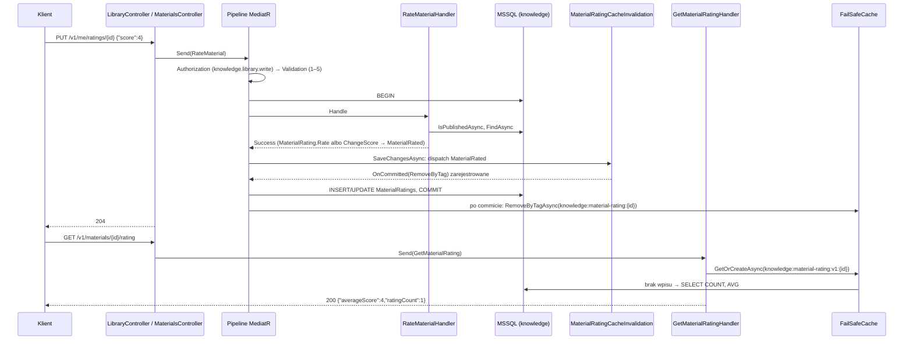

# 16. Samouczek: pełna funkcja „Ocena materiału”

**Czego się nauczysz:** jak krok po kroku dodać do serwisu Knowledge kompletną funkcję, od agregatu po wywołanie `curl`:
model domeny z value objectem, silnym ID i zdarzeniem domenowym; mapowanie EF Core z ograniczeniem `CHECK` i unikalnym
indeksem; obsługę wyścigu przez Unit of Work; migrację; read model; komendę i zapytanie z cache unieważnianym po commicie;
akcje kontrolerów z pełną dokumentacją i kontraktem OpenAPI; testy na wszystkich poziomach; weryfikację w lokalnym środowisku;
wystawienie nowych operacji modułowi przez BFF experience.

**Wymagania wstępne:** działające środowisko z [1 Start](01-start.md) i [13 Lokalne środowisko](13-lokalne-srodowisko-i-debugowanie.md).
Samouczek nie powtarza teorii; odsyła do rozdziałów [5 Model domeny](05-model-domeny.md), [6 Warstwa aplikacji](06-warstwa-aplikacji.md),
[7 Dane i EF Core](07-dane-i-ef-core.md), [8 API i kontrakty](08-api-i-kontrakty.md), [11 Cache](11-cache.md), [12 Testy](12-testy.md).

> **W skrócie**
>
> - Funkcja: czytelnik ocenia opublikowany materiał w skali 1–5 (`PUT /v1/me/ratings/{materialId}`, scope
>   `knowledge.library.write`), każdy może odczytać średnią i liczbę ocen (`GET /v1/materials/{materialId}/rating`, scope
>   `knowledge.catalog.read`).
> - Kolejność pracy: domena + testy domeny → zapis EF + migracja → odczyt → komenda + testy handlera → zapytanie + cache → API
>   → testy integracyjne → `dotnet build` / `dotnet test` → `curl` lokalnie → wystawienie w BFF experience.
> - Endpoint serwisu nie jest osiągalny dla modułu, dopóki BFF go nie wystawi: brama kieruje ruch tylko do BFF
>   (`/api/example/v{n}/**`), a BFF zna serwis przez klienta wygenerowanego z kontraktu (krok 13).
> - 23 nowe pliki, 9 zmienionych (w tym migracja, snapshot modelu i wygenerowany kontrakt OpenAPI).
> - **Kod z tego samouczka został w całości zaimplementowany w repozytorium, zbudowany (`dotnet build SuperApp.slnx`: 0 błędów,
>   0 ostrzeżeń) i przetestowany (`dotnet test --solution SuperApp.slnx`: 217 testów, wszystkie zielone), a następnie usunięty.**
>   Funkcji „Ocena materiału” nie ma w repozytorium: to ćwiczenie. Pliki pokazane poniżej są ostatecznymi wersjami, które
>   przeszły build i testy, łącznie z dokumentacją XML. Ten przebieg powstał przed BFF experience, więc obejmuje kroki 1–12 (serwis);
>   krok 13 (BFF) opisuje te same czynności co [przepisy 01 i 02](przepisy/01-endpoint-komendy.md) i nie był częścią tamtego
>   uruchomienia.

---

## 16.1 Specyfikacja funkcji

**Historia użytkownika:** jako czytelnik chcę ocenić przeczytany materiał w skali od 1 do 5 i móc zmienić ocenę; jako
czytelnik widzę średnią ocenę materiału i liczbę ocen.

| Reguła | Gdzie jest pilnowana |
|---|---|
| Ocena to liczba całkowita 1–5 | value object `RatingScore` (domena), walidator komendy (400 przed handlerem), `CHECK` w bazie |
| Ocenić można tylko opublikowany materiał | handler komendy (`IMaterialRepository.IsPublishedAsync`) |
| Jeden użytkownik ma najwyżej jedną ocenę materiału; kolejna ocena zmienia poprzednią | handler (`FindAsync` → `ChangeScore`), unikalny indeks `IX_MaterialRatings_UserId_MaterialId` |
| Ponowne wysłanie tej samej oceny niczego nie zmienia | `MaterialRating.ChangeScore` (bez zmiany czasu i bez zdarzenia) |
| Użytkownik to zawsze właściciel tokenu (`sub`), nigdy wartość z żądania | `CurrentUserExtensions.RequireUserId` |
| Podsumowanie ocen widać tylko dla opublikowanego materiału; nie zawiera danych pojedynczych użytkowników | handler zapytania |
| Nowa ocena jest widoczna w podsumowaniu od razu, mimo cache | zdarzenie `MaterialRated` → unieważnienie wpisu po commicie |

**API:**

| Operacja | Scope | Sukces | Błędy |
|---|---|---|---|
| `PUT /v1/me/ratings/{materialId}` z ciałem `{"score": 4}` | `knowledge.library.write` | `204` | `400 validation.failed`, `401`, `403 auth.missing_scope` / `auth.unauthenticated`, `404 knowledge.library.item_not_available`, `409 knowledge.library.rating_recorded_concurrently` |
| `GET /v1/materials/{materialId}/rating` | `knowledge.catalog.read` | `200 {"materialId":"...","averageScore":3.5,"ratingCount":2}` | `401`, `403 auth.missing_scope`, `404 knowledge.material.not_found` |

**Dlaczego w Knowledge i w części „biblioteka”:** ocena należy do języka katalogu materiałów i jest daną użytkownika, tak jak
ulubione (`Favorite`) i ukończone (`MaterialCompletion`); stąd przestrzeń `Knowledge.Domain.Library.Ratings`, scope
`knowledge.library.write` i trasa pod `/v1/me` (ADR-0028, [4 Wybór kontekstu](04-wybor-kontekstu.md)). Podsumowanie jest
częścią katalogu (`/v1/materials/...`, `knowledge.catalog.read`), bo czyta je każdy czytelnik.

**Dlaczego osobny agregat, a nie kolekcja ocen w `Material`:** ocen materiału może być tysiące, a każda ocena zmieniałaby
agregat `Material` (blokady, `rowversion`, konflikty z edycją redaktora). Ocena ma własną tożsamość i cykl życia, a materiał nie
potrzebuje ocen do pilnowania swoich reguł. Jedna transakcja zmienia jeden agregat: ocena zmienia tylko `MaterialRating`.

## 16.2 Plan zmian

```
src/Services/Knowledge/
  Knowledge.Domain/Library/
    Ratings/RatingScore.cs                         nowy: value object 1–5
    Ratings/MaterialRatingId.cs                    nowy: silne ID
    Ratings/MaterialRating.cs                      nowy: agregat
    Ratings/IMaterialRatingRepository.cs           nowy: port repozytorium
    Ratings/Events/MaterialRated.cs                nowy: zdarzenie domenowe
    LibraryErrors.cs                               zmiana: RatingRecordedConcurrently, InvalidRatingScore
  Knowledge.Infrastructure/
    Persistence/Write/Configurations/MaterialRatingConfiguration.cs   nowy
    Persistence/Write/Repositories/MaterialRatingRepository.cs        nowy
    Persistence/Write/KnowledgeWriteDbContext.cs                      zmiana: mapowanie indeksu na błąd
    InfrastructureServiceCollectionExtensions.cs                      zmiana: rejestracja repozytorium
    Migrations/AddMaterialRatings.cs (+ 2026..._AddMaterialRatings.Designer.cs, snapshot)   wygenerowane
    Persistence/Read/Models/MaterialRatingRow.cs                      nowy
    Persistence/Read/Configurations/MaterialRatingRowConfiguration.cs nowy
    Persistence/Read/KnowledgeReadDbContext.cs                        zmiana: MaterialRatings
    Caching/KnowledgeCache.cs                                         zmiana: klucz, tag, opcje
    Caching/MaterialRatingCacheInvalidation.cs                        nowy
    Features/Materials/GetMaterialRatingHandler.cs                    nowy
  Knowledge.Application/Features/
    Library/RateMaterial/RateMaterial.cs, RateMaterialValidator.cs, RateMaterialHandler.cs   nowe
    Materials/GetMaterialRating/GetMaterialRating.cs, MaterialRatingDto.cs                   nowe
  Knowledge.Api/
    Controllers/RateMaterialRequest.cs             nowy
    Controllers/LibraryController.cs               zmiana: akcja Rate
    Controllers/MaterialsController.cs             zmiana: akcja GetRating
    openapi/Knowledge.Api.json                     wygenerowany przy buildzie
  tests/
    Knowledge.Domain.Tests/MaterialRatingTests.cs
    Knowledge.Application.Tests/Fakes/FakeMaterialRatingRepository.cs, RateMaterialHandlerTests.cs
    Knowledge.IntegrationTests/MaterialRatingTests.cs
src/Bff/Example.Bff/                               krok 13
  Clients/Knowledge/Generated/KnowledgeApi.cs      wygenerowany przez Refitter z nowego kontraktu Knowledge
  Controllers/Knowledge/KnowledgeLibraryController.cs     zmiana: akcja Rate
  Controllers/Knowledge/KnowledgeMaterialsController.cs   zmiana: akcja GetRating
  openapi/Example.Bff_public.json                  wygenerowany przy buildzie BFF
```

Ścieżki plików w krokach 1–12 są względne wobec `src/Services/Knowledge/`.

Kontrakt `Knowledge.Contracts` się nie zmienia: ocena nie jest publikowana do innych serwisów (zdarzenie `MaterialRated` jest
wyłącznie domenowe). Gdyby inny kontekst potrzebował ocen, dodałbyś `MaterialRatedV1` i translator ([10](10-zdarzenia-i-integracja.md)).

Przepływ obu operacji w czasie działania:



---

## 16.3 Krok 1: domena

Pliki domeny powstają w `src/Services/Knowledge/Knowledge.Domain/Library/Ratings/`. Wzory: `SleepQuality` (value object 1–5
w SleepDiary), `MaterialCompletion` i `MaterialCompletionId` (najbliższy agregat w bibliotece).

### Błędy w katalogu `LibraryErrors`

Najpierw błędy, bo odwołuje się do nich value object. Do `Knowledge.Domain/Library/LibraryErrors.cs` dochodzą dwa pola (na
końcu klasy) i `using Knowledge.Domain.Library.Ratings;`; opisy w nagłówku klasy i przy `ItemNotAvailable` uzupełniasz
o oceny:

```csharp
    /// <summary>
    /// <c>knowledge.library.rating_recorded_concurrently</c> (Conflict, HTTP 409): a concurrent request of the same user rated the same
    /// material for the first time between this request's lookup and its save, so this request's insert hit the unique index on
    /// (user, material).
    /// </summary>
    /// <remarks>
    /// Only a race outcome: rating an already rated material sequentially changes the existing rating, never this error. The unit of work
    /// returns it in place of the database exception (the write context maps the index <c>IX_MaterialRatings_UserId_MaterialId</c> to it).
    /// A rating exists afterwards (with the score of the other request), so clients simply retry, which then changes the score.
    /// </remarks>
    public static readonly Error RatingRecordedConcurrently =
        Error.Conflict("knowledge.library.rating_recorded_concurrently", "Materiał został równolegle oceniony.");

    /// <summary>
    /// <c>knowledge.rating.invalid_score</c> (Validation, HTTP 400): the score is outside the range
    /// <see cref="RatingScore.Min"/>–<see cref="RatingScore.Max"/>.
    /// </summary>
    /// <remarks>
    /// Returned by <see cref="RatingScore.Create"/>. Requests through the API are normally stopped earlier by the validator of the command
    /// (<c>validation.failed</c> with the field <c>Score</c>); this error is the domain's own guarantee for every other caller.
    /// </remarks>
    public static readonly Error InvalidRatingScore =
        Error.Validation("knowledge.rating.invalid_score", $"Ocena musi mieć wartość {RatingScore.Min}–{RatingScore.Max}.");
```

Fragmenty nagłówka po zmianie:

```csharp
/// <summary>
/// Catalog of reusable errors of the user's library: favorites (<see cref="Favorite"/>), completed materials
/// (<see cref="MaterialCompletion"/>) and ratings (<see cref="MaterialRating"/>) (ADR-0015).
/// </summary>
/// <remarks>
/// Related errors created elsewhere: <c>knowledge.user.invalid_id</c> (<see cref="Knowledge.Domain.Common.UserId.Create"/>) when the
/// <c>sub</c> claim is unusable, and <c>knowledge.favorite.invalid_id</c> / <c>knowledge.completion.invalid_id</c> /
/// <c>knowledge.rating.invalid_id</c> for empty IDs.
/// </remarks>
```

Decyzje:

- Wyścig dostaje **własny** kod 409, a nie `ItemNotAvailable` czy sukces. Sekwencyjna druga ocena jest zmianą (sukces), ale gdy
  zapis już się nie udał, sukcesu nie da się „wyprodukować”; klient dostaje jasny sygnał, że wystarczy ponowić ([7.6](07-dane-i-ef-core.md)).
- Kody są kontraktem (`knowledge.{zasób}.{błąd}`), komunikaty mogą się zmieniać. Komunikaty po polsku, bo trafiają do `title`
  w `ProblemDetails`.

### `RatingScore`: value object

`Knowledge.Domain/Library/Ratings/RatingScore.cs`:

```csharp
using SuperApp.Framework.Domain.Results;
using SuperApp.Framework.Domain.ValueObjects;

namespace Knowledge.Domain.Library.Ratings;

/// <summary>
/// Value object: a user's rating of a material on a scale from <see cref="Min"/> (worst) to <see cref="Max"/> (best).
/// </summary>
/// <remarks>
/// <para>
/// A single-value object (ADR-0024): immutable, created only through <see cref="Create"/>, which guarantees the value is in range.
/// It is stored as an <see cref="int"/> column by the <c>SuperApp.Framework</c> EF convention (with a database <c>CHECK</c> constraint on the
/// same range) and exposed to clients and DTOs as a plain <see cref="int"/>.
/// </para>
/// <para>Never use <c>default(RatingScore)</c>: its value 0 is outside the scale (analyzer APP002 reports it).</para>
/// </remarks>
/// <example>
/// <code>
/// if (!RatingScore.Create(command.Score).TryGetValue(out var score, out var scoreError))
/// {
///     return scoreError; // knowledge.rating.invalid_score (400)
/// }
/// </code>
/// </example>
/// <seealso cref="MaterialRating.Score"/>
public readonly record struct RatingScore : ISingleValueObject<RatingScore, int>
{
    /// <summary>Lowest (worst) rating on the scale, inclusive.</summary>
    public const int Min = 1;

    /// <summary>Highest (best) rating on the scale, inclusive.</summary>
    public const int Max = 5;

    private RatingScore(int value) => Value = value;

    /// <summary>Gets the rating, between <see cref="Min"/> and <see cref="Max"/>.</summary>
    public int Value { get; }

    /// <summary>Creates a rating from the value given by the user.</summary>
    /// <param name="value">The rating; must be between <see cref="Min"/> and <see cref="Max"/> inclusive.</param>
    /// <returns>
    /// The rating, or <see cref="LibraryErrors.InvalidRatingScore"/> (<c>knowledge.rating.invalid_score</c>, HTTP 400) when
    /// <paramref name="value"/> is outside the range <see cref="Min"/>–<see cref="Max"/>.
    /// </returns>
    public static Result<RatingScore> Create(int value) =>
        value is < Min or > Max ? LibraryErrors.InvalidRatingScore : new RatingScore(value);

    /// <summary>Wraps a value without validation. Use only for values that are already valid, for example ones read from the database.</summary>
    /// <param name="value">A trusted rating between <see cref="Min"/> and <see cref="Max"/>.</param>
    /// <returns>The rating.</returns>
    public static RatingScore FromTrusted(int value) => new(value);

    /// <inheritdoc />
    public override string ToString() => Value.ToString(System.Globalization.CultureInfo.InvariantCulture);
}
```

- `readonly record struct` + `ISingleValueObject<RatingScore, int>`: konwencja `SuperApp.Framework` zapisze go w bazie jako `int`,
  w JSON jako liczbę, w OpenAPI jako `integer` ([5](05-model-domeny.md), ADR-0024). Nie piszesz konwerterów.
- Prywatny konstruktor: jedyna droga do wartości to `Create` (z walidacją) albo `FromTrusted` (bez walidacji, tylko w
  Infrastructure; reguła 5 testów architektury).
- `ToString` z `InvariantCulture`: wartość w logach i interpolacji nie zależy od kultury systemu.

### `MaterialRatingId`: silne ID

`Knowledge.Domain/Library/Ratings/MaterialRatingId.cs`:

```csharp
using SuperApp.Framework.Domain.Results;
using SuperApp.Framework.Domain.ValueObjects;

namespace Knowledge.Domain.Library.Ratings;

/// <summary>
/// Identifier of a rating (<see cref="MaterialRating"/>): one user's score of one material.
/// </summary>
/// <remarks>
/// <para>
/// A hand-written strongly typed identifier (ADR-0023) wrapping a <see cref="Guid"/>, so that the compiler rejects mix-ups with the other
/// Knowledge IDs, which are all <see cref="Guid"/>s underneath.
/// </para>
/// <para>
/// Generated by <see cref="MaterialRating.Rate"/>. Clients address ratings by user and material (see
/// <see cref="IMaterialRatingRepository.FindAsync"/>), so this ID is mostly a technical primary key. EF Core, JSON and OpenAPI mappings
/// come from the <c>SuperApp.Framework</c> conventions. Never create an instance with <c>default</c> or <c>new()</c> (analyzer APP002 rejects
/// it): that yields an empty GUID.
/// </para>
/// </remarks>
/// <example>
/// <code>
/// var rating = MaterialRating.Rate(userId, materialId, score, clock.UtcNow); // rating.Id is a new MaterialRatingId
/// </code>
/// </example>
public readonly record struct MaterialRatingId : IStronglyTypedId<MaterialRatingId, Guid>
{
    private MaterialRatingId(Guid value) => Value = value;

    /// <inheritdoc />
    public Guid Value { get; }

    /// <inheritdoc />
    public static MaterialRatingId New() => new(Guid.CreateVersion7());

    /// <summary>Creates the identifier from an untrusted <see cref="Guid"/> (command data, route values).</summary>
    /// <param name="value">The raw identifier; must not be <see cref="Guid.Empty"/>.</param>
    /// <returns>
    /// The identifier, or a validation error <c>knowledge.rating.invalid_id</c> when <paramref name="value"/> is <see cref="Guid.Empty"/>.
    /// The method does not check that the referenced rating exists.
    /// </returns>
    public static Result<MaterialRatingId> Create(Guid value) =>
        value == Guid.Empty ? Error.Validation("knowledge.rating.invalid_id", "Niepoprawny identyfikator.") : new MaterialRatingId(value);

    /// <inheritdoc />
    public static MaterialRatingId FromTrusted(Guid value) => new(value);

    /// <summary>Returns the GUID in its default format, so that logs and interpolated strings show the value instead of the type name.</summary>
    /// <returns>The wrapped <see cref="Guid"/> formatted with <see cref="Guid.ToString()"/>.</returns>
    public override string ToString() => Value.ToString();
}
```

`New()` używa `Guid.CreateVersion7()`, jak pozostałe identyfikatory Knowledge.

### `MaterialRated`: zdarzenie domenowe

`Knowledge.Domain/Library/Ratings/Events/MaterialRated.cs`:

```csharp
using SuperApp.Framework.Domain.Events;
using Knowledge.Domain.Materials;

namespace Knowledge.Domain.Library.Ratings.Events;

/// <summary>
/// Domain event: a user rated a material for the first time or changed their score. Raised by <see cref="MaterialRating.Rate"/> and by
/// <see cref="MaterialRating.ChangeScore"/> when the score actually changes; setting the same score again raises nothing.
/// </summary>
/// <remarks>
/// Handled in the same transaction (ADR-0027) by <c>MaterialRatingCacheInvalidation</c> in Infrastructure, which removes the cached rating
/// summary of the material after the commit. The event is internal to the Knowledge context; no integration event is published for it.
/// </remarks>
/// <param name="RatingId">Identifier of the rating.</param>
/// <param name="MaterialId">Identifier of the rated material; the summary of this material changes.</param>
/// <param name="Score">The new score.</param>
/// <param name="RatedAt">Moment of the rating, identical to <see cref="MaterialRating.RatedAt"/> of the aggregate.</param>
public sealed record MaterialRated(MaterialRatingId RatingId, MaterialId MaterialId, RatingScore Score, DateTimeOffset RatedAt) : IDomainEvent;
```

Zdarzenie jest potrzebne, bo coś na nie reaguje: unieważnienie cache podsumowania (krok 7). Zdarzenie bez odbiorcy to szum.

### `MaterialRating`: agregat

`Knowledge.Domain/Library/Ratings/MaterialRating.cs`:

```csharp
using SuperApp.Framework.Domain.Aggregates;
using Knowledge.Domain.Common;
using Knowledge.Domain.Library.Ratings.Events;
using Knowledge.Domain.Materials;

namespace Knowledge.Domain.Library.Ratings;

/// <summary>
/// Aggregate root of a rating: one user's score (1–5) of one published material (part of the user's library, ADR-0028).
/// </summary>
/// <remarks>
/// <para>
/// A user rates a material once and may change the score later; there is exactly one rating per user and material. Ratings are managed
/// with the <c>knowledge.library.write</c> scope, always for the current user (<see cref="UserId"/> from the token, never from the request).
/// </para>
/// <para><b>Rules enforced outside the aggregate</b> (it cannot see other aggregates):</para>
/// <list type="bullet">
///   <item><description>The material must exist and be published when it is rated; the handler checks it with
///   <see cref="IMaterialRepository.IsPublishedAsync"/> and returns <see cref="LibraryErrors.ItemNotAvailable"/>.</description></item>
///   <item><description>One rating per user and material: the handler looks it up with <see cref="IMaterialRatingRepository.FindAsync"/> and
///   changes the existing one; a unique index on (user, material) backs this up. When two concurrent first ratings both pass the lookup,
///   the second save hits the index and fails with <see cref="LibraryErrors.RatingRecordedConcurrently"/>.</description></item>
/// </list>
/// <para>
/// Both <see cref="Rate"/> and a real change in <see cref="ChangeScore"/> raise <see cref="MaterialRated"/>, which invalidates the cached
/// rating summary of the material.
/// </para>
/// </remarks>
/// <example>
/// <code>
/// // RateMaterialHandler, after the availability check
/// var rating = await ratings.FindAsync(userId, materialId, cancellationToken);
/// if (rating is null)
/// {
///     ratings.Add(MaterialRating.Rate(userId, materialId, score, clock.UtcNow));
/// }
/// else
/// {
///     rating.ChangeScore(score, clock.UtcNow);
/// }
/// </code>
/// </example>
/// <seealso cref="IMaterialRatingRepository"/>
public sealed class MaterialRating : AggregateRoot<MaterialRatingId>
{
    private MaterialRating(MaterialRatingId id)
        : base(id)
    {
    }

    /// <summary>Gets the user who rated the material (the <c>sub</c> claim).</summary>
    public UserId UserId { get; private set; }

    /// <summary>Gets the rated material.</summary>
    public MaterialId MaterialId { get; private set; }

    /// <summary>Gets the current score.</summary>
    public RatingScore Score { get; private set; }

    /// <summary>Gets the moment of the first rating or of the last change of the score.</summary>
    public DateTimeOffset RatedAt { get; private set; }

    /// <summary>
    /// Creates the first rating of a material by a user and raises <see cref="MaterialRated"/>. Cannot fail: the score is already valid
    /// (<see cref="RatingScore"/>), and the handler must first check that the material is published and that the user has not rated it yet.
    /// </summary>
    /// <remarks>The caller registers the result with <see cref="IMaterialRatingRepository.Add"/>.</remarks>
    /// <param name="userId">The user rating the material (the current user).</param>
    /// <param name="materialId">The rated material.</param>
    /// <param name="score">The score.</param>
    /// <param name="now">Current time, stored as <see cref="RatedAt"/>.</param>
    /// <returns>The new rating.</returns>
    public static MaterialRating Rate(UserId userId, MaterialId materialId, RatingScore score, DateTimeOffset now)
    {
        var rating = new MaterialRating(MaterialRatingId.New()) { UserId = userId, MaterialId = materialId, Score = score, RatedAt = now };
        rating.Raise(new MaterialRated(rating.Id, materialId, score, now));
        return rating;
    }

    /// <summary>
    /// Changes the score. Setting the score the rating already has changes nothing (neither <see cref="RatedAt"/> nor events), so repeating
    /// the same request is idempotent; a different score updates <see cref="RatedAt"/> and raises <see cref="MaterialRated"/>.
    /// </summary>
    /// <param name="score">The new score.</param>
    /// <param name="now">Current time, stored as <see cref="RatedAt"/> when the score changes.</param>
    public void ChangeScore(RatingScore score, DateTimeOffset now)
    {
        if (Score == score)
        {
            return;
        }

        Score = score;
        RatedAt = now;
        Raise(new MaterialRated(Id, MaterialId, score, now));
    }
}
```

Decyzje projektowe:

- **Fabryka `Rate` i metoda `ChangeScore` nie zwracają `Result`**, bo nie mogą się nie udać: zakres oceny gwarantuje typ
  `RatingScore`, a reguły wymagające innych agregatów (materiał opublikowany, jedna ocena na użytkownika) sprawdza handler.
  Ten sam wzorzec mają `MaterialCompletion.Complete` i `Favorite.Add`. Gdyby agregat miał regułę, która może zostać złamana
  (np. „oceny nie można zmienić po 30 dniach”), metoda zwracałaby `Result` z błędem z `LibraryErrors`.
- **Idempotencja w agregacie:** ta sama ocena nie zmienia `RatedAt` i nie zgłasza zdarzenia, więc powtórzone żądanie (retry
  klienta) nie unieważnia cache i nie generuje zapisu.
- **Konstruktor prywatny z samym `id`**: EF Core materializuje agregat przez ten konstruktor i ustawia właściwości przez
  prywatne settery; inicjalizator obiektu w `Rate` działa, bo jest wewnątrz klasy.
- **Bez klucza obcego do `Materials`**: agregaty odwołują się do siebie tylko przez ID ([7.1](07-dane-i-ef-core.md)).

### `IMaterialRatingRepository`: port

`Knowledge.Domain/Library/Ratings/IMaterialRatingRepository.cs`:

```csharp
using Knowledge.Domain.Common;
using Knowledge.Domain.Materials;

namespace Knowledge.Domain.Library.Ratings;

/// <summary>
/// Write-side repository of the <see cref="MaterialRating"/> aggregate: finds a user's rating of a material and adds new ratings.
/// </summary>
/// <remarks>
/// Implemented in <c>Knowledge.Infrastructure</c>. Loaded ratings are tracked, so a changed score is saved by the unit of work at the end of
/// the command; there is no <c>Update</c> and no save method. Reading the rating summary of a material goes through the read side.
/// </remarks>
public interface IMaterialRatingRepository
{
    /// <summary>Finds the rating of a material by a given user.</summary>
    /// <param name="userId">The user (the current user).</param>
    /// <param name="materialId">The material.</param>
    /// <param name="cancellationToken">Token to cancel the database call.</param>
    /// <returns>The tracked rating, or <see langword="null"/> if the user has not rated the material yet.</returns>
    Task<MaterialRating?> FindAsync(UserId userId, MaterialId materialId, CancellationToken cancellationToken);

    /// <summary>Registers a new rating; it is inserted when the unit of work commits.</summary>
    /// <param name="rating">The new rating, as returned by <see cref="MaterialRating.Rate"/>.</param>
    void Add(MaterialRating rating);
}
```

Jeden interfejs na agregat, tylko operacje potrzebne komendom: brak `Update` (śledzony agregat zapisze Unit of Work), brak
`Remove` (funkcja nie przewiduje usuwania oceny; dodasz je razem z przypadkiem użycia), brak `IQueryable`.

Punkt kontrolny:

```bash
dotnet build src/Services/Knowledge/Knowledge.Domain
```

Oczekiwane: `Ostrzeżenia: 0`, `Liczba błędów: 0` (na angielskim systemie: `0 Warning(s)`, `0 Error(s)`). Brak dokumentacji XML
przy publicznym typie da tu `CS1591`, niekompletne `<param>` lub `<returns>` dadzą `APP006`.

---

## 16.4 Krok 2: testy domeny

`src/Services/Knowledge/tests/Knowledge.Domain.Tests/MaterialRatingTests.cs`:

```csharp
using Knowledge.Domain.Common;
using Knowledge.Domain.Library;
using Knowledge.Domain.Library.Ratings;
using Knowledge.Domain.Library.Ratings.Events;
using Knowledge.Domain.Materials;

namespace Knowledge.Domain.Tests;

public sealed class MaterialRatingTests
{
    private static readonly DateTimeOffset Now = new(2026, 9, 30, 12, 0, 0, TimeSpan.Zero);
    private static readonly DateTimeOffset Later = Now.AddHours(1);

    private static readonly UserId User = ResultAssert.Success(UserId.Create("user-1"));
    private static readonly MaterialId Material = MaterialId.New();

    [Theory]
    [InlineData(RatingScore.Min)]
    [InlineData(3)]
    [InlineData(RatingScore.Max)]
    public void Score_within_the_scale_is_accepted(int value) =>
        Assert.Equal(value, ResultAssert.Success(RatingScore.Create(value)).Value);

    [Theory]
    [InlineData(RatingScore.Min - 1)]
    [InlineData(RatingScore.Max + 1)]
    [InlineData(-3)]
    public void Score_outside_the_scale_is_rejected(int value) =>
        Assert.Equal(LibraryErrors.InvalidRatingScore, RatingScore.Create(value).Error);

    [Fact]
    public void Rating_raises_event_with_the_score_and_time()
    {
        var rating = MaterialRating.Rate(User, Material, Score(4), Now);

        var rated = Assert.IsType<MaterialRated>(Assert.Single(rating.DomainEvents));
        Assert.Equal(new MaterialRated(rating.Id, Material, Score(4), Now), rated);
        Assert.Equal(Now, rating.RatedAt);
    }

    [Fact]
    public void Changing_to_the_same_score_changes_nothing_and_raises_no_event()
    {
        var rating = MaterialRating.Rate(User, Material, Score(4), Now);
        rating.ClearDomainEvents();

        rating.ChangeScore(Score(4), Later);

        Assert.Equal(Now, rating.RatedAt);
        Assert.Empty(rating.DomainEvents);
    }

    [Fact]
    public void Changing_to_a_different_score_updates_time_and_raises_event()
    {
        var rating = MaterialRating.Rate(User, Material, Score(4), Now);
        rating.ClearDomainEvents();

        rating.ChangeScore(Score(2), Later);

        Assert.Equal(Score(2), rating.Score);
        Assert.Equal(Later, rating.RatedAt);
        Assert.Equal(Score(2), Assert.IsType<MaterialRated>(Assert.Single(rating.DomainEvents)).Score);
    }

    private static RatingScore Score(int value) => ResultAssert.Success(RatingScore.Create(value));
}
```

Granice skali (0, 1, 5, 6) pochodzą ze stałych `RatingScore.Min`/`Max`; porównanie całego rekordu zdarzenia sprawdza wszystkie
jego pola naraz. Uruchomienie (9 przypadków: dwie teorie po 3 + 3 fakty):

```bash
dotnet test --project src/Services/Knowledge/tests/Knowledge.Domain.Tests --filter-class "*MaterialRatingTests"
```

---

## 16.5 Krok 3: zapis w EF Core

### Konfiguracja

`Knowledge.Infrastructure/Persistence/Write/Configurations/MaterialRatingConfiguration.cs`:

```csharp
using Knowledge.Domain.Common;
using Knowledge.Domain.Library.Ratings;
using Microsoft.EntityFrameworkCore;
using Microsoft.EntityFrameworkCore.Metadata.Builders;

namespace Knowledge.Infrastructure.Persistence.Write.Configurations;

/// <summary>Maps the <see cref="MaterialRating"/> aggregate onto the table <c>knowledge.MaterialRatings</c>.</summary>
/// <remarks>
/// <para>
/// <see cref="MaterialRatingId"/>, <see cref="UserId"/>, <c>MaterialId</c> and <see cref="RatingScore"/> are converted to primitive columns
/// by the <c>SuperApp.Framework</c> conventions, so they need no converters here. <c>MaterialId</c> has no foreign key (another aggregate).
/// </para>
/// <para>The database backs up the rules of the aggregate as a last line of defense:</para>
/// <list type="bullet">
///   <item><description>unique index <see cref="UserMaterialIndexName"/> on (<c>UserId</c>, <c>MaterialId</c>): one rating per user and
///   material, also under concurrent first ratings; a violation is returned by the unit of work as
///   <see cref="Knowledge.Domain.Library.LibraryErrors.RatingRecordedConcurrently"/> (mapped in <see cref="KnowledgeWriteDbContext"/>);</description></item>
///   <item><description><c>CHECK</c> constraint <c>CK_MaterialRatings_Score</c>: the score is within
///   <see cref="RatingScore.Min"/>–<see cref="RatingScore.Max"/>, even for data written past the domain.</description></item>
/// </list>
/// <para>
/// There is deliberately no row version: a rating belongs to one user, and when the same user changes the score in two requests at the same
/// time, the last write wins, which is the expected outcome. Any change here requires a new migration of <see cref="KnowledgeWriteDbContext"/>.
/// </para>
/// </remarks>
internal sealed class MaterialRatingConfiguration : IEntityTypeConfiguration<MaterialRating>
{
    /// <summary>
    /// Database name of the unique index on (<c>UserId</c>, <c>MaterialId</c>). Set explicitly so that the name mapped to
    /// <see cref="Knowledge.Domain.Library.LibraryErrors.RatingRecordedConcurrently"/> cannot drift silently; changing it requires a
    /// migration that renames the index.
    /// </summary>
    internal const string UserMaterialIndexName = "IX_MaterialRatings_UserId_MaterialId";

    /// <inheritdoc />
    public void Configure(EntityTypeBuilder<MaterialRating> builder)
    {
        builder.ToTable("MaterialRatings", table =>
            table.HasCheckConstraint("CK_MaterialRatings_Score", $"[Score] BETWEEN {RatingScore.Min} AND {RatingScore.Max}"));
        builder.HasKey(rating => rating.Id);
        builder.Property(rating => rating.Id).ValueGeneratedNever();
        builder.Property(rating => rating.UserId).HasMaxLength(UserId.MaxLength);
        builder.HasIndex(rating => new { rating.UserId, rating.MaterialId }).IsUnique().HasDatabaseName(UserMaterialIndexName);
        builder.Ignore(rating => rating.DomainEvents);
    }
}
```

- Klasa w przestrzeni `Knowledge.Infrastructure.Persistence.Write.Configurations` jest stosowana automatycznie przez
  `WriteDbContextBase.OnModelCreating` (konfiguracje z przestrzeni kontekstu zapisu i podrzędnych). Nic nie rejestrujesz.
- `UserId`, `MaterialId`, `RatingScore`, `MaterialRatingId` mapuje konwencja frameworka; `HasMaxLength(UserId.MaxLength)` bierze
  limit ze stałej domeny.
- Nazwa indeksu jest **jawna** i trzymana w stałej: ta sama stała jest kluczem w mapie błędów kontekstu, więc nazwa w bazie
  i w mapie nie mogą się rozjechać (wzór: `SleepEntryConfiguration.UserDateIndexName`).
- **Bez `rowversion`**, inaczej niż `Category`, `Material`, `Collection` i `SleepEntry`. Konflikt współbieżności przy
  `rowversion` kończy się w API błędem 409 `persistence.concurrency_conflict`, po którym klient musi odświeżyć dane i ponowić
  ([7.7](07-dane-i-ef-core.md#77-współbieżność-optymistyczna-rowversion)). Ocenę zmienia tylko jej właściciel, więc „wygrywa
  ostatni zapis” jest poprawnym zachowaniem i nie ma czego chronić.

### Repozytorium

`Knowledge.Infrastructure/Persistence/Write/Repositories/MaterialRatingRepository.cs`:

```csharp
using Knowledge.Domain.Common;
using Knowledge.Domain.Library.Ratings;
using Knowledge.Domain.Materials;
using Microsoft.EntityFrameworkCore;

namespace Knowledge.Infrastructure.Persistence.Write.Repositories;

/// <summary>EF Core implementation of <see cref="IMaterialRatingRepository"/> over <see cref="KnowledgeWriteDbContext"/>.</summary>
/// <remarks>The repository never saves; the transaction pipeline behavior does.</remarks>
/// <param name="context">Write context of the service (scoped, shared with the unit of work).</param>
internal sealed class MaterialRatingRepository(KnowledgeWriteDbContext context) : IMaterialRatingRepository
{
    /// <inheritdoc />
    public Task<MaterialRating?> FindAsync(UserId userId, MaterialId materialId, CancellationToken cancellationToken) =>
        context.Set<MaterialRating>().FirstOrDefaultAsync(
            rating => rating.UserId == userId && rating.MaterialId == materialId,
            cancellationToken);

    /// <inheritdoc />
    public void Add(MaterialRating rating) => context.Add(rating);
}
```

`FindAsync` zwraca **śledzony** agregat: `rating.ChangeScore(...)` w handlerze wystarczy, żeby `SaveChangesAsync` wykonał
`UPDATE`. `Add` jest synchroniczne (nie ma I/O); `INSERT` wykona Unit of Work.

Rejestracja w `Knowledge.Infrastructure/InfrastructureServiceCollectionExtensions.cs` (`AddKnowledgeCore`), plus
`using Knowledge.Domain.Library.Ratings;`:

```csharp
        services.AddScoped<IMaterialCompletionRepository, MaterialCompletionRepository>();
        services.AddScoped<IMaterialRatingRepository, MaterialRatingRepository>();
```

### Mapowanie wyścigu na błąd kontekstu

`Knowledge.Infrastructure/Persistence/Write/KnowledgeWriteDbContext.cs`, właściwość `UniqueConstraintErrors` (i
`using Knowledge.Infrastructure.Persistence.Write.Configurations;`):

```csharp
    protected override IReadOnlyDictionary<string, Error> UniqueConstraintErrors { get; } = new Dictionary<string, Error>
    {
        ["IX_Categories_Slug"] = CategoryErrors.SlugTaken,
        ["IX_Favorites_UserId_ItemType_ItemId"] = LibraryErrors.FavoriteAddedConcurrently,
        ["IX_MaterialCompletions_UserId_MaterialId"] = LibraryErrors.CompletionRecordedConcurrently,
        [MaterialRatingConfiguration.UserMaterialIndexName] = LibraryErrors.RatingRecordedConcurrently,
    };
```

W dokumentacji tej właściwości (lista `<list type="table">`) dopisujesz wiersz:

```csharp
    ///   <item><term><c>IX_MaterialRatings_UserId_MaterialId</c></term><description><see cref="LibraryErrors.RatingRecordedConcurrently"/>
    ///   (<c>knowledge.library.rating_recorded_concurrently</c>, 409): two concurrent first ratings of the same material by the same user;
    ///   a sequential second rating changes the existing one instead.</description></item>
```

Bez wpisu dwa równoległe pierwsze `PUT` tego samego użytkownika dałyby drugiemu ogólny `persistence.duplicate` (409), a gdyby
`WriteDbContextBase` w ogóle nie łapał naruszeń unikalności, wyjątek i 500.

---

## 16.6 Krok 4: migracja

```bash
dotnet build SuperApp.slnx
dotnet ef migrations add AddMaterialRatings \
  -p src/Services/Knowledge/Knowledge.Infrastructure -s src/Services/Knowledge/Knowledge.Infrastructure \
  --context KnowledgeWriteDbContext -o Migrations
```

```
Build started...
Build succeeded.
Done. To undo this action, use 'ef migrations remove'
```

Powstają trzy zmiany w `Knowledge.Infrastructure/Migrations/`: `{znacznik czasu}_AddMaterialRatings.cs`,
`{znacznik czasu}_AddMaterialRatings.Designer.cs` i zmieniony `KnowledgeWriteDbContextModelSnapshot.cs`. Dalej:

1. Zmień nazwę `{znacznik czasu}_AddMaterialRatings.cs` na `AddMaterialRatings.cs` (APP005: nazwa pliku = nazwa typu). Plik
   `.Designer.cs` zostaje z datą: to kod generowany, analizator go pomija.
2. Zastąp `/// <inheritdoc />` nad klasą migracji opisem: co zmienia i która to faza expand/contract.
3. Przeczytaj `Up` i `Down`.

Ostateczny `Knowledge.Infrastructure/Migrations/AddMaterialRatings.cs`:

```csharp
using System;
using Microsoft.EntityFrameworkCore.Migrations;

#nullable disable

namespace Knowledge.Infrastructure.Migrations
{
    /// <summary>
    /// Expand step: creates the table <c>knowledge.MaterialRatings</c> for the <c>MaterialRating</c> aggregate (a user's 1–5 score of a
    /// material) with the check constraint <c>CK_MaterialRatings_Score</c> and the unique index <c>IX_MaterialRatings_UserId_MaterialId</c>.
    /// </summary>
    /// <remarks>
    /// A new table only: the previous version of the application ignores it, so the migration is safe before a rolling update and needs no
    /// contract step. <c>Down</c> drops the table together with all ratings.
    /// </remarks>
    public partial class AddMaterialRatings : Migration
    {
        /// <inheritdoc />
        protected override void Up(MigrationBuilder migrationBuilder)
        {
            migrationBuilder.CreateTable(
                name: "MaterialRatings",
                schema: "knowledge",
                columns: table => new
                {
                    Id = table.Column<Guid>(type: "uniqueidentifier", nullable: false),
                    UserId = table.Column<string>(type: "nvarchar(200)", maxLength: 200, nullable: false),
                    MaterialId = table.Column<Guid>(type: "uniqueidentifier", nullable: false),
                    Score = table.Column<int>(type: "int", nullable: false),
                    RatedAt = table.Column<DateTimeOffset>(type: "datetimeoffset", nullable: false)
                },
                constraints: table =>
                {
                    table.PrimaryKey("PK_MaterialRatings", x => x.Id);
                    table.CheckConstraint("CK_MaterialRatings_Score", "[Score] BETWEEN 1 AND 5");
                });

            migrationBuilder.CreateIndex(
                name: "IX_MaterialRatings_UserId_MaterialId",
                schema: "knowledge",
                table: "MaterialRatings",
                columns: new[] { "UserId", "MaterialId" },
                unique: true);
        }

        /// <inheritdoc />
        protected override void Down(MigrationBuilder migrationBuilder)
        {
            migrationBuilder.DropTable(
                name: "MaterialRatings",
                schema: "knowledge");
        }
    }
}
```

Przegląd:

| Pytanie | Odpowiedź dla tej migracji |
|---|---|
| Czy coś jest usuwane lub zmieniane w istniejących tabelach? | nie, tylko `CreateTable` i `CreateIndex` |
| Czy stara wersja aplikacji działa na nowym schemacie? | tak, nie zna tabeli `MaterialRatings` |
| Czy `CHECK` i indeks mają oczekiwane nazwy? | `CK_MaterialRatings_Score`, `IX_MaterialRatings_UserId_MaterialId` (ta sama nazwa co w mapie błędów) |
| Czy typy kolumn są właściwe? | `UserId nvarchar(200)` (z `UserId.MaxLength`), `Score int`, `RatedAt datetimeoffset` |

W snapshot modelu dochodzi encja (fragment `KnowledgeWriteDbContextModelSnapshot.cs`):

```csharp
            modelBuilder.Entity("Knowledge.Domain.Library.Ratings.MaterialRating", b =>
                {
                    b.Property<Guid>("Id")
                        .HasColumnType("uniqueidentifier");

                    b.Property<Guid>("MaterialId")
                        .HasColumnType("uniqueidentifier");

                    b.Property<DateTimeOffset>("RatedAt")
                        .HasColumnType("datetimeoffset");

                    b.Property<int>("Score")
                        .HasColumnType("int");

                    b.Property<string>("UserId")
                        .IsRequired()
                        .HasMaxLength(200)
                        .HasColumnType("nvarchar(200)");

                    b.HasKey("Id");

                    b.HasIndex("UserId", "MaterialId")
                        .IsUnique()
                        .HasDatabaseName("IX_MaterialRatings_UserId_MaterialId");

                    b.ToTable("MaterialRatings", "knowledge", t =>
                        {
                            t.HasCheckConstraint("CK_MaterialRatings_Score", "[Score] BETWEEN 1 AND 5");
                        });
                });
```

Sprawdzenie, że model i migracje są zgodne:

```bash
dotnet ef migrations has-pending-model-changes \
  -p src/Services/Knowledge/Knowledge.Infrastructure -s src/Services/Knowledge/Knowledge.Infrastructure \
  --context KnowledgeWriteDbContext
```

```
No changes have been made to the model since the last migration.
```

Zastosowanie lokalnie: `dotnet run --project src/Migrator/SuperApp.Migrator --launch-profile local` (tryb hybrydowy) albo
`docker compose -f deploy/local/docker-compose.yml --profile app up -d --build migrator knowledge-api knowledge-worker`
([13](13-lokalne-srodowisko-i-debugowanie.md)). Login serwisu `knowledge_app` ma uprawnienia na cały schemat `knowledge`
(`GRANT ... ON SCHEMA` w `deploy/sql/01-bootstrap.sql`), więc nowa tabela nie wymaga zmian w skryptach uprawnień.
Na produkcji migrację uruchamia DBA ze skryptu idempotentnego (ADR-0004).

---

## 16.7 Krok 5: read model

`Knowledge.Infrastructure/Persistence/Read/Models/MaterialRatingRow.cs`:

```csharp
namespace Knowledge.Infrastructure.Persistence.Read.Models;

/// <summary>Read model of one row of <c>knowledge.MaterialRatings</c>: one user's score of one material.</summary>
internal sealed class MaterialRatingRow
{
    /// <summary>Identifier of the rating (primary key).</summary>
    public Guid Id { get; init; }

    /// <summary>Subject (<c>sub</c> claim) of the user who rated the material.</summary>
    public string UserId { get; init; } = string.Empty;

    /// <summary>Identifier of the rated material; no foreign key to <c>Materials</c>.</summary>
    public Guid MaterialId { get; init; }

    /// <summary>The score, between 1 and 5 (guarded by the check constraint <c>CK_MaterialRatings_Score</c>).</summary>
    public int Score { get; init; }

    /// <summary>Moment of the first rating or of the last change of the score.</summary>
    public DateTimeOffset RatedAt { get; init; }
}
```

`Knowledge.Infrastructure/Persistence/Read/Configurations/MaterialRatingRowConfiguration.cs`:

```csharp
using Knowledge.Infrastructure.Persistence.Read.Models;
using Microsoft.EntityFrameworkCore;
using Microsoft.EntityFrameworkCore.Metadata.Builders;

namespace Knowledge.Infrastructure.Persistence.Read.Configurations;

/// <summary>
/// Maps <see cref="MaterialRatingRow"/> onto the existing table <c>knowledge.MaterialRatings</c> for reading; the key is <c>Id</c>.
/// </summary>
/// <remarks>
/// Read configurations only describe the table and key so that EF Core can query it; they never create schema, because the read context
/// has no migrations. The table itself (columns, constraints, indexes) is defined by the write-side configuration.
/// </remarks>
internal sealed class MaterialRatingRowConfiguration : IEntityTypeConfiguration<MaterialRatingRow>
{
    /// <inheritdoc />
    public void Configure(EntityTypeBuilder<MaterialRatingRow> builder) => builder.ToTable("MaterialRatings").HasKey(row => row.Id);
}
```

`Knowledge.Infrastructure/Persistence/Read/KnowledgeReadDbContext.cs`, nowa właściwość po `MaterialCompletions`:

```csharp
    /// <summary>Ratings of all users; aggregate them per material, never expose single ratings of other users.</summary>
    internal IQueryable<MaterialRatingRow> MaterialRatings => Set<MaterialRatingRow>();
```

Read model to płaska klasa z prymitywami (`int Score`, `string UserId`), nie encja domenowa: zapytania omijają domenę (ADR-0003,
ADR-0026). Kontekst odczytu nie ma migracji, więc konfiguracja opisuje tylko tabelę i klucz.

---

## 16.8 Krok 6: komenda `RateMaterial`

Pliki w `Knowledge.Application/Features/Library/RateMaterial/`.

`RateMaterial.cs`:

```csharp
using SuperApp.Framework.Application.Messaging;
using SuperApp.Framework.Application.Security;

namespace Knowledge.Application.Features.Library.RateMaterial;

/// <summary>
/// Rates a published material on a scale from 1 to 5 on behalf of the calling user, or changes the user's existing score.
/// Requires scope <see cref="KnowledgeScopes.LibraryWrite"/>.
/// </summary>
/// <remarks>
/// <para>Input rules (<c>RateMaterialValidator</c>): <see cref="MaterialId"/> not empty, <see cref="Score"/> between 1 and 5.</para>
/// <para>
/// The handler takes the user from the token (<c>sub</c>), checks that the material is published and either adds a <c>MaterialRating</c>
/// or changes the score of the existing one. The operation is idempotent: sending the same score again succeeds without changes.
/// </para>
/// <para>Result: success without a value. Possible errors:</para>
/// <list type="bullet">
///   <item><description><c>auth.unauthenticated</c> (403): no authenticated user or no <c>sub</c> claim; <c>auth.missing_scope</c> (403).</description></item>
///   <item><description><c>validation.failed</c> (400): empty identifier or a score outside 1–5.</description></item>
///   <item><description><c>knowledge.user.invalid_id</c> (400): the <c>sub</c> claim is longer than
///   <see cref="Knowledge.Domain.Common.UserId.MaxLength"/> characters.</description></item>
///   <item><description><see cref="Knowledge.Domain.Library.LibraryErrors.ItemNotAvailable"/> (<c>knowledge.library.item_not_available</c>, 404):
///   the material does not exist or is not published.</description></item>
///   <item><description><see cref="Knowledge.Domain.Library.LibraryErrors.RatingRecordedConcurrently"/>
///   (<c>knowledge.library.rating_recorded_concurrently</c>, 409): only as the outcome of a race, when a concurrent request of the same
///   user rated the same material for the first time at the same moment. A retry changes the score.</description></item>
/// </list>
/// </remarks>
/// <param name="MaterialId">Identifier of the material; must not be <see cref="Guid.Empty"/>.</param>
/// <param name="Score">The score, from 1 (worst) to 5 (best).</param>
[RequiresScope(KnowledgeScopes.LibraryWrite)]
public sealed record RateMaterial(Guid MaterialId, int Score) : ICommand;
```

`RateMaterialValidator.cs`:

```csharp
using FluentValidation;
using Knowledge.Domain.Library.Ratings;

namespace Knowledge.Application.Features.Library.RateMaterial;

/// <summary>Input rules of <see cref="RateMaterial"/>: a non-empty material identifier and a score within the rating scale.</summary>
/// <remarks>
/// Runs in the validation behavior before the handler; failures become <c>validation.failed</c> (400) with the invalid fields listed. The
/// range comes from <see cref="RatingScore.Min"/> and <see cref="RatingScore.Max"/>, so the validator accepts exactly what the domain accepts.
/// </remarks>
internal sealed class RateMaterialValidator : AbstractValidator<RateMaterial>
{
    /// <summary>Defines the rules.</summary>
    public RateMaterialValidator()
    {
        RuleFor(command => command.MaterialId).NotEmpty();
        RuleFor(command => command.Score).InclusiveBetween(RatingScore.Min, RatingScore.Max);
    }
}
```

`RateMaterialHandler.cs`:

```csharp
using SuperApp.Framework.Application.Messaging;
using SuperApp.Framework.Application.Security;
using SuperApp.Framework.Application.Time;
using SuperApp.Framework.Domain.Results;
using Knowledge.Domain.Library;
using Knowledge.Domain.Library.Ratings;
using Knowledge.Domain.Materials;

namespace Knowledge.Application.Features.Library.RateMaterial;

/// <summary>
/// Handles <see cref="RateMaterial"/>: resolves the calling user, checks that the material is published and records a new
/// <see cref="MaterialRating"/> or changes the score of the user's existing one.
/// </summary>
/// <remarks>
/// Only the publication status of the material is read; the material aggregate is not loaded and not changed (one command changes one
/// aggregate). Uniqueness per user and material is checked here and enforced by a unique index; when two concurrent first ratings both pass
/// the lookup, the second save hits the index and the unit of work returns <see cref="LibraryErrors.RatingRecordedConcurrently"/> (409).
/// </remarks>
internal sealed class RateMaterialHandler(
    IMaterialRatingRepository ratings,
    IMaterialRepository materials,
    ICurrentUser currentUser,
    IClock clock) : ICommandHandler<RateMaterial>
{
    /// <inheritdoc />
    public async Task<Result> Handle(RateMaterial command, CancellationToken cancellationToken)
    {
        if (!currentUser.RequireUserId().TryGetValue(out var userId, out var userError))
        {
            return userError;
        }

        if (!RatingScore.Create(command.Score).TryGetValue(out var score, out var scoreError))
        {
            return scoreError;
        }

        if (!MaterialId.Create(command.MaterialId).TryGetValue(out var materialId, out _)
            || !await materials.IsPublishedAsync(materialId, cancellationToken))
        {
            return LibraryErrors.ItemNotAvailable;
        }

        var rating = await ratings.FindAsync(userId, materialId, cancellationToken);
        if (rating is null)
        {
            ratings.Add(MaterialRating.Rate(userId, materialId, score, clock.UtcNow));
        }
        else
        {
            rating.ChangeScore(score, clock.UtcNow);
        }

        return Result.Success();
    }
}
```

Kolejność sprawdzeń w handlerze jest celowa:

1. **Użytkownik** pierwszy: bez `sub` nie ma sensu pytać bazy (403 `auth.unauthenticated`).
2. **Ocena** (`RatingScore.Create`) przed odczytem z bazy: tani test bez I/O. Przez API niepoprawną ocenę zatrzyma wcześniej
   walidator (400 `validation.failed`), ale handler nie zakłada, że walidator istnieje (np. konsument z Workera mógłby wysłać tę
   samą komendę).
3. **Materiał** (`MaterialId.Create` + `IsPublishedAsync`): pusty GUID, brak materiału i szkic dają ten sam błąd 404, żeby
   czytelnik nie mógł odkryć istnienia szkiców.
4. `FindAsync` → `Add(MaterialRating.Rate(...))` albo `rating.ChangeScore(...)`. Handler kończy się `Result.Success()`;
   **nie zapisuje**: zapis, dispatch `MaterialRated` i commit robi `TransactionBehavior` ([6](06-warstwa-aplikacji.md)).

Komenda nie wymaga rejestracji: handler i walidator są wykrywane w `KnowledgeApplication.Assembly` przez `AddAppApplication`.

Źle (logika w handlerze zamiast w agregacie i zapis w handlerze):

```csharp
if (rating.Score != score)
{
    rating.Score = score;                      // nie skompiluje się: prywatny setter
    await unitOfWork.SaveChangesAsync(token);  // podwójny zapis; zapis należy do TransactionBehavior
}
```

Dobrze: `rating.ChangeScore(score, clock.UtcNow);` i nic więcej.

---

## 16.9 Krok 7: testy handlera

Fake repozytorium, `src/Services/Knowledge/tests/Knowledge.Application.Tests/Fakes/FakeMaterialRatingRepository.cs`:

```csharp
using Knowledge.Domain.Common;
using Knowledge.Domain.Library.Ratings;
using Knowledge.Domain.Materials;

namespace Knowledge.Application.Tests.Fakes;

internal sealed class FakeMaterialRatingRepository : IMaterialRatingRepository
{
    public List<MaterialRating> Items { get; } = [];

    public Task<MaterialRating?> FindAsync(UserId userId, MaterialId materialId, CancellationToken cancellationToken) =>
        Task.FromResult(Items.FirstOrDefault(rating => rating.UserId == userId && rating.MaterialId == materialId));

    public void Add(MaterialRating rating) => Items.Add(rating);
}
```

`src/Services/Knowledge/tests/Knowledge.Application.Tests/RateMaterialHandlerTests.cs`:

```csharp
using SuperApp.Framework.Domain.Results;
using Knowledge.Application.Features.Library.RateMaterial;
using Knowledge.Application.Tests.Fakes;
using Knowledge.Domain.Library;
using Knowledge.Domain.Library.Ratings;
using Knowledge.Domain.Materials;
using Knowledge.Domain.Materials.Content;

namespace Knowledge.Application.Tests;

public sealed class RateMaterialHandlerTests
{
    private readonly FakeClock _clock = new();
    private readonly FakeMaterialRepository _materials = new();
    private readonly FakeMaterialRatingRepository _ratings = new();

    [Fact]
    public async Task Rating_unpublished_material_is_rejected()
    {
        var draft = ResultAssert.Success(Material.Create(MaterialType.Article, "Szkic", null, null, null, _clock.UtcNow));
        _materials.Add(draft);

        var result = await Handler("user-1").Handle(new RateMaterial(draft.Id.Value, 4), TestContext.Current.CancellationToken);

        Assert.Equal(LibraryErrors.ItemNotAvailable, result.Error);
        Assert.Empty(_ratings.Items);
    }

    [Fact]
    public async Task Second_rating_of_the_same_user_changes_the_score()
    {
        var material = PublishedMaterial();

        Assert.True((await Handler("user-1").Handle(new RateMaterial(material.Id.Value, 4), TestContext.Current.CancellationToken)).IsSuccess);
        Assert.True((await Handler("user-1").Handle(new RateMaterial(material.Id.Value, 2), TestContext.Current.CancellationToken)).IsSuccess);

        var rating = Assert.Single(_ratings.Items);
        Assert.Equal(2, rating.Score.Value);
    }

    [Fact]
    public async Task Different_users_have_separate_ratings()
    {
        var material = PublishedMaterial();

        Assert.True((await Handler("user-1").Handle(new RateMaterial(material.Id.Value, 4), TestContext.Current.CancellationToken)).IsSuccess);
        Assert.True((await Handler("user-2").Handle(new RateMaterial(material.Id.Value, 5), TestContext.Current.CancellationToken)).IsSuccess);

        Assert.Equal(2, _ratings.Items.Count);
    }

    [Fact]
    public async Task Score_outside_the_scale_is_rejected_by_the_domain_even_without_the_validator()
    {
        var material = PublishedMaterial();

        var result = await Handler("user-1").Handle(new RateMaterial(material.Id.Value, 6), TestContext.Current.CancellationToken);

        Assert.Equal(LibraryErrors.InvalidRatingScore, result.Error);
        Assert.Empty(_ratings.Items);
    }

    [Fact]
    public async Task Anonymous_user_cannot_rate()
    {
        var material = PublishedMaterial();

        var result = await Handler(null).Handle(new RateMaterial(material.Id.Value, 4), TestContext.Current.CancellationToken);

        Assert.Equal(ErrorType.Forbidden, result.Error.Type);
    }

    [Theory]
    [InlineData(RatingScore.Min - 1)]
    [InlineData(RatingScore.Max + 1)]
    public void Validator_rejects_score_outside_the_scale(int score)
    {
        var result = new RateMaterialValidator().Validate(new RateMaterial(Guid.NewGuid(), score));

        Assert.Contains(result.Errors, error => error.PropertyName == nameof(RateMaterial.Score));
    }

    private RateMaterialHandler Handler(string? subject) =>
        new(_ratings, _materials, new FakeCurrentUser(subject), _clock);

    private Material PublishedMaterial()
    {
        var material = ResultAssert.Success(Material.Create(MaterialType.Article, "Artykuł", null, null, null, _clock.UtcNow));
        Assert.True(material.ReplaceContent([new BlockSpec(BlockType.Paragraph, Text: [new SpanSpec("Treść")])], _clock.UtcNow).IsSuccess);
        Assert.True(material.Publish(_clock.UtcNow).IsSuccess);
        _materials.Add(material);
        return material;
    }
}
```

- Handler wywołany bezpośrednio (bez pipeline), więc test `Score_outside_the_scale_is_rejected_by_the_domain_even_without_the_validator`
  dowodzi, że domena broni zakresu także wtedy, gdy walidatora nie ma.
- `PipelineRegistrationTests.Every_command_has_a_registered_handler` obejmie `RateMaterial` automatycznie.
- Uruchomienie (7 przypadków): `dotnet test --project src/Services/Knowledge/tests/Knowledge.Application.Tests --filter-class "*RateMaterialHandlerTests"`.

---

## 16.10 Krok 8: zapytanie `GetMaterialRating` z cache

### Zapytanie i DTO (Application)

`Knowledge.Application/Features/Materials/GetMaterialRating/MaterialRatingDto.cs`:

```csharp
namespace Knowledge.Application.Features.Materials.GetMaterialRating;

/// <summary>Rating summary of a published material: the average score and the number of ratings; the result of <see cref="GetMaterialRating"/>.</summary>
/// <remarks>Contains no data of single users; the same summary is returned to every reader (and cached).</remarks>
/// <param name="MaterialId">Identifier of the material.</param>
/// <param name="AverageScore">
/// Average score of all ratings, rounded to two decimal places (between 1 and 5); <see langword="null"/> when the material has no ratings yet.
/// </param>
/// <param name="RatingCount">Number of users who rated the material; 0 when there are no ratings.</param>
public sealed record MaterialRatingDto(Guid MaterialId, double? AverageScore, int RatingCount);
```

`Knowledge.Application/Features/Materials/GetMaterialRating/GetMaterialRating.cs`:

```csharp
using SuperApp.Framework.Application.Messaging;
using SuperApp.Framework.Application.Security;
using SuperApp.Framework.Domain.Results;

namespace Knowledge.Application.Features.Materials.GetMaterialRating;

/// <summary>
/// Returns the rating summary (average score and number of ratings) of a published material.
/// Requires scope <see cref="KnowledgeScopes.CatalogRead"/>.
/// </summary>
/// <remarks>
/// <para>
/// The handler lives in Infrastructure (<c>GetMaterialRatingHandler</c>, ADR-0026). It reads the material status and aggregates the ratings
/// in one SQL query, and caches the summary per material. The cache entry is invalidated after every committed rating of the material
/// (<c>MaterialRated</c>) and every change of the material itself (<c>MaterialChanged</c>, e.g. publishing or archiving).
/// </para>
/// <para>Result: <see cref="MaterialRatingDto"/>. Possible errors:</para>
/// <list type="bullet">
///   <item><description><c>auth.unauthenticated</c> (403), <c>auth.missing_scope</c> (403).</description></item>
///   <item><description><see cref="Knowledge.Domain.Materials.MaterialErrors.NotFound"/> (<c>knowledge.material.not_found</c>, 404):
///   the material does not exist or is not published (drafts and archived materials have no visible rating, for editors too).</description></item>
/// </list>
/// </remarks>
/// <param name="MaterialId">Identifier of the material.</param>
[RequiresScope(KnowledgeScopes.CatalogRead)]
public sealed record GetMaterialRating(Guid MaterialId) : IQuery<Result<MaterialRatingDto>>;
```

Zapytanie leży w `Features/Materials`, bo dotyczy materiału z katalogu; komenda w `Features/Library`, bo zmienia dane
użytkownika. Zapytanie nie ma walidatora: `Guid` z trasy jest już sprawdzony przez ograniczenie `{materialId:guid}`, a pusty
GUID po prostu nie znajdzie materiału (404).

### Klucz, tag i opcje cache

`Knowledge.Infrastructure/Caching/KnowledgeCache.cs`, nowe składowe na końcu klasy (oraz wzmianka o nowym handlerze w opisie
klasy):

```csharp
    /// <summary>
    /// Settings of the rating summary of a material (<c>GetMaterialRating</c>): fresh for 1 minute, served stale for up to 10 minutes.
    /// Invalidation by <see cref="MaterialRatingTag"/> makes a new rating visible immediately.
    /// </summary>
    public static readonly FailSafeOptions MaterialRating = new(Fresh: TimeSpan.FromMinutes(1), MaxStale: TimeSpan.FromMinutes(10));

    /// <summary>Returns the cache key of the rating summary of one material.</summary>
    /// <param name="materialId">Identifier of the material.</param>
    /// <returns>The key <c>knowledge:material-rating:v1:{materialId}</c>.</returns>
    public static string MaterialRatingKey(Guid materialId) => $"knowledge:material-rating:v1:{materialId}";

    /// <summary>
    /// Returns the invalidation tag of the rating summary of one material; removed after the commit of every command that raised a
    /// <c>MaterialRated</c> domain event for that material.
    /// </summary>
    /// <param name="materialId">Identifier of the material.</param>
    /// <returns>The tag <c>knowledge:material-rating:{materialId}</c>.</returns>
    public static string MaterialRatingTag(Guid materialId) => $"knowledge:material-rating:{materialId}";
```

```csharp
/// <see cref="CategoryCacheInvalidation"/>, <see cref="MaterialCacheInvalidation"/> and <see cref="MaterialRatingCacheInvalidation"/> after a
/// change of the data is committed. Only read-side data is cached; commands never read from the cache.
```

Klucz ma segment wersji (`v1`), tag nie ([11.4](11-cache.md)). Cache jest dozwolony, bo podsumowanie jest takie samo dla
każdego wywołującego; „moja ocena” byłaby daną per użytkownik i do wspólnego cache się nie nadaje.

### Unieważnienie po commicie

`Knowledge.Infrastructure/Caching/MaterialRatingCacheInvalidation.cs`:

```csharp
using SuperApp.Framework.Application.Events;
using SuperApp.Framework.Application.Persistence;
using SuperApp.Framework.Infrastructure.Caching;
using Knowledge.Domain.Library.Ratings.Events;

namespace Knowledge.Infrastructure.Caching;

/// <summary>
/// Domain event handler that removes the cached rating summary of a material (<see cref="KnowledgeCache.MaterialRatingTag"/>) after a
/// rating of that material (<see cref="MaterialRated"/>) is committed.
/// </summary>
/// <remarks>
/// Like <see cref="MaterialCacheInvalidation"/>, it runs inside <c>SaveChangesAsync</c> before the commit (ADR-0027) and only registers the
/// removal with <see cref="IUnitOfWork.OnCommitted"/>, so a concurrent read cannot cache the old summary again between the removal and the
/// commit. A rolled-back rating discards the registered removal. The handler must not modify aggregates.
/// </remarks>
/// <param name="unitOfWork">Unit of work of the current command (the write context of the same scope) that runs after-commit actions.</param>
/// <param name="cache">Fail-safe cache of the service.</param>
internal sealed class MaterialRatingCacheInvalidation(IUnitOfWork unitOfWork, FailSafeCache cache) : IDomainEventHandler<MaterialRated>
{
    /// <inheritdoc />
    public Task HandleAsync(MaterialRated domainEvent, CancellationToken cancellationToken)
    {
        var tag = KnowledgeCache.MaterialRatingTag(domainEvent.MaterialId.Value);
        unitOfWork.OnCommitted(token => cache.RemoveByTagAsync(tag, token).AsTask());
        return Task.CompletedTask;
    }
}
```

Handler zdarzenia domenowego jest w Infrastructure (technika, nie reguła biznesowa; reguła 8 testów architektury dopuszcza
Application lub Infrastructure) i jest wykrywany automatycznie, bo `AddKnowledgeCore` przekazuje assembly Infrastructure do
`AddAppApplication`.

### Handler zapytania (Infrastructure)

`Knowledge.Infrastructure/Features/Materials/GetMaterialRatingHandler.cs`:

```csharp
using SuperApp.Framework.Application.Messaging;
using SuperApp.Framework.Domain.Results;
using SuperApp.Framework.Infrastructure.Caching;
using Knowledge.Application.Features.Materials.GetMaterialRating;
using Knowledge.Domain.Common;
using Knowledge.Domain.Materials;
using Knowledge.Infrastructure.Caching;
using Knowledge.Infrastructure.Persistence.Read;
using Microsoft.EntityFrameworkCore;

namespace Knowledge.Infrastructure.Features.Materials;

/// <summary>
/// Handles <see cref="GetMaterialRating"/>: returns the average score and the number of ratings of a published material.
/// </summary>
/// <remarks>
/// <para>
/// One SQL query reads the material (only when published) and aggregates its ratings in subqueries (<c>COUNT</c> and <c>AVG</c> over the
/// score cast to <c>float</c>; <c>AVG</c> of no rows is <c>NULL</c>, which becomes a <see langword="null"/> average). The domain is not
/// used: no aggregates, no repositories (ADR-0026).
/// </para>
/// <para>
/// The summary is the same for every caller, so it is cached (<see cref="KnowledgeCache.MaterialRatingKey"/>,
/// <see cref="KnowledgeCache.MaterialRating"/>) with two tags: <see cref="KnowledgeCache.MaterialRatingTag"/>, removed after a rating is
/// committed (<see cref="MaterialRatingCacheInvalidation"/>), and <see cref="KnowledgeCache.MaterialTag"/>, removed after a change of the
/// material (<see cref="MaterialCacheInvalidation"/>), so that publishing or archiving the material is visible immediately. The "not
/// published" result (<see langword="null"/>) is cached as well, which is safe for the same reason.
/// </para>
/// </remarks>
/// <param name="db">Read context of the service.</param>
/// <param name="cache">Fail-safe cache of the service.</param>
internal sealed class GetMaterialRatingHandler(KnowledgeReadDbContext db, FailSafeCache cache)
    : IQueryHandler<GetMaterialRating, Result<MaterialRatingDto>>
{
    private static readonly string Published = nameof(PublicationStatus.Published);

    /// <inheritdoc />
    public async Task<Result<MaterialRatingDto>> Handle(GetMaterialRating query, CancellationToken cancellationToken)
    {
        var summary = await cache.GetOrCreateAsync(
            KnowledgeCache.MaterialRatingKey(query.MaterialId),
            token => new ValueTask<MaterialRatingDto?>(LoadAsync(query.MaterialId, token)),
            KnowledgeCache.MaterialRating,
            [KnowledgeCache.MaterialRatingTag(query.MaterialId), KnowledgeCache.MaterialTag(query.MaterialId)],
            cancellationToken);

        return summary is null ? MaterialErrors.NotFound : summary;
    }

    // Null when the material does not exist or is not published.
    private async Task<MaterialRatingDto?> LoadAsync(Guid materialId, CancellationToken cancellationToken)
    {
        var row = await db.Materials
            .Where(material => material.Id == materialId && material.Status == Published)
            .Select(material => new
            {
                Count = db.MaterialRatings.Count(rating => rating.MaterialId == material.Id),
                Average = db.MaterialRatings.Where(rating => rating.MaterialId == material.Id).Average(rating => (double?)rating.Score),
            })
            .FirstOrDefaultAsync(cancellationToken);

        return row is null
            ? null
            : new MaterialRatingDto(materialId, row.Average is { } average ? Math.Round(average, 2) : null, row.Count);
    }
}
```

- Jedno zapytanie SQL: wiersz materiału (tylko opublikowany) i dwa podzapytania (`COUNT`, `AVG`). Rzutowanie
  `(double?)rating.Score` jest konieczne, bo dla materiału bez ocen `AVG` w SQL zwraca `NULL`; nienullowalny `double` nie
  przyjmie tej wartości przy materializacji wyniku, a `double?` daje po prostu `null` w DTO.
- Dwa tagi: `MaterialRatingTag` (nowa ocena) i `MaterialTag` (zmiana materiału, w tym archiwizacja i publikacja,
  obsługiwana przez istniejący `MaterialCacheInvalidation`). Bez drugiego tagu zarchiwizowany materiał pokazywałby podsumowanie
  do wygaśnięcia wpisu (test `Archiving_hides_the_cached_summary` w kroku 10).
- Wynik `null` („nie ma opublikowanego materiału”) też trafia do cache; to bezpieczne, bo publikacja usuwa wpis tagiem materiału.

---

## 16.11 Krok 9: API

Ciało żądania, `Knowledge.Api/Controllers/RateMaterialRequest.cs`:

```csharp
namespace Knowledge.Api.Controllers;

/// <summary>Request body of <c>PUT /v1/me/ratings/{materialId}</c>: the caller's score of a material.</summary>
/// <param name="Score">The score: an integer from 1 (worst) to 5 (best).</param>
public sealed record RateMaterialRequest(int Score);
```

Kontroler biblioteki, `Knowledge.Api/Controllers/LibraryController.cs`: `using Knowledge.Application.Features.Library.RateMaterial;`,
uzupełnione podsumowanie klasy i nowa akcja na końcu klasy:

```csharp
/// <summary>
/// The personal library of the calling user: favorite materials and collections, materials marked as completed (read, watched
/// or listened to) and the user's ratings of materials.
/// </summary>
```

```csharp
    /// <summary>Rates a published material on a scale from 1 to 5, or changes the caller's existing score.</summary>
    /// <remarks>
    /// Required scope: <c>knowledge.library.write</c>. Only published materials can be rated; each user has at most one rating per
    /// material, and sending a new score replaces the previous one. The operation is idempotent: sending the same score again succeeds
    /// without changes. The rating summary of the material (<c>GET /v1/materials/{materialId}/rating</c>) reflects the change immediately.
    /// </remarks>
    /// <param name="cancellationToken">Cancellation of the HTTP request.</param>
    /// <param name="materialId">Identifier of the material.</param>
    /// <param name="request">The score from 1 (worst) to 5 (best).</param>
    /// <returns>An empty response on success.</returns>
    /// <response code="204">The material is rated with the given score.</response>
    /// <response code="400">
    /// Empty identifier or a score outside 1–5 (<c>validation.failed</c>), or a missing or malformed body.
    /// </response>
    /// <response code="401">Missing, expired or invalid access token.</response>
    /// <response code="403">
    /// The token lacks the scope <c>knowledge.library.write</c> (<c>auth.missing_scope</c>) or has no user identifier
    /// (<c>auth.unauthenticated</c>).
    /// </response>
    /// <response code="404">The material does not exist or is not published (<c>knowledge.library.item_not_available</c>).</response>
    /// <response code="409">
    /// Only when two first ratings of the same material by the caller arrive at the same moment: the other request stored its rating first
    /// (<c>knowledge.library.rating_recorded_concurrently</c>). Retrying sets the score and returns 204.
    /// </response>
    [HttpPut("ratings/{materialId:guid}")]
    [ProducesResponseType(StatusCodes.Status204NoContent)]
    [ProducesResponseType<ProblemDetails>(StatusCodes.Status404NotFound, MediaTypeNames.Application.ProblemJson)]
    [ProducesResponseType<ProblemDetails>(StatusCodes.Status409Conflict, MediaTypeNames.Application.ProblemJson)]
    public async Task<IActionResult> Rate(Guid materialId, RateMaterialRequest request, CancellationToken cancellationToken) =>
        this.ToActionResult(await sender.Send(new RateMaterial(materialId, request.Score), cancellationToken));
```

Statusy 400 (`ValidationProblemDetails`), 401 i 403 są zadeklarowane raz na kontrolerze (`LibraryController` ma je na poziomie
klasy), więc akcja deklaruje tylko 204, 404 i 409. Każdy status ma `<response>` z kodami błędów: to jedyna dokumentacja kodów
dla autorów klientów ([8](08-api-i-kontrakty.md)).

> **Pułapka z tej implementacji:** w pierwszej wersji `<param name="cancellationToken">` stał na końcu, po `request`. Build
> przeszedł, ale w wygenerowanym kontrakcie `requestBody.description` brzmiało „Cancellation of the HTTP request.”: generator
> komentarzy bierze opis ciała z **ostatniego** `<param>`. Dlatego w kontrolerach repozytorium `cancellationToken` jest
> dokumentowany **przed** parametrem ciała. Zawsze przeczytaj diff `openapi/Knowledge.Api.json` po buildzie.

Kontroler materiałów, `Knowledge.Api/Controllers/MaterialsController.cs`: `using Knowledge.Application.Features.Materials.GetMaterialRating;`
i akcja po `Get`:

```csharp
    /// <summary>Returns the rating summary of a published material: the average score and the number of ratings.</summary>
    /// <remarks>
    /// Required scope: <c>knowledge.catalog.read</c>. Users rate materials with <c>PUT /v1/me/ratings/{materialId}</c>. The summary
    /// contains no data of single users. It is served from a cache that is invalidated after every rating and every change of the
    /// material, so a successful rating is visible immediately.
    /// </remarks>
    /// <param name="materialId">Identifier of the material.</param>
    /// <param name="cancellationToken">Cancellation of the HTTP request.</param>
    /// <returns>
    /// The material identifier, the average score rounded to two decimal places (<c>null</c> when nobody has rated the material yet) and
    /// the number of ratings.
    /// </returns>
    /// <response code="200">The rating summary (possibly with no ratings).</response>
    /// <response code="401">Missing, expired or invalid access token.</response>
    /// <response code="403">The token lacks the scope <c>knowledge.catalog.read</c> (<c>auth.missing_scope</c>).</response>
    /// <response code="404">The material does not exist or is not published (<c>knowledge.material.not_found</c>).</response>
    [HttpGet("{materialId:guid}/rating")]
    [ProducesResponseType<MaterialRatingDto>(StatusCodes.Status200OK, MediaTypeNames.Application.Json)]
    [ProducesResponseType<ProblemDetails>(StatusCodes.Status404NotFound, MediaTypeNames.Application.ProblemJson)]
    public async Task<IActionResult> GetRating(Guid materialId, CancellationToken cancellationToken) =>
        this.ToActionResult(await sender.Send(new GetMaterialRating(materialId), cancellationToken));
```

### Kontrakt OpenAPI

`dotnet build` regeneruje `Knowledge.Api/openapi/Knowledge.Api.json`. Diff zawiera dwie nowe ścieżki i dwa schematy; najważniejsze
fragmenty:

```json
    "/v1/me/ratings/{materialId}": {
      "put": {
        "tags": [
          "Library"
        ],
        "summary": "Rates a published material on a scale from 1 to 5, or changes the caller's existing score.",
        ...
        "requestBody": {
          "description": "The score from 1 (worst) to 5 (best).",
          "content": {
            "application/json": {
              "schema": {
                "$ref": "#/components/schemas/RateMaterialRequest"
              }
            },
            ...
          },
          "required": true
        },
        "responses": {
          "400": { ... "$ref": "#/components/schemas/ValidationProblemDetails" ... },
          "401": { "description": "Missing, expired or invalid access token." },
          "403": { ... "$ref": "#/components/schemas/ProblemDetails" ... },
          "204": { "description": "The material is rated with the given score." },
          "404": { ... },
          "409": { ... }
        }
      }
    },
```

```json
      "MaterialRatingDto": {
        "required": [
          "materialId",
          "averageScore",
          "ratingCount"
        ],
        "type": "object",
        "properties": {
          "materialId": {
            "type": "string",
            "description": "Identifier of the material.",
            "format": "uuid"
          },
          "averageScore": {
            "type": "number",
            "description": "Average score of all ratings, rounded to two decimal places (between 1 and 5); `null` when the material has no ratings yet.",
            "format": "double",
            "nullable": true
          },
          "ratingCount": {
            "type": "integer",
            "description": "Number of users who rated the material; 0 when there are no ratings.",
            "format": "int32"
          }
        },
        "description": "Rating summary of a published material: the average score and the number of ratings; the result of GetMaterialRating."
      },
      ...
      "RateMaterialRequest": {
        "required": [
          "score"
        ],
        "type": "object",
        "properties": {
          "score": {
            "type": "integer",
            "description": "The score: an integer from 1 (worst) to 5 (best).",
            "format": "int32"
          }
        },
        "description": "Request body of `PUT /v1/me/ratings/{materialId}`: the caller's score of a material."
      },
```

(`...` oznacza pominięte części diffu.) Zmiana jest wstecznie zgodna: tylko nowe operacje i schematy. Plik commitujesz razem
z kodem.

---

## 16.12 Krok 10: testy integracyjne

`src/Services/Knowledge/tests/Knowledge.IntegrationTests/MaterialRatingTests.cs`:

```csharp
using SuperApp.Framework.Application.Persistence;
using Knowledge.Application;
using Knowledge.Application.Features.Library.RateMaterial;
using Knowledge.Application.Features.Materials.ArchiveMaterial;
using Knowledge.Application.Features.Materials.CreateMaterial;
using Knowledge.Application.Features.Materials.GetMaterialRating;
using Knowledge.Domain.Common;
using Knowledge.Domain.Library;
using Knowledge.Domain.Library.Ratings;
using Knowledge.Domain.Materials;
using Knowledge.Infrastructure.Persistence.Write;
using Knowledge.IntegrationTests.Infrastructure;
using Microsoft.Data.SqlClient;
using Microsoft.EntityFrameworkCore;
using Microsoft.Extensions.DependencyInjection;

namespace Knowledge.IntegrationTests;

/// <summary>Ratings of materials on MSSQL: the full pipeline, the cached summary, the unique index and the check constraint.</summary>
[Collection(PipelineCollection.Name)]
public sealed class MaterialRatingTests(ServiceFixture fixture)
{
    [Fact]
    public async Task Summary_averages_the_ratings_of_all_users_and_follows_changes()
    {
        fixture.ActWith(KnowledgeScopes.CatalogWrite);
        var materialId = await fixture.CreatePublishedArticleAsync("Oceniany materiał");

        fixture.ActWith(KnowledgeScopes.CatalogRead);
        Assert.Equal(new MaterialRatingDto(materialId, null, 0), ResultAssert.Success(await fixture.SendAsync(new GetMaterialRating(materialId))));

        await RateAsAsync($"rater-{Guid.NewGuid():N}", materialId, 5);
        var secondUser = $"rater-{Guid.NewGuid():N}";
        await RateAsAsync(secondUser, materialId, 2);

        fixture.ActWith(KnowledgeScopes.CatalogRead);
        Assert.Equal(new MaterialRatingDto(materialId, 3.5, 2), ResultAssert.Success(await fixture.SendAsync(new GetMaterialRating(materialId))));

        // The same user changes the score: still two ratings, and the cached summary is invalidated after the commit.
        await RateAsAsync(secondUser, materialId, 4);

        fixture.ActWith(KnowledgeScopes.CatalogRead);
        Assert.Equal(new MaterialRatingDto(materialId, 4.5, 2), ResultAssert.Success(await fixture.SendAsync(new GetMaterialRating(materialId))));
    }

    [Fact]
    public async Task Draft_cannot_be_rated_and_has_no_summary()
    {
        fixture.ActWith(KnowledgeScopes.CatalogWrite);
        var draftId = ResultAssert.Success(await fixture.SendAsync(new CreateMaterial(MaterialType.Article, "Szkic", null, null, null)));

        fixture.ActWith(KnowledgeScopes.LibraryWrite);
        Assert.Equal(LibraryErrors.ItemNotAvailable, (await fixture.SendAsync(new RateMaterial(draftId, 4))).Error);

        fixture.ActWith(KnowledgeScopes.CatalogRead);
        Assert.Equal(MaterialErrors.NotFound, (await fixture.SendAsync(new GetMaterialRating(draftId))).Error);
    }

    [Fact]
    public async Task Archiving_hides_the_cached_summary()
    {
        fixture.ActWith(KnowledgeScopes.CatalogWrite);
        var materialId = await fixture.CreatePublishedArticleAsync("Do archiwizacji");
        await RateAsAsync($"rater-{Guid.NewGuid():N}", materialId, 3);

        fixture.ActWith(KnowledgeScopes.CatalogRead);
        Assert.True((await fixture.SendAsync(new GetMaterialRating(materialId))).IsSuccess);

        fixture.ActWith(KnowledgeScopes.CatalogWrite);
        Assert.True((await fixture.SendAsync(new ArchiveMaterial(materialId))).IsSuccess);

        fixture.ActWith(KnowledgeScopes.CatalogRead);
        Assert.Equal(MaterialErrors.NotFound, (await fixture.SendAsync(new GetMaterialRating(materialId))).Error);
    }

    [Fact]
    public async Task Concurrent_first_ratings_are_reported_as_recorded_concurrently()
    {
        var userId = ResultAssert.Success(UserId.Create($"race-{Guid.NewGuid():N}"));
        var materialId = MaterialId.New();

        await using var scope = fixture.Services.CreateAsyncScope();
        var ratings = scope.ServiceProvider.GetRequiredService<IMaterialRatingRepository>();
        ratings.Add(MaterialRating.Rate(userId, materialId, ResultAssert.Success(RatingScore.Create(4)), DateTimeOffset.UtcNow));
        ratings.Add(MaterialRating.Rate(userId, materialId, ResultAssert.Success(RatingScore.Create(5)), DateTimeOffset.UtcNow));

        var result = await scope.ServiceProvider.GetRequiredService<IUnitOfWork>().SaveChangesAsync(TestContext.Current.CancellationToken);

        Assert.Equal(LibraryErrors.RatingRecordedConcurrently, result.Error);
    }

    [Fact]
    public async Task Database_rejects_score_outside_the_scale_even_bypassing_domain()
    {
        await using var scope = fixture.Services.CreateAsyncScope();
        var db = scope.ServiceProvider.GetRequiredService<KnowledgeWriteDbContext>();

        var exception = await Assert.ThrowsAsync<SqlException>(() => db.Database.ExecuteSqlRawAsync(
            "INSERT INTO [knowledge].[MaterialRatings] ([Id], [UserId], [MaterialId], [Score], [RatedAt]) VALUES ({0}, {1}, {2}, 6, SYSDATETIMEOFFSET())",
            [Guid.NewGuid(), $"db-{Guid.NewGuid():N}", Guid.NewGuid()],
            TestContext.Current.CancellationToken));

        Assert.Contains("CK_MaterialRatings_Score", exception.Message, StringComparison.Ordinal);
    }

    // Rates as the given user and restores the previous subject, so other tests keep their user.
    private async Task RateAsAsync(string subject, Guid materialId, int score)
    {
        var previous = fixture.CurrentUser.Subject;
        fixture.CurrentUser.Subject = subject;
        try
        {
            fixture.ActWith(KnowledgeScopes.LibraryWrite);
            Assert.True((await fixture.SendAsync(new RateMaterial(materialId, score))).IsSuccess);
        }
        finally
        {
            fixture.CurrentUser.Subject = previous;
        }
    }
}
```

Co który test udowadnia:

| Test | Dowodzi |
|---|---|
| `Summary_averages_the_ratings_of_all_users_and_follows_changes` | migracja, repozytorium, `UPDATE` śledzonego agregatu, SQL `AVG`/`COUNT` z rzutowaniem, cache: wpis z podsumowaniem „0 ocen” jest unieważniony po pierwszej ocenie i po zmianie oceny |
| `Draft_cannot_be_rated_and_has_no_summary` | reguła „tylko opublikowane” po obu stronach |
| `Archiving_hides_the_cached_summary` | drugi tag (`MaterialTag`): archiwizacja usuwa podsumowanie z cache |
| `Concurrent_first_ratings_are_reported_as_recorded_concurrently` | unikalny indeks i mapowanie w `UniqueConstraintErrors` |
| `Database_rejects_score_outside_the_scale_even_bypassing_domain` | `CHECK` z konfiguracji trafił do migracji |

Zwróć uwagę na `[Collection(PipelineCollection.Name)]` (test zmienia wspólnego użytkownika i czyta wspólny cache), unikalnych
użytkowników `rater-{Guid}` (asercje na średniej nie mogą zależeć od ocen z innych testów) i przywracanie `Subject` w `finally`
([12.6](12-testy.md)). Uruchomienie (5 testów, wymaga Dockera):

```bash
dotnet test --project src/Services/Knowledge/tests/Knowledge.IntegrationTests --filter-class "*MaterialRatingTests"
```

---

## 16.13 Krok 11: pełny build i testy

```bash
dotnet build SuperApp.slnx
dotnet test --solution SuperApp.slnx
```

Wynik uzyskany na tym kodzie:

```
    Ostrzeżenia: 0
    Liczba błędów: 0
...
Podsumowanie przebiegu testu: Powodzenie!
  suma: 217
  zakończone niepowodzeniem: 0
  zakończone powodzeniem: 217
  pominięto: 0
```

(Przed funkcją było 196 testów; funkcja dodaje 21: 9 domenowych, 7 aplikacji, 5 integracyjnych.) Testy architektury nie
wymagały zmian: nowe handlery są `internal sealed`, handler zapytania jest w Infrastructure, `FromTrusted` nie jest używane poza
Infrastructure.

---

## 16.14 Krok 12: weryfikacja lokalnie (`curl`)

Najkrótsza droga to tryb hybrydowy ([13.9.1](13-lokalne-srodowisko-i-debugowanie.md)):

```bash
docker compose -f deploy/local/docker-compose.yml up -d
dotnet run --project src/Migrator/SuperApp.Migrator --launch-profile local     # stosuje AddMaterialRatings
# jeśli działa profil app: docker compose -f deploy/local/docker-compose.yml stop knowledge-api
# uruchom Knowledge.Api z IDE (profil knowledge-api, http://localhost:5101)
```

Tokeny z lokalnego Keycloaka (klient `dev-cli`, Git Bash). Redaktor tworzy i publikuje materiał, czytelnik ocenia:

```bash
token() {
  curl -s http://localhost:8081/realms/superapp/protocol/openid-connect/token \
    -d grant_type=password -d client_id=dev-cli -d username=$1 -d password=$1 -d "scope=$2" \
    | python -c "import sys,json;print(json.load(sys.stdin)['access_token'])"
}
EDITOR=$(token editor "openid knowledge.catalog.read knowledge.catalog.write")
READER=$(token reader "openid knowledge.catalog.read knowledge.library.read knowledge.library.write")
API=http://localhost:5101

MID=$(curl -s -X POST $API/v1/materials -H "Authorization: Bearer $EDITOR" -H "Content-Type: application/json" \
  -d '{"type":"Article","title":"Higiena snu"}' | python -c "import sys,json;print(json.load(sys.stdin)['id'])")
curl -s -X PUT $API/v1/materials/$MID/content -H "Authorization: Bearer $EDITOR" -H "Content-Type: application/json" \
  -d '{"blocks":[{"type":"paragraph","text":[{"text":"Spij 8 godzin."}]}]}'
curl -s -o /dev/null -w "%{http_code}\n" -X POST $API/v1/materials/$MID/publish -H "Authorization: Bearer $EDITOR"
```

Treść materiału jest celowo bez polskich znaków: przy tym uruchomieniu wersja z „Śpij” w argumencie `-d` w Git Bash na Windows
dostała `400` (najpewniej przez kodowanie argumentu, które nie jest UTF-8). Tekst z polskimi znakami wysyłaj z pliku zapisanego w UTF-8:
`--data-binary @tresc.json`. Token żyje 5 minut; po `401` pobierz nowy. Odpowiedzi poniżej pochodzą z rzeczywistego uruchomienia (identyfikatory i
`traceId` będą u Ciebie inne).

**Podsumowanie przed pierwszą oceną:**

```bash
curl -i $API/v1/materials/$MID/rating -H "Authorization: Bearer $READER"
```

```
HTTP/1.1 200 OK
Content-Type: application/json; charset=utf-8

{"materialId":"01a0f64a-0618-7537-abec-c4b7b2c50706","averageScore":null,"ratingCount":0}
```

**Ocena 4:**

```bash
curl -i -X PUT $API/v1/me/ratings/$MID -H "Authorization: Bearer $READER" -H "Content-Type: application/json" -d '{"score":4}'
```

```
HTTP/1.1 204 No Content
```

```bash
curl -s $API/v1/materials/$MID/rating -H "Authorization: Bearer $READER"
```

```json
{"materialId":"01a0f64a-0618-7537-abec-c4b7b2c50706","averageScore":4,"ratingCount":1}
```

Odpowiedź przed oceną została zapisana w cache, a mimo to nowy odczyt zwraca 1 ocenę: unieważnienie po commicie działa.

**Druga osoba ocenia na 3, czytelnik zmienia ocenę na 5:**

```bash
EDITOR_LIBRARY=$(token editor "openid knowledge.library.write")
curl -s -o /dev/null -w "%{http_code}\n" -X PUT $API/v1/me/ratings/$MID -H "Authorization: Bearer $EDITOR_LIBRARY" \
  -H "Content-Type: application/json" -d '{"score":3}'
curl -s $API/v1/materials/$MID/rating -H "Authorization: Bearer $READER"; echo
curl -s -o /dev/null -w "%{http_code}\n" -X PUT $API/v1/me/ratings/$MID -H "Authorization: Bearer $READER" \
  -H "Content-Type: application/json" -d '{"score":5}'
curl -s $API/v1/materials/$MID/rating -H "Authorization: Bearer $READER"; echo
```

```
204
{"materialId":"01a0f64a-0618-7537-abec-c4b7b2c50706","averageScore":3.5,"ratingCount":2}
204
{"materialId":"01a0f64a-0618-7537-abec-c4b7b2c50706","averageScore":4,"ratingCount":2}
```

Zmiana oceny czytelnika z 4 na 5 nie zwiększyła liczby ocen: `FindAsync` znalazł istniejącą ocenę i `ChangeScore` ją zmienił.

**Ocena spoza skali** (zatrzymana przez walidator, przed handlerem):

```bash
curl -i -X PUT $API/v1/me/ratings/$MID -H "Authorization: Bearer $READER" -H "Content-Type: application/json" -d '{"score":7}'
```

```
HTTP/1.1 400 Bad Request
Content-Type: application/problem+json; charset=utf-8

{"title":"Żądanie zawiera niepoprawne dane.","status":400,"instance":"/v1/me/ratings/01a0f64a-0618-7537-abec-c4b7b2c50706","errors":{"Score":["Wartość pola 'Score' musi zawierać się pomiędzy 1 i 5. Wprowadzono 7."]},"code":"validation.failed","traceId":"bc2e1b6584f1dd998c0619ca620ad678"}
```

**Materiał, którego nie ma (albo szkic):**

```
HTTP/1.1 404 Not Found
Content-Type: application/problem+json; charset=utf-8

{"title":"Element nie istnieje lub nie jest opublikowany.","status":404,"instance":"/v1/me/ratings/4b2e1262-32c2-46fa-8233-2fc95f11424d","code":"knowledge.library.item_not_available","traceId":"37d5fda56013223a254aa3ab218cebae"}
```

**Token redaktora bez `knowledge.library.write`** (`$EDITOR` przy `PUT`):

```
HTTP/1.1 403 Forbidden
Content-Type: application/problem+json; charset=utf-8

{"title":"Brak wymaganego uprawnienia 'knowledge.library.write'.","status":403,"instance":"/v1/me/ratings/01a0f64a-0618-7537-abec-c4b7b2c50706","code":"auth.missing_scope","traceId":"5d4975023b9b6a1674e7438be1eea0fa"}
```

Analogicznie token `$EDITOR_LIBRARY` (bez `knowledge.catalog.read`) przy `GET .../rating` dostaje `403`.

**Bez tokenu:**

```
HTTP/1.1 401 Unauthorized
Content-Type: application/problem+json
WWW-Authenticate: Bearer

{"type":"https://tools.ietf.org/html/rfc9110#section-15.5.2","title":"Unauthorized","status":401,"traceId":"16b1cbafe035dda43d80bf00252b1928",
 "code":"auth.invalid_token","instance":"/v1/materials"}
```

`401` pochodzi z uwierzytelniania ASP.NET Core (przed MVC), więc nie ma rozszerzenia `code`; 403 i kolejne pochodzą z pipeline
i mają `code`.

**Dane w bazie** (`sqlcmd` w kontenerze `mssql`, Git Bash wymaga `MSYS_NO_PATHCONV=1`):

```bash
MSYS_NO_PATHCONV=1 docker exec superapp-local-mssql-1 /opt/mssql-tools18/bin/sqlcmd -C -S localhost -U sa -P 'Dev!Passw0rd1' \
  -d SuperApp -W -Q "SELECT UserId, Score, RatedAt FROM knowledge.MaterialRatings"
```

```
UserId Score RatedAt
------ ----- -------
c72e757f-3ffd-47b9-8b9f-28161e1a8266 3 2026-10-01 07:07:47.9193172 +00:00
accd5527-f904-4c13-b747-5cfe51a437e0 5 2026-10-01 07:07:48.0128299 +00:00
```

`UserId` to `sub` z tokenu (identyfikator użytkownika w Keycloaku), nie login.

Wywołania na port 5101 to droga **wyłącznie do debugowania** serwisu. Moduł nie zna adresu serwisu: woła BFF przez bramę.

**Przez bramę.** Brama nie zna serwisu Knowledge: ma jedną trasę, `/api/example/v{n}/**` do BFF experience. Po krokach 1–12
`https://localhost:5002/api/example/v1/knowledge/me/ratings/{id}` zwraca więc `404` (BFF nie ma takiej akcji), mimo że serwis
odpowiada na `PUT /v1/me/ratings/{id}`. Żeby moduł mógł ocenić materiał, wykonaj krok 13.

---

## 16.15 Krok 13: wystawienie w BFF experience

Moduł woła wyłącznie API publiczne BFF (ADR-0038, ADR-0039). BFF zna Knowledge przez klienta Refit wygenerowanego z
commitowanego kontraktu `Knowledge.Api/openapi/Knowledge.Api.json`, który build serwisu już zaktualizował (krok 9).

1. **Regeneracja klienta** (z katalogu głównego repozytorium):
   ```bash
   dotnet tool restore
   dotnet refitter --settings-file src/Bff/Example.Bff/Clients/Knowledge/knowledge.refitter
   ```
   Refitter nadpisuje `Clients/Knowledge/Generated/KnowledgeApi.cs`. Nazwy metod pochodzą z `operationId` (`{Kontroler}_{Akcja}`,
   `OpenApiOperationIdTransformer`), więc nowe akcje serwisu dają `LibraryRateAsync` i `MaterialsGetRatingAsync`, a typy
   `RateMaterialRequest` i `MaterialRatingDto` są generowane jako `public` w przestrzeni `Example.Bff.Clients.Knowledge`. Nie
   edytuj wygenerowanego pliku; commitujesz go razem ze zmianą.
2. **Akcje w kontrolerach BFF** wzorem istniejących (fasada w `Controllers/Knowledge/` ma po jednym kontrolerze na kontroler
   serwisu, ścieżka BFF = `v1/knowledge` + ścieżka serwisu bez `v1`). W `KnowledgeLibraryController`:
   ```csharp
   /// <summary>Records or changes the caller's score of a published material.</summary>
   /// <remarks>Required scope: <c>knowledge.library.write</c>. ...opis reguł jak w akcji serwisu...</remarks>
   /// <param name="materialId">Identifier of the material.</param>
   /// <param name="cancellationToken">Cancellation of the HTTP request.</param>
   /// <param name="body">The score from 1 to 5.</param>
   /// <returns>The service's answer, relayed unchanged.</returns>
   /// <response code="204">The score is recorded.</response>
   /// ...pozostałe <response> jak w akcji serwisu (400, 401, 403, 404, 409)...
   [HttpPut("v1/knowledge/me/ratings/{materialId:guid}")]
   [ProducesResponseType(StatusCodes.Status204NoContent)]
   // ...[ProducesResponseType] dla tych samych statusów co w serwisie...
   public async Task<IActionResult> Rate(System.Guid materialId, [FromBody] RateMaterialRequest body, CancellationToken cancellationToken) =>
       this.ToActionResult(await knowledge.LibraryRateAsync(materialId, body, cancellationToken));
   ```
   i analogicznie `GetRating` w `KnowledgeMaterialsController` (`[HttpGet("v1/knowledge/materials/{materialId:guid}/rating")]`,
   `[ProducesResponseType<MaterialRatingDto>(StatusCodes.Status200OK, ...)]`). Sprawdź w wygenerowanym interfejsie dokładną
   sygnaturę metod (kolejność parametrów). Akcja niczego nie waliduje i nie tłumaczy błędów: ocenę 7 odrzuca walidator serwisu, a
   `ToActionResult` przekazuje jego `400 validation.failed` bez zmian. Dokumentację XML przepisz z akcji serwisu: ten sam opis
   trafia do kontraktu BFF, z którego moduł generuje klienta.
3. **Kontrakt publiczny BFF.** `dotnet build src/Bff/Example.Bff` generuje `src/Bff/Example.Bff/openapi/Example.Bff_public.json`.
   Przeczytaj diff: dwie nowe operacje (`KnowledgeLibrary_Rate`, `KnowledgeMaterials_GetRating`) i schematy
   `KnowledgeRateMaterialRequest`, `KnowledgeMaterialRatingDto` (BFF dodaje do typów wygenerowanych z kontraktu serwisu prefiks
   nazwy serwisu). Kontrakt wewnętrzny (`Example.Bff_internal.json`) nie powinien się zmienić.
4. **Testy:** `dotnet test --project src/Bff/Example.Bff.Tests` (`ContractSplitTests` sprawdza `operationId` i `security` nowych
   operacji) i `dotnet test --project tests/SuperApp.ArchitectureTests`. Akcja przekazująca nie wymaga osobnego testu
   ([12.7](12-testy.md)).
5. **Przez bramę** (profil `app`, obrazy przebudowane:
   `docker compose -f deploy/local/docker-compose.yml --profile app up -d --build migrator knowledge-api knowledge-worker example-bff`):
   ```bash
   curl -sk -i -X PUT https://localhost:5002/api/example/v1/knowledge/me/ratings/$MID -H "Authorization: Bearer $READER" \
     -H "Content-Type: application/json" -d '{"score":4}'    # 204
   curl -sk https://localhost:5002/api/example/v1/knowledge/materials/$MID/rating -H "Authorization: Bearer $READER"
   ```
   Przez `bff-web` (przeglądarka) ta sama ścieżka na `https://localhost:5001` z ciasteczkiem sesji i nagłówkiem `X-CSRF: 1`
   ([13.9.2](13-lokalne-srodowisko-i-debugowanie.md)). Błędy (`400 validation.failed`, `404 knowledge.library.item_not_available`,
   `403 auth.missing_scope`) wyglądają tak samo jak bezpośrednio z serwisu, bo BFF przekazuje je bez zmian; `instance` pokazuje
   ścieżkę serwisu (`/v1/me/ratings/...`).

Gdy ekran modułu potrzebuje oceny razem z innymi danymi (np. szczegóły materiału z oceną i stanem ulubionych), zamiast dwóch
wywołań z modułu dodaj w BFF endpoint komponowany wzorem `ExperienceSummaryController` (równoległe wywołania z limitem czasu,
`PartialResponseFetcher`).

---

## 16.16 Krok 14: przed pull requestem

- [ ] `dotnet build SuperApp.slnx`: 0 błędów, 0 ostrzeżeń; `dotnet test --solution SuperApp.slnx`: wszystko zielone.
- [ ] `has-pending-model-changes`: brak zmian; migracja przemianowana (`AddMaterialRatings.cs`) i opisana jako expand.
- [ ] Diff `openapi/Knowledge.Api.json` przeczytany: opisy ciała i odpowiedzi poprawne, tylko zmiany wstecznie zgodne.
- [ ] Klient Refitter w BFF zregenerowany, akcje BFF dodane, diff `openapi/Example.Bff_public.json` przeczytany; kontrakt
      wewnętrzny bez zmian.
- [ ] Nowe kody błędów (`knowledge.library.rating_recorded_concurrently`, `knowledge.rating.invalid_score`) opisane w
      `<response>` i w dokumentacji komendy.
- [ ] Domena bez zależności technicznych, handlery `internal sealed`, handler zapytania w Infrastructure (testy architektury).
- [ ] Cache tylko po stronie odczytu, unieważnianie przez `OnCommitted`.
- [ ] Brak logów z danymi osobowymi (funkcja nie dodaje logów; gdybyś dodał, to przez `[LoggerMessage]` z `EventId` z rejestru,
      bez `UserId`).
- [ ] [Checklista](18-checklista.md).

---

## Typowe błędy

| Objaw | Przyczyna | Naprawa |
|---|---|---|
| `CS1591` / `APP006` przy buildzie | publiczny typ bez dokumentacji XML albo bez `<param>`/`<returns>` | uzupełnij dokumentację (ADR-0033, [15](15-dokumentacja-w-kodzie.md)) |
| `APP005` dla migracji | plik `2026..._AddMaterialRatings.cs` bez zmiany nazwy | zmień na `AddMaterialRatings.cs` |
| Druga równoległa pierwsza ocena daje `persistence.duplicate` zamiast `rating_recorded_concurrently` | brak wpisu w `UniqueConstraintErrors` albo inna nazwa indeksu w bazie | stała `UserMaterialIndexName` w `HasDatabaseName` i w mapie |
| Wyjątek przy odczycie podsumowania materiału bez ocen | nienullowalny `Average` na pustym zbiorze (`AVG` zwraca `NULL`) | `Average(rating => (double?)rating.Score)` |
| Podsumowanie nie zmienia się po ocenie | brak `MaterialRatingCacheInvalidation` albo agregat nie zgłasza `MaterialRated` | handler zdarzenia + zdarzenie w `Rate`/`ChangeScore`; test integracyjny jak w kroku 10 |
| Zarchiwizowany materiał dalej ma podsumowanie | wpis cache bez tagu `MaterialTag` | dwa tagi w `GetOrCreateAsync` |
| `requestBody.description` w kontrakcie to opis `cancellationToken` | `<param name="cancellationToken">` po parametrze ciała | dokumentuj `cancellationToken` przed ciałem |
| `404 knowledge.library.item_not_available` dla istniejącego materiału | materiał jest szkicem | opublikuj (`POST /v1/materials/{id}/publish`) |
| `403 auth.missing_scope` przy ocenie | token bez `knowledge.library.write` | pobierz token z tym scope'em |
| `400 request.malformed` przy `PUT` | błędne ciało (brak JSON, `"score":"4"` jako tekst) | `Content-Type: application/json`, liczba bez cudzysłowu |
| Test integracyjny ze średnią raz przechodzi, raz nie | stały użytkownik albo brak kolekcji | `rater-{Guid}`, `[Collection(PipelineCollection.Name)]` |
| `500` przy `PUT`/`GET` lokalnie, w logu `Invalid object name 'knowledge.MaterialRatings'`; `/health/startup` niezdrowe | migracja niezastosowana (sonda startowa sprawdza oczekujące migracje, ADR-0018) | uruchom Migrator |
| `404` z bramy dla `/api/example/v1/knowledge/me/ratings/...` | BFF nie ma akcji (krok 13 pominięty) albo kontener `example-bff` nie został przebudowany | krok 13; `--build example-bff` |
| Brak `LibraryRateAsync` w `IKnowledgeApi` | klient nie został zregenerowany albo kontrakt serwisu jest nieaktualny (build serwisu przed Refitterem) | zbuduj `Knowledge.Api`, potem `dotnet refitter --settings-file ...` |

## Do zapamiętania

- Zacznij od specyfikacji reguł i przypisz każdą regułę do miejsca: typ (value object), agregat, handler, baza.
- Agregat na każdą rzecz z własną tożsamością i cyklem życia; ocena nie jest kolekcją w `Material`.
- Metody, które nie mogą się nie udać, nie zwracają `Result`; idempotencja (ta sama ocena) w agregacie.
- Unikalny indeks z jawną nazwą w stałej + wpis w `UniqueConstraintErrors` = wyścig jako 409, nie 500.
- Migracja: przemianuj plik, opisz fazę, sprawdź `has-pending-model-changes`.
- Komenda: użytkownik z tokenu, tanie sprawdzenia przed I/O, jedna zmiana agregatu, bez zapisu w handlerze.
- Zapytanie: projekcja SQL na read modelach, cache tylko dla danych wspólnych, tagi dla każdej zmiany, która wpływa na wynik.
- Kontroler: `[ProducesResponseType]` i `<response>` dla każdego statusu; `cancellationToken` w dokumentacji przed ciałem; czytaj diff kontraktu.
- Testy na trzech poziomach + `curl` lokalnie dla tego, czego testy nie obejmują (HTTP, JWT).
- Operacja serwisu trafia do modułu dopiero przez BFF: regeneracja klienta Refitter, akcja przekazująca, diff kontraktu publicznego BFF.

## Powiązane

- Rozdziały: [5 Model domeny](05-model-domeny.md), [6 Warstwa aplikacji](06-warstwa-aplikacji.md), [7 Dane i EF Core](07-dane-i-ef-core.md),
  [8 API i kontrakty](08-api-i-kontrakty.md), [9 Bezpieczeństwo](09-bezpieczenstwo.md), [11 Cache](11-cache.md), [12 Testy](12-testy.md),
  [13 Lokalne środowisko](13-lokalne-srodowisko-i-debugowanie.md), [15 Dokumentacja w kodzie](15-dokumentacja-w-kodzie.md),
  [18 Checklista](18-checklista.md).
- Przepisy: [01 Endpoint komendy](przepisy/01-endpoint-komendy.md), [02 Endpoint zapytania](przepisy/02-endpoint-zapytania.md),
  [03 Nowy zbiór danych](przepisy/03-nowy-zbior-danych.md), [04 Zmiana modelu i migracja](przepisy/04-zmiana-modelu-i-migracja.md),
  [05 Zdarzenia i cache](przepisy/05-zdarzenia-i-cache.md), [09 Testy](przepisy/09-testy.md),
  [11 Nowa experience i BFF](przepisy/11-nowa-experience-i-bff.md).
- ADR: [0003](../adr/0003-rozdzielenie-write-i-read-dbcontext.md), [0004](../adr/0004-migracje-przez-migrator-i-job-k8s.md),
  [0012](../adr/0012-audience-tokenow.md), [0015](../adr/0015-result.md), [0020](../adr/0020-cache-l1-l2-redis.md),
  [0023](../adr/0023-silne-id-pisane-recznie.md), [0024](../adr/0024-value-objects.md), [0026](../adr/0026-handlery-zapytan-w-infrastructure.md),
  [0027](../adr/0027-zdarzenia-domenowe-dispatch-w-uow.md), [0028](../adr/0028-knowledge-model-domeny-i-tresc-blokowa.md),
  [0033](../adr/0033-dokumentacja-xml-publicznego-api.md), [0038](../adr/0038-experience-modul-bff-i-serwisy-domenowe.md),
  [0039](../adr/0039-api-publiczne-i-wewnetrzne-bff.md).
