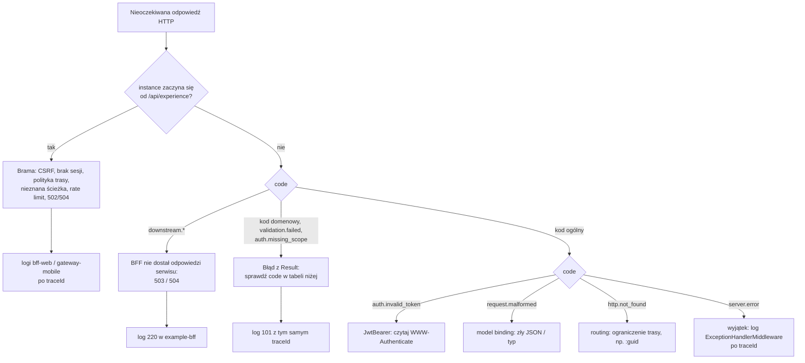

# 17. Rozwiązywanie problemów

**Czego się nauczysz.** Jak rozpoznać i naprawić najczęstsze problemy: błędy kompilacji (analizatory `APP001`–`APP006`,
dokumentacja, przestrzenie nazw, podatności pakietów, testy architektury), odpowiedzi HTTP, które „nie powinny” wystąpić
(401, 403, 400, 404, 409, 422, 429, 500, 502, 503), problemy z BFF experience i jego klientami serwisów, EF Core i migracjami,
messagingiem, cache, bramą, Dockerem i Keycloakiem, analityką i feature flags.

**Wymagania wstępne.** [Architektura w praktyce](02-architektura-w-praktyce.md) (gdzie co się dzieje),
[Lokalne środowisko i debugowanie](13-lokalne-srodowisko-i-debugowanie.md) (jak zajrzeć do bazy, kolejek i logów),
[Logowanie i obserwowalność](14-logowanie-i-obserwowalnosc.md) (jak znaleźć żądanie po `traceId`).

> **W skrócie**
>
> - Najpierw ustal, **kto** odpowiedział. Każdy błąd ma `code` i `traceId` (ADR-0044); o nadawcy mówi `instance`:
>   ścieżka bramy (`/api/example/...`) = brama, ścieżka bez prefiksu (`/v1/...`) = BFF albo serwis (przekazany przez BFF bez zmian).
>   BFF rozpoznasz po `downstream.unavailable`/`downstream.timeout` i `403` API wewnętrznego.
> - `code` mówi, co się stało; `traceId` prowadzi do logów i śladu. Kod ogólny (`auth.invalid_token`, `auth.forbidden`,
>   `http.not_found`, `request.malformed`, `server.error`) = odpowiedź z ASP.NET Core (uwierzytelnienie, routing, model binding,
>   nieobsłużony wyjątek), a nie z `Result`. Puste ciało dostaje tylko klient, który nie akceptuje JSON (nawigacja przeglądarki).
> - Nagłówek `WWW-Authenticate` przy `401` z serwisu podaje dokładną przyczynę odrzucenia tokenu.
> - Błędy kompilacji `APPxxx` i testy architektury to reguły projektu; naprawia się kod, nie reguły.
> - Każdy wpis poniżej: **Objaw → Przyczyna → Jak sprawdzić → Naprawa**.

---

## Jak zacząć diagnozę



Szybki przegląd kodów zwracanych przez framework:

| `code` | Status | Skąd |
|---|---|---|
| `validation.failed` | 400 | `ValidationBehavior` (FluentValidation); pola w `errors` |
| `auth.missing_scope` | 403 | `AuthorizationBehavior`: token bez scope'u z `[RequiresScope]` |
| `auth.unauthenticated` | 403 | `AuthorizationBehavior` (brak uwierzytelnienia przy żądaniu bez `[AllowAnonymousRequest]`) albo handler, który potrzebuje `sub`, a go nie ma |
| `persistence.duplicate` | 409 | `WriteDbContextBase`: naruszony unikalny indeks bez mapowania w `UniqueConstraintErrors` |
| `downstream.unavailable` | 503 | BFF (`DownstreamUnavailableExceptionHandler`): serwis nieosiągalny (brak połączenia, DNS, otwarty circuit breaker) po wyczerpaniu ponowień |
| `downstream.timeout` | 504 | BFF: serwis nie odpowiedział w limicie czasu pipeline'u resilience |
| `persistence.concurrency_conflict` | 409 | `WriteDbContextBase`: agregat zmieniony przez inną komendę między odczytem a zapisem (`rowversion`); klient odświeża i ponawia |
| `{serwis}.{pojęcie}.{problem}` | 400/403/404/409/422 | błędy domenowe, np. `knowledge.category.slug_taken` (409), `knowledge.material.content_required` (422) |

---

## 1. Błędy kompilacji

Wszystkie ostrzeżenia są błędami (`TreatWarningsAsErrors`, `EnforceCodeStyleInBuild` w `Directory.Build.props`), a analizatory
`src/Tools/SuperApp.Analyzers` są podłączone do każdego projektu poza nimi samymi.

### 1.1 APP001: zignorowany `Result`

- **Objaw:** `error APP001: The result of type 'Result' is ignored; handle the error or discard it explicitly (ADR-0015)`.
- **Przyczyna:** wywołanie metody zwracającej `Result`/`Result<T>` jako osobna instrukcja. Błąd biznesowy zostałby połknięty,
  a handler zgłosiłby sukces.
- **Jak sprawdzić:** linia wskazana w komunikacie, zwykle metoda agregatu (`material.Publish(...)`, `category.Rename(...)`).
- **Naprawa:**

  ```csharp
  // Źle
  category.Rename(command.Name);
  return Result.Success();

  // Dobrze: błąd wraca do klienta
  return category.Rename(command.Name);

  // Dobrze, gdy trzeba coś zrobić dalej
  var renamed = category.Rename(command.Name);
  if (renamed.IsFailure)
  {
      return renamed.Error;
  }
  ```

  `_ = ...` tylko świadomie, gdy wynik naprawdę nie ma znaczenia (wzór: `_ = writeContext.TakeAfterCommitActions();`).

### 1.2 APP002: `default` lub `new()` dla silnego ID / value objectu

- **Objaw:** `error APP002: 'MaterialId' must not be created with default or new(); use a factory method (ADR-0023, ADR-0024)`.
- **Przyczyna:** struktury zawsze mają `default` i bezparametrowe `new()`; obie wartości omijają walidację (pusty `Guid`).
- **Naprawa:** `MaterialId.New()` (nowe ID), `MaterialId.Create(guid)` (dane z zewnątrz, zwraca `Result<MaterialId>`),
  `MaterialId.FromTrusted(guid)` (tylko Infrastructure, wartości z bazy; pilnuje tego test architektury), `MaterialId?` dla
  „braku wartości”.

### 1.3 APP003: zakazane API

- **Objaw:** `error APP003: Use of 'MediatR.IMediator' is not allowed: send commands and queries through ISender (ADR-0027)`
  albo `... 'DbContext.SaveChanges' ...`, `... 'MediatR.INotification' ...`.
- **Przyczyna:** `INotification`/`INotificationHandler<T>`/`IPublisher` (zdarzenia domenowe mają własny mechanizm w transakcji),
  `IMediator` (wystarcza `ISender`), synchroniczne `SaveChanges` (pominęłoby asynchroniczny dispatch zdarzeń).
- **Naprawa:** zdarzenie domenowe `sealed record ... : IDomainEvent` + `IDomainEventHandler<T>`; wstrzykuj `ISender`; zapisu
  w handlerach komend nie ma wcale (robi go `TransactionBehavior`), a w kodzie technicznym używaj `SaveChangesAsync`.

### 1.4 APP004 i APP005: jeden typ na plik, nazwa pliku

- **Objaw:** `error APP004: Type 'CategoryId' must be in its own file: one type per file (ADR-0032)` / `error APP005: Type 'Bar' must be in file 'Bar.cs' (currently 'Baz.cs') (ADR-0032)`.
- **Przyczyna:** drugi typ najwyższego poziomu w pliku albo nazwa pliku różna od typu (porównanie z uwzględnieniem wielkości liter).
- **Naprawa:** przenieś typ do własnego pliku. Dozwolone nazwy: `Order.cs`; typ generyczny `Result{T}.cs` (lub `Result.cs`);
  część klasy `partial`: `Order.Log.cs`. Typy zagnieżdżone są dozwolone.
- **Migracje:** pliki w katalogach `Migrations` są w `.editorconfig` oznaczone jako `generated_code = true`, więc analizatory
  (także APP005) ich nie sprawdzają. Konwencja zmiany nazwy `{data}_Nazwa.cs` na `Nazwa.cs` (plik `.Designer.cs` zostaje
  z datą) obowiązuje mimo to i jest pilnowana w review ([Dane i EF Core](07-dane-i-ef-core.md)).

### 1.5 APP006 i CS1591: dokumentacja XML

- **Objaw:** `error CS1591: Missing XML comment for publicly visible type or member 'X'` albo
  `error APP006: The documentation of 'GetAsync' does not describe: <param name="id">, <param name="cancellationToken">, <returns> (ADR-0033)`.
- **Przyczyna:** `CS1591` = brak `summary` na publicznym symbolu. `APP006` = `summary` jest, ale brakuje `param`, `typeparam`,
  `returns` (metody poza `void`/`Task`/`ValueTask`) albo, w `src/Framework`, `remarks` na typie
  (`app_documentation_require_remarks = true` w `.editorconfig`).
- **Naprawa:** uzupełnij tagi wymienione w komunikacie; implementacja interfejsu bez nowych informacji: `/// <inheritdoc />`.
  Jeśli typ nie musi być publiczny, zmień go na `internal` (domyślna widoczność w projekcie). Projekty testów mają `CS1591`
  i `APP006` wyłączone. Treść dokumentacji: [Dokumentacja w kodzie](15-dokumentacja-w-kodzie.md).

### 1.6 IDE0130 i IDE0161: przestrzeń nazw

- **Objaw:** `error IDE0130: Namespace "Knowledge.Infrastructure" does not match folder structure, expected "Knowledge.Infrastructure.Persistence.Write.Configurations"`;
  `IDE0161` dla przestrzeni nazw w klamrach.
- **Przyczyna:** `dotnet_style_namespace_match_folder = true` i `csharp_style_namespace_declarations = file_scoped` w `.editorconfig`.
- **Naprawa:** przestrzeń nazw = ścieżka katalogu, deklaracja `namespace X.Y;`. To nie tylko styl: konfiguracje EF są stosowane
  według przestrzeni nazw (3.2).

### 1.7 NU1901–NU1904: podatny pakiet

- **Objaw:** `error NU1903: Package 'X' 1.2.3 has a known high severity vulnerability`.
- **Przyczyna:** `NuGetAudit` w trybie `all` sprawdza także zależności przechodnie; ostrzeżenie jest błędem.
- **Jak sprawdzić:** `dotnet list package --vulnerable --include-transitive`.
- **Naprawa:** podnieś wersję w `Directory.Packages.props` (dla zależności przechodniej dodaj jawny wpis `PackageVersion` i
  `PackageReference`). MediatR i MassTransit tylko w ramach wersji open source (12.x, 8.x, ADR-0035); jeśli łatki nie ma w tej
  linii, opisz ryzyko i decyzję w ADR, zamiast wyłączać audyt.

### 1.8 NU1008 / NU1010: Central Package Management

- **Objaw:** `NU1008: Projects that use central package version management should not define the version on the PackageReference items`
  albo `NU1010: The PackageReference items ... do not have corresponding PackageVersion`.
- **Naprawa:** w `.csproj` tylko `<PackageReference Include="X" />`; wersja w `Directory.Packages.props`. Nowy pakiet wymaga
  uzasadnienia ([3 Zasady](03-zasady.md#pakiety-adr-0035)).

### 1.9 Build projektu Api kończy się w kroku generowania OpenAPI

- **Objaw:** błąd builda z narzędzia `GetDocument.Insider` (generowanie `openapi/*.json` przy buildzie).
- **Przyczyna:** narzędzie uruchamia aplikację bez infrastruktury; kod rejestracji, który łączy się z czymś przy starcie,
  się wywraca. Dlatego `AddAppMessaging` sprawdza `BuildTimeDocumentGeneration.IsActive` i nie rejestruje MassTransit.
- **Naprawa:** podobnie zabezpiecz własną rejestrację, która łączy się z zewnętrznym systemem (tylko rejestracje, nigdy obsługę żądań).

### 1.10 Test architektury nie przechodzi

`tests/SuperApp.ArchitectureTests/ArchitectureRules.cs`; komunikat ArchUnitNET wymienia typ i zależność, która łamie regułę.

| Test | Typowa przyczyna | Naprawa |
|---|---|---|
| `Service_does_not_depend_on_other_services` | `using Knowledge...` w SleepDiary (np. kopiowanie DTO) | zdarzenie integracyjne albo ACL z klientem wygenerowanym z kontraktu ([przepis 08](przepisy/08-wywolanie-innego-serwisu.md)) |
| `Domain_depends_only_on_framework_domain` | atrybut EF, `using MediatR`, typ z Application w Domain | konfiguracja w `IEntityTypeConfiguration<T>`; zdarzenie jako `IDomainEvent` |
| `Application_does_not_depend_on_infrastructure` | `DbContext`, `FailSafeCache`, MassTransit w handlerze komendy | port w Application, implementacja w Infrastructure; cache tylko w handlerach zapytań (Infrastructure) |
| `Contracts_contain_only_primitive_types` | `MaterialId` albo enum domenowy w zdarzeniu `V1` | prymitywy (`Guid`, `string`, `DateTimeOffset`...) |
| `FromTrusted_is_used_only_by_infrastructure` | `XxxId.FromTrusted` w handlerze komendy | `Create(...)` i obsługa `Result` |
| `Hosts_use_infrastructure_only_in_composition_root` | kontroler lub konsument używa repozytorium albo `ReadDbContext` | `ISender.Send` komendy/zapytania |
| `Handlers_are_internal_sealed_and_in_the_right_layer` | `public` handler, handler zapytania w Application, handler komendy w Infrastructure | `internal sealed`; zapytania w Infrastructure (ADR-0026) |
| `Pipeline_behaviors_are_registered_in_order` | zmiana kolejności w `AddAppApplication` | kolejność z ADR-0017 |
| `Services_are_discovered` | projekty serwisu nie są referencjonowane w `SuperApp.ArchitectureTests.csproj` | dodaj referencje |
| `Analytics_forwarder_depends_only_on_contracts_of_services` | forwarder referencjonuje `{Serwis}.Application`/`Domain` | tylko `{Serwis}.Contracts` ([21.5](21-analityka-i-feature-flags.md#215-zdarzenia-z-backendu-superappanalyticsforwarder)) |
| `Only_framework_and_forwarder_use_posthog` | pakiet `PostHog` w projekcie serwisu lub bramy | flagi przez `IFeatureFlags`, zdarzenia przez forwarder |
| `Bff_references_no_service_and_no_other_bff` | `ProjectReference` z BFF do `{Serwis}.Contracts`/`Application` albo do innego BFF (np. żeby użyć gotowego DTO) | klient Refitter z kontraktu OpenAPI serwisu (albo API wewnętrznego innego BFF) w `Clients/{Serwis}/Generated` |
| `Bff_has_no_database` | `DbContext` w BFF (np. „cache” lub stan w bazie) | BFF jest bezstanowy; dane należą do serwisu, cache odczytów przez `HybridCache` |
| `Services_do_not_reference_bffs` | serwis referuje BFF | odwrotny kierunek: BFF woła serwis; serwis potrzebujący danych innego serwisu: zdarzenia albo [przepis 08](przepisy/08-wywolanie-innego-serwisu.md) |

### 1.11 Klient Refitter w BFF nie pasuje do serwisu

- **Objaw:** brak metody w `I{Serwis}Api` (błąd kompilacji akcji BFF), inny typ parametru, nowe pole odpowiedzi serwisu nie dociera
  do modułu albo deserializacja odpowiedzi kończy się wyjątkiem (np. nowy wariant polimorficznego bloku, `x-abstract`).
- **Przyczyna:** wygenerowany kod w `src/Bff/{Experience}.Bff/Clients/{Serwis}/Generated` pochodzi ze starszej wersji kontraktu
  `{Serwis}.Api/openapi/{Serwis}.Api.json`. Refitter nie działa przy buildzie; klienta regeneruje się ręcznie.
- **Jak sprawdzić:** diff kontraktu serwisu względem ostatniej regeneracji; nazwy metod pochodzą z `operationId`
  (`{Kontroler}_{Akcja}` → `{Kontroler}{Akcja}Async`), więc zmiana nazwy akcji serwisu zmienia nazwę metody klienta.
- **Naprawa:** zbuduj serwis (aktualny kontrakt), potem `dotnet tool restore` i
  `dotnet refitter --settings-file src/Bff/Example.Bff/Clients/Knowledge/knowledge.refitter` (analogicznie `sleepdiary.refitter`),
  dostosuj akcje BFF, zbuduj BFF i przeczytaj diff `openapi/Example.Bff_public.json`.

### 1.12 Klient Refit nie daje się utworzyć w czasie działania

- **Objaw:** build przechodzi, ale BFF albo test z `AddDownstreamApi` kończy się wyjątkiem przy rozwiązywaniu `I{Serwis}Api`
  z DI lub przy pierwszym wywołaniu klienta.
- **Przyczyna:** Refit 16 wydzielił oparty na refleksji budowniczy żądań, którego używa `AddRefitClient` dla interfejsów
  wygenerowanych przez Refitter, do pakietu `Refit.Reflection`. `SuperApp.Framework.Infrastructure` referuje go jawnie (obok
  `Refit.HttpClientFactory`); projekt, który rejestruje klienta Refit bez tej referencji, jej nie dostaje.
- **Naprawa:** rejestruj klientów przez `AddDownstreamApi` z `SuperApp.Framework.Infrastructure` (pakiet przychodzi z frameworkiem);
  nie usuwaj `Refit.Reflection` z `Directory.Packages.props` ani z projektu frameworka.
---

## 2. Odpowiedzi HTTP

### 2.1 `401` z serwisu (bezpośrednio lub przez `gateway-mobile`)

- **Objaw:** `401` z ciałem `{"type":"https://tools.ietf.org/html/rfc9110#section-15.5.2","title":"Unauthorized","status":401,"traceId":"<32 znaki hex>","code":"auth.invalid_token","instance":"/v1/..."}`.
- **Przyczyna i jak sprawdzić:** nagłówek `WWW-Authenticate` (rzeczywiste przykłady z `knowledge-api`):

  | `WWW-Authenticate` | Znaczenie | Naprawa |
  |---|---|---|
  | `Bearer` | brak nagłówka `Authorization` | wyślij token |
  | `Bearer error="invalid_token"` | token nieparsowalny (np. obcięty przy kopiowaniu) | pobierz nowy |
  | `Bearer error="invalid_token", error_description="The audience '(null)' is invalid"` | w `aud` nie ma `knowledge-api`, bo token nie zawiera żadnego scope'u tego serwisu | poproś o scope serwisu (każdy scope dodaje audience swojego serwisu, ADR-0012) |
  | `... error_description="The token expired at '...'"` | token wygasł (lokalnie po 5 minutach; tolerancja zegara `ClockSkew` to tylko 30 s, `HostingExtensions.TokenClockSkew`) | nowy token; w BFF odświeża go brama |
  | `... error_description="The issuer '...' is invalid"` | token z innego issuera niż `Authority` serwisu | 6.3 |
  | `... error_description="The signature key was not found"` | token z innej instancji CIAM (np. po odtworzeniu kontenera Keycloaka zmieniły się klucze) | nowy token z bieżącej instancji |

- **Uwaga:** `401` nigdy nie pochodzi z `Result`: `AuthorizationBehavior` zwraca `403`, a nie `401`.

### 2.2 `401` z `bff-web` (`instance` ze ścieżką bramy)

| Przyczyna | Jak sprawdzić | Naprawa |
|---|---|---|
| brak nagłówka `X-CSRF: 1` na `/api/*` (`code` `auth.csrf_header_missing`) | żądanie w narzędziach przeglądarki; odrzucenie następuje przed uwierzytelnieniem, więc dotyczy także zalogowanych | interceptor Angulara dla każdego żądania `/api/*` (także GET) |
| brak sesji (`auth.invalid_token`; ciasteczko nie wysłane, wylogowanie, sesja wygasła po 8 h) | `GET /bff/user` zwraca `401`; `SELECT ... FROM gateway.Sessions` | `window.location.href = '/bff/login?returnUrl=...'` |
| odświeżenie tokenu odrzucone przez CIAM (sesja SSO zakończona, refresh token użyty ponownie) | log `3101 BFF token refresh rejected by CIAM with status 400` | nowe logowanie; jeśli powtarza się bez powodu, sprawdź, czy nic poza bramą nie używa refresh tokenu |
| ticket nie do odszyfrowania (zmienione lub utracone klucze Data Protection) | sesja istnieje w `gateway.Sessions`, a `/bff/user` daje `401` | ponowne logowanie; na klastrze sprawdź `DataProtection:CertificatePath` i wspólny `ApplicationName` (6.5) |

Brama celowo zwraca `401` zamiast przekierowania `302` do CIAM (`OnRedirectToLogin`), bo XHR nie może podążyć za
przekierowaniem na inny origin.

### 2.3 `403`: brama, BFF czy serwis?

| Odpowiedź | Kto | Przyczyna | Naprawa |
|---|---|---|---|
| `403 auth.forbidden`, `instance` `/api/example/...` | brama, polityka trasy `GatewayPolicies.Example` | token/sesja bez **żadnego** scope'u serwisów experience (`knowledge.*` ani `sleepdiary.*`) | poproś o scope serwisu; w `bff-web` lista `Authentication:Scopes` bramy |
| `403` `auth.missing_scope` na `/internal/v1/...` | BFF, polityka `example.internal.read` (`ScopePolicyExtensions.RequireScope`) | token bez scope'u API wewnętrznego | wołający (BFF innej experience) musi mieć scope od CIAM; lokalnie `dev-cli` z `scope=... example.internal.read` |
| `403`, `code: auth.missing_scope`, `title: Brak wymaganego uprawnienia 'knowledge.catalog.write'.` | serwis, `AuthorizationBehavior` | token ma jakiś scope serwisu, ale nie ten z `[RequiresScope]` komendy | użytkownik musi dostać scope; lokalnie tylko `editor` dostaje `knowledge.catalog.write`. Keycloak **pomija** scope, którego użytkownik nie może dostać, zamiast zgłosić błąd |
| `403`, `code: auth.unauthenticated` | serwis | (a) żądanie bez `[AllowAnonymousRequest]` od niezalogowanego klienta: endpoint ma `[AllowAnonymous]`, ale komenda nie; (b) handler potrzebuje `sub` (`ICurrentUser.Subject`), a go nie ma: komenda/zapytanie „moje dane” wysłane z Workera (system identity), token bez `sub` | (a) uzgodnij trzy poziomy: trasa bramy, `[AllowAnonymous]`, `[AllowAnonymousRequest]`; (b) nie wysyłaj zapytań „dla użytkownika” z Workera, przekaż identyfikator jawnie |
| `403` z innym `code` | serwis, handler/agregat | reguła zasobu (np. właściciel) | zgodnie z kodem |

Rzeczywista odpowiedź `auth.missing_scope` (token `reader`, `POST /v1/categories`):

```json
{"title":"Brak wymaganego uprawnienia 'knowledge.catalog.write'.","status":403,"instance":"/v1/categories",
 "code":"auth.missing_scope","traceId":"4e15096ae8e8f528be59fe4ec772a394"}
```

### 2.4 `400`

**Z `code: validation.failed`** (walidator FluentValidation):

```json
{"title":"Żądanie zawiera niepoprawne dane.","status":400,"instance":"/v1/categories",
 "errors":{"Name":["'Name' must not be empty."],"Slug":["'Slug' must not be empty."]},
 "code":"validation.failed","traceId":"19b39bc67df137ec111c2b3062874a88"}
```

Klucze `errors` to nazwy właściwości komendy (PascalCase). Walidator sprawdza kształt danych; reguła zależna od stanu (slug
zajęty) to osobny błąd domenowy (`409`).

**Z innym `code` typu Validation** (np. `knowledge.category.invalid_slug`, `sleepdiary.entry.wake_before_bed`): błąd z fabryki
value objectu lub agregatu, bez `errors`. To ten sam status, ale inny kod: klient rozróżnia po `code`.

**Przez BFF.** BFF nie waliduje treści żądań (`ModelValidatorProviders.Clear()`), a odrzuca tylko wejście niemożliwe do powiązania (np. `?type=Bogus` → `400 request.malformed` z kluczem `type` w `errors`): ciało idzie do serwisu, a jego `400` (z
`code`, `errors` i `instance` ze ścieżką serwisu, np. `/v1/materials`) wraca do modułu bez zmian. Szukaj przyczyny w walidatorze
serwisu, nie w BFF. Wyjątek: błąd wiązania w samym BFF (np. nieznana wartość enuma w zapytaniu, nieparsowalne ciało) daje `400`
`request.malformed` z kluczami `errors` w postaci `$.pole` lub nazwy parametru, a żądanie nie dociera do serwisu.

**Błąd wiązania modelu** (`[ApiController]` serwisu, przed pipeline'em): `request.malformed` (ADR-0044), a klucze `errors`
to ścieżki JSON (`$.name`) i nazwy parametrów, a nie właściwości komendy:

```json
{"type":"https://tools.ietf.org/html/rfc9110#section-15.5.1","title":"One or more validation errors occurred.","status":400,
 "errors":{"command":["The command field is required."],
           "$.name":["The JSON value could not be converted to ...CreateCategory. Path: $.name | LineNumber: 0 | BytePositionInLine: 9."]},
 "traceId":"4f39d5dfd4192a300259e74a00b8b3e5","code":"request.malformed","instance":"/v1/categories"}
```

| Przyczyna | Przykład | Naprawa |
|---|---|---|
| zły typ w JSON | `"name": 5` | popraw klienta (wygenerowany z OpenAPI) |
| enum jako liczba | `"type": 1` zamiast `"Article"` | kontrakt przyjmuje enumy **tylko jako nazwy** (`JsonStringEnumConverter(allowIntegerValues: false)`) |
| liczba w cudzysłowie | `"quality": "7"` | `JsonNumberHandling.Strict`: liczby tylko jako liczby |
| zły format daty w ścieżce/zapytaniu | `/v1/entries/30-09-2026` | `DateOnly` w formacie `yyyy-MM-dd` |

### 2.5 `404`

| Odpowiedź | Przyczyna | Naprawa |
|---|---|---|
| `404` z `code: knowledge.material.not_found` | zasobu nie ma **albo** czytelnik nie może go widzieć (szkic widoczny tylko dla redaktora) | sprawdź uprawnienie `knowledge.catalog.write`; to celowe ukrywanie istnienia |
| `404` z `code: http.not_found` (`"title":"Not Found"`) | ścieżka nie pasuje do żadnej akcji, np. identyfikator nie jest GUID-em przy ograniczeniu `{categoryId:guid}` (`PUT /v1/categories/abc/name`) | popraw identyfikator w kliencie |
| `400 validation.failed` zamiast `404` dla `00000000-0000-0000-0000-000000000000` | walidator `NotEmpty()` na identyfikatorze (np. `PublishMaterialValidator`) | pusty GUID to błąd danych wejściowych, nie brak zasobu |
| `404 http.not_found` z `instance` `/api/...` (brama) | ścieżka nie pasuje do jedynej trasy `/api/example/v{version:int}/{**rest}`: dawne `/api/knowledge/...`, `/api/sleepdiary/...`, brak wersji albo `/api/example/internal/...` (API wewnętrzne nigdy nie jest routowane) | ścieżka przez bramę = `/api/example` + ścieżka BFF, np. `/api/example/v1/knowledge/materials` |
| `404 http.not_found` z BFF dla operacji, którą serwis ma | BFF nie ma akcji dla tej operacji (nowy endpoint serwisu bez kroku „wystaw w BFF”) | akcja w kontrolerze BFF ([przepis 01](przepisy/01-endpoint-komendy.md)) |
| `404` dla `GET /v1/entries/{date}` w SleepDiary | wpis istnieje, ale należy do innego użytkownika (filtr po `sub`) | reguła zasobu: cudze dane są „nieistniejące” |

### 2.6 `409`

| `code` | Przyczyna | Naprawa |
|---|---|---|
| `knowledge.category.slug_taken`, `sleepdiary.entry.already_exists` | duplikat wykryty przez handler **albo** przez unikalny indeks przy wyścigu dwóch żądań (mapa `UniqueConstraintErrors`) | normalne zachowanie; klient pokazuje komunikat |
| `knowledge.library.favorite_added_concurrently`, `knowledge.library.completion_recorded_concurrently` | wyścig dwóch identycznych żądań; sekwencyjny duplikat jest idempotentnym sukcesem, wyścigu nie da się tak potraktować po nieudanym zapisie | klient może ponowić; drugie wywołanie skończy się sukcesem |
| `persistence.duplicate` | naruszony unikalny indeks, którego nie ma w `UniqueConstraintErrors` kontekstu (np. dwaj redaktorzy jednocześnie podmieniają kategorie tego samego materiału) | jeśli użytkownik może to wywołać zwykłym użyciem, dodaj mapowanie indeksu na błąd kontekstu (nazwa indeksu z migracji) |

Jak sprawdzić: log 101 `Request X failed with <code>`; przy wyścigu w śladzie widać `INSERT` zakończony błędem SQL 2601/2627.

### 2.7 `422`

- **Objaw:** `422` z kodem reguły biznesowej, np. `knowledge.material.content_required`, `knowledge.material.archived`,
  `knowledge.material.main_media_required`.
- **Przyczyna:** żądanie poprawne co do formy, ale agregat w obecnym stanie go nie dopuszcza (`Error.BusinessRule`).
- **Naprawa:** to nie błąd systemu. Klient pokazuje komunikat; jeśli reguła wydaje się błędna, zmiana należy do agregatu
  (i testów domeny), nie do handlera.

### 2.8 `429`

- **Przyczyna:** polityka `per-user` bramy: domyślnie `Gateway:RateLimit:PermitPerMinute = 600` żądań na minutę na `sub`
  (bez uwierzytelnienia na adres IP), okno stałe. Odpowiedź ma `code` `http.too_many_requests` i `traceId` (ADR-0044).
- **Naprawa:** sprawdź pętle w kliencie (np. odpytywanie w `setInterval`); limit zmienia konfiguracja bramy.

### 2.9 `500`

Ciało `problem+json` z `code: server.error` i `traceId` (32 znaki hex, ADR-0044), bez szczegółów błędu. Szczegóły tylko w logu `Microsoft.AspNetCore.Diagnostics.ExceptionHandlerMiddleware`
(poziom `Error`, ze stosem); znajdziesz go po identyfikatorze śladu ([Logowanie i obserwowalność](14-logowanie-i-obserwowalnosc.md)).

| Wyjątek w logu | Przyczyna | Naprawa |
|---|---|---|
| `DbUpdateConcurrencyException` (Worker) | dwie komendy jednocześnie zmieniły ten sam agregat z tokenem `rowversion` (`Version` w `Categories`, `Materials`, `Collections`, `SleepEntries`); w API ten sam konflikt to `409 persistence.concurrency_conflict`, nie 500 | nic: MassTransit ponawia wiadomość na świeżych danych; jeśli trafia do `_error`, sprawdź, czy dwa konsumenty nie zmieniają stale tego samego agregatu |
| `SqlException: Invalid column name` / `Invalid object name` | kod nowszy niż schemat (migracja nie zastosowana); lokalnie nic tego nie blokuje | Migrator (3.4) |
| `SqlException: The SELECT permission was denied on the object 'X', database 'SuperApp', schema 'Y'` | zapytanie do cudzego schematu (ADR-0021) | usuń odwołanie; dane innego kontekstu przez zdarzenia lub ACL |
| `NotSupportedException: ReadDbContext służy wyłącznie do odczytu (ADR-0003).` | próba zapisu przez `ReadDbContext` | zapis tylko przez komendę i `WriteDbContext` |
| `NotSupportedException: Zapis wyłącznie przez IUnitOfWork.SaveChangesAsync (ADR-0027).` | synchroniczne `SaveChanges` (APP003 zwykle wyłapie to wcześniej) | |
| `InvalidOperationException` z `HandleAsync` handlera zdarzenia domenowego | wyjątek w translatorze lub handlerze zdarzeń wycofuje całą komendę | handler zdarzenia nie może zakładać niczego poza danymi zdarzenia |
| `JsonException` przy odczycie z cache | zmieniony kształt DTO w cache bez podbicia wersji klucza (`:v1:` → `:v2:`) | 5.2 |

### 2.10 `502` / `504` z bramy

| Status | Przyczyna | Jak sprawdzić | Naprawa |
|---|---|---|---|
| `502` | brak połączenia z BFF: pod nie działa, lokalnie zatrzymany kontener `example-bff` (zniknął alias `example-bff.example.svc.cluster.local`), brama z IDE nie rozwiązuje nazw klastra | logi YARP (poziom `Warning`), `docker compose ps` | uruchom BFF; lokalnie przepisy 9.2 i 9.8 w [Lokalnym środowisku](13-lokalne-srodowisko-i-debugowanie.md) |
| `504` | przekroczony timeout trasy (`Routes.TimeoutSeconds`, seed: 30 s) | ślad: długi span w BFF lub SQL w serwisie | optymalizacja zapytania; zmiana timeoutu tylko migracją bramy |
| retry w logach `3401`/`3402` | GET/HEAD ponowione po 502/503/504 lub błędzie połączenia (domyślnie 2 razy, 100 ms × 2^n) | | POST/PUT/DELETE nigdy nie są ponawiane przez bramę |

### 2.11 `503 downstream.unavailable` / `504 downstream.timeout` z BFF

```json
{"title":"Usługa zależna jest niedostępna.","status":503,"instance":"/v1/knowledge/materials","code":"downstream.unavailable",
 "traceId":"..."}
```

| `code` | Przyczyna | Jak sprawdzić | Naprawa |
|---|---|---|---|
| `downstream.unavailable` (503) | BFF nie połączył się z serwisem: pod lub kontener serwisu nie działa, zły `Downstream:{Serwis}:BaseAddress`, DNS, albo circuit breaker otwarty po serii błędów | log 220 `Downstream call failed (downstream.unavailable)` z wyjątkiem w `example-bff`; adres w konfiguracji BFF (`appsettings*.json`, zmienne `Downstream__{Serwis}__BaseAddress` z wartości `downstream` chartu) | uruchom serwis albo popraw adres; po otwarciu circuit breakera odczekaj, aż się zamknie |
| `downstream.timeout` (504) | serwis nie odpowiedział w limicie czasu standardowego pipeline'u resilience (`AddStandardResilienceHandler`) | log 220 z `downstream.timeout`; w śladzie długi span serwisu | optymalizacja po stronie serwisu |

To nie są błędy serwisu: serwis w ogóle nie odpowiedział. Gdy serwis odpowiada błędem (`404`, `409`, `500`), BFF przekazuje tę
odpowiedź bez zmian (`ToActionResult`), z `code` i `traceId` serwisu. Ponawiane są tylko metody bezpieczne (GET, HEAD,
OPTIONS); POST, PUT, PATCH i DELETE nie są ponawiane (`DisableForUnsafeHttpMethods`). Endpoint komponowany (`GET /v1/me/summary`) nie zwraca 503/504: niedostępna
część dostaje w odpowiedzi `200` status części odpowiedzi `Unavailable` albo `Timeout` (limit 2 s na część odpowiedzi).

---

## 3. EF Core i migracje

### 3.1 Model różni się od migracji

- **Objaw:** `dotnet ef migrations has-pending-model-changes` zgłasza zmiany; nowa migracja zawiera nieoczekiwane operacje.
- **Jak sprawdzić:**
  ```bash
  dotnet ef migrations has-pending-model-changes \
    -p src/Services/Knowledge/Knowledge.Infrastructure -s src/Services/Knowledge/Knowledge.Infrastructure \
    --context KnowledgeWriteDbContext
  ```
- **Naprawa:** dodaj migrację ([przepis 04](przepisy/04-zmiana-modelu-i-migracja.md)). Nigdy nie edytuj migracji zastosowanej
  gdziekolwiek poza Twoją maszyną: EF nie porównuje treści, więc zmieniona stara migracja nie wykona się tam, gdzie już jest
  w `__EFMigrationsHistory`, i schematy środowisk się rozjadą.

### 3.2 Konfiguracja EF nie jest stosowana

- **Objaw:** kolumna ma domyślny typ (`nvarchar(max)` zamiast `nvarchar(100)`), brak indeksu, błąd „The entity type 'X'
  requires a primary key to be defined”, albo migracja zapisu nagle tworzy tabelę dla klasy `*Row` z modelu odczytu.
- **Przyczyna:** `WriteDbContextBase` i `ReadDbContextBase` stosują `IEntityTypeConfiguration<T>` **tylko** z przestrzeni nazw
  kontekstu i podrzędnych:
  ```csharp
  private bool IsInContextNamespace(Type configurationType) =>
      configurationType.Namespace is { } ns
      && (ns == GetType().Namespace || ns.StartsWith(GetType().Namespace + ".", StringComparison.Ordinal));
  ```
  Konfiguracja zapisu w `Knowledge.Infrastructure.Configurations` (zły katalog) nie zostanie zastosowana; konfiguracja
  `CategoryRow` umieszczona w `Persistence/Write/...` trafi do modelu zapisu.
- **Naprawa:** zapis: `Knowledge.Infrastructure.Persistence.Write.Configurations`; odczyt:
  `Knowledge.Infrastructure.Persistence.Read.Configurations`. IDE0130 pilnuje, żeby przestrzeń nazw zgadzała się z katalogiem.

### 3.3 Nazwa pliku migracji

- **Objaw:** w review: plik `20261001120000_AddCategoryDescription.cs` w `Migrations/`.
- **Przyczyna:** `dotnet ef migrations add` nadaje nazwę z datą. APP005 tego nie zgłasza (pliki `Migrations` są oznaczone jako
  generowane w `.editorconfig`), ale konwencją repozytorium jest nazwa bez daty.
- **Naprawa:** zmień nazwę na `AddCategoryDescription.cs`; `.Designer.cs` zostaje z datą (identyfikator migracji jest w atrybucie
  `[Migration("...")]`, nie w nazwie pliku).

### 3.4 Pod nie startuje: `/health/startup` niezdrowy (oczekujące migracje)

- **Objaw:** na klastrze pod nie przechodzi `startupProbe` (rollout wstrzymany, stara wersja obsługuje ruch); `/health/startup`
  zwraca `503 Unhealthy`. Lokalnie serwis działa, ale ma `500 Invalid column name`.
- **Przyczyna:** w assembly są migracje, których nie ma w `{schemat}.__EFMigrationsHistory`. Proces nigdy nie migruje sam (ADR-0004).
- **Jak sprawdzić:** treść odpowiedzi nie zawiera listy migracji, więc:
  ```bash
  dotnet ef migrations list -p src/Services/Knowledge/Knowledge.Infrastructure -s src/Services/Knowledge/Knowledge.Infrastructure \
    --context KnowledgeWriteDbContext \
    --connection "Server=localhost,1433;Database=SuperApp;User Id=sa;Password=Dev!Passw0rd1;TrustServerCertificate=True"
  ```
  albo `SELECT MigrationId FROM knowledge.__EFMigrationsHistory`.
- **Naprawa:** dev/test: Job `superapp-migrator` (lokalnie `dotnet run --project src/Migrator/SuperApp.Migrator --launch-profile local`);
  prod: skrypt `--idempotent` uruchamiany przez DBA przed wdrożeniem. W bramie analogicznie dla `GatewayDbContext`, a dodatkowo
  check `proxy-config` (konfiguracja tras nie załadowana: logi 3002/3003).

### 3.5 Migrator kończy się kodem 1

- **Objaw:** log `4003 Migration of KnowledgeWriteDbContext failed; rollout must not continue`; Job nieudany, rollout zatrzymany.
- **Jak sprawdzić:** wyjątek w tym samym wpisie: najczęściej brak uprawnień (`superapp_migrator` nie istnieje albo bootstrap nie był
  uruchomiony), błąd SQL w migracji danych, timeout (limit polecenia 10 min).
- **Naprawa:** popraw migrację nową migracją (jeśli poprzednie zostały zastosowane), uruchom bootstrap (`deploy/sql/01-bootstrap.sql`).
  Migracje są kolejno: brama, Knowledge, SleepDiary; błąd w jednym kontekście zatrzymuje następne.

### 3.6 Testy integracyjne: „Serwis nie ma migracji”

- **Objaw:** `InvalidOperationException: Serwis nie ma migracji. Utwórz pierwszą: dotnet ef migrations add Initial ...` z `ServiceFixture`.
- **Przyczyna:** nowy serwis z szablonu bez pierwszej migracji (ADR-0030).
- **Naprawa:** polecenie z komunikatu.

---

## 4. Messaging

### 4.1 Zdarzenie nie dociera do konsumentów (outbox nie jest wysyłany)

- **Objaw:** komenda zakończona sukcesem, a skutek asynchroniczny (np. usunięcie z ulubionych po archiwizacji) nie następuje.
- **Przyczyna:** API zapisuje outbox, ale go nie wysyła (`OutboxDelivery.Disabled`). Wysyła **Worker** serwisu. Worker nie
  działa, nie ma połączenia z RabbitMQ, albo ktoś uruchomił samo API.
- **Jak sprawdzić:**
  ```sql
  SELECT SequenceNumber, MessageType, SentTime, OutboxId FROM knowledge.OutboxMessage ORDER BY SequenceNumber;
  ```
  Wiersze z `OutboxId`, które nie znikają, czekają na wysłanie. `/health/dependencies` Workera pokazuje stan busa.
- **Naprawa:** uruchom Worker (`knowledge-worker`); po starcie wyśle zaległe wiadomości. Nie włączaj dostarczania w API.

### 4.2 Wiadomość trafia do kolejki `_error`

- **Objaw:** kolejka `knowledge-material-archived_error` ma wiadomości; konsument nie wykonał pracy.
- **Przyczyna:** wyjątek w konsumencie (lub komendzie) po wyczerpaniu ponowień: 100 ms, 500 ms, 1 s, 5 s. Błąd biznesowy
  (`Result` z błędem) **nie** trafia do `_error`: jest logowany (np. 2001) i potwierdzany.
- **Jak sprawdzić:** panel RabbitMQ → kolejka `_error` → *Get messages* (tryb *Nack message requeue true*): nagłówki
  `MT-Fault-ExceptionType`, `MT-Fault-Message`, `MT-Fault-StackTrace`, `MT-Fault-RetryCount`.
- **Naprawa:** usuń przyczynę (np. niedostępna baza, błąd w kodzie), wdroż, przenieś wiadomości z powrotem do kolejki
  (przepis 9.5 w [Lokalnym środowisku](13-lokalne-srodowisko-i-debugowanie.md); na klastrze zgodnie z procedurą działu
  utrzymania). Konsument musi być idempotentny.

### 4.3 Konsument nie jest wywoływany

| Przyczyna | Jak sprawdzić | Naprawa |
|---|---|---|
| klasa konsumenta poza assembly Workera (np. w Infrastructure lub Api) | `bus.AddConsumers(typeof(Program).Assembly)` skanuje tylko Workera | konsument w `{Serwis}.Worker/Consumers`, `public sealed` jak istniejące |
| Worker nie działa | kolejka ma `Consumers: 0` | uruchom Worker |
| konsument jest nowy, a kolejka nie istnieje | brak kolejki `{serwis}-{nazwa}` w panelu | topologię tworzy Worker przy starcie: wdroż/uruchom nową wersję Workera |
| zdarzenie publikuje inny typ (np. `MaterialArchivedV2`) niż konsumowany | exchange `Knowledge.Contracts:MaterialArchivedV2` bez wiązania | konsument nowej wersji; w okresie przejściowym publikuj obie (ADR-0005) |

### 4.4 Komenda z konsumenta kończy się `auth.unauthenticated` lub błędem użytkownika

- **Przyczyna:** w Workerze `ICurrentUser` to `SystemCurrentUser`: uwierzytelniony, z każdym scope'em, ale `Subject = null`.
- **Naprawa:** komendy wysyłane z konsumenta nie mogą zależeć od zalogowanego użytkownika; identyfikator użytkownika musi być
  w danych zdarzenia i komendy.

### 4.5 Zmiany zapisane mimo błędnego `Result` w konsumencie

- **Objaw:** konsument zalogował odrzucenie (np. 2001), a w bazie część zmian komendy jednak jest.
- **Przyczyna:** w konsumencie transakcję prowadzi MassTransit; `TransactionBehavior` przy błędnym wyniku nie zapisuje, ale też
  nie odłącza śledzonych zmian, a MassTransit po konsumencie wywołuje `SaveChangesAsync`, żeby zapisać inbox. Zmiany, które handler
  zdążył wprowadzić do śledzonych encji przed zwróceniem błędu, zostaną zapisane razem z inboxem. Dodatkowo `ExecuteDeleteAsync`
  (np. `RemoveAllForItemAsync`) wykonuje się w bazie od razu.
- **Naprawa:** handler komendy sprawdza wszystkie warunki **przed** zmianą stanu, a metody agregatu zwracają błąd przed
  modyfikacją (wzór w całym kodzie domeny). Nie zmieniaj stanu, a potem nie zwracaj błędu.

### 4.6 Ta sama wiadomość przetworzona dwa razy

- **Przyczyna:** inbox odrzuca tylko ponowne dostarczenie wiadomości o tym samym `MessageId` (w oknie deduplikacji
  MassTransit); dwie osobne publikacje (np. dwie komendy archiwizacji) to dwie różne wiadomości. Dostarczanie jest
  „co najmniej raz”.
- **Naprawa:** konsument idempotentny (wzór: usunięcie ulubionych elementu, którego już nie ma, jest no-opem).

---

## 5. Cache

### 5.1 Stare dane po zmianie

| Przyczyna | Jak sprawdzić | Naprawa |
|---|---|---|
| brak handlera unieważniającego dla danego zdarzenia domenowego | czy agregat podnosi zdarzenie (`CategoryChanged`, `MaterialChanged`) i czy istnieje `*CacheInvalidation` | handler w `Infrastructure/Caching` z `unitOfWork.OnCommitted(...)` |
| unieważnienie przed commitem (wywołane bezpośrednio w handlerze zdarzenia) | kod handlera | tylko przez `OnCommitted`; inaczej równoległy odczyt zapisze stare dane z powrotem |
| inna replika ma kopię w pamięci (L1) | dane „wracają” przez maksymalnie 30 s | oczekiwane; `LocalExpiration` w `FailSafeOptions` krótkie |
| akcja po commicie się nie powiodła (Redis niedostępny) | log `210 After-commit action of KnowledgeWriteDbContext failed` | wpis wygaśnie po `Fresh + MaxStale`; sprawdź Redis (`/health/dependencies`) |
| baza niedostępna, działa fail-safe | log `300 Cache fail-safe: returning stale value for knowledge:categories:v1`, metryka `superapp.cache.fail_safe.activations` | problem jest w źródle danych, nie w cache |

Redaktor (scope `knowledge.catalog.write`) czyta materiał z pominięciem cache, więc „redaktor widzi zmianę, czytelnik nie”
oznacza problem z unieważnieniem lub L1, a nie z zapisem.

### 5.2 Błąd deserializacji po wdrożeniu

- **Objaw:** `500` z `JsonException` przy odczycie cache tuż po wdrożeniu, albo brakujące nowe pole w odpowiedzi.
- **Przyczyna:** zmieniony kształt DTO, a klucz ma tę samą wersję (`knowledge:material:v1:{id}`): repliki starej i nowej wersji
  czytają nawzajem swoje JSON-y z Redisa.
- **Naprawa:** podbij segment wersji klucza w `KnowledgeCache` (`v1` → `v2`) przy każdej zmianie kształtu buforowanego DTO.
  Tagi nie mają wersji, więc unieważnianie działa dla obu.

---

## 6. BFF, Keycloak i tokeny

### 6.1 Ciasteczko nie jest ustawiane / pętla logowania

- **Przyczyna:** `__Host-bff` wymaga HTTPS, ścieżki `/` i braku `Domain`. Przez `http://localhost:5000` przeglądarka odrzuci
  ciasteczko.
- **Naprawa:** `https://localhost:5001`; w kontenerze certyfikat `deploy/local/certs/devcert.pfx`
  ([Lokalne środowisko](13-lokalne-srodowisko-i-debugowanie.md)).

### 6.2 Logowanie kończy się błędem Keycloaka „Invalid parameter: redirect_uri”

- **Przyczyna:** realm dopuszcza dla `bff-web` tylko `https://localhost:5001/signin-oidc`. Brama na innym porcie lub hoście
  (np. `127.0.0.1`) wysyła inny `redirect_uri`.
- **Naprawa:** używaj `https://localhost:5001`; inny adres wymaga zmiany `realm-superapp.json` (i zgłoszenia do działu CIAM dla
  środowisk współdzielonych).

### 6.3 Niezgodny issuer

- **Objaw:** `401`, `WWW-Authenticate: Bearer error="invalid_token", error_description="The issuer '...' is invalid"`.
- **Przyczyna:** `iss` tokenu różni się od `issuer` z metadanych `Authentication:Authority` serwisu. Lokalnie stały
  `KC_HOSTNAME=http://localhost:8081` gwarantuje jeden issuer; problem pojawia się, gdy token pochodzi z innej instancji (inny
  Keycloak, inne środowisko) albo konfiguracja Keycloaka została zmieniona.
- **Jak sprawdzić:**
  ```bash
  curl -s http://localhost:8081/realms/superapp/.well-known/openid-configuration | python -c "import sys,json;print(json.load(sys.stdin)['issuer'])"
  # http://localhost:8081/realms/superapp
  ```
  i porównaj z `iss` w tokenie (dekodowanie: przepis 9.1 w [Lokalnym środowisku](13-lokalne-srodowisko-i-debugowanie.md)).
- **Naprawa:** token z tej samej instancji, której używa serwis; nie usuwaj `KC_HOSTNAME` z compose.

### 6.4 `/bff/logout` zwraca `400`

- **Przyczyna:** brak parametru `sid`, `sid` różny od claimu `sid` sesji albo sesja bez claimu `sid`. To ochrona CSRF
  wylogowania: obca strona nie zna `sid`.
- **Jak sprawdzić:** `GET /bff/user` → `logoutUrl`. `null` oznacza, że CIAM nie wydał `sid` (wtedy wylogowanie przez BFF nie jest
  możliwe).
- **Naprawa:** SPA przechodzi pod gotowy `logoutUrl` **nawigacją** (`window.location.href = logoutUrl`), nie przez `fetch`: tylko
  nawigacja może podążyć za `302` do CIAM. Bez sesji `/bff/logout` przekierowuje na `/`.

### 6.5 Sesja przetrwała wylogowanie w CIAM (back-channel logout nie działa)

- **Objaw:** użytkownik wylogował się w innej aplikacji / w konsoli Keycloaka, a BFF dalej obsługuje jego żądania.
- **Przyczyna:** CIAM nie może wywołać `POST /bff/backchannel-logout` (lokalnie adres z realmu to
  `http://host.docker.internal:5000/bff/backchannel-logout`, więc brama musi słuchać na porcie 5000), albo token wylogowania
  jest odrzucany.
- **Jak sprawdzić:** logi bramy: `3201 Back-channel logout rejected: invalid logout token` (zły issuer/audience/podpis,
  obecny `nonce`, brak zdarzenia w `events`) albo `3202 Back-channel logout revoked {Count} session(s)` z `Count = 0`
  (nie pasuje `sid`). `SELECT Subject, SessionId FROM gateway.Sessions`.
- **Naprawa:** lokalnie uruchom bramę na porcie 5000 (kontener `5000:8080` albo profil `bff-web` z IDE, nie oba naraz).
  Nawet bez back-channel logout sesja skończy się przy najbliższym odświeżeniu tokenu (≤ 5 min lokalnie), bo BFF nie używa
  `offline_access` (lokalny realm nie ma go nawet w scope opcjonalnych klienta `bff-web`) i refresh token jest związany z sesją SSO.

### 6.6 Wszyscy wylogowani po wdrożeniu lub restarcie bramy

- **Przyczyna:** tickety w `gateway.Sessions` i ciasteczka są szyfrowane kluczami Data Protection z `gateway.DataProtectionKeys`.
  Zmiana `ApplicationName`, utrata kluczy albo brak certyfikatu do ich odszyfrowania (`DataProtection:CertificatePath`,
  `DataProtection:PreviousCertificatePaths` po rotacji) sprawia, że tickety są nieczytelne (`RetrieveAsync` zwraca `null`).
  Poza `Development` brak `DataProtection:CertificatePath` zatrzymuje bramę już przy starcie.
- **Naprawa:** zachowaj klucze i poprzednie certyfikaty do czasu wygaśnięcia kluczy (ADR-0013).

### 6.7 Losowe wylogowania przy wielu kartach / replikach

- **Przyczyna:** równoległe odświeżenie tym samym refresh tokenem przy rotacji kończy sesję w CIAM. Dlatego `TokenRefresher`
  odświeża raz na sesję (single-flight w replice + `sp_getapplock` między replikami); wylogowania pojawiają się, gdy coś
  ten mechanizm omija albo gdy CIAM rzeczywiście zakończył sesję SSO (log `3101`).
- **Jak sprawdzić:** logi `3103` (nie uzyskano blokady sesji w 15 s) i `3104` (timeout odświeżenia po 10 s): sesja zostaje,
  następne żądanie próbuje ponownie. Częste `3103` oznaczają wolną bazę lub CIAM.
- **Naprawa:** nie odświeżaj tokenów nigdzie poza `TokenRefresher`.

---

## 7. Docker i Testcontainers

### 7.1 Testy integracyjne nie startują

| Objaw | Przyczyna | Naprawa |
|---|---|---|
| `Docker is either not running or misconfigured` | Docker Desktop wyłączony | uruchom Dockera; `docker ps` musi działać z tej samej konsoli |
| długi pierwszy start, timeout | pobieranie obrazu `mcr.microsoft.com/mssql/server:2022-latest` | jednorazowo `docker pull mcr.microsoft.com/mssql/server:2022-latest` |
| kontener MSSQL kończy się zaraz po starcie | za mało pamięci dla Dockera (MSSQL wymaga co najmniej 2 GB) | zwiększ przydział pamięci w Docker Desktop |
| testy jednego serwisu „widzą” dane innych testów | `ServiceFixture` to `AssemblyFixture`: jeden kontener na projekt testów | testy nie mogą zakładać pustej bazy; używaj unikalnych danych (nowe ID, slug) |

### 7.2 docker compose

| Objaw | Przyczyna | Naprawa |
|---|---|---|
| `db-bootstrap` kończy się `$'\r': command not found` | `bootstrap.sh` z końcami linii CRLF (np. kopia pliku spoza Git albo edytor zapisujący CRLF; `.gitattributes` wymusza LF dla `*.sh` przy checkoucie) | konwersja na LF (`git add --renormalize .` albo ponowne pobranie pliku) |
| `mssql` nie startuje po zmianie hasła w `.env` | hasło `sa` nie spełnia polityki złożoności | silniejsze hasło |
| port zajęty | ten sam element w kontenerze i w IDE albo inny lokalny program (np. Redis na 6379, dlatego compose używa 6380) | `docker compose stop <usługa>` |
| zmiany kodu nie widać w kontenerze | obraz nie przebudowany | `--build` (rozdział 10 [Lokalnego środowiska](13-lokalne-srodowisko-i-debugowanie.md)) |
| `401` przez kilka sekund po starcie | Keycloak bez healthchecku jeszcze startuje | odczekaj |

---

## 8. Analityka i feature flags

Szczegóły mechanizmów: [21 Analityka i feature flags](21-analityka-i-feature-flags.md).

### 8.1 Proces nie startuje: walidacja sekcji `Analytics`

- **Objaw:** API, Worker, brama albo forwarder kończy się przy starcie wyjątkiem
  `OptionsValidationException: Analytics: with ProjectToken set, IdKey (at least 32 characters) is required and Host/AssetsHost must be https://*.posthog.com.`
- **Przyczyna:** ustawiony `Analytics:ProjectToken` (analityka włączona), a `IdKey` brakuje lub ma mniej niż 32 znaki, albo
  `Host`/`AssetsHost` nie jest `https://*.posthog.com` (np. `http://`, inna domena, ścieżka w adresie), albo
  `FeatureFlagsTimeout` nie jest dodatni.
- **Jak sprawdzić:** zmienne `Analytics__*` procesu (sekret z Vault na klastrze, `deploy/local/.env` lokalnie).
- **Naprawa:** uzupełnij `Analytics__IdKey` (ten sam we wszystkich procesach środowiska) albo usuń `ProjectToken`, jeśli
  analityka ma być wyłączona. Walidacja jest celowa: proces „w połowie skonfigurowany” nie może wystartować.

### 8.2 Flaga zawsze ma wartość domyślną

| Przyczyna | Jak sprawdzić | Naprawa |
|---|---|---|
| flagi nie ma w projekcie PostHog tego środowiska albo klucz się różni | log `400 Feature flag knowledge_...: unknown flag, using the default value False`, `superapp.feature_flags.fallbacks{reason="unknown flag"}` | utwórz flagę z identycznym kluczem ([przepis 10, krok B5](przepisy/10-zdarzenie-analityczne-i-feature-flag.md#krok-b5-flaga-w-posthog)) |
| PostHog nie odpowiada w `FeatureFlagsTimeout` (1 s) albo brak egress | log `401 Feature flags could not be evaluated...`, `reason="timeout"` / `"unavailable"` | sprawdź egress do `eu.i.posthog.com`; ustaw `Analytics__FeatureFlagsKey` (lokalna ewaluacja) |
| analityka wyłączona (lokalnie, testy) i brak wpisu w konfiguracji | brak logów 400/401; działa `ConfigurationFeatureFlags` | `FeatureFlags__{klucz}=true` w procesie, który wykonuje handler |
| flaga czytana w konsumencie Workera | w Workerze użytkownik to `system` | targetuj `system` w PostHog albo 0 % / 100 % |

Fallback jest zamierzony: flaga nigdy nie psuje żądania, a wartość domyślna ma być bezpieczna.

### 8.3 Brak zdarzeń backendowych w PostHog

| Przyczyna | Jak sprawdzić | Naprawa |
|---|---|---|
| forwarder bez `Analytics__ProjectToken` | w logach forwardera wpisy `9001 Analytics disabled: product event ... not sent` | dodaj token i `IdKey` do sekretu `analytics-forwarder-secrets` |
| forwarder nie działa albo nie konsumuje | kolejki `analytics-*` rosną, `Consumers: 0`; wiadomości w `analytics-*_error` | uruchom albo napraw forwarder (dla `_error` zob. 4.2) |
| zdarzenie integracyjne nie wyszło z serwisu | `OutboxMessage` serwisu ([4.1](#41-zdarzenie-nie-dociera-do-konsumentów-outbox-nie-jest-wysyłany)) | uruchom Worker serwisu |
| brak wyjścia z klastra do PostHog | log `9002 ... was not queued`, błędy sieci klienta PostHog | wymaganie egress dla działu infrastruktury (ADR-0016) |
| zdarzenia nie ma w katalogu | brak konsumenta i stałej w `ProductEventNames` | [przepis 10, część A](przepisy/10-zdarzenie-analityczne-i-feature-flag.md#a-nowe-zdarzenie-backendowe) |

Pojedyncze brakujące lub zdublowane zdarzenia są oczekiwane (best effort, brak inboxu); analityka nie zastępuje danych serwisów.

### 8.4 `/ingest` zwraca `401` albo `429`

- **`401 auth.invalid_token` z `instance` `/ingest/...`:** analityka w `bff-web` jest wyłączona (pusty `Analytics:ProjectToken`),
  więc proxy nie jest mapowane, a nieznana ścieżka trafia do polityki domyślnej „uwierzytelniony użytkownik”. SPA nie powinna wtedy inicjalizować PostHog
  (pusty token w jej konfiguracji, `analyticsId: null` w `/bff/user`). Naprawa: włącz analitykę w bramie albo wyłącz ją w SPA.
  posthog-js nie ustawia nagłówka `Accept`, więc każdy jego transport (`fetch`, XHR, `sendBeacon`) dostaje tę odpowiedź z ciałem
  `application/problem+json`; w DevTools szukaj żądań typu `ping` (sendBeacon), bo ich odpowiedzi strona nie odczytuje.
- **`429`:** limit `per-user` (domyślnie 600 żądań na minutę); przed zalogowaniem partycją jest adres IP połączenia. Sprawdź,
  ile żądań wysyła posthog-js (session replay wysyła dużo) i `Gateway:RateLimit:PermitPerMinute`.

### 8.5 Różne `analyticsId` dla tej samej osoby

- **Przyczyna:** różny `Analytics:IdKey` w procesach środowiska (np. inny w `bff-web` niż w `gateway-mobile` albo forwarderze)
  albo zmiana klucza.
- **Naprawa:** jeden klucz w Vault dla wszystkich procesów; klucza nie rotuje się bez decyzji właściciela produktu.

---

## Typowe błędy (podsumowanie)

| Symptom | Przyczyna | Naprawa |
|---|---|---|
| szukanie przyczyny `401` w kodzie serwisu, gdy `instance` ma ścieżkę bramy (`/api/example/...`) | odpowiedziała brama (CSRF, sesja) | patrz 2.2 |
| szukanie przyczyny `400` w BFF | BFF nie waliduje, przekazuje `400` serwisu | walidator serwisu (2.4) |
| endpoint serwisu działa na 5101, a przez bramę `404` | brak akcji w BFF albo nieaktualny klient Refitter | 1.11, 2.5 |
| `503 downstream.unavailable` traktowane jak błąd BFF | serwis nie odpowiada | 2.11 |
| obsługa `403` bez czytania `code` | `auth.missing_scope` i `auth.unauthenticated` wymagają innych napraw | 2.3 |
| wyłączanie analizatora lub testu architektury „na chwilę” | reguły to decyzje z ADR | popraw kod albo zaproponuj zmianę ADR |
| edycja zastosowanej migracji | rozjazd schematów między środowiskami | nowa migracja |
| ręczne `SaveChanges` „bo nie zapisuje” | handler zwrócił błąd albo komenda jest zapytaniem | sprawdź `Result` i typ (`ICommand`) |
| ponawianie w nieskończoność wiadomości z `_error` bez naprawy | błąd trwały | najpierw przyczyna, potem przeniesienie |
| traktowanie logu 400/401 flag jako awarii żądania | fallback do wartości domyślnej jest zamierzony | sprawdź flagę w PostHog i łączność (8.2) |

## Do zapamiętania

- Każdy błąd ma `code` i `traceId` (ADR-0044). `instance` ze ścieżką bramy (`/api/example/...`) = brama; ścieżka bez prefiksu =
  BFF albo serwis. Kod domenowy lub `validation.failed` = `Result` z serwisu (przez BFF bez zmian); `downstream.*` = BFF;
  kod ogólny (`auth.invalid_token`, `auth.csrf_header_missing`, `auth.forbidden`, `http.not_found`, `request.malformed`,
  `server.error`) = ASP.NET Core (uwierzytelnienie, routing, model binding, wyjątek); `403` polityki API wewnętrznego BFF ma
  `code: auth.missing_scope`.
- `401` z serwisu wyjaśnia `WWW-Authenticate`; `403` wyjaśnia `code`.
- `traceId` z odpowiedzi (zawsze 32 znaki hex) prowadzi do logów i śladu.
- Pod bez ruchu po wdrożeniu = oczekujące migracje. Zdarzenie bez skutku = sprawdź Workera i `OutboxMessage`.
- Konfiguracje EF muszą leżeć w przestrzeni nazw kontekstu. Klucz cache zmienia wersję razem z DTO.

## Powiązane

- Rozdziały: [Architektura w praktyce](02-architektura-w-praktyce.md), [Zasady](03-zasady.md), [Warstwa aplikacji](06-warstwa-aplikacji.md),
  [Dane i EF Core](07-dane-i-ef-core.md), [API i kontrakty](08-api-i-kontrakty.md), [Bezpieczeństwo](09-bezpieczenstwo.md),
  [Zdarzenia i integracja](10-zdarzenia-i-integracja.md), [Cache](11-cache.md), [Testy](12-testy.md),
  [Lokalne środowisko i debugowanie](13-lokalne-srodowisko-i-debugowanie.md), [Logowanie i obserwowalność](14-logowanie-i-obserwowalnosc.md),
  [FAQ](19-faq.md), [Analityka i feature flags](21-analityka-i-feature-flags.md).
- ADR: [0004](../adr/0004-migracje-przez-migrator-i-job-k8s.md), [0005](../adr/0005-komunikacja-asynchroniczna-outbox-inbox.md),
  [0007](../adr/0007-zero-trust-walidacja-jwt-w-serwisach.md), [0011](../adr/0011-wlasny-bff-na-yarp.md), [0012](../adr/0012-audience-tokenow.md),
  [0013](../adr/0013-session-store-i-data-protection.md), [0015](../adr/0015-result.md), [0018](../adr/0018-health-checki-readiness.md),
  [0020](../adr/0020-cache-l1-l2-redis.md), [0021](../adr/0021-schemat-bazy-per-mikroserwis.md), [0025](../adr/0025-testy-architektury.md),
  [0027](../adr/0027-zdarzenia-domenowe-dispatch-w-uow.md), [0032](../adr/0032-jeden-typ-na-plik.md),
  [0033](../adr/0033-dokumentacja-xml-publicznego-api.md), [0035](../adr/0035-mediatr-i-masstransit-w-wersjach-open-source.md),
  [0038](../adr/0038-experience-modul-bff-i-serwisy-domenowe.md), [0039](../adr/0039-api-publiczne-i-wewnetrzne-bff.md),
  [0040](../adr/0040-dostep-do-api-wewnetrznego-i-serwisow-domenowych.md).
