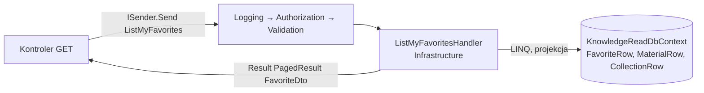

# Przepis 02: endpoint zapytania (odczyt danych)

**Kiedy:** nowy `GET`, który zwraca dane bez zmiany stanu: lista ze stronicowaniem, pojedynczy element, zestawienie.
**Przykład prowadzący:** „moje ulubione” w Knowledge, `GET /v1/me/favorites` (`ListMyFavorites`): stronicowanie, dane
użytkownika, złączenie dwóch read modeli. Warianty: lista z cache (`ListCategories`) i pojedynczy element z błędem 404
(`GetSleepEntry` w SleepDiary).
**Wyjaśnienia:** [06 Warstwa aplikacji](../06-warstwa-aplikacji.md), [07 Dane i EF Core](../07-dane-i-ef-core.md),
[08 API i kontrakty](../08-api-i-kontrakty.md), [11 Cache](../11-cache.md), [15 Dokumentacja w kodzie](../15-dokumentacja-w-kodzie.md),
[przepis 11](11-nowa-experience-i-bff.md) (BFF experience).

Zapytanie powstaje w serwisie domenowym, a moduł widzi je dopiero po wystawieniu w **BFF experience** (krok 7): serwis domenowy
nie ma trasy w bramie (ADR-0038, ADR-0039). Gdy ekran potrzebuje danych z kilku serwisów naraz, zamiast kilku akcji przekazujących
rozważ endpoint komponowany w BFF (wariant C).

Każdy plik poniżej jest pokazany **w całości**, z dokumentacją XML, dokładnie tak, jak jest w repozytorium.

## Zasada

Zapytania **omijają domenę**: bez agregatów i repozytoriów. Handler leży w **Infrastructure**, czyta płaskie read modele
(`*Row`) przez `{Serwis}ReadDbContext` i od razu projektuje je na DTO (ADR-0003, ADR-0026). Application zawiera tylko rekord
zapytania, DTO i ewentualny walidator. Pipeline jest ten sam co dla komend (logowanie, autoryzacja, walidacja), ale **bez
transakcji**.



## Szybki start: `dotnet superapp add usecase --query`

```bash
dotnet superapp add usecase Knowledge Categories GetCategoryStats --query --scope catalog.read   # DTO: CategoryStatsDto (--dto, by zmienić)
```

Tworzy:

- zapytanie, DTO i walidator w Application;
- handler w Infrastructure (ADR-0026);
- akcję `GET get-category-stats` w kontrolerze.

Szkielet się kompiluje; projekcja, parametry, trasa i testy to kroki poniżej. [22 Narzędzie](../22-narzedzie-superapp.md).

## Pliki

```
src/Services/Knowledge/
  Knowledge.Application/Features/Library/ListMyFavorites/ListMyFavorites.cs    zapytanie
  Knowledge.Application/Features/Library/ListMyFavorites/FavoriteDto.cs        DTO wyniku
  Knowledge.Infrastructure/Features/Library/ListMyFavoritesHandler.cs          handler (ReadDbContext)
  Knowledge.Infrastructure/Persistence/Read/Models/FavoriteRow.cs              read model (jeśli nowa tabela)
  Knowledge.Infrastructure/Persistence/Read/Configurations/FavoriteRowConfiguration.cs
  Knowledge.Infrastructure/Persistence/Read/KnowledgeReadDbContext.cs          właściwość IQueryable<FavoriteRow>
  Knowledge.Api/Controllers/LibraryController.cs                               akcja GET
  Knowledge.Api/openapi/Knowledge.Api.json                                     regenerowany przy buildzie
  tests/Knowledge.IntegrationTests/...                                         test na MSSQL
src/Bff/Example.Bff/
  Clients/Knowledge/Generated/KnowledgeApi.cs                                  klient Refitter, regenerowany
  Controllers/Knowledge/KnowledgeLibraryController.cs                          akcja przekazująca
  openapi/Example.Bff_public.json                                              regenerowany przy buildzie BFF
```

Nie zmieniasz: rejestracji DI (handler rejestruje się sam, bo `Add{Serwis}Core` skanuje assembly Infrastructure; klient Refit w
BFF jest już zarejestrowany), migracji (read model mapuje istniejące tabele), konfiguracji bramy (trasa
`/api/example/v{version:int}/{**rest}` obejmuje całe API publiczne BFF).

## Krok 1: zapytanie

`Knowledge.Application/Features/Library/ListMyFavorites/ListMyFavorites.cs` (cały plik):

```csharp
using SuperApp.Framework.Application.Security;
using SuperApp.Framework.Application.Messaging;
using SuperApp.Framework.Application.Pagination;
using SuperApp.Framework.Domain.Results;

namespace Knowledge.Application.Features.Library.ListMyFavorites;

/// <summary>
/// Returns one page of the calling user's favorites (materials and collections together), most recently added first.
/// Requires scope <see cref="KnowledgeScopes.LibraryRead"/>.
/// </summary>
/// <remarks>
/// <para>
/// The user is taken from the token (<c>sub</c>). Only favorites whose item is currently published are returned (and counted in the
/// total); favorites of archived items are removed asynchronously by the Worker, and this filter hides them in the meantime.
/// The handler lives in Infrastructure (<c>ListMyFavoritesHandler</c>, ADR-0026).
/// </para>
/// <para>
/// Paging is lenient instead of validated: a page below 1 is treated as 1 and the page size is clamped to
/// <c>1..</c><see cref="Paging.MaxPageSize"/>.
/// </para>
/// <para>
/// Result: a page of <see cref="FavoriteDto"/>, possibly empty. Possible errors: <c>auth.unauthenticated</c> (403, also when the token
/// has no <c>sub</c> claim), <c>auth.missing_scope</c> (403).
/// </para>
/// </remarks>
/// <example>
/// <code>
/// Result&lt;PagedResult&lt;FavoriteDto&gt;&gt; page = await sender.Send(new ListMyFavorites(Page: 2, PageSize: 50), cancellationToken);
/// </code>
/// </example>
/// <param name="Page">Page number starting at 1; defaults to 1.</param>
/// <param name="PageSize">Requested number of items per page; defaults to 20, clamped to <c>1..</c><see cref="Paging.MaxPageSize"/>.</param>
[RequiresScope(KnowledgeScopes.LibraryRead)]
public sealed record ListMyFavorites(int Page = 1, int PageSize = 20) : IQuery<Result<PagedResult<FavoriteDto>>>;
```

Reguły:

- Nazwa mówi, co zwraca (`Get...`, `List...`); `public sealed record`; `IQuery<Result<T>>` (wynik zawsze w `Result`).
- `[RequiresScope]` z odczytowym scope (`...read`).
- Parametry tylko prymitywne; użytkownika **nie ma** w zapytaniu (handler bierze `sub` z tokenu).
- Lista, która może rosnąć bez ograniczeń: `PagedResult<T>` z `Page` i `PageSize`. Zdecyduj i opisz, czy stronicowanie jest
  łagodne (przycinanie, jak tu) czy walidowane (walidator, jak `ListSleepEntriesValidator` dla zakresu dat).
- Dokumentacja: wynik, filtrowanie (kto co widzi), stronicowanie, kody błędów.

## Krok 2: DTO

`Knowledge.Application/Features/Library/ListMyFavorites/FavoriteDto.cs` (cały plik):

```csharp
using Knowledge.Domain.Library.Favorites;

namespace Knowledge.Application.Features.Library.ListMyFavorites;

/// <summary>
/// One favorite of the calling user; one item of the <see cref="ListMyFavorites"/> result.
/// </summary>
/// <param name="ItemType">Kind of item: <c>Material</c> or <c>Collection</c> (<see cref="FavoriteItemType"/>, serialized as a string).</param>
/// <param name="ItemId">
/// Identifier of the material or collection, depending on <see cref="ItemType"/>; pass it to <c>GetMaterial</c> or <c>GetCollection</c>.
/// </param>
/// <param name="Title">Current title of the material or collection.</param>
/// <param name="AddedAt">Time when the item was added to favorites.</param>
public sealed record FavoriteDto(FavoriteItemType ItemType, Guid ItemId, string Title, DateTimeOffset AddedAt);
```

DTO ma kształt pod ekran/API i tylko prymitywy oraz enumy (w JSON jako nazwy, `JsonStringEnumConverter`). Nigdy encje
domenowe ani read modele `*Row`. Dokumentacja DTO trafia do kontraktu OpenAPI, więc opisuj pola dla konsumenta (jednostki,
formaty, znaczenie `null`).

## Krok 3: read model (tylko gdy tabela nie jest jeszcze zmapowana)

Read model to płaska klasa z właściwościami `init` dla istniejącej tabeli (utworzonej migracją kontekstu zapisu).
`Knowledge.Infrastructure/Persistence/Read/Models/FavoriteRow.cs` (cały plik):

```csharp
namespace Knowledge.Infrastructure.Persistence.Read.Models;

/// <summary>Read model of one row of <c>knowledge.Favorites</c>: a material or collection added to favorites by a user.</summary>
internal sealed class FavoriteRow
{
    /// <summary>Identifier of the favorite (primary key).</summary>
    public Guid Id { get; init; }

    /// <summary>Subject (<c>sub</c> claim) of the user who owns the favorite.</summary>
    public string UserId { get; init; } = string.Empty;

    /// <summary>Kind of the item stored as the enum name: <c>Material</c> or <c>Collection</c>.</summary>
    public string ItemType { get; init; } = string.Empty;

    /// <summary>Identifier of the material or collection; no foreign key, because it may point to either table.</summary>
    public Guid ItemId { get; init; }

    /// <summary>Moment the item was added to favorites.</summary>
    public DateTimeOffset AddedAt { get; init; }
}
```

Konfiguracja, która tylko wskazuje tabelę i klucz (bez migracji: kontekst odczytu nie tworzy schematu),
`Knowledge.Infrastructure/Persistence/Read/Configurations/FavoriteRowConfiguration.cs` (cały plik):

```csharp
using Knowledge.Infrastructure.Persistence.Read.Models;
using Microsoft.EntityFrameworkCore;
using Microsoft.EntityFrameworkCore.Metadata.Builders;

namespace Knowledge.Infrastructure.Persistence.Read.Configurations;

/// <summary>
/// Maps <see cref="FavoriteRow"/> onto the existing table <c>knowledge.Favorites</c> for reading; the key is <c>Id</c>.
/// </summary>
/// <remarks>
/// Read configurations only describe the table and key so that EF Core can query it; they never create schema, because the read context
/// has no migrations. The table itself (columns, constraints, indexes) is defined by the write-side configuration.
/// </remarks>
internal sealed class FavoriteRowConfiguration : IEntityTypeConfiguration<FavoriteRow>
{
    /// <inheritdoc />
    public void Configure(EntityTypeBuilder<FavoriteRow> builder) => builder.ToTable("Favorites").HasKey(row => row.Id);
}
```

i właściwość w `Knowledge.Infrastructure/Persistence/Read/KnowledgeReadDbContext.cs`:

```csharp
    /// <summary>Favorites of all users; always filter by <see cref="FavoriteRow.UserId"/>.</summary>
    internal IQueryable<FavoriteRow> Favorites => Set<FavoriteRow>();
```

Uwagi:

- Read model mapuje **tylko potrzebne kolumny** i używa prymitywów (`string ItemType`, `string UserId`), nie typów domeny.
- Konfiguracje odczytu muszą leżeć w przestrzeni nazw `...Persistence.Read` (lub podrzędnej), inaczej kontekst ich nie zastosuje.
- Zmiana nazwy kolumny po stronie zapisu wymaga zmiany read modelu; inaczej zapytanie wyłoży się w czasie działania
  (test integracyjny to złapie).
- Śledzenie zmian jest wyłączone przy rejestracji kontekstu (`UseQueryTrackingBehavior(NoTracking)`), a `SaveChanges` kontekstu
  odczytu rzuca wyjątek. Nie dodawaj `AsNoTracking()`.

## Krok 4: handler w Infrastructure

`Knowledge.Infrastructure/Features/Library/ListMyFavoritesHandler.cs` (cały plik):

```csharp
using SuperApp.Framework.Application.Messaging;
using SuperApp.Framework.Application.Pagination;
using SuperApp.Framework.Application.Security;
using SuperApp.Framework.Domain.Results;
using Knowledge.Domain.Library.Favorites;
using Knowledge.Application.Features.Library.ListMyFavorites;
using Knowledge.Domain.Common;
using Knowledge.Infrastructure.Persistence.Read;
using Microsoft.EntityFrameworkCore;

namespace Knowledge.Infrastructure.Features.Library;

/// <summary>
/// Handles <see cref="ListMyFavorites"/>: returns a page of the current user's favorites that are still published, most recently added
/// first.
/// </summary>
/// <remarks>
/// <para>
/// Library queries are always scoped to the current user's subject (<see cref="ICurrentUser.Subject"/>); without a subject the handler
/// returns <see cref="AuthorizationErrors.Unauthenticated"/> (<c>auth.unauthenticated</c>).
/// </para>
/// <para>
/// A favorite points either to a material or to a collection (<c>ItemType</c> + <c>ItemId</c>, no foreign key). For each favorite the
/// current title is looked up in the matching table, restricted to published items; favorites whose item is missing, a draft or archived
/// get no title and are filtered out in SQL, so both the page and the total count contain only visible items. This hides archived items
/// immediately, before the worker removes their favorites. The page size is clamped to 1..<see cref="Paging.MaxPageSize"/>.
/// Not cached, because the data is per user.
/// </para>
/// </remarks>
/// <param name="db">Read context of the service.</param>
/// <param name="currentUser">The caller whose favorites are listed.</param>
internal sealed class ListMyFavoritesHandler(KnowledgeReadDbContext db, ICurrentUser currentUser)
    : IQueryHandler<ListMyFavorites, Result<PagedResult<FavoriteDto>>>
{
    private static readonly string Published = nameof(PublicationStatus.Published);
    private static readonly string MaterialItem = nameof(FavoriteItemType.Material);

    /// <inheritdoc />
    public async Task<Result<PagedResult<FavoriteDto>>> Handle(ListMyFavorites query, CancellationToken cancellationToken)
    {
        if (currentUser.Subject is not { } subject)
        {
            return AuthorizationErrors.Unauthenticated;
        }

        var pageSize = Math.Clamp(query.PageSize, 1, Paging.MaxPageSize);
        var favorites =
            from favorite in db.Favorites
            where favorite.UserId == subject
            let title = favorite.ItemType == MaterialItem
                ? db.Materials.Where(material => material.Id == favorite.ItemId && material.Status == Published).Select(material => material.Title).FirstOrDefault()
                : db.Collections.Where(collection => collection.Id == favorite.ItemId && collection.Status == Published).Select(collection => collection.Title).FirstOrDefault()
            where title != null
            select new { favorite.ItemType, favorite.ItemId, Title = title, favorite.AddedAt };

        var total = await favorites.CountAsync(cancellationToken);
        var rows = await favorites
            .OrderByDescending(row => row.AddedAt)
            .ThenBy(row => row.ItemType)
            .ThenBy(row => row.ItemId)
            .Skip(Paging.Skip(query.Page, pageSize))
            .Take(pageSize)
            .ToListAsync(cancellationToken);

        var items = rows.Select(row => new FavoriteDto(Enum.Parse<FavoriteItemType>(row.ItemType), row.ItemId, row.Title, row.AddedAt)).ToList();
        return new PagedResult<FavoriteDto>(items, Math.Max(query.Page, 1), pageSize, total);
    }
}
```

Na co zwrócić uwagę (szczegóły: [07 Dane i EF Core](../07-dane-i-ef-core.md)):

- **`internal sealed`** w `Infrastructure/Features/{Agregat}/{PrzypadekUżycia}Handler.cs`; test architektury pilnuje, że handler
  zapytania nie leży w Application.
- **Filtrowanie po użytkowniku z tokenu** (`currentUser.Subject`) jest pierwszą rzeczą w handlerze danych osobistych. Bez `sub`
  (tożsamość systemowa) → `auth.unauthenticated`.
- **Widoczność to reguła odczytu**: czytelnik widzi tylko opublikowane elementy, a filtr działa w SQL, więc `TotalCount` liczy to
  samo co strona. Gdy widoczność zależy od uprawnień (redaktor widzi szkice), użyj `currentUser.HasScope(KnowledgeScopes.CatalogWrite)`
  jak `GetMaterialHandler`.
- **Stronicowanie**: `Math.Clamp(query.PageSize, 1, Paging.MaxPageSize)`, `Paging.Skip(...)`, w wyniku efektywne wartości
  (`Math.Max(query.Page, 1)`, `pageSize`).
- **Projekcja** (`select new { ... }`) czyta tylko potrzebne kolumny; zamiana na DTO z `Enum.Parse` jest po `ToListAsync`, bo
  EF nie przetłumaczy `Enum.Parse` na SQL.
- **Sortowanie musi być deterministyczne.** Dokumentacja `PagedResult<T>` zaleca sortowanie po znaczniku czasu, a potem po ID;
  inaczej przy równych wartościach elementy mogą się powtarzać albo znikać między stronami. Dodawaj drugi, unikalny klucz:
  `ListMyFavoritesHandler` sortuje po `AddedAt`, a remisy rozstrzyga para `(ItemType, ItemId)`, unikalna dla użytkownika.
- **Bez cache**, bo dane są per użytkownik (cache musiałby mieć użytkownika w kluczu, a każda zmiana ulubionych go unieważniać).

## Krok 5: akcja kontrolera

`Knowledge.Api/Controllers/LibraryController.cs`, atrybuty klasy i akcja `Favorites`:

```csharp
[ApiController]
[Route("v1/me")]
[ProducesErrorResponseType(typeof(void))]
[ProducesResponseType<ValidationProblemDetails>(StatusCodes.Status400BadRequest, MediaTypeNames.Application.ProblemJson)]
[ProducesResponseType(StatusCodes.Status401Unauthorized)]
[ProducesResponseType<ProblemDetails>(StatusCodes.Status403Forbidden, MediaTypeNames.Application.ProblemJson)]
public sealed class LibraryController(ISender sender) : ControllerBase
{
    /// <summary>Returns a page of the caller's favorites, most recently added first.</summary>
    /// <remarks>
    /// Required scope: <c>knowledge.library.read</c>. Only items that are still published are returned: favorites pointing to a material
    /// or collection that has since been archived are hidden (and are removed in the background shortly after archiving). The total
    /// count also counts only visible items.
    /// </remarks>
    /// <param name="cancellationToken">Cancellation of the HTTP request.</param>
    /// <param name="page">Page number starting at 1; values lower than 1 are treated as 1.</param>
    /// <param name="pageSize">Page size, 20 by default, clamped to the range 1–100.</param>
    /// <returns>A page of favorites (item type and identifier, current title, date added) with the total count.</returns>
    /// <response code="200">The requested page (possibly empty).</response>
    /// <response code="400">
    /// A query parameter has an invalid format (<c>page</c> or <c>pageSize</c> is not an integer); rejected by the framework with a validation problem without <c>code</c>.
    /// </response>
    /// <response code="401">Missing, expired or invalid access token.</response>
    /// <response code="403">
    /// The token lacks the scope <c>knowledge.library.read</c> (<c>auth.missing_scope</c>) or has no user identifier
    /// (<c>auth.unauthenticated</c>).
    /// </response>
    [HttpGet("favorites")]
    [ProducesResponseType<PagedResult<FavoriteDto>>(StatusCodes.Status200OK, MediaTypeNames.Application.Json)]
    public async Task<IActionResult> Favorites(CancellationToken cancellationToken, [FromQuery] int page = 1, [FromQuery] int pageSize = 20) =>
        this.ToActionResult(await sender.Send(new ListMyFavorites(page, pageSize), cancellationToken));

    // ...
}
```

- `ToActionResult(Result<T>)`: sukces → 200 z wartością jako ciałem, błąd → `ProblemDetails`.
- `[ProducesResponseType<T>(200, ...)]` z typem DTO, inaczej kontrakt nie ma schematu odpowiedzi.
- Parametry z wartościami domyślnymi muszą być po `CancellationToken` (C#), stąd ich kolejność. Opisz w `<response code="400">`,
  że zły format parametru odrzuca framework (`request.malformed` z nazwą parametru w `errors`, ADR-0044).

## Wariant A: lista z cache (`ListCategories`)

Dla danych czytanych często i zmienianych rzadko, wspólnych dla wszystkich użytkowników.
`Knowledge.Infrastructure/Features/Categories/ListCategoriesHandler.cs` (cały plik):

```csharp
using SuperApp.Framework.Application.Messaging;
using SuperApp.Framework.Domain.Results;
using Knowledge.Infrastructure.Caching;
using Knowledge.Infrastructure.Persistence.Read.Models;
using SuperApp.Framework.Infrastructure.Caching;
using Knowledge.Application.Features.Categories.ListCategories;
using Knowledge.Infrastructure.Persistence.Read;
using Microsoft.EntityFrameworkCore;

namespace Knowledge.Infrastructure.Features.Categories;

/// <summary>
/// Handles <see cref="ListCategories"/>: returns all categories ordered by name, served from the fail-safe cache.
/// </summary>
/// <remarks>
/// The whole list is cached under <see cref="KnowledgeCache.CategoriesKey"/> with the settings <see cref="KnowledgeCache.Categories"/> and
/// invalidated by <see cref="CategoryCacheInvalidation"/> after a command that created or renamed a category commits. The query reads the flat
/// <see cref="CategoryRow"/> read model through <see cref="KnowledgeReadDbContext"/>, never the <c>Category</c> aggregate (ADR-0026).
/// Always succeeds; a database error with no cached value to fall back on is thrown as an exception.
/// </remarks>
/// <param name="db">Read context of the service.</param>
/// <param name="cache">Fail-safe cache of the service.</param>
internal sealed class ListCategoriesHandler(KnowledgeReadDbContext db, FailSafeCache cache)
    : IQueryHandler<ListCategories, Result<IReadOnlyList<CategoryDto>>>
{
    /// <inheritdoc />
    public async Task<Result<IReadOnlyList<CategoryDto>>> Handle(ListCategories query, CancellationToken cancellationToken)
    {
        var categories = await cache.GetOrCreateAsync(
            KnowledgeCache.CategoriesKey,
            async token => (IReadOnlyList<CategoryDto>)await db.Categories
                .OrderBy(category => category.Name)
                .Select(category => new CategoryDto(category.Id, category.Name, category.Slug))
                .ToListAsync(token),
            KnowledgeCache.Categories,
            [KnowledgeCache.CategoriesTag],
            cancellationToken);

        return Result<IReadOnlyList<CategoryDto>>.Success(categories);
    }
}
```

Elementy, które musisz dodać razem z cache (szczegóły: [11 Cache](../11-cache.md), [przepis 05](05-zdarzenia-i-cache.md)):

1. Klucz z wersją, tag i ustawienia świeżości w `Knowledge.Infrastructure/Caching/KnowledgeCache.cs`
   (`CategoriesKey = "knowledge:categories:v1"`, `CategoriesTag = "knowledge:categories"`,
   `Categories = new(Fresh: TimeSpan.FromMinutes(5), MaxStale: TimeSpan.FromHours(1))`). Wersję w kluczu podbijasz przy każdej
   zmianie kształtu DTO.
2. Zdarzenie domenowe zgłaszane przy każdej zmianie danych (`CategoryChanged` w `Category.Create` i `Category.Rename`).
3. Handler zdarzenia w Infrastructure, który unieważnia tag **po commicie** (`CategoryCacheInvalidation` z `IUnitOfWork.OnCommitted`).

Nie cache'uj danych zależnych od użytkownika bez użytkownika w kluczu i nigdy nie czytaj cache po stronie zapisu.
Gdy widoczność zależy od uprawnień, cache'uj tylko widok wspólny (jak `GetMaterialHandler`: redaktor czyta z bazy, czytelnik z cache).

## Wariant B: pojedynczy element, 404 (`GetSleepEntry`)

Zapytanie (`SleepDiary.Application/Features/Entries/GetSleepEntry/GetSleepEntry.cs`, cały plik):

```csharp
using SuperApp.Framework.Application.Security;
using SuperApp.Framework.Application.Messaging;
using SuperApp.Framework.Domain.Results;

namespace SleepDiary.Application.Features.Entries.GetSleepEntry;

/// <summary>
/// Query: returns the current user's sleep diary entry for the given day.
/// </summary>
/// <remarks>
/// <para>
/// Requires the scope <see cref="SleepDiaryScopes.EntryRead"/>. The handler lives in Infrastructure (<c>GetSleepEntryHandler</c>, ADR-0026)
/// and reads the read model directly, always filtered by the caller's <c>sub</c>; entries of other users are indistinguishable from
/// missing ones.
/// </para>
/// <para>
/// Result: <see cref="SleepEntryDto"/>, or <see cref="Domain.Entries.SleepEntryErrors.NotFound"/> (<c>sleepdiary.entry.not_found</c>, HTTP 404)
/// when the user has no entry for that day, plus the pipeline errors <c>auth.missing_scope</c> and <c>auth.unauthenticated</c> (HTTP 403).
/// </para>
/// </remarks>
/// <example>
/// <code>
/// var result = await sender.Send(new GetSleepEntry(new DateOnly(2026, 9, 30)), cancellationToken);
/// </code>
/// </example>
/// <param name="Date">Date of the entry: the day the user woke up.</param>
[RequiresScope(SleepDiaryScopes.EntryRead)]
public sealed record GetSleepEntry(DateOnly Date) : IQuery<Result<SleepEntryDto>>;
```

Handler (`SleepDiary.Infrastructure/Features/Entries/GetSleepEntryHandler.cs`, cały plik):

```csharp
using SuperApp.Framework.Application.Messaging;
using SuperApp.Framework.Application.Security;
using SuperApp.Framework.Domain.Results;
using Microsoft.EntityFrameworkCore;
using SleepDiary.Application.Features.Entries.GetSleepEntry;
using SleepDiary.Domain.Entries;
using SleepDiary.Infrastructure.Persistence.Read;

namespace SleepDiary.Infrastructure.Features.Entries;

/// <summary>
/// Handles <see cref="GetSleepEntry"/> on the read side: loads the current user's entry for the day from the read model (ADR-0026).
/// </summary>
/// <remarks>
/// Always filters by the caller's <c>sub</c> (ADR-0029), so another user's entry for the same day is reported as not found. No cache is used:
/// the data is per user and changes with every edit.
/// </remarks>
/// <param name="db">Read-only, non-tracking context of the service.</param>
/// <param name="currentUser">The caller; supplies the owner filter.</param>
internal sealed class GetSleepEntryHandler(SleepDiaryReadDbContext db, ICurrentUser currentUser)
    : IQueryHandler<GetSleepEntry, Result<SleepEntryDto>>
{
    /// <inheritdoc />
    /// <returns>
    /// The entry; <see cref="SleepEntryErrors.NotFound"/> (<c>sleepdiary.entry.not_found</c>) when the caller has no entry for the day;
    /// <see cref="AuthorizationErrors.Unauthenticated"/> (<c>auth.unauthenticated</c>) when the caller has no subject.
    /// </returns>
    public async Task<Result<SleepEntryDto>> Handle(GetSleepEntry query, CancellationToken cancellationToken)
    {
        if (currentUser.Subject is not { } subject)
        {
            return AuthorizationErrors.Unauthenticated;
        }

        var row = await db.Entries.FirstOrDefaultAsync(entry => entry.UserId == subject && entry.Date == query.Date, cancellationToken);
        return row is null ? SleepEntryErrors.NotFound : EntryMapping.ToDto(row);
    }
}
```

- Brak elementu (albo element, którego wywołujący nie może zobaczyć) to błąd `NotFound` z katalogu błędów agregatu, nie `null`
  w odpowiedzi 200. Handler zapytania może używać błędów z Domain.
- Mapowanie `*Row` → DTO wspólne dla kilku handlerów wydziel do `internal static` klasy (`EntryMapping.ToDto`).
- Akcja: `[HttpGet("{date}")]` z `[ProducesResponseType<SleepEntryDto>(200, ...)]` i `[ProducesResponseType<ProblemDetails>(404, ...)]`.

## Krok 6: testy

Handler zapytania testuje się **integracyjnie** (MSSQL w Testcontainers): logika zapytania to SQL, a mock `DbContext` niczego by
nie sprawdził (ADR-0026). Dane tworzysz komendami przez `fixture.SendAsync`, potem wysyłasz zapytanie. Fragment z
`Knowledge.IntegrationTests/KnowledgeFlowTests.cs` (klasa ma `[Collection(PipelineCollection.Name)]`):

```csharp
[Fact]
public async Task Library_tracks_favorites_and_completions_and_archiving_cleans_favorites()
{
    Act(KnowledgeScopes.CatalogWrite);
    var materialId = await CreatePublishedMaterialAsync();

    Act(KnowledgeScopes.LibraryWrite, KnowledgeScopes.LibraryRead);
    Assert.True((await fixture.SendAsync(new AddFavorite(FavoriteItemType.Material, materialId))).IsSuccess);
    Assert.True((await fixture.SendAsync(new AddFavorite(FavoriteItemType.Material, materialId))).IsSuccess);
    Assert.True((await fixture.SendAsync(new MarkMaterialCompleted(materialId))).IsSuccess);

    var favorites = await fixture.SendAsync(new ListMyFavorites());
    var completions = await fixture.SendAsync(new ListMyCompletedMaterials());
    Assert.Single(favorites.Value.Items, item => item.ItemId == materialId);
    Assert.Single(completions.Value.Items, item => item.MaterialId == materialId);

    Act(KnowledgeScopes.CatalogWrite);
    Assert.True((await fixture.SendAsync(new ArchiveMaterial(materialId))).IsSuccess);
    Assert.Contains(fixture.Publisher.Published, message => message is MaterialArchivedV1 archived && archived.MaterialId == materialId);

    // The MaterialArchivedV1 consumer in the Worker sends this command (ADR-0028).
    Assert.True((await fixture.SendAsync(new RemoveFavoritesOfItem(FavoriteItemType.Material, materialId))).IsSuccess);
    Act(KnowledgeScopes.LibraryRead);
    Assert.DoesNotContain(ResultAssert.Success(await fixture.SendAsync(new ListMyFavorites())).Items, item => item.ItemId == materialId);
}
```

Co sprawdzić dla własnego zapytania:

| Przypadek | Przykład z repozytorium |
|---|---|
| wynik i projekcja pól | `KnowledgeFlowTests` |
| widoczność (czytelnik vs redaktor, tylko opublikowane, `TotalCount` zgodny ze stroną) | `ReaderVisibilityTests` |
| dane innego użytkownika niewidoczne | zmień `fixture.CurrentUser.Subject` (wzór w `ReaderVisibilityTests`) |
| brak elementu → `NotFound` | `SleepDiaryFlowTests` (`GetSleepEntry` po usunięciu) |
| cache unieważniany po zmianie | `CacheInvalidationTests` |
| walidator zapytania | `ListSleepEntriesValidatorTests` (test jednostkowy) |

## Krok 7: wystaw zapytanie w BFF experience

Kroki są takie same jak dla komendy ([przepis 01, krok 9](01-endpoint-komendy.md)): zbuduj serwis (kontrakt z `operationId`
`Library_Favorites`), zregeneruj klienta Refitter w BFF, dopisz akcję wzorem sąsiednich, zbuduj BFF i sprawdź diff kontraktu
publicznego.

```bash
dotnet tool restore
dotnet refitter --settings-file src/Bff/Example.Bff/Clients/Knowledge/knowledge.refitter
```

`src/Bff/Example.Bff/Controllers/Knowledge/KnowledgeLibraryController.cs`, akcja `Favorites`:

```csharp
    /// <summary>Returns a page of the caller's favorites, most recently added first.</summary>
    /// <remarks>
    /// Required scope: <c>knowledge.library.read</c>. Only items that are still published are returned: favorites pointing to a material
    /// or collection that has since been archived are hidden (and are removed in the background shortly after archiving). The total
    /// count also counts only visible items.
    /// </remarks>
    /// <param name="cancellationToken">Cancellation of the HTTP request.</param>
    /// <param name="page">Page number starting at 1; values lower than 1 are treated as 1.</param>
    /// <param name="pageSize">Page size, 20 by default, clamped to the range 1–100.</param>
    /// <returns>The service's answer, relayed unchanged.</returns>
    /// <response code="200">The requested page (possibly empty).</response>
    /// <response code="400">
    /// A query parameter has an invalid format (<c>page</c> or <c>pageSize</c> is not an integer); rejected by the framework with a validation problem without <c>code</c>.
    /// </response>
    /// <response code="401">Missing, expired or invalid access token.</response>
    /// <response code="403">
    /// The token lacks the scope <c>knowledge.library.read</c> (<c>auth.missing_scope</c>) or has no user identifier
    /// (<c>auth.unauthenticated</c>).
    /// </response>
    [HttpGet("v1/knowledge/me/favorites")]
    [ProducesResponseType<PagedResultOfFavoriteDto>(StatusCodes.Status200OK, MediaTypeNames.Application.Json)]
    [ProducesResponseType<Microsoft.AspNetCore.Mvc.ValidationProblemDetails>(StatusCodes.Status400BadRequest, MediaTypeNames.Application.ProblemJson)]
    [ProducesResponseType(StatusCodes.Status401Unauthorized)]
    [ProducesResponseType<Microsoft.AspNetCore.Mvc.ProblemDetails>(StatusCodes.Status403Forbidden, MediaTypeNames.Application.ProblemJson)]
    public async Task<IActionResult> Favorites([FromQuery] int? page, [FromQuery] int? pageSize, CancellationToken cancellationToken) =>
        this.ToActionResult(await knowledge.LibraryFavoritesAsync(page, pageSize, cancellationToken));
```

Na co uważać w akcji zapytania:

- Parametry query są w wygenerowanym kliencie opcjonalne (`int?`). BFF przyjmuje je tak samo i przekazuje dalej; brak wartości
  oznacza brak parametru w wywołaniu serwisu, więc obowiązują jego wartości domyślne (`page` 1, `pageSize` 20). Nie powtarzaj w BFF
  wartości domyślnych ani przycinania: należą do serwisu.
- Typ odpowiedzi to typ wygenerowany z kontraktu serwisu (`PagedResultOfFavoriteDto`). W kontrakcie BFF schematy typów serwisu
  dostają prefiks serwisu (`KnowledgeFavoriteDto`), żeby nie zderzyły się z typami innego serwisu (`BffOpenApiDocuments`).
- Daty w ścieżce i query (`DateOnly` w SleepDiary) klient wysyła w formacie ISO 8601 niezależnie od kultury procesu
  (`DownstreamUrlParameterFormatter`, rejestrowany przez `AddDownstreamApi`).

### Wariant C: endpoint komponowany z kilku serwisów

Gdy ekran modułu potrzebuje danych z kilku serwisów, BFF składa je w jednym endpoincie z własnym DTO. Wzorzec:
`ExperienceSummaryController` (`GET /v1/me/summary`) uruchamia części odpowiedzi równolegle przez `PartialResponseFetcher.FetchAsync`, z limitem 2 s na
część odpowiedzi. Odpowiedź ma zawsze status 200, a każda część odpowiedzi własny `status` (`Ok`, `Forbidden`, `Unavailable`, `Timeout`) i `data` tylko
przy `Ok` (częściowe renderowanie, ADR-0038). DTO endpointu komponowanego leżą w BFF (`Summary/`) i są jego kontraktem; nie
zawierają logiki biznesowej, tylko kształt danych dla ekranu. Testy: `PartialResponseFetcherTests` w `Example.Bff.Tests`.

## Krok 8: weryfikacja

```bash
dotnet build SuperApp.slnx                                                              # regeneruje kontrakty serwisu i BFF
dotnet test --project src/Services/Knowledge/tests/Knowledge.IntegrationTests     # wymaga Dockera
dotnet test --project src/Bff/Example.Bff.Tests
dotnet test --solution SuperApp.slnx
git diff src/Services/Knowledge/Knowledge.Api/openapi/ src/Bff/Example.Bff/openapi/
```

W diffie kontraktu: operacja `GET` ze schematem odpowiedzi 200 (DTO z opisami pól), parametry query z opisami, statusy 400/401/403
(i 404 dla pojedynczego elementu).

Ręcznie (token czytelnika, [01 Start](../01-start.md#14-pierwsze-żądania)). Port serwisu (5101) służy tylko do debugowania;
moduł woła BFF przez bramę.

```bash
TOKEN=$(curl -s http://localhost:8081/realms/superapp/protocol/openid-connect/token \
  -d grant_type=password -d client_id=dev-cli -d username=reader -d password=reader \
  -d "scope=openid knowledge.catalog.read knowledge.library.read knowledge.library.write" | jq -r .access_token)

curl -s "http://localhost:5101/v1/me/favorites?page=1&pageSize=2" -H "Authorization: Bearer $TOKEN"
```

```json
{
  "items": [
    { "itemType": "Material", "itemId": "0192a3c4-5d6e-7f80-9a1b-2c3d4e5f6a7b", "title": "Higiena snu", "addedAt": "2026-09-30T12:00:00+00:00" }
  ],
  "page": 1,
  "pageSize": 2,
  "totalCount": 1
}
```

```bash
curl -s "http://localhost:5101/v1/me/favorites?pageSize=500" -H "Authorization: Bearer $TOKEN" | jq .pageSize
# 100  (przycięte do Paging.MaxPageSize)
```

To samo przez BFF (bezpośrednio na port 5120 albo przez bramę, jak moduł):

```bash
curl -s "http://localhost:5120/v1/knowledge/me/favorites?page=1&pageSize=2" -H "Authorization: Bearer $TOKEN"
# ta sama odpowiedź co z serwisu
```

Przez bramę: `GET https://localhost:5001/api/example/v1/knowledge/me/favorites?page=1&pageSize=2` (przeglądarka z sesją,
nagłówek `X-CSRF: 1`) albo `https://localhost:5002/api/example/v1/knowledge/me/favorites` z tokenem (`gateway-mobile`).

Na koniec [checklista przed pull requestem](../18-checklista.md).

## Typowe błędy

| Objaw | Przyczyna | Naprawa |
|---|---|---|
| Wyjątek o braku handlera dla zapytania | handler w Application albo w assembly, którego `Add{Serwis}Core` nie skanuje | handler w `{Serwis}.Infrastructure/Features/...` |
| Test architektury: handler zapytania poza Infrastructure | handler w Application | przenieś do Infrastructure |
| `SqlException` „Invalid object name” / „Invalid column name” przy wykonaniu zapytania | read model niezgodny z tabelą po migracji albo konfiguracja poza `...Persistence.Read` | popraw `*Row` / `*RowConfiguration` |
| `Enum.Parse` nie da się przetłumaczyć na SQL | konwersja wewnątrz zapytania LINQ | projekcja do typu anonimowego, konwersja po `ToListAsync` |
| Elementy powtarzają się między stronami | sortowanie niedeterministyczne | dodaj drugi, unikalny klucz sortowania |
| `TotalCount` większy niż liczba widocznych elementów | filtr widoczności po stronie C# zamiast w SQL | filtr w zapytaniu przed `CountAsync` |
| Czytelnik widzi szkice albo cudze dane | brak filtra statusu / `UserId == subject` | filtr w handlerze; test widoczności |
| Dane z cache nieaktualne po zmianie | brak zdarzenia albo unieważnienia po commicie | [przepis 05](05-zdarzenia-i-cache.md) |
| Zapytanie zwraca encje domenowe | handler używa repozytorium albo `WriteDbContext` | tylko `ReadDbContext` i DTO |
| 200 z `null` zamiast 404 | handler zwraca `null` jako wartość | `return XxxErrors.NotFound;` |
| 404 z bramy, a bezpośrednio na 5101 działa | zapytanie nie jest wystawione w BFF | krok 7: klient Refitter, akcja w kontrolerze BFF |
| 504 `downstream.timeout` z BFF | zapytanie serwisu trwa dłużej niż limit odporności klienta | zoptymalizuj zapytanie (indeks, projekcja); nie podnoś limitów bez uzasadnienia |
