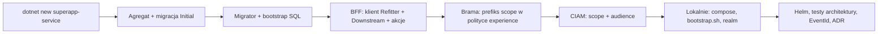

# Przepis 07: nowy serwis (nowy bounded context)

**Kiedy:** po [wyborze kontekstu](../04-wybor-kontekstu.md) wyszło, że to nowy obszar biznesowy z własnym językiem, danymi
i rytmem zmian. Nowy serwis ma koszt (pipeline, wdrożenie, schemat, klient w CIAM), więc to decyzja zapisywana w ADR.

Serwis domenowy należy do **jednej experience** (ADR-0038). Nie dostaje trasy w bramie: woła go wyłącznie BFF tej experience
(i jej inne serwisy), a moduł widzi jego operacje tylko przez API publiczne BFF (ADR-0039, ADR-0041). Ten przepis dodaje serwis do
istniejącej experience `example`; nowa experience z własnym BFF to [przepis 11](11-nowa-experience-i-bff.md).

**Przykład w całym przepisie:** serwis `Billing`, schemat `billing`, scope `billing.invoice.read` / `billing.invoice.write`,
porty lokalne 5103 (API) i 5113 (Worker), zakres `EventId` 7000–7999.

## Szybka droga: `dotnet superapp add service`

Wszystkie rejestracje z kroków 1, 3, 4, 6–8 (poza ADR i opisami w dokumentacji) robi jedno polecenie narzędzia
([22 Narzędzie `dotnet superapp`](../22-narzedzie-superapp.md), ADR-0046):

```bash
dotnet superapp add service Billing --experience example --scope invoice.read invoice.write --dry-run   # plan bez zmian
dotnet superapp add service Billing --experience example --scope invoice.read invoice.write
```

Polecenie:

- generuje projekty z szablonu z wolnymi portami (tu 5103/5113);
- dodaje je do `SuperApp.slnx` i generuje `SuperApp.sln`;
- rejestruje kontekst w Migratorze i schemat w bootstrapie SQL;
- dopisuje stałe scope do `BillingScopes` (z `TODO` w opisie);
- tworzy klientów i scope w lokalnym realmie, kontenery w compose i scope w `bff-web`;
- tworzy `values-billing.yaml`, dopisuje prefiks scope w polityce bramy i referencje w testach architektury;
- przydziela zakres EventId.

Jest idempotentne: ponowne uruchomienie dokańcza przerwane dodawanie i niczego nie dubluje.

Zostaje praca, której narzędzie nie wykona:

- pierwszy agregat i migracja `Initial` (krok 2);
- klient w BFF: po buildzie serwisu `dotnet superapp add client --bff example --service Billing`, potem akcje kontrolerów (krok 5);
- ADR kontekstu i tabele w dokumentacji (krok 8);
- przekazanie wymagań działom CIAM i infrastruktury (krok 6).

Kroki poniżej opisują, co robi narzędzie, i są instrukcją, gdy robisz to ręcznie. Usunięcie serwisu:
`dotnet superapp remove service Billing --yes`. Narzędzie odmawia, dopóki BFF ma klienta serwisu, i nie zmienia bazy: wypisuje
kroki dla DBA.

## Przegląd



## 1. Wygeneruj projekty z szablonu (ADR-0030)

```bash
dotnet new install ./src/Tools/SuperApp.Cli/Templates/superapp-service
dotnet new superapp-service -n Billing -o src/Services/Billing

# dodaj projekty do solucji
for s in SuperApp.slnx SuperApp.sln; do find src/Services/Billing -name "*.csproj" -exec dotnet sln $s add {} +; done      # bash
# PowerShell: 'SuperApp.slnx','SuperApp.sln' | % { $s = $_; Get-ChildItem src/Services/Billing -Recurse -Filter *.csproj | % { dotnet sln $s add $_.FullName } }
```

Szablon tworzy (nazwa `ServiceName` zamieniona na `Billing`, `servicename` na `billing`):

| Projekt | Zawartość startowa |
|---|---|
| `Billing.Domain` | znacznik zestawu `BillingDomain` (konteksty EF szukają w nim silnych ID i VO) |
| `Billing.Application` | `BillingApplication` (skanowanie handlerów), `BillingScopes` z prefiksem `billing.` |
| `Billing.Infrastructure` | `BillingWriteDbContext` (schemat `billing`), `BillingReadDbContext`, fabryka design-time, composition root `AddBillingInfrastructure` / `AddBillingCore` |
| `Billing.Api` | `Program.cs` jak w innych serwisach, `BillingControllerBase` z metadanymi 401/403, Dockerfile, `appsettings.Development.json`, `launchSettings.json` (port 5190) |
| `Billing.Worker` | `Program.cs` z dostarczaniem outboxa, katalog `Consumers/`, Dockerfile, ustawienia Development (port 5191) |
| `Billing.Contracts` | pusty projekt zdarzeń integracyjnych |
| `tests/*` | testy domeny, Application (fake'i) i integracyjne (fixture z Testcontainers) |

Zmień porty w `Properties/launchSettings.json` na wolne i spójne z compose (tu 5103 i 5113).

## 2. Pierwszy agregat i migracja `Initial`

Dodaj pierwszy agregat według [przepisu 03](03-nowy-zbior-danych.md), potem:

```bash
dotnet build SuperApp.slnx
dotnet ef migrations add Initial \
  -p src/Services/Billing/Billing.Infrastructure -s src/Services/Billing/Billing.Infrastructure \
  --context BillingWriteDbContext -o Migrations
# zmień nazwę {data}_Initial.cs → Initial.cs (konwencja ADR-0032); .Designer.cs zostaje
```

Migracja `Initial` tworzy tabele agregatów oraz tabele outboxa i inboxa MassTransit w schemacie `billing`. Bez niej testy
integracyjne szablonu kończą się czytelnym komunikatem z poleceniem do uruchomienia.

## 3. Migrator

`src/Migrator/SuperApp.Migrator/Program.cs` (dodaj obok istniejących):

```csharp
builder.Services.AddDbContext<BillingWriteDbContext>(options =>
    MigrationOptions.Configure(options, connectionString, BillingWriteDbContext.SchemaName));

Type[] contexts = [typeof(GatewayDbContext), typeof(KnowledgeWriteDbContext), typeof(SleepDiaryWriteDbContext), typeof(BillingWriteDbContext)];
```

oraz referencję projektu `Billing.Infrastructure` w `SuperApp.Migrator.csproj`.

## 4. Bootstrap bazy

`deploy/sql/01-bootstrap.sql` (skrypt DBA, tworzy schemat, rolę `billing_role` i użytkownika `billing_app`):

```sql
INSERT INTO @Services ([Schema]) VALUES
    (N'gateway'),
    (N'knowledge'),
    (N'sleepdiary'),
    (N'billing');
```

`deploy/local/db/bootstrap.sh` (lokalnie zakłada loginy):

```bash
for login in superapp_migrator gateway_app knowledge_app sleepdiary_app billing_app; do
```

## 5. BFF experience: klient serwisu (bez trasy w bramie)

Serwis nie dostaje trasy w bramie ani migracji bramy. Zamiast tego BFF experience dostaje klienta serwisu
(wzór: `Knowledge` i `SleepDiary` w `src/Bff/Example.Bff`).

1. **Kontrakt serwisu.** `dotnet build SuperApp.slnx` generuje `src/Services/Billing/Billing.Api/openapi/Billing.Api.json` (z `operationId`,
   `securitySchemes` Bearer i `x-abstract` z transformerów `SuperApp.Framework`). Commituj go: z niego powstaje klient w BFF.
2. **Plik ustawień Refittera** `src/Bff/Example.Bff/Clients/Billing/billing.refitter` (kopia `knowledge.refitter` z inną ścieżką,
   przestrzenią nazw i nazwą interfejsu):

   ```json
   {
     "openApiPath": "../../../../Services/Billing/Billing.Api/openapi/Billing.Api.json",
     "namespace": "Example.Bff.Clients.Billing",
     "naming": { "useOpenApiTitle": false, "interfaceName": "BillingApi" },
     "outputFolder": "./Generated",
     "outputFilename": "BillingApi.cs",
     "useCancellationTokens": true,
     "returnIApiResponse": true,
     "typeAccessibility": "Public",
     "usePolymorphicSerialization": true,
     "generateOperationHeaders": false,
     "operationNameTemplate": "{operationName}Async",
     "operationNameGenerator": "SingleClientFromOperationId",
     "codeGeneratorSettings": { "dateType": "System.DateOnly", "dateTimeType": "System.DateTimeOffset", "timeType": "System.TimeOnly" }
   }
   ```

   ```bash
   dotnet tool restore
   dotnet refitter --settings-file src/Bff/Example.Bff/Clients/Billing/billing.refitter   # → Clients/Billing/Generated/BillingApi.cs
   ```

3. **Rejestracja** w `src/Bff/Example.Bff/Program.cs`, obok istniejących klientów:

   ```csharp
   builder.Services.AddDownstreamApi<IBillingApi>(builder.Configuration, "Billing").AddUserTokenForwarding();
   ```

   `AddDownstreamApi` czyta adres z `Downstream:Billing:BaseAddress` i zatrzymuje start, gdy go brakuje. Adres ustaw w czterech
   miejscach:

   | Plik | Wartość |
   |---|---|
   | `src/Bff/Example.Bff/appsettings.json` | `"Billing": { "BaseAddress": "http://billing-api.billing.svc.cluster.local:8080" }` |
   | `src/Bff/Example.Bff/appsettings.Development.json` | `"Billing": { "BaseAddress": "http://localhost:5103" }` (BFF z IDE) |
   | `deploy/local/docker-compose.yml`, usługa `example-bff` | `Downstream__Billing__BaseAddress: http://billing-api.billing.svc.cluster.local:8080` i `billing-api` w `depends_on` |
   | `deploy/helm/superapp-bff/values-example.yaml` | `downstream.Billing: http://billing-api.billing.svc.cluster.local:8080` |

4. **Akcje w BFF.** Operacje, których potrzebuje moduł, wystawiasz w kontrolerach `Controllers/Billing/Billing{Zasób}Controller.cs`
   pod ścieżkami `/v1/billing/...`, wzorem istniejących ([przepis 01, krok 9](01-endpoint-komendy.md)). Build BFF regeneruje
   `openapi/Example.Bff_public.json`.
5. **Polityka experience w bramie.** Brama wpuszcza do BFF tylko tokeny z co najmniej jednym scope serwisów experience
   (`GatewayPolicies.Example` w `src/Gateway/SuperApp.Gateway/Security/GatewayPolicies.cs`). Dopisz prefiks nowego serwisu:

   ```csharp
   authorization.AddPolicy(Example, policy => policy.RequireAuthenticatedUser()
       .RequireAssertion(context => HasScopeOf(context.User, "knowledge.") || HasScopeOf(context.User, "sleepdiary.")
                                    || HasScopeOf(context.User, "billing.")));
   ```

   To zmiana kodu bramy, bez migracji: trasa `/api/example/v{version:int}/{**rest}` się nie zmienia. Na środowiskach odpowiada jej
   wymaganie wobec wspólnej bramy (ADR-0037).

Testy architektury pilnują kierunku zależności: BFF nie referuje projektów serwisu (nawet `Billing.Contracts`), a serwis nie referuje
BFF (reguły 12 i 14). BFF zna serwis wyłącznie przez wygenerowanego klienta.

## 6. CIAM

Lokalnie, w `deploy/local/keycloak/realm-superapp.json` (wzór: istniejące `sleepdiary.*`):

- client scope `billing.invoice.read` i `billing.invoice.write` z mapperem `oidc-audience-mapper` (`included.custom.audience: billing-api`),
- klient `billing-api` (resource server, definiuje audience),
- scope dodane do `optionalClientScopes` klientów `bff-web`, `mobile-*` i `dev-cli`.

Audience BFF (`example-bff`) daje już domyślny client scope `example-bff-audience` tych klientów; token przekazywany przez BFF ma
więc audience zarówno BFF, jak i `billing-api` (ADR-0012, ADR-0040).

Realm jest importowany przy starcie kontenera Keycloaka (bez wolumenu), więc po zmianie pliku wystarczy
`docker compose -f deploy/local/docker-compose.yml up -d --force-recreate keycloak`. Nie używaj `down -v`: usuwa też dane MSSQL.

Brama (profil `bff-web`) musi żądać nowych scope: `src/Gateway/SuperApp.Gateway/Properties/launchSettings.json` (profil `bff-web`),
`deploy/local/docker-compose.yml` (`Authentication__Scopes__N` usługi `bff-web`) i `deploy/helm/superapp-gateway/values-bff-web.yaml`.

Na środowiskach dev/test/prod: zgłoszenie do działu CIAM (klient API, scope, audience, którym klientom i rolom) (ADR-0016).

## 7. Lokalne środowisko

`deploy/local/docker-compose.yml` (wzór: `sleepdiary-api`, `sleepdiary-worker`):

```yaml
  billing-api:
    profiles: [app]
    build:
      context: ../..
      dockerfile: src/Services/Billing/Billing.Api/Dockerfile
    environment:
      <<: *service-env
      ConnectionStrings__Write: "Server=mssql,1433;Database=SuperApp;User Id=billing_app;Password=${DB_APP_PASSWORD:-Dev!Passw0rd1};TrustServerCertificate=True"
      ConnectionStrings__Read: "Server=mssql,1433;Database=SuperApp;User Id=billing_app;Password=${DB_APP_PASSWORD:-Dev!Passw0rd1};TrustServerCertificate=True"
    ports:
      - "5103:8080"
    networks:
      default:
        aliases: [billing-api.billing.svc.cluster.local]
    depends_on: *service-deps

  billing-worker:
    profiles: [app]
    build:
      context: ../..
      dockerfile: src/Services/Billing/Billing.Worker/Dockerfile
    environment:
      <<: *service-env
      ConnectionStrings__Write: "Server=mssql,1433;Database=SuperApp;User Id=billing_app;Password=${DB_APP_PASSWORD:-Dev!Passw0rd1};TrustServerCertificate=True"
      ConnectionStrings__Read: "Server=mssql,1433;Database=SuperApp;User Id=billing_app;Password=${DB_APP_PASSWORD:-Dev!Passw0rd1};TrustServerCertificate=True"
    depends_on: *service-deps
```

Alias sieciowy równy adresowi z klastra sprawia, że adres `Downstream__Billing__BaseAddress` kontenera `example-bff` działa
lokalnie bez zmian. Compose nie odwzorowuje NetworkPolicy: lokalnie serwis jest osiągalny także bezpośrednio (port 5103), ale
tylko do debugowania.

## 8. Wdrożenie, testy architektury, logowanie, dokumentacja

| Miejsce | Zmiana |
|---|---|
| `deploy/helm/superapp-service/values-billing.yaml` | `service: billing`, `secretName: billing-secrets`, `experience: example` (wymagane; etykieta `app.kubernetes.io/part-of` dla NetworkPolicy, ADR-0041), ustawienia Workera (KEDA, gdy są konsumenci) |
| `deploy/helm/superapp-bff/values-example.yaml` | adres serwisu w `downstream` (krok 5) |
| `tests/SuperApp.ArchitectureTests/SuperApp.ArchitectureTests.csproj` | `ProjectReference` do `Billing.Api` i `Billing.Worker`; bez nich reguły nie obejmą serwisu |
| `docs/logowanie-eventid.md` | wiersz z zakresem 7000–7999 dla Billing |
| `docs/adr/` | ADR kontekstu (wzór: ADR-0028, ADR-0029) |
| `docs/architektura.md` | tabela kontekstów (1.1) |
| `docs/przewodnik/04-wybor-kontekstu.md` | tabela obecnych kontekstów |
| `.github/copilot-instructions.md` | lista obecnych kontekstów |

## 9. Sprawdzenie

```bash
dotnet superapp doctor                           # wskaże każde miejsce z kroków 1–8, w którym brakuje Billing
dotnet build SuperApp.slnx                       # 0 błędów, 0 ostrzeżeń
dotnet test --solution SuperApp.slnx             # w tym testy architektury obejmujące Billing
docker compose -f deploy/local/docker-compose.yml --profile app up -d --build
```

Zaloguj się przez bramę (https://localhost:5001/bff/login) i wywołaj `GET https://localhost:5001/api/example/v1/billing/...` z
nagłówkiem `X-CSRF: 1`: brama kieruje żądanie do `example-bff`, a BFF do `billing-api` (w logach kontenera serwisu widać wpis
LoggingBehavior dla zapytania). Z tokenem `dev-cli` możesz też wołać BFF bezpośrednio: `http://localhost:5120/v1/billing/...`.

## Typowe błędy

| Objaw | Przyczyna | Naprawa |
|---|---|---|
| 404 z bramy dla `/api/billing/...` | serwis domenowy nie ma trasy w bramie (celowo) | wołaj przez BFF: `/api/example/v1/billing/...` |
| 404 z bramy dla `/api/example/v1/billing/...` | operacja nie jest wystawiona w BFF | akcja w `Controllers/Billing/...` BFF (krok 5) |
| `403 auth.forbidden` z bramy | token bez scope serwisów experience albo prefiks `billing.` nie dopisany do `GatewayPolicies.Example` | dodaj scope do klienta w CIAM i do listy żądanych przez bramę (`bff-web`); dopisz prefiks |
| BFF nie startuje: `Brak poprawnego adresu Downstream:Billing:BaseAddress.` | brak adresu w konfiguracji BFF | krok 5, tabela adresów |
| 503 `downstream.unavailable` z BFF | `billing-api` nie działa albo adres wskazuje na zły host | uruchom serwis; lokalnie z IDE BFF woła `localhost:5103` |
| 401 z serwisu | token bez audience `billing-api` | mapper audience w client scope |
| Serwis nie startuje: login failed for `billing_app` | brak loginu lub użytkownika w bazie | `bootstrap.sh` + `01-bootstrap.sql`, uruchom `db-bootstrap` |
| Testy architektury nie zgłaszają naruszeń w Billing | brak referencji w `SuperApp.ArchitectureTests.csproj` | dodaj `ProjectReference` |
