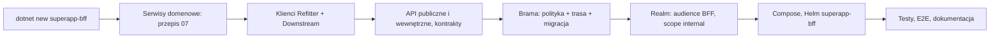

# Przepis 11: nowa experience i BFF

**Kiedy:** powstaje nowa funkcjonalność super appki z własnym modułem klienta, czyli nowa **experience**: moduł + **BFF
experience** + 1..n serwisów domenowych (ADR-0038). Nic w repozytorium nie zakłada, że experience jest tylko jedna; kolejne powstają
z tych samych szablonów. Gdy dokładasz serwis do istniejącej experience, wystarczy [przepis 07](07-nowy-serwis.md).

**Przykład w całym przepisie:** experience `Coaching` (małymi literami `coaching`), projekt `src/Bff/Coaching.Bff`, Deployment i
Service `coaching-bff` w namespace `coaching`, port lokalny 5121, trasa w bramie `/api/coaching/v{n}/**`, scope API wewnętrznego
`coaching.internal.read`. Wzorem jest istniejąca experience `example` (`src/Bff/Example.Bff`).

**Wyjaśnienia:** [02 Architektura w praktyce](../02-architektura-w-praktyce.md), [08 API i kontrakty](../08-api-i-kontrakty.md),
[09 Bezpieczeństwo](../09-bezpieczenstwo.md), [13 Lokalne środowisko](../13-lokalne-srodowisko-i-debugowanie.md), ADR-0037–0042.

## Szybka droga: `dotnet superapp add bff`

```bash
dotnet superapp add bff Coaching                                    # BFF, compose, Helm, brama (polityka, trasa, migracja), realm, testy architektury, EventId
dotnet superapp add service Plans --experience coaching --scope plan.read   # serwisy experience (przepis 07)
dotnet build SuperApp.slnx                                          # generuje kontrakt serwisu
dotnet superapp add client --bff coaching --service Plans           # klient Refitter, Program.cs, Downstream w appsettings, compose i Helm
```

`add bff` tworzy migrację bramy przez `dotnet ef`, który buduje bramę (`--skip-migration` zostawia ją jako następny krok).

Zostają po stronie zespołu:

- akcje API publicznego i wewnętrznego (kroki 4–5);
- testy (krok 10);
- ADR experience i dokumentacja (krok 12);
- wymagania dla działów CIAM i infrastruktury, w tym NetworkPolicy.

Usuwanie przebiega w odwrotnej kolejności:

1. `remove client`;
2. `remove service`;
3. `remove bff --yes`, które tworzy migrację usuwającą trasę.

Kroki poniżej opisują, co robi narzędzie.

## Przegląd



Czego BFF **nie** robi (ADR-0038, reguły testów architektury 12–14):

- nie ma bazy, modelu domeny ani migracji (bez `DbContext`);
- nie referuje projektów serwisów (nawet `{Serwis}.Contracts`) ani innych BFF: zna je wyłącznie przez klientów wygenerowanych z
  kontraktów;
- nie zawiera logiki biznesowej i nie zmienia stanu kilku domen w jednym żądaniu (to zdarzenia i sagi);
- nie waliduje treści żądań: walidacja i kody błędów należą do serwisów;
- nie woła serwisów domenowych innej experience, tylko API wewnętrzne jej BFF.

## 1. Wygeneruj projekt z szablonu

```bash
dotnet new install ./src/Tools/SuperApp.Cli/Templates/superapp-bff
dotnet new superapp-bff -n Coaching -o src/Bff

dotnet sln SuperApp.slnx add src/Bff/Coaching.Bff/Coaching.Bff.csproj src/Bff/Coaching.Bff.Tests/Coaching.Bff.Tests.csproj
dotnet sln SuperApp.sln add src/Bff/Coaching.Bff/Coaching.Bff.csproj src/Bff/Coaching.Bff.Tests/Coaching.Bff.Tests.csproj
```

Szablon zamienia `ExperienceName` na `Coaching`, a `experiencename` na `coaching`:

| Plik | Zawartość startowa |
|---|---|
| `Coaching.Bff/Program.cs` | `AddAppServiceDefaults("coaching-bff")`, `AddAppApi`, dwa dokumenty OpenAPI, wyłączona walidacja atrybutów (`ModelValidatorProviders.Clear()`, `ScopeAuthorizationResultHandler`; zob. `Example.Bff`), audyt API wewnętrznego (`InternalApiCallAudit`, EventId 230), polityka API wewnętrznego, komentarz z krokami dodania serwisu |
| `Coaching.Bff/Hosting/BffOpenApiDocuments.cs` | podział dokumentów po ścieżce (`internal/` → wewnętrzny), prefiks serwisu w nazwach schematów typów z `Clients/` |
| `Coaching.Bff/Security/CoachingBffScopes.cs` | `InternalRead = "coaching.internal.read"` |
| `Coaching.Bff/appsettings.json` | `Authentication:Audience = coaching-bff`, pusta sekcja `Downstream` |
| `Coaching.Bff/appsettings.Development.json` | lokalny Keycloak, pusta sekcja `Downstream` |
| `Coaching.Bff/Properties/launchSettings.json` | profil `coaching-bff` na porcie 5192 |
| `Coaching.Bff/Dockerfile` | build z katalogu głównego repozytorium, obraz `aspnet:10.0-noble-chiseled-extra`, non-root |
| `Coaching.Bff.Tests/ContractSplitTests.cs` | kontrakt publiczny tylko `/v...`, wewnętrzny tylko `/internal/v...`; każda operacja ma `operationId` i `security` |

Do zrobienia od razu:

- zmień port w `launchSettings.json` na wolny i spójny z compose (tu 5121; `example-bff` ma 5120);
- dodaj `ProjectReference` do `src/Bff/Coaching.Bff/Coaching.Bff.csproj` w `tests/SuperApp.ArchitectureTests/SuperApp.ArchitectureTests.csproj`.
  Testy architektury czytają zestawy z katalogu wyjściowego, więc BFF bez referencji nie jest sprawdzany (reguły 12–13 go pominą).

## 2. Serwisy domenowe experience

Każdy serwis domenowy tworzysz [przepisem 07](07-nowy-serwis.md), z dwiema różnicami:

- w `deploy/helm/superapp-service/values-{serwis}.yaml` ustaw `experience: coaching` (etykieta `app.kubernetes.io/part-of`, na której
  opierają się selektory NetworkPolicy, ADR-0041);
- prefiks scope serwisu dopisujesz do polityki **tej** experience w bramie (krok 7), a klienta i adres `Downstream` do
  `Coaching.Bff` (krok 3).

Serwis domenowy należy do jednej experience. Przyjmuje ruch tylko od BFF i serwisów tej experience (ADR-0041); serwis innej
experience nie może go wołać nawet „tylko do odczytu”.

## 3. Klienci serwisów (Refitter) i adresy

Dla każdego serwisu (przykład: serwis `Plans`):

1. `src/Bff/Coaching.Bff/Clients/Plans/plans.refitter`, kopia
   [`knowledge.refitter`](../../../src/Bff/Example.Bff/Clients/Knowledge/knowledge.refitter) z inną ścieżką kontraktu, przestrzenią
   nazw (`Coaching.Bff.Clients.Plans`) i nazwą interfejsu (`PlansApi`). Zostaw `typeAccessibility: Public` (typy są częścią
   kontraktu BFF), `returnIApiResponse: true` (błąd serwisu to odpowiedź, nie wyjątek) i
   `operationNameGenerator: SingleClientFromOperationId` (nazwy metod z `operationId` `{Controller}_{Action}`).
2. Generowanie (wynik w `Clients/Plans/Generated/PlansApi.cs`, commitowany, nigdy edytowany ręcznie):

   ```bash
   dotnet tool restore
   dotnet refitter --settings-file src/Bff/Coaching.Bff/Clients/Plans/plans.refitter
   ```

3. Rejestracja w `Program.cs` (przed `builder.Build()`):

   ```csharp
   builder.Services.AddDownstreamApi<IPlansApi>(builder.Configuration, "Plans").AddUserTokenForwarding();
   ```

4. Adres `Downstream:Plans:BaseAddress` w czterech miejscach:

   | Plik | Wartość |
   |---|---|
   | `Coaching.Bff/appsettings.json` | `http://plans-api.plans.svc.cluster.local:8080` (Service w klastrze) |
   | `Coaching.Bff/appsettings.Development.json` | `http://localhost:{port API serwisu}` (BFF z IDE) |
   | `deploy/local/docker-compose.yml`, usługa `coaching-bff` | `Downstream__Plans__BaseAddress` z aliasem kontenera serwisu (krok 8) |
   | `deploy/helm/superapp-bff/values-coaching.yaml` | `downstream.Plans` (krok 9) |

   Brak adresu zatrzymuje start BFF komunikatem `Brak poprawnego adresu Downstream:Plans:BaseAddress.`

**API wewnętrzne innej experience.** Gdy Coaching ma pokazać dane experience `example` (np. widget snu), BFF dostaje klienta z jej
kontraktu wewnętrznego, a nie z kontraktów jej serwisów:
`openApiPath` → `src/Bff/Example.Bff/openapi/Example.Bff_internal.json`, rejestracja
`AddDownstreamApi<IExampleInternalApi>(builder.Configuration, "Example").AddUserTokenForwarding()`, adres
`http://example-bff.example.svc.cluster.local:8080`. Token użytkownika musi wtedy mieć scope `example.internal.read`
([przepis 08](08-wywolanie-innego-serwisu.md), krok 0a).

## 4. API publiczne dla modułu

Kontrolery w `Controllers/{Serwis}/` (akcje przekazujące) i `Controllers/Experience/` (endpointy komponowane), wzorem `Example.Bff`:

- **Akcja przekazująca:** ścieżka `v1/{serwis}/...` odpowiadająca `v1/...` serwisu, jedno wyrażenie
  `this.ToActionResult(await client.XAsync(...))`, dokumentacja i `[ProducesResponseType]` przepisane z kontraktu serwisu
  ([przepis 01, krok 9](01-endpoint-komendy.md)). Odpowiedź serwisu, także błąd z `code`, idzie do modułu bez zmian; niedostępność
  serwisu to `503 downstream.unavailable` albo `504 downstream.timeout`.
- **Endpoint komponowany:** własne DTO w BFF, części ładowane równolegle przez `PartialResponseFetcher` z limitem czasu i statusem części odpowiedzi
  (wzór: `ExperienceSummaryController`, `GET /v1/me/summary`; [przepis 02](02-endpoint-zapytania.md), wariant C).
  `PartialResponseFetcher`, `ResponsePart<T>` i `ResponsePartStatus` są w `SuperApp.Framework.Infrastructure.Http.Downstream`, wspólne dla wszystkich BFF; limit czasu domyślnie 2 s, można podać własny.
- Bez własnych scope: API publiczne autoryzują serwisy na podstawie przekazanego tokenu (ADR-0040). BFF może sprawdzić uprawnienie
  wcześniej dla UX, ale serwis sprawdza zawsze.

## 5. API wewnętrzne dla innych experience

Tylko gdy inna experience naprawdę potrzebuje naszych danych; operacje projektujesz pod konsumenta („widget postępu”), nie jako
ogólny dostęp do domeny (ADR-0039). Wzór: `Controllers/Internal/InternalWidgetsController.cs` w `Example.Bff`.

```csharp
[ApiController]
[Authorize(Policy = CoachingBffScopes.InternalRead)]
[Tags("Internal – Widgets")]
public sealed class InternalWidgetsController(IPlansApi plans) : ControllerBase
{
    [HttpGet("internal/v1/widgets/plan-progress")]
    // ...
}
```

- Polityka jest już zarejestrowana w `Program.cs` z szablonu:
  `AddPolicy(CoachingBffScopes.InternalRead, policy => policy.RequireScope(CoachingBffScopes.InternalRead))` (`ScopePolicyExtensions`).
  Token bez scope dostaje 403.
- Ścieżka zaczyna się od `internal/v{n}`: po tym prefiksie `BffOpenApiDocuments` przydziela operację do kontraktu wewnętrznego, a
  brama nigdy jej nie routuje.
- Kontrakt wewnętrzny to umowa z innymi zespołami: tylko zmiany wstecznie zgodne; zmiana łamiąca to nowe `/internal/v{n+1}` z
  uzgodnionym terminem wygaszenia starej wersji.
- Wywołania systemowe (bez użytkownika) wymagają scope `coaching.internal.system.*`, uzasadnienia w dokumentacji operacji i audytu
  `azp` (ADR-0040). Dziś żadne takie wywołanie nie istnieje.

## 6. Kontrakty OpenAPI

`dotnet build` generuje oba dokumenty do katalogu z `OpenApiDocumentsDirectory` w csproj (`openapi/`): `Coaching.Bff_public.json`
(konsument: moduł) i `Coaching.Bff_internal.json` (konsumenci: BFF-y innych experience). Commitujesz je i przeglądasz w diffie jak kod.
Dokumenty mają `operationId`, schemat `Bearer` przy każdej operacji i `x-abstract` dla typów polimorficznych (transformery z
`SuperApp.Framework.Infrastructure/OpenApi`). Moduł generuje klienta wyłącznie z kontraktu publicznego BFF
([08 API i kontrakty](../08-api-i-kontrakty.md)).

## 7. Brama: polityka, trasa, migracja

Lokalna brama (`SuperApp.Gateway`) jest zamiennikiem wspólnej bramy organizacji (ADR-0037); ta zmiana jest jednocześnie wymaganiem wobec
wspólnej bramy na środowiskach.

1. `src/Gateway/SuperApp.Gateway/Security/GatewayPolicies.cs`: stała i rejestracja polityki experience (token musi mieć co najmniej jeden
   scope serwisów tej experience):

   ```csharp
   public const string Coaching = "coaching";
   // w Register:
   authorization.AddPolicy(Coaching, policy => policy.RequireAuthenticatedUser()
       .RequireAssertion(context => HasScopeOf(context.User, "plans.")));
   ```

2. `src/Gateway/SuperApp.Gateway/Persistence/Seed/ProxyConfigurationSeed.cs`, lista `Experiences`:

   ```csharp
   private static readonly (string Experience, string Policy)[] Experiences =
   [
       ("example", GatewayPolicies.Example),
       ("coaching", GatewayPolicies.Coaching),
   ];
   ```

   Seed generuje dla obu profili (`bff-web`, `gateway-mobile`) klaster `coaching`, cel
   `http://coaching-bff.coaching.svc.cluster.local:8080`, trasę `/api/coaching/v{version:int}/{**rest}` (polityka `coaching`,
   limit `per-user`, timeout 30 s) i transform `PathRemovePrefix /api/coaching`. Ścieżki `/internal` nie pasują do tej trasy.
3. Migracja bramy (zmiana danych konfiguracji, ADR-0022):

   ```bash
   dotnet ef migrations add RouteCoachingExperience -p src/Gateway/SuperApp.Gateway -s src/Gateway/SuperApp.Gateway \
     --context GatewayDbContext -o Persistence/Migrations
   # zmień nazwę {data}_RouteCoachingExperience.cs → RouteCoachingExperience.cs (ADR-0032); .Designer.cs zostaje
   ```

   Najpierw wdrażasz BFF, potem migrację: trasa do nieistniejącego Service daje błędy. Wzór migracji tylko z danymi:
   `RouteExperienceThroughBff.cs`.
4. Test `GatewayDatabaseTests.Seeded_routes_are_loaded_validated_and_invalid_changes_are_rejected` sprawdza dokładną listę tras
   (`["example-bff"]`): dopisz `coaching-bff`.

Nie dodawaj tras do serwisów domenowych ani do `/internal` (ADR-0039).

## 8. Lokalne środowisko

**Realm** `deploy/local/keycloak/realm-superapp.json` (wzór: client scopes `example-bff-audience` i `example.internal.read`):

- client scope `coaching-bff-audience` z mapperem `oidc-audience-mapper` (`included.custom.audience: coaching-bff`,
  `include.in.token.scope: false`), dopisany do `defaultClientScopes` klientów `bff-web`, `mobile-android`, `mobile-ios` i `dev-cli`.
  Bez niego BFF odrzuci token (401, zła audience);
- client scope `coaching.internal.read` z tym samym mapperem audience i `include.in.token.scope: true`, w `optionalClientScopes`
  klienta `dev-cli` (testy lokalne) i klientów experience, które go potrzebują;
- scope serwisów domenowych jak w [przepisie 07](07-nowy-serwis.md), krok 6.

Po zmianie: `docker compose -f deploy/local/docker-compose.yml up -d --force-recreate keycloak` (bez `down -v`, które kasuje bazę).

**Compose** `deploy/local/docker-compose.yml` (wzór: usługa `example-bff`):

```yaml
  coaching-bff:
    profiles: [app]
    build:
      context: ../..
      dockerfile: src/Bff/Coaching.Bff/Dockerfile
    environment:
      ASPNETCORE_ENVIRONMENT: Development
      Authentication__Authority: http://keycloak:8080/realms/superapp
      Authentication__RequireHttpsMetadata: "false"
      Downstream__Plans__BaseAddress: http://plans-api.plans.svc.cluster.local:8080
    ports:
      - "5121:8080"
    networks:
      default:
        aliases: [coaching-bff.coaching.svc.cluster.local]
    depends_on:
      plans-api:
        condition: service_started
      keycloak:
        condition: service_started
```

Alias równy adresowi z seeda bramy sprawia, że brama w kontenerze trafia do BFF bez zmian konfiguracji. Compose nie egzekwuje
NetworkPolicy: lokalnie serwisy i API wewnętrzne są osiągalne bezpośrednio, ale to tylko ułatwienie debugowania.

## 9. Wdrożenie: chart `superapp-bff`

`deploy/helm/superapp-bff/values-coaching.yaml` (wzór: `values-example.yaml`):

```yaml
experience: coaching
secretName: coaching-bff-secrets
downstream:
  Plans: http://plans-api.plans.svc.cluster.local:8080
```

- `experience` jest wymagane (render kończy się błędem bez niego): daje nazwę `coaching-bff`, audience tokenu `coaching-bff` i
  etykiety `app.kubernetes.io/part-of: coaching`, `superapp.example/experience-role: bff` (ADR-0041).
- Każdy wpis `downstream` staje się zmienną `Downstream__{Nazwa}__BaseAddress`; nazwa musi być taka jak w `AddDownstreamApi`.
- Chart wdrażasz w namespace `coaching`, bo brama kieruje ruch na `coaching-bff.coaching.svc.cluster.local`.
- Secret (External Secrets, ADR-0016) może być pusty; BFF nie ma bazy ani brokera.
- Wymagania wobec innych działów (ADR-0016): klient i scope w CIAM (`coaching-bff-audience`, `coaching.internal.*`), trasa we
  wspólnej bramie, reguły NetworkPolicy dla nowej experience (ADR-0041).

## 10. Testy

| Test | Gdzie | Wzór |
|---|---|---|
| podział kontraktów, `operationId` i `security` każdej operacji | `Coaching.Bff.Tests/ContractSplitTests.cs` (z szablonu) | `Example.Bff.Tests/ContractSplitTests.cs` |
| klient z `AddDownstreamApi`: daty ISO, przekazany token, typy polimorficzne | `Coaching.Bff.Tests` | `DownstreamClientTests` |
| przekazanie odpowiedzi i błędu serwisu bez zmian | `Coaching.Bff.Tests` | `DownstreamResponseTests`, `Responses.cs` |
| częściowe renderowanie endpointu komponowanego | `Coaching.Bff.Tests` | `PartialResponseFetcherTests` |
| BFF bez referencji do serwisów i innych BFF, bez `DbContext`; serwisy bez referencji do BFF | `SuperApp.ArchitectureTests` (reguły 12–14) | referencja w csproj z kroku 1 |
| trasy bramy | `SuperApp.Gateway.Tests` | krok 7.4 |

```bash
dotnet build SuperApp.slnx
dotnet test --project src/Bff/Coaching.Bff.Tests
dotnet test --solution SuperApp.slnx            # w tym testy architektury i bramy (Docker)
```

## 11. Sprawdzenie end-to-end

```bash
dotnet superapp doctor        # rejestracja BFF i jego klientów (compose, Helm, brama, Program.cs, appsettings)
docker compose -f deploy/local/docker-compose.yml --profile app up -d --build

TOKEN=$(curl -s http://localhost:8081/realms/superapp/protocol/openid-connect/token \
  -d grant_type=password -d client_id=dev-cli -d username=reader -d password=reader \
  -d "scope=openid plans.plan.read" | jq -r .access_token)

curl -sk -i https://localhost:5002/api/coaching/v1/plans/... -H "Authorization: Bearer $TOKEN"    # brama mobile → BFF → serwis: 200
curl -sk -i https://localhost:5002/api/coaching/internal/v1/widgets/plan-progress -H "Authorization: Bearer $TOKEN"
# brak trasy (nie dociera do BFF): brama nie routuje /internal
curl -s -i http://localhost:5121/internal/v1/widgets/plan-progress -H "Authorization: Bearer $TOKEN"
# 403: bez scope coaching.internal.read; z "-d scope=... coaching.internal.read" przy pobraniu tokenu: 200
```

Tak samo zweryfikowano experience `example`: `/api/example/v1/knowledge/materials` i `/api/example/v1/me/summary` przez bramę,
404 i 401 dla starych tras `/api/knowledge/...`, brak dostępu do `/api/example/internal/...` przez bramę, 200/403 dla
`http://localhost:5120/internal/v1/widgets/sleep-summary` z tokenem `dev-cli` ze scope `example.internal.read` i bez niego oraz
błąd serwisu przekazany bez zmian (404 `knowledge.material.not_found`).

## 12. Dokumentacja

| Miejsce | Zmiana |
|---|---|
| `docs/adr/` | ADR experience (zakres, serwisy, API wewnętrzne) |
| `docs/architektura.md` | bloki (5.x), wdrożenie (7.x), przepływy NetworkPolicy |
| `docs/logowanie-eventid.md` | kolejny wolny zakres tysiąca dla BFF (np. `7000–7999` dla `Coaching.Bff`), jeśli BFF ma własne logi |
| `docs/przewodnik/13-lokalne-srodowisko-i-debugowanie.md` | kontener i port BFF |
| `.github/copilot-instructions.md` | lista experience i BFF |

## Typowe błędy

| Objaw | Przyczyna | Naprawa |
|---|---|---|
| BFF nie startuje: `Brak poprawnego adresu Downstream:{Nazwa}:BaseAddress.` | brak adresu w konfiguracji albo inna nazwa niż w `AddDownstreamApi` | krok 3.4 |
| 401 z BFF, choć serwis przyjmuje ten sam token | token bez audience `coaching-bff` | client scope `coaching-bff-audience` jako domyślny klienta (krok 8) |
| `403 auth.forbidden` z bramy | token bez scope serwisów experience albo prefiks nie dopisany do polityki | krok 7.1 |
| 404 z bramy dla `/api/coaching/v1/...` | migracja bramy nie zastosowana albo brak trasy w seedzie | krok 7, uruchom Migrator |
| 502 z bramy | kontener BFF nie działa albo brak aliasu `coaching-bff.coaching.svc.cluster.local` | krok 8, compose |
| 503 `downstream.unavailable` z BFF | serwis nie działa albo zły adres `Downstream` | uruchom serwis, sprawdź adres |
| operacja wewnętrzna w kontrakcie publicznym | ścieżka bez prefiksu `internal/` | `[HttpGet("internal/v1/...")]`; `ContractSplitTests` to wykryje |
| testy architektury nie obejmują nowego BFF | brak `ProjectReference` w `SuperApp.ArchitectureTests.csproj` | krok 1 |
| test bramy czerwony po dodaniu trasy | `GatewayDatabaseTests` sprawdza dokładną listę tras | krok 7.4 |
